# Netty

Netty 中重要的几个点如下：

- java 原生NIO
- 拆包与粘包
- Netty 内存池
- Netty 时间轮
- Netty EventLoop 模型
- Netty Handlelr
- Netty writeAndFlush 流程
- Netty 内存泄漏排查


```
1、ChannelPool、ChannelPoolMap（Channel pool）
2、ObjectCleaner（添加删除）
3、PendingWrite（不重要）
4、DefaultPriorityQueue、RecyclableArrayList、ThreadLocalRandom
5、Recycler（对象池）
6、ResourceLeakDetector、ResourceLeakDetectorFactory（用于检测内存泄漏）
7、HashWheelTimer
8、ScheduledFutureTask
9、Promise、FastThreadLocal
10、EmbeddedChannel

```


## 关注点

### 客户端 ： 

- SocketChannel 什么时候 注册到Selector的
- SocketChannel 什么时候注册OP_READ事件的


### 服务端

- ServerSocketChannel 什么时候 注册到Selector的
- ServerSocketChannel 是什么时候注册Accept 事件，并且接收SocketChannel的
- NioEventLoop 是什么工作的
- Pipeline 的 TailContext 与 HeadContext
- writeAndFlush 的工作机制


### 协议

- Encoder 与 Decoder
- 协议序列化
- 拆包与粘包
- Netty 的事件机制
- Websocket 协议


## Netty 概览

Netty 是主要是针对nio进行包装的 网络协议框架，因为nio 底层的api 包括使用太过于晦涩，所以Netty由此诞生，Netty 中主要分为以下几个方面：

- 主从Reactor 模型实现，通过EventLoopGroup 与 EventExecuorGroup 实现
- 内存的划分，分为堆内内存和堆外内存 通过ByteBufAllocator 进行分配
- 协议 解码器与编码器
- writeAndFlush的流程
- 包括对于内存泄漏的追踪 Resource 


### EventLoopGroup

EventLoopGroup 实际就是Netty 依据于 主从Reactor的实现，Netty 在处理连接时都是通过EventLoop实现的，每个EventLoop 内部维护了一个Selector 用于监听注册在当前EventLoop 上的Channel 

为了及时接受（Accept）到新连接，在服务器端，一般有两个独立的反 应器，一个反应器负责新连接的监听和接受，另一个反应器负责IO事件轮询和分发，两个 反应器相互隔离

**（1）负责新连接的监听和接收的EventLoopGroup轮询组中的反应器（Reactor），完成 查询通道的新连接IO事件查询，这些反应器有点像负责招工的包工头，因此，该轮询组可 以形象地称为“包工头”（Boss）轮询组**

**（2） 另一个轮询组中的反应器（Reactor），完成查询所有子通道的IO事件，并且执行 对应的Handler处理器完成IO处理——例如数据的输入和输出（有点儿像搬砖），这个轮询 组可以形象地称为“工人”（Worker）轮询组**

如果使用EventLoopGroup的无参数的构造函数，没有传入线程数量或者传入的数量为0，EventLoopGroup内部线程数 量为最大可用的CPU处理器数量的2倍。假设电脑使用的是4核的CPU，那么在内部会启动8个EventLoop线程，相当8个子反应器（SubReactor）实例

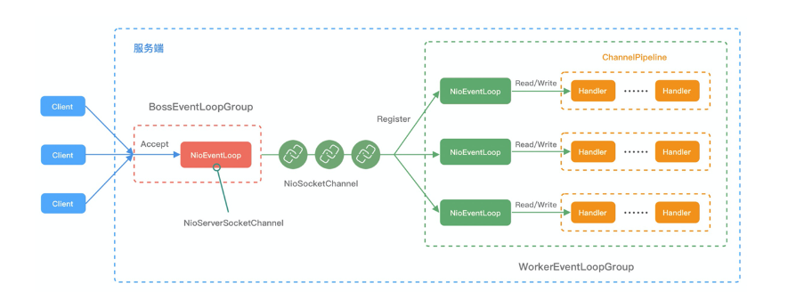


结合上面介绍的 Netty Reactor 模型，介绍服务端 Netty 的工作架构图：

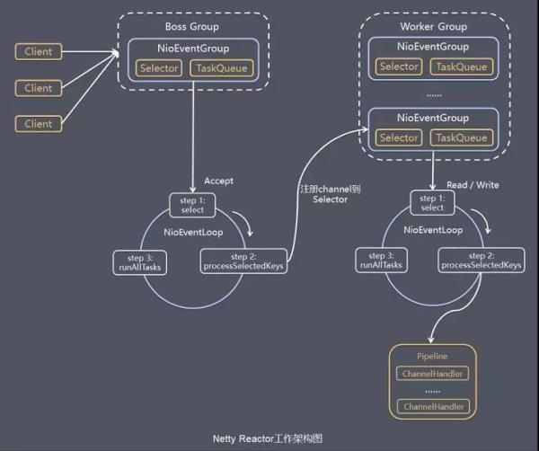

Server 端包含 1 个 Boss NioEventLoopGroup 和 1 个 Worker NioEventLoopGroup。

NioEventLoopGroup 相当于 1 个事件循环组，这个组里包含多个事件循环 NioEventLoop，每个 NioEventLoop 包含 1 个 Selector 和 1 个事件循环线程。

- Boss

  - 每个 Boss NioEventLoop 循环执行的任务包含 3 步：
  - 轮询 Accept 事件。
  - 处理 Accept I/O 事件，与 Client 建立连接，生成 NioSocketChannel，并将 NioSocketChannel 注册到某个 Worker NioEventLoop 的 Selector 上。
  - 处理任务队列中的任务，runAllTasks。任务队列中的任务包括用户调用 eventloop.execute 或 schedule 执行的任务，或者其他线程提交到该 eventloop 的任务。

- Worker

  - 每个 Worker NioEventLoop 循环执行的任务包含 3 步：
  - 轮询 Read、Write 事件。
  - 处理 I/O 事件，即 Read、Write 事件，在 NioSocketChannel 可读、可写事件发生时进行处理。
  - 处理任务队列中的任务，runAllTasks。


### BootStrap

Bootstrap类是Netty提供的一个便利的工厂类，可以通过它来完成Netty的客户端或服务 器端的Netty组件的组装，以及Netty程序的初始化和启动执行。

在Netty中，有两个引导类，分别用在服务器和客户端中使用，如图6-7所示。 

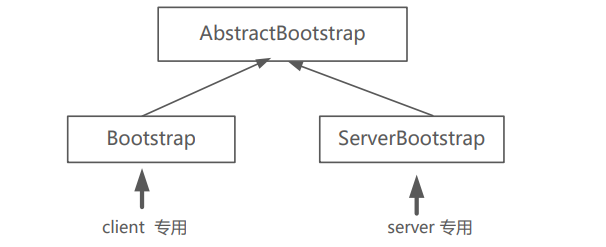


#### 配置group

第1步：创建反应器轮询组，并设置到ServerBootstrap引导类实例，大致的代码如下

```java
//创建反应器轮询组 
//boss 轮询组 
EventLoopGroup bossLoopGroup = new NioEventLoopGroup(1); 
//worker 轮询组 
EventLoopGroup workerLoopGroup = new NioEventLoopGroup(); 

//step1：为引导类实例设置反应器轮询组 
b.group(bossLoopGroup, workerLoopGroup);
```

在设置反应器轮询组之前，创建了两个NioEventLoopGroup轮询组，一个负责处理连接 监听IO事件，名为bossLoopGroup；另一个负责数据传输事件和处理，名为

workerLoopGroup。在两个轮询组创建完成后，就可以配置给引导类实例，它一次性地给引 导类配置了两大轮询组


#### 配置 channel

设置通道的IO类型。Netty不止支持Java NIO，也支持阻塞式的OIO（也叫BIO，Block-IO，即阻塞式IO）。下面配置的是Java NIO类型的通道类型，大致如下

```java
//step2：设置传输通道的类型为 nio 类型 
b.channel(NioServerSocketChannel.class)
```


#### 配置端口

第3步：设置监听端口，大致的代码如下： 

```javascript
//step3：设置监听端口  
b.localAddress(new InetSocketAddress(port)); 
```


#### 配置options

第4步：设置传输通道的配置选项，大致的代码如下

```java
//step4：设置通道的参数 
b.option(ChannelOption.SO_KEEPALIVE, true); 
b.option(ChannelOption.ALLOCATOR, PooledByteBufAllocator.DEFAULT); 


//如果是需要配置子group的则需要通过 childOptions进行配置
b.childOptions(ChannelOption.ALLOCATOR, PooledByteBufAllocator.DEFAULT); 
```


#### 配置pipeline

step5：装配子通道流水线，一般通过 ChannelInitializer 进行配置

```java
//step5：装配子通道流水线 
b.childHandler(new ChannelInitializer<SocketChannel>() { 
     //有连接到达时会创建一个通道的子通道，并初始化 
     protected void initChannel(SocketChannel ch)...{ 
     // 这里可以管理子通道中的 Handler 业务处理器 
     // 向子通道流水线添加一个 Handler 业务处理器 
     ch.pipeline().addLast(new NettyDiscardHandler()); 
     } 
});
```

为什么仅装配子通道的流水线，而不需要装配父通道的流水线呢？

原因是：父通道也 就是NioServerSocketChannel的内部业务处理是固定的：接受新连接后，创建子通道，然后 初始化子通道，所以不需要特别的配置，由Netty自行进行装配。当然，如果需要完成特殊 的父通道业务处理，可以类似的使用ServerBootstrap的handler(ChannelHandler handler)方 法，为父通道设置ChannelInitializer初始化器


#### 调用bind 或者是connect

第6步：开始绑定服务器新连接的监听端口，大致的代码如下： 

```java

 //step6：开始绑定端口，通过调用 sync 同步方法阻塞直到绑定成功 
ChannelFuture channelFuture = b.bind().sync(); 
Logger.info(" 服务器启动成功，监听端口: " + 
channelFuture.channel().localAddress());
```

b.bind()方法的功能：返回一个端口绑定Netty的异步任务channelFuture。在这里，并没有给channelFuture异步任务增加回调监听器，而是阻塞channelFuture异步任务，直到端口绑定任务执行完成


#### 调用CloseFuture.sync

step7：自我阻塞，直到通道关闭的异步任务结束 

```java
//自我阻塞,直到通道关闭，一般这里是不会关闭的，因为内部会通过EventLoop进行自我循环接收新的连接
ChannelFuture closeFuture = channelFuture.channel().closeFuture(); 
closeFuture.sync();
```


#### 关闭 EventLoopFGroup

关闭Reactor反应器轮询组，同时会关闭内部的SubReactor子反应器线程，也会关闭内 部的Selector选择器、内部的轮询线程以及负责查询的所有的子通道。在子通道关闭后，会 释放掉底层的资源，如Socket文件描述符等

```java
//step8：释放掉所有资源，包括创建的反应器线程 
workerLoopGroup.shutdownGracefully(); 
bossLoopGroup.shutdownGracefully(); 
```


## Netty 核心

### EventExecutorGroup

EventExecutorGroup 主要用于创建用于执行io的EventExecutor 或者是 EventLoop，继承关系如下：

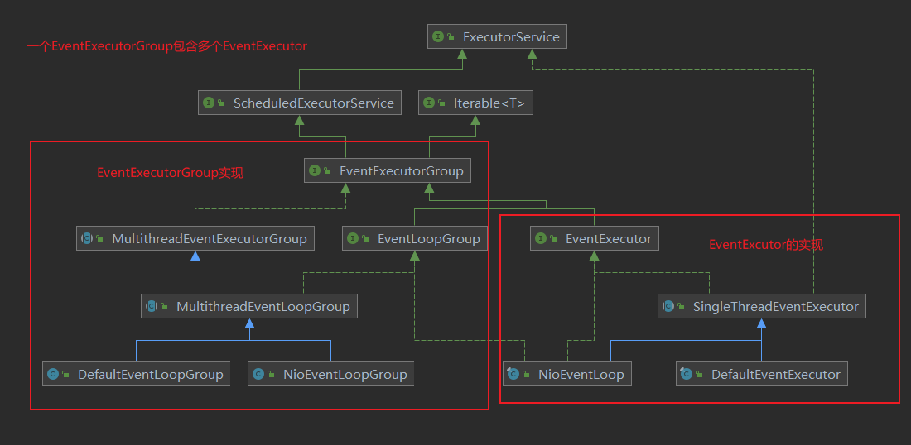


1、EventLoop 大多是继承自 SingleThreadEventExecutor 实现，EventLoop 主要用于执行IO任务，而SingleThreadEventExecutor 用于执行普通任务

2、NioEventLoopGroup 则是继承自 MultithreadEventExecutorGroup，用于管理所有的EventExecutor 线程


### EventExecutorGroup 创建流程

```java
protected MultithreadEventExecutorGroup(int nThreads, Executor executor,
                                        EventExecutorChooserFactory chooserFactory, Object... args) {
    if (nThreads <= 0) {
        throw new IllegalArgumentException(String.format("nThreads: %d (expected: > 0)", nThreads));
    }

    if (executor == null) {
        executor = new ThreadPerTaskExecutor(newDefaultThreadFactory());
    }

    //创建EventExecutor 数组
    children = new EventExecutor[nThreads];

    //根据传入的nThreads 生成EventExecutor线程对象
    for (int i = 0; i < nThreads; i ++) {
        boolean success = false;
        try {
            
            //调用模板方法进行创建，不通的EventLoopGroup实现，有不同的EventExecutor实现
            children[i] = newChild(executor, args);
            success = true;
        } catch (Exception e) {
            // TODO: Think about if this is a good exception type
            throw new IllegalStateException("failed to create a child event loop", e);
        } finally {
            if (!success) {
                for (int j = 0; j < i; j ++) {
                    children[j].shutdownGracefully();
                }

                for (int j = 0; j < i; j ++) {
                    EventExecutor e = children[j];
                    try {
                        while (!e.isTerminated()) {
                            e.awaitTermination(Integer.MAX_VALUE, TimeUnit.SECONDS);
                        }
                    } catch (InterruptedException interrupted) {
                        // Let the caller handle the interruption.
                        Thread.currentThread().interrupt();
                        break;
                    }
                }
            }
        }
    }

    //这里会创建chooser，chooser 是用来选择下一个EventLoop，底层通过RoundRonbin 实现， AtomicInteger.increment & child.size - 1
    chooser = chooserFactory.newChooser(children);

    final FutureListener<Object> terminationListener = new FutureListener<Object>() {
        @Override
        public void operationComplete(Future<Object> future) throws Exception {
            if (terminatedChildren.incrementAndGet() == children.length) {
                terminationFuture.setSuccess(null);
            }
        }
    };

    for (EventExecutor e: children) {
        e.terminationFuture().addListener(terminationListener);
    }

    Set<EventExecutor> childrenSet = new LinkedHashSet<EventExecutor>(children.length);
    Collections.addAll(childrenSet, children);
    readonlyChildren = Collections.unmodifiableSet(childrenSet);
}


@Override
public EventExecutor next() {
    
    //通过轮询获取下一个EventExecutor，也就是EventLoop实现
    return chooser.next();
}
```


### NioEventLoop

在 Netty 中 EventLoop 可以理解为 Reactor 线程模型的事件处理引擎，每个 EventLoop 线程都维护一个 Selector 选择器和任务队列 taskQueue。它主要负责处理 I/O 事件、普通任务和定时任务。

- run() -> for(;;) 通过execute执行任务时会判断线程是否启动，如果没有则启动线程
- sellect（） 检查是否有io 事件，包括检查是否存在空轮训bug
- processSelectedKeys（）[处理io 事件]
- runAllTasks： 处理异步任务队列 以及定时任务


#### run 方法

NioEventLoop 的run方法主要包括三个步骤，分别是select、processSelectedKeys 以及 runAllTasks 三部分

```java
//1、通过execute 执行任务
public void execute(Runnable task) {
        if (task == null) {
            throw new NullPointerException("task");
        }
 	    
        //判断是否是Netty 的 io线程
        boolean inEventLoop = inEventLoop();
        
     	//将任务添加到队列中
        addTask(task);
        //如果不是Netty的io线程，那么可能是刚启动时的外部线程
        if (!inEventLoop) {
            //启动Netty的io线程
            startThread();
            if (isShutdown() && removeTask(task)) {
                reject();
            }
        }

        if (!addTaskWakesUp && wakesUpForTask(task)) {
            wakeup(inEventLoop);
        }
    }
```


#### select 方法

select 方法主要是用于阻塞监听是否有对应的Select 事件

```java
private void select(boolean oldWakenUp) throws IOException {
    Selector selector = this.selector;
    try {
        int selectCnt = 0;
        long currentTimeNanos = System.nanoTime();
        //计算select需要阻塞的时间，这里delayNanos方法是通过定时任务队列来进行计算的
        // 1、判断定时任务队列中是否有任务，如果有任务则返回第一个任务的delayTime
        // 2、如果定时任务队列没有定时任务，则返回默认delayTime 为 60s
        long selectDeadLineNanos = currentTimeNanos + delayNanos(currentTimeNanos);

        for (;;) {
            //计算需要阻塞的延时时间
            long timeoutMillis = (selectDeadLineNanos - currentTimeNanos + 500000L) / 1000000L;
            
            //如果延时时间 <= 0 表示当前的定时任务已经可以执行了，直接通过selector.selectNow查询底层事件，并且返回
            if (timeoutMillis <= 0) {
                if (selectCnt == 0) {
                    selector.selectNow();
                    selectCnt = 1;
                }
                break;
            }

            // If a task was submitted when wakenUp value was true, the task didn't get a chance to call
            // Selector#wakeup. So we need to check task queue again before executing select operation.
            // If we don't, the task might be pended until select operation was timed out.
            // It might be pended until idle timeout if IdleStateHandler existed in pipeline.
            // 判断任务队列中是否有相应的任务，如果存在相应的任务，则直接返回，这里会把wakeUp的状态改为true
            if (hasTasks() && wakenUp.compareAndSet(false, true)) {
                selector.selectNow();
                selectCnt = 1;
                break;
            }
  
            //调用selector.select 进行阻塞，监听io事件
            int selectedKeys = selector.select(timeoutMillis);
            selectCnt ++;

            // selectedKeys !=0 表示有相应的io事件
            // oldWakenUp：表示
            // wakenUp.get()：由外部线程通过selector.wakeUp 进行唤醒
            // hasTasks：任务队列有任务
            // hasScheduledTasks：定时任务队列有定时任务
            if (selectedKeys != 0 || oldWakenUp || wakenUp.get() || hasTasks() || hasScheduledTasks()) {
                // - Selected something,
                // - waken up by user, or
                // - the task queue has a pending task.
                // - a scheduled task is ready for processing
                break;
            }
            
            //判断是否是线程中断引起的，如果是则直接返回
            if (Thread.interrupted()) {
                // Thread was interrupted so reset selected keys and break so we not run into a busy loop.
                // As this is most likely a bug in the handler of the user or it's client library we will
                // also log it.
                //
                // See https://github.com/netty/netty/issues/2426
                if (logger.isDebugEnabled()) {
                    logger.debug("Selector.select() returned prematurely because " +
                            "Thread.currentThread().interrupt() was called. Use " +
                            "NioEventLoop.shutdownGracefully() to shutdown the NioEventLoop.");
                }
                selectCnt = 1;
                break;
            }

		   // 获取当前的时间
            long time = System.nanoTime();
            
            //通过当前时间 - 阻塞时间 判断是否 >= 开始的时间，如果不成立表示selector是由于nio底层空轮训bug引起的
            if (time - TimeUnit.MILLISECONDS.toNanos(timeoutMillis) >= currentTimeNanos) {
                // timeoutMillis elapsed without anything selected.
                // 如果 判断成立则重置selectCnt
                selectCnt = 1;
            } 
            // 如果 selectCnt > 512 则重新创建selector，因为在nio底层的空轮训bug时，selector会直接返回，
            // 那么每次执行selectCnt就是自增，直到selectCnt = 512 时，就会重置selector
            else if (SELECTOR_AUTO_REBUILD_THRESHOLD > 0 &&
                    selectCnt >= SELECTOR_AUTO_REBUILD_THRESHOLD) {
                // The selector returned prematurely many times in a row.
                // Rebuild the selector to work around the problem.
                logger.warn(
                        "Selector.select() returned prematurely {} times in a row; rebuilding Selector {}.",
                        selectCnt, selector);
				
			   //重新创建一个新的selector
                rebuildSelector();
                selector = this.selector;

                // Select again to populate selectedKeys.
                selector.selectNow();
                selectCnt = 1;
                break;
            }

            currentTimeNanos = time;
        }

        if (selectCnt > MIN_PREMATURE_SELECTOR_RETURNS) {
            if (logger.isDebugEnabled()) {
                logger.debug("Selector.select() returned prematurely {} times in a row for Selector {}.",
                        selectCnt - 1, selector);
            }
        }
    } catch (CancelledKeyException e) {
        if (logger.isDebugEnabled()) {
            logger.debug(CancelledKeyException.class.getSimpleName() + " raised by a Selector {} - JDK bug?",
                    selector, e);
        }
        // Harmless exception - log anyway
    }
}
```


#### processSelectedKeys 

processSelectedKeys  用于处理所有的SelectedKey事件，对于不同的Channel 有不同的实现，如果ServerSocketChannel 则关注的 ACCEPT 事件，如果是SocketChannel 则关注的READ、WRITE 事件

```java
//用于处理IO事件
private void processSelectedKey(SelectionKey k, AbstractNioChannel ch) {
        final AbstractNioChannel.NioUnsafe unsafe = ch.unsafe();
        //如果key失效的话，就关闭当前channel
        if (!k.isValid()) {
      		//代码省略...
        }

        try {
            //获取就绪的事件,根据不同的事件进行处理
            int readyOps = k.readyOps();
            // We first need to call finishConnect() before try to trigger a read(...) or write(...) as otherwise
            // the NIO JDK channel implementation may throw a NotYetConnectedException.
            //如果是CONNECT 事件，则需要将当前Connection 事件从interestOps移除，否则会导致异常
            if ((readyOps & SelectionKey.OP_CONNECT) != 0) {
                // remove OP_CONNECT as otherwise Selector.select(..) will always return without blocking
                // See https://github.com/netty/netty/issues/924
                int ops = k.interestOps();
                ops &= ~SelectionKey.OP_CONNECT;
                k.interestOps(ops);

                unsafe.finishConnect();
            }

		   // 处理 WRITE 事件，调用forceFlush 处理
            // Process OP_WRITE first as we may be able to write some queued buffers and so free memory.
            if ((readyOps & SelectionKey.OP_WRITE) != 0) {
                // Call forceFlush which will also take care of clear the OP_WRITE once there is nothing left to write
                ch.unsafe().forceFlush();
            }
 		    
            //如果是 OP_READ 事件或者是 OP_ACCEPT 则调用 unsfae.read 进行读取
            // Also check for readOps of 0 to workaround possible JDK bug which may otherwise lead
            // to a spin loop
            if ((readyOps & (SelectionKey.OP_READ | SelectionKey.OP_ACCEPT)) != 0 || readyOps == 0) {
                unsafe.read();
            }
        } catch (CancelledKeyException ignored) {
            unsafe.close(unsafe.voidPromise());
        }
    }
```

上面看到 如果是 OP_READ 事件或者是 OP_ACCEPT 则调用 unsfae.read 进行读取，不通的Channel 有不同的Unsafe 实现，

- 如果是ServerSocketChannel 则会读取新的连接，然后通过ServerBootAcceptor 处理器将新的SocketChannel 注册到EventLoop 上，并且注册相应的SelectedKey事件
- 如果是SocketChannel 则会通过ByteBufAllocHandller 开辟一块内存用于读取网络流数据


#### runAllTasks

runAllTasks 用于处理所有的非io任务，既我们自定义的任务，并且执行时间可以通过ioRatio进行调节，runAllTasks 被定义在了父类SingleThreadEventExecutor 中，这表示可以调用父类来处理所有的非io任务，run

```java
protected boolean runAllTasks() {
        assert inEventLoop();
        boolean fetchedAll;
        boolean ranAtLeastOne = false;

        do {
        	//从任务任务中获取任务添加到taskQueue中
            fetchedAll = fetchFromScheduledTaskQueue();
            //执行所有的非io任务
            if (runAllTasksFrom(taskQueue)) {
                ranAtLeastOne = true;
            }
        } while (!fetchedAll); // keep on processing until we fetched all scheduled tasks.

        if (ranAtLeastOne) {
            lastExecutionTime = ScheduledFutureTask.nanoTime();
        }
        afterRunningAllTasks();
        return ranAtLeastOne;
    }


private boolean fetchFromScheduledTaskQueue() {
        long nanoTime = AbstractScheduledEventExecutor.nanoTime();
        //从定时任务队列中获取第一个任务，判断任务是否到期，如果没有到期则返回null
        Runnable scheduledTask  = pollScheduledTask(nanoTime);
        while (scheduledTask != null) {
            if (!taskQueue.offer(scheduledTask)) {
                // No space left in the task queue add it back to the scheduledTaskQueue so we pick it up again.
                scheduledTaskQueue().add((ScheduledFutureTask<?>) scheduledTask);
                return false;
            }
            scheduledTask  = pollScheduledTask(nanoTime);
        }
        return true;
    }
```


### Netty Server的启动流程


### 新连接接入


### Netty Client 端启动流程


### TailContext 与 HeadContext


## Channel

### AbstractChannel


### AbstractNioChannel


### AbstractNioMessageChannel


### AbstractNioByteChannel


### Channel 常用方法

**方法 1. ChannelFuture connect(SocketAddress address) **

此方法的作用为：连接远程服务器。方法的参数为远程服务器的地址，调用后会立即 返回，其返回值为执行连接操作的异步任务ChannelFuture。此方法在客户端的传输通道使用


**方法 2. ChannelFuture bind（SocketAddress address） **

此方法的作用为：绑定监听地址，开始监听新的客户端连接。此方法在服务器的新连 接监听和接收通道使用。 


**方法 3. ChannelFuture close() **

此方法的作用为：关闭通道连接，返回连接关闭的ChannelFuture异步任务。如果需要 在连接正式关闭后执行其他操作，则需要为异步任务设置回调方法；或者调用ChannelFuture异步任务的sync( ) 方法来阻塞当前线程，一直等到通道关闭的异步任务执行 完毕


**方法 4. Channel read() **

此方法的作用为：读取通道数据，并且启动入站处理。具体来说，从内部的Java NIO  Channel通道读取数据，然后启动内部的Pipeline流水线，开启数据读取的入站处理。此方 法的返回通道自身用于链式调用


**方法 5. ChannelFuture write（Object o） **

此方法的作用为：启程出站流水处理，把处理后的最终数据写到底层通道（如Java  NIO通道）。此方法的返回值为出站处理的异步处理任务。


**方法 6. Channel flush() **

此方法的作用为：将缓冲区中的数据立即写出到对端。调用前面的write(…)出站处理 时，并不能将数据直接写出到对端，write操作的作用在大部分情况下仅仅是写入到操作系 统的缓冲区，操作系统会将根据缓冲区的情况，决定什么时候把数据写到对端。而执flush()方法立即将缓冲区的数据写到对端。 

上面的6种方法，仅仅是比较常见的通道方法。在Channel接口中以及各种通道的实现 类中，还定义了大量的通道操作方法。在一般的日常的开发中，如果需要用到，请直接查 阅Netty API文档或者Netty源代码


### SocketChannel

初始化

1、processSelectKeys（）

2、unsafe.read()： 这里通过accept来获取连接

3、ServerBootstrapAcceptor：将获取的channel 注册到相应的selector上并且设置pipeline 以及相关属性


## ChannelPipeline

保存 ChannelHandler 的 List，用于处理或拦截 Channel 的入站事件和出站操作。

ChannelPipeline 实现了一种高级形式的拦截过滤器模式，使用户可以完全控制事件的处理方式，以及 Channel 中各个的 ChannelHandler 如何相互交互。

下图引用 Netty 的 Javadoc 4.1 中 ChannelPipeline 的说明，描述了 ChannelPipeline 中 ChannelHandler 通常如何处理 I/O 事件。

I/O 事件由 ChannelInboundHandler 或 ChannelOutboundHandler 处理，并通过调用 ChannelHandlerContext 中定义的事件传播方法。

例如 ChannelHandlerContext.fireChannelRead（Object）和 ChannelOutboundInvoker.write（Object）转发到其最近的处理程序。

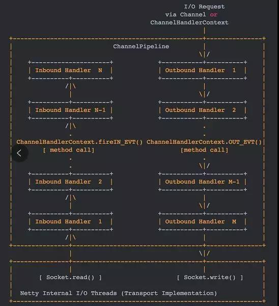

入站事件由自下而上方向的入站处理程序处理，如图左侧所示。入站 Handler 处理程序通常处理由图底部的 I/O 线程生成的入站数据。

通常通过实际输入操作（例如 SocketChannel.read（ByteBuffer））从远程读取入站数据。

出站事件由上下方向处理，如图右侧所示。出站 Handler 处理程序通常会生成或转换出站传输，例如 write 请求。

I/O 线程通常执行实际的输出操作，例如 SocketChannel.write（ByteBuffer）。

在 Netty 中每个 Channel 都有且仅有一个 ChannelPipeline 与之对应，它们的组成关系如下：

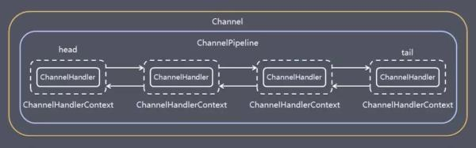

**一个 Channel 包含了一个 ChannelPipeline，而 ChannelPipeline 中又维护了一个由 ChannelHandlerContext 组成的双向链表，并且每个 ChannelHandlerContext 中又关联着一个 ChannelHandler。**

入站事件和出站事件在一个双向链表中，入站事件会从链表 head 往后传递到最后一个入站的 handler，出站事件会从链表 tail 往前传递到最前一个出站的 handler，两种类型的 handler 互不干扰。


## Handler

### Netty 的入站、出站流程

Netty 的入站和出站包含两部分，分别是出站以及入站，入站是通过HeadContext向下进行传播，而出站则是通过tailContext向上传播，如下图：


#### ChannelInboundHandler

ChannelInboundHandler 主要用于处理入站的数据，就是从网络socket流入Netty的数据，这么形容可能不是很恰当，但是大体意思是这样

**1. ChannelInboundHandler 的事件回调方法与触发时机。**

| 事件回调方法              | 触发时机                                           |
| :------------------------ | :------------------------------------------------- |
| channelRegistered         | Channel 被注册到 EventLoop                         |
| channelUnregistered       | Channel 从 EventLoop 中取消注册                    |
| channelActive             | Channel 处于就绪状态，可以被读写                   |
| channelInactive           | Channel 处于非就绪状态Channel 可以从远端读取到数据 |
| channelRead               | Channel 可以从远端读取到数据                       |
| channelReadComplete       | Channel 读取数据完成                               |
| userEventTriggered        | 用户事件触发时                                     |
| channelWritabilityChanged | Channel 的写状态发生变化                           |


#### ChannelOutBoundHandler

ChannelOutBoundHandeler 则是主要针对Netty写入网络Socket的事件，当然也包括 bind、connect、read 等等

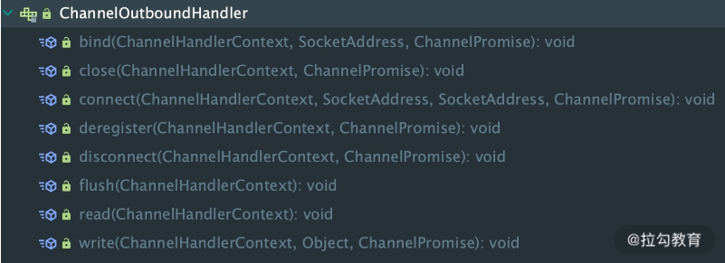

1、bind 

监听地址（IP+端口）绑定：完成底层Java IO通道的IP地址绑定。如果使用TCP传输协 议，这个方法用于服务器端。

2、 connect 

连接服务端：完成底层Java IO通道的服务器端的连接操作。如果使用TCP传输协议， 这个方法用于客户端。

3、write 

写数据到底层：完成Netty通道向底层Java IO 通道的数据写入操作。此方法仅仅是触 发一下操作而已，并不是完成实际的数据写入操作

4、 flush 

将底层缓存区的数据腾空，立即写出到对端

5、 read 

从底层读数据：完成Netty通道从Java IO通道的数据读取

6、 disConnect 

断开服务器连接：断开底层Java IO通道的socket连接。如果使用TCP传输协议，此方法 主要用于客户端

7、close 

主动关闭通道：关闭底层的通道，例如服务器端的新连接监听通道。 

上面介绍的并不是ChannelOutboundHandler的全部方法，仅仅介绍了其中几个比较重 要的方法。在Netty中，它的默认实现为ChannelOutboundHandlerAdapter，在实际开发中， 只需要继承这个ChannelOutboundHandlerAdapter默认实现，重写自己需要的方法即可


### 粘包、拆包

TCP 传输协议是面向流的，没有数据包界限。客户端向服务端发送数据时，可能将一个完整的报文拆分成多个小报文进行发送，也可能将多个报文合并成一个大的报文进行发送。因此就有了拆包和粘包。

为什么会出现拆包/粘包现象呢？在网络通信的过程中，每次可以发送的数据包大小是受多种因素限制的，如 MTU 传输单元大小、MSS 最大分段大小、滑动窗口等。如果一次传输的网络包数据大小超过传输单元大小，那么我们的数据可能会拆分为多个数据包发送出去。如果每次请求的网络包数据都很小，一共请求了 10000 次，TCP 并不会分别发送 10000 次。因为 TCP 采用的 Nagle 算法对此作出了优化。如果你是一位网络新手，可能对这些概念并不非常清楚。那我们先了解下计算机网络中 MTU、MSS、Nagle 这些基础概念以及它们为什么会造成拆包/粘包问题。

#### MTU 最大传输单元和 MSS 最大分段大小

**MTU（Maxitum Transmission Unit）** 是链路层一次最大传输数据的大小。MTU 一般来说大小为 1500 byte。**MSS（Maximum Segement Size）** 是指 TCP 最大报文段长度，它是传输层一次发送最大数据的大小。如下图所示，MTU 和 MSS 一般的计算关系为：MSS = MTU - IP 首部 - TCP首部，如果 MSS + TCP 首部 + IP 首部 > MTU，那么数据包将会被拆分为多个发送。这就是拆包现象。

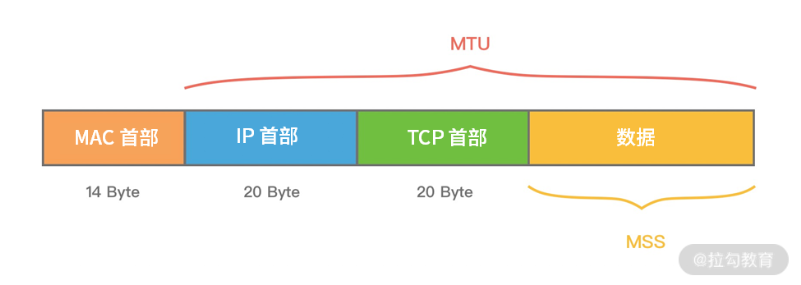


#### 滑动窗口

**滑动窗口**是 TCP 传输层用于流量控制的一种有效措施，也被称为**通告窗口**。滑动窗口是数据接收方设置的窗口大小，随后接收方会把窗口大小告诉发送方，以此限制发送方每次发送数据的大小，从而达到流量控制的目的。这样数据发送方不需要每发送一组数据就阻塞等待接收方确认，允许发送方同时发送多个数据分组，每次发送的数据都会被限制在窗口大小内。由此可见，滑动窗口可以大幅度提升网络吞吐量。

那么 TCP 报文是怎么确保数据包按次序到达且不丢数据呢？首先，所有的数据帧都是有编号的，TCP 并不会为每个报文段都回复 ACK 响应，它会对多个报文段回复一次 ACK。假设有三个报文段 A、B、C，发送方先发送了B、C，接收方则必须等待 A 报文段到达，如果一定时间内仍未等到 A 报文段，那么 B、C 也会被丢弃，发送方会发起重试。如果已接收到 A 报文段，那么将会回复发送方一次 ACK 确认。


#### Nagle 算法

**Nagle 算法**于 1984 年被福特航空和通信公司定义为 TCP/IP 拥塞控制方法。它主要用于解决频繁发送小数据包而带来的网络拥塞问题。试想如果每次需要发送的数据只有 1 字节，加上 20 个字节 IP Header 和 20 个字节 TCP Header，每次发送的数据包大小为 41 字节，但是只有 1 字节是有效信息，这就造成了非常大的浪费。Nagle 算法可以理解为**批量发送**，也是我们平时编程中经常用到的优化思路，它是在数据未得到确认之前先写入缓冲区，等待数据确认或者缓冲区积攒到一定大小再把数据包发送出去。

Linux 在默认情况下是开启 Nagle 算法的，在大量小数据包的场景下可以有效地降低网络开销。但如果你的业务场景每次发送的数据都需要获得及时响应，那么 Nagle 算法就不能满足你的需求了，因为 Nagle 算法会有一定的数据延迟。你可以通过 Linux 提供的 TCP_NODELAY 参数禁用 Nagle 算法。Netty 中为了使数据传输延迟最小化，就默认禁用了 Nagle 算法，这一点与 Linux 操作系统的默认行为是相反的。


### ChannelInitializer

Channel通道和Handler业务处理器的关系是：一条Netty的通道拥有 一条Handler业务处理器流水线，负责装配自己的Handler业务处理器。装配Handler的工 作，发生在通道开始工作之前。现在的问题是：如果向流水线中装配业务处理器呢？这就 得借助通道的初始化处理器——ChannelInitializer

```java
//step5：装配子通道流水线 
b.childHandler(new ChannelInitializer<SocketChannel>() { 
     //有连接到达时会创建一个通道的子通道，并初始化 
     protected void initChannel(SocketChannel ch)...{ 
     // 这里可以管理子通道中的 Handler 业务处理器 
     // 向子通道流水线添加一个 Handler 业务处理器 
     ch.pipeline().addLast(new NettyDiscardHandler()); 
     } 
}); 

```

上面的ChannelInitializer也是通道初始化器，属于入站处理器的类型。在示例代码中， 使用了ChannelInitializer的initChannel() 方法。initChannel()方法是ChannelInitializer定义的 一个抽象方法，这个抽象方法需要开发人员自己实现。 

在通道初始化时，会调用提前注册的初始化处理器的initChannel(…)方法。比如，在父 通道接收到新连接并且要初始化其子通道时，会调用初始化器的initChannel(…)方法，并且 会将新接收的通道作为参数，传递给此方法


### writeAndFlush 流程


### Decoder

#### ByteToMessageDecoder

ByteToMessageDecoder 提供了解码处理的基础逻辑和流程，ByteToMessageDecoder继承自ChannelInboundHandlerAdapter适配 器，是一个入站处理器，用于完成从ByteBuf到Java POJO对象的解码功能

ByteToMessageDecoder解码的流程，具体可以描述为：首先，它将上一站传过来的输 入到Bytebuf中的数据进行解码，解码出一个List对象列表；然后，迭代 List列表，逐个将Java POJO对象传入下一站Inbound入站处理器。大致如图7-1所 示。

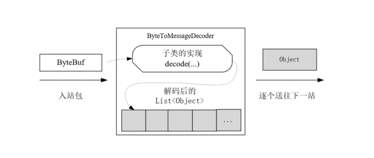

ByteToMessageDecoder的解码方法名为decode，这是一个抽象方法，也就是说，decode方法中的具体解码过程，ByteToMessageDecoder没有具体的实现。那么，如何将Bytebuf中 的字节数据变成什么样的Object实例（包含多少个Object实例），需要子类去完成。所以 说，作为解码器的父类，ByteToMessageDecoder仅仅提供了一个整体框架：它会调用子类 的decode方法，完成具体的二进制字节解码，然后会获取子类解码之后的Object结果，放入 自己内部的结果列表List中，最终，父类会负责将List中的元素，一个一 个地传递给下一个站。从这个角度来说，ByteToMessageDecoder在设计上使用了模板模式 （Template Pattern）。


#### MessageToMessageDecoder

将一种POJO对象解码成另外一种POJO对象呢？答案是：存在的。只 不过与前面不同的是，在这种应用场景下的Decoder解码器，需要继承一个新的Netty解码 器基类：MessageToMessageDecoder


#### FixedLengthFrameDecoder

适用场景：每个接收到的数据包的长度，都是固定的，例如 100个字节。在这种场景 下，只需要把这个解码器加到流水线中，它会把入站ByteBuf数据包拆分成一个个长度为

100的数据包，然后发往下一个channelHandler入站处理器


#### LineBasedFrameDecoder 

适用场景：每个ByteBuf数据包，使用换行符（或者回车换行符）作为数据包的边界分 割符。在这种场景下，只需要把这个LineBasedFrameDecoder解码器加到流水线中，Netty会 使用换行分隔符，把ByteBuf数据包分割成一个一个完整的应用层ByteBuf数据包，再发送 到下一站


#### DelimiterBasedFrameDecoder

DelimiterBasedFrameDecoder是LineBasedFrameDecoder按照行分割的通用版本。不同之 处在于，这个解码器更加灵活，可以自定义分隔符，而不是局限于换行符。如果使用这个 解码器，那么所接收到的数据包，末尾必须带上对应的分隔符


#### LengthFieldBasedFrameDecoder 

这是一种基于灵活长度的解码器。在ByteBuf数据包中，加了一个长度域字段，保存了 原始数据包的长度。解码的时候，会按照这个长度进行原始数据包的提取。此解码器在所 有开箱即用解码器中是最为复杂的一种

首先我们同样先了解 LengthFieldBasedFrameDecoder 中的几个重要属性，这里我主要把它们分为两个部分：**长度域解码器特有属性**以及**与其他解码器（如特定分隔符解码器）的相似的属性**。

- **长度域解码器特有属性。**

```java
// 长度字段的偏移量，也就是存放长度数据的起始位置

private final int lengthFieldOffset; 

// 长度字段所占用的字节数

private final int lengthFieldLength; 

/*
 * 消息长度的修正值
 *
 * 在很多较为复杂一些的协议设计中，长度域不仅仅包含消息的长度，而且包含其他的数据，如版本号、数据类型、数据状态等，那么这时候我们需要使用 lengthAdjustment 进行修正
 * 
 * lengthAdjustment = content的实际长度值 - 需要修正的值
 * 举个例子：
 *  length = 18; content length = 16; 那么我们就需要对content做修正，实际接收的content= 18 - 2
 *  那么 -2 就是 lengthAdjustment
 *
 */

private final int lengthAdjustment; 

// 解码后需要跳过的初始字节数，也就是消息内容字段的起始位置

private final int initialBytesToStrip;

// 长度字段结束的偏移量，lengthFieldEndOffset = lengthFieldOffset + lengthFieldLength

private final int lengthFieldEndOffset;
```

<br/>

- **与固定长度解码器和特定分隔符解码器相似的属性**

```java
private final int maxFrameLength; // 报文最大限制长度

private final boolean failFast; // 是否立即抛出 TooLongFrameException，与 maxFrameLength 搭配使用

private boolean discardingTooLongFrame; // 是否处于丢弃模式

private long tooLongFrameLength; // 需要丢弃的字节数

private long bytesToDiscard; // 累计丢弃的字节数
```


**示例 1：典型的基于消息长度 + 消息内容的解码。**

```java
EFORE DECODE (14 bytes)         AFTER DECODE (14 bytes)
+--------+----------------+      +--------+----------------+
| Length | Actual Content |----->| Length | Actual Content |
| 0x000C | "HELLO, WORLD" |      | 0x000C | "HELLO, WORLD" 
+--------+----------------+      +--------+----------------+
```

上述协议是最基本的格式，报文只包含消息长度 Length 和消息内容 Content 字段，其中 Length 为 16 进制表示，共占用 2 字节，Length 的值 0x000C 代表 Content 占用 12 字节。该协议对应的解码器参数组合如下：

- lengthFieldOffset = 0，因为 Length 字段就在报文的开始位置。
- lengthFieldLength = 2，协议设计的固定长度。
- lengthAdjustment = 0，Length 字段只包含消息长度，不需要做任何修正。
- initialBytesToStrip = 0，解码后内容依然是 Length + Content，不需要跳过任何初始字节。


**示例 2：解码结果需要截断。**

```java
BEFORE DECODE (14 bytes)         AFTER DECODE (12 bytes)
+--------+----------------+      +----------------+
| Length | Actual Content |----->| Actual Content |
| 0x000C | "HELLO, WORLD" |      | "HELLO, WORLD" |
+--------+----------------+      +----------------+
```

示例 2 和示例 1 的区别在于解码后的结果只包含消息内容，其他的部分是不变的。该协议对应的解码器参数组合如下：

- lengthFieldOffset = 0，因为 Length 字段就在报文的开始位置。
- lengthFieldLength = 2，协议设计的固定长度。
- lengthAdjustment = 0，Length 字段只包含消息长度，不需要做任何修正。
- initialBytesToStrip = 2，跳过 Length 字段的字节长度，解码后 ByteBuf 中只包含 Content字段。


**示例 3：长度字段包含消息长度和消息内容所占的字节。**

```java
BEFORE DECODE (14 bytes)         AFTER DECODE (14 bytes)
+--------+----------------+      +--------+----------------+
| Length | Actual Content |----->| Length | Actual Content |
| 0x000E | "HELLO, WORLD" |      | 0x000E | "HELLO, WORLD" |
+--------+----------------+      +--------+----------------+

0x000E = 14
```

与前两个示例不同的是，示例 3 的 Length 字段包含 Length 字段自身的固定长度以及 Content 字段所占用的字节数，Length 的值为 0x000E（2 + 12 = 14 字节），在 Length 字段值（14 字节）的基础上做 lengthAdjustment（-2）的修正，才能得到真实的 Content 字段长度，所以对应的解码器参数组合如下：

- lengthFieldOffset = 0，因为 Length 字段就在报文的开始位置。
- lengthFieldLength = 2，协议设计的固定长度。
- lengthAdjustment = -2，长度字段为 14 字节，需要减 2 才是拆包所需要的长度。**(因为长度字段包含了自身的长度，所以这里需要 - 2 才是content 实际的长度)**
- initialBytesToStrip = 0，解码后内容依然是 Length + Content，不需要跳过任何初始字节。


**示例 4：基于长度字段偏移的解码。**

```java
BEFORE DECODE (17 bytes)                      AFTER DECODE (17 bytes)
+----------+----------+----------------+      +----------+----------+----------------+
| Header 1 |  Length  | Actual Content |----->| Header 1 |  Length  | Actual Content |
|  0xCAFE  | 0x00000C | "HELLO, WORLD" |      |  0xCAFE  | 0x00000C | "HELLO, WORLD" |
+----------+----------+----------------+      +----------+----------+----------------+
```

示例 4 中 Length 字段不再是报文的起始位置，Length 字段的值为 0x00000C，表示 Content 字段占用 12 字节，该协议对应的解码器参数组合如下：

- lengthFieldOffset = 2，需要跳过 Header 1 所占用的 2 字节，才是 Length 的起始位置。
- lengthFieldLength = 3，协议设计的固定长度。
- lengthAdjustment = 0，Length 字段只包含消息长度，不需要做任何修正。
- initialBytesToStrip = 0，解码后内容依然是完整的报文，不需要跳过任何初始字节


**示例 5：长度字段与内容字段不再相邻。**

```java
BEFORE DECODE (17 bytes)                      AFTER DECODE (17 bytes)
+----------+----------+----------------+      +----------+----------+----------------+
|  Length  | Header 1 | Actual Content |----->|  Length  | Header 1 | Actual Content |
| 0x00000C |  0xCAFE  | "HELLO, WORLD" |      | 0x00000C |  0xCAFE  | "HELLO, WORLD" |
+----------+----------+----------------+      +----------+----------+----------------+

0x00000C = 12
```

示例 5 中的 Length 字段之后是 Header 1，Length 与 Content 字段不再相邻。Length 字段所表示的内容略过了 Header 1 字段，所以也需要通过 lengthAdjustment 修正才能得到 Header + Content 的内容。示例 5 所对应的解码器参数组合如下：

- lengthFieldOffset = 0，因为 Length 字段就在报文的开始位置。
- lengthFieldLength = 3，协议设计的固定长度。
- lengthAdjustment = 2，由于 Header + Content 一共占用 2 + 12 = 14 字节，所以 Length 字段值（12 字节）加上 lengthAdjustment（2 字节）才能得到 Header + Content 的内容（14 字节）。**因为length字段只包含了content的长度，并没有包含Header的长度 所以这里要 + 2**
- initialBytesToStrip = 0，解码后内容依然是完整的报文，不需要跳过任何初始字节。


**示例 6：基于长度偏移和长度修正的解码。**

```java
BEFORE DECODE (16 bytes)                       AFTER DECODE (13 bytes)
+------+--------+------+----------------+      +------+----------------+
| HDR1 | Length | HDR2 | Actual Content |----->| HDR2 | Actual Content |
| 0xCA | 0x000C | 0xFE | "HELLO, WORLD" |      | 0xFE | "HELLO, WORLD" |
+------+--------+------+----------------+      +------+----------------+

0x000C = 12
```

示例 6 中 Length 字段前后分为别 HDR1 和 HDR2 字段，各占用 1 字节，所以既需要做长度字段的偏移，也需要做 lengthAdjustment 修正，具体修正的过程与 示例 5 类似。对应的解码器参数组合如下：

- lengthFieldOffset = 1，需要跳过 HDR1 所占用的 1 字节，才是 Length 的起始位置。
- lengthFieldLength = 2，协议设计的固定长度。
- lengthAdjustment = 1，由于 HDR2 + Content 一共占用 1 + 12 = 13 字节，所以 Length 字段值（12 字节）加上 lengthAdjustment（1）才能得到 HDR2 + Content 的内容（13 字节）。
- initialBytesToStrip = 3，解码后跳过 HDR1 和 Length 字段，共占用 3 字节。


**示例 7：长度字段包含除 Content 外的多个其他字段**

```java
BEFORE DECODE (16 bytes)                       AFTER DECODE (13 bytes)
+------+--------+------+----------------+      +------+----------------
| HDR1 | Length | HDR2 | Actual Content |----->| HDR2 | Actual Content 
| 0xCA | 0x0010 | 0xFE | "HELLO, WORLD" |      | 0xFE | "HELLO, WORLD" |
+------+--------+------+----------------+      +------+----------------+
    
0x0010 = 16
```

示例 7 与 示例 6 的区别在于 Length 字段记录了整个报文的长度，包含 Length 自身所占字节、HDR1 、HDR2 以及 Content 字段的长度，解码器需要知道如何进行 lengthAdjustment 调整，才能得到 HDR2 和 Content 的内容。所以我们可以采用如下的解码器参数组合：

- lengthFieldOffset = 1，需要跳过 HDR1 所占用的 1 字节，才是 Length 的起始位置。
- lengthFieldLength = 2，协议设计的固定长度。
- lengthAdjustment = -3，Length 字段值（16 字节）需要减去 HDR1（1 字节） 和 Length 自身所占字节长度（2 字节）才能得到 HDR2 和 Content 的内容（1 + 12 = 13 字节）。
- initialBytesToStrip = 3，解码后跳过 HDR1 和 Length 字段，共占用 3 字节。


#### RelayMessageDecoder


### Encoder

#### MessageToByteEncoder

MessageToByteEncoder的功能是将一个Java POJO对象编码成一 个ByteBuf数据包。它是一个抽象类，仅仅实现了编码的基础流程，在编码过程中，通过调 用encode抽象方法来完成。但是，它的encode编码方法是一个抽象方法，没有具体的encode编码逻辑实现，实现encode抽象方法的工作需要子类去完成


#### MessageToMessageEncoder

MessageToMessaeEncoder 是 完成原POJO类型到目标POJO类型的转换逻辑。在encode实现方法中，编码完成后，将解码后的目标对象加入到encode方法中的实参List输出 容器即可


#### LengthFieldPrepender

用：将当前发送消息的[二进制](https://so.csdn.net/so/search?q=二进制&spm=1001.2101.3001.7020)字节长度，添加到缓冲区头部；这样消息就有了固定长度，长度存储在缓冲头中

```java
/**
 * An encoder that prepends the length of the message.  The length value is
 * prepended as a binary form.
 * <p>
 * For example, <tt>{@link LengthFieldPrepender}(2)</tt> will encode the
 * following 12-bytes string:
 * <pre>
 * +----------------+
 * | "HELLO, WORLD" |    原始消息长度12个字节
 * +----------------+
 * </pre>
 * into the following:
 * <pre>
 * +--------+----------------+
 * + 0x000C | "HELLO, WORLD" |     实际发送消息前面加了长度(0x000C为16进制，转换为10进制为12)
 * +--------+----------------+
 * </pre>
 * If you turned on the {@code lengthIncludesLengthFieldLength} flag in the
 * constructor, the encoded data would look like the following
 * (12 (original data) + 2 (prepended data) = 14 (0xE)):
 * <pre>
 * +--------+----------------+
 * + 0x000E | "HELLO, WORLD" |     如果lengthIncludesLengthFieldLength=true,则长度为14，多加了2个字节
 * +--------+----------------+
 * </pre>
 */


```


### ChannelDuplexDecoder


#### ByteToMessageCodeC

完成POJO到 ByteBuf 数据包的编解码器基类，叫做ByteToMessageCodec，它是一个 抽象类。从功能上说，继承它就等同于继承了ByteToMessageDecoder解码器和MessageToByteEncoder编码器这两个基类

编解码器ByteToMessageCodec同时包含了编码encode和解码decode两个抽象方法，这 两个方法都需要我们自己实现：

- （1）编码方法——encode(ChannelHandlerContext, I, ByteBuf) 
- （2）解码方法——decode(ChannelHandlerContext, ByteBuf, List) 

下面是一个整数到字节、字节到整数的编解码器，代码如下：

```java
package com.crazymakercircle.netty.codec; 
//... 
public class Byte2IntegerCodec extends ByteToMessageCodec<Integer> { 
     @Override 
     public void encode(ChannelHandlerContext ctx,Integer msg, ByteBuf out)...{ 
         out.writeInt(msg); 
         System.out.println("write Integer = " + msg); 
     } 
    
     @Override 
     public void decode(ChannelHandlerContext ctx,ByteBuf in, List<Object> out)...{ 
         if (in.readableBytes() >= 4) { 
             int i = in.readInt(); 
             System.out.println("Decoder i= " + i); 
             out.add(i); 
         } 
     } 
} 	
```


#### CombinedChannelDuplexHandler

ByteToMessageCodeC 中的编码器和解码器相结合是通过继承完成的。继承的方式有其不足，在于：将编 码器和解码器的逻辑强制性地放在同一个类中，在只需要编码或者解码单边操作的流水线 上，逻辑上不大合适。 

编码器和解码器如果要结合起来，除了继承的方法之外，还可以通过组合的方式实 现。与继承相比，组合会带来更大的灵活性：编码器和解码器可以捆绑使用，也可以单独 使用

Netty提供了一个新的组合器——CombinedChannelDuplexHandler基类。其用法也很简 单，下面通过示例程序，来演示如何将前面的整数解码器IntegerFromByteDecoder和它对应 的整数编码器IntegerToByteEncoder组合起来。代码如下：

```java
package com.crazymakercircle.netty.codec; 
//... 
public class IntegerDuplexHandler extends CombinedChannelDuplexHandler< 
 Byte2IntegerDecoder, Integer2ByteEncoder> 
{ 
     public IntegerDuplexHandler() { 
     super(new Byte2IntegerDecoder(), new Integer2ByteEncoder()); 
     } 
} 
```


#### IdleStateHandler

##### 作用

- 心跳机制

心跳是在TCP长连接中，客户端和服务端定时向对方发送数据包通知对方自己还在线，保证连接的有效性的一种机制
在服务器和客户端之间一定时间内没有数据交互时, 即处于 idle 状态时, 客户端或服务器会发送一个特殊的数据包给对方, 当接收方收到这个数据报文后, 也立即发送一个特殊的数据报文, 回应发送方, 此即一个 PING-PONG 交互. 自然地, 当某一端收到心跳消息后, 就知道了对方仍然在线, 这就确保 TCP 连接的有效性.

- 心跳实现

使用TCP协议层的Keeplive机制，但是该机制默认的心跳时间是2小时，依赖操作系统实现不够灵活；应用层实现自定义心跳机制，比如Netty实现心跳机制；


##### 参数

- readerIdleTime 读空闲超时时间设定，如果channelRead()方法超过readerIdleTime时间未被调用则会触发超时事件调用userEventTrigger()方法；

- writerIdleTime写空闲超时时间设定，如果write()方法超过writerIdleTime时间未被调用则会触发超时事件调用userEventTrigger()方法；

- allIdleTime所有类型的空闲超时时间设定，包括读空闲和写空闲；

- unit时间单位，包括时分秒等


##### 应用

这里以Seata为例，Seata 分为服务端和客户端两部分，内部是通过Netty实现的RPC协议，为了保证服务连接可用，分别在客户端与服务端都添加了IdleStateHandler 用于保证连接存活

在Seata中读控线默认是写空闲的三倍，因为考虑到网络波动的原因，所以他这里增加了一个延迟容忍，写空闲默认是每 5s 触发一次

**Seata Client 端如下：**

```java
public void userEventTriggered(ChannelHandlerContext ctx, Object evt) {
    if (evt instanceof IdleStateEvent) {
        IdleStateEvent idleStateEvent = (IdleStateEvent) evt;
        
        //如果是读空闲，则会关闭相应的连接，这里是通过它内置的连接池进行释放
        if (idleStateEvent.state() == IdleState.READER_IDLE) {
            if (LOGGER.isInfoEnabled()) {
                LOGGER.info("channel {} read idle.", ctx.channel());
            }
            try {
                String serverAddress = NetUtil.toStringAddress(ctx.channel().remoteAddress());
                clientChannelManager.invalidateObject(serverAddress, ctx.channel());
            } catch (Exception exx) {
              LOGGER.error(exx.getMessage());
            } finally {
              clientChannelManager.releaseChannel(ctx.channel(), getAddressFromContext(ctx));
            }
        }
        
        //如果是触发写控线，这里会发送心跳PING 给服务端，服务端收到心跳信息后会返回PONG消息，表示一次正常的心跳上报
        if (idleStateEvent == IdleStateEvent.WRITER_IDLE_STATE_EVENT) {
            try {
                 if (LOGGER.isDebugEnabled()) {
                    LOGGER.debug("will send ping msg,channel {}", ctx.channel());
                 }
                 AbstractNettyRemotingClient.this.sendAsyncRequest(ctx.channel(), HeartbeatMessage.PING);
            } catch (Throwable throwable) {
                    LOGGER.error("send request error: {}", throwable.getMessage(), throwable);
             }
         }
    }
}
```


**Seata Server 端如下：**

```java
@Override
public void userEventTriggered(ChannelHandlerContext ctx, Object evt) {
      if (evt instanceof IdleStateEvent) {
         debugLog("idle:" + evt);
         IdleStateEvent idleStateEvent = (IdleStateEvent) evt;
         //如果是读空闲，那么就直接关闭channel
         if (idleStateEvent.state() == IdleState.READER_IDLE) {
            if (LOGGER.isInfoEnabled()) {
               LOGGER.info("channel:" + ctx.channel() + " read idle.");
            }
             handleDisconnect(ctx);
             try {
                 closeChannelHandlerContext(ctx);
             } catch (Exception e) {
               LOGGER.error(e.getMessage());
             }
      	}
    }
}
```


## TCP 与 Netty 参数


### TCP 参数

#### SO_RCVBUF

Socket参数，TCP数据接收缓冲区大小。该缓冲区即TCP接收滑动窗口，linux操作系统可使用命令：cat /proc/sys/net/ipv4/tcp_rmem查询其大小。一般情况下，该值可由用户在任意时刻设置，但当设置值超过64KB时，需要在连接到远端之前设置。


#### SO_SNDBUF

Socket参数，TCP数据发送缓冲区大小。该缓冲区即TCP发送滑动窗口，linux操作系统可使用命令：cat /proc/sys/net/ipv4/tcp_smem查询其大小


#### TCP_NODELAY

TCP参数，立即发送数据，默认值为Ture（Netty默认为True而操作系统默认为False）。该值设置Nagle算法的启用，改算法将小的碎片数据连接成更大的报文来最小化所发送的报文的数量，如果需要发送一些较小的报文，则需要禁用该算法。Netty默认禁用该算法，从而最小化报文传输延时。


####  SO_KEEPALIVE

Socket参数，连接保活，默认值为False。启用该功能时，TCP会主动探测空闲连接的有效性。可以将此功能视为TCP的心跳机制，需要注意的是：默认的心跳间隔是7200s即2小时。Netty默认关闭该功能


####  SO_REUSEADDR

Socket参数，地址复用，默认值False。有四种情况可以使用：(1).当有一个有相同本地地址和端口的socket1处于TIME_WAIT状态时，而你希望启动的程序的socket2要占用该地址和端口，比如重启服务且保持先前端口。(2).有多块网卡或用IP Alias技术的机器在同一端口启动多个进程，但每个进程绑定的本地IP地址不能相同。(3).单个进程绑定相同的端口到多个socket上，但每个socket绑定的ip地址不同。(4).完全相同的地址和端口的重复绑定。但这只用于UDP的多播，不用于TCP


####  SO_LINGER

Socket参数，关闭Socket的延迟时间，默认值为-1，表示禁用该功能。-1表示socket.close()方法立即返回，但OS底层会将发送缓冲区全部发送到对端。0表示socket.close()方法立即返回，OS放弃发送缓冲区的数据直接向对端发送RST包，对端收到复位错误。非0整数值表示调用socket.close()方法的线程被阻塞直到延迟时间到或发送缓冲区中的数据发送完毕，若超时，则对端会收到复位错误


#### SO_BACKLOG

Socket参数，服务端接受连接的队列长度，如果队列已满，客户端连接将被拒绝。默认值，Windows为200，其他为128。

**三次握手与连接队列**

第一次握手时，因为客户端与服务器之间的连接还未完全建立，连接会被放入**半连接队列**中

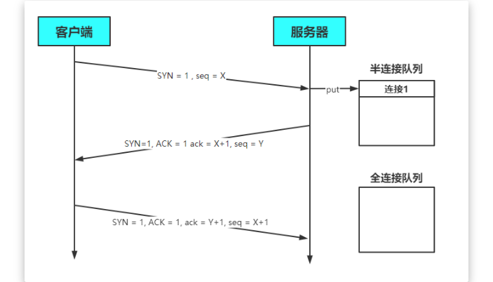

当完成三次握手以后，连接会被放入**全连接队列中**

服务器处理Accept事件是在TCP三次握手，也就是建立连接之后。服务器会从全连接队列中获取连接并进行处理

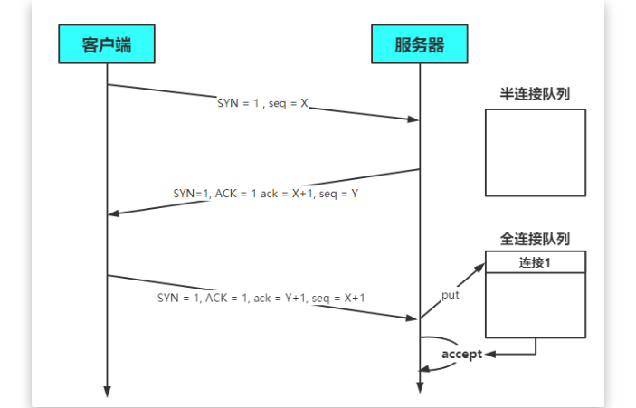

在 linux 2.2 之前，backlog 大小包括了两个队列的大小，**在 linux 2.2 之后，分别用下面两个参数来控制**

- 半连接队列 - sync queue
  - 大小通过 /proc/sys/net/ipv4/tcp_max_syn_backlog 指定，在 `syncookies` 启用的情况下，逻辑上没有最大值限制，这个设置便被忽略
- 全连接队列 - accept queue
  - 其大小通过 /proc/sys/net/core/somaxconn 指定，在使用 listen 函数时，**内核会根据传入的 backlog 参数与系统参数，取二者的较小值**
  - 如果 accpet queue 队列满了，server 将发送一个拒绝连接的错误信息到 client

**作用**

在Netty中，`SO_BACKLOG`主要用于设置全连接队列的大小。**当处理Accept的速率小于连接建立的速率时，全连接队列中堆积的连接数大于`SO_BACKLOG`设置的值是，便会抛出异常**


#### SO_TIMEOUT

主要用在阻塞IO，因为阻塞IO的情况线程会一直阻塞，可以通过设置SO_TIMEOUT 参数，让其阻塞到指定时间后返回


### UDP 参数

#### SO_BROADCAST

Socket参数，设置广播模式。


### Netty 参数

#### ALLOW_HALF_CLOSURE

Netty参数，一个连接的远端关闭时本地端是否关闭，默认值为False。值为False时，连接自动关闭；为True时，触发ChannelInboundHandler的userEventTriggered()方法，事件为ChannelInputShutdownEvent


#### CONNECT_TIMEOUT_MILLIS

Netty参数，连接超时毫秒数，默认值30000毫秒即30秒。

- 属于 **SocketChannal** 的参数
- 用在**客户端建立连接**时，如果在指定毫秒内无法连接，会抛出 timeout 异常
- **注意**：Netty 中不要用成了SO_TIMEOUT 主要用在阻塞 IO，而 Netty 是非阻塞 IO

客户端中连接服务器的线程是 NIO 线程，抛出异常的是主线程。这是如何做到超时判断以及线程通信的呢？

`AbstractNioChannel.AbstractNioUnsafe.connect`方法中

```java
public final void connect(
                final SocketAddress remoteAddress, final SocketAddress localAddress, final ChannelPromise promise) {
    
    ...
        
    // Schedule connect timeout.
    // 设置超时时间，通过option方法传入的CONNECT_TIMEOUT_MILLIS参数进行设置
    int connectTimeoutMillis = config().getConnectTimeoutMillis();
    // 如果超时时间大于0
    if (connectTimeoutMillis > 0) {
        // 创建一个定时任务，延时connectTimeoutMillis（设置的超时时间时间）后执行
        // schedule(Runnable command, long delay, TimeUnit unit)
        connectTimeoutFuture = eventLoop().schedule(new Runnable() {
            @Override
            public void run() {
                // 判断是否建立连接，Promise进行NIO线程与主线程之间的通信
                // 如果超时，则通过tryFailure方法将异常放入Promise中
                // 在主线程中抛出
                ChannelPromise connectPromise = AbstractNioChannel.this.connectPromise;
                ConnectTimeoutException cause = new ConnectTimeoutException("connection timed out: " + remoteAddress);
                if (connectPromise != null && connectPromise.tryFailure(cause)) {
                    close(voidPromise());
                }
            }
        }, connectTimeoutMillis, TimeUnit.MILLISECONDS);
    }
    
   	...
        
}Copy
```

超时的判断**主要是通过 Eventloop 的 schedule 方法和 Promise 共同实现的**

- schedule 设置了一个定时任务，延迟`connectTimeoutMillis`秒后执行该方法
- 如果指定时间内没有建立连接，则会执行其中的任务
  - 任务负责创建 `ConnectTimeoutException` 异常，并将异常通过 Pormise 传给主线程并抛出


#### MAX_MESSAGES_PER_READ

Netty参数，一次Loop读取的最大消息数，对于ServerChannel或者NioByteChannel，默认值为16，其他Channel默认值为1。默认值这样设置，是因为：ServerChannel需要接受足够多的连接，保证大吞吐量，NioByteChannel可以减少不必要的系统调用select


#### WRITE_SPIN_COUNT

Netty参数，一个Loop写操作执行的最大次数，默认值为16。也就是说，对于大数据量的写操作至多进行16次，如果16次仍没有全部写完数据，此时会提交一个新的写任务给EventLoop，任务将在下次调度继续执行。这样，其他的写请求才能被响应不会因为单个大数据量写请求而耽误。


#### ALLOCATOR

Netty参数，ByteBuf的分配器，默认值为ByteBufAllocator.DEFAULT，4.0版本为UnpooledByteBufAllocator，4.1版本为PooledByteBufAllocator。该值也可以使用系统参数io.netty.allocator.type配置，使用字符串值："unpooled"，"pooled"


#### RCVBUF_ALLOCATOR

Netty参数，用于Channel分配接受Buffer的分配器，默认值为AdaptiveRecvByteBufAllocator.DEFAULT，是一个自适应的接受缓冲区分配器，能根据接受到的数据自动调节大小。可选值为FixedRecvByteBufAllocator，固定大小的接受缓冲区分配器

- 属于 **SocketChannal** 参数
- **控制 Netty 接收缓冲区大小**
- 负责入站数据的分配，决定入站缓冲区的大小（并可动态调整），**统一采用 direct 直接内存**，具体池化还是非池化由 allocator 决定


#### AUTO_READ

Netty参数，自动读取，默认值为True。Netty只在必要的时候才设置关心相应的I/O事件。对于读操作，需要调用channel.read()设置关心的I/O事件为OP_READ，这样若有数据到达才能读取以供用户处理。该值为True时，每次读操作完毕后会自动调用channel.read()，从而有数据到达便能读取；否则，需要用户手动调用channel.read()。需要注意的是：当调用config.setAutoRead(boolean)方法时，如果状态由false变为true，将会调用channel.read()方法读取数据；由true变为false，将调用config.autoReadCleared()方法终止数据读取


#### WRITE_BUFFER_HIGH_WATER_MARK

Netty参数，写高水位标记，默认值64KB。如果Netty的写缓冲区中的字节超过该值，Channel的isWritable()返回False


#### WRITE_BUFFER_LOW_WATER_MARK

Netty参数，写低水位标记，默认值32KB。当Netty的写缓冲区中的字节超过高水位之后若下降到低水位，则Channel的isWritable()返回True。写高低水位标记使用户可以控制写入数据速度，从而实现流量控制。推荐做法是：每次调用channl.write(msg)方法首先调用channel.isWritable()判断是否可写


#### MESSAGE_SIZE_ESTIMATOR

Netty参数，消息大小估算器，默认为DefaultMessageSizeEstimator.DEFAULT。估算ByteBuf、ByteBufHolder和FileRegion的大小，其中ByteBuf和ByteBufHolder为实际大小，FileRegion估算值为0。该值估算的字节数在计算水位时使用，FileRegion为0可知FileRegion不影响高低水位


#### SINGLE_EVENTEXECUTOR_PER_GROUP

Netty参数，单线程执行ChannelPipeline中的事件，默认值为True。该值控制执行ChannelPipeline中执行ChannelHandler的线程。如果为Trye，整个pipeline由一个线程执行，这样不需要进行线程切换以及线程同步，是Netty4的推荐做法；如果为False，ChannelHandler中的处理过程会由Group中的不同线程执行
