# Raft

## Raft 协议

Raft 动态图演示：http://www.kailing.pub/raft/index.html

`Raft 算法`是分布式系统开发首选的`共识算法`。比如现在流行 Etcd、Consul、Nacos。，Raft算法主要分为两个过程，分别为Leader Election 和 LogReplication

### Raft 角色

**跟随者（Follower）**：`普通群众`，默默接收和来自领导者的消息，当领导者心跳信息超时的时候，就主动站出来，推荐自己当候选人。

**候选人（Candidate）**：`候选人`将向其他节点请求投票 RPC 消息，通知其他节点来投票，如果赢得了大多数投票选票，就晋升当领导者。

**领导者（Leader）**：`霸道总裁`，一切以我为准。处理写请求、管理日志复制和不断地发送心跳信息，通知其他节点“我是领导者，我还活着，你们不要”发起新的选举，不用找新领导来替代我。


### 一、角色

Raft 算法是通过”一切以领导者为准“的方式，实现一系列值的共识和各节点日志的一致。Raft算法的核心就是通过 **选举** 来达成一致性，该算法一共涉及三种角色（状态）、两大过程（Leader Election、Log Replication）。

我们先来看下Raft算法涉及的角色，在Raft算法中，所有节点都有三种状态，状态之间可以互相转换。


#### 1.1 Follower（跟随者）

Raft协议刚开始时，所有节点都是Follower，默默地接收和处理来自Leader的消息，当等待Leader心跳信息超时的时候，就主动站出来，推荐自己当Candidate。


#### 1.2 Candidate（候选人）

Candidate将向其他节点发送投票请求（RequestVote），通知其他节点来投票，如果赢得了大多数（N/2+1）选票，就晋升Leader。


#### 1.3 Leader（领导者）

Leader主要负责处理客户端请求，进行日志复制等操作，每一轮选举的目标就是选出一个Leader；Leader会不断地发送心跳信息，通知其他节点“我是领导者，我还活着，你们现在不要发起新的选举，找个新领导者来替代我。”


### 二、Leader Election（领导者选举）


#### 2.1 选举流程

1.首先，在初始状态下，集群中所有的节点都是**Follower**状态，并被设定一个随机 **election timeout**（150ms-300ms）：

> election timeout选举超时是指followers*跟随者成为*candidates*候选者之前所等待的时间

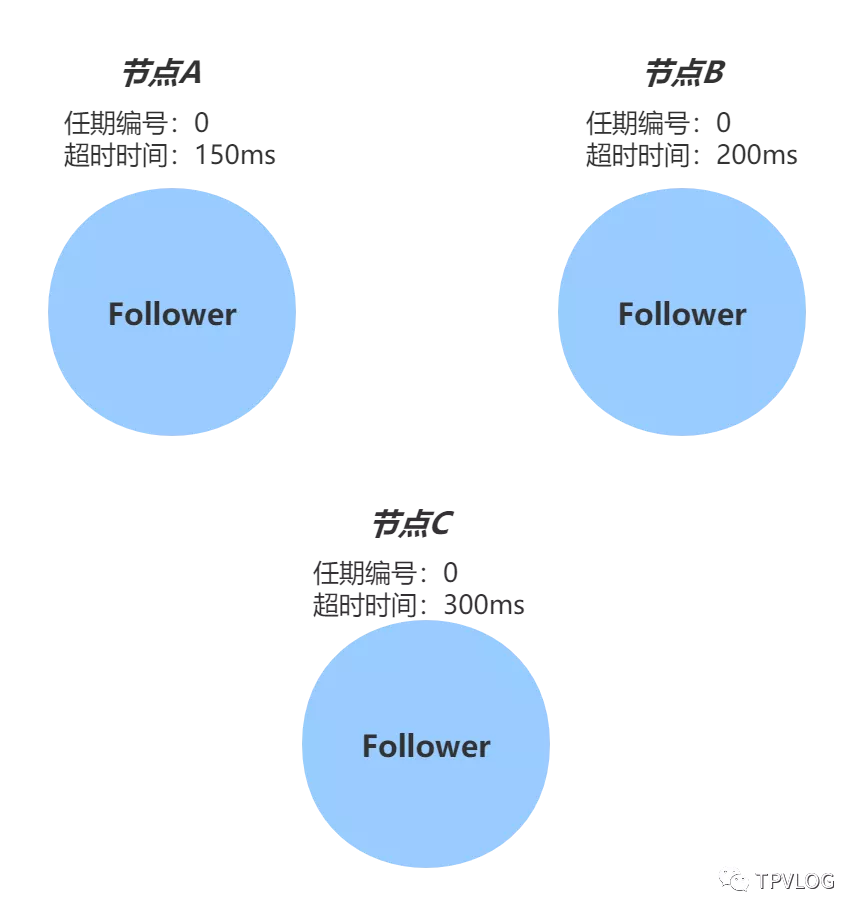

2.如果超时时间到期后没有收到来自Leader的心跳，节点就发起选举：将自己的状态切换为 **Candidate**，增加自己的任期编号，并且向自己投票，然后向集群中的其它 Follower 节点发送请求，询问其是否选举自己成为 Leader：

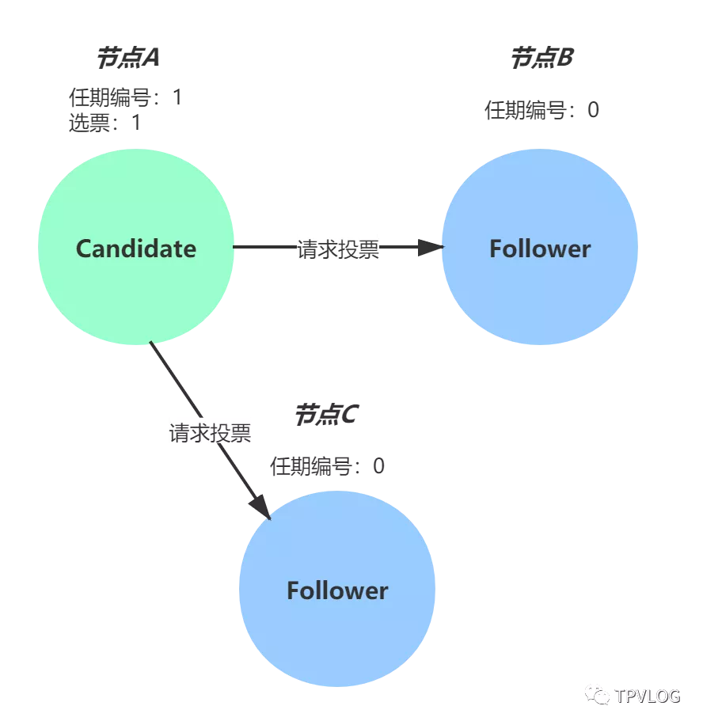

3.其他节点接收到候选人 A 的请求投票消息后，如果在编号为 1 的这届任期内还没有进行过投票，那么它将把选票投给节点 A，并增加自己的任期编号，然后重置自己的election timeout超时时间：


4.当收到来自集群中过半数节点的接受投票后，节点即成为本届任期内 Leader，他将周期性地发送心跳消息，通知其他节点我是Leader，阻止Follower发起新的选举，并且领导者开始向其追随者发送*Append Entries*追加条目消息，这些消息以heartbeat timeout心跳超时指定的时间间隔发送：

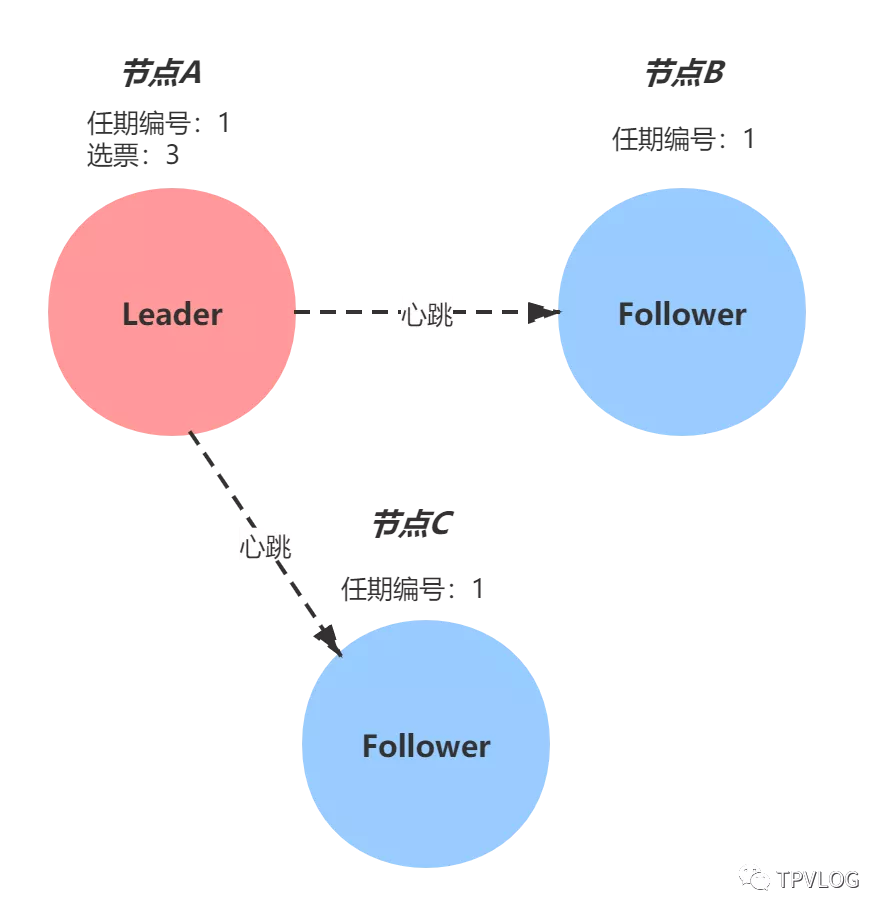

> 如果在指定时间内（一个随机时间，每个节点都不同），Follower没有接收到来自Leader的心跳消息，那么它就认为当前没有Leader，推举自己为Candidate，发起新一轮选举。


#### 2.2 分裂投票

5、如果在同一个时间出现多个Follower同时变为候选者则会触发分裂投票，并且候选节点都开始以相同的任期进行选举：

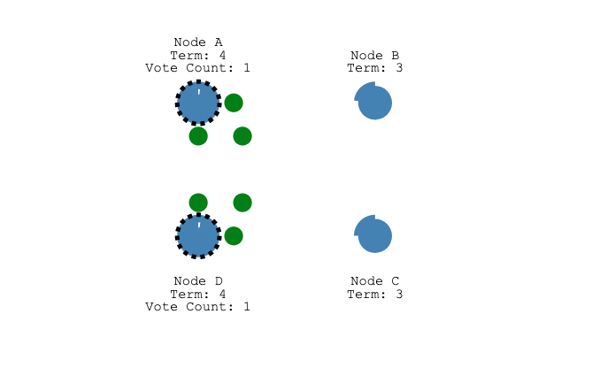


6、并且两个候选节点每个都先到达一个跟随者节点

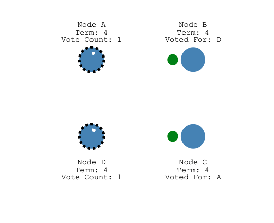


7、现在，每个候选人都有2票，并且在这个任期中将无法获得更多选票

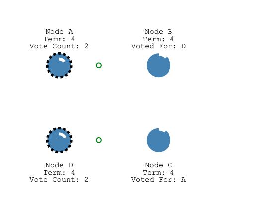


8、所有节点将开始等待新的选举，然后再试一次。

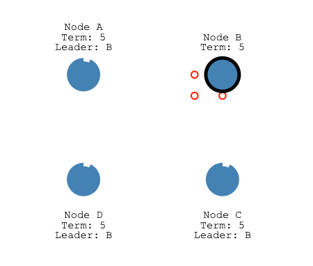


#### 2.3 通信方式

在 Raft 算法中，节点之间的通信采用的是RPC方式，在Leader选举中，需要用到两类RPC：

1. 请求投票（RequestVote）RPC：由Candidate在选举期间发起，通知各Follower进行投票；
2. 日志复制（AppendEntries）RPC：由Leader发起，用来进行日志复制和心跳。


#### 2.4 任期

在选举流程中，我提到Leader节点是有任期的，每个任期由单调递增的数字标识，比如节点 A 的任期编号是 1。任期编号是随着选举的举行而变化的：

1. Follower在等待Leader的心跳信息超时后，会推举自己为Candidate，此时会增加自己的任期编号；
2. 如果一个节点发现自己的任期编号比其他节点小，那么它会更新自己的编号为较大的编号值。比如节点 B 的任期编号是 0，当收到来自节点 A 的请求投票消息时，因为消息中包含了节点 A 的任期编号，且编号为 1，那么节点 B 将把自己的任期编号更新为 1。
3. 当任期编号相同时，日志完整性高的Follower（也就是最后一条日志项对应的任期编号值更大，索引号更大），拒绝投票给日志完整性低的Candidate。


### 三、Leader Elction 实现

Raft 选举实现主要依赖于两种RPC实现，一种是VoteRPC、一种是Append Entries RPC，通常在选举的过程中


### 四、Log Replication（日志复制）

在 Raft 算法中，副本数据是以日志的形式存在的，Leader接收到来自客户端写请求后，处理写请求的过程就是一个日志复制的过程。

#### 3.1 日志项

日志项是一种数据格式，它主要包含客户端的指令（Command），还有索引值（Log index）、任期编号（Term）等信息：

```java
/**
 * 日志索引，是连续的，一般是以自增的方式添加到日志中
 */
private Long index;

/**
 * 添加日志时对应的任期
 */
private long term;

/**
 * 日志对应的key
 */
private String key;

/**
 * 日志对应的value
 */
private String value;
```

从上图可以看到，一届领导者的任期中，往往有多条日志项，而且日志项的索引值是连续的，


#### 3.2 复制流程

复制流程如下：

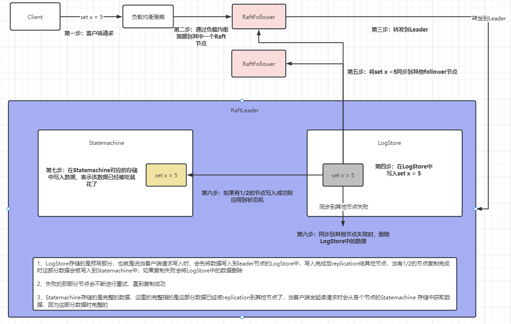

1. 首先，当Leader节点接收到客户端的写请求后，会创建一个新日志项，并附加到本地日志中；
2. Leader通过日志复制（AppendEntries）RPC 消息，将日志项复制到集群其它Follower节点上；
3. 如果Leader接收到大多数的“复制成功”响应后，它将日志项应用到自己的状态机，并返回成功给客户端。如果Leader没有接收到大多数的“复制成功”响应，那么就返回错误给客户端；
4. 当Follower接收到心跳信息，或者新的AppendEntries消息后，如果发现Leader已经提交了某条日志项，而自己还没应用，那么Follower就会将这条日志项应用到本地的状态机中。

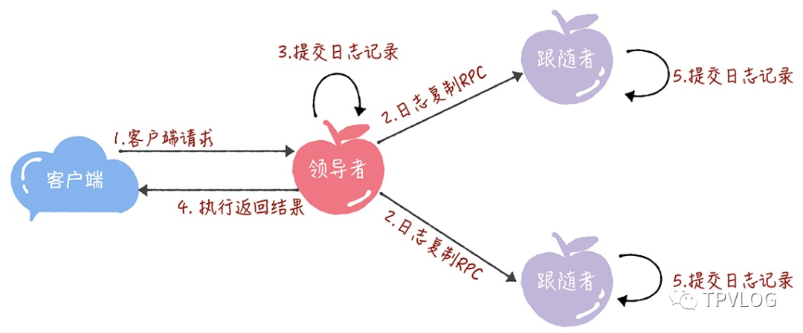

从上面这个过程可以看出，当Follower节点接受Leader的心跳消息或者AppendEntries消息后，会将日志项应用到自己的状态机。这个优化，降低了处理客户端请求的延迟，将二阶段提交优化为了一段提交，降低了一半的消息延迟。


#### 3.3 网络分区

1、由于网络分区已经出现了两个领导者

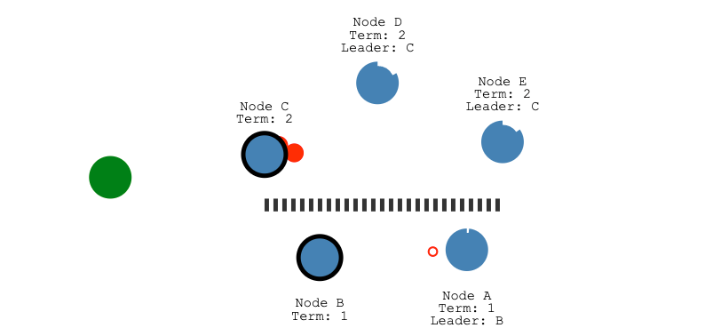

2、让我们添加另一个客户端，并尝试更新两个领导者，一个客户端将尝试将节点B的值设置为“ 3”

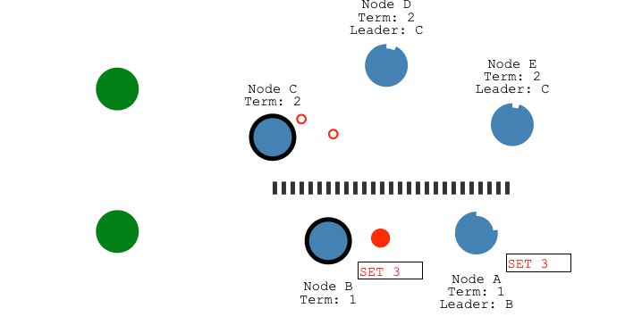

3、节点B无法复制为多数，因此其日志条目保持未提交状态

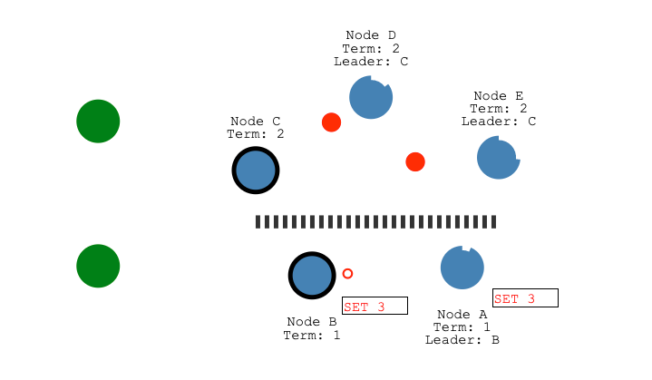

4、另一个客户端将尝试将节点 C 的值设置为“ 8”，这样会成功，因为它可以复制到大多数

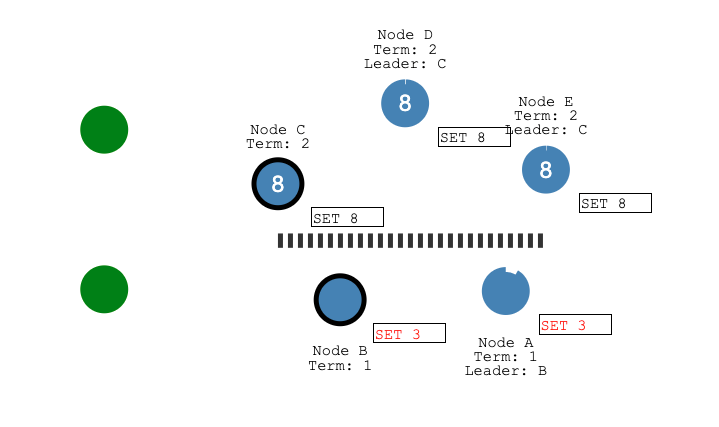


5、当修复网络分区之后，节点B将看到较高的选举期限并退出，节点A和B都将回滚其未提交的条目并匹配新领导者的日志

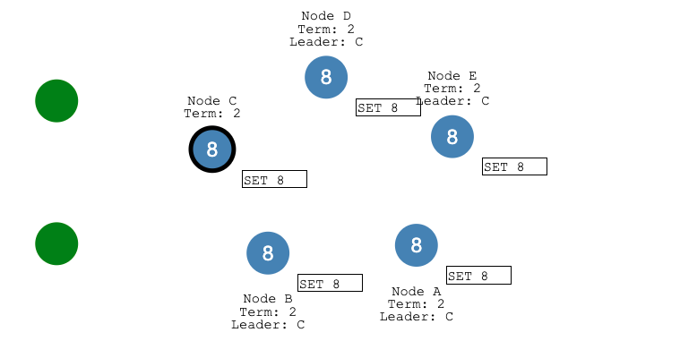


#### 3.3 一致性检查

在 Raft 算法中，Leader通过强制Follower直接复制自己的日志项，处理不一致日志。具体有 2 个步骤：

1. 首先，Leader通过AppendEntries消息，找到Follower节点上与自己相同日志项的最大索引值。也就是说，这个索引值之前的日志，Leader和Follower是一致的，之后的日志是不一致的了。
2. 然后，Leader强制Follower更新不一致日志项，实现日志的一致。

举个例子来理解下， 为了方便演示，我们引入 2 个新变量 ：

- **PrevLogEntry：**表示当前要复制的日志项的前一条日志项的索引值。比如下图中，如果Leader将索引值为8的日志项发送给Follower，那么此时 PrevLogEntry 值为 7；
- **PrevLogTerm：**表示当前要复制的日志项的前一条日志项的任期编号。比如下图中，如果Leader将索引值为8的日志项发送给Follower，那么此时 PrevLogTerm 值为 4。

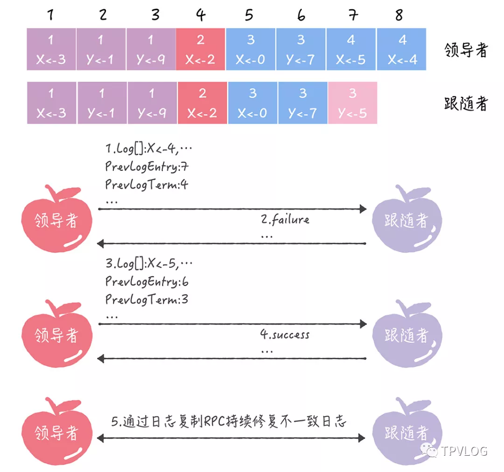

1. 首先，Leader通过AppendEntries消息，发送当前最新的日志项到Follower，这个日志项的 PrevLogEntry 值为 7，PrevLogTerm 值为 4；
2. 如果Follower在它的日志中，找不到PrevLogEntry 值为 7、PrevLogTerm 值为 4 的日志项，也就是说它的日志和Leader的不一致了，那么Follower就会拒绝接收新的日志项，并返回失败信息给Leader；
3. 此时Leader会递减要复制的日志项的索引值，并发送新的日志项到Follower，这个消息的 PrevLogEntry 值为 6，PrevLogTerm 值为 3；
4. 如果Follower在它的日志中，找到了 PrevLogEntry 值为 6、PrevLogTerm 值为 3 的日志项，那么AppendEntries消息返回成功，这样一来，Leader就知道在 PrevLogEntry 值为 6、PrevLogTerm 值为 3 的位置，Follower的日志项与自己相同；
5. 最后， Leader通过AppendEntries消息，复制并更新覆盖该索引值之后的日志项（也就是不一致的日志项），最终实现了集群各节点日志的一致。


一致性检查代码：

```java
 /*
          再来看看日志接收者的实现步骤：
       1、和心跳一样，要先检查对方 term，如果 term 都不对，那么就没什么好说的了。
       2、 如果日志不匹配，那么返回 leader，告诉他，减小 nextIndex 重试。
       3、如果本地存在的日志和 leader 的日志冲突了，以 leader 的为准，删除自身的。
       4、最后，将日志应用到状态机，更新本地的 commitIndex，返回 leader 成功。


   举个例子如下：


            prevIndex = 3，logEntries: [5]，nextIndex = 4

            leader:   2 | 3 | 3 | 4 | 5 (new)
            follower: 2 | 3 | 3 | 5 | 7

            当follower 接收到leader的replication请求时，会经历以下是三个步骤：

            经历步骤1:
              首先发现leader logIndex = 3 的logIndex 与 follower logIndex = 3的数据是不同的，那么会直接返回false
              leader 在接收到follower的返回请求时，会将nextIndex递减，然后继续replication, 数据变为如下：
              nextIndex = 3，prevIndex = 2，logEntries: [4, 5]

              继续重复步骤1, 发现leader index=3 的日志与follower index=3的日志是一致的，接下来进入步骤2

            经历步骤2：
              follower 获取 index = prevIndex + 1 的数据，这时 prevIndex = 2
              将follower index = 3 的数据与logEntries 中的第一条数据比较，发现不一致:
              将follower从 index=3的数据开始进行删除，这时follower的数据变为如下：

              leader:   2 | 3 | 3 | 4 | 5
              follower: 2 | 3 | 3


            步骤3：
              将logEntries的数据写入到follower中，数据如下：

              leader:   2 | 3 | 3 | 4 | 5
              follower: 2 | 3 | 3 | 4 | 5


*/
      //获取当前节点的最后一条日志索引
      Long lastIndex = raftNode.getLogStore().getLastIndex();

      // 步骤1
      //如果不是第一条数据，并且如果请求节点传入的prevIndex 与 当前节点的prevLog不匹配，则认为数据不一致
      //需要减少nextIndex重试
      //lastIndex == -1 表示当前节点还没有写入任何数据
      //request.getPrevIndex() == -1 表示这是leader节点写入的第一条数据
      if (lastIndex != -1 && request.getPrevIndex() != -1) {
          LogEntry prevLog = raftNode.getLogStore().read(request.getPrevIndex());
          // 如果日志在 prevLogIndex 位置处的日志条目的任期号和 prevLogTerm 不匹配，则返回 false
          // 需要减小 nextIndex 重试.
          if (prevLog == null)
              return response;

          //当logIndex一致，但是term不一致时，可能是由于leader节点宕机，其他leader节点写入数据又宕机的情况
          //todo：如果一条已存在的日志与新的冲突(index相同但是term不同), 则删除已经存在的日志条目和他之后所有的日志条目
          if (prevLog.getTerm() != request.getPrevTerm())
              return response;
      }

      //步骤2
      //上面已经保证了leader节点的prevLog 与 follower节点的prevLog 是一致的
      // 判断需要添加的日志数据是否与本地的日志数据一致，既(prevIndex + 1) - (request.getLastEntry()) 是需要被添加到follower的
      LogEntry existLog = raftNode.getLogStore().read(((request.getPrevIndex() + 1)));

      //如果当前节点的(prevIndex + 1) 的term 与 请求节点的 (prevIndex + 1) 的term不同，则需要将当前节点从(prevIndex+1)-lastIndex的数据信息删除
      if (existLog != null && existLog.getTerm() != request.getFirstEntry().getTerm()) {
          // 删除这一条和之后所有的, 然后写入日志和状态机.
          raftNode.getLogStore().truncate(request.getPrevIndex());
      }
```

