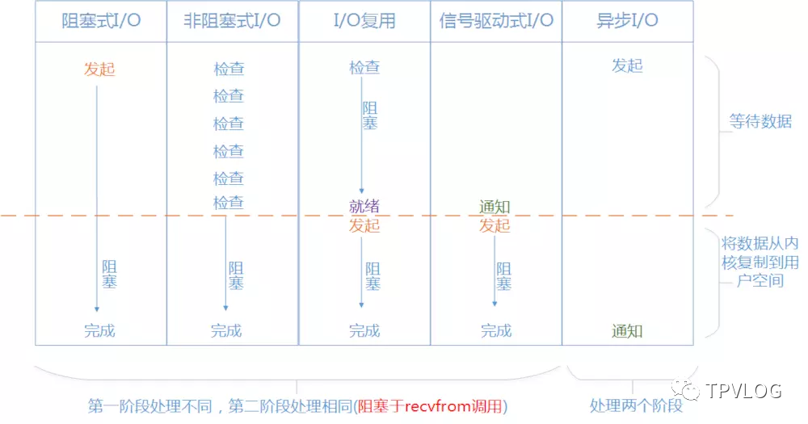

## RokectMQ


### RocketMQ 是由哪些组成的

Name Server是一个几乎无状态节点，可集群部署，节点之间无任何信息同步。

RocketMQ 主要有NameServer、Broker、Producer和Consumer 四部分组成，每个Broker与Name Server集群中的所有节点建立长连接，定时(每隔30s)注册Topic信息到所有Name Server。Name Server定时(每隔10s)扫描所有存活broker的连接，如果Name Server超过2分钟没有收到心跳，则Name Server断开与Broker的连接。

Broker部署相对复杂，Broker分为Master与Slave，一个Master可以对应多个Slave，但是一个Slave只能对应一个Master，Master与Slave的对应关系通过指定相同的Broker Name，不同的Broker Id来定义，BrokerId为0表示Master，非0表示Slave。Master也可以部署多个。


**Producer**

Producer与Name Server集群中的其中一个节点(随机选择)建立长连接，定期从Name Server取Topic路由信息，并向提供Topic服务的Master建立长连接，且定时向Master发送心跳。Producer完全无状态，可集群部署。

Producer每隔30s（由ClientConfig的pollNameServerInterval）从Name server获取所有topic队列的最新情况，这意味着如果Broker不可用，Producer最多30s能够感知，在此期间内发往Broker的所有消息都会失败。

Producer每隔30s（由ClientConfig中heartbeatBrokerInterval决定）向所有关联的broker发送心跳，Broker每隔10s中扫描所有存活的连接，如果Broker在2分钟内没有收到心跳数据，则关闭与Producer的连接。


**Consumer**

Consumer每隔30s从Name server获取topic的最新队列情况，这意味着Broker不可用时，Consumer最多最需要30s才能感知。

Consumer每隔30s（由ClientConfig中heartbeatBrokerInterval决定）向所有关联的broker发送心跳，Broker每隔10s扫描所有存活的连接，若某个连接2分钟内没有发送心跳数据，则关闭连接；并向该Consumer Group的所有Consumer发出通知，Group内的Consumer重新分配队列，然后继续消费。

当Consumer得到master宕机通知后，转向slave消费，slave不能保证master的消息100%都同步过来了，因此会有少量的消息丢失。但是一旦master恢复，未同步过去的消息会被最终消费掉。

 Consumer既可以从Master订阅消息，也可以从Slave订阅消息，订阅规则由Broker配置决定。 


### Producer

RocketMQ 主要提供了以下几种发送消息的方式

- 单向消息
- 异步消息
- 同步消息
- 延迟消息
- 事务消息


其中事务消息是通过DefaultTransactionProducer进行发送，当数据实际落地到RocketMQ 中时，会回调我们传入的本地事务接口，如果本地事务执行正常则发送的消息对Consumer 可见，如果执行异常则删除则会进行重试，如果达到重试次数还是不可用就会从broker 中删除该消息


### Consumer 

Consumer 提供了两种机制，既为DefualtPullConsumer 与 DefaultPushConsumer，不管是PushConsumer 还是PullConsumer 都是基于client 拉取的方式，不同的是iPushConsumer由mqclient 自定决定如何拉取，默认当broker 中没有消息时会阻塞当前的consumer拉取，为三个周期，每个周期未5s，如果三个周期后还是没有数据则直接返回i，否则检测到数据后直接返回

PushConsumer 默认采用长轮询的方式进行拉取，既当mqclient向broker 进行拉取消息时间

Consumer支持两种消费方式、集群消费、广播消费


RocketMQ物理部署结构


如上图所示， RocketMQ的部署结构有以下特点：

lName Server是一个几乎无状态节点，可集群部署，节点之间无任何信息同步。

lBroker部署相对复杂，Broker分为Master与Slave，一个Master可以对应多个Slave，但是一个Slave只能对应一个Master，Master与Slave的对应关系通过指定相同的BrokerName，不同的BrokerId来定义，BrokerId为0表示Master，非0表示Slave。Master也可以部署多个。每个Broker与Name Server集群中的所有节点建立长连接，定时注册Topic信息到所有Name Server。

lProducer与Name Server集群中的其中一个节点（随机选择）建立长连接，定期从Name Server取Topic路由信息，并向提供Topic服务的Master建立长连接，且定时向Master发送心跳。Producer完全无状态，可集群部署。

lConsumer与Name Server集群中的其中一个节点（随机选择）建立长连接，定期从Name Server取Topic路由信息，并向提供Topic服务的Master、Slave建立长连接，且定时向Master、Slave发送心跳。Consumer既可以从Master订阅消息，也可以从Slave订阅消息，订阅规则由Broker配置决定。

RocketMQ逻辑部署结构


如上图所示，RocketMQ的逻辑部署结构有Producer和Consumer两个特点。

**Producer Group**

用来表示一个发送消息应用，一个Producer Group下包含多个Producer实例，可以是多台机器，也可以是一台机器的多个进程，或者一个进程的多个Producer对象。一个Producer Group可以发送多个Topic消息，Producer Group作用如下：

\1. 标识一类Producer

\2. 可以通过运维工具查询这个发送消息应用下有多个Producer实例

\3. 发送分布式事务消息时，如果Producer中途意外宕机，Broker会主动回调Producer Group内的任意一台机器来确认事务状态。

**Consumer Group**

用来表示一个消费消息应用，一个Consumer Group下包含多个Consumer实例，可以是多台机器，也可以是多个进程，或者是一个进程的多个Consumer对象。一个Consumer Group下的多个Consumer以均摊方式消费消息，如果设置为广播方式，那么这个Consumer Group下的每个实例都消费全量数据


MQ 架构

## 一、基本架构

在RockectMQ中，一共有四个核心组件：***NameServer\***、***Broker\***、***Producer\***、***Customer\***，它们之间的基本关系可以用RocketMQ官方的一张图表示：


上图中，Broker Cluster就是各个RocketMQ进程，Producer Cluster和Consumer Cluster分别是生产者和消费者，NameServer Cluster是路由中心。

看不懂？没关系，我们下面将一一分析上述的各个组件。

### 1.1 Broker

我们在每台机器上部署的RocketMQ进程，就称为**Broker**。Broker主要负责消息的存储，一般来说，在一台配置好一点的机器上部署单个Broker实例后，可以抗大约10万QPS的请求。

我们可以看上图，Broker本身可以构建成一个集群，我们的所有消息数据是以数据分片的形式分布在各个Broker节点上，也就是每个Broker节点保存总数据的一部分。此外，为了保证集群的可用性，每个Broker节点都有自己的副本（Slave），它们之间会进行数据同步。

> Broker集群的整个架构就是我们在分布式篇中讲过的[数据分散集群架构](http://mp.weixin.qq.com/s?__biz=MzIwMjU4MzU4MA==&mid=2247484819&idx=1&sn=1c1a066708a154b1d7804bf848f99109&chksm=96dd3ee0a1aab7f64727468f330ebaedfc92b4af6c52a88a7ec427853e2160895eaa2e19d36b&scene=21#wechat_redirect)和[Master/Slave架构](http://mp.weixin.qq.com/s?__biz=MzIwMjU4MzU4MA==&mid=2247484813&idx=1&sn=ee60f5b40910b74894f0545bf302e70c&chksm=96dd3efea1aab7e85944ff9ab00c26f1165febdc3bb9d4af7448b82b812be0a431a480c11dec&scene=21#wechat_redirect)的结合。

### 1.2 NameServer

NameServer是RocketMQ的路由中心，每一个NameServer节点都保存着**全量**的路由信息。因为Broker是集群部署，所以当生产者发送消息时，需要知道将消息发送到哪个Broker，当消息者获取消息时，也需要知道从哪个Broker获取消息。

每一个Broker节点（包括Slave）都会通过**心跳机制**（TCP长连接），将自己的基本信息注册到每一个NameServer中，这样Producer和Consumer就可以从NameServer拉取到路由消息。

默认情况下，每个Broker会**每隔30s**给所有的NameServer发送心跳，告诉NameServer自己还活着；与此同时，每个NameServer**每隔10s**检查一下各个Broker的最近一次心跳时间，如果发现某个Broker**超过120s**都没发送心跳，就认为这个Broker已经挂掉了，会将其从路由信息里移除。


> 所谓的路由信息，可以理解为Broker集群里的各个Broker的自身信息。

### 1.3 Producer

生产者，用于生产消息，会**定时从NameServer拉取路由信息**，然后根据路由信息与指定的Broker建立TCP长连接，从而将消息发送到Broker中。

### 1.4 Consumer

消费者，用于消费消息，会**定时从NameServer拉取路由信息**，然后根据路由信息与指定的Broker建立TCP长连接，从而从Broker拉取消息。

## 二、高可用

了解完RocketMQ的基本架构后，我们先来看看RocketMQ是如何实现高可用的。由于Producer和Consumer是直接与我们的客户端程序相关的，可用性由我们自己来保证，所以重点看下NameServer和Broker。

### 2.1 NameServer的可用性

NameServer管理着Broker的基本信息，如果NameServer挂掉了，那么生产者和消费者就找不到Broker了，所以NameServer需要以集群方式部署来实现高可用。在RocketMQ中，**每个NameServer都保存着Broker集群的所有Broker信息**，所以就算一台NameServer服务器宕机了，还有其它NameServer可用。

### 2.2 Broker的可用性

每个Broker节点都是主从架构，所以就算主节点宕掉了，从节点依然可以提供服务。但这里就要思考两个问题：

1. 主从节点之间如何进行数据同步？
2. RokectMQ是否具有故障自动转移机制（即主节点挂掉后，从节点自动成为主节点，不需要人工介入）？

对于第一点，每一个Slave-Broker节点都会去自己的Master节点那里拉取数据，以进行同步；

对于第二点，在RocketMQ4.5版本以前，如果Master节点挂掉了，需要手动选出一个Slave节点重新作为Master节点，效率很低。所以4.5版本后，RocketMQ引入了**Dleger机制**，采用Raft协议进行主从节点的选举，实现故障自动转移。


> 关于Raft协议，读者可以参考我的[《分布式系统从理论到实战系列》](https://mp.weixin.qq.com/mp/appmsgalbum?action=getalbum&album_id=1343082386795626497&__biz=MzIwMjU4MzU4MA==#wechat_redirect)，我也会在进阶篇中对Dleger机制的原理做详细讲解。

## 三、可扩展

RocketMQ之所以具有可扩展性，是因为每个Broker节点只保存整体数据的一部分，这样当数据量越来越大时，可以进行水平切分。如果读者对RabbitMQ有所了解就知道，RabbitMQ中的每个节点保存着全量数据，那么当数据量越来越大时，是没法水平扩展的，而RocketMQ通过数据分散集群的模式实现了水平扩展。

### 3.1 Topic和Tag

在RocketMQ中，每一个消息都有其所属的***Topic\***，所谓Topic，就是***数据集合\***的意思，是一个逻辑概念。

举个例子，假设我们的订单系统需要往MQ里发送订单消息，那此时就应该建立一个Topic，它的名字可以叫做：topic_orderInfo，也就是一个包含了所有订单消息的数据集合。然后生产者发送消息时，就必须指定好消息所属的Topic，消费者消费消息时，也需要指定从哪个Topic里获取消息。

Broker在存储消息时，每一个Topic中的所有消息数据可能会分散在不同的Broker节点上，我们可以在创建Topic时进行指定。比如，假设我们的topic_orderInfo包含900万条消息，我们指定其分散在3个Broker节点上，那么每个节点就包含300万条消息数据：


除了Topic外，还有一个Tag分类，区分在于 Topic 是一级分类，而 Tag 可以理解为是二级分类。


那到底什么时候该用 Topic，什么时候该用 Tag？建议如下：

- 消息类型是否一致：如普通消息、事务消息、定时（延时）消息、顺序消息，不同的消息类型使用不同的 Topic，无法通过 Tag 进行区分；
- 业务是否相关联：没有直接关联的消息，如淘宝交易消息，京东物流消息使用不同的 Topic 进行区分；而同样是天猫交易消息，电器类订单、女装类订单、化妆品类订单的消息可以用 Tag 进行区分。
- 消息优先级是否一致：如同样是物流消息，盒马必须小时内送达，天猫超市 24 小时内送达，淘宝物流则相对会慢一些，不同优先级的消息用不同的 Topic 进行区分。
- 消息量级是否相当：有些业务消息虽然量小但是实时性要求高，如果跟某些万亿量级的消息使用同一个 Topic，则有可能会因为过长的等待时间而“饿死”，此时需要将不同量级的消息进行拆分，使用不同的 Topic。

> 每个Broker都通过心跳机制告诉NameServer：我这里有哪些类型的Topic，每类Topic的哪些数据保存在我这。所以生产者才会知道向哪个Broker发送消息，消费者同理。
>
> 另外要注意：**生产者只能往Master-Broker节点发送消息，消费既可以从Master-Broker节点消费消息，也可以从Slave-Broker节点消费消息**，这个我们后面讲解Broker持久化原理时会详细介绍


## 一、MessageQueue

我们在创建Topic时，需要指定一个很关键的参数——MessageQueue，比如下图，我们可以在RocketMQ的可视化工作台里去创建一个名为`order_topic`的Topic，指定包含4个MessageQueue：


***那么Topic、MessageQueue、Broker之间到底是什么关系？\***

可以先简单的认为：**Topic是消息的逻辑分类，消息保存在MessageQueue中，MessageQueue分布在Master-Broker上，Slave-Broker从Master-Broker同步数据。**

事实上，MessageQueue本质就是一个数据分片的机制。比如order_topic一共有1万条消息，那么可以大致认为每个MessageQueue保存2500条消息。但是，这不是绝对的，需要根据Producer写入消息的策略来定，可能有的MessageQueue中消息多些，有的少些。我们先暂且认为消息是在MessageQueue上平均分配的，然后MessageQueue也可能平均分布在Master-Broker上，如下图：


## 二、消息发送

### 2.1 消息发送策略

我们之前说过，Producer会从NameServer拉取路由信息，那么Producer就知道了Broker集群的情况：每个Master-Broker分布着哪些Topic？每个Topic有多少MessageQueue？这些MessageQueue分布在哪些Master-Broker上？

这样的话，Producer就可以按照一定策略将消息写入到Master-Broker中，比如对于`order_topic`，Producer现在知道了它有4个MessageQueue，均匀分布在两个Master-Broker上，那么Producer就可能采取*Round Robin*策略均匀的order_topic类型的消息写入到各个MessageQueue中。


### 2.2 消息发送容错

那如果某个Master-Broker故障了怎么办？RocketMQ虽然有Dledger机制可以实现故障自动转移，但是主从切换需要时间，在故障的这段时间里Producer访问那个故障的Master-Broker都会失败：


RocketMQ的Producer中有个开关，叫做`sendLatencyFaultEnable`，一旦打开了这个开关，就会开启生产者的自动容错机制，比如Producer访问一个Master-Broker发现网络延迟有500ms，之后一直延迟，那么就会自动回避访问这个Broker一段时间，比如接下来3000ms内，就不会访问这个Broker了。

这样就可以避免一个Master-Broker故障后，短时间内Producer频繁的发送消息到这个故障的Broker上去，出现大量写入异常。

## 三、消息存储

RocketMQ中最核心的一个环节就是Broker中的消息数据存储，也就是所谓的*消息持久化*。

### 3.1 CommitLog

生产者发送消息到Broker后，Master-Broker会将消息写入磁盘上的一个日志文件——CommitLog，按照顺序写入文件末尾，CommitLog中包含了各种各样不同类型的Topic对应的消息内容，如下图：


CommitLog文件每个限定最大1GB，Master-Broker收到消息之后就将内容直接追加到文件末尾，如果一个CommitLog写满了1GB，就会创建一个新的CommitLog文件。

> Broker以顺序的方式将消息写入CommitLog磁盘文件，也就是每次写入就是在文件末尾追加一条数据就可以了，对文件进行顺序写的性能要比随机写的性能高很多。

### 3.2 ConsumeQueue

我们之前说过，消息是保存在MessageQueue中的，那这个CommitLog和MessageQueue是什么关系呢？事实上，对于每一个Topic，它在某个Broker所在的机器上都会有一些MessageQueue，每一个MessageQueue又会有很多***ConsumeQueue\***文件，这些ConsumeQueue文件里存储的是一条消息对应在CommitLog文件中的***offset\***偏移量。

举个例子，假设对于order_topic这个Topic，它在Broker集群中一共有4个MessageQueue：queue1、queue2、queue3、queue3，均匀分布在两个Master-Broker中，Producer选择queue1这个MessageQueue发送了一条“消息A”。那么：

1. 首先Master-Broker接收到消息A后，将其内容顺序写入自己机器上的CommitLog文件末尾；
2. 然后，这个Master-Broker会将消息A在CommitLog文件中的物理位置——offset，写入queue1对应的ConsumeQueue文件末尾；

整个过程如下图所示：


实际上，ConsumeQueue中存储的不仅仅只是消息在CommitLog中的offset偏移量，还包含了消息长度、tag hashcode等信息，一条数据是20个字节，每个ConsumeQueue文件能保存30万条数据，所以每个ConsumeQueue文件的大小约为5.72MB。

我们可以在Master-Broker所在机器的如下目录中找到ConsumeQueue文件：

```
1$HOME/store/consumequeue/{topic}/{queueId}/{fileName}
```

上述示例中，我们的Tpoic是`order_topic`，queueId是queue1，comsumequeue的名称是comsumequeue1，所以可以在如下路径找到ConsumeQueue文件：

```
1$HOME/store/consumequeue/order_topic/queue1/comsumequeue1
```

## 四、存储性能优化

### 4.1 PageCache

我们知道，Broker在将消息写入CommitLog时，采用了“顺序写”的方式，这样可以大大提升性能。但是，光这样做还是不够的，因为毕竟仍然是磁盘IO操作，要想进一步提升性能，必须利用内存。

所以，Broker将数据写入CommitLog文件的时候，其实不是直接写入底层的物理磁盘文件，而是先进入OS的***PageCache\***内存缓存中，后续由OS后台线程异步化的将OS PageCache中的数据刷入底层的磁盘文件中：


所以，RocketMQ正是通过***磁盘文件顺序写+OS PageCache写入+OS异步刷盘\***的策略来保证消息写入的性能。

在上述这种异步刷盘的模式下，Producer将消息发送给Broker，Broker将消息写入OS PageCache中，就会直接返回ACK给生产者，生产者收到ACK消息就认为写入成功了。

有异步刷盘就有同步刷盘，同步刷盘主要的不同点就是，只有Broker强制把这条消息刷入底层的磁盘文件后，才会返回ACK给生产者。

> 在异步刷盘的模式下，如果Broker将消息写入PageCahe并响应给生产者后突然宕机，此时消息在缓存中没有写入底层的磁盘文件，就会造成消息丢失——生产者认为发送成功，实际上消息写入失败。我会在后续章节对MQ中的消息丢失问题专门讲解。

### 4.2 mmap

RocketMQ除了利用PageCache和异步刷盘来提升性能外，还使用了一种叫做***mmap\***的技术。


## 一、消费者组

在RocketMQ中，每一个消费者实例，都必须属于某个Group ID——群组ID，相当于用一个Group ID把一群Consumer实例归为了一类。这里需要特别注意的是：***同一个消费者 Group ID 下所有 Consumer 实例，订阅关系必须完全一致。如果订阅关系不一致，消息消费的逻辑很容易出现混乱，可能导致消息丢失，甚至出现其它各种莫名其妙的问题！\***

### 1.1 订阅关系

什么是订阅关系？我们知道，消息肯定要有其所属的Topic分类，所以订阅关系一致就是指：

1. 订阅的 Topic 必须一致；
2. 订阅的 Topic 中的 Tag 必须一致。

我们先来看个正确的订阅关系示例：


从上图可以看到，同一个消费者群组中的所有消费者实例，Topic+Tag是完全一致的。

我们再来看个错误的订阅关系示例：


我们可以在代码中通过下面的方式设置消费者的群组、Topic、Tag：

```
1// 设置消费者群组：wms_group2DefaultMQPushConsumer consumer = new DefaultMQPushConsumer("wms_group");34// 设置Topic：order_topic，Tag：TagA5consumer.subscribe("order_topic", "TagA");
```

## 二、消费模式

RocketMQ支持两种消费模式：**集群消费模式**、**广播消费模式**。

### 2.1 集群消费模式

所谓集群，就是指使用了相同 Group ID 的消费者，它们属于同一个集群。***当使用集群消费模式时，RocketMQ认为一条消息只需要被集群内的任意一个消费者处理即可。\***

集群消费模式，一般适用于每条消息只需要被处理一次的场景，消费进度在服务端维护，可靠性更高，也是默认的模式：


上图中，其实只有一个Group ID 1群组，这个群组中的Consumer实例分布在三台不同的机器上，同时这个群组订阅了Topic+Tag（比如："order_topic", "TagA"），所以对于Broker中的每一条相关消息，只能被这个群组中的某个Consumer实例消费到。

> 注意：集群消费模式下，不保证每一次失败重投的消息路由到同一台机器上。

### 2.2 广播消费模式

***当使用广播消费模式时，RocketMQ会将一条消息推送给集群内的所有消费者，保证消息至少被每个消费者消费一次。\***

广播消费模式，一般适用于每条消息需要被集群下的每个消费者处理的场景，消费进度在客户端维护，出现重复消费的概率稍大于集群模式：


上图中，只有一个Group ID 1群组，这个群组中的Consumer实例分布在三台不同的机器上，同时这个群组订阅了Topic+Tag（比如："order_topic", "TagA"），对于Broker中的每一条相关消息，Group ID 1群组中的每一个消费者实例都能消费到该消息。

可以通过以下方式开启消费者实例的广播消费模式：

```
1consumer.setMessageModel(MessageModel.BROADCASTING); //设置广播消费模式
```

### 2.3 使用集群模式模拟广播

上面的两个示例都是只有一个群组，这个群组内的Consumer实例都订阅了相同的Topic+Tag。如果我们有多个不同的群组呢？比如下面这种情况：


上图中，一共有Group ID 1、Group ID 2、Group ID 3三个群组，每个群组都订阅了相同的Topic+Tag（比如："order_topic", "TagA"），这种情况下，对于Broker中的每一条相关消息，三个群组都能消费到该消息，与此同时，这条消息又只能被某个群组中的一个Consumer实例消费到。

比如对于消息MessageN，Group ID 1、Group ID 2、Group ID 3都能消费到这条消息，相当于MessageN拷贝了三份，但是从组内来看，比如Group ID 1，组内只有一个Consumer实例能消费到MessageN。

## 三、消费方式

### 3.1 Pull/Push

消息者有两种方式从Broker中的MessageQueue获取消息：**Pull方式**和**Push方式**。这两种方式的本质是一样的：*都是消费者实例主动发送请求到Broker中拉取消息*。Push方式的消息时效性更好一些。

> Push方式也只是名字叫Push而已，并不是Broker真的会主动把消息推给Consumer，而是当Consumer主动去获取消息时，如果有新的消息可以消费，那么Broker会立马返回一批消息给Consumer，Consumer处理完后会接着发送请求到Broker拉取下一批消息，这样看起来就好像是Broker在不断推消息给Consumer。

此外，在Push方式下，具有*请求挂起/长轮询*机制。

**请求挂起/长轮询：**
当Consumer的请求发送到Broker，如果Broker发现没有新的消息可供消费时，就会让请求线程挂起，默认15秒，在此期间，Broker有后台线程每隔一会儿去检查一下是否有新的消息给Consumer，如果有新的消息到达就会主动唤醒挂起的线程，然后把消息返回给它。 

## 四、底层原理

我们已经从逻辑上了解了消费者的消费模式及消费方式，那么其底层到底是什么样的呢？根据之前学习到的知识，我们知道：

1. 一个Topic中的多个MessageQueue会分散在多个Master-Broker上（Slave会去同步数据）；
2. 每个Broker机器上的一个MessageQueue，对应一个ConsumeQueue（在物理磁盘上其实是对应了多个ConsumeQueue文件）。
3. Consumer会从NameServer拉取路由信息，所以它知道自己订阅的Topic中MessageQueue分布在哪些Broker上。

所以对于一个Topic，比如我们的order_topic，分了4个MessageQueue，均匀分布在两台机器上，假设我们现在有一个库存消费者群组——wms_group：

- 如果组内有2个Consumer实例，那么默认情况下可能说就是每个Consumer实例负责2个MessageQueue的读取；
- 如果组内有5个Consumer实例，那么每个Consumer实例负责1个MessageQueue的读取，还剩一个空闲的。

也就是说，**集群模式下，一个Topic中的多个MessageQueue会均匀分摊给同一消费组内的多个Consumer实例去消费，这里的一个原则就是：集群模式下，同一消费者组内，一个MessageQueue只能被一个Consumer实例处理，但是一个Consumer实例可以负责多个MessageQueue的消息处理。**

> 是否均匀分摊需要视Consumer的消费策略来定，默认情况下就是均匀分摊，后面我们讲Consumer源码时再具体讲其它情况。另外，如果多个消费者群组订阅同一个Topic+Tag，从外部看，其实属于广播模式，上面的原则是不适用的。

### 4.1 消费进度

当消费者实例指定对某个MessageQueue进行消费时，请求到达Broker后，如果是首次消费，Broker就从这个MessageQueue对应的ConsumeQueue文件中，找到第一条消息的地址，然后去CommitLog中根据这个offset地址读取出消息数据，最后将这条消息数据返回给消费者实例。

所以，消费消息的本质是：根据要消费的MessageQueue以及消费位置，去找到对应的ConsumeQueue，读取里面的消息物理offset偏移量，然后到CommitLog中根据offset读取消息数据，返回给消费者。当消费者处理完一批消息后，会提交一个消费进度到Broker上去，然后Broker就会存储我们的消费进度，以便下次消费使用 。

### 4.2 消费负载

之前我们提到过，消息者既可以从Master-Broker拉取消息，也可以从Slave-Broker拉取， 那到底什么时候从Master-Broker拉取，什么时候从Slave-Broker拉取呢？ 

首先，我们要知道，消费者拉取消息时，Broker会去频繁的去读取ConsumeQueue文件，获取offset。之前RocketMQ持久化原理一章我们讲过，RocketMQ会利用PageCache对磁盘文件的读写进行优化。也就是说，ConsumeQueue文件的内容会被预热到PageCache中，因为ConsumeQueue文件的大小只有几MB，所以Broker读取ConsumeQueue文件的内容时，效率是非常高的，几乎都是直接从内存读取。

但是这里注意：Broker读取完ConsumeQueue中的offset后，还要去CommitLog中读取消息内容，CommitLog文件是比较大的，所以是无法把全部数据都放到PageCache中的，只有那些最新写入的消息，一般才会停留在PageCache中，那些比较老的数据，会被OS异步刷到磁盘上。所以，当Broker从CommitLog中读取消息内容时，就有两种可能：

1. 读取的是那种刚刚写入CommitLog的消息，此时它们大概率还停留在PageCache中，那么就直接是内存读取，性能是很高的；
2. 读取的是比较早之前写入CommitLog的数据，此时它们早就被刷入磁盘了，已经不在PageCache中，那么就只能从磁盘上的文件里读取了，这个性能是比较差的；

所以，结论就很明显了：

- 如果消费者实例一直快速的在拉取并处理消息，速率跟生产者写入的速率差不多，那么每次拉取几乎都是从PageCache从读取数据，此时消费者大概率都是直接从Master-Broker读取消息；
- 如果Master-Broker的负载很高，导致拉取消息的速度很慢，或者消费者实例自身的处理消息速度很慢，导致跟不上生产者写入的速率，此时Master-Broker就会通知消费者下一次开始从它的Slave节点去拉消息。

我们举个例子来理解下，假设PacheCache最多缓存5w条消息，现在生产者已经写入到第10w万条消息，而消费者只拉取到第2万条，那此时Master-Broker就会认为：你消费者还有8w条消息没消费掉，而我的PageCache最多只能容纳5w条，按照你目前的消费速率，大概率需要我从磁盘上加载数据，所以你下次直接从Slave去拉消息吧，不要对我的性能造成影响。


## 一、Linux IO模型

Netty底层采用了IO多路复用技术（ IO multiplexing），而 IO multiplexing又是Linux的五种IO模型之一，所以在聊Broker的网络通信架构前，我们需要了解下什么是Linux 的IO模型。

简单来说，Linux系统一共有五种I/O模型：

- 阻塞 IO（blocking IO）：即传统的IO模型；
- 非阻塞 IO（Nonblocking IO）：注意这里所说的NIO并非Java的NIO库；
- IO 多路复用（ IO multiplexing）：Java中的Selector和Linux中的epoll/select/poll都是这种模型。
- 信号驱动 IO（ signal driven IO）：实际中并不常用，这里不讨论；
- 异步 IO（asynchronous IO）：经典的Proactor设计模式，也称为异步非阻塞IO。

我们先来看下阻塞/非阻塞，同步/异步这两个概念。

### 1.1 阻塞/非阻塞

阻塞和非阻塞的概念，指的是用户进程与Linux内核的交互方式，用户进程会去内核缓冲区读取数据（或写入数据到内核缓存）。

**阻塞：**指用户进程发起IO请求后，需要等待或者轮询内核IO操作完成后才能继续执行；

**非阻塞：**是指用户进程发起IO请求后仍继续执行，当内核IO操作完成后会通知用户进程（调用用户进程注册的回调函数）。

在Linux系统中，每个进程有自己独立的缓冲区——进程缓冲区，而系统内核也有个缓冲区——内核缓冲区。针对一个文件的读写，通常会进行如下动作：

- 以write命令为例，数据会先被拷贝至进程缓冲区，再拷贝到操作系统的内核缓冲区中，最后才会写到硬盘中；
- 以read命令为例，则是反方向，数据会先被拷贝到操作系统的内核缓冲区中，然后从内核缓冲区拷贝到进程缓冲区，最后交给进程。


### 1.2 同步/异步

同步和异步的概念，指的是Linux内核真正进行I/O操作的方式，内核会读取硬盘数据到内核缓冲区（或从内核缓冲区写出数据到硬盘）。

**同步：**指内核进行I/O操作时，需要彻底完成后才返回到用户空间。

**非同步：**指内核进行I/O操作时，被调用后立即返回给用户一个状态值，无需等到I/O操作彻底完成。

从上面分析可以看出，所谓的同步和异步、阻塞和非阻塞，其实恰好对应了Linux系统进行I/O操作的两个阶段：

- 第一阶段：数据准备阶段，即内核从磁盘读取数据至内核缓冲区（或从内核缓冲区写出数据到硬盘）。
- 第二阶段：内核空间和用户进程缓冲区交互阶段，即内核空间的数据复制回进程缓冲区（或从进程缓冲区复制数据到内核缓冲区）。



### 1.3 阻塞IO（Blocking IO） 

阻塞IO模型是最简单的IO模型，下图以read命令为例：


①用户进程通过read 命令发起I/O读操作；
②用户空间切换到内核空间（此时调用进程阻塞等待，称之为阻塞）；
③内核等待数据准备，即从硬盘->内核缓冲区（此时称之为同步）；
④内核接收完数据后，将数据从内核缓冲区拷贝到进程缓冲区中；
⑤用户进程恢复，开始从进程缓冲区读取数据。

> 特点：IO执行的两个阶段都被block了，用户进程被阻塞就不能做任何事情，对CPU的资源利用率不够。

### 1.4 非阻塞IO（NonBlocking IO）

非阻塞IO，用户线程可以在发起IO请求后立即返回：


①用户进程通过read 命令发起I/O读操作；
②用户空间切换到内核空间（此时调用进程立即返回，称之为非阻塞，然后不断轮询）；
③内核等待数据准备，即从硬盘->内核缓冲区（此时称之为同步）；
④内核接收完数据后，将数据从内核缓冲区拷贝到进程缓冲区中；
⑤用户进程轮询发现已经有数据了，开始从进程缓冲区读取数据。

> 特点：用户线程需要不断地轮询，消耗了大量的CPU的资源。一般很少直接使用这种模型，而是在其他IO模型中使用非阻塞IO这一特性。

### 1.5 IO多路复用（IO Multiplexing）

IO多路复用模型，是建立在内核提供的多路分离命令——`select`/`poll`/`epoll`基础之上的（这三个命令都实现了IO多路复用功能，不过是出现早晚和细节功能有所差异），它的最大特点就是：单个线程可以同时监听多个I/O流，当任意一个I/O流状态发生变化时就通知线程。

本质：单个线程通过记录跟踪每一个Socket(或者称为文件描述符)的状态来同时管理多个I/O流


以select命令为例：

①用户进程调用select命令（调用时传入需要监听的IO流集合），此时用户进程被阻塞；
②内核会“监视”所有select负责的所有文件描述符（I/O流）集合；
③当任意一个等待数据到达后，select会返回，用户进程恢复运行；
④这时，用户进程可以调用read操作，将数据从内核缓冲区拷贝到用户进程。

> 特点：与多线程技术相比，I/O多路复用技术的最大优势是系统开销小，系统不必创建多个线程（每个线程单独处理一个I/O），从而大大减小了系统的开销。

### 1.6 异步IO（Asynchronous IO）

异步IO，IO执行的两个阶段都是异步的：


①用户进程发起read操作之后，立刻就可以开始去做其它的事；
②另一方面，操作系统开启独立的内核线程去处理真正的IO操作；
③当等待数据到达后，内核负责读取数据，并写入用户进程缓冲区；
④内核通知用户进程，告诉它可以去读数据了。

> 特点：异步IO并不十分常用，不少高性能并发服务程序使用IO多路复用模型+多线程任务处理的架构基本可以满足需求。目前操作系统对异步IO的支持并非特别完善，更多的是采用IO多路复用模型+模拟异步IO的方式（IO事件触发时不直接通知用户线程，而是将数据读写完毕后放到用户指定的缓冲区中）。

## 二、RocketMQ的Reactor模式

作为Broker而言，它会有一个Reactor主线程。如果对Netty有所了解，看到Reactor这个单词应该就能猜到，RocketMQ也用了Reactor模式，只不过稍加改变。

### 2.1 建立连接

在Broker中，Reactor主线程负责监听特定的端口，比如2888、29150这样的端口：


假设我们有一个Producer想要跟Broker建立一个TCP长连接，此时Broker上的这个Reactor主线程，它会在端口上监听到Producer建立连接的请求，接着这个Reactor主线程就专门会负责跟这个Producer按照TCP协议规定的一系列步骤和规范，建立好一个长连接：


上图中，`SocketChannel`就代表着他俩建立好的这个长连接。

### 2.2 Reactor线程池

建立完长连接后，还不能让Producer直接发送消息给Broker，Reactor主线程会将这些建立好的长连接交给***Reactor线程池\***，由Reactor线程池中的线程负责监听是否有消息到达：


当Producer发送消息时，Reactor线程池中的线程监听到请求后，就会从SocketChannel中读取到请求，但是Reactor线程池自己不会对请求做处理，而是交给***Worker线程池\***。

### 2.3 Worker线程池

Worker线程池接收到Reactor线程池传过来的请求后，会对请求进行一些准备工作和预处理：比如SSL加密验证、编码解码、连接空闲检查、网络连接管理等等。


> Worker线程池中默认有8个线程。

### 2.4 业务线程池

Worker线程对请求完成了一系列的预处理之后，就需要对这个请求进行正式的业务处理了，它会将请求转交给业务线程池。

业务线程池根据业务的不同有很多种，比如对于生产者发送的消息，请求会转交给SendMessage线程池：


## 三、总结

Broker的网络通信架构，总结起来就是如下几点：

- Reactor主线程在端口上监听Producer建立连接的请求，建立长连接；
- Reactor线程池并发的监听多个连接的请求是否到达，到达则转发请求；
- Worker线程并发的对多个请求进行预处理；
- 业务线程池并发的对多个请求进行磁盘读写等业务操作。

通过“专人专事”的模式， 这样一套网络通信架构，最终实现的效果就是可以高并发、高吞吐的对大量网络连接发送过来的大量请求进行处理，这是保证Broker实现高吞吐的一个非常关键的环节。


## 一、消息丢失场景

在[《系统改造：异步、解耦、削峰》](http://mp.weixin.qq.com/s?__biz=MzIwMjU4MzU4MA==&mid=2247485289&idx=1&sn=26fff2801e61abedfff917f61a88c8e6&chksm=96dd3c1aa1aab50c970dc9043cd5df0aaabe17e563f3dcb74a0609db2973d66746492e7af075&scene=21#wechat_redirect)一章，我们通过引入RocketMQ使得系统之间解耦，如下图：


物流、积分、促销、通知系统通过订阅RocketMQ中的消息与订单系统进行交互。那么，这个过程中如果消息丢失了怎么办呢？消息丢失可能发生在以下几个场景。

### 1.1 生产者消息丢失

订单系统，发送支付成功的消息到MQ中，这个时候恰巧可能网络发生了抖动，也就是网络突然有点问题，导致这次网络通信失败了，消息就丢失了：


### 1.2 中间件消息丢失

当消息写入MQ之后，MQ可能仅仅是把这个消息给写入到PageCache中，然后就返回成功响应了，但此时消息还在OS缓存中，如果此时机器宕机了，消息就丢失了：


此外，就算数据刷到磁盘上去了，但如果你的磁盘出现故障，比如磁盘坏了，上面存储的数据还是会丢失。

### 1.3 消费者消息丢失

接着往下看，假设积分系统从RocketMQ拉取到了一个消息，偏移量是offset=10，正常情况下，积分系统处理完自身逻辑后会响应给RocketMQ，告诉它offset=10这个消息已经消息成功了。

但是，有的消息中间件，比如Kafka，会消费者一消费成功就会自动提交offset，此时如果消息的自身逻辑处理异常或宕机，就会导致MQ认为已经消费成功，但事实上消费失败了，从而出现了消息丢失的现象。


## 二、消息零丢失方案

了解了消息丢失的三类基本场景，我们就来看看，RocketMQ怎么才能保证全链路的消息零丢失。

### 2.1 生产者侧

我们先来看下生产者侧怎么保证消息不丢失，也就是**生产者100%将消息投递成功**。

在RocketMQ中，提供了***事务消息机制\***，凭借这个事务级的消息机制，就可以确保生产者能将消息投递成功。这里其实涉及到了分布式事务的概念，但是我们本章不会展开，有兴趣的童鞋可以参考我写的[分布式系列](https://mp.weixin.qq.com/mp/appmsgalbum?action=getalbum&album_id=1343082386795626497&__biz=MzIwMjU4MzU4MA==#wechat_redirect)。

#### half消息

以我们的订单系统为例，假设它收到了一个订单支付成功的通知，它首先会发送一条`half`消息到RocketMQ中去。这个half消息，你可以理解为消息的状态是half状态，这个时候积分系统是看不见这个half消息的。


***为什么要先发送一个half消息呢？\***

因为订单系统收到支付成功的通知后，如果直接操作本地数据库操作成功了，但是投递消息失败了（比如MQ挂了或网络有问题），会造成积分增加不成功，出现数据不一致的情况。所以，先投递一个half消息，初步跟MQ做个沟通，确保网络和MQ暂时都没问题。

接着，发送half消息成功并得到响应后，订单系统就开始执行自己的本地操作，比如更新订单状态等等：


如果本地事务执行失败了，订单系统就发送一个rollback请求给MQ，告诉它将刚才那个half消息给删除掉，不需要走后续流程了：


如果本地事务执行成功了，订单系统就发送一个commit请求给MQ，告诉它将刚才那个half消息进行commit操作，这时积分系统就可以看到并消费这个消息了：


#### 回调接口

RocketMQ有一个针对Half消息的补偿机制，它会去扫描所有未commit或删除的half消息，也就是说这些half消息没有被生产者确认到底是删除掉还是提交掉。因为可能遇到诸如网络问题等导致RocketMQ并没有收到订单系统发送过来的commit/rollback请求。

所以，针对这些状态不确定的half消息，超过一定时间后，RocketMQ就会回调订单系统的一个接口，确认下到底是打算commit这个half消息还是要delete掉？此时，订单系统可以根据订单状态做相应的处理，然后告知RocketMQ结果。


通过上面这样一套消息事务机制，就可以保证我们的订单系统一旦成功执行了数据库操作，就一定能将消息投递到MQ中，这样就保证了生产者发送消息一定不会丢失。

### 2.2 MQ侧

我们再来看下RocketMQ侧怎么保证消息不丢失。

其实通过第一节的分析，我们已经知道，RocketMQ侧存在两种消息丢失的情况：

1. 消息写入到了OS Cache中，并已返回给Producer写入成功的响应，数据还未刷到磁盘，但MQ挂了；
2. 数据已经刷到了磁盘上，Producer也收到了成功响应，但是磁盘坏掉了。

#### 刷盘方式

针对第一种情况，默认情况下RocketMQ是***异步刷盘\***，也就是说只要消息写入到了OS Cache，就会响应生产者成功。所以如果一定要确保MQ侧零丢失的话，可以调整RocketMQ的刷盘策略，修改Broker的配置文件，将其中的`flushDiskType`配置设置为：`SYNC_FLUSH`，也就是***同步刷盘\***。 

所以，调整为同步刷盘之后，生产者写入MQ的每条消息，只要MQ响应成功了，那么消息就是已经进入磁盘文件了。

#### 数据同步

针对第二种情况，必须有Slave-Broker从Master-Slave同步数据，而且只有当Slave-Broker同步数据成功，才能认为消息写入成功。

这样一来，但凡一条消息写入成功，此时主从Broker上都有这条数据了，即使Master-Broker的磁盘坏了，Slave-Broker上至少还是有数据的，那数据也不会因为磁盘故障而丢失了。 

对于基于DLedger技术和Raft协议构建的主从同步架构，只要MQ侧响应消息写入成功了，那就代表着数据已经通过Raft协议同步给了超过半数的Follower，所以在这种场景上，RocketMQ天然保证消息不会丢失。 

### 2.3 消费者侧

最后，我们来看下消费者侧是怎么保证消息不丢失的。

之前说过了，如果消息者消费完消息，立即提交了消息的offset，然后还没处理完自身的逻辑就挂掉了，那么就会出现消息丢失的现象。

但是，对于RocketMQ而言，是消费者处理完自身业务逻辑后，再提交给Broker响应。所以即使此时系统崩溃了，没有响应成功，也没有关系，因为MQ侧会认为没有消费成功，会再次发送消息。

此时，消息者侧要做的就是控制好消费接口的幂等性，这个我们后面会讲到。

> Consumer默认的消费模式，是必须处理完一批消息，才会返回`ConsumeConcurrentlyStatus.CONSUME_SUCCESS`这个状态标识，告诉Broker消息都处理结束了，提交offset到Broker去。所以需要特别注意，**不能在代码中对消息进行异步的处理**，也就是不能没处理完自身业务逻辑，就返回响应。 

## 三、消息事务原理

RocketMQ的消息零丢失方案，最核心的就是生产者侧的事务消息机制，其本质是通过CommitLog、CosumeQueue这套存储机制来做的，half消息其实是写入到了Broker内部的Topic中。

### 3.1 Half消息原理

以订单系统为例，正常情况下，当订单系统发送一个通知消息给RocketMQ时，是指定这个通知消息的Topic为`order_topic`，然后最终定位到的是某台Broker服务器上的MessageQueue对应的ConsumeQueue。

但是如果这个通知消息是half消息，那么这个消息的offset并不会保存到`order_topic`对应的ConsumeQueue中，而是保存到一个名为`RMQ_SYS_TRANS_HALF_TOPIC`的内部Topic的ConsumeCQueue中，如下图：


可以看到，消费者（积分系统）订阅的是`order_topic`，而由于“支付成功通知消息”是个half消息，所以它在CommitLog中的偏移量offset是写入到内部`RMQ_SYS_TRANS_HALF_TOPIC`对应的ConsumeQueue中，所以half消息对于消费者实例来说是不可见的。

### 3.2 回调原理

如果订单系统没有对half消息进行commit或rollback，RocketMQ会去回调生产者的接口。那么RocketMQ怎么知道要回调哪些half消息呢？

事实上，RocketMQ后台有个定时任务，会去扫描`RMQ_SYS_TRANS_HALF_TOPIC`这个Topic中的half消息，如果发现某个half消息超过了一定时间还没被commit或rollback，它就会去回调生产者的接口，确认到底是commit还是rollback：


> RocketMQ最多回调15次，如果15次之后那个half消息还没办法确认最终状态，就会默认对其rollback。

### 3.3 commit原理

如果生产者最终对half消息执行commit请求，那RocketMQ的底层是如何实现的呢？

事实上，RocketMQ接收到commit请求后，会往一个名为`OP_TOPIC`的内部Topic中写入一条OP记录，标记half消息已经是commit状态了。接着，会把`RMQ_SYS_TRANS_HALF_TOPIC`中的half消息offset写入到`order_topic`的ConsumeQueue里去，然后积分系统就可以看到这条消息，并进行消费了，如下图：


### 3.4 rollback原理

rollback原理和commit原理是一样的，如果生产者最终对half消息执行了rollback请求，RocketMQ的底层并不会真的把half消息给删除掉，而是在内部`OP_TOPIC`对应的ConsumeQueue中写入一条OP记录，标记half消息已经是rollback状态了：

