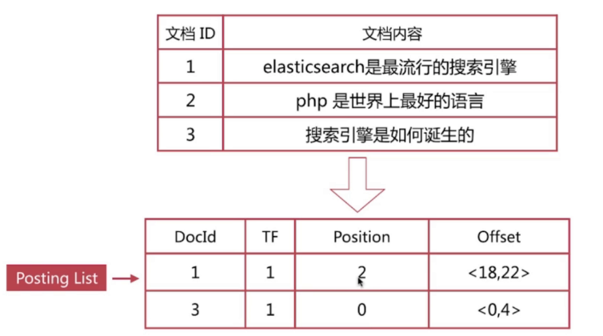
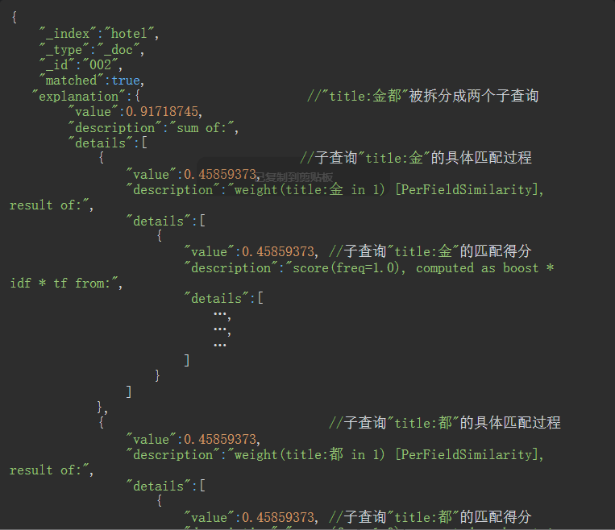
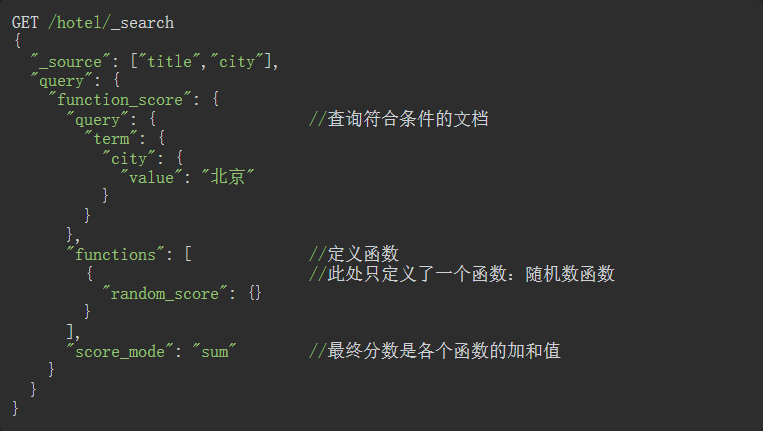
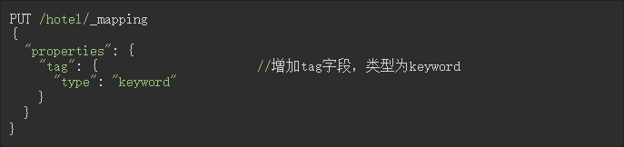
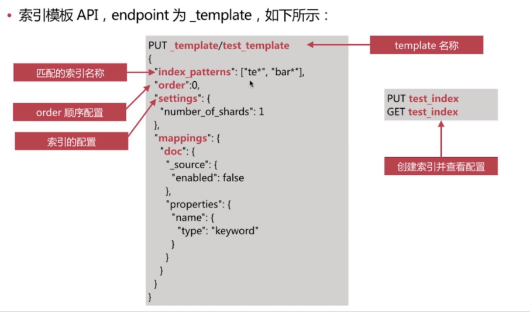
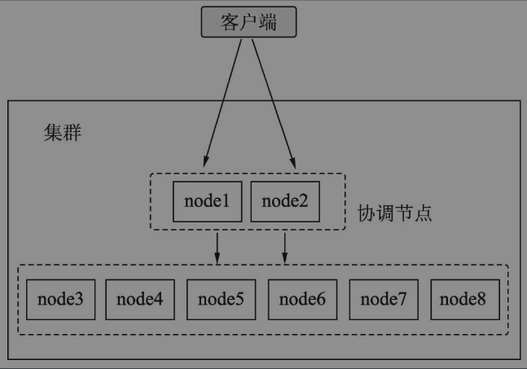
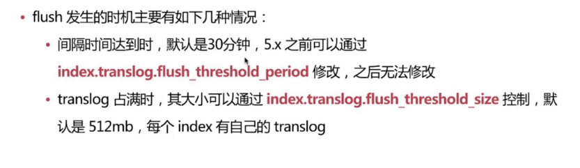

# ElasticSearch

## 倒排索引

倒排索引主要分为两部分，分别是TermDictionory 以及 Positing List，TermDictionory 主要存储分词后的单词，Positing List 则是用于存储分词对应的文档信息

### TermDictinory

TermDictinory 主要用于存储分词，TermDictinory 底层通过跳表进行存储以保证有序（有待验证），在进行查找时通过二分查找发进行快速查找，结构如下：


<center>左面是词项词典(Term Dictionary)，右边是倒排记录表(Posting)</center>

在Lucene中，词典和倒排是分开存储的，词典存储在.tii和.tis文件中。 而倒排又分为两部分存储，第一部分是文档号和词频信息，存储在.frq中；另一部分是词的位置信息， 存储在.prx文件中。 

有了term dictionary之后，可以用 logN 次磁盘查找得到目标。


#### Term Index

TermDictinory 本身是非常大的，如果完全加载到内存中，那内存没办法完全支撑，如果直接通过二分查找在磁盘上进行查找就会导致大量的随机读，并且在查找过程中需要随机的访问许多磁盘块，性能会比较低，所以ES 在这个基础上提供了Term Index 前缀索引用于进行查询

> Elasticsearch直接通过内存查找term，不读磁盘， 但是整个term dictionary本身又太大了，无法完整地放到内存里。于是就有了term index。


term index有点像一本字典的大的章节表，或者说，像一本书的目录。Term 本身可以是任意的byte数组 ，如下：

```
 A开头的term ……………. Xxx页
 C开头的term ……………. Xxx页
 E开头的term ……………. Xxx页
```

实际的term index，的内部结构，类似一棵 trie 树：例子是一个包含 “A”, “to”, “tea”, “ted”, “ten”, “i”, “in”, 和 “inn” 的 trie 树。


<center>Tire 树结构</center>


#### Term Dictionary与Term Index存储 

Term Dictionary文件的后缀名为tim，Term Index文件的后缀名是tip。

> Lucene为词典做了一层前缀索引(Term Index)，这个索引在Lucene4.0以后采用的数据结构是FST  (Finite State Transducer)，一种前缀树的变种，可以称之为前缀索引。

这种数据结构占用空间很小，Lucene打开索引的时候将其全量装载到内存中，加快磁盘上词典查询速度 的同时减少随机磁盘访问次数


#### Tire Tree

Trie，又经常叫前缀树，字典树等等。

- 一个节点的所有子孙都有相同的前缀，也就是这个节点对应的字符串，而根节点对应空字符串
- 一般情况下，不是所有的节点都有对应的值，只有叶子节点和部分内部节点所对应的键才有相关的 值。

trie的算法可以很容易地修改为处理其它结构的有序序列，比如一串数字或者形状的排列。

 这棵树不会包含所有的 term，它包含的是 term 的一些前缀。 

通过 term index 可以快速地定位到 term dictionary 的某个 offset，然后从这个位置再往后顺序查找。 再加上一些压缩技术（搜索 Lucene Finite State Transducers）, term index 的尺寸可以只有所有  term 的尺寸的几十分之一，使得用内存缓存整个 term index 变成可能。 整体上来说就是这样的效果：


#### Elasticsearch/Lucene 检索可以比 Mysql 快

Mysql 只有 term dictionary 这一层，是以 b+tree 排序的方式存储在磁盘上的。

 检索一个 term 需要若干次（1-3次）的 random access 的磁盘操作。 而ES/ Lucene 在 term dictionary 的基础上添加了 term index 来加速检索，term index 以类似前 缀树的形式缓存在内存中。 

从 term index 查到对应的 term dictionary 的 block 位置之后，再去磁盘上找 term，大大减少了 磁盘的 random access 次数, 将3次 变成了1次。


#### Tire Tree 与 FST 对比

Tire 和FSA的区别在于，FSA可以共享前缀和后缀，而 Tire 则只共享前缀

 对于键mon，tues，thurs来说，FSA如下：


对于键mon，tues，thurs来说，而trie树只**共享前缀**，如下


#### FST 构建

FSA和trie的区别在于，共享后缀。因此一个FSA的空间会比trie少很多，但是构建起来却更复杂。

下面以对“cat”、 “deep”、 “do”、 “dog” 、“dogs”这5个单词为例，进行插入构建FST（注：必须已排 序）：

1）插入“cat”

插入cat，每个字母形成一条边，其中t边指向终点。


2）插入“deep”

与前一个单词“cat”进行最大前缀匹配，发现没有匹配则直接插入，P边指向终点。


3）插入“do”

与前一个单词“deep”进行最大前缀匹配，发现是d，则在d边后增加新边o，o边指向终点。


4）插入“dog”

与前一个单词“do”进行最大前缀匹配，发现是do，则在o边后增加新边g，g边指向终点


5）插入“dogs”

与前一个单词“dog”进行最大前缀匹配，发现是dog，则在g后增加新边s，s边指向终点


最终我们得到了如上一个有向无环图。 

利用该结构可以很方便的进行查询，如给定一个term “dog”，我们可以通过上述结构很方便的查询存不 存在，甚至我们在构建过程中可以将单词与某一数字、单词进行关联，从而实现key-value的映射

> 有学术研究表明：FST紧凑的结构，通过对词典中单词前缀和后缀的重复利用，压缩了存储空间。FST压缩率一般在3倍~20倍之间。O(len(str))的查询时间复杂度


### Positing List

Postint List 用于存储 文档对应的doc id、词频、以及分词后Position 、Offset 位置等等，以搜索引擎为例：




## 增删改查

### 增加索引

可以参考Mappings，通过动态添加或者是添加Mapping的方式


### 删除索引

```
DELETE index
DELETE index/_doc/id
```


### 根据条件删除索引

```
POST /hotel_202201/_delete_by_query
{
  "query": {
    "term": {
      "name": {
        "value": "zhangsan"
      }
    }
  }
}
```


### 修改索引

```
POST index/_doc/001
{
	"properties": "data"
}
```

```
POST book_v1/_update/001
{
  "doc": {
    "properties": "data"
  }
}
```


### 根据条件更新文档

````json
POST /hotel_202201/_update_by_query
{
  "query": {
    "term": {
      "name": {
        "value": "lisi"
      }
    }
  },
  "script": {
    "source": "",
    "lang": "painless"
  }
}
````


### 关闭索引

在有些场景下，某个索引暂时不使用，但是后期可能又会使用，这里的使用是指数据写入和数据搜索。这个索引在某一时间段内属于冷数据或者归档数据，这时可以使用索引的关闭功能。索引关闭时，只能通过ES的API或者监控工具看到索引的元数据信息，但是此时该索引不能写入和搜索数据，待该索引被打开后，才能写入和搜索数据

```
POST index/_close
```


### 打开索引

```
POST /hotel/_open
```


### 批量操作

#### 索引的批量操作

**批量查询和批量增删改**

- 批量查询

  ```
  GET /_mget
  ```

- 批量写入：

  ```
  POST /_bulk
  POST /index/_bulk
  {"action": {"metadata"}}
  {"data"}
  ```

**注意：**

 bulk api对json的语法有严格的要求，除了delete外，每一个操作都要两个json串（metadata和business data），且每个json串内不能换行，非同一个json串必须换行，否则会报错；

 bulk操作中，任意一个操作失败，是不会影响其他的操作的，但是在返回结果里，会告诉你异常日志

- **索引的操作类型**

  - **create**：如果在PUT数据的时候当前数据已经存在，则数据会被覆盖，如果在PUT的时候加上操作类型create，此时如果数据已存在则会返回失败，因为已经强制指定了操作类型为create，ES就不会再去执行update操作。比如：PUT /pruduct/_create/1/ （ 老版本的语法为 PUT /pruduct/_doc/1/_create ）指的就是在索引product中强制创建id为1的数据，如果id为1的数据已存在，则返回失败。

  - **delete**：删除文档，ES对文档的删除是懒删除机制，即标记删除。（lazy delete原理）

  - **index**：在ES中，写入操作被称为Index，这里Index为动词，即索引数据为将数据创建在ES中的索引，写入数据亦可称之为“索引数据”。可以是创建，也可以是全量替换

  - **update**：执行partial update（全量替换，部分替换）

**以上四种操作类型均为写操作。ES中的数据写入均发生在Primary Shard，当数据在Primary写入完成之后会同步到相应的Replica Shard。ES的数据写入有两种方式：单个数据写入和批量写入，ES为批量写入数据提供了特有的API：_bulk。底层原理在我的《Elasticsearch底层原理》有详细介绍**

- **优缺点**

  - 优点：相较于普通的Json格式的数据操作，不会产生额外的内存消耗，性能更好，常用于大数据量的批量写入

  - 缺点：可读性差，可能会没有智能提示。

- **使用场景**
  - 大数据量的批量操作，比如数据从MySQL中一次性写入ES，批量写入减少了对es的请求次数，降低了内存开销以及对线程的占用。


#### 批量查询

```json
GET _mget
{
    "docs": [
        {
            "_index": "example",
            "_type": "docs",
            "_id": "1"
        },
        {
            "_index": "example",
            "_type": "docs",
            "_id": "2"
        },
        {
            "_index": "example",
            "_type": "docs",
            "_id": "3"
        }
    ]
}

#index和type相同的话可以简化成如下
GET example/docs/_mget
{
    "docs": [
        {
            "_id": "1"
        },
        {
            "_id": "2"
        },
        {
            "_id": "3"
        }
    ]
}

```


#### 批量删除

```
POST _bulk
{"delete": {"_index": "book_v1","_id": "001"}}
{"delete": {"_index": "book_v1","_id": "001"}}
```


#### 批量更新

```json
POST _bulk
{"update": {"_index": "hotel_202201","_id":"001"}}
{"doc":{"name": "lisi"}}
{"update": {"_index": "hotel_202201","_id":"002"}}
{"doc":{"name": "zhangsan"}}
```


#### 批量添加

```json
POST _bulk
{"index": {"_index":"index","_id":"001"}}
{"name": "java"}
{"index": {"_index":"index","_id":"001"}}
{"name": "java"}
```

```json
POST hotel_202201/_bulk
{"index": {"_id":"001"}}
{"name": "rujia"}
{"index": {"_id":"002"}}
{"name": "hanting"}
```


##  Search API

### Query And Fetch

Search执行的时候实际分两个步骤运作的

- Query阶段
- Fetch 阶段

#### Query阶段

1、在收到客户端请求后，首先会进入到协调节点node3节点，node3在接收到用户的search请求后，会先进行Query阶段

2、node3在6个主副分片中随机选择三个分片，发送search request请求

3、被选中的3个分片会分别执行查询并排序，返回from+size 个文档id和排序值

4、node3整合三个分片返回的from+size个文档id，根据排序值排序后选取from到from+size的文档id


#### fetch 阶段

node3根据Query节点获取的文档id列表去对应的shard上获取文档详情数据

- 1、node3向相关的分片发送multi_get 请求
- 2、3个分片返回文档详细数据
- 3、node3拼接返回的结果并返回给客户


### _source

考虑到性能问题，需要对搜索结果进行“瘦身”——指定返回的字段。在ES中，通过_source子句可以设定返回结果的字段。_source指向一个JSON数组，数组中的元素是希望返回的字段名称。

```
GET book_v1/_search
{
  "_source": ["book_name.keyword"], 
  "query": {
    "match_all": {}
  }
}
```


### count 查询

```
GET hotel/_count

{
  "count" : 0,  //返回的count计数
  "_shards" : {   //搜索命中的分片信息
    "total" : 2,
    "successful" : 2,
    "skipped" : 0,
    "failed" : 0
  }
}
```


### post_filter

使用 post_filter 参数筛选搜索结果时，计算聚合后将过滤 search hits。post filter 对聚合结果没有影响。

```json
POST /hotel_202201/_search
{
  "aggs": {
    "name_agg": {
      "terms": {
        "field": "name",
        "size": 10
      }
    }
  }, 
  "post_filter": {
    "prefix": {
      "name": "zhang"
    }
  }
}
```


### existing 查询

exsiting 查询是针对空数组或者是字段值为null或者是数组值为null的场景判断

```
GET /hotel/_search
{
  "query": {
    "exists": {
      "field": "name" // []、[null]、null 当field 值为这三种时会返回false
    }
  }
}
```


### profile

profile 可以查看es执行的过程，以及耗时


### explain

在使用搜索引擎时，一般都会涉及排序功能。如果用户不指定按照某个字段进行升序或者降序排列，那么ES会使用自己的打分算法对文档进行排序。有时我们需要知道某个文档具体的打分详情，以便于对搜索DSL问题展开排查。ES提供了explain功能来帮助使用者查看搜索时的匹配详情。explain的使用形式如下：


以下示例为按照标题进行搜索的explain查询请求：


执行上述explain查询请求后，ES返回的信息如下：




### Match Query

#### match

#### match_all

#### match_phare

用于词语查询，类似于term查询，通过slop参数可以控制单词间的间隔

```
POST /hotel_202201/_search
{
  "query": {
    "match_phrase": {
      "FIELD": "PHRASE",
      "slop":1
    }
  }
}
```


#### match_phare_prefix


### Term Query

#### term

term 搜索不会被搜索分词

```
POST /hotel_202201/_search
{
  "query": {
    "term": {
      "name": [
        "zhangsan"
      ]
    }
  }
}
```


#### terms

terms  用于多term查询

```
POST /hotel_202201/_search
{
  "query": {
    "terms": {
      "name": [
        "zhangsan",
        "lisi"
      ]
    }
  }
}
```


#### term 与 match_phrase 的区别

term搜索不会将搜索词分词，match_phrase 会将检索关键词分词, match_phrase的分词结果必须在被检索字段的分词中都包含，而且顺序必须相同，而且默认必须都是连续的


### Query string

#### query_string


#### simple query string


### Bool  Query

可以组合多个查询条件，bool查询也是采用more_matches_is_better的机制，因此满足must和should子句的文档将会合并起来计算分值

- **must**：必须满足子句（查询）必须出现在匹配的文档中，并将有助于得分。
- **filter**：过滤器 不计算相关度分数，cache☆子句（查询）必须出现在匹配的文档中。但是不像 must查询的分数将被忽略。Filter子句在[filter上下文](https://www.elastic.co/guide/en/elasticsearch/reference/current/query-filter-context.html)中执行，这意味着计分被忽略，并且子句被考虑用于缓存。
- **should**：可能满足 or子句（查询）应出现在匹配的文档中。
- **must_not**：必须不满足 不计算相关度分数 not子句（查询）不得出现在匹配的文档中。子句在[过滤器上下文](https://www.elastic.co/guide/en/elasticsearch/reference/current/query-filter-context.html)中执行，这意味着计分被忽略，并且子句被视为用于缓存。由于忽略计分，0因此将返回所有文档的分数。

**query 与filter的不同点在于，query是要对查询的每个结果计算相关性得分的，而filter不会。另外filter有相应的缓存机制，可以提高查询效率**

**minimum_should_match**：参数指定should返回的文档必须匹配的子句的数量或百分比。如果bool查询包含至少一个should子句，而没有must或 filter子句，则默认值为1。否则，默认值为0

```json
GET /hotel/_search
{
  "query": {
    "bool": {
      "should": [
        {
          "term": {
            "FIELD": {
              "value": "VALUE"
            }
          }
        },
        {
          "term": {
            "FIELD": {
              "value": "VALUE"
            }
          }
        }
      ],
      "minimum_should_match": 2  //表示should条件中必须有最少符合查询的条件
    }
  }
}
```


### Range

范围查询

```json
POST /hotel_202201/_search
{
  "query": {
    "range": {
      "name": {
        "gte": 10,
        "lte": 20
      }
    }
  }
}
```

针对日期的查询可以通过 Date Math来进行操作，比如：

```json
"range": {
    "brith": {
        "get": "now-20d"
    }
}
```


### 分页操作

分页是必不可少的功能，在ES中提供了多种分页手段，但是通常使用的就是from/to、scroll 以及 search after 这三种，这三种方式也分别作用于不同的应用场景也有一些对应的优缺点，分析如下：

- from/to：需要实时获取顶部的部分文档，并且可以自由翻页，但是不适合深翻页，因为深分页是需要占用大量的内存进行排序，这样就会导致占用协调节点大量的资源
- scroll ：不适合实时查询的分页，因为scroll 是相当于保存了一份快照信息，后边更新的数据在当前快照是无法查询到的，这样就会导致数据滞后，最常用的还是用于备份数据使用
- search_after: 避免深度分页问题，提供实时的下一页文档查询，缺点是不能使用from参数，既不能指定页数，只能上一页不能下一页

> ### 扩展
>
> 一个ES索引的数据分布在多个分片中，而这些分片又分配在不同的节点上。一个带有分页的搜索请求往往会跨越多个分片，每个分片必须在内存中构建一个长度为from+size的、按照得分排序的有序队列，用以存储命中的文档。然后这些分片对应的队列数据都会传递给协调节点，协调节点将各个队列的数据进行汇总，需要提供一个长度为number_of_shards*（from+size）的队列用以进行全局排序，然后再按照用户的请求从from位置开始查找，找到size个文档后进行返回。
>
> 基于上述原理，ES不适合深翻页。什么是深翻页呢？简而言之就是请求的from值很大。假设在一个3个分片的索引中进行搜索请求，参数from和size的值分别为1000和10，其响应过程如图4.1所示。
>
> 
>
> 当深翻页的请求过多时会增加各个分片所在节点的内存和CPU消耗。尤其是协调节点，随着页码的增加和并发请求的增多，该节点需要对这些请求涉及的分片数据进行汇总和排序，过多的数据会导致协调节点资源耗尽而停止服务, **es 通过 index.max_result_window 限定最多10000条数据**


#### from/to 分页

不适合深度分页，会导致占用协调节点的过多资源

```
GET book_v1/_search
{
  "from": 10000,
  "size": "2",
  "_source": ["book_name.keyword"], 
  "query": {
    "match_all": {}
  }
}
```


#### scroll 分页

遍历文档，以快照的方式来避免深度分页的问题，不能用来做实时搜索，因为数据不是实时的

**1、第一步调用scroll api 生成对应的scroll id**

```
//es 在收到该请求后会根据条件创建文件ID合集的快照信息
GET hotel_202201/_search?scroll=5m  //scroll=5m 代表该scroll快照的有效时间
{
  //每次scrolll 返回的文档数
  "size": 1,
  "query": {
    "match_all": {}
  },
  "sort": [
    {
      "name": {
        "order": "desc"
      }
    }
  ]
}
```

```
{
 // 用于scroll 查询时的参数，用于下一次查询
  "_scroll_id" : "FGluY2x1ZGVfY29udGV4dF91dWlkDXF1ZXJ5QW5kRmV0Y2gBFlVLSTA4ZHFBUWYyODJnNWpaUHQ0OUEAAAAAAAAxphZlcUJBY290SlJOZVdYUEdHVzRMdkh3",
  "took" : 6,
  "timed_out" : false,
  "_shards" : {
    "total" : 1,
    "successful" : 1,
    "skipped" : 0,
    "failed" : 0
  }
```


**2、第二部调用scroll search 的api获取文档集合，不断迭代调用知道返回hits.hits数组为空时停止，如下所示：**

```json
POST _search/scroll
{
  "scroll": "5m",
  "scroll_id": "FGluY2x1ZGVfY29udGV4dF91dWlkDXF1ZXJ5QW5kRmV0Y2gBFlVLSTA4ZHFBUWYyODJnNWpaUHQ0OUEAAAAAAAAxphZlcUJBY290SlJOZVdYUEdHVzRMdkh3"
}
```

```json
//因为这个索引本身就没有数据，所以返回为空
{
  //这里会生成新的_scroll_id用于下一次查询使用，因为索引本身没有数据，所以前后两次都是一样的
  "_scroll_id" : "FGluY2x1ZGVfY29udGV4dF91dWlkDXF1ZXJ5QW5kRmV0Y2gBFlVLSTA4ZHFBUWYyODJnNWpaUHQ0OUEAAAAAAAAxphZlcUJBY290SlJOZVdYUEdHVzRMdkh3",
  "took" : 1,
  "timed_out" : false,
  "_shards" : {
    "total" : 1,
    "successful" : 1,
    "skipped" : 0,
    "failed" : 0
  },
  "hits" : {
    "total" : {
      "value" : 1,
      "relation" : "eq"
    },
    "max_score" : null,
    "hits" : [ ]
  }
}
```


**3、过多的scroll调用会占用大量的内存，可以通过clear api 删除过多的scroll快照：**

```json
DELLETE /_search/scroll
{
    "scroll_id": [
        "FGluY2x1ZGVfY29udGV4dF91dWlkDXF1ZXJ5QW5kRmV0Y2gBFlVLSTA4ZHFBUWYyODJnNWpaUHQ0OUEAAAAAAAAxphZlcUJBY290SlJOZVdYUEdHVzRMdkh3"
    ]
}

DELETE /_search/scroll/_all
```


#### search after 分页

避免深度分页问题，提供实时的下一页文档查询，缺点是不能使用from参数，既不能指定页数，只能上一页不能下一页

- 第一步 ：为正常的搜索，但是要指定sort值，并保证唯一
- 第二步： 为使用上一步最后一个文档的sort值进行查询


search_after 通过唯一的排序值可以在每个分片中快速的定位到对应的的文档，然后将每次处理的文档值都控制在size内


### Sort 排序

es 默认会采用相关性算分排序，用户可以通过设定sorting参数来自省设定排序规则，比如也可以通过score 或者是doc等

```json
GET /hotel/_search
{
  "sort": [
    {
      "name": {
        "order": "desc"
      }
    },
    {
      "_score": {   //指的是相关性算分
        "order": "desc"
      }
    },
    {
      "_doc": {  //指文档内部id，和索引的顺序相关（分片内唯一）
        "order": "desc"
      }
    }
  ], 
  "query": {
    "match_all": {}
  }
}
```

按照字符串排序比较特殊，因为es 有text与keyword两种类型，针对text类型排序必须要将field_data设置为true才可以

排序的过程中实际是对字段原始内容排序的过程，这个过程中红倒排缩影无法发挥作用，需要用到正排索引，也就是通过文档id和字段可以快速得到字段原始内容，es对此提供了两种实现方式，分别为fielddata 与 doc_values

- fielddata 默认禁用，是针对text类型的，需要额外的空间存储，如果text类型字段是需要排序或者是聚合的建议打开，因为可以提升性能
- doc_values 默认是启用的，除了text类型其他类型都可以使用，在针对聚合或者排序的场景中可以提升性能


### Function Score

当使用ES进行搜索时，命中的文档默认按照相关度进行排序。有些场景下用户需要干预该“相关度”，此时就可以使用Function Score查询。使用时，用户必须定义一个查询以及一个或多个函数，这些函数为每个文档计算一个新分数。

下面使用一个随机函数对查询结果进行排序：



上述请求使用了Function Score查询，其中，query子句负责对文档进行匹配，本例使用了简单的term查询，functions子句负责输出对文档的排序分值，此处使用了random_score随机函数，使得每个文档的分数都是随机生成的。每次执行上述查询时生成的文档分数都不同。以下为某次搜索的结果：


### ConstantScore

如果不想让检索词频率TF（Term Frequency）对搜索结果排序有影响，只想过滤某个文本字段是否包含某个词，可以使用Constant Score将查询语句包装起来

假设需要查询name 字段包含关键词“hanting”的酒店，则请求的DSL如下：

```json
GET /hotel_202201/_search
{
  "query": {
    "constant_score": {
      "filter": {
        "term": {
          "name": "hanting"
        }
      },
      "boost": 1.0
    }
  }
}
```

```json
{
  "took" : 1,
  "timed_out" : false,
  "_shards" : {
    "total" : 1,
    "successful" : 1,
    "skipped" : 0,
    "failed" : 0
  },
  "hits" : {
    "total" : {
      "value" : 1,
      "relation" : "eq"
    },
    "max_score" : 1.0,
    "hits" : [
      {
        "_index" : "hotel_202201",
        "_type" : "_doc",
        "_id" : "002",
        "_score" : 1.0,  //所有分数都是1.0
        "_source" : {
          "name" : "hanting"
        }
      }
    ]
  }
}
```

通过结果可以看到，使用Constant Score搜索时，命中的酒店文档对应的name字段都包含有“hanting”一词。但是不论该词在文档中出现多少次，这些文档的得分都是一样的，值为1.0。在Constant Score搜索中，参数boost可以控制命中文档的得分，默认值为1.0


### 高亮显示

可以通过pre_tags以及post_tags 来自定义标签，如果不自定义标签则采用`<em>` 标签

```
GET /hotel/_search
{
  "explain": true, 
  "query": {
    "match_all": {}
  }
  , "highlight": {
    "fields": {
      "name": {
        "pre_tags": "<high>",
        "post_tags": "</high>"
      }
    }
  }
}
```


## Mapping

Mapping 分为手动创建与动态创建两种，手动创建就是指我们自己通过DSL来创建对应的mapping隐射，而动态创建是我们添加索引数据时ES 会根据我们传入的数据来自动创建Mapping既ES 对应的类型

当创建完Mapping后，Mapping中的字段类型是不可以修改的，但是字段可以扩展，最常见的扩展方式就是增加字段和objet对象类型的数据


### Mapping 中的基本数据类型

#### keyword 类型

keyword类型是不进行切分的字符串类型。这里的“不进行切分”指的是：**在索引时，对keyword类型的数据不进行分词，而是直接构建倒排索引；在搜索时，对该类型的查询字符串不进行切分后的部分匹配**。keyword类型数据一般用于对文档的过滤、排序和聚合

在现实场景中，keyword经常用于描述姓名、产品类型、用户ID、URL和状态码等。keyword类型数据一般用于比较字符串是否相等，不对数据进行部分匹配，因此一般查询这种类型的数据时使用term查询

例如，建立一个人名索引，可以设定姓名字段为keyword字段：

```
PUT /user 
{
  "mappings": {
    "properties": {
      "username": {
        "type": "keyword"
      }
    }
  }
}
```

现在写入一条数据，请求的DSL如下：

```
POST /user/_doc/001 
{
  "username":"张三"
}
```

通过term 查看刚刚写入的数据：

```
"hits" : {
    "total" : {
      "value" : 1,
      "relation" : "eq"
    },
    "max_score" : 0.2876821,
    "hits" : [
      {
        "_index" : "user",
        "_type" : "_doc",
        "_id" : "001",
        "_score" : 0.2876821,
        "_source" : {
          "username" : "张三"
        }
      }
    ]
  }
```


#### text 类型

text类型对比于keyword来说，是专门针对需要分词的字段的，在创建索引时会按照相应的分词算法对文本内容进行切分，然后构建倒排索引

例如，一个酒店搜索项目，我们希望可以根据酒店名称即title字段进行模糊匹配，因此可以设定title字段为text字段，建立酒店索引的DSL如下：

```json
PUT hotel 
{
  "settings": {
    "number_of_replicas": 1,
    "number_of_shards": 3
  }, 
  "mappings": {
    "properties": {
      "title": {
        "type": "text"
      }
    }
  }
}
```

现在写入一条数据：

```json
POST hotel/_doc/001
{
  "title": "如家快捷酒店"
}
```

通过match来进行分词后的搜索：

```json
GET hotel/_search
{
  "query": {
    "match": {
      "title": "酒店"
    }
  }
}
```

```json
{
  "took" : 710,
  "timed_out" : false,
  "_shards" : {
    "total" : 3,
    "successful" : 3,
    "skipped" : 0,
    "failed" : 0
  },
  "hits" : {
    "total" : {
      "value" : 1,
      "relation" : "eq"
    },
    "max_score" : 0.5753642,
    "hits" : [
      {
        "_index" : "hotel",
        "_type" : "_doc",
        "_id" : "001",
        "_score" : 0.5753642,
        "_source" : {
          "title" : "如家快捷酒店"
        }
      }
    ]
  }
}
```


#### 数值类型

ES支持的数值类型有long、integer、short、byte、double、float、half_float、scaled_float和unsigned_long等。

各类型所表达的数值范围可以参考官方文档，网址为https://www.elastic.co/guide/en/elasticsearch/reference/current/number.html。

为节约存储空间并提升搜索和索引的效率，在实际应用中，在满足需求的情况下应尽可能选择范围小的数据类型。比如，年龄字段的取值最大值不会超过200，因此选择byte类型即可。数值类型的数据也可用于对文档进行过滤、排序和聚合。以酒店搜索为例，酒店的索引除了包含酒店名称和城市之外，还需要定义价格、星级和评论数等，创建索引的DSL如下:


对于数值型数据，一般使用term搜索或者范围搜索。例如，搜索价格为350～400（包含350和400）元的酒店，搜索的DSL如下：


#### 布尔类型

布尔类型使用boolean定义，用于业务中的二值表示，如商品是否售罄，房屋是否已租，酒店房间是否满房等。写入或者查询该类型的数据时，其值可以使用true和false，或者使用字符串形式的"true"和"false"。下面的DSL定义索引中“是否满房”的字段为布尔类型：


下面的DSL将查询满房的酒店：


#### 时间类型

在ES中，日期类型的名称为date。ES中存储的日期是标准的UTC格式。下面定义索引hotel，该索引有一个create_time字段，现在把它定义成date类型。定义date类型请求的DSL如下：


一般使用如下形式表示日期类型数据：

- 格式化的日期字符串。·毫秒级的长整型，表示从1970年1月1日0点到现在的毫秒数。
- 秒级别的整型，表示从1970年1月1日0点到现在的秒数。

日期类型的默认格式为strict_date_optional_time||epoch_millis。其中，strict_date_optional_time的含义是严格的时间类型，支持

- yyyy-MM-dd
- yyyyMMdd
- yyyyMMddHHmmss
- yyyy-MM-ddTHH:mm:ss
- yyyy-MM-ddTHH:mm:ss.SSS
- yyyy-MM-ddTHH:mm:ss.SSSZ等格式

epoch_millis的含义是从1970年1月1日0点到现在的毫秒数。下面写入索引的文档中有一个create_time字段是日期格式的字符串，请求的DSL如下：


搜索日期型数据时，一般使用ranges查询。例如，搜索创建日期为2015年的酒店，请求的DSL如下：


日期类型默认不支持yyyy-MM-dd HH:mm:ss格式，如果经常使用这种格式，可以在索引的mapping中设置日期字段的format属性为自定义格式。下面的示例将设置create_time字段的格式为yyyy-MM-dd HH:mm:ss：


#### 数组类型

ES数组没有定义方式，其使用方式是开箱即用的，即无须事先声明，在写入时把数据用中括号[]括起来，由ES对该字段完成定义。

当然，如果事先已经定义了字段类型，在写数据时以数组形式写入，ES也会将该类型转为数组。例如，为hotel索引增加一个标签字段，名称为tag，请求的DSL如下：



查看一下索引hotel的mapping：


通过返回的mapping信息来看，新增的tag字段与普通的keyword类型字段没什么区别，现在写入一条数据：


查看一下写入的数据，ES返回的信息如下：


数组类型的字段适用于元素类型的搜索方式，也就是说，数组元素适用于什么搜索，数组字段就适用于什么搜索。例如，在上面的示例中，数组元素类型是keyword，该类型可以适用于term搜索，则tag字段也可以适用于term搜索，搜索的DSL如下：


ES中的空数组可以作为missing field，即没有值的字段，下面的DSL将插入一条tag为空的数组：


#### object 类型

object 类型的建立分为三种建立方式，分别为普通创建、Nested Object 以及 Parent Child object，这里以第一种为例

在实际业务中，一个文档需要包含其他内部对象。例如，在酒店搜索需求中，用户希望酒店信息中包含评论数据。评论数据分为好评数量和差评数量。为了支持这种业务，在ES中可以使用对象类型。和数组类型一样，对象类型也不用事先定义，在写入文档的时候ES会自动识别并转换为对象类型。下面将在hotel索引中添加一条记录，请求的DSL如下：

```
POST hotel/_doc/001
{
  "name": "test",
  "info": {
    "age": "10"
  }
}
```

查看其自动创建的mapping信息：

```
{
  "hotel" : {
    "mappings" : {
      "properties" : {
        "info" : {
          "properties" : {
            "age" : {
              "type" : "long"
            }
          }
        },
        "name" : {
          "type" : "text",
          "fields" : {
            "keyword" : {
              "type" : "keyword",
              "ignore_above" : 256
            }
          }
        }
      }
    }
  }
}
```

我们可以通过创建的内部对象来查询其信息，如下：

```
GET hotel/_search
{
  "query": {
    "term": {
      "info.age": {
        "value": "10"
      }
    }
  }
}
```


#### Netsted Object


#### 地理位置

在移动互联网时代，用户借助移动设备产生的消费也越来越多。例如，用户需要根据某个地理位置来搜索酒店，此时可以把酒店的经纬度数据设置为地理数据类型。该类型的定义需要在mapping中指定目标字段的数据类型为geo_point类型，示例如下：


其中，location字段定义为地理类型，现在向索引中写入一条酒店文档，DSL如下：


### 动态隐射

当字段没有定义时，ES可以根据写入的数据自动定义该字段的类型，这种机制叫作动态映射。其实，在前面的章节中我们已经用到了ES的动态映射机制。在介绍数组类型和对象类型时提到，这两种类型都不需要用户提前定义，ES将根据写入的数据自动创建mapping中对应的字段并指定类型。对于基本类型，如果字段没有定义，ES在将数据存储到索引时会进行自动映射，如表3.1所示为自动映射时的JSON类型和索引数据类型的对应关系


> 在一般情况下，如果使用基本类型数据，最好先把数据类型定义好，因为ES的动态映射生成的字段类型可能会与用户的预期有差别。例如，写入数据时，由于ES对于未定义的字段没有类型约束，如果同一字段的数据形式不同（有的是字符型，有的是数值型），则ES动态映射生成的字段类型和用户的预期可能会有偏差


#### 针对日期的动态映射

dynamic_date_fromats 可以自定义日期类型，date_detection 可以关闭日期的自动识别机制

```json
//创建索引
PUT myindex4
{
  "mappings": {
    "dynamic_date_formats": ["yyyy-MM-dd"]
    
  }
}

//添加索引数据
POST myindex4/_doc/001
{
  "datetime": "2022-01-01"
}

//查看索引映射信息
GET myindex4/_mapping
// 返回结果如下
{
  "myindex4" : {
    "mappings" : {
      "dynamic_date_formats" : [
        "yyyy-MM-dd"
      ],
      "properties" : {
        "datetime" : {
          "type" : "date",
          "format" : "yyyy-MM-dd"
        }
      }
    }
  }
}
```


#### dynamic templates


#### index template





### Mappding 属性扩展

#### fields

针对同一个字段，有时需要不同的数据类型，这通常表现在为了不同的目的以不同的方式索引相同的字段，示例如下：

```
#创建 index的mapping
PUT index5
{
  "mappings": {
    "properties": {
      "name": {
        "type": "text",
        "fields": {
          "keyword": {
            "type": "keyword"
          },
          "age_num": {
             "type": "long"
          }，
          "pinyin": {    
          	"type": "text",
          	"analyzer": "standard"    //针对多属性字段定义单独的分词器
          }
        }
      }
    }
  }
}

#查询index
GET index5/_search
{
  "query": {
    "term": {
      "name.age_num": {
        "value": 3
      }
    }
  }
}
```


#### type 

type 既是在创建属性字段时指定的类型

```
PUT index 
{
	"mappings": {
		"properties": {
			"name": {
				"type": "text"  //type 指定字段的类型
			}
		}
	}
}
```


#### dynamic 

dynamic 参数是用来控制字段是否可以新增

-  true 允许自动新增字段
- false 不允许自动新增字段，但是文档可以正常写入，不可以进行查询操作
- strict 文档不能写入，会报错

```
PUT my_index 
{
  "mappings": {
    "dynamic": "strict",
      "properties": {
        "name": {
          "type": "text"
        }
      }
  }
}
```


#### copy_to 参数

将该字段的值复制到目标字段，实现类似_all的作用，返回结果时不会出现在 `_souce` 中，只用来搜索

```
PUT my_index 
{
  "mappings": {
      "properties": {
        "first_name": {
          "type": "text",
          "copy_to": "full_name"
        },
        "last_name": {
          "type": "text",
          "copy_to": "full_name"
        },
        "full_name": {
          "type": "text"
        }
      }
  }
}
```


#### index

控制当前字段是否需要索引，默认为true，false既不记录索引，设置为false之后就不可以用来被搜索


#### index options


#### null_value

当字段遇到null值时的处理策略，默认为null，既空值，此时es会忽略该值，可以通过设定改值来设定字段的默认值

```
PUT my_index3
{
  "mappings": {
    "properties": {
      "name": {
        "type": "keyword",
        "null_value": ""
      }
    }
  }
}
```


#### doc_values

doc_values ：为了提升排序和聚合效率，默认true，如果确定不需要对字段进行排序或聚合，也不需要通过脚本访问字段值，则可以禁用doc值以节省磁盘 空间（不支持text和annotated_text）


####  norms

norms：是否禁用评分（在filter和聚合字段上应该禁用）


#### enable

enable：是否创建倒排索引，可以对字段操作，也可以对索引操作，如果不创建索引，让然可以检索并在_source元数据中展示，谨慎使用，该状态无法 修改。

```
    PUT my_index
    {
      "mappings": {
        "enabled": false
      }
    }
```

 


#### fielddata

fielddata：查询时内存数据结构，在首次用当前字段聚合、排序或者在脚本中使用时，需要字段为fielddata数据结构，并且创建倒排索引保存到堆中


### Mapping 语法 

#### 查看Mapping

```
GET /hotel/_mapping
```


#### 扩展Mapping

```
POST hotel/_mapping
{
	"properties" : {
		"tag": {  //索引中新增字段tag，类型为keyword
			"type": "keyword" 
		}
	}
}
```

查看索引hotel的mappings，结果如下：


## Mapping 扩展

### 1 概念：

ES中的mapping有点类似与RDB中“表结构”的概念，在MySQL中，表结构里包含了字段名称，字段的类型还有索引信息等。在Mapping里也包含了一些属性，比如字段名称、类型、字段使用的分词器、是否评分、是否创建索引等属性，并且在ES中一个字段可以有对个类型。分词器、评分等概念在后面的课程讲解。

### 2 查看mapping

GET /index/_mappings

### 3 ES数据类型

**①** **常见类型**

**1)** **数字类型**：

long integer short byte double float half_float scaled_float unsigned_long

**2)** **Keywords**：

**keyword**：适用于索引结构化的字段，可以用于过滤、排序、聚合。keyword类型的字段只能通过精确值（exact value）搜索到。Id应该用keyword

constant_keyword：始终包含相同值的关键字字段

wildcard：可针对类似grep的[通配符查询](https://www.elastic.co/guide/en/elasticsearch/reference/7.10/query-dsl-wildcard-query.html)优化日志行和类似的关键字值

关键字字段通常用于[排序](https://www.elastic.co/guide/en/elasticsearch/reference/7.10/sort-search-results.html)， [汇总](https://www.elastic.co/guide/en/elasticsearch/reference/7.10/search-aggregations.html)和[Term查询](https://www.elastic.co/guide/en/elasticsearch/reference/7.10/term-level-queries.html)，例如[`term`](https://www.elastic.co/guide/en/elasticsearch/reference/7.10/query-dsl-term-query.html)。

**3)** **Dates**（时间类型）：包括[`date`](https://www.elastic.co/guide/en/elasticsearch/reference/7.10/date.html)和 [`date_nanos`](https://www.elastic.co/guide/en/elasticsearch/reference/7.10/date_nanos.html)

  4) **alias**：为现有字段定义别名。

  5) [binary](https://www.elastic.co/guide/en/elasticsearch/reference/current/binary.html)（二进制）：[binary](https://www.elastic.co/guide/en/elasticsearch/reference/current/binary.html)

  6) [range](https://www.elastic.co/guide/en/elasticsearch/reference/current/range.html)（区间类型）：integer_range、float_range、long_range、double_range、date_range

  7) **text：当一个字段是要被全文搜索的，比如Email内容、产品描述，这些字段应该使用text类型。设置text类型以后，字段内容会被分析，在生成倒排索 引以前，字符串会被分析器分成一个一个词项。text类型的字段不用于排序，很少用于聚合。（解释一下为啥不会为text创建正排索引：大量堆空间，尤其是 在加载高基数text字段时。字段数据一旦加载到堆中，就在该段的生命周期内保持在那里。同样，加载字段数据是一个昂贵的过程，可能导致用户遇到延迟问 题。这就是默认情况下禁用字段数据的原因）**

 **② 对象关系类型：**

 **1) object：用于单个JSON对象**

 **2) nested：用于JSON对象数组**

  3) [flattened](https://www.elastic.co/guide/en/elasticsearch/reference/current/flattened.html)：允许将整个JSON对象索引为单个字段。

 **③ 结构化类型：**

 **1) geo-point：纬度/经度积分**

 **2) geo-shape：用于多边形等复杂形状**

 **3) point：笛卡尔坐标点**

 **2) shape：笛卡尔任意几何图形**

 ④ 特殊类型：

 **1) IP地址：ip 用于IPv4和IPv6地址**

 **2) [completion](https://pan.baidu.com/s/1Sd8JxEqZ-AeTrTMKF2c-iA#completion-suggester)：提供自动完成建议**

  3) tocken_count：计算字符串中令牌的数量

  4) [murmur3](https://www.elastic.co/guide/en/elasticsearch/plugins/7.7/mapper-murmur3.html)：在索引时计算值的哈希并将其存储在索引中

  5) [annotated-text](https://www.elastic.co/guide/en/elasticsearch/plugins/7.7/mapper-annotated-text.html)：索引包含特殊标记的文本（通常用于标识命名实体）

  6) [percolator](https://www.elastic.co/guide/en/elasticsearch/reference/current/percolator.html)：接受来自query-dsl的查询

  7) join：为同一索引内的文档定义父/子关系

  8) [rank features](https://www.elastic.co/guide/en/elasticsearch/reference/current/rank-features.html)：记录数字功能以提高查询时的点击率。

  9) [dense vector](https://www.elastic.co/guide/en/elasticsearch/reference/current/dense-vector.html)：记录浮点值的密集向量。

  10) [sparse vector](https://www.elastic.co/guide/en/elasticsearch/reference/current/sparse-vector.html)：记录浮点值的稀疏向量。

  11) [search-as-you-type](https://www.elastic.co/guide/en/elasticsearch/reference/current/search-as-you-type.html)：针对查询优化的文本字段，以实现按需输入的完成

  12) [histogram](https://www.elastic.co/guide/en/elasticsearch/reference/current/histogram.html)：histogram 用于百分位数聚合的预聚合数值。

  13) [constant keyword](https://www.elastic.co/guide/en/elasticsearch/reference/current/constant-keyword.html)：keyword当所有文档都具有相同值时的情况的 专业化。

 ⑤ array（数组）：在Elasticsearch中，数组不需要专用的字段数据类型。默认情况下，任何字段都可以包含零个或多个值，但是，数组中的所有值都必须具有 相同的数据类型。

 ⑥新增：

  1) date_nanos：date plus 纳秒

  2) features：

### 4 两种映射类型

- #### Dynamic field mapping：

  - #### 整数 => long

  - #### 浮点数 => float

  - #### true || false => boolean

  - #### 日期 => date

  - #### 数组 => 取决于数组中的第一个有效值

  - #### 对象 => object

  - #### 字符串 => 如果不是数字和日期类型，那会被映射为text和keyword两个类型

    除了上述字段类型之外，其他类型都必须显示映射，也就是必须手工指定，因为其他类型ES无法自动识别。

- #### Expllcit field mapping：手动映射

  ```json
  PUT /product
  {
  	"mappings": {
      "properties": {
      	"field": {
        	"mapping_parameter": "parameter_value"
  	   	}
     	}
   	}
  }
  ```

### 5 映射参数

 **①** **index：是否对创建对当前字段创建倒排索引，默认true，如果不创建索引，该字段不会通过索引被搜索到,但是仍然会在source元数据中展示**

 ② **analyzer：指定分析器（character filter、tokenizer、Token filters）。**

 ③ boost：对当前字段相关度的评分权重，默认1

 ④ coerce：是否允许强制类型转换 true “1”=> 1 false “1”=< 1

 ⑤ copy_to：该参数允许将多个字段的值复制到组字段中，然后可以将其作为单个字段进行查询

 **⑥** **doc_values：为了提升排序和聚合效率，默认true，如果确定不需要对字段进行排序或聚合，也不需要通过脚本访问字段值，则可以禁用doc值以节省磁盘 空间（不支持text和annotated_text）**

 ⑦ dynamic：控制是否可以动态添加新字段

  1) true 新检测到的字段将添加到映射中。（默认）

  2) false 新检测到的字段将被忽略。这些字段将不会被索引，因此将无法搜索，但仍会出现在_source返回的匹配项中。这些字段不会添加到映射中，必须显式 添加新字段。

  3) strict 如果检测到新字段，则会引发异常并拒绝文档。必须将新字段显式添加到映射中

 **⑧** **eager_global_ordinals：用于聚合的字段上，优化聚合性能。**

  1) Frozen indices（冻结索引）：有些索引使用率很高，会被保存在内存中，有些使用率特别低，宁愿在使用的时候重新创建，在使用完毕后丢弃数据， Frozen indices的数据命中频率小，不适用于高搜索负载，数据不会被保存在内存中，堆空间占用比普通索引少得多，Frozen indices是只读的，请求可能 是秒级或者分钟级。****eager_global_ordinals不适用于Frozen indices****

 ⑨ **enable：是否创建倒排索引，可以对字段操作，也可以对索引操作，如果不创建索引，让然可以检索并在_source元数据中展示，谨慎使用，该状态无法 修改。**

```
    PUT my_index
    {
      "mappings": {
        "enabled": false
      }
    }
```

 **⑩** **fielddata：查询时内存数据结构，在首次用当前字段聚合、排序或者在脚本中使用时，需要字段为fielddata数据结构，并且创建倒排索引保存到堆中**

 **⑪** **fields：给field创建多字段，用于不同目的（全文检索或者聚合分析排序）**

 ⑫ format：格式化

```
  "date": {
     "type":  "date",
     "format": "yyyy-MM-dd"
   }
```

 **⑬ ignore_above：keyword，text类型字段ignore_above属性(动态映射默认是256) ，表示最大的字段值长度，超出这个长度的字段将不会被索引，查询不到，但是会存储**

 ⑭ ignore_malformed：忽略类型错误

 ⑮ index_options：控制将哪些信息添加到反向索引中以进行搜索和突出显示。仅用于text字段

 ⑯ Index_phrases：提升exact_value查询速度，但是要消耗更多磁盘空间

 ⑰ Index_prefixes：前缀搜索

  1) min_chars：前缀最小长度，>0，默认2（包含）

  2) max_chars：前缀最大长度，<20，默认5（包含）

 ⑱ meta：附加元数据

 ⑲ normalizer：

 **⑳ norms：是否禁用评分（在filter和聚合字段上应该禁用）。**

 **21 null_value：为null值设置默认值**

 22 position_increment_gap：

 23 proterties：除了mapping还可用于object的属性设置

 **24 search_analyzer：设置单独的查询时分析器：**

 25 similarity：为字段设置相关度算法，支持BM25、claassic（TF-IDF）、boolean

 **26 store：设置字段是否仅查询**

 **27 term_vector：**运维参数


## 数据建模

ES 在数据建模时常要考虑的几个点如下：

- 数据建模时属性的一些基础设置，针对不同的业务场景来设定属性的配置
- 关联关系处理，比如在传统数据库中存在的关联关系，比如说一对一、一对多的关联关系，可以通过Netdsted Object 或者是 Parent Child的形式来处理


### 数据建模基础设置

在数据建模时，我们需要根据实际的业务字段来建立对应的属性类型，通过上面提到的mapping属性扩展可以了解到可以针对不同业务场景来对属性进行自定义配置，比如是否需要建立倒排索引或者是是否需要聚合等等，一般建立Mapping流程如下：


#### 类型设置

- 字符串类型
  - 需要分词则设定为text类型，否则设置为keyword类型
- 枚举类型
  - 基于性能考虑将其设定为keyword类型，即便该数据为整型
- 数值类型
  - 尽量选择贴近的类型，比如byte即可表示所有的数值时，既选用byte，不要用long
- 其他类型
  - 比如布尔类型、日期、地理位置等数据


#### 是否需要被检索


#### 是否需要排序和聚合分析


#### 是否需要另行存储

一般是不需要的，如果需要另行存储的话可以通过将store设置为true即可，示例如下：

```json
PUT myindex7
{
  "mappings": {
    "_source": {
      "enabled": false
    }, 
    "properties": {
      "name": {
        "type": "keyword",
        "store": true
      },
      "address_p": {
        "type": "keyword",
        "store": false
      }
    }
  }
}

//批量写入
POST _bulk
{"index": {"_index": "myindex7", "_id": "001"}}
{"name":"123","address_p":"456"}

//通过store_files 返回需要查询的数据
GET myindex7/_search
{
  "stored_fields": ["name","address_p"],
  "query": {
    "match_all": {}
  }
}
```


### Nested Object


### Parent Child


### reindex


### 


## 分词


## 分布式特性

### ES的基本概念

#### 索引

在ES中所有的数据都是以索引为维度进行存储的，一个索引就类似Mysql中的一张表，但是ES中的索引和Lucene 中的索引不是一一对应的，Es中的索引对应Llucence中的一个或多个索引

#### 文档

在ES中的文档就对应数据中心的一条数据，每一个文档都有一个版本号，初始版本号为1，用于解决并发的读写，并且针对这些文档提供了批量的增删改查操作


#### 字段

一个文档可以包含一个或多个字段，每个字段都有一个类型与其对应。除了常用的数据类型（如字符串型、文本型和数值型）外，ES还提供了多种数据类型，如数组类型、经纬度类型和IP地址类型等


#### Mapping 映射

建立索引时需要定义文档的数据结构，这种结构叫作映射。在映射中，文档的字段类型一旦设定后就不能更改。因为字段类型在定义后，ES已经针对定义的类型建立了特定的索引结构，这种结构不能更改

对应的关系如下图：


#### 集群和节点

在分布式系统中，为了完成海量数据的存储、计算并提升系统的高可用性，需要多台计算机集成在一起协作，这种形式被称为集群，如图1.2所示。这些集群中的每台计算机叫作节点。ES集群的节点个数不受限制，用户可以根据需求增加计算机对搜索服务进行扩展。


#### 分片

分片是和索引进行对应的，一个索引可以有多个分片，其是为了保证海量数据的存储，以及提升并发写的效率。针对不同的索引数据（这里指的是一条文档），会存储在不同的索引分片中


#### 副本分片

副本分片是为了保证当主分片所在的节点发生故障时，可以进行故障转移，通过选举将副本分片设置为主分片以对外提供服务，并且也可以用来做数据备份，并且还可以提升并发读，当我们需要读取数据时，首先会通过文档id定位到某个主分片上，然后通过RoundRonbin的方式进行轮询从这些主分片或者是副本分片上读取数据，这样就减缓了主分片的压力

在默认情况下，ES不会为索引的分片开启副分片，用户需要手动设置。副分片的个数设定后，也可以进行更改。一个分片的主分片和副分片分别存储在不同的节点上，设置如下：

```json
PUT shard_index
{
  "settings": {
    //主分片个数
    "number_of_shards": 1,
    //副本分片个数  
    "number_of_replicas": 1
  }
}
```


如下图，当我们将索引 的主分片设置为3，副本分片设置为2时，会自动散落在不通的节点上 ：


### ES 与 数据库对比

ES 与传统数据库对比的话有以下几点不通：

- 索引方式不通，传统数据库采用的是B+树的形式进行存储的，而ES 采用的是倒排索引的方式进行存储的
- 事务支持不通：ES是不支持事务的，ES采用乐观锁的形式，不会阻塞当前数据的更新、删除操作，而是为每一个数据维护一个版本号，当需要对数据进行操作时就会将版本号加1，如果在操作过程中发现拿到的版本号与数据最新版本号不一致，则会从新获取最新版本号再进行操作
- 语法不同：ES采用的是DSL的语法，而数据库则采用了SQL的语法
- 扩展方式不同：当数据库数据增大时，可以采用分库分表的方式进行解决，但是分库分表本身也会有一定的弊端，而ES只需要在创建索引时合理的指定分片数即可，当后期发现集群负载过高时，可以通过增加节点以及副本分片的方式来解决
- 数据的实时性：关系型数据库的存储基本上都是实时的，而ES为了提高数据写入的性能，ES在内存和磁盘之间增加了一层系统缓存。ES响应写入数据的请求后，会先将数据存储在内存中，此时该数据还不能被搜索到。内存中的数据每隔一段时间（默认为1s）被刷新到系统缓存内，此时数据才能被搜索到。因此，ES的数据写入不是实时的，而是准实时的


### 节点职责

ES 中的节点可以分为Master节点、数据节点以及协调节点

#### Master 节点

master节点负责维护整个集群的相关工作，管理集群的变更，如创建/删除索引、节点健康状态监测、节点上/下线等。master节点是由集群节点通过选举算法选举出来的，一个集群中只有一个节点可以成为master节点，但是可以有一个或多个节点参与master节点的选举。在默认情况下，任意节点都可以作为master的候选节点，可以通过配置项node.master对当前节点是否作为master的候选节点进行控制。

#### 数据节点

数据节点主要负责索引数据的保存工作，此外也执行数据的其他操作，如文档的删除、修改和查询操作。数据节点的很多工作是调用Lucene库进行Lucene索引操作，因此这种节点对于内存和I/O的消耗比较大，生产环境中应多注意数据节点的计算机负载情况


#### 协调节点

协调节点用于处理客户端的请求，**ES集群中的任何节点都可以作为一个协调节点，此时它的生命周期是和一个单独的请求相关的**。也就是说，当客户端向集群中的某个节点发起请求时，此时该节点被称为当前请求的协调节点；当它将响应结果返回给客户端后，该协调节点的生命周期就结束了。如图所示的左右两图分别表示两次不同的请求，因为请求时客户端指定的请求地址不同，所以左图中的请求协调节点是node1，右图中的请求协调节点是node3。协调节点根据具体情况将请求转发给其他节点，并将最终的汇总处理结果返回给客户端。


为了降低集群的负载，我们也可以设置单独的协调节点，只需要将节点上的node.master和node.data 设置为false即可，那么这个节点就不会被选中为master节点并且不再担任数据节点，此时可以将客户端上的所有请求全部都打到这个节点，如下图：




### 路由计算

当客户端对某个索引的请求被分发到ES的协调节点时，协调节点会将请求进行转发，转发的对象是包含这个索引的所有分片的部分节点。协调节点中有一份分片-节点路由表，该表主要存放分片和节点的对应关系。一般会经过以下几个步骤，这里以读取数据为例：

1、首先根据分片ID来计算路由，找到对应的主分片 (因为一条索引可能有多个主分片)

2、在通过协调节点的路由表找到主分片与副本分片所在的节点

3、如果是读请求的话，协调节点会采用轮询算法选取该索引的主、副分片所在的节点进行转发

4、由分片实际处理的节点进行处理，处理完成后返回处理结果给协调节点，然后协调节点返回数据到客户端，流程结束

> 一个索引的主分片设定后就不能再修改，如果想继续提升索引的并发性能，则可以增加索引的副分片个数，此时协调节点会将这些副分片加入轮询算法中

ES通过上面的步骤来处理客户端请求，那么在第一步中寻找主分片时则采用了Hash算法来计算路由，公式如下：

```
shard=hash（routing）%number_of_primary_shards
```

公式中，routing代表每条文档提交时的参数，该值是可变的，用户可以自定义，在默认情况下使用的是文档的_id值；number_of_primary_shards是索引中主分片的个数。计算routing的哈希值后，除以索引的主分片数再取余，就是当前文档实际应该存储的分片ID。

**通过上面的公式了解到，一旦确定索引的主分片个数后就不能修改，否则就会导致分片ID计算失败，找不到对应的存储节点**


### 文档的读写

#### 文档写入

1、当ES的协调节点收到来自客户端的写请求时，一定会通过路由计算找到对应的主分片以及所在的节点

2、将该请求再转发到主分片所在的节点

3、当主分片所在的节点完成存储后，再将数据转发到副本分片所在的节点，直到所有的副本节点写入完成后通知协调节点

4、协调节点向客户端报告，写入完成

如图所示为一个包含3个节点的ES集群，假设索引中只有3个主分片和6个副分片，客户端向节点1发起向索引写入一条文档的请求，在本次请求中，节点1被称为协调节点。节点1判断数据应该映射到哪个分片上。假设将数据映射到分片1上，因为分片1的主分片在节点2上，因此节点1把请求转发到节点2上。节点2接收客户端的数据并进行存储，然后把请求转发到副分片1所在的节点1和节点3上，当所有副分片所在的节点全部完成存储后，协调节点也就是节点1向客户端返回成功标志


#### 文档读取

1、当ES的协调节点收到来自客户端的读请求时，一定会通过路由计算找到对应的主分片

2、通过协调节点缓存的路由表找到主分片以及副本分片所在的节点

3、根据轮询算法在主/副分片中选择一个分片并将请求转发给该分片所在的节点

4、该节点会将数据发送到协调节点，协调节点返回数据给客户端

如图所示为一个包含3个节点的ES集群，假设索引中只有3个主分片和6个副分片，客户端向节点1发起向索引获取文档的请求，在本次请求中，节点1被称为协调节点。节点1判断数据应该映射到哪个分片上。假设将数据映射到分片1上，分片1有主/副两种分片，分别在节点2、节点1和节点3上。假设此时协调节点的轮询算法选择的是节点3，那么它会将请求转发到节点3上，然后节点3会把数据传输给协调节点，也就是节点1，最后由节点1向客户端返回文档数据


### 故障转移以及脑裂

#### 故障转移

例如，在如上图所示的集群中，如果node1发生故障宕机，集群感知到分片0的主分片P0将要丢失，此时集群会立即将其他节点（如node3）上的分片0对应的副分片R0作为主分片P0进行服务。集群中由node2和node3对外提供服务，所有的分片相关的服务不受影响，如图所示


如果node1恢复了服务并加入集群中，因为在node1上还保留有分片0的数据，此时node1上的分片P0会变成副分片R0，在此期间缺失的数据会通过node3上的主分片P0进行补充。并且node1上的分片R1和R2也会分别从node3和node2上对应的P1和P2分片上补充数据，如图1.7所示


#### 批量读取

1、Client 向node3发起批量改获取文档的请求 (mget)

2、node3 通过routing计算所有文档对应的shard，然后以轮询的机制获取要参与shard，按照shard构建mget请求，同时发送请求到涉及的shard，比如这里有两个shard参与


#### 脑裂问题

脑裂表示的是当集群出现网络分区，并且又恢复之后集群是如何处理的，举个例子，比如由三个节点组成的集群，node1为master节点，当node1的网络与其他节点断开，如下图：


这个时候node2与node3会重新发起选举，这个时候集群会出现两个master节点，当集群网络恢复后两个master节点应该如何处理？

解决方案：仅在可选举的master-eligible节点数 大于等于quroum 时才可仅能选举，意思是当出现网络分区后，如果分区后的节点数 < quroum 那么就不可以再出现选举

- quroum = master-eligible 节点数/2 + 1， 例如三个master-eligible节点时，quroum =2
- 设定discovery.zen.minimum_master_nodes 为quorum即可避免脑裂


### Shard 详解

#### Lucene Index

在ES 中一个Shard 对应Lucene中的一个Lucene Index，Lucene Index 与 ES中的Index是不同的，因为在ES中一个Shard包含多个Index。

Lucene Index 由多个Segment组成，每一个Segment 都是一个倒排索引，Lucence会有一个专门的文件来记录所有的segment信息， 称为 commit point，如下图：


#### refresh

segment 写入磁盘时是很耗时的，为了提高性能借助了文件系统缓存的特性，先将Segment 在缓存中创建一份来进一步提升查询的实时性，这个过程在es中被称为refresh，

在refresh之前文档会先存储在一个buffer中，refresh时将buffer中的所有文档清空并生成Segment

es默认每隔1秒执行一次refresh，因此文档的实时性被提高到1秒


#### translog

如果在segment 写入到磁盘前发生宕机，那么其中的文档就会无法回复，es在这个基础上引入了translog机制。

- 当文档写入到buffer时，同时将该操作写入到translog

- translogs文件会实时写入到磁盘（fsync）,可以通过参数修改，比如设置为每5s写一次，那么如果宕机就可能会丢失5s内的数据

  > transogs 相关配置：index.translog.*

- es 启动时会检查translogs文件，并从中恢复数据


#### flush 操作


#### refresh 与 flush 发生的时机





#### 倒排索引的修改

当我们创建好对应的倒排索引后，就不可以在变更，好处在于：

- 不需要考虑并发写文件的问题
- 由于文件不在更改，可以充分利用文件系统缓存，只需要载入一次即可，只要内存足够不，对改文件的读取都会从内存读取，性能高
- 利于生成缓存文件
- 利于对文件进行压缩存储，节省磁盘和内存存储空间

坏处在于：

- 需要写文档时，必须重新构建倒排索引文件，然后替换老的索引文件，新文档才可以被检索，导致文档实时性变差


 Segment 一旦生成也就没办法修改，我们从上面知道ES中的倒排索引对应的就是Lucene中的Index，Segement 无法修改就对应 ES 倒排索引也无法修改，所以在Lucene 内部专门维护来了一个.del 文件，用于记录所有已经删除的文档，注意.del文件中记录的是文档在Lucene内部的id，既lucene自己生成的文档id，那么对应的查询、修改操作如下：

- 当需要进行查询时，在查询结果返回前会过滤掉.del中的所有文档
- 当需要更新文档时，首先会删除文档，然后再创建新的文档，那文档ID会不会重复呢？ 答案是不会的，因为ID 是由Lucene在内部生成的

一个Lucene Index 对应一个shard，并且在 内部会有一个.del来记录文件的删除操作，如下图：


随着segement的增多，由于一次查询的segement数增多，查询速度会变慢，es会定时在后台进行segment merge操作，以减少segement的数量，也可以通过force_merge api 手动做 segement merge操作


## 聚合分析

扩展：https://zhuanlan.zhihu.com/p/107820698

es将聚合分类主要分为如下4类：

- Bucket 分桶类型，类似SQL 中的Group By语法
- Metric 指标分桶，如计算最大值、最小值、平均值等等
- Pipeline 管道分析类型，基于上一级的聚合分析结果在进行分析
- Matrix 矩阵分析类型（不常用）

### 语法

```json
GET product/_search
{
  "aggs": {
    "<aggs_name>": {
      "<agg_type>": {
        "field": "<field_name>"
      }
    }
  }
}
```

- aggs_name：聚合函数的名称
- agg_type：聚合种类，比如是桶聚合（terms）或者是指标聚合（avg、sum、min、max等）
- field_name：字段名称或者叫域名。


### 嵌套聚合

语法：

```json
GET product/_search
{
  "size": 0,
  "aggs": {
    "<agg_name>": {
      "<agg_type>": {
        "field": "<field_name>"
      },
      "aggs": {
        "<agg_name_child>": {
          "<agg_type>": {
            "field": "<field_name>"
          }
        }
      }
    }
  }
}
```

用途：用于在某种聚合的计算结果之上再次聚合，如统计不同类型商品的平均价格，就是在按照商品类型桶聚合之后，在其结果之上计算平均价格


### 聚合和查询的相互关系

#### 基于query或filter的聚合

语法：

```json
GET product/_search
{
  "query": {
    ...
  }, 
  "aggs": {
    ...
  }
}
```

注意：以上语法，执行顺序为先query后aggs，顺序和谁在上谁在下没有关系。query中可以是查询、也可以是filter、或者bool query


#### 基于聚合结果的查询

```
GET product/_search
{
  "aggs": {
    ...
  },
  "post_filter": {
    ...
  }
}
```

注意：以上语法，执行顺序为先aggs后post_filter，顺序和谁在上谁在下没有关系。


#### 查询条件的作用域

```json
GET product/_search
{
  "size": 10,
  "query": {
    ...
  },
  "aggs": {
    "avg_price": {
      ...
    },
    "all_avg_price": {
      "global": {},
      "aggs": {
        ...
      }
    }
  }
}
```

上面例子中，avg_price的计算结果是基于query的查询结果的，而all_avg_price的聚合是基于all data的


### 指标聚合

场景：用于统计某个指标，如最大值、最小值、平均值，可以结合桶聚合一起使用，如按照商品类型分桶，统计每个桶的平均价格。

单值分析：

- min，max，avg，sum
- cardinality

多值分析，输出多个值：

- stats，extends stats
- precentile，percentile rank
- top hits 

函数：平均值：Avg、最大值：Max、最小值：Min、求和：Sum、详细信息：Stats、数量：Value count


#### top_hits

用于获取分桶后的顶部文档列表，如下：

```json
GET product/_search
{
  "_source": false,
  "track_total_hits": false, 
  "aggs": {
    "price_top": {
      "top_hits": {
        "from": 0,
        "size": 3,  //获取当前桶内价格最高的三个文档
        "sort": [
              {
                "price": {
                  "order": "desc"  //按照价格排序
                }
              }
        ]
      }
    }
  }
}
```


#### cardinality

cardinality 指的是不同数值的个数，类似于SQL中的disinct count 概念

```json
GET product/_search
{
  "_source": false, 
  "query": {
    "match_all": {}
  },
  "aggs": {
    "agg_1": {
      "cardinality": {
        "field": "brand"
      }
    }
  }
}
```


#### percentile 

percentiles 百分位统计 或者 饼状图：用于评估当前数值分布情况，比如99 percentile 是 1000 ， 是指 99%的数值都在1000以内。常见的一个场景就是我们制定 SLA 的时候常说 99% 的请求延迟都在100ms 以内，这个时候你就可以用 99 percentile 来查一下，看一下 99 percenttile 的值如果在 100ms 以内，就代表SLA达标了。语法：

```json
GET product/_search?size=0
{
  "aggs": {
    "<percentiles_name>": {
      "percentiles": {
        "field": "price",
        "percents": [
  				percent1，				#区间的数值，如5、10、30、50、99 即代表5%、10%、30%、50%、99%的数值分布
  				percent2，
  				...
        ]
      }
    }
  }
}
```


#### percentile_ranks

percentile rank 其实就是percentiles的反向查询，比如我想看一下 1000、3000 在当前数值中处于哪一个范围内，你查一下它的 rank，发现是95，99，那么说明有95%的数值都在1000以内，99%的数值都在3000以内。

   ```json
   GET product/_search?size=0
   {
     "aggs": {
       "<percentiles_name>": {
         "percentile_ranks": {
           "field": "<field_value>",
           "values": [
             rank1,
             rank2,
             ...
           ]
         }
       }
     }
   }
   ```


#### 空值聚合

如果需要以空值字段的数据作为聚合指标对其进行聚合，可以在指标统计中通过missing参数指定填充值对空值进行填充。以下示例演示了对price字段进行聚合，并设定了当字段值为空值时使用100进行替代的查询请求

```json
GET /product/_search
{
  "query": {
    "match_all": {}
  },
  "aggs": {
    "agg1": {
      "avg": {
        "field": "price",
        "missing": 100
      }
    }
  }
}
```


### bucket 聚合

按照bucket的分桶策略，常见的Bucket聚合分析如下：

- Terms
- Range
- Date Range
- Histogram
- Date Histotram


#### terms

场景：用于统计不同种类的文档的数量，可进行嵌套统计。

```
GET product/_search
{
  "query": {
    "match_all": {}
  },
  "aggs": {
    "agg1": {
      "terms": {
        "field": "brand"  //按照brand 进行bucket聚合
        , "order": {
          "_key": "asc" //按照聚合以后的key进行排序
        }
        
      },
      "aggs": {
        "agg2": { //嵌套聚合
          "top_hits": {
            "size": 1,
            "sort": [
                {
                  "price": {
                    "order": "desc"
                  }
                }
              
              ]
          }
        }
      }
    }
  }
}
```


#### range

查询指定范围内的 count 数量

```json
GET product/_search
{
  "query": {
    "match_all": {}
  },
  "aggs": {
    "range_agg": {
      "range": {
        "field": "price",
        "ranges": [
          {
            "from": 0,
            "to": 1000
          },
          {
            "from": 1000,
            "to": 5000
          }
        ]
      }
    }
  }
}
```

```json
"aggregations" : {
    "range_agg" : {
      "buckets" : [
        {
          "key" : "0.0-1000.0",
          "from" : 0.0,
          "to" : 1000.0,
          "doc_count" : 4
        },
        {
          "key" : "1000.0-5000.0",
          "from" : 1000.0,
          "to" : 5000.0,
          "doc_count" : 5
        }
      ]
    }
  }
```


#### histogram：直方图或柱状图统计

用途：用于区间统计，如不同价格商品区间的销售情况语法：

```json
GET product/_search?size=0
{
  "aggs": {
    "<histogram_name>": {
      "histogram": {
        "field": "price", 				#字段名称
        "interval": 1000,					#区间间隔
        "keyed": true,						#返回数据的结构化类型
        "min_doc_count": <num>,		#返回桶的最小文档数阈值，即文档数小于num的桶不会被输出
        "missing": 1999						#空值的替换值，即如果文档对应字段的值为空，则默认输出1999（参数值）
      }
    }
  }
}
```


#### date-histogram

基于日期的直方图，比如统计一年每个月的销售额，语法：

```json
GET product/_search?size=0
{
  "aggs": {
    "my_date_histogram": {
      "date_histogram": {
        "field": "createtime",					#字段需为date类型
        "<interval_type>": "month",			#时间间隔的参数可选项
        "format": "yyyy-MM", 						#日期的格式化输出
        "extended_bounds": {						#输出空桶
          "min": "2020-01",
          "max": "2020-12"
        }
      }
    }
  }
}
```

- interval_type：时间间隔的参数可选项
- fixed_interval：ms（毫秒）、s（秒）、 m（分钟）、h（小时）、d（天），注意单位需要带上具体的数值，如2d为两天。需要当心当单位过小，会 导致输出桶过多而导致服务崩溃。
-  calendar_interval：month、year
-  interval：（废弃，但是仍然可用）


### pipeline 聚合

场景：用于对聚合查询的二次聚合，如统计平均价格最低的商品分类，即先按照商品分类进行桶聚合，并计算其平均价格，然后对其平均价格计算最小值聚合

函数：Min bucket：最小桶、Max bucket：最大桶、Avg bucket：桶平均值、Sum bucket：桶求和、Stats bucket：桶信息

注意：buckets_path为管道聚合的关键字，其值从当前聚合统计的聚合函数开始计算为第一级。比如下面例子中，my_aggs和my_min_bucket同级， my_aggs就是buckets_path值的起始值。

```json
GET product/_search
{
  "size": 0, 
  "aggs": {
    "my_aggs": {
      "terms": {
        ...
      },
      "aggs": {
        "my_price_bucket": {
          ...
        }
      }
    },
    "my_min_bucket":{
      "min_bucket": {
        "buckets_path": "my_aggs>price_bucket"
      }
    }
  }
}
```


### 聚合排序

#### 单级排序

排序规则：order_type：`_count（数量） _key（聚合结果的key值） _term（废弃但是仍然可用，使用_key代替）`

```json
GET product/_search
{
  "aggs": {
    "type_agg": {
      "terms": {
        "field": "tags",
        "order": {
          "<order_type>": "desc"
        },
        "size": 10
      }
    }
  }
}
```


#### 多级排序

即排序的优先级，按照外层优先的顺序

```json
GET product/_search?size=0
{
  "aggs": {
    "first_sort": {
      ...
      "aggs": {
        "second_sort": {
          ...
        }
      }
    }
  }
}
```

上例中，先按照first_sort排序，再按照second_sort排序


#### 按照聚合指标排序

既按照内层聚合指标名称进行排序，如下：

```json
GET /product/_search
{
  "query": {
    "match_all": {}
  },
  "aggs": {
    "agg1": {
      "terms": {
        "field": "brand",
        "order": {
          "agg3.avg": "asc"  //使用聚合agg3来进行排序
        },
        "size": 2
      },
      
      "aggs": {
        "agg3": {
          "stats": {
            "field": "price"  
          }
        }
      }
    }
  } 
}
```


#### Collapse 聚合

当在索引中有大量数据命中时，Top hits聚合存在效率问题，并且需要用户自行排序。针对上述问题，ES推出了Collapse聚合，即用户可以在collapse子句中指定分组字段，匹配query的结果按照该字段进行分组，并在每个分组中按照得分高低展示组内的文档。当用户在query子句外指定from和size时，将作用在Collapse聚合之后，即此时的分页是作用在分组之后的

```json
GET product/_search
{
  "query": {
    "match_all": {}
  },
  "collapse": {
    "field": "brand.keyword"
  },
  
  "sort": [
    {
      "price": {
        "order": "desc"
      }
    }
  ],
  
  "from": 0,
  "size": 2
}
```


#### 多层排序

即按照多层聚合中的里层某个聚合的结果进行排序

```json
GET product/_search
{
  "size": 0,
  "aggs": {
    "tag_avg_price": {
      "terms": {
        "field": "type.keyword",
        "order": {
          "agg_stats>my_stats.sum": "desc"
        }
      },
      "aggs": {
        "agg_stats": {
         	...
          "aggs": {
            "my_stats": {
              "extended_stats": {
                ...
              }
            }
          }
        }
      }
    }
  }
}
```

上例中，按照里层聚合“my_stats”进行排序


## 优化

### shard的优化

ES的性能基本是线性扩展的，因为我们只需要测出一个shard的性能指标，然后根据实际性能需求就能算出需要的shard数，比如单个shard写入eps是10000，而线上的eps需求是50000，那么久需要5个shard即可。**如果ES是用于搜索引擎的场景那么单Shard的大小就不易超过15GB，如果是日志场景那么单Shard大小不超过50GB（Shard越大查询性能就会月底），此时我们可以根据索引的数据大小，再除以上面的单shard大小，也可以得到分片数**, 查询分片占用大小的DSL：

```
GET _cat/shards/index2

索引名称 索引分片 是否主分片 未知  document数量  占用大小 IP地址  node节点名称
index2    1 p STARTED 0 208b 172.18.0.3 es01
index2    1 r STARTED 0 208b 172.18.0.2 es02
index2    2 r STARTED 0 208b 172.18.0.5 es03
index2    2 p STARTED 0 208b 172.18.0.2 es02
index2    0 p STARTED 0 208b 172.18.0.5 es03
index2    0 r STARTED 0 208b 172.18.0.3 es01
```


测试一个shard的流程如下：

- 搭建与生产环境相同配置的单点集群
- 设定一个单分片零副本的索引
- 写入实际生产数据进行测试，获取写性能指标
- 针对数据进行查询请求，获取读性能指标
- 压测工具可以采用esrally


### mapping field 优化

#### enabled

仅存储，不做搜索或聚合分析

#### index

是否需要构建倒排索引

#### doc_values

是否启用doc_values，用于排序和聚合分析

#### field_data

是否为text类型启用fielddata，实现排序和聚合分析


### 读优化

读性能主要受以下几个方面的影响：

- 数据模型是否符合业务模型
- 数据规模是否过大
- 索引配置是否优化
- 查询语句是否优化


#### 高质量的数据建模是优化的基础

1、将需要通过script脚本动态计算的值提前算好，作为字段存储在文档中，因为使用script叫本是很消耗性能的

2、数据模型要尽量贴近业务模型


#### 索引配置优化

根据数据规模设置合理的主分片数，可以通过测试获取最适合非分片数

设置合理的副本数目，不是越多越好


#### 查询优化

尽量使用Filter来做过滤，减少算分的场景，由于Filter存在缓存机制，还可以提升查询性能

尽量不适用Scirpt进行字段计算或者算分排序

结合Profille 以及 expllain 来分析慢查询


1、禁用 wildcard；

2、禁用批量 terms（成百上千的场景）；

3、充分利用倒排索引机制，能 keyword 类型尽量 keyword；

4、数据量大时候，可以先基于时间敲定索引再检索；

5、设置合理的路由机制。


### 写优化

写优化主要针对客户端以及服务端两块

- 客户端可以通过采用多线程写或者是批量写的方式来增大写吞吐量EPS
- 服务端则是需要关注refresh、translog 以及flush 三方面


#### refresh优化

**优点：**

每次refresh时，都会生成新的文档，那么就会导致内存中的segment数量较多，可以通过增加refresh的频率或者是禁止自动refresh来减少segment的数量

**缺点：**

导致文档的实时性降低，因为我们查询数据时都是通过segement进行查询的，refresh默认为1s，那么就表示ES失去了1s的实时性，如果禁止refresh或者是增大refresh的时间间隔就会导致文档实时性降低

增大 index buffer size 同样也可以减少refresh的次数，但是带来的副作用与上面是一致的，都会导致实时性降低


#### translog


#### 写优化

1、写入数据时，可以将副本数设置为0，这样可以保证数据只被写入到主分片而不需要同步到副本分片来提高tps

2、写入前关闭 refresh_interval 设置为-1，禁用刷新机制；

3、写入过程中：采取 bulk 批量写入；

4、写入后恢复副本数和刷新间隔；

5、尽量使用自动生成的 id。


### 查询缓存

#### RequestCache

 Request Cache，全称是 Shard Request Cache，即分片级请求缓存。当对一个或多个索引发送搜索请求时，搜索请求首先会发送到ES集群中的某个节点，称之为协调节点；协调节点会把该搜索请求分发给其他节点并在相应分片上执行搜索操作，我们把分片上的执行结果称为“本地结果集”，之后，分片再将执行结果返回给协调节点；协调节点获得所有分片的本地结果集之后，合并成最终的结果并返回给客户端。

​    Request Cache 在每个分片上缓存了本地结果集，这使得频繁使用的搜索请求几乎立即返回结果。默认情况下只会缓存查询中参数 size=0 的搜索请求的结果，因此将不会缓存hits，但会缓存 hits.total，aggregations（聚合） 和 suggestions。所以，request cache 分片请求缓存非常适合日志用例场景，在这种情况下，数据不会在旧索引上更新，并且可以将常规聚合保留在高速缓存中以供重用。

#### RequestCache 的失效

ES 能够保证在使用与不使用 Request Cache 情况下的搜索结果一致，那 ES 是如何保证的呢？这就要通过 Request Cache 的失效机制来了解啦。

**Request Cache 缓存失效是自动的，当索引 refresh 时就会失效**，也就是说在默认情况下， Request Cache 是每1秒钟失效一次，但需要注意的是，只有在分片的数据实际上发生了变化时，刷新分片缓存才会失效。也就是说当一个文档被索引 到 该文档变成Searchable的这段时间内，不管是否有请求命中缓存该文档都不会被返回。

所以我们可以通过 index.refresh_interval 参数来设置 refresh 的刷新时间间隔，刷新间隔越长，缓存的数据越多，当缓存不够的时候，将使用LRU最近最少使用策略删除缓存数据。

当然，我们也可以手动设置参数 indices.request.cache.expire 指定失效时间（单位为分钟），但是基本上我们没必要去这样做，因为缓存在每次索引 refresh 时都会自动失效。

最后，我们也可以通过 API 手动清除 Request Cache，使用方式如下：


#### **QueryCache**

uery Cache，也称为 Filter Cache，就是对查询中包含的 Filter 过滤器的执行结果进行缓存，缓存在节点查询缓存中，以便快速查找。每个节点都有一个所有分片共享的查询缓存。当缓存空间存满时，使用 LRU 策略清理最近最少使用的查询结果，以腾出空间存放新结果数据。
 默认情况下，节点查询缓存最多可容纳10000个查询，最多占总堆空间的10％，为了确定查询是否符合缓存条件，Elasticsearch 维护查询历史记录以跟踪事件的发生。但是，当 segment 的文档数量小于 10000 或者 小于分片文档总数的 3% 时，该查询是不会被缓存的。

由于缓存是按段划分的，因此合并段可使缓存的查询无效，同时，只有对频繁访问的请求才会使用查询缓存，因为查询缓存是基于 bitmap 的，而建立 bitmap 的过程需要一定的时间。


#### Cache的设置

- `QueryCache`: ES查询的时候，使用filter查询会使用query cache, 如果业务场景中的过滤查询比较多，建议将querycache设置大一些，以提高查询速度。

  indices.queries.cache.size： 10%（默认），可设置成百分比，也可设置成具体值，如256mb。

  当然也可以禁用查询缓存（默认是开启）， 通过index.queries.cache.enabled：false设置。

- `FieldDataCache`: 在聚类或排序时，field data cache会使用频繁，因此，设置字段数据缓存的大小，在聚类或排序场景较多的情形下很有必要，可通过indices.fielddata.cache.size：30% 或具体值10GB来设置。但是如果场景或数据变更比较频繁，设置cache并不是好的做法，因为缓存加载的开销也是特别大的。
- `ShardRequestCache`: 查询请求发起后，每个分片会将结果返回给协调节点(Coordinating Node), 由协调节点将结果整合。 如果有需求，可以设置开启; 通过设置index.requests.cache.enable: true来开启。 不过，shard request cache只缓存hits.total, aggregations, suggestions类型的数据，并不会缓存hits的内容。也可以通过设置indices.requests.cache.size: 1%（默认）来控制缓存空间大小。


### 慢日志

#### 开启慢日志

**一、通过修改elasticsearch.yml来启用慢查询：**

Search Slow Log ：查询慢日志配置，日志记录在以“_index_isearch_slowlog.log” 结尾的文件中

```
\#注：配置不一定都需要，自己选择需要那种级别（warn、info、debug、trace）日志，关闭的话配置成-1 就可以了，注释掉重启也可以
index.search.slowlog.threshold.query.warn: 10s #超过10秒的query产生1个warn日志
index.search.slowlog.threshold.query.info: 5s #超过5秒的query产生1个info日志
index.search.slowlog.threshold.query.debug: 2s #超过2秒的query产生1个debug日志
index.search.slowlog.threshold.query.trace: 500ms #超过500毫秒的query产生1个trace日志

 

index.search.slowlog.threshold.fetch.warn: 1s ##fetch阶段的配置
index.search.slowlog.threshold.fetch.info: 800ms
index.search.slowlog.threshold.fetch.debug: 500ms
index.search.slowlog.threshold.fetch.trace: 200ms
```


 <br/>

Index Slow log:索引慢日志配置 ，日志记录在以“_index_indexing_slowlog.log”  结尾的文件中

```
\#注：上边四个配置不一定都需要，自己选择需要那种级别（warn、info、debug、trace）日志关闭的话配置成-1就可以了

index.indexing.slowlog.threshold.index.warn: 10s  ##索引数据超过10秒产生一个warn日志
index.indexing.slowlog.threshold.index.info: 5s ##索引数据超过5秒产生一个info日志
index.indexing.slowlog.threshold.index.debug: 2s ##索引数据超过2秒产生一个ddebug日志
index.indexing.slowlog.threshold.index.trace: 500ms ##索引数据超过500毫秒产生一个trace日志
```


 

**二、通过API动态的修改配置：**

这是一个索引级别的设置，也就是说可以独立应用给单个索引：这个配置是永久的，配置后即使集群重启也会保留。如果关闭日志记录的话将选项修改成 -1 即可（例如： "index.search.slowlog.threshold.query.warn" : -1 

```json
PUT /my_index/_settings
{
  "index.search.slowlog.threshold.query.warn" : "10s",  //查询慢于 10 秒输出一个 WARN 日志。
  "index.search.slowlog.threshold.fetch.debug": "500ms",  //获取慢于 500 毫秒输出一个 DEBUG 日志。
  "index.indexing.slowlog.threshold.index.info": "5s" //索引慢于 5 秒输出一个 INFO 日志。
}


```

<br/>

这是一个集群级别的设置：一旦阈值设置过了（可以在 elasticsearch.yml 文件里定义这些阈值。没有阈值设置的索引会自动继承在静态配置文件里配置的参数），你可以和其他日志器一样切换日志记录等级。这个API简单试了下，没效果。并没有改变日志记录级别。而且我没找到集群级别的设置慢查询阈值的API。

 ```json
 PUT /_cluster/settings
 {
   "transient" : {
     "logger.index.search.slowlog" : "DEBUG",  //设置搜索慢日志为 DEBUG 级别。
     "logger.index.indexing.slowlog" : "WARN"  //设置索引慢日志为 WARN 级别
   }
 }
 ```


#### Search log Analyzer

 通过 Search log Analyzer 分析es慢日志


### 索引别名

#### 概览

别名是指给一个或者多个索引定义另外一个名称，使索引别名和索引之间可以建立某种逻辑关系，在一些实际的场景中我们可能需要将某个索引的数据进行分开存放，比如我们需要按月存储一些数据，这样是为了方便查询这些热点数据，展示如下：


从上图可以看到，这是使用ES处理的两种业务场景

- ES 存储热点数据，用于数据查询
- 通过索引别名来从多个索引段中查询数据，比如按月区分的索引

例如，我们建立了1月、2月、3月的用户入住酒店的日志索引，假设当前日期是4月1日，需要搜索过去的3个月的日志索引，如果分别去3个索引中进行搜索，这种编码方案比较低效。此时可以创建一个别名hotel，设置前面的3个索引的别名为hotel，然后在hotel中进行搜索即可。如图3.1所示，hotel 包含hotel_202201、hotel_202202和hotel_202203个索引，用户请求在hotel中进行搜索时，ES会在上述3个索引中进行搜索 (下图只是做一次展示，将对应的索引名称带入即可)


```json
//添加索引 hotel_202201
PUT hotel_202201
{
  "mappings": {
    "properties": {
      "name": {
        "type": "keyword"
      }
    }
  }
}

//添加索引 hotel_202202
PUT hotel_202202
{
  "mappings": {
    "properties": {
      "name": {
        "type": "keyword"
      }
    }
  }
}

//添加索引 hotel_202203
PUT hotel_202203
{
  "mappings": {
    "properties": {
      "name": {
        "type": "keyword"
      }
    }
  }
}

//为上述三个索引设置别名，actions支持两个操作，分别为add与remove
POST /_aliases
{
  "actions": [
      {
        
      "add": {
        "index": "hotel_202201",
        "alias": "hotel"
        }
      },
      {
        "add": {
        "index": "hotel_202202",
        "alias": "hotel"
        }
      }, 
      {
        "add": {
          "index": "hotel_202203",
          "alias": "hotel"
        }
      }
  ]
}

//从hotel别名中删除 hotel_202201索引
POST /_aliases
{
  "actions": [
    {
      "remove": {
        "index": "hotel_202201",
        "alias": "hotel"
      }
    }
  ]
}

//从索引别名查询信息
GET /hotel/_search
{
  "query": {
    "match_all": {}
  }
}

//创建order_v1索引
PUT order_v1
{
  "mappings": {
    "properties": {
      "create_time": {
        "type": "date",
        "format": ["yyyy-MM-dd"]
      }
    }
  }
}

//创建order别名
POST /_aliases
{
  "actions": [
    {
      "add": {
        "index": "order_v1",
        "alias": "order",
        "filter": {   //添加过滤机制，这里别名针对的范围是create_time > 2022-01-01 的订单
          "range": {
            "create_time": {
              "gte": "2022-01-01"
            }
          }
        }
      }
    }
  ]
}


//查看别名对应的索引信息
GET /hotel/_alias

//查看所有的索引别名信息
GET /_cat/_aliaes
```

引入别名之后，还可以用别名表示索引之间的替代关系。这种关系一般是在某个索引被创建后，有些参数是不能更改的（如主分片的个数），但随着业务发展，索引中的数据增多，需要更改索引参数进行优化。我们需要平滑地解决该问题，既要更改索引的设置，又不能改变索引名称，这时就可以使用索引别名

假设一个酒店的搜索别名设置为hotel，初期创建索引hotel_1时，主分片个数设置为5，然后设置hotel_1的别名为hotel。此时客户端使用索引别名hotel进行搜索请求，该请求会转发到索引hotel_1中。假设此时酒店索引中的新增数据急剧增长，索引分片需要扩展，需要将其扩展成为10个分片的索引。但是一个索引在创建后，主分片个数已经不能更改，因此只能考虑使用索引替换来完成索引的扩展。这时可以创建一个索引hotel_2，除了将其主分片个数设置为10外，其他设置与hotel_1相同。当hotel_2的索引数据准备好后，删除hotel_1的别名hotel，同时，置hotel_2的别名为hotel。此时客户端不用进行任何改动，继续使用hotel进行搜索请求时，该请求会转发给索引hotel_2。如果服务稳定，最后将hotel_1删除即可。此时借助别名就完成了一次索引替换工作。如图3.2所示，在左图中，hotel索引别名暂时指向hotel_1，hotel_2做好了数据准备；在右图中，hotel索引别名指向hotel_2，完成了索引的扩展切换。


#### 扩展

https://www.cnblogs.com/Neeo/articles/10897280.html


## ES 整体架构


- 一个 ES Index 在集群模式下，有多个 Node （节点）组成。每个节点就是 ES 的Instance (实例)。
- 每个节点上会有多个 shard （分片）， P1 P2 是主分片, R1 R2 是副本分片
- 每个分片上对应着就是一个 Lucene Index（底层索引文件）
- Lucene Index 是一个统称
  - 由多个 Segment （段文件，就是倒排索引）组成。每个段文件存储着就是 Doc 文档。
  - commit point记录了所有 segments 的信息
