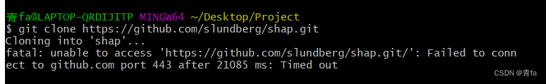
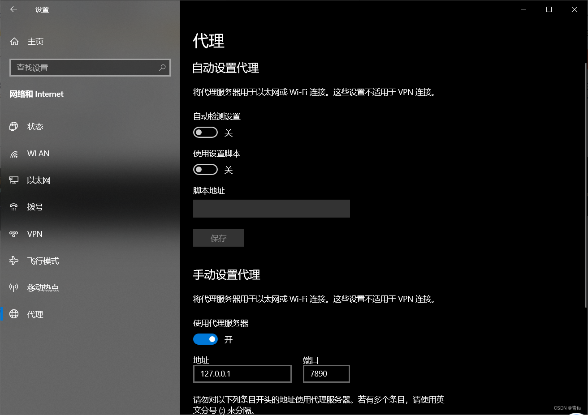
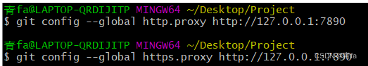
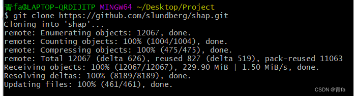

 

## 如何解决使用git时遇到的“Filename too long“问题

平常开发过程中我相信大家对于git这个版本管理工具再熟悉不过了。那么大家在使用git对自己的项目开发时肯定会遇到一些奇奇怪怪的问题，那么我也不例外。我在上周开发时就第一次遇到了"Filename too long"的问题。


  遇到这个问题时，我整个人懵掉了，不过还是要解决问题的！分析产生问题原因后，其次再迅速解决问题，这是实用的解决问题的方式。为了尽快知道问题的原因，我google了一番，从网上找到了一个不错的解释：

> This error does not come for the UNIX or mac users. So they can push the long length file names to git but the issues occur only for the windows users. Because this capability is disabled by default in the Windows operating system.

  从上面的解释可清楚知道，这个错误时其实并不是来自于UNIX 或mac系统，而是只来自于windows系统，因为在windows操作系统中，允许比较长的文件名称这个设置项默认是关闭(false)的。


好的，既然都知道原因了，那么接下来就可以对症下药，解决问题了。具体步骤如下:

1、首先我们可以看在git的命令行界面（git bash）中输入git config --get core.longpaths ，可以看到界面中是返回了“false”;

2、接着我们就可以开始使用git config core.longpaths true设置core.longpaths这个配置项为true。
  

当我再使用git restore命令时发现Filename too long这个error已经成功解决了！其实针对不同的使用场景有不同的解决方法，我这个解决方法也许并不是万能的。有个网站说得比较详细，需要的同学可以看下。

[3 Ways to Fix Git Clone “Filename too long” Error in Windows Fixed](https://www.javaprogramto.com/2020/04/git-filename-too-long.html)


## Failed to connect to github.com port 443 : Timed out

引用：https://blog.csdn.net/ESCM_/article/details/124498679

> 问题描述： 如下图所示，无法git clone 来自Github上的仓库，报端口443错误




问题分析： git 所设端口与系统代理不一致，需重新设置。

解决方法： 操作如下图所示

**①  打开 设置>网络与Internet>代理**




**② 记录下当前系统代理的IP地址和端口号。**

如上图所示，地址与端口号为：127.0.0.1:7890


**③ 修改git的网络设置**

> 注意修改成自己的IP和端口号

```
git config --global http.proxy http://127.0.0.1:7890 
git config --global https.proxy http://127.0.0.1:7890
```



**④  重新git clone, 测试修改效果**




git clone成功！教程结束。
