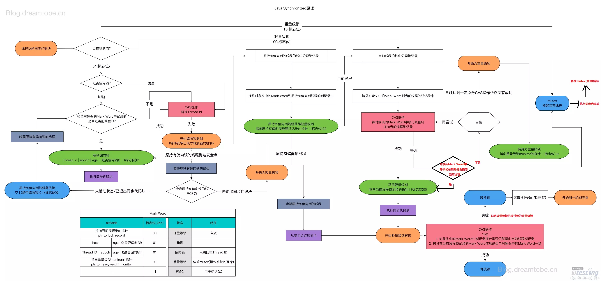

# Java 并发面试题

## java 内存模型

### 简单说一下java 的内存模型，JMM

Java内存模型规定了所有的变量都存储在主内存（Main Memory）中，每个线程有自己的工作线程
（Working Memory），保存主内存副本拷贝和自己私有变量，不同线程不能访问工作内存中的变
量。线程间变量值的传递需要通过主内存来完成

类比java内存来说的话，在java内存中，堆是线程共享的，而虚拟机栈是线程私有的，可以将虚拟机栈作为线程的工作内存，将堆比作主内存


主内存与线程工作内存对比如下：


总结如下：

- 共享变量存储于主内存之中，每个线程都可以访问
- 每个线程都有私有的工作内存，或者称为本地内存
- 工作线程会存储该线程对共享变量的副本到工作内存
- 线程不能直接操作主内存，只有先操作了工作内存之后等系统合适的时候才能刷入主内存
- JMM通过控制主内存与每个线程的本地内存之间的交互，来为程序提供内存可见性保证


### volatile关键字的理解

volatile 关键字的作用主要有两个

- 保证变量的内存可见性
- 禁止指令重排序

#### 内存可见

当写一个volatile变量时，JMM会把该线程对应的工作内存中的共享变量值刷新到主内存中，当读取一
个volatile变量时，JMM会把该线程对应的工作内存置为无效，那么该线程将只能从主内存中重新读取
共享变量。volatile变量正是通过这种写-读方式实现对其他线程可见 （其实是根据内存屏障来实现
的）
volatile变量写：当写一个volatile变量时，JMM会把所有线程本地内存的对应变量副本刷新回主
存；
volatile写和解锁内存语义相同；
volatile变量读：当读一个volatile变量时，JMM会设置该线程的volatile变量副本（本地内存中）
无效，线程只能从主存中读取该变量；
通过上述机制，volatile保证共享变量一旦被修改，新值对所有线程可见

#### 禁止指令重排序

计算机执行程序时，为了提高程序性能往往会将需要执行的指令进行重排序，而volatile关键字另一个作用就是禁止指令重排优化，从而避免多线程环境下程序出现乱序执行的现象，volatile 则是通过添加内存屏障阻止指令重排序的，规则如下：

- 在每个 volatile 写操作的前面插入一个 StoreStore 屏障。
- 在每个 volatile 写操作的后面插入一个 StoreLoad 屏障。
- 在每个 volatile 读操作的后面插入一个 LoadLoad 屏障。
- 在每个 volatile 读操作的后面插入一个 LoadStore 屏障

volatile 写插入内存屏障后生成的指令序列示意图：


全貌示意图如下：


### happens-before 原则

JMM 为了保证多线程的执行顺序以及原子性可见性，提出了happens-before规则
happends-before原则如下：

- 程序顺序原则，即在一个线程内必须保证语义串行性，也就是说按照代码顺序执行。
- 锁规则 解锁(unlock)操作必然发生在后续的同一个锁的加锁(lock)之前，也就是说，如果对于一个
  锁解锁后，再加锁，那么加锁的动作必须在解锁动作之后(同一个锁)。
- volatile规则 volatile变量的写，先发生于读，这保证了volatile变量的可见性，简单的理解就是，
  volatile变量在每次被线程访问时，都强迫从主内存中读该变量的值，而当该变量发生变化时，又
  会强迫将最新的值刷新到主内存，任何时刻，不同的线程总是能够看到该变量的最新值。
- 线程启动规则 线程的start()方法先于它的每一个动作，即如果线程A在执行线程B的start方法之前
  修改了共享变量的值，那么当线程B执行start方法时，线程A对共享变量的修改对线程B可见
- 传递性 A先于B ，B先于C 那么A必然先于C
- 线程终止规则 线程的所有操作先于线程的终结，Thread.join()方法的作用是等待当前执行的线程
  终止。假设在线程B终止之前，修改了共享变量，线程A从线程B的join方法成功返回后，线程B对
  共享变量的修改将对线程A可见。
- 线程中断规则 对线程 interrupt()方法的调用先行发生于被中断线程的代码检测到中断事件的发
  生，可以通过Thread.interrupted()方法检测线程是否中断。
- 对象终结规则 对象的构造函数执行，结束先于finalize()方法


### double check 为什么需要volatile 变量进行修饰

doucheck 源码如下：

```java
public class DoubleCheckLock {
	private static DoubleCheckLock instance;
	private DoubleCheckLock(){}
	public static DoubleCheckLock getInstance(){
		
		// 第一次检查
		if(instance == null){
			// 同步
			synchronized (DoubleCheckLock.class) {
				if(instance == null){
					// 多线程环境下可能会出现问题的地方
					instance = new DoubleCheckLock();
				}
			}
		}
		return instance;
	}
}
```


因为 在创建对象时，一般会分为三个本步骤，如下：

```java
memory = allocate(); //1.分配对象内存空间
instance(memory);  //2.初始化对象
instance = memory;  //3.设置instance指向刚分配的内存地址，此时instance！=null
```

由于步骤2和步骤3间可能会重排序，如下：

```java
memory = allocate(); //1.分配对象内存空间
instance = memory;  //3.设置instance指向刚分配的内存地址，此时instance！=null，但是对
//象还没有初始化完成！
instance(memory);  //2.初始化对
```

由于步骤2和步骤3不存在数据依赖关系，而且无论重排前还是重排后程序的执行结果在单线程中并没有
改变，因此这种重排优化是允许的。但是指令重排只会保证串行语义的执行的一致性(单线程)，但并不
会关心多线程间的语义一致性。所以当一条线程访问 instance 不为null时，由于 instance 实例未必已
初始化完成，也就造成了线程安全问题。那么该如何解决呢？很简单，我们使用 volatile 禁止 instance
变量被执行指令重排优化即可


### volitile 与 synchronized 的区别

1、volatile关键字只能用于修饰实例变量或者类变量，不能用于修饰方法一级局部变量，synchorized关键字只能修饰方法或者语句块

2、volitile修饰的变量可以为null，synchorized关键字同步语句块的monitor对象不能为null

3、volitile 变量（操作）不能保证原子性，synchorized是一种排他机制，即monitor enter 和 monitor exits指令

3、volitile可以保证其可见性，synchorized也可以

4、volitile禁止jvm和处理器进行指令重排序，synchorized关键字则是保证方法或者代码块内部是顺序执行的

5、volatile不会使线程陷入阻塞，synchorized关键字会使线程进入阻塞状态


## CAS

### ABA 问题如何解决？

 CAS操作可能存在**ABA**的问题，就是说：假如一个值原来是A，变成了B，又变成了A，那么CAS检查时会发现它的值没有发生变化，但是实际上却变化了。 

AtomicStampedReference 的构造器内部实力化了一个Pair 对象，Pair 对象为了对象的引用以及一个int 类型的时间戳，当我们进行操作的时除了要对比对象的引用还要对比int类型的时间戳

AtomicMarkableReference 与AtomicStampedReference 是大致一样的，不过内置是使用的bool 类型的版本号用于标识


### Atomic 原子类分析

常用的Atomic 原子类如下：

  


### LongAddr 实现


### AtomicLong 与 LongAddr 的区别

AtomicLong 是基于 CAS 方式自旋更新的；LongAdder 是把 value 分成若干cell，并发量低的时候，直接 CAS 更新值，成功即结束。并发量高的情况，CAS更新某个cell值和需要时对cell数据扩容，成功结束；更新失败自旋 CAS 更新 cell值。取值的时候，调用 sum() 方法进行每个cell累加。

AtomicLong 包含有原子性的读、写结合的api；LongAdder 没有原子性的读、写结合的api，能保证结果最终一致性。
低并发场景AtomicLong 和 LongAdder 性能相似，高并发场景 LongAdder 性能优于 AtomicLong。

LongAdder 源码解析： https://segmentfault.com/a/1190000015865714


## Synchorized 锁原理

### Synchorized 概览

- synchorized关键字提供了一种锁的机制，能够确保共享变量的互斥访问，从而防止数据不一致的问题的出现
- synchorized锁的不是代码而是对象，synchorized 不是锁，而是某线程在执行到 synchorized方法或者代码块的时候获取到了 对象头中的monitor锁		
- synchorized 提供的代码块或者方法只是保证了互斥性，也就是说只会有一个线程获取到mutex 的monitor锁
- synchorized的作用域要尽量小一点，因为synchorized修饰的方法或者代码块是互斥的monitor锁必须保证是同一个，避免多个锁的交叉导致死锁

- synchorized关键字包括monitorenter和 monitorexit 两个jvm指令，他能够保证 在如何时候任何线程 执行到minitor enter成功之前都必须从主内存中获取数据，而不是从缓存中，在monitor enter运行成功之后共享变量被更新后的值必须刷入主内存

- synchorized的指令严格遵守java hanppens-before原则，一个monitor exit指令之前必须有一个monitor enter指令，

- synchorzied 的锁操作要依赖于Java对象头来进行设置

- synchorized使用的锁对象是存储在java对象头中的，每个对象都存在一个monitor与之关联，monitor可以和对象一起创建销毁，也可以在线程进入时创建

- 每一个对象都与一个monitor相关联，一个monitor的 lock 的锁只能被一个线程在同一时间获得

- synchorized 关键字依赖于 字节码 monitorenter 和 monitorexist关键字

- synchorized方法 依赖于 ACC_SYNCHORIZED 字节指令

> 注意：
>
> 一般在字节码中会出现两个monitorexit指令，是为了防止在synchorized代码块中执行出现异常时，可以正常退出synchorized代码块


### Object 锁

synchorized 并不是锁，它只是提供了代码的同步机制，真正的锁的是 object 对象，每一个对象都有相对应的对象头与 ObjectMonitor对象（只有膨胀为重量级锁的时候才会生成），不管是 普通对象也好  class 对象也好（class 也是对象）都是可以用来做对象锁的。


### 对象头

对象锁是与每个对象的对象头有关系，那么对象头布局是什么样子的？

首先说几个相关面试题：

- 1、Object o = new Object() 在内存中占用了多少个字节？

- 2、对象在内存中的布局是什么样子的？


1、先声明一个普通的Object 对象

```java
Object o = new Object();
```


2、使用JOL 打印对象头信息，如图： 


0 - 4 代表的是对象头，4 - 4 代表是对象头 (那么 0-8 对应下图中的 markword)

8 - 4 代表的是对象头（对应下图中的class pointor）

因为是一个空的object 对象，所以没有实例数据则不占用字节数

12 - 4 （需要对齐的字节数，因为不能为8整除）


**对象头内存布局图：**


markword ： 与 synchorized 相关的信息放在这里

class pointor ：类型指针，指向该对象对应的类信息（在 metaspace中）

instance data：实例数据指针，例如：int i ， String n 每一个指针占用4个字节（开启指针压缩的情况下）

padding：对齐，当整个的字节数不能为8整除的时候，需要内存对齐

-XX:+UseCompressedClassPointers ：开启类指针压缩，就是java对象头中的类指针

-XX:+UseCompressedOops：开启对象实例数据指针压缩，对应java实例数据指针，就是java对象头中的 instance data

> 注意：
>
> 如果jvm虚拟机是64位的话，那么每个指针的大小也是64位，对应 8个字节，如果开启上面的 jvm参数选项，则指针由8字节压缩为4个字节，如果该实例变量是基本类型变量的话则占用4个字节，只有引用类型指针才会存在指针压缩一说


根据以上介绍：markword 8个字节，class pointor 4个字节，instance data 0字节（由于new Object 实例中是空的）

所以需要 对齐，那么则需要补充4个字节

**示例：**

```java
class User {
    int id;
    String name;
}

该对象在内存中占用多少字节？
    
首先 markword 占用 8个字节，class pointor 占用8个字节，开启类指针压缩 4个，
实例变量
    id ： 基本类型 占用4个字节
    name：如果开启引用类型压缩指针 4个字节，没有开启8个字节
    
占用空间：8 + 4(8) + 4 + 4(8) = 20/28 + 4/4(padding 对齐) = 24/32
```


**使用工具**

```xml
<dependency>
	<groupId>org.openjdk.jol</groupId>
    <artifatId>jol-core</artifatId>
    <version>0.9</version>
</dependency>
```


### 对象头中的MarkWrod 与 Synchorized 

synchorized 与 object 对象的 加、解锁是如何实现的呢？

```java
synchorized(object) {
    //do something
}
```

在jdk1.6之前，只要执行到 synchorized 代码块，那么该对象锁就是一个重量级锁，在1.6之后对此进行了优化 ，升级过程如下：

new （无锁） -> 偏向锁 - 轻量级锁 （无锁，自旋锁，自适应自旋锁）- 重量级锁


markworkd 一共64位，8个字节，上图介绍了锁升级的各个阶段 markword的变化过程

无锁 0 0 1 

偏向锁 1 0 1

轻量级锁 0 0

重量级锁 1 0

GC 标记信息 1 1

> 拓展
>
> 4bit 能代表最大的值为15，那么 gc 中分代年龄可否被调整到30，答案是不可以，因为分代年龄的bit 最大为 4bit


### Monitor 分类

synchronized 关键字是借助于字节码指令monitorenter 和monitorexit 来实现的

- monitor enter
  如过monitor的计数器为0，意味着这个monitor的lock还没有被获得，某个线程获取之后会对该计数器加1，那么该线程就是 这个monitor的所有者了
  如过一个拥有该monitor所有权的线程重入，则导致该monitor的计数器再次累加
  如过monitor已经被其他线程拥有，则当前线程获取monitor所有全的时候会被阻塞直到monitor的计数器为0的时候才能再次获取monitor的所有权
- monitor exit
  释放对monitor的所有权，想要释放某个对象关联的monitor的所有权的前提是，你曾经获取了所有权，当计数器为0的时候将不再拥有该monitor的所有权，如过有重入的话每次都会减1，当减为0的时候被monitor block的线程将再次尝试获取该monitor

monitor type

- this monitor
  public synchorized void test1()

- class monitor

- public synchorized static void test1()

> 注意 ：
> DemoClass.class 本身就是一个对象
> 在非static方法也可以使用当前对象所属的class对象作为monitor，因为他本

  


### synchronize 优化

synchronize 优化 分别包括如下：

- 锁消除

  JIT编译时，对运行上下分进行分析，消除不可能存在竞争的锁

- 锁降级

- 锁升级（也就是说在jdk1.6之后，当线程再次进入synchorized代码块时，并不会直接变为重量级锁）

  无锁-》偏向锁-》轻量级锁（自旋锁，自适应自旋锁）-》重量级锁

- 锁粗化

  通过扩大加锁的范围来避免加锁和解锁

  


### ObjectMonitor 对象

每一个对象都与一个monitor相关联，一个monitor的 lock 的锁只能被一个线程在同一时间获得，monitor可以和对象一起创建销毁，或者当线程试图获取对象锁时生成，ObjectMonitor 关键属性如下：

- EntryList  ：锁池，表示线程未获取到当前的monitor锁，而需要阻塞挂起的
- WaitSet：调用object.wait()之后 进入阻塞等待状态，这时候会将当前线程加入到该对象的WaitSet中
- count：用来表示当前线程重入该锁的次数
- owner：表示当前锁被哪个线程所拥有

### java对象在内存中的布局

```
synchorized使用的锁对象是存储在java对象头中的，每个对象都存在一个monitor与之关联，monitor可以和对象一起创建销毁，也可以在线程进入时创建
```

 

 

##### 对象头

对象头的数据长度在`32`位和`64`位(未开启压缩指针)的虚拟机中分别为`32bit`和`64bit`。对象头由以下三个部分组成：

- Mark Word：记录了对象和锁的有关信息，储存对象自身的运行时数据，如哈希码(HashCode)、`GC`分代年龄、锁标志位、线程持有的锁、偏向线程`ID`、偏向时间戳、对象分代年龄等。**注意这个Mark Word结构并不是固定的，它会随着锁状态标志的变化而变化，而且里面的数据也会随着锁状态标志的变化而变化，这样做的目的是为了节省空间**。
- 类型指针：指向对象的类元数据的指针，虚拟机通过这个指针来确定这个对象是哪个类的实例。
- 数组长度：这个属性只有数组对象才有，储存着数组对象的长度。

在`32`位虚拟机下，`Mark Word`的结构和数据可能为以下`5`种中的一种。


在`64`位虚拟机下，`Mark Word`的结构和数据可能为以下`2`种中的一种。


这里重点注意**是否偏向锁**和**锁标志位**，这两个标识和`synchronized`的锁膨胀息息相关。


##### **自旋**

当有个线程`A`去请求某个锁的时候，这个锁正在被其它线程占用，但是线程`A`并不会马上进入阻塞状态，而是循环请求锁(自旋)。这样做的目的是因为很多时候持有锁的线程会很快释放锁的，线程`A`可以尝试一直请求锁，没必要被挂起放弃`CPU`时间片，因为线程被挂起然后到唤醒这个过程开销很大,当然如果线程`A`自旋指定的时间还没有获得锁，仍然会被挂起。

##### **自适应性自旋**

自适应性自旋是自旋的升级、优化，自旋的时间不再固定，而是由前一次在同一个锁上的自旋时间及锁的拥有者的状态决定。例如**线程如果自旋成功了，那么下次自旋的次数会增多**，因为`JVM`认为既然上次成功了，那么这次自旋也很有可能成功，那么它会允许自旋的次数更多。反之，如果**对于某个锁，自旋很少成功**，那么在以后获取这个锁的时候，自旋的次数会变少甚至忽略，避免浪费处理器资源。有了自适应性自旋，随着程序运行和性能监控信息的不断完善，`JVM`对程序锁的状况预测就会变得越来越准确，`JVM`也就变得越来越聪明。

##### 锁消除

锁消除是指虚拟机即时编译器在运行时，**对一些代码上要求同步，但是被检测到不可能存在共享数据竞争的锁进行消除**。

##### 锁粗化

在使用锁的时候，需要让同步块的作用范围尽可能小，这样做的目的是**为了使需要同步的操作数量尽可能小，如果存在锁竞争，那么等待锁的线程也能尽快拿到锁**

 

  


**注意：**

- synchronize 是非公平锁

- Thread 对象并不属于正常的 object 锁对象


## AQS

### AQS 概述

 AbstractQueuedSynchronizer抽象类（以下简称AQS）是整个`java.util.concurrent`包的核心。在JDK1.5时，[Doug Lea](http://gee.cs.oswego.edu/dl/papers/aqs.pdf)引入了J.U.C包，该包中的大多数同步器都是基于AQS来构建的。AQS框架提供了一套通用的机制来管理同步状态（synchronization state）、阻塞/唤醒线程、管理等待队列。JUC下大部分的工具类都是依赖于AQS实现的，如下：

| 同步器                 | 资源的定义                                                   |
| ---------------------- | ------------------------------------------------------------ |
| ReentrantLock          | 资源表示独占锁。State为0表示锁可用；为1表示被占用；为N表示重入的次数 |
| CountDownLatch         | 资源表示倒数计数器。State为0表示计数器归零，所有线程都可以访问资源；为N表示计数器未归零，所有线程都需要阻塞。 |
| Semaphore              | 资源表示信号量或者令牌。State≤0表示没有令牌可用，所有线程都需要阻塞；大于0表示由令牌可用，线程每获取一个令牌，State减1，线程没释放一个令牌，State加1。 |
| ReentrantReadWriteLock | 资源表示共享的读锁和独占的写锁。state逻辑上被分成两个16位的unsigned short，分别记录读锁被多少线程使用和写锁被重入的次数。 |


#### 模板方法

 AQS通过暴露以下模板API来让用于来实现自定义的同步机制： 

| 钩子方法          | 描述                       |
| ----------------- | -------------------------- |
| tryAcquire        | 独占锁获取（是否可以获取） |
| tryRelease        | 独占锁释放（是否可以释放） |
| tryAcquireShared  | 共享锁获取（是否可以获取） |
| tryReleaseShared  | 共享锁释放（是否可以释放） |
| isHeldExclusively |                            |


#### 核心点

AQS 中有两个个比较核心的点，如下：

- state： 表示当前锁是否有线程获取
- CHL 队列： 将需要等待的线程加入该队列

AQS 实现的模式类型：

- EXCLUDE 独占锁
- SHARED 共享锁
- Condition 条件等待队列


### AQS方法说明

在本章第一部分讲到，AQS利用了模板方法模式，其中大多数方法都是final或是private的，我们把这类方法称为***Skeleton Method\***，也就是说这些方法是AQS框架自身定义好的骨架，子类是不能覆写的。下面会按类别简述一些比较重要的方法，具体实现细节及原理会在本系列后续部分详细阐述。

####  CAS操作

CAS，即CompareAndSet，在Java中CAS操作的实现都委托给一个名为UnSafe类，关于`Unsafe`类，以后会专门详细介绍该类，目前只要知道，通过该类可以实现对字段的原子操作。

| 方法名                  | 修饰符               | 描述                    |
| ----------------------- | -------------------- | ----------------------- |
| compareAndSetState      | protected final      | CAS修改同步状态值       |
| compareAndSetHead       | private final        | CAS修改等待队列的头指针 |
| compareAndSetTail       | private final        | CAS修改等待队列的尾指针 |
| compareAndSetWaitStatus | private static final | CAS修改结点的等待状态   |
| compareAndSetNext       | private static final | CAS修改结点的next指针   |


####  等待队列的核心操作

| 方法名              | 修饰符  | 描述                 |
| ------------------- | ------- | -------------------- |
| enq                 | private | 入队操作             |
| addWaiter           | private | 入队操作             |
| setHead             | private | 设置头结点           |
| unparkSuccessor     | private | 唤醒后继结点         |
| doReleaseShared     | private | 释放共享结点         |
| setHeadAndPropagate | private | 设置头结点并传播唤醒 |


#### 资源的获取操作

| 方法名                       | 修饰符         | 描述                              |
| ---------------------------- | -------------- | --------------------------------- |
| cancelAcquire                | private        | 取消获取资源                      |
| shouldParkAfterFailedAcquire | private static | 判断是否阻塞当前调用线程          |
| acquireQueued                | final          | 尝试获取资源,获取失败尝试阻塞线程 |
| doAcquireInterruptibly       | private        | 独占地获取资源（响应中断）        |
| doAcquireNanos               | private        | 独占地获取资源（限时等待）        |
| doAcquireShared              | private        | 共享地获取资源                    |
| doAcquireSharedInterruptibly | private        | 共享地获取资源（响应中断）        |
| doAcquireSharedNanos         | private        | 共享地获取资源（限时等待）        |

| 方法名                     | 修饰符       | 描述                       |
| -------------------------- | ------------ | -------------------------- |
| acquire                    | public final | 独占地获取资源             |
| acquireInterruptibly       | public final | 独占地获取资源（响应中断） |
| acquireInterruptibly       | public final | 独占地获取资源（限时等待） |
| acquireShared              | public final | 共享地获取资源             |
| acquireSharedInterruptibly | public final | 共享地获取资源（响应中断） |
| tryAcquireSharedNanos      | public final | 共享地获取资源（限时等待） |


#### 资源的释放操作

| 方法名        | 修饰符       | 描述         |
| ------------- | ------------ | ------------ |
| release       | public final | 释放独占资源 |
| releaseShared | public final | 释放共享资源 |


### AQS原理简述

我们在第一节中讲到，AQS框架分离了构建同步器时的一系列关注点，它的所有操作都围绕着资源——同步状态（synchronization state）来展开因此，围绕着资源，衍生出三个基本问题：

1. 同步状态（synchronization state）的管理
2. 阻塞/唤醒线程的操作
3. 线程等待队列的管理

#### 同步状态（state）

同步状态，其实就是资源。AQS使用单个int（32位）来保存同步状态，并暴露出getState、setState以及compareAndSetState操作来读取和更新这个状态。

```java
/**
 * 同步状态.
 */
private volatile int state;

protected final int getState() {
    return state;
}

protected final void setState(int newState) {
    state = newState;
}
/**
 * 以原子的方式更新同步状态.
 * 利用Unsafe类实现
 */
protected final boolean compareAndSetState(int expect, int update) {
    return unsafe.compareAndSwapInt(this, stateOffset, expect, update);
}
```


#### 等待队列

等待队列，是AQS框架的核心，整个框架的关键其实就是如何在并发状态下管理被阻塞的线程。
等待队列是严格的FIFO队列，是Craig，Landin和Hagersten锁（CLH锁）的一种变种，采用双向链表实现，因此也叫CLH队列。

**1. 结点定义**
CLH队列中的结点是对线程的包装，结点一共有两种类型：独占（EXCLUSIVE）和共享（SHARED）。
每种类型的结点都有一些状态，其中独占结点使用其中的CANCELLED(1)、SIGNAL(-1)、CONDITION(-2)，共享结点使用其中的CANCELLED(1)、SIGNAL(-1)、PROPAGATE(-3)。

| 结点状态  | 值   | 描述                                                         |
| --------- | ---- | ------------------------------------------------------------ |
| CANCELLED | 1    | 取消。表示后驱结点被中断或超时，需要移出队列                 |
| SIGNAL    | -1   | 发信号。表示后驱结点被阻塞了（当前结点在入队后、阻塞前，应确保将其prev结点类型改为SIGNAL，以便prev结点取消或释放时将当前结点唤醒。） |
| CONDITION | -2   | Condition专用。表示当前结点在Condition队列中，因为等待某个条件而被阻塞了 |
| PROPAGATE | -3   | 传播。适用于共享模式（比如连续的读操作结点可以依次进入临界区，设为PROPAGATE有助于实现这种迭代操作。） |
| INITIAL   | 0    | 默认。新结点会处于这种状态                                   |

> AQS使用CLH队列实现线程的结构管理，而CLH结构正是用前一结点某一属性表示当前结点的状态，之所以这种做是因为在双向链表的结构下，这样更容易实现取消和超时功能。
>
> next指针：用于维护队列顺序，当临界区的资源被释放时，头结点通过next指针找到队首结点。
> prev指针：用于在结点（线程）被取消时，让当前结点的前驱直接指向当前结点的后驱完成出队动作。

```cpp
static final class Node {
    
    // 共享模式结点
    static final Node SHARED = new Node();
    
    // 独占模式结点
    static final Node EXCLUSIVE = null;

    static final int CANCELLED =  1;

    static final int SIGNAL    = -1;

    static final int CONDITION = -2;

    static final int PROPAGATE = -3;

    /**
    * INITAL：      0 - 默认，新结点会处于这种状态。
    * CANCELLED：   1 - 取消，表示后续结点被中断或超时，需要移出队列；
    * SIGNAL：      -1- 发信号，表示后续结点被阻塞了；（当前结点在入队后、阻塞前，应确保将其prev结点类型改为SIGNAL，以便prev结点取消或释放时将当前结点唤醒。）
    * CONDITION：   -2- Condition专用，表示当前结点在Condition队列中，因为等待某个条件而被阻塞了；
    * PROPAGATE：   -3- 传播，适用于共享模式。（比如连续的读操作结点可以依次进入临界区，设为PROPAGATE有助于实现这种迭代操作。）
    * 
    * waitStatus表示的是后续结点状态，这是因为AQS中使用CLH队列实现线程的结构管理，而CLH结构正是用前一结点某一属性表示当前结点的状态，这样更容易实现取消和超时功能。
    */
    volatile int waitStatus;

    // 前驱指针
    volatile Node prev;

    // 后驱指针
    volatile Node next;

    // 结点所包装的线程
    volatile Thread thread;

    // Condition队列使用，存储condition队列中的后继节点
    Node nextWaiter;

    Node() {
    }

    Node(Thread thread, Node mode) { 
        this.nextWaiter = mode;
        this.thread = thread;
    }
}
```


**2. 队列定义**
对于CLH队列，当线程请求资源时，如果请求不到，会将线程包装成结点，将其挂载在队列尾部。
CLH队列的示意图如下：

①初始状态，队列head和tail都指向空


②首个线程入队，先创建一个空的头结点，然后以自旋的方式不断尝试插入一个包含当前线程的新结点


```crmsh
/**
 * 以自旋的方式不断尝试插入结点至队列尾部
 *
 * @return 当前结点的前驱结点
 */
private Node enq(final Node node) {
    for (; ; ) {
        Node t = tail;
        if (t == null) { // 如果队列为空，则创建一个空的head结点
            if (compareAndSetHead(new Node()))
                tail = head;
        } else {
            node.prev = t;
            if (compareAndSetTail(t, node)) {
                t.next = node;
                return t;
            }
        }
    }
}
```


### 独占模式的实现

#### 独占模式加锁

AQS的独占模式是通过调用aquire方法实现的，流程如下：

```
//尝试加锁
public final void acquire(int arg) {
    if (!tryAcquire(arg) &&
        acquireQueued(addWaiter(Node.EXCLUSIVE), arg))
        selfInterrupt();
}
```

```
//将线程包装为Node节点添加到CLH队列
private Node addWaiter(Node mode) {
    Node node = new Node(Thread.currentThread(), mode);
    // Try the fast path of enq; backup to full enq on failure
    Node pred = tail;
    if (pred != null) {
        node.prev = pred;
        if (compareAndSetTail(pred, node)) {
            pred.next = node;
            return node;
        }
    }
    enq(node);
    return node;
}
```

```
//添加到CLH队列失败时通过自旋的方式添加
private Node enq(final Node node) {
    for (;;) {
        Node t = tail;
        if (t == null) { // Must initialize
            if (compareAndSetHead(new Node()))
                tail = head;
        } else {
            node.prev = t;
            if (compareAndSetTail(t, node)) {
                t.next = node;
                return t;
            }
        }
    }
}
```

```
//阻塞当前节点
final boolean acquireQueued(final Node node, int arg) {
    boolean failed = true;
    try {
        boolean interrupted = false;
        for (;;) {
            final Node p = node.predecessor();
            if (p == head && tryAcquire(arg)) {
                setHead(node);
                p.next = null; // help GC
                failed = false;
                return interrupted;
            }
            if (shouldParkAfterFailedAcquire(p, node) &&
                parkAndCheckInterrupt())
                interrupted = true;
        }
    } finally {
        if (failed)
            cancelAcquire(node);
    }
}
```


```
//将节点的前置节点状态设置为singal状态，用于唤醒后置节点
private static boolean shouldParkAfterFailedAcquire(Node pred, Node node) {
    int ws = pred.waitStatus;
    if (ws == Node.SIGNAL)
        /*
         * This node has already set status asking a release
         * to signal it, so it can safely park.
         */
        return true;
    if (ws > 0) {
        /*
         * Predecessor was cancelled. Skip over predecessors and
         * indicate retry.
         */
        do {
            node.prev = pred = pred.prev;
        } while (pred.waitStatus > 0);
        pred.next = node;
    } else {
        /*
         * waitStatus must be 0 or PROPAGATE.  Indicate that we
         * need a signal, but don't park yet.  Caller will need to
         * retry to make sure it cannot acquire before parking.
         */
        compareAndSetWaitStatus(pred, ws, Node.SIGNAL);
    }
    return false;
}
```


#### 独占模式解锁

```
//释放独占锁
public final boolean release(int arg) {
    if (tryRelease(arg)) {
        Node h = head;
        if (h != null && h.waitStatus != 0)
            unparkSuccessor(h);
        return true;
    }
    return false;
}
```

```
//唤醒后记节点
private void unparkSuccessor(Node node) {
    /*
     * If status is negative (i.e., possibly needing signal) try
     * to clear in anticipation of signalling.  It is OK if this
     * fails or if status is changed by waiting thread.
     */
    int ws = node.waitStatus;
    if (ws < 0)
        compareAndSetWaitStatus(node, ws, 0);

    /*
     * Thread to unpark is held in successor, which is normally
     * just the next node.  But if cancelled or apparently null,
     * traverse backwards from tail to find the actual
     * non-cancelled successor.
     */
    Node s = node.next;
    if (s == null || s.waitStatus > 0) {
        s = null;
        for (Node t = tail; t != null && t != node; t = t.prev)
            if (t.waitStatus <= 0)
                s = t;
    }
    if (s != null)
        LockSupport.unpark(s.thread);
}
```


### 共享模式实现

#### 共享模式加锁

```
public final void acquireShared(int arg) {
    if (tryAcquireShared(arg) < 0)
        doAcquireShared(arg);
}
```

```
private void doAcquireShared(int arg) {
    final Node node = addWaiter(Node.SHARED);
    boolean failed = true;
    try {
        boolean interrupted = false;
        for (;;) {
            final Node p = node.predecessor();
            if (p == head) {
                int r = tryAcquireShared(arg);
                if (r >= 0) {
                    setHeadAndPropagate(node, r);
                    p.next = null; // help GC
                    if (interrupted)
                        selfInterrupt();
                    failed = false;
                    return;
                }
            }
            if (shouldParkAfterFailedAcquire(p, node) &&
                parkAndCheckInterrupt())
                interrupted = true;
        }
    } finally {
        if (failed)
            cancelAcquire(node);
    }
}
```

```
private void setHeadAndPropagate(Node node, int propagate) {
    Node h = head; // Record old head for check below
    setHead(node);
    /*
     * Try to signal next queued node if:
     *   Propagation was indicated by caller,
     *     or was recorded (as h.waitStatus either before
     *     or after setHead) by a previous operation
     *     (note: this uses sign-check of waitStatus because
     *      PROPAGATE status may transition to SIGNAL.)
     * and
     *   The next node is waiting in shared mode,
     *     or we don't know, because it appears null
     *
     * The conservatism in both of these checks may cause
     * unnecessary wake-ups, but only when there are multiple
     * racing acquires/releases, so most need signals now or soon
     * anyway.
     */
    if (propagate > 0 || h == null || h.waitStatus < 0 ||
        (h = head) == null || h.waitStatus < 0) {
        Node s = node.next;
        if (s == null || s.isShared())
            doReleaseShared();
    }
}
```


#### 共享模式解锁

```
public final boolean releaseShared(int arg) {
    if (tryReleaseShared(arg)) {
        doReleaseShared();
        return true;
    }
    return false;
}
```

```
private void doReleaseShared() {
    /*
     * Ensure that a release propagates, even if there are other
     * in-progress acquires/releases.  This proceeds in the usual
     * way of trying to unparkSuccessor of head if it needs
     * signal. But if it does not, status is set to PROPAGATE to
     * ensure that upon release, propagation continues.
     * Additionally, we must loop in case a new node is added
     * while we are doing this. Also, unlike other uses of
     * unparkSuccessor, we need to know if CAS to reset status
     * fails, if so rechecking.
     */
    for (;;) {
        Node h = head;
        if (h != null && h != tail) {
            int ws = h.waitStatus;
            if (ws == Node.SIGNAL) {
                if (!compareAndSetWaitStatus(h, Node.SIGNAL, 0))
                    continue;            // loop to recheck cases
                unparkSuccessor(h);
            }
            else if (ws == 0 &&
                     !compareAndSetWaitStatus(h, 0, Node.PROPAGATE))
                continue;                // loop on failed CAS
        }
        if (h == head)                   // loop if head changed
            break;
    }
}
```


### Condition 实现原理

Condition接口的实现类其实是在AQS中——`ConditionObject`，ReentranLock的newConditon方法其实是创建了一个`AbstractQueuedSynchronizer.ConditionObject`对象

Condition作为AQS的内部类，复用了AQS的结点，维护一个条件队列，队列初始时的结构如下：

```
//条件队列首节点指针
private transient Node firstWaiter;

//条件队列尾节点指针
private transient Node lastWaiter;
```


#### await()等待方法原理

当线程（Thread）调用 await 方法时候，说明当前线程的节点为当前 AQS 队列的头节点，正 好处于占有锁的状态，await()方法需要把该 Thread 从 AQS 队列挪到 Condition 等待队列里，如下图：


在 await()方法将当前线程挪动到 Condition 等待队列后，还会唤醒 AQS 同步队列中 head 节 点的下一个节点。await()方法的核心代码如下： 

```
public final void await() throws InterruptedException {
            if (Thread.interrupted())
                throw new InterruptedException();
            //添加一个节点到Condition队列
            Node node = addConditionWaiter();
            //释放当前锁，并且唤醒后继线程
            int savedState = fullyRelease(node);
            int interruptMode = 0;
            //判断当前节点是否在Condition队列中
            while (!isOnSyncQueue(node)) {
            	//阻塞当前线程
                LockSupport.park(this);
                if ((interruptMode = checkInterruptWhileWaiting(node)) != 0)
                    break;
            }
            //将当前Node节点添加到AQS队列，重新获取锁
            if (acquireQueued(node, savedState) && interruptMode != THROW_IE)
                interruptMode = REINTERRUPT;
            if (node.nextWaiter != null) // clean up if cancelled
                unlinkCancelledWaiters();
            if (interruptMode != 0)
                reportInterruptAfterWait(interruptMode);
        }
```

- （1）执行 await()时，会新创建一个节点并放入到 Condition 队列尾部。 
- （2）然后释放锁，并唤醒 AQS 同步队列中的 Head 节点的后一个节点。 
- （3）然后 while 循环，将该节点的线程阻塞，直到该节点离开等待队列，重新回到同步队列 成为同步节点后，线程才退出 while 循环。 
- （4）退出循环后，开始调用 acquireQueued()不断尝试拿锁。 
- （5）拿到锁后，会清空 Condition 队列中被取消的节点。

创建一个新节点并放入 Condition 队列尾部的工作，由 addConditionWaiter( )方法完成，该方 法具体如下：

```
private Node addConditionWaiter() { 
 	Node t = lastWaiter; 
 	// 如果尾部节点取消，重新定位尾部节点 
 	if (t != null && t.waitStatus != Node.CONDITION) { 
 		unlinkCancelledWaiters(); 
 		t = lastWaiter; 
 	} 
 	//创建一个新 Node，作为等待节点 
 	Node node = new Node(Thread.currentThread(), Node.CONDITION); 
 	//将新 Node 加入等待队列 
 	if (t == null) 
 		firstWaiter = node; 
 	else 
 		t.nextWaiter = node; 
 	
 	lastWaiter = node; 
 	return node; 
 }
```


#### signal()唤醒方法原理

线程在某个 ConditionObject 对象上调用 signal()方法后，等待队列中的 firstWaiter 会被加入 到同步队列中，等待节点被唤醒，流程如图 6-19 所示


```java
//唤醒 
public final void signal() { 
 	//如果当前线程不是持有该锁的线程，抛出异常 
 	if (!isHeldExclusively()) 
 		throw new IllegalMonitorStateException(); 
 	Node first = firstWaiter; 
 	if (first != null) 
 		doSignal(first); //唤醒头部节点 
} 

//执行唤醒 
private void doSignal(Node first) { 
     do { 
        //出队的代码写的很巧妙，看仔细哦 
        //first 出队，firstWaiter 头部指向下一个节点,自己的 nextWaiter 
        if ((firstWaiter = first.nextWaiter) == null) 
             lastWaiter = null; //如果第二节点为空，则尾部也为空 
            //将原来头部 first 的后继置空，help for GC 
             first.nextWaiter = null; 
     } while (!transferForSignal(first) && (first = firstWaiter) != null); 
 } 


//将被唤醒的节点，转移到同步队列 
final boolean transferForSignal(Node node) { 
 	if (!compareAndSetWaitStatus(node, Node.CONDITION, 0)) 
 		return false; 
 	Node p = enq(node); // step 1 
 	int ws = p.waitStatus; 
 	if (ws > 0 || !compareAndSetWaitStatus(p, ws, Node.SIGNAL)) 
 		LockSupport.unpark(node.thread); // step 2 唤醒线程 
 	return true; 
 }
```

- （1）通过 enq 方法自旋（该方法已经介绍过），将条件队列中的头节点放入到 AQS 同步队 列尾部，并获取它在 AQS 队列中的前驱节点。 
- （2）如果前驱节点的状态是取消状态，或者设置前驱节点为 Signal 状态失败，则唤醒当前 节点的线程；否则节点在同步队列的尾部，参与排队。 
- （3）同步队列中的线程被唤醒后，表示重新获取了显式锁，然后继续执行 condition.await() 语句后面的临界区代码。这个时候会通过aquireQueued再次设置前继节点的状态并且阻塞等待


## AQS 工具实现

### RetreenLock 

RetreenLock 是独占锁的一种实现，分为公平锁与非公平锁两种，从上面AQS 大致可以了解到AQS独占模式 执行的整个流程，RetreenLock也是通过实现AQS的模板方法进行实现的，不一样的点在于tryAquire的实现逻辑不同

#### 公平锁 tryAquire 

在获取公平锁时，除了判断state还会判断CLH队列中是否已经有其他线程进行等待，如果已经有线程进行等待则返回false，将自己包装成Node节点添加到CLH队列中

```java
 protected final boolean tryAcquire(int acquires) {
            final Thread current = Thread.currentThread();
            int c = getState();
     	   //判断state是否为0，如果为0表示当前锁还没有被其他线程拥有
            if (c == 0) {
                //判断CLH队列中是否有其他线程节点在等待，如果没有其他线程节点等待则会通过cas操作设置state，并且将ownerThread设置为自己
                if (!hasQueuedPredecessors() &&
                    compareAndSetState(0, acquires)) {
                    setExclusiveOwnerThread(current);
                    return true;
                }
            }
     	    //与非公平锁一致
            else if (current == getExclusiveOwnerThread()) {
                int nextc = c + acquires;
                if (nextc < 0)
                    throw new Error("Maximum lock count exceeded");
                setState(nextc);
                return true;
            }
            return false;
        }
```


#### 非公平锁 tryAquire 

与公平锁不一样的地方在于，非公平锁不会在意CLH队列中是否有节点，而是直接通过 compareAndSetState 操作将 state 从0改为acquires，如果不成功则和公平锁的逻辑是一样的

```java
final boolean nonfairTryAcquire(int acquires) {
            final Thread current = Thread.currentThread();
    	    //获取state的状态
            int c = getState();
 		   // 判断state 是否等于0，如果state=0，表示当前锁还没有被其他线程拥有，直接通过cas设置state变量   		
            if (c == 0) {
                if (compareAndSetState(0, acquires)) {
                    //将当前锁拥有的线程设置为自己
                    setExclusiveOwnerThread(current);
                    return true;
                }
            }
    	   //否则的话判断当前拥有锁的线程是否是自己，如果是自己则将state设置为state + acquires
            else if (current == getExclusiveOwnerThread()) {
                int nextc = c + acquires;
                if (nextc < 0) // overflow
                    throw new Error("Maximum lock count exceeded");
                setState(nextc);
                return true;
            }
            return false;
        }
```


#### tryRelease 

tryRelease 表示在进行unlock时，是否需要释放当前锁，如果返回true则代表释放当前锁

```java
protected final boolean tryRelease(int releases) {
    //因为锁是可重入的，所以通过state-releases来计算
    int c = getState() - releases;
    if (Thread.currentThread() != getExclusiveOwnerThread())
        throw new IllegalMonitorStateException();
    boolean free = false;
    //如果c = 0，则表示可以释放当前锁表示锁重入与unlock都执行完成了
    if (c == 0) {
        free = true;
        setExclusiveOwnerThread(null);
    }
    setState(c);
    return free;
}
```


#### synchorized 与 Lock 的区别


### CountDownLatch

CountDownLatch 底层是通过AQS的共享锁机制实现的，通过实现AQS的tryAquireShard模板方法实现

```java
private static final class Sync extends AbstractQueuedSynchronizer {
     private static final long serialVersionUID = 4982264981922014374L;
     
     //将state设置为初始化CountDownLatch时传入的count值
     Sync(int count) {
         setState(count);
     }

     int getCount() {
         return getState();
     }

    //如果state>0表示获取当前的共享锁成功，既不需要添加到CHL队列，否则表示获取失败需要添加到CLH队列
     protected int tryAcquireShared(int acquires) {
         return (getState() == 0) ? 1 : -1;
     }

    //进行锁释放，判断state==0，如果返回true 表示释放当前的共享锁
    protected boolean tryReleaseShared(int releases) {
        // Decrement count; signal when transition to zero
        for (;;) {
            int c = getState();
            if (c == 0)
                return false;
            int nextc = c-1;
            if (compareAndSetState(c, nextc))
                return nextc == 0;
            }
        }
    }
```


###  CyclicBarrier

文章来源：https://segmentfault.com/a/1190000015888316

这个类的功能和我们之前介绍的CountDownLatch有些类似。我们知道，`CountDownLatch`是一个倒数计数器，在计数器不为0时，所有调用await的线程都会等待，当计数器降为0，线程才会继续执行，且计数器一旦变为0，就不能再重置了。

#### CyclicBarrier 构造器

```java
  public CyclicBarrier(int parties, Runnable barrierAction) {
        if (parties <= 0) throw new IllegalArgumentException();
        this.parties = parties;
        this.count = parties;
        this.barrierCommand = barrierAction;
    }
```

构造器内部的各个字段含义如下：

| 字段名         | 作用                         |
| -------------- | ---------------------------- |
| parties        | 栅栏开启需要的到达线程总数   |
| count          | 剩余未到达的线程总数         |
| barrierCommand | 最后一个线程到达后执行的任务 |


#### CyclicBarrier的内部结构

**CyclicBarrier** 并没有自己去实现AQS框架的API，而是利用了`ReentrantLock`和`Condition`。

```java
public class CyclicBarrier {
    private final ReentrantLock lock = new ReentrantLock();
    private final Condition trip = lock.newCondition();

    // 栅栏开启需要的到达线程总数
    private final int parties;

    // 最后一个线程到达后执行的任务
    private final Runnable barrierCommand;

    // 剩余未到达的线程总数
    private int count;

    // 当前轮次的运行状态
    private Generation generation = new Generation();

    // ...
}
```

<br/>

需要注意的是`generation`这个字段：


我们知道，**CyclicBarrier** 是可以循环复用的，所以**CyclicBarrier** 的每一轮任务都需要对应一个generation 对象。
generation 对象内部有个**broken**字段，用来标识当前轮次的**CyclicBarrier** 是否已经损坏。

**nextGeneration**方法用来创建一个新的generation 对象，并唤醒所有等待线程，重置内部参数。


#### CyclicBarrier的核心方法

我们先来看下**await**方法：


可以看到，无论有没有超时功能，内部都是调了**dowait**这个方法：


**dowait**方法并不复杂，一共有3部分：

1. 判断栅栏是否已经损坏或当前线程已经被中断，如果是会分别抛出异常；
2. 如果当前线程是最后一个到达的线程，会尝试执行最终任务（如果构造**CyclicBarrier**对象时有传入**Runnable**的话），执行成功即返回，失败会破坏栅栏；
3. 对于不是最后一个到达的线程，会在**Condition**队列上等待，为了防止被意外唤醒，这里用了一个自旋操作。

破坏栅栏用的是**breakBarrier**方法：


再来看下**CyclicBarrier**的**reset**方法：


该方法先破坏栅栏，然后开始下一轮（新建一个generation对象）


### CountdownLatch 与 Clibyierr 的区别

CountdownLatch 与 CyclicBarrier 都可以作用与计数等待功能

CountdownLatch 是依赖于AQS的共享机制来实现，主要依赖于state变量，根据我们传入的计数值来确定state大小，但是不可以重复使用

| CountDownLatch | 倒数计数器，初始时设定计数器值，线程可以在计数器上等待，当计数器值归0后，所有等待的线程继续执行 |
| -------------- | ------------------------------------------------------------ |
| CyclicBarrier  | 循环栅栏，初始时设定参与线程数，当线程到达栅栏后，会等待其它线程的到达，当到达栅栏的总数满足指定数后，所有等待的线程继续执行 |
| Phaser         | 多阶段栅栏，可以在初始时设定参与线程数，也可以中途注册/注销参与者，当到达的参与者数量满足栅栏设定的数量后，会进行阶段升级（advance） |

<br/>

#### CountdownLatch

**releaseSharded方法**

```java
 public final boolean releaseShared(int arg) {
    //调用tryReleaseShared方法尝试解锁
    if (tryReleaseShared(arg)) {
        doReleaseShared();
        return true;
    }
    return false;
}
```


**tryReleaseShared 方法**

```java
protected boolean tryReleaseShared(int releases) {
    // Decrement count; signal when transition to zero
    for (;;) {
        int c = getState();
        if (c == 0)
            //这里返回false表示已经有线程触发解锁操作了，因为在共享机制下出发解锁操作会将所有在CLH队列中等待的线程全部释放掉
            return false;
        int nextc = c-1;
        if (compareAndSetState(c, nextc))
            return nextc == 0;
   }
}
```


**tryAcquireShared 方法**

在AQS中，如果tryAcquireShard 返回值 < 0 则代表当前线程获取共享锁失败，反之代表成功

```java
protected int tryAcquireShared(int acquires) {
    return (getState() == 0) ? 1 : -1;
}
```


#### CyclicBarrier

CyclicBarrier则是依赖于AQS的condition机制来实现，内置了一个count计数器用于出发使用，其中的broken标志用于表示当前CyclicBarrier是否损坏，如果损坏则需要重置，代码如下：

**breakBarrier**

breakBarrier 方法主要用于结束当前批次的Barrier 将broken标志置位true，并且唤醒其所有等待的线程

```java
 private void breakBarrier() {
        generation.broken = true;
        count = parties;
        trip.signalAll();
}
```

**nextGeneration**

nextGeneration 方法主要用于开辟下一轮次的使用，唤醒所有线程，重置当前的count计数器，并且创建新的generation

```java
private void nextGeneration() {
        // signal completion of last generation
        trip.signalAll();
        // set up next generation
        count = parties;
        generation = new Generation();
    }
```


**dowait**

dowait方法也是最核心的方法，主要作用是当前线程等待数量未达到 count 时则进行等待直到重置Barrier 或者是 count 为0

```java
private int dowait(boolean timed, long nanos)
        throws InterruptedException, BrokenBarrierException,
               TimeoutException {
        final ReentrantLock lock = this.lock;
        lock.lock();
        try {
            final Generation g = generation;

            //如果当前broken已经损坏则直接抛出broken异常
            if (g.broken)
                throw new BrokenBarrierException();

            //如果线程被中断则终止当前批次，并且抛出异常
            if (Thread.interrupted()) {
                breakBarrier();
                throw new InterruptedException();
            }
			
            //将count - 1
            int index = --count;
            
            //如果count == 0 则表示当前批次可以出发对应的runCommand
            if (index == 0) {  // tripped
                boolean ranAction = false;
                try {
                    final Runnable command = barrierCommand;
                    if (command != null)
                        command.run();
                    ranAction = true;
                    
                    //开启下一轮新的批次
                    nextGeneration();
                    return 0;
                } finally {
                    if (!ranAction)
                        breakBarrier();
                }
            }

            //否则进行等待，如果线程中断或者是broken损坏则抛出对应异常，否则代表当前批次结束
            // loop until tripped, broken, interrupted, or timed out
            for (;;) {
                try {
                    if (!timed)
                        trip.await();
                    else if (nanos > 0L)
                        nanos = trip.awaitNanos(nanos);
                } catch (InterruptedException ie) {
                    if (g == generation && ! g.broken) {
                        breakBarrier();
                        throw ie;
                    } else {
                        // We're about to finish waiting even if we had not
                        // been interrupted, so this interrupt is deemed to
                        // "belong" to subsequent execution.
                        Thread.currentThread().interrupt();
                    }
                }

                if (g.broken)
                    throw new BrokenBarrierException();

                //当批次结束时，会创建新的generation用于下一批次，所以这里会返回true，并且执行退出当前循环
                if (g != generation)
                    return index;

                if (timed && nanos <= 0L) {
                    breakBarrier();
                    throw new TimeoutException();
                }
            }
        } finally {
            lock.unlock();
        }
    }
    
```


### Semphore 的原理

Semaphore信号量主要用于指定规定线程数同时访问某资源，其分为两种模式，分别为公平模式与非公平模式，分别为核心代码如下：


### Phaser

多阶段栅栏，可以在初始时设定参与线程数，也可以中途注册/注销参与者，当到达的参与者数量满足栅栏设定的数量后，会进行阶段升级（advance）

文章来源：https://segmentfault.com/a/1190000015979879


## ThreadPoolExecutor

### 线程池的核心参数

- **corePoolSize**：核心线程数，当队列没有任务时，会也一直阻塞在线程池内的阻塞队列中
- **maximumPoolSize**：线程池的最大线程数量，当核心线程数已经使用完时，并且阻塞队列也已经满了的时候，就会才会创建非核心线程数量，并且小于预定的最大线程数量既 **maximumPoolSize**
- **keepAliveTime**：非核心线程闲置超时时长，超时了非核心线程被销毁
- **TimeUnit** **unit**：keepAliveTime的时间单位
- **workQueue**：阻塞队列，线程池的底层也用了阻塞队列，维护等待执行的线程对象
- **ThreadFactory** **threadFactory**：创建线程的工程，一般使用Excetory的默认实现默认实现

执行流程图如下：

  

对应的核心代码如下：

```java
// JDK 1.8 
public void execute(Runnable command) {
    if (command == null)
        throw new NullPointerException();   
    int c = ctl.get();
    // 1.当前线程数小于corePoolSize,则调用addWorker创建核心线程执行任务
    if (workerCountOf(c) < corePoolSize) {
       if (addWorker(command, true))
           return;
       c = ctl.get();
    }
    // 2.如果不小于corePoolSize，则将任务添加到workQueue队列。
    if (isRunning(c) && workQueue.offer(command)) {
        int recheck = ctl.get();
        // 2.1 如果isRunning返回false(状态检查)，则remove这个任务，然后执行拒绝策略。
        if (! isRunning(recheck) && remove(command))
            reject(command);
            // 2.2 线程池处于running状态，但是没有线程，则创建线程
        else if (workerCountOf(recheck) == 0)
            addWorker(null, false);
    }
    // 3.如果放入workQueue失败，则创建非核心线程执行任务，
    // 如果这时创建非核心线程失败(当前线程总数不小于maximumPoolSize时)，就会执行拒绝策略。
    else if (!addWorker(command, false))
         reject(command);
}
```


### 线程池的状态

ThreadPoolExecutor内部定义了一个AtomicInteger变量——**ctl**，通过按位划分的方式，在一个变量中记录线程池状态和工作线程数——**低29位保存线程数**，**高3位保存线程池状态**：

```java
/**
 * 保存线程池状态和工作线程数:
 * 低29位: 工作线程数
 * 高3位 : 线程池状态
 */
private final AtomicInteger ctl = new AtomicInteger(ctlOf(RUNNING, 0));
 
private static final int COUNT_BITS = Integer.SIZE - 3;
 
// 最大线程数: 2^29-1
private static final int CAPACITY = (1 << COUNT_BITS) - 1;  // 00011111 11111111 11111111 11111111
 
// 线程池状态
private static final int RUNNING = -1 << COUNT_BITS;        // 11100000 00000000 00000000 00000000
private static final int SHUTDOWN = 0 << COUNT_BITS;        // 00000000 00000000 00000000 00000000
private static final int STOP = 1 << COUNT_BITS;            // 00100000 00000000 00000000 00000000
private static final int TIDYING = 2 << COUNT_BITS;         // 01000000 00000000 00000000 00000000
private static final int TERMINATED = 3 << COUNT_BITS;      // 01100000 00000000 00000000 00000000
```

可以看到，ThreadPoolExecutor一共定义了5种线程池状态：

- **RUNNING** : 接受新任务, 且处理已经进入阻塞队列的任务
- **SHUTDOWN** : 不接受新任务, 但处理已经进入阻塞队列的任务
- **STOP** : 不接受新任务, 且不处理已经进入阻塞队列的任务, 同时中断正在运行的任务
- **TIDYING** : 所有任务都已终止, 工作线程数为0, 线程转化为TIDYING状态并准备调用terminated方法
- **TERMINATED** : terminated方法已经执行完成

各个状态之间的流转图：


### 线程池的原理

这里先介绍以下线程池比较重要的核心点，如下：

-  corePoolSize 代表线程池的核心线程数量
- **maximumPoolSize** 代表线程池可创建的最大线程池数量
- BlockingQueue 代表线程池使用的阻塞队列，当核心线程用完之后，需要将相应的任务放入阻塞队列中
- Worker：ThreadPoolExecutor中只有一种类型的线程，名叫**Worker**，它是ThreadPoolExecutor定义的内部类，同时封装着Runnable任务和执行该任务的Thread对象，我们称它为【工作线程】，它也是ThreadPoolExecutor唯一需要进行维护的线程；
- workers：变量用于保存当前正在执行的工作线程任务


ThreadPoolExecutor通过一个HashSet来保存工作线程： 

```java
private final HashSet<Worker> workers = new HashSet<Worker>();
```


Worker源码如下：

```java
/**
 * Worker表示线程池中的一个工作线程, 可以与任务相关联.
 * 由于实现了AQS框架, 其同步状态值的定义如下:
 * -1: 初始状态
 * 0:  无锁状态
 * 1:  加锁状态
 */
private final class Worker extends AbstractQueuedSynchronizer implements Runnable {
 
    /**
     * 与该Worker关联的线程.
     */
    final Thread thread;
    /**
     * Initial task to run.  Possibly null.
     */
    Runnable firstTask;
    /**
     * Per-thread task counter
     */
    volatile long completedTasks;
 
 
    Worker(Runnable firstTask) {
        setState(-1); // 初始的同步状态值
        this.firstTask = firstTask;
        this.thread = getThreadFactory().newThread(this);
    }
 
    /**
     * 执行任务
     */
    public void run() {
        runWorker(this);
    }
 
  //省略其他代码
}
```

从上面的wroker 源码可以看到，在创建wroker 对象时间时，会将我们提交的任务作为构造器参数传入，并且会生成一个与之对象的Thread 线程对象，当线程start 时，默认会执行worker 的 run 方法，也就调用了runWroker 方法


**线程池的调度流程**

线程池的调度流程如下：


1、首先当我们调用当我们通过调用线程池的execute 方法执行任务时，流程图如下：

  

上图中的添加工作线程并执行就是执行addWorker 方法将我们提交的任务包装成Worker 对象，并且执行


2、addWroker 方法主要包含两部分如下：

**第一部分**是一个自旋操作，主要是对线程池的状态进行一些判断，如果状态不适合接受新任务，或者工作线程数超出了限制，则直接返回false。

> 这里需要注意的就是`core`参数，为true时表示新建的工作线程在逻辑上归属于核心线程池，所以需要判断条件 `工作线程数 < corePoolSize` 是否满足；core为false时表示在新增的工作线程逻辑上属于非核心线程池，所以需要判断条件 `工作线程数 < maximumPoolSize`是否满足。

 **第二部分** 才真正去创建工作线程并执行任务：
首先将Runnable任务包装成一个Worker对象，然后加入到一个工作线程集合中（名为workers的HashSet），最后调用工作线程中的Thread对象的**start**方法执行任务，其实最终是委托到Worker的run方法进行执行，而Worker 的run方法内部其实是调用用 runWorker 进行执行的，如下：

```java
/**
 * 执行任务
 */
public void run() {
    runWorker(this);
}
```


3、runWorker 用于执行任务，整体流程如下：

1. while循环不断地通过`getTask()`方法从队列中获取任务（如果工作线程自身携带着任务，则执行携带的任务）；
2. 控制执行线程的中断状态，保证如果线程池正在停止，则线程必须是中断状态，否则线程必须不是中断状态；
3. 调用`task.run()`执行任务；
4. 处理工作线程的退出工作。

```java
final void runWorker(Worker w) {
	//省略
    try {
        while (task != null || (task = getTask()) != null) {    // 当task==null时会通过getTask从队列取任务
         //省略代码
            try {
                beforeExecute(wt, task);            // 钩子方法，由子类自定义实现
                Throwable thrown = null;
                try {
                    task.run();                     // 执行任务
                } catch (RuntimeException x) {
                    thrown = x;
                    throw x;
                } catch (Error x) {
                    thrown = x;
                    throw x;
                } catch (Throwable x) {
                    thrown = x;
                    throw new Error(x);
                } finally {
                    afterExecute(task, thrown);     // 钩子方法，由子类自定义实现
                }
            } finally {
                task = null;
                w.completedTasks++;     // 完成任务数+1
                w.unlock();
            }
        }
 
        // 执行到此处, 说明该工作线程自身既没有携带任务, 也没从任务队列中获取到任务
        completedAbruptly = false;
    } finally {
        
        // 处理工作线程的退出工作, 如果线程在执行过程中抛出异常，那么completedAbruptly将置为false，用于后续创建新的线程添加到workers中
        processWorkerExit(w, completedAbruptly);    
    }

}
```


4、getTask 方法用于从队列中获取任务，流程如下：

Condition：当前线程池否允许核心线程超时或者当前的线程池中的线程数量是否 大于核心线程数

- 如果 上面的Condition 结果为true 则通过 阻塞队列的poll 方法 + keepAliveTime 既有超时时间的 从阻塞队列中获取数据，如果没有获取到，那么该线程结束，执行线程清理工作
- 如果 上面的结果为false，那么就会调用阻塞队列的take方法，一直阻塞在那里，直到阻塞队列中有值返回

代码如下：

```java
private Runnable getTask() {

        //省略代码
        retry:
        for (;;) {
         	//省略代码

            boolean timed;      // Are workers subject to culling?

            for (;;) {
                int wc = workerCountOf(c);
                
                //判断是否需要有超时时间的阻塞
                timed = allowCoreThreadTimeOut || wc > corePoolSize;
	
                //省略代码
                // else CAS failed due to workerCount change; retry inner loop
            }

            try {
                //如果time为true 表示是需要有超时的阻塞，否则就会一直阻塞在这里，直到阻塞队列中有值返回
                Runnable r = timed ?
                    workQueue.poll(keepAliveTime, TimeUnit.NANOSECONDS) :
                    workQueue.take();
                if (r != null)
                    return r;
                timedOut = true;
            } catch (InterruptedException retry) {
                timedOut = false;
            }
        }
    }
```


5、processWorkerExit 方法主要用于执行当线程池中的worker线程关闭时的后续工作，其中也包括了线程池中线程执行异常时的后续操作


### 线程执行过程中出现异常

#### submit 执行抛出异常

当通过调用submit方法抛出异常时，会有FutureTask在内部消化这个异常，在实际执行任务时会将我们提交的任务包装成FutureTask放入到WorkerQueue 或者是设置为Worker的firstTask，然后调用FutureTask.run 方法来执行任务，当任务出现异常时：

- 设置FutureTask的状态为EXCEPTIONAL，并且将outcome设置为该异常
- 调用finishCompletion 释放等待在该FutureTask上的线程

```java
public void run() {
        
       // 如果state状态不为NEW 则直接返回
        if (state != NEW ||
            !UNSAFE.compareAndSwapObject(this, runnerOffset,
                                         null, Thread.currentThread()))
            return;
        try {
            Callable<V> c = callable;
            if (c != null && state == NEW) {
                V result;
                //用于代表当前任务是否正常执行完成
                boolean ran;
                try {
                    //调用实际的Runable 或者是 Callable方法
                    result = c.call();
                    ran = true;
                } catch (Throwable ex) {
                    result = null;
                    ran = false;
                    //当出现异常时调用setException将outcome设置为异常结果，并且将FutureTask的状态设置为EXCEPTIONAL
                    setException(ex);
                }
                if (ran)
                    //如果任务正常执行完成则调用set方法将结果设置到outcome，并且将状态设置为NORMAL状态
                    set(result);
            }
        } finally {
            // runner must be non-null until state is settled to
            // prevent concurrent calls to run()
            runner = null;
            // state must be re-read after nulling runner to prevent
            // leaked interrupts
            int s = state;
            
            //当线程cancel时，如果是 INTERRUPTING，则用于处理当前任务的Interrupt
            if (s >= INTERRUPTING)
                handlePossibleCancellationInterrupt(s);
        }
    }
```


#### execute 执行抛出异常

当通过调用execute 方法抛出异常时，会通过processWorkerExit 来处理异常线程，主要分为两个过程如下：

- 首先从wrokers移除当前worker线程
- 判断当前 线程池的状态时否是STOP状态，如果不是则通过addWorkers添加非核心线程

```java
private void processWorkerExit(Worker w, boolean completedAbruptly) {
        //判断线程是否是由于用户异常退出
        if (completedAbruptly) // If abrupt, then workerCount wasn't adjusted
            //如果是用户异常则调用decrementWorkerCount减少worker count，即当前线程池线程数量
            decrementWorkerCount();

        final ReentrantLock mainLock = this.mainLock;
        mainLock.lock();
        try {
            //将worker完成的completedTasks添加到线程的completedTaskCount
            completedTaskCount += w.completedTasks;
            //从wrokers中移除当前worker线程
            workers.remove(w);
        } finally {
            mainLock.unlock();
        }

        tryTerminate();

        int c = ctl.get();
        if (runStateLessThan(c, STOP)) {
            //这里是用来处理非用户异常导致的线程退出，比如线程池正常 shutdown
            if (!completedAbruptly) {
                int min = allowCoreThreadTimeOut ? 0 : corePoolSize;
                if (min == 0 && ! workQueue.isEmpty())
                    min = 1;
                if (workerCountOf(c) >= min)
                    return; // replacement not needed
            }
            //添加一个新的worker到线程池中，这里添加的是非核心线程
            addWorker(null, false);
        }
    }
```


### 线程池的4中拒绝策略

ThreadPoolExecutor在以下两种情况下会执行拒绝策略：

1. 当核心线程池满了以后，如果任务队列也满了，首先判断非核心线程池有没满，没有满就创建一个工作线程（归属非核心线程池）， 否则就会执行拒绝策略；
2. 提交任务时，ThreadPoolExecutor已经关闭了。

所谓拒绝策略，就是在构造ThreadPoolExecutor时，传入的**RejectedExecutionHandler**对象：

```java
public interface RejectedExecutionHandler {    void rejectedExecution(Runnable r, ThreadPoolExecutor executor);}
```

ThreadPoolExecutor一共提供了4种拒绝策略：


#### 1.AbortPolicy（默认）

AbortPolicy策略其实就是抛出一个**RejectedExecutionException**异常：

```java
public static class AbortPolicy implements RejectedExecutionHandler {
    public AbortPolicy() {
    }
    public void rejectedExecution(Runnable r, ThreadPoolExecutor e) {
        throw new RejectedExecutionException("Task " + r.toString() +
                " rejected from " +
                e.toString());
    }
}
```


#### 2.DiscardPolicy

DiscardPolicy策略直接丢弃当前任务，既什么也不需要做。

```java
public static class DiscardPolicy implements RejectedExecutionHandler {
    public DiscardPolicy() {
    }
    public void rejectedExecution(Runnable r, ThreadPoolExecutor e) {
    }
}
```


#### 3.DiscardOldestPolicy

DiscardOldestPolicy策略是丢弃任务队列中的最近一个任务，并执行当前任务：

```java
public static class DiscardOldestPolicy implements RejectedExecutionHandler {
    public DiscardOldestPolicy() {
    }
 
    public void rejectedExecution(Runnable r, ThreadPoolExecutor e) {
        if (!e.isShutdown()) {      // 线程池未关闭(RUNNING)
            e.getQueue().poll();    // 丢弃任务队列中的最近任务
            e.execute(r);           // 执行当前任务
        }
    }
}
```


#### 4.CallerRunsPolicy

CallerRunsPolicy策略相当于以自身线程来执行任务，这样可以减缓新任务提交的速度。

```java
public static class CallerRunsPolicy implements RejectedExecutionHandler {
    public CallerRunsPolicy() {
    }
 
    public void rejectedExecution(Runnable r, ThreadPoolExecutor e) {
        if (!e.isShutdown()) {  // 线程池未关闭(RUNNING)
            r.run();            // 执行当前任务
        }
    }
}
```


### 线程池的关闭

ExecutorService接口提供两种方法来关闭线程池，这两种方法的区别主要在于是否会继续处理已经添加到任务队列中的任务。

### shutdown

shutdown方法将线程池切换到**SHUTDOWN**状态（如果已经停止，则不用切换），并调用interruptIdleWorkers方法中断所有空闲的工作线程，最后调用tryTerminate尝试结束线程池：

```
public void shutdown() {
    final ReentrantLock mainLock = this.mainLock;
    mainLock.lock();
    try {
        checkShutdownAccess();
        advanceRunState(SHUTDOWN);  // 如果线程池为RUNNING状态, 则切换为SHUTDOWN状态
        interruptIdleWorkers();     // 中断所有空闲线程
        onShutdown();               // 钩子方法, 由子类实现
    } finally {
        mainLock.unlock();
    }
    tryTerminate();                 
}
```

> 这里要注意，如果执行Runnable任务的线程本身不响应中断，那么也就没有办法终止任务。

### shutdownNow

shutdownNow方法的主要不同之处就是，它会将线程池的状态至少置为**STOP**，同时中断所有工作线程（无论该线程是空闲还是运行中），同时返回任务队列中的所有任务。

```
public List<Runnable> shutdownNow() {
    List<Runnable> tasks;
    final ReentrantLock mainLock = this.mainLock;
    mainLock.lock();
    try {
        checkShutdownAccess();
        advanceRunState(STOP);  // 如果线程池为RUNNING或SHUTDOWN状态, 则切换为STOP状态
        interruptWorkers();     // 中断所有工作线程
        tasks = drainQueue();   // 抽空任务队列中的所有任务
    } finally {
        mainLock.unlock();
    }
    tryTerminate();
    return tasks;
}
```


**shutdcown 和 shutdownNow的区别**：

- shutdown 会把当前池状态改为`SHUTDOWN`，表示还会继续运行池内已经提交的任务，然后中断所有的**空闲工作线程** ；但 shutdownNow 直接把池状态改为`STOP`，也就是说不会再运行已存在的任务，然后会中断**所有工作线程**。


### 线程池创建的几种方式

Executors 工具类提供了以下创建线程池的几种方式

- **newSingleThreadExecutor**
  单个线程的线程池，即线程池中每次只有一个线程工作，单线程串行执行任务
- **newFixedThreadExecutor**(n)
  固定数量的线程池，没提交一个任务就是一个线程，直到达到线程池的最大数量，然后后面进入等待队列直到前面的任务完成才继续执行
- **newCacheThreadExecutor**（推荐使用）
  可缓存线程池，当线程池大小超过了处理任务所需的线程，那么就会回收部分空闲（一般是60秒无执行）的线程，当有任务来时，又智能的添加新线程来执行。
- **newScheduleThreadExecutor**
  大小无限制的线程池，支持定时和周期性的执行线程 


## Future 

### Future模式 

***Future模式\***，可以让调用方立即返回，然后它自己会在后面慢慢处理，此时调用者拿到的仅仅是一个**凭证**，调用者可以先去处理其它任务，在真正需要用到调用结果的场合，再使用凭证去获取调用结果。这个凭证就是这里的**Future**。

Future模式可以让调用方获取任务的一个凭证，以便将来拿着凭证去获取任务结果，凭证需要具有以下特点：

1. 在将来某个时间点，可以通过凭证获取任务的结果；
2. 可以支持取消。


*Future接口的定义：*

```java
public interface Future<V> {
 
    boolean cancel(boolean mayInterruptIfRunning);
 
    boolean isCancelled();
 
    boolean isDone();
 
    V get() throws InterruptedException, ExecutionException;
 
    V get(long timeout, TimeUnit unit)
        throws InterruptedException, ExecutionException, TimeoutException;
}
```

Future接口很简单，提供了`isCancelled`和`isDone`两个方法监控任务的执行状态，一个`cancel`方法用于取消任务的执行。两个`get`方法用于获取任务的执行结果，如果任务未执行完成，除非设置超时，否则调用线程将会阻塞。

此外，为了能够被线程或线程池执行任务，凭证还需要实现Runnable接口，所以J.U.C还提供了一个`RunnableFuture`接口，其实就是组合了Runnable和Future接口：

```java
public interface RunnableFuture<V> extends Runnable, Future<V> {
    void run();
}
```

上面提到的**FutureTask**，其实就是实现了**RunnableFuture**接口的“凭证”：

```java
public class FutureTask<V> implements RunnableFuture<V> {
 
    public FutureTask(Callable<V> callable) {
        if (callable == null)
            throw new NullPointerException();
        this.callable = callable;
        // ...       
    }
 
    public FutureTask(Runnable runnable, V result) {
        this.callable = Executors.callable(runnable, result);
        // ...
    }
}
```

从构造函数可以看到，FutureTask既可以包装Callable任务，也可以包装Runnable任务，但最终都是将Runnable转换成Callable任务，其实是一个适配过程。


最终，调用方可以以下面这种方式使用Future模式，异步地获取任务的执行结果。

```java
public static void main(String[] args) throws ExecutionException, InterruptedException {
    ComplexTask task = new ComplexTask();
    Future<Double> future = new FutureTask<Double>(task);
    
    // time passed...
    
    Double result = future.get();
}
```

通过上面的分析，可以看到，整个Future模式其实就三个核心组件：

- **真实任务/数据类**（通常任务执行比较慢，或数据构造需要较长时间），即示例中的ComplexTask
- **Future接口**（调用方使用该凭证获取真实任务/数据的结果），即Future接口
- **Future实现类**（用于对真实任务/数据进行包装），即FutureTask实现类


### FutureTask 原理

在J.U.C提供的Future模式中，最重要的就是`FutureTask`类，FutureTask是在JDK1.5时，随着J.U.C一起引入的，它代表着一个异步任务，这个任务一般提交给Executor执行，当然也可以由调用方直接调用run方法运行。


既然是任务，就有状态，FutureTask一共给任务定义了**7种**状态：

- ***NEW：\***表示任务的初始化状态；
- ***COMPLETING：\***表示任务已执行完成（正常完成或异常完成），但任务结果或异常原因还未设置完成，属于中间状态；
- ***NORMAL：\***表示任务已经执行完成（正常完成），且任务结果已设置完成，属于最终状态；
- ***EXCEPTIONAL：\***表示任务已经执行完成（异常完成），且任务异常已设置完成，属于最终状态；
- ***CANCELLED：\***表示任务还没开始执行就被取消（非中断方式），属于最终状态；
- ***INTERRUPTING：\***表示任务还没开始执行就被取消（中断方式），正式被中断前的过渡状态，属于中间状态；
- ***INTERRUPTED：\***表示任务还没开始执行就被取消（中断方式），且已被中断，属于最终状态。

各个状态之间的状态转换图如下：


上图需要注意的是两点：

1. FutureTask虽然支持任务的取消（cancel方法），但是只有当任务是初始化（**NEW**状态）时才有效，否则cancel方法直接返回false；
2. 当执行任务时（run方法），无论成功或异常，都会先过渡到**COMPLETING**状态，直到任务结果设置完成后，才会进入响应的终态。

> JDK1.7之前，FutureTask通过内部类实现了AQS框架来实现功能。 JDK1.7及以后，则改变为直接通过`Unsafe`类CAS操作`state`状态字段来进行同步。

------

#### 构造

FutureTask在构造时可以接受Runnable或Callable任务，如果是Runnable，则最终包装成Callable：

```java
public FutureTask(Callable<V> callable) {
    if (callable == null)
        throw new NullPointerException();
    this.callable = callable;
    this.state = NEW;
}

public FutureTask(Runnable runnable, V result) {
    this.callable = Executors.callable(runnable, result);
    this.state = NEW;
}
```

上述的`Executors.callable()`方法其实就是对Runnable对象做了适配，返回Callable适配对象——RunnableAdapter：

```java
public static <T> Callable<T> callable(Runnable task, T result) {
    if (task == null)
        throw new NullPointerException();
    return new RunnableAdapter<T>(task, result);
}
static final class RunnableAdapter<T> implements Callable<T> {
    final Runnable task;
    final T result;
    RunnableAdapter(Runnable task, T result) {
        this.task = task;
        this.result = result;
    }
    public T call() {
        task.run();
        return result;
    }
}
```

FutureTask的字段定义非常简单，State标识任务的当前状态，状态之间的转换通过Unsafe来操作，所有操作都基于**自旋+CAS**完成：

```java
private volatile int state;
private static final int NEW = 0;
private static final int COMPLETING = 1;
private static final int NORMAL = 2;
private static final int EXCEPTIONAL = 3;
private static final int CANCELLED = 4;
private static final int INTERRUPTING = 5;
private static final int INTERRUPTED = 6;
 
private Callable<V> callable;       // 真正的任务
private volatile Thread runner;     // 保存正在执行任务的线程
 
/**
 * 记录结果或异常
 */
private Object outcome;
 
/**
 * 无锁栈（Treiber stack）
 * 保存等待线程
 */
private volatile WaitNode waiters;
```

注意`waiters`这个字段，waiters指向一个“无锁栈”，该栈保存着所有等待线程，我们知道当调用FutureTask的get方法时，如果任务没有完成，则调用线程会被阻塞，其实就是将线程包装成`WaitNode`结点保存到waiters指向的栈中：

```java
static final class WaitNode {
    volatile Thread thread;
    volatile WaitNode next;
 
    WaitNode() {
        thread = Thread.currentThread();
    }
}
```


------

#### 任务的运行

FutureTask的运行就是调用了**run**方法：

```java
public void run() {
    // 仅当任务为NEW状态时, 才能执行任务
    if (state != NEW ||
            !UNSAFE.compareAndSwapObject(this, runnerOffset, null, Thread.currentThread()))
        return;
    try {
        Callable<V> c = callable;
        if (c != null && state == NEW) {
            V result;
            boolean ran;
            try {
                result = c.call();
                ran = true;
            } catch (Throwable ex) {
                result = null;
                ran = false;
                setException(ex);
            }
            if (ran)
                set(result);
        }
    } finally {
        runner = null;
        int s = state;
        if (s >= INTERRUPTING)
            handlePossibleCancellationInterrupt(s);
    }
}
```

上述方法，首先判断当前任务的state是否等于NEW,如果不为NEW则说明任务或者已经执行过，或者已经被取消，直接返回。

正常执行完成后，会调用`set`方法设置任务执行结果：

```java
protected void set(V v) {
    if (UNSAFE.compareAndSwapInt(this, stateOffset, NEW, COMPLETING)) {
        outcome = v;
        UNSAFE.putOrderedInt(this, stateOffset, NORMAL); // final state
        finishCompletion();
    }
}
```

如果任务执行过程中抛出异常，则调用`setException`设置异常信息：

```java
protected void setException(Throwable t) {
    if (UNSAFE.compareAndSwapInt(this, stateOffset, NEW, COMPLETING)) {
        outcome = t;
        UNSAFE.putOrderedInt(this, stateOffset, EXCEPTIONAL); // final state
        finishCompletion();
    }
}
```

------

#### 任务的取消

**cancel**方法用于取消任务，参数`mayInterruptIfRunning`如果为true，表示中断正在执行任务的线程，否则仅仅是将任务状态置为**CANCELLED** ：

```java
public boolean cancel(boolean mayInterruptIfRunning) {
    // 仅NEW状态下可以取消任务
    if (!(state == NEW &&
            UNSAFE.compareAndSwapInt(this, stateOffset, NEW,
                    mayInterruptIfRunning ? INTERRUPTING : CANCELLED)))
        return false;
    
    try {   
        if (mayInterruptIfRunning) {    // 中断任务
            try {
                Thread t = runner;
                if (t != null)
                    t.interrupt();
            } finally { // final state
                UNSAFE.putOrderedInt(this, stateOffset, INTERRUPTED);
            }
        }
    } finally {
        finishCompletion();
    }
    return true;
}
```

任务取消后，最终调用`finishCompletion`方法，释放所有在栈上等待的线程：

```java
/**
 * 唤醒栈上的所有等待线程.
 */
private void finishCompletion() {
    // assert state > COMPLETING;
    for (WaitNode q; (q = waiters) != null; ) {
        if (UNSAFE.compareAndSwapObject(this, waitersOffset, q, null)) {
            for (; ; ) {
                Thread t = q.thread;
                if (t != null) {
                    q.thread = null;
                    LockSupport.unpark(t);
                }
                WaitNode next = q.next;
                if (next == null)
                    break;
                q.next = null; // unlink to help gc
                q = next;
            }
            break;
        }
    }
 
    done();                 // 钩子方法
    callable = null;        // to reduce footprint
}
```


#### 结果获取

FutureTask可以通过get方法获取任务结果，如果需要限时等待，可以调用`get(long timeout, TimeUnit unit)`。

```java
public V get() throws InterruptedException, ExecutionException {
    int s = state;
    if (s <= COMPLETING)
        s = awaitDone(false, 0L);
    return report(s);   // 映射任务执行结果
}
```

可以看到，如果当前任务的状态是**NEW**或**COMPLETING**，会调用`awaitDone`阻塞线程。否则会认为任务已经完成，直接通过`report`方法映射结果：

```java
/**
 * 将同步状态映射为执行结果.
 */
private V report(int s) throws ExecutionException {
    Object x = outcome;
    if (s == NORMAL)
        return (V) x;
    if (s >= CANCELLED)
        throw new CancellationException();
    throw new ExecutionException((Throwable) x);
}
```

report会根据任务的状态进行映射，如果任务是Normal状态，说明正常执行完成，则返回任务结果；如果任务被取消（CANCELLED或INTERRUPTED），则抛出CancellationException；其它情况则抛出ExecutionException。


### CompeletFuture 的作用

CompleteFuture 主要用于多线程编排，比如当需要多线程数据合并，或者时串行执行、菱形执行等都可以使用CompleteableFuture来实现。主要用于异步的多线程计算

使用方法见：https://zhuanlan.zhihu.com/p/101716685


### Promise


## 并发集合

juc 下的并发集合类主要如下：

 

- CopyOnWriteArrayList、CopyOnWriteArraySet  采用的时写时复制的思维
- ConcurrentSkipListSet、ConcurrentSkipListMap 采用的是跳表的数据结构，既空间换时间的思想，并且也是无锁并发集合
- ConcurrentLinkedQueue 与 ConcurrentLinkedDequeue 采用的是cas + 自选的方式无锁化的添加或者移除元素
- ArrayBlockingQueue 基于数据的有界阻塞队列
- LinkedBlockingQueue：基于队列的有界或者无界阻塞队列
- PriorityBlockingQueue：基于二叉堆的优先级无界队列
- SynchronousQueue：基于栈和队列实现的无缓冲区的阻塞队列，只会保存一个元素，直到元素被读取
- DelayQueue：延时队列
- TransferBlockingQueue：


### CopyOnWriteArrayList

CopyOnWriteArrayList，运用了一种**“写时复制”**的思想。通俗的理解就是当我们需要修改（增/删/改）列表中的元素时，不直接进行修改，而是先将列表Copy，然后在新的副本上进行修改，修改完成之后，再将引用从原列表指向新列表。

这样做的好处是**读/写是不会冲突**的，可以并发进行，读操作还是在原列表，写操作在新列表。仅仅当有多个线程同时进行写操作时，才会进行同步

#### 核心属性

```java
public class CopyOnWriteArrayList<E>
    implements List<E>, RandomAccess, Cloneable, java.io.Serializable {

    /**
     * 排它锁, 用于同步修改操作
     */
    final transient ReentrantLock lock = new ReentrantLock();

    /**
     * 内部数组
     */
    private transient volatile Object[] array;
}
```


#### get 操作

```java
public E get(int index) {
    return get(getArray(), index);
}

private E get(Object[] a, int index) {
    return (E) a[index];
}
```

可以看到，**get**方法并没有加锁，直接返回了内部数组对应索引位置的值：`array[index]`


#### add 操作

```java
public boolean add(E e) {
    final ReentrantLock lock = this.lock;
    lock.lock();
    try {
        Object[] elements = getArray();     // 旧数组
        int len = elements.length;
        Object[] newElements = Arrays.copyOf(elements, len + 1);    // 复制并创建新数组
        newElements[len] = e;               // 将元素插入到新数组末尾
        setArray(newElements);              // 内部array引用指向新数组
        return true;
    } finally {
        lock.unlock();
    }
}
```

**add**方法首先会进行加锁，保证只有一个线程能进行修改；然后会创建一个新数组（大小为`n+1`），并将原数组的值复制到新数组，新元素插入到新数组的最后；最后，将字段`array`指向新数组。


上图中，ThreadB对Array的修改由于是在新数组上进行的，所以并不会对ThreadA的读操作产生影响。

<br/>

#### 优缺点

- 优点

  1、适合读多写少的场景，因为在读取数据时，不需要进行加锁，这样可以提高并发读取

- 缺点

  **1. 内存的使用**
  由于CopyOnWriteArrayList使用了“写时复制”，所以在进行写操作的时候，内存里会同时存在两个array数组，如果数组内存占用的太大，那么可能会造成频繁GC,所以CopyOnWriteArrayList并不适合大数据量的场景。

  **2. 数据一致性**
  CopyOnWriteArrayList只能保证数据的最终一致性，不能保证数据的实时一致性——读操作读到的数据只是一份快照。所以如果希望写入的数据可以立刻被读到，那CopyOnWriteArrayList并不适合


### ArrayBlockingQueue

ArrayBlockingQueue是一种**有界阻塞队列**，底层通过数组实现，本身也是一种环形数据结构，在初始构造的时候需要指定队列的容量。具有如下特点：

1. 队列的容量一旦在构造时指定，后续不能改变；
2. 插入元素时，在队尾进行；删除元素时，在队首进行；
3. 队列满时，调用特定方法插入元素会阻塞线程；队列空时，删除元素也会阻塞线程；
4. 支持公平/非公平策略，默认为非公平策略。


#### 核心属性

ArrayBlockingQueue的公平/非公平策略其实就是内部ReentrantLock对象的策略，此外构造时还创建了两个Condition对象。在队列满时，插入线程需要在notFull上等待；当队列空时，删除线程会在notEmpty上等待：

```java
/**
 * 内部数组
 */
final Object[] items;

/**
 * 下一个待删除位置的索引: take, poll, peek, remove方法使用
 */
int takeIndex;

/**
 * 下一个待插入位置的索引: put, offer, add方法使用
 */
int putIndex;

/**
 * 队列中的元素个数
 */
int count;

/**
 * 全局锁
 */
final ReentrantLock lock;

/**
 * 非空条件队列：当队列空时，线程在该队列等待获取
 */
private final Condition notEmpty;

/**
 * 非满条件队列：当队列满时，线程在该队列等待插入
 */
private final Condition notFull;

//...
```


#### put 操作

插入元素的逻辑很简单，用ReentrantLock来保证线程安全，当队列满时，则调用线程会在**notFull**条件队列上等待，否则就调用**enqueue**方法入队。

```java
/**
 * 在队尾插入指定元素，如果队列已满，则阻塞线程.
 */
public void put(E e) throws InterruptedException {
    checkNotNull(e);
    final ReentrantLock lock = this.lock;
    lock.lockInterruptibly();   // 加锁
    try {
        while (count == items.length)   // 队列已满。这里必须用while，防止虚假唤醒, 当线程被虚假唤醒后会直接添加数据，可能会导致数据丢失
            notFull.await();            // 在notFull队列上等待
        enqueue(e);                     // 队列未满, 直接入队
    } finally {
        lock.unlock();
    }
}
```

```java
private void enqueue(E x) {
    final Object[] items = this.items;
    items[putIndex] = x;
    if (++putIndex == items.length)     // 队列已满,则重置索引为0
        putIndex = 0;
    count++;                            // 元素个数+1
    notEmpty.signal();                  // 唤醒一个notEmpty上的等待线程(可以来队列取元素了)
}
```


#### take 操作

删除元素的逻辑和插入元素类似，区别就是：删除元素时，如果队列空了，则线程需要在notEmpty条件队列上等待。

```java
/**
 * 从队首删除一个元素, 如果队列为空, 则阻塞线程
 */
public E take() throws InterruptedException {
    final ReentrantLock lock = this.lock;
    lock.lockInterruptibly();
    try {
        while (count == 0)      // 队列为空, 则线程在notEmpty条件队列等待
            notEmpty.await();
        return dequeue();       // 队列非空，则出队一个元素
    } finally {
        lock.unlock();
    }
}
```

```java
private E dequeue() {
    final Object[] items = this.items;
    E x = (E) items[takeIndex];
    items[takeIndex] = null;
    if (++takeIndex == items.length)    // 如果队列已空
        takeIndex = 0;
    count--;
    if (itrs != null)
        itrs.elementDequeued();
    notFull.signal();                   // 唤醒一个notFull上的等待线程(可以插入元素到队列了)
    return x;
}
```


#### 数据结构

从上面的入队/出队操作，可以看出，ArrayBlockingQueue的内部数组其实是一种环形结构。

*假设ArrayBlockingQueue的容量大小为6，我们来看下整个入队过程：*

**①初始时**


**②插入元素“9”**


**③插入元素“2”、“10”、“25”、“93”**


**④插入元素“90”**

注意，此时再插入一个元素“90”，则putIndex变成6，等于队列容量6，由于是循环队列，所以会将takeIndex重置为0：


这是队列已经满了（count==6），如果再有线程尝试插入元素，并不会覆盖原有值，而是被阻塞。

------

我们再来看下出队过程：

**①出队元素“9”**


**②出队元素“2”、“10”、“25”、“93”**


**③出队元素“90”**

注意，此时再出队一个元素“90”，则takeIndex变成6，等于队列容量6，由于是循环队列，所以会将takeIndex重置为0：


这是队列已经空了（count==0），如果再有线程尝试出队元素，则会被阻塞。


### LlinkedBlockingQueue

LinkedBlockingQueue是一种**近似有界阻塞队列**，除了底层数据结构（单链表）与ArrayBlockingQueue不同外，另外一个特点就是：它维护了两把锁——`takeLock`和`putLock`。

- takeLock用于控制出队的并发
- putLock用于入队的并发。

这也就意味着，同一时刻，只能只有一个线程能执行入队/出队操作，其余入队/出队线程会被阻塞；但是，入队和出队之间可以并发执行，即同一时刻，可以同时有一个线程进行入队，另一个线程进行出队，这样就可以提升吞吐量


#### 核心属性

    /**
     * 队列容量.
     * 如果不指定, 则为Integer.MAX_VALUE
     */
    private final int capacity;
    
    /**
     * 队列中的元素个数
     */
    private final AtomicInteger count = new AtomicInteger();
    
    /**
     * 队首指针.
     * head.item == null
     */
    transient Node<E> head;
    
    /**
     * 队尾指针.
     * last.next == null
     */
    private transient Node<E> last;
    
    /**
     * 出队锁
     */
    private final ReentrantLock takeLock = new ReentrantLock();
    
    /**
     * 队列空时，出队线程在该条件队列等待
     */
    private final Condition notEmpty = takeLock.newCondition();
    
    /**
     * 入队锁
     */
    private final ReentrantLock putLock = new ReentrantLock();
    
    /**
     * 队列满时，入队线程在该条件队列等待
     */
    private final Condition notFull = putLock.newCondition();
    
    /**
     * 链表结点定义
     */
    static class Node<E> {
        E item;
    
        Node<E> next;   // 后驱指针
    
        Node(E x) {
            item = x;
        }
    }
    
    //...
**LinkedBlockingQueue**使用了一个原子变量`AtomicInteger`记录队列中元素的个数，以保证入队/出队并发修改元素时的数据一致性。

构造完成后，LinkedBlockingQueue的初始结构如下：


插入部分元素后的LinkedBlockingQueue结构：


#### put 操作

```java
 /**
 * 在队尾插入指定的元素.
 * 如果队列已满，则阻塞线程.
 */
public void put(E e) throws InterruptedException {
    if (e == null) throw new NullPointerException();
    int c = -1;
    Node<E> node = new Node<E>(e);
    final ReentrantLock putLock = this.putLock;
    final AtomicInteger count = this.count;
    putLock.lockInterruptibly();            // 获取“入队锁”
    try {
        while (count.get() == capacity) {   // 队列已满, 则线程在notFull上等待
            notFull.await();
        }
        enqueue(node);                      // 将新结点链接到“队尾”

        /**
         * c+1 表示的元素个数.
         * 如果，则唤醒一个“入队线程”
         */
        c = count.getAndIncrement();        // c表示入队前的队列元素个数
        if (c + 1 < capacity)               // 入队后队列未满, 则唤醒一个“入队线程”
            notFull.signal();
    } finally {
        putLock.unlock();
    }

    if (c == 0)                             // 队列初始为空, 则唤醒一个“出队线程”
        signalNotEmpty();
}
```

插入元素时，首先需要获得**“入队锁”**，如果队列满了，则当前线程需要在**notFull**条件队列等待；否则，将新元素链接到队列尾部。

这里需要注意的是两个地方：

**①每入队一个元素后，如果队列还没满，则需要唤醒其它可能正在等待的“入队线程”：**

```java
/**
 * c+1 表示的元素个数.
 * 如果，则唤醒一个“入队线程”
 */
c = count.getAndIncrement();        // c表示入队前的队列元素个数
if (c + 1 < capacity)               // 入队后队列未满, 则唤醒一个“入队线程”
    notFull.signal();
```

**② 每入队一个元素，都要判断下队列是否空了，如果空了，说明可能存在正在等待的“出队线程”，需要唤醒它：**

```java
if (c == 0)                             // 队列为空, 则唤醒一个“出队线程”
    signalNotEmpty();
```

> *这里为什么不像ArrayBlockingQueue那样，入队完成后，直接唤醒一个在notEmpty上等待的出队线程？*

因为ArrayBlockingQueue中，入队/出队用的是同一把锁，两者不会并发执行，所以每入队一个元素（拿到锁），就可以通知可能正在等待的“出队线程”。（同一个锁的两个条件队列：**notEmpty**、**notFull**）

ArrayBlockingQueue中的**enqueue**方法：

```java
private void enqueue(E x) {
    final Object[] items = this.items;
    items[putIndex] = x;
    if (++putIndex == items.length)     // 队列已满,则重置索引为0
        putIndex = 0;
    count++;                            // 元素个数+1
    notEmpty.signal();                  // 唤醒一个notEmpty上的等待线程(可以来队列取元素了)
}
```

而LinkedBlockingQueue中，入队/出队用的是两把锁，入队/出队是会并发执行的。入队锁对应的是**notFull**条件队列，出队锁对应的是**notEmpty**条件队列，所以每入队一个元素，应当立即去唤醒可能阻塞的其它入队线程。当队列为空时，说明后面再来“出队线程”，一定都会阻塞，所以此时可以去唤醒一个出队线程，以提升性能。

> 试想以下，如果去掉上面的①和②，当入队线程拿到“入队锁”，入队元素后，直接尝试唤醒出队线程，会要求去拿出队锁，这样持有锁A的同时，再去尝试获取锁B，很可能引起死锁，就算通过打破死锁的条件避免死锁，每次操作同时获取两把锁也会降低性能。


#### take 操作

删除元素的逻辑和插入元素类似。删除元素时，首先需要获得**“出队锁”**，如果队列为空，则当前线程需要在**notEmpty**条件队列等待；否则，从队首出队一个元素：

```java
/**
 * 从队首出队一个元素
 */
public E take() throws InterruptedException {
    E x;
    int c = -1;
    final AtomicInteger count = this.count;
    final ReentrantLock takeLock = this.takeLock;   // 获取“出队锁”
    takeLock.lockInterruptibly();
    try {
        while (count.get() == 0) {                  // 队列为空, 则阻塞线程
            notEmpty.await();
        }
        x = dequeue();
        c = count.getAndDecrement();                // c表示出队前的元素个数
        if (c > 1)                                  // 出队前队列非空, 则唤醒一个出队线程
            notEmpty.signal();
    } finally {
        takeLock.unlock();
    }
    if (c == capacity)                              // 队列初始为满，则唤醒一个入队线程
        signalNotFull();
    return x;
}
/**
 * 队首出队一个元素.
 */
private E dequeue() {
    Node<E> h = head;
    Node<E> first = h.next;
    h.next = h;         // help GC
    head = first;
    E x = first.item;
    first.item = null;
    return x;
}
```

上面需要的注意点和插入元素一样：
**①每出队一个元素前，如果队列非空，则需要唤醒其它可能正在等待的“出队线程”：**

```java
c = count.getAndDecrement();                // c表示出队前的元素个数
if (c > 1)                                  // 出队前队列非空, 则唤醒一个出队线程
    notEmpty.signal();
```

**② 每入队一个元素，都要判断下队列是否满，如果是满的，说明可能存在正在等待的“入队线程”，需要唤醒它：**

```java
if (c == capacity)                              // 队列初始为满，则唤醒一个入队线程
    signalNotFull();
```


### LlinkedBlockingQueue 与 ArrayBlockingQueue的区别

LinkedBlockingQueue和ArrayBlockingQueue比较主要有以下区别：

1. 队列大小不同。ArrayBlockingQueue初始构造时必须指定大小，而LinkedBlockingQueue构造时既可以指定大小，也可以不指定（默认为`Integer.MAX_VALUE`，近似于无界）；
2. 底层数据结构不同。ArrayBlockingQueue底层采用**数组**作为数据存储容器，而LinkedBlockingQueue底层采用**单链表**作为数据存储容器；
3. 两者的加锁机制不同。ArrayBlockingQueue使用一把**全局锁**，即入队和出队使用同一个ReentrantLock锁；而LinkedBlockingQueue进行了**锁分离**，入队使用一个ReentrantLock锁（putLock），出队使用另一个ReentrantLock锁（takeLock）；
4. LinkedBlockingQueue对比于ArrayBlockingQueue使用了两把锁，提升了并发处理能力
5. LinkedBlockingQueue不能指定公平/非公平策略（默认都是非公平），而ArrayBlockingQueue可以指定策略。


### DelayQueue

DelayQueue也是一种比较特殊的阻塞队列，底层通过PriorityQueue + Condition 实现，从类声明也可以看出，DelayQueue中的所有元素必须实现`Delayed`接口：

```java
/**
 * 一种混合风格的接口，用来标记那些应该在给定延迟时间之后执行的对象。
 * <p>
 * 此接口的实现必须定义一个 compareTo 方法，该方法提供与此接口的 getDelay 方法一致的排序。
 */
public interface Delayed extends Comparable<Delayed> {

    /**
     * 返回与此对象相关的剩余有效时间，以给定的时间单位表示.
     */
    long getDelay(TimeUnit unit);
}
```

<br/>

#### DelayQueue 构造器

```java
public class DelayQueue<E extends Delayed> extends AbstractQueue<E>
    implements BlockingQueue<E> {

    private final transient ReentrantLock lock = new ReentrantLock();
    private final PriorityQueue<E> q = new PriorityQueue<E>();

    /**
     * leader线程是首个尝试出队元素（队列不为空）但被阻塞的线程.
     * 该线程会限时等待（队首元素的剩余有效时间），用于唤醒其它等待线程
     */
    private Thread leader = null;

    /**
     * 出队线程条件队列, 当有多个线程, 会在此条件队列上等待.
     */
    private final Condition available = lock.newCondition();

    //...

}
```

为了提升性能，DelayQueue并不会让所有出队线程都无限等待，而是用`leader`保存了第一个尝试出队的线程，该线程的等待时间是队首元素的剩余有效期。这样，一旦leader线程被唤醒（此时队首元素也失效了），就可以出队成功，然后唤醒一个其它在`available`条件队列上等待的线程。之后，会重复上一步，新唤醒的线程可能取代成为新的leader线程。这样，就避免了无效的等待，提升了性能


#### put 操作

```java
/**
 * 入队一个指定元素e.
 * 由于是无界队列, 所以该方法并不会阻塞线程.
 */
public void put(E e) {
    offer(e);
}

public boolean offer(E e) {
    final ReentrantLock lock = this.lock;
    lock.lock();
    try {
        q.offer(e);             // 调用PriorityQueue的offer方法
        if (q.peek() == e) {    // 如果入队元素在队首, 则唤醒一个出队线程
            leader = null;
            available.signal();
        }
        return true;
    } finally {
        lock.unlock();
    }
}
```

需要注意的是当首次入队元素时，需要唤醒一个出队线程，因为此时可能已有出队线程在空队列上等待了，如果不唤醒，会导致出队线程永远无法执行。

```java
 // 如果入队元素在队首, 则唤醒一个出队线程，因为在take时，如果队列为空线程就会无限期阻塞，必须要唤醒一个线程作为leader进行后续操作
if (q.peek() == e) {   
    leader = null;
    available.signal();
}
```


#### take 操作

take 操作分为两种情况，如下：

1、队列为空

这种情况直接阻塞出队线程。（在available条件队列无限期等待）

2、队列非空

队列非空时，还要看队首元素的状态（有效期），如果队首元素过期了，那直接出队就行了；如果队首元素未过期，就要看当前线程是否是第一个到达的出队线程（即判断`leader`是否为空），如果不是，就无限等待，如果是，则限时等待。

```java
/**
 * 队首出队元素.
 * 如果队首元素（堆顶）未到期或队列为空, 则阻塞线程.
 */
public E take() throws InterruptedException {
    final ReentrantLock lock = this.lock;
    lock.lockInterruptibly();
    try {
        for (; ; ) {
            E first = q.peek();     // 读取队首元素
            if (first == null)      // CASE1: 队列为空, 直接阻塞
                available.await();
            else {                  // CASE2: 队列非空
                long delay = first.getDelay(NANOSECONDS);
                if (delay <= 0)                             // CASE2.0: 队首元素已过期, 直接返回
                    return q.poll();

                // 执行到此处说明队列非空, 且队首元素未过期
                first = null;
                if (leader != null)						  // CASE2.1: 已存在leader线程
                    // 无限期阻塞当前线程
                    available.await();      
                else {                                      // CASE2.2: 不存在leader线程
                    Thread thisThread = Thread.currentThread();
                    // 将当前线程置为leader线程
                    leader = thisThread;    
                    try {
                        available.awaitNanos(delay);        // 阻塞当前线程（限时等待剩余有效时间）
                    } finally {
                        if (leader == thisThread)
                            leader = null;
                    }
                }
            }
        }
    } finally {
        // 不存在leader线程, 则唤醒一个其它出队线程, 作用如下：
        // 作用：当leader线程获取完数据后，其他线程还在无限期的等待中，需要唤醒一个新的线程作为leader线程继续从队列获取数据，并且重复其操作唤醒其他线程
        if (leader == null && q.peek() != null)             
            available.signal();
        lock.unlock();
    }
}
```


### SynchronousQueue

特点简要概括如下：

1. 入队线程和出队线程必须一一匹配，否则任意先到达的线程会阻塞。比如ThreadA进行入队操作，在有其它线程执行出队操作之前，ThreadA会一直等待，反之亦然；
2. SynchronousQueue内部不保存任何元素，也就是说它的容量为0，数据直接在配对的生产者和消费者线程之间传递，不会将数据缓冲到队列中。
3. SynchronousQueue支持公平/非公平策略。其中非公平模式，基于内部数据结构——“栈”来实现，公平模式，基于内部数据结构——“队列”来实现；
4. SynchronousQueue基于一种名为“[Dual stack and Dual queue](http://www.cs.rochester.edu/research/synchronization/pseudocode/duals.html)”的无锁算法实现。


### PriorityBlockingQueue

PriorityBlockingQueue是一种**无界阻塞队列**，在构造的时候可以指定队列的初始容量。具有如下特点：

1. PriorityBlockingQueue与之前介绍的阻塞队列最大的不同之处就是：它是一种**优先级队列**，也就是说元素并不是以FIFO的方式出/入队，而是以按照权重大小的顺序出队；
2. PriorityBlockingQueue是真正的无界队列（仅受内存大小限制），它不像ArrayBlockingQueue那样构造时必须指定最大容量，也不像LinkedBlockingQueue默认最大容量为`Integer.MAX_VALUE`；
3. 由于PriorityBlockingQueue是按照元素的权重进入排序，所以队列中的元素必须是可以比较的，也就是说元素必须实现`Comparable`接口；
4. 由于PriorityBlockingQueue无界队列，所以插入元素永远不会阻塞线程；
5. PriorityBlockingQueue底层是一种**基于数组实现的堆结构**。

关于堆，如果读者不了解，可以参考下我的这篇博文预热下——[优先级队列](https://www.jianshu.com/p/7acd000e9a47)。

> **注意**：*堆分为“大顶堆”和“小顶堆”，PriorityBlockingQueue会依据元素的比较方式选择构建大顶堆或小顶堆。比如：如果元素是Integer这种引用类型，那么默认就是“小顶堆”，也就是每次出队都会是当前队列最小的元素。*


## Thread

### 创建线程的几种方式

线程创建都是通过new Thread 的方式进行创建的，不过需要注意的是Thread 内部采用了装饰模式，既实际启动是通过传入内部的Runbable 对象或者是Callable 对象，或者是继承Thread类实现其run 方法 进而运行程序代码


### Thread start 方法与 Thread run 方法

start()方法被用来启动新创建的线程，使该被创建的线程状态变为可运行状态。

当你直接调用run()方法的时候，只会是在原来的线程中调用，没有新的线程启动。只有调用start()方法才会启动新线程。

如果我们调用了Thread的run()方法，它的行为就会和普通的方法一样，直接运行run（）方法。为了在新的线程中执行我们的代码，必须使用Thread.start()方法。

### 线程的五种状态

线程主要分为以下五种状态

- NEW：新创建的Thread 对象都是属于NEW 状态
- Runable 调用 start 方法之后会进入Runable 状态
- Blocked ：当等待获取排他锁时，进入Blocked 状态
- Waiting ：调用wait 方法或者是LockSupport.park 方法时，进入Waiting 状态
- Time_WATING：调用sleep 方法或者 设置了超时参数的timeout 的park 或者时wait方法时进入TIME_WATING状态
- TERMINATED：线程的最终状态


### Sleep 与  Wait 的区别

- Wait方法是Object的方法, Sleep是Thread中的方法
- sleep方法可以在任何地方使用, Wait方法只能在synchorized方法或者synchorized代码块中进行使
  用
- Thread.sleep只会让出cpu，不会导致锁行为的改变，Object.wait不仅让出cpu，还会释放已经占有的同步资源


### ThreadLocl 为什么会造成内存泄漏？

ThreadLocal 与 ThreadLocalMap 与 Thread 对应关系如下：

  

从上图我们可以看到在每个Thread对象内部都维护了一个ThreadLocalMap 对象，ThreadLocalMap 则用于存放我们自定义的ThreadLocal对象，而ThreadLocalMap 内部又维护了一个Entry 数组，Entry 继承了WeakRefresh 类，并且将ThreadLocal对象通过super 传给父类，代码如下：

```java
static class Entry extends WeakReference<ThreadLocal> {
            /** The value associated with this ThreadLocal. */
            Object value;

            Entry(ThreadLocal k, Object v) {
                super(k);
                value = v;
            }
        }
```

首先，我们先了解一下什么是弱引用？

> 弱引用一般是用来描述非必需对象的，被弱引用关联的对象只能生存到下一次垃圾收集发生之前。**当垃圾收集器工作时，无论当前内存是否足够，都会回收掉只被弱引用关联的对象**。


实际开发中，当我们不需要 threadlocal 后，为了 GC 将 threadlocal 变量置为 null，没有任何强引用指向堆中的 threadlocal 对象时，堆中的 threadlocal 对象将会被 GC 回收，假设现在 Key 持有的是 threadlocal 对象的强引用，如果当前线程仍然在运行，那么从当前线程一直到 threadlocal 对象还是存在强引用，由于当前线程仍在运行的原因导致 threadlocal 对象无法被 GC，这就发生了内存泄漏。相反，弱引用就不存在此问题，当栈中的 threadlocal 变量置为 null 后，堆中的 threadlocal 对象只有一个 Key 的弱引用关联，下一次 GC 的时候堆中的 threadlocal 对象就会被回收，**使用弱引用对于 threadlocal 对象而言是不会发生内存泄漏的**。

那么，第二个问题来了，是不是 Key 持有的是 threadlocal 对象的弱引用就一定不会发生内存泄漏呢？

结论是：**如果你使用不当还是有可能发生内存泄露**，但是，这里发生内存泄漏的地方和上面不同。

当 threadlocal 使用完后，将栈中的 threadlocal 变量置为 null，threadlocal 对象下一次 GC 会被回收，那么 Entry 中的与之关联的弱引用 key 就会变成 null，如果此时当前线程还在运行，那么 Entry 中的 key 为 null 的 Value 对象并不会被回收（存在强引用），这就发生了内存泄漏，当然这种内存泄漏分情况，如果当前线程执行完毕会被回收，那么 Value 自然也会被回收，但是如果使用的是线程池呢，线程跑完任务以后放回线程池（线程没有销毁，不会被回收），Value 会一直存在，这就发生了内存泄漏。

 ThreadLocal 为了降低内存泄露的可能性，**在 set，get，remove 的时候都会清除此线程 ThreadLocalMap 里 Entry 数组中所有 Key 为 null 的 Value**。所以，当前线程使用完 threadlocal 后，我们可以通过调用 ThreadLocal 的 remove 方法进行清除从而降低内存泄漏的风险。 