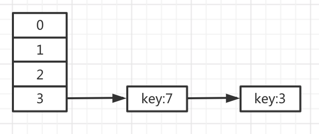
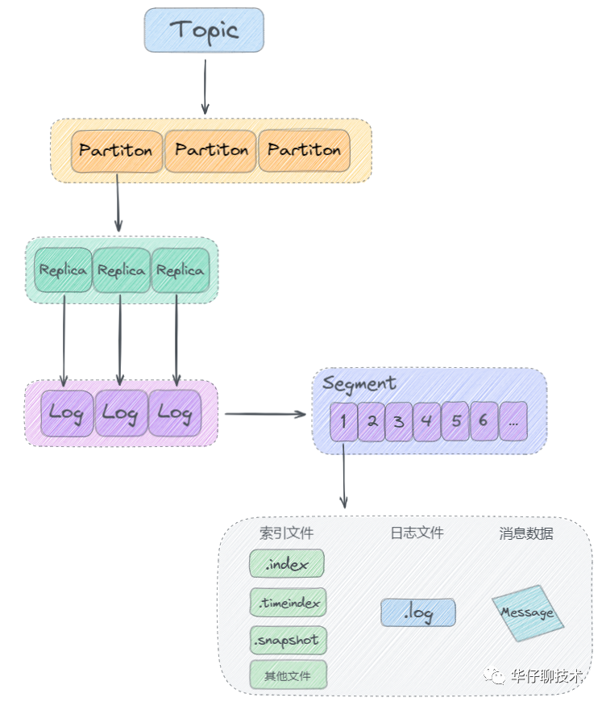

# Java 基础面试

## HashMap

### HashMap 的原理

在java 1.7 种 HashMap 采用数据 +链表的形式实现的，当出现Hash冲突后，会在HashEntry 冲突的索引位置拉出一个链表，而在java1.8 HashMap采用 数据+链表+红黑树来实现的，当链表长度 > 8 时，并且 table的size > 64时才 会转为红黑树结构，当红黑树的大小 < 6时 会退化为链表结构

jdk8 HashMap 中比较重要的几个参数如下：

```java
//默认的map大小，为2的n次幂
static final int DEFAULT_INITIAL_CAPACITY（默认初始容量） = 1 << 4; // aka 16

// 最大容量，指定的值超过 2的30次幂，默认使用这个值
static final int MAXIMUM_CAPACITY （最大容量）= 1 << 30;

//在构造函数中没有指定时使用的负载因子
static final float DEFAULT_LOAD_FACTOR = 0.75f;

//当链表长度为8时，使用以红黑树代替链表，红黑树的结点是链表长度的两倍，当比较短的时候，使用红黑树的效率其实并不高，根据泊松分布公式的统计结果，在结点数达到8时，适合使用红黑树
static final int TREEIFY_THRESHOLD（恐吓的阈值） = 8;
  
// 红黑树转为链表的阈值
static final int UNTREEIFY_THRESHOLD （非恐吓的阈值）= 6;

//链表转红黑树时数组的大小的阈值，即数组大小大于这个数字时且链表长度大于8才会转为红黑树，
//在数组长度小于64，不会转，而是进行扩容
 static final int MIN_TREEIFY_CAPACITY = 64（小的恐吓容量）;
```

HashMap 在初始化时并不会实际的创建table 数组，而是当第一次put 值时，才会正真的创建table 数组

HashMap 桶中的链表采用尾插法，避免在多线程下出现链表循环问题

 **使用头插**会改变链表的上的顺序，但是如果**使用尾插**，在扩容时会保持链表元素原本的顺序，就不会出现链表成环的问题了。 


### HashMap 的扩容流程

我们知道，第一次创建 HashMap 的时候，就会指定其容量（**如果未明确指定，默认是 16**），那随着我们不断的向 HashMap 中 put 元素的时候，就有可能会超过其容量，那么就需要有一个扩容机制。

所谓扩容，就是扩大 HashMap 的容量：


```csharp
void addEntry(int hash, K key, V value, int bucketIndex) {
    if ((size >= threshold) && (null != table[bucketIndex])) {
        resize(2 * table.length);
        hash = (null != key) ? hash(key) : 0;
        bucketIndex = indexFor(hash, table.length);
    }
    createEntry(hash, key, value, bucketIndex);
}
```

从代码中我们可以看到，在向 HashMap 中添加元素过程中，如果 `元素个数（size）超过临界值（threshold）` 的时候，就会进行自动扩容（resize），

扩容分为两步：

- 扩容：创建一个新的Entry空数组，长度是原数组的2倍。
- ReHash：遍历原Entry数组，把所有的Entry重新Hash到新数组。即将原来桶中的元素重新分配到新的桶中。


扩容前：

  

扩容后：

  


**在 HashMap 中，临界值（threshold） = 负载因子（loadFactor） \* 容量（capacity）。**


### HashMap 的 负载因子有什么作用？

负载因子是为了避免在一个HashMap 中由于Hash冲突过高，导致数组 + 链表退化为链表，查询速度会大大降低，所以在合适的情况下需要扩容，既rehash


 正常散列：

 

 

不均匀散列，并且在不扩容的情况下：

 

- **加载因子过高，例如为1，虽然减少了空间开销，提高了空间利用率，但同时也增加了查询时间成本； **

- **加载因子过低，例如0.5，虽然可以减少查询时间成本，但是空间利用率很低，同时提高了rehash操作的次数**。 


### HashMap 扩容大小

当HashMap 的 capacity * 负载因子 <= size 时，会进行 resize 扩容，扩容大小则是原来的两倍。


###  重写equals方法的时候需要重写hashCode方法 ？

 **`hashCode()`与 `equals()` 的相关规定：** 

- 如果两个对象相等，则 `hashcode` 一定也是相同的
- 两个对象相等,对两个 `equals()` 方法返回 true
- 两个对象有相同的 `hashcode` 值，它们也不一定是相等的
- 综上，`equals()` 方法被覆盖过，则 `hashCode()` 方法也必须被覆盖

 equals方法与hashCode方法**根本就是配套使用的**。对于任何一个对象，不论是使用继承自Object的equals方法还是重写equals方法。hashCode方法实际上必须要完成的一件事情就是，**为该equals方法认定为相同的对象返回相同的哈希值**。 


### Hash并发问题

*HashMap在并发编程环境下有什么问题啊?*

- (1) 多线程扩容，引起的死循环问题（JDK1.7采用头插法出现的问题）
- (2) 多线程put的时候可能导致元素丢失 （在多线程添加数据时，addEntry方法会添加Entry，在多线程情况下可能无法及时获取到其他Entry的挂载就会导致书丢失）
- (3) put非null元素后get出来的却是null （与上述是一样的情况，在addEntry时没有将Entry添加到链表中，导致数据丢失）


### HashMap 并发数据丢失

这里以 JDK1.7 为例，在addEntry 方法中添加对应entry时导致的问题：

```java
void addEntry(int hash, K key, V value, int bucketIndex) {
      // 当数组的size >= 扩容阈值，触发扩容，size大小会在createEnty和removeEntry的时候改变
      if ((size >= threshold) && (null != table[bucketIndex])) {
          // 扩容到2倍大小，后边会跟进这个方法
          resize(2 * table.length);
          // 扩容后重新计算hash和index
          hash = (null != key) ? hash(key) : 0;
          bucketIndex = indexFor(hash, table.length);
      }
      // 创建一个新的链表节点，点进去可以了解到是将新节点添加到了链表的头部
      createEntry(hash, key, value, bucketIndex);
  }
```

在代码最后一行可以看到通过createEntry方法创建一个新的链表节点，然后将链表节点添加到链表头部，假设现在有A、B 两个线程同时向某个`Entry[i] ` 中添加数据，当A 在获取Entry链表头节点old_head之后挂起，而B线程这个时候同样也获取到了old_head头节点然后进行数据添加这个时候Entry的头节点为new_head，而这个时候A线程恢复之后依旧是通过之前的old_head添加数据，这个时候就会导致B线程添加的数据丢失


### Hash 1.7 链表死循环问题

由于在JDK1.7中HashMap在并发情况下会出现链表死循环的问题，在JDK1.8时采用了尾插法来避免发生死循环问题

#### 一、HashMap 的数据结构

先一起看看jdk1.7 hashmap的数据结构： 数组 + [链表]


hashmap会给每个元素的key生成一个[hash](https://so.csdn.net/so/search?q=hash&spm=1001.2101.3001.7020)值，然后根据这个hash值计算一个在数组中的位置i。i不同的元素放在数组的不同位置，i相同的元素放在链表上，最新的数据放在链表的头部。

往hashmap中保存元素会调用put方法，获取元素会调用get方法。接下来，我们重点看看put方法。


####  二、put方法

```java
public V put(K key, V value) {
    if (table == EMPTY_TABLE) {
        inflateTable(threshold);
    }
    if (key == null)
        return putForNullKey(value);
    //根据key获取hash     
    int hash = hash(key);
    //计算在数组中的下表
    int i = indexFor(hash, table.length);
    //变量集合查询相同key的数据，如果已经存在则更新数据
    for (Entry<K,V> e = table[i]; e != null; e = e.next) {
        Object k;
        if (e.hash == hash && ((k = e.key) == key || key.equals(k))) {
            V oldValue = e.value;
            e.value = value;
            e.recordAccess(this);
            //返回已有数据
            return oldValue;
        }
    }
    modCount++;
    //如果不存在相同key的元素，则添加新元素
    addEntry(hash, key, value, i);
    return null;
}
```

<br/>

再看看addEntry方法

```java
void addEntry(int hash, K key, V value, int bucketIndex) {
      // 当数组的size >= 扩容阈值，触发扩容，size大小会在createEnty和removeEntry的时候改变
      if ((size >= threshold) && (null != table[bucketIndex])) {
          // 扩容到2倍大小，后边会跟进这个方法
          resize(2 * table.length);
          // 扩容后重新计算hash和index
          hash = (null != key) ? hash(key) : 0;
          bucketIndex = indexFor(hash, table.length);
      }
      // 创建一个新的链表节点，点进去可以了解到是将新节点添加到了链表的头部
      createEntry(hash, key, value, bucketIndex);
  }
```

<br/>

看看resize是如何扩容的

```java
void resize(int newCapacity) {
        Entry[] oldTable = table;
        int oldCapacity = oldTable.length;
        if (oldCapacity == MAXIMUM_CAPACITY) {
            threshold = Integer.MAX_VALUE;
            return;
        }
        // 创建2倍大小的新数组
        Entry[] newTable = new Entry[newCapacity];
        // 将旧数组的链表转移到新数组，就是这个方法导致的hashMap不安全，等下我们进去看一眼
        transfer(newTable, initHashSeedAsNeeded(newCapacity));
        table = newTable;
        // 重新计算扩容阈值(容量*加载因子)
        threshold = (int)Math.min(newCapacity * loadFactor, MAXIMUM_CAPACITY + 1);
}
```

<br/>

出问题的就是这个transfer方法

```java
void transfer(Entry[] newTable, boolean rehash) {
    int newCapacity = newTable.length;
    // 遍历旧数组
    for (Entry<K,V> e : table) {
        // 遍历链表
        while(null != e) {
             //获取下一个元素，记录到一个临时变量，以便后面使用
            Entry<K,V> next = e.next;
            if (rehash) {
                e.hash = null == e.key ? 0 : hash(e.key);
            }
            // 计算节点在新数组中的下标
            int i = indexFor(e.hash, newCapacity);
            // 将旧节点插入到新节点的头部
            e.next = newTable[i];
            //这行才是真正把数据插入新数组中，前面那行代码只是设置当前节点的next
            //这两行代码决定了倒序插入
            //比如：以前同一个位置上是:3，7，后面可能变成了：7、3
            newTable[i] = e;
            //将下一个元素赋值给当前元素，以便遍历下一个元素
            e = next;
        }
    }
}
```

我来给大家分析一下，为什么这几个代码是头插法，网上很多技术文章都没有说清楚。


#### 三、头插法

我们把目光聚焦到这几行代码：

```java
  //获取下一个元素，记录到一个临时变量，以便后面使用
  Entry<K,V> next = e.next;
  // 计算节点在新数组中的下标
  int i = indexFor(e.hash, newCapacity);
  // 将旧节点插入到新节点的头部
  e.next = newTable[i];
  //这行才是真正把数据插入新数组中，前面那行代码只是设置当前节点的next
  newTable[i] = e;
  //将下一个元素赋值给当前元素，以便遍历下一个元素
  e = next;
```

假设刚开始hashMap有这些数据


调用put方法需要进行一次扩容，刚开始会创建一个空的数组，大小是以前的2倍，如图所示：


开始第一轮循环：

```java
  //next= 7   e = 3  e.next = 7
  Entry<K,V> next = e.next;
  // i=3
  int i = indexFor(e.hash, newCapacity);
  //e.next = null ，刚初始化时新数组的元素为null
  e.next = newTable[i];
  //给新数组i位置 赋值 3
  newTable[i] = e;
  // e = 7
  e = next;
```

 执行完之后，第一轮循环之后数据变成这样的

 


再接着开始第二轮循环：

```java
  //next= 5   e = 7  e.next = 5
  Entry<K,V> next = e.next;
  // i=3
  int i = indexFor(e.hash, newCapacity);
  //e.next = 3 ，此时相同位置上已经有key=3的值了，将该值赋值给当前元素的next
  e.next = newTable[i];
  //给新数组i位置 赋值 7
  newTable[i] = e;
  // e = 5
  e = next;
```

 

上面会构成一个新链表，连接的顺序正好反过来了。



 由于第二次循环时，节点key=7的元素插到相同位置上已有元素key=3的前面，所以说是采用的头插法。


#### 四、死循环的产生

接下来重点看看死循环是如何产生的？

假设数据跟元素数据一致，有两个线程：线程1 和 线程2，同时执行put方法，最后同时调用transfer方法。

线程1 先执行，到 Entry<K,V> next = e.next; 这一行，被挂起了。

```java
  //next= 7   e = 3  e.next = 7
  Entry<K,V> next = e.next;
  int i = indexFor(e.hash, newCapacity);
  e.next = newTable[i];
  newTable[i] = e;
  e = next;
```

此时线程1 创建的数组会创建一个空数组


接下来，线程2开始执行，由于线程2运气比较好，没有被中断过，执行完毕了。


过一会儿，线程1被恢复了，重新执行代码。

```java
 //next= 7   e = 3  e.next = 7
  Entry<K,V> next = e.next;
  // i = 3
  int i = indexFor(e.hash, newCapacity);
  // e.next = null，刚初始化时新数组的元素为null（为什么为newTable[i]=null,是因为创建table数组时在方法内部创建的而不是共享的，
  // 所以这里newTable[i]依旧是null）
  e.next = newTable[i];
  // 给新数组i位置 赋值 3
  newTable[i] = e;
  // e = 7
  e = next;
```

 这时候线程1的数组会变成这样的


 

再执行第二轮循环，此时的e=7

```java
  //next= 3   e = 7  e.next = 3
  Entry<K,V> next = e.next;
  // i = 3
  int i = indexFor(e.hash, newCapacity);
  // e.next = 3，此时相同位置上已经有key=3的值了，将该值赋值给当前元素的next
  e.next = newTable[i];
  // 给新数组i位置 赋值 7
  newTable[i] = e;
  // e = 3
  e = next;
```

 

这里特别要说明的是 此时e=7，而e.next为什么是3呢？

因为hashMap的数据是公共的，还记得线程2中的生成的数据吗？


此时e=7，那么e.next肯定是3。

经过上面第二轮循环之后，线程1得到的数据如下：

 


此时由于循环判断还没有退出，判断条件是： while(null != e)，所以要开始第三轮循环：

```java
  //next= null   e = 3  e.next = null
  Entry<K,V> next = e.next;
  // i = 3
  int i = indexFor(e.hash, newCapacity);
  // e.next = 7，关键的一步，由于第二次循环是 key:7 .next = key:3，现在key:3.next = key:7
  e.next = newTable[i];
  // 给新数组i位置 赋值 3
  newTable[i] = e;
  // e = null
  e = next;
```

 由于e=null，此时会退出循环，最终线程1的数据会是这种结构：


key:3 和 key:7又恢复了刚开始的顺序，但是他们的next会相互引用，构成环形引用。

注意，此时调用hashmap的get方法获取数据时，如果只是获取循环链上key:3 和 key:7的数据，是不会有问题的，因为可以找到。就怕获取循环链上没有的数据，比如：key:11，key:15等，会进入无限循环中导致CPU使用率飙升


### 你一般用什么作为HashMap的key?

一般用Integer、String这种不可变类当HashMap当key，而且String最为常用。

- (1) 因为字符串是不可变的，所以在它创建的时候hashcode就被缓存了，不需要重新计算。这就使得字符串很适合作为Map中的键，字符串的处理速度要快过其它的键对象。这就是HashMap中的键往往都使用字符串。
- (2) 因为获取对象的时候要用到equals()和hashCode()方法，那么键对象正确的重写这两个方法是非常重要的,这些类已经很规范的覆写了hashCode()以及equals()方法。


*我用可变类当HashMap的key有什么问题?*

hashcode可能发生改变，导致put进去的值，无法get出，如下所示

```text
HashMap<List<String>, Object> changeMap = new HashMap<>();
List<String> list = new ArrayList<>();
list.add("hello");
Object objectValue = new Object();
changeMap.put(list, objectValue);
System.out.println(changeMap.get(list));
list.add("hello world");//hashcode发生了改变
System.out.println(changeMap.get(list));
```

输出值如下

```text
java.lang.Object@74a14482
null
```


## ConcurrentHashMap

### ConcurrentHashMap 1.7

文章来源：https://blog.csdn.net/qq_38982845/article/details/124182791

ConcurrentHashMap 1.7 采用Segement 与 ReteetranLock + HashEntry 实现，既每一个Segment 内部都都维护了一个HashEntry 数组， 而每一个 Segment 是一个类似于 HashMap 的结构，所以每一个 HashMap 的内部可以进行扩容。但是 Segment 的个数一旦**初始化就不能改变**，默认 Segment 的个数是 16 个，你也可以认为 ConcurrentHashMap 默认支持最多 16 个线程并发。 


HashEntry特点：

```java
static final class HashEntry<K,V> {
        final int hash;
        final K key;
        volatile V value;
        volatile HashEntry<K,V> next;
}
```

- HashEntry 本身就可以用来实现链表
- 每个Segement 内部都维护了一个Size 用来计算当前Segement 内部的元素数量，用于扩容操作
- 每个 Segement 就类似于HashMap 一样，都拥有自己的HashEntry 数组、threshold 出发的扩容阀值，modCount 用于标识 failFast 机制，loadFactor 负载因子等等。


#### 初始化

```java
	// 基本信息校验
    if (!(loadFactor > 0) || initialCapacity < 0 || concurrencyLevel <= 0)
        throw new IllegalArgumentException();
    if (concurrencyLevel > MAX_SEGMENTS)
        concurrencyLevel = MAX_SEGMENTS;
    // Find power-of-two sizes best matching arguments
    int sshift = 0;
    int ssize = 1;
    // 下面找到>=concurrencyLevel最小2次幂方数
    while (ssize < concurrencyLevel) {
        ++sshift;
        ssize <<= 1;
    }
    // segmentShift是用于定位参与hash运算的位数
    this.segmentShift = 32 - sshift;
    /**
     * segmentMask是哈希运算的掩码,长度-1参与
     * 为啥这里构造方法中就确定这个全局的segment掩码值，而HashMap中会在put时使用数组长度-1动态获取
     * 因为一旦Segment对象长度指定之后，ConcurrentHashMap后续不会对Segment进行扩容，并发度不会改变
     */
    this.segmentMask = ssize - 1;
    if (initialCapacity > MAXIMUM_CAPACITY)
        initialCapacity = MAXIMUM_CAPACITY;
    // 初始节点总数量/segment对象数量=每个Segment对象下Entry数量
    int c = initialCapacity / ssize;
    /**
     * 为啥先除再乘ssize呢？这里是向上取整
     * 如initialCapacity=12时，ssize=8，c其实为1.5，但12/8=1,下述是向上取整操作
     * 目的：为了保证最后创建出来的Entry数必须大于等于你想要创建的initialCapacity数量
     */
    if (c * ssize < initialCapacity)
        ++c;//向上取整
    int cap = MIN_SEGMENT_TABLE_CAPACITY;
    // 确保cap为>=c的2的次方数
    while (cap < c)
        cap <<= 1;
    // create segments and segments[0]
    Segment<K,V> s0 =
        new Segment<K,V>(loadFactor, (int)(cap * loadFactor),
                         (HashEntry<K,V>[])new HashEntry[cap]);
    // ssize一定是2幂次方数，为了保证按位与的hash算法能均匀分布在[0,ssize]上
    Segment<K,V>[] ss = (Segment<K,V>[])new Segment[ssize];
    // 通过直接操作内存将s0对象放在Segment数组第0个位置
    UNSAFE.putOrderedObject(ss, SBASE, s0); // ordered write of segments[0]
    this.segments = ss
```

当ConcurrentHashMap初始化时，会有以下几点操作

- 会根据 传入的concurrentLevel 来初始化该Segement 数组的大小
- 计算Sgement 内部的HashEntry 数组的大小，默认为最小值为2
- 计算segementShift 与 segmentMask 用于确定Segement 数组下标
- 创建Segement 数组得  0 下标位置得 Segement 对象然后放入数据，并且指定HashEntry 数组得大小为刚刚计算出来得值
- **初始化 segments[0]**，**默认大小为 2**，**负载因子 0.75**，**扩容阀值是 2\*0.75=1.5**，插入第二个值时才会进行扩容。


#### put 操作

**ConcurrentHashMap#put**

```java
public V put(K key, V value) {
    Segment<K,V> s;
    // 不允许key为空
    if (value == null)
        throw new NullPointerException();
    // 计算key的hash值
    int hash = hash(key);
    // 计算Segment数组的下标
    int j = (hash >>> segmentShift) & segmentMask;
    // 判断Segment的j位置是否为空，基于UNSAFE下的线程安全操作
    if ((s = (Segment<K,V>)UNSAFE.getObject          // nonvolatile; recheck
         (segments, (j << SSHIFT) + SBASE)) == null) //  in ensureSegment
        /**
         * Segment的j位置为空时进行Segment对象的创建
         * 这里不在乎是哪个线程创建的，多线程下能创建成功即可
         */
        s = ensureSegment(j);
    // 调用Segment的put方法，与HashMap的put差不多，就保证了线程安全
    return s.put(key, hash, value, false);
}
```

<br/>

**Segment#Put**

```java
// 可能多个线程同时调用一个Segment对象的put方法
final V put(K key, int hash, V value, boolean onlyIfAbsent) {
    /**
     * tryLock()：非阻塞，尝试获取锁
     * lock()：阻塞加锁
     * 下面操作加不上锁会导致CPU爆满，优点可以在循环内做相应业务逻辑
     * while(!tryLock()) {
     *     // 业务逻辑
     * }
     */
    HashEntry<K,V> node = tryLock() ? null :
        scanAndLockForPut(key, hash, value);
    V oldValue;
    try {
        HashEntry<K,V>[] tab = table;
        // 定位到Segment下面数组的下标
        int index = (tab.length - 1) & hash;
        // 获取数组index下标节点(首节点)
        HashEntry<K,V> first = entryAt(tab, index);
        // 遍历该节点下链表
        for (HashEntry<K,V> e = first;;) {
            if (e != null) { // 链表不为空
                K k;
                // hash值相等且equals相等
                if ((k = e.key) == key ||
                    (e.hash == hash && key.equals(k))) {
                    oldValue = e.value;
                    if (!onlyIfAbsent) {
                        e.value = value;
                        ++modCount; // 统计操作集合次数，fair-fast机制
                    }
                    break;
                }
                e = e.next; //遍历
            } else {
                if (node != null)
                    // 头插法
                    node.setNext(first);
                else
                    node = new HashEntry<K,V>(hash, key, value, first);
                int c = count + 1;
                if (c > threshold && tab.length < MAXIMUM_CAPACITY)
                    rehash(node); // 超过扩容阀值进行数组扩容
                else
                    // 使用UNSAFE.putOrderedObject方法插入
                    setEntryAt(tab, index, node);
                ++modCount;
                count = c;
                oldValue = null;
                break;
            }
        }
    } finally {
        // ReentranLock必须手动释放锁
        unlock();
    }
    return oldValue;
}

// 获取数组指定下标节点
static final <K,V> HashEntry<K,V> entryAt(HashEntry<K,V>[] tab, int i) {
    return (tab == null) ? null :
    (HashEntry<K,V>) UNSAFE.getObjectVolatile
        (tab, ((long)i << TSHIFT) + TBASE);
}

```

在创建，对于JDK1.7 的ConcurrentHashMap 数据插入操作，需要**进行两次Hash**去定位数据的存储位置 ，第一次hash是找到 segement 对应的的数组下标位置，第二次hash 则是找到 数据对应的HashEntry 数组的下标位置

- 当我们存入数据时，会经过第一次hash 获取Segement 数组的下标位置，判断Segement 对象是否存在，如果不存在则采用CAS 进行创建，并且赋值
- 在创建Segment 对象时间，使用Segement 数组下标为0得 Segement 对象得HashEntry 的数组size 来初始化其他Segement 对象的 HashEntry 数组
- 在将数据插入指定的HashEntry位置时（链表的尾端），会通过继承ReentrantLock的tryLock（）方法尝试去获取锁，如果获取成功就直接插入相应的位置，如果已经有线程获取该Segment的锁，那当前线程会以自旋的方式去继续的调用tryLock（）方法去获取锁，超过指定次数就挂起，等待唤醒，默认的自旋次数为64次（如果cpu 的 核心数 > 1 就等于64次，否则为1次）
- 第二次hash 获取HashEntry 的数据下标位置 ，判断 HashEntry 对象是否为null，如果为null 则进行初始化，否则遍历HashEntry 链表 判断Key 是否存在，如果存在则替换，如果不存在则 链表头插法插入 
- 当 segment 内部维护的元素数量 + 1 > threadshold 时，则进行rehash 就是扩容操作，默认与HashMap 一样是原来的两倍


#### get 操作

到这里就很简单了，get 方法只需要两步即可。

- 从Segment 数组中获取对应的Segment 对象
- 从对应Segment 对象的HashEntry 数组 获取 HashEntry 对象
- 对HashEntry 链表进行遍历获取指定的元素

```
public V get(Object key) {
    Segment<K,V> s; // manually integrate access methods to reduce overhead
    HashEntry<K,V>[] tab;
    int h = hash(key);
    long u = (((h >>> segmentShift) & segmentMask) << SSHIFT) + SBASE;
    // 计算得到 key 的存放位置
    if ((s = (Segment<K,V>)UNSAFE.getObjectVolatile(segments, u)) != null &&
        (tab = s.table) != null) {
        for (HashEntry<K,V> e = (HashEntry<K,V>) UNSAFE.getObjectVolatile
                 (tab, ((long)(((tab.length - 1) & h)) << TSHIFT) + TBASE);
             e != null; e = e.next) {
            // 如果是链表，遍历查找到相同 key 的 value。
            K k;
            if ((k = e.key) == key || (e.hash == h && key.equals(k)))
                return e.value;
        }
    }
    return null;
}
```


### ConcurrentHashMap 1.8

ConcurrentHashMap 1.8 对比于1.7来说采用了cas + synchronize的方式进行并发读写的，当添加数据时首先会判断Node数组对应的桶 既Node数组下标对应的首节点是否为null，如果为null则采用cas创建首节点，并对首节点进行枷锁


 可以发现 Java8 的 ConcurrentHashMap 相对于 Java7 来说变化比较大，不再是之前的 **Segment 数组 + HashEntry 数组 + 链表**，而是 **Node 数组 + 链表 / 红黑树**。当冲突链表达到一定长度时，链表会转换成红黑树。 


### ConcurrentHashMap 1.7 与 1.8 有什么区别

- Java7 中 ConcurrentHashMap 使用的分段锁，也就是每一个 Segment 上同时只有一个线程可以操作，每一个 Segment 都是一个类似 HashMap 数组的结构，它可以扩容，它的冲突会转化为链表。但是 Segment 的个数一但初始化就不能改变。

- Java8 中的 ConcurrentHashMap 使用的 Synchronized 锁加 CAS 的机制。结构也由 Java7 中的 **Segment 数组 + HashEntry 数组 + 链表** 进化成了 **Node 数组 + 链表 / 红黑树**，Node 是类似于一个 HashEntry 的结构。它的冲突再达到一定大小时会转化成红黑树，在冲突小于一定数量时又退回链表。

- 对比来说的话，java8的 ConcurrentHashMap 的分段锁的粒度更小了，而且当链表长度 > 8 时，查找效率也从 `O(N)` 变味了`O(logn)`，

- JDK1.8的实现降低锁的粒度，JDK1.7版本锁的粒度是基于Segment的，包含多个HashEntry，而JDK1.8锁的粒度就是HashEntry（首节点）


## List

### 什么情况下你会使用ArrayList？什么时候你会选择LinkedList？

1. **是否保证线程安全：** `ArrayList` 和 `LinkedList` 都是不同步的，也就是不保证线程安全；
2. **底层数据结构：** `Arraylist` 底层使用的是 **`Object` 数组**；`LinkedList` 底层使用的是 **双向链表** 数据结构（JDK1.6 之前为循环链表，JDK1.7 取消了循环。注意双向链表和双向循环链表的区别，下面有介绍到！）
3. 插入和删除是否受元素位置的影响：
   - `ArrayList` 采用数组存储，所以插入和删除元素的时间复杂度受元素位置的影响。 比如：执行`add(E e)`方法的时候， `ArrayList` 会默认在将指定的元素追加到此列表的末尾，这种情况时间复杂度就是 O(1)。但是如果要在指定位置 i 插入和删除元素的话（`add(int index, E element)`）时间复杂度就为 O(n-i)。因为在进行上述操作的时候集合中第 i 和第 i 个元素之后的(n-i)个元素都要执行向后位/向前移一位的操作。
   - `LinkedList` 采用链表存储，所以，如果是在头尾插入或者删除元素不受元素位置的影响（`add(E e)`、`addFirst(E e)`、`addLast(E e)`、`removeFirst()` 、 `removeLast()`），近似 O(1)，如果是要在指定位置 `i` 插入和删除元素的话（`add(int index, E element)`，`remove(Object o)`） 时间复杂度近似为 O(n) ，因为需要先移动到指定位置再插入。
4. **是否支持快速随机访问：** `LinkedList` 不支持高效的随机元素访问，而 `ArrayList` 支持。快速随机访问就是通过元素的序号快速获取元素对象(对应于`get(int index)`方法)。
5. **内存空间占用：** ArrayList 的空 间浪费主要体现在在 list 列表的结尾会预留一定的容量空间，而 LinkedList 的空间花费则体现在它的每一个元素都需要消耗比 ArrayList 更多的空间（因为要存放直接后继和直接前驱以及数据）


### ArrayList的扩容？  

ArrayList 内部维护了一个final 类型的 DEFAULTCAPACITY_EMPTY_ELEMENTDATA 变量默认是一个空的数组

当我们 new一个ArrayList集合时，如过不指定容量的话，默认是就会将当前类变量element数组 设置为 上面的空数组，第一次添加元素的时候判断，当前数组是否为空数组，如过是空数组的话，就会开辟一个size为10 的数组，如果指定初始化大小的时候，在初始化的时候就会构建一个指定大小的element数组，

向集合添加元素时，会判断当前实际存储的元素数量既 size + 1 是否大于 现有的数组容量，如果大于的话 则 将原来的容量右移 一位 `oldCapacity >> 1`，既每次扩容为原理的1.5倍。


## Map

### LinkedHashMap 的结构 

DK集合框架中有一个类LinkedHashMap，顾名思义，是一种链表与Hash结合的数据结构。



LinkedHashMap是一种将所有Entry节点链入一个双向链表的HashMap，额外维护了一个双向链表用于保持迭代顺序（按元素插入顺序，尾插法）：


*LinkedHashMap*中有一个*accessOrder*字段，true表示按照LRU原则维护元素次序，false则表示按插入顺序维护元素次序：

```java
 public LinkedHashMap(int initialCapacity, float loadFactor, boolean accessOrder) {
        super(initialCapacity, loadFactor);
        this.accessOrder = accessOrder;
    }
```

所以，基于*LinkedHashMap*的这种特性，我们很容易实现一个基于LRU算法的简单缓存：

```java
public class LRUCache<K, V> extends LinkedHashMap<K, V> {

    /**
     * 缓存数据量大小
     */
    private final int CACHE_SIZE;

    public LRUCache(int cacheSize) {
        // 设置hashmap的初始大小，最后一个true让linkedhashmap按照访问顺序来进行排序
        super((int) Math.ceil(cacheSize / 0.75) + 1, 0.75f, true);
        CACHE_SIZE = cacheSize;
    }

    /**
     * 当map中的数据量大于最大缓存数据量时，就自动删除最老的数据
     */
    @Override
    protected boolean removeEldestEntry(Map.Entry eldest) {
        return size() > CACHE_SIZE;
    }
}
```


### HashMap 和 TreeMap 区别

`TreeMap` 和`HashMap` 都继承自`AbstractMap` ，但是需要注意的是`TreeMap`它还实现了`NavigableMap`接口和`SortedMap` 接口。

[](https://github.com/Snailclimb/JavaGuide/blob/master/docs/java/collection/images/TreeMap继承结构.png)

实现 `NavigableMap` 接口让 `TreeMap` 有了对集合内元素的搜索的能力。

实现`SortMap`接口让 `TreeMap` 有了对集合中的元素根据键排序的能力。默认是按 key 的升序排序，不过我们也可以指定排序的比较器。SortedMap 接口源码增加了几个比较重要的方法如下：

```java
    Comparator<? super K> comparator();

	//返回该映射中键值严格小于toKey的部分的视图
    SortedMap<K,V> headMap(K toKey);

    //返回该映射中键大于或等于fromKey的部分的视图 
    SortedMap<K,V> tailMap(K fromKey);
 
    K firstKey();

    K lastKey();
    
    SortedMap<K,V> subMap(K fromKey, K toKey);
```

**综上，相比于`HashMap`来说 `TreeMap` 主要多了对集合中的元素根据键排序的能力以及对集合内元素的搜索的能力。**


### HashMap 和 Hashtable 的区别

1. **线程是否安全：** `HashMap` 是非线程安全的，`HashTable` 是线程安全的,因为 `HashTable` 内部的方法基本都经过`synchronized` 修饰。（如果你要保证线程安全的话就使用 `ConcurrentHashMap` 吧！）；
2. **效率：** 因为线程安全的问题，`HashMap` 要比 `HashTable` 效率高一点。另外，`HashTable` 基本被淘汰，不要在代码中使用它；
3. **对 Null key 和 Null value 的支持：** `HashMap` 可以存储 null 的 key 和 value，但 null 作为键只能有一个，null 作为值可以有多个；HashTable 不允许有 null 键和 null 值，否则会抛出 `NullPointerException`。
4. **初始容量大小和每次扩充容量大小的不同 ：** ① 创建时如果不指定容量初始值，`Hashtable` 默认的初始大小为 11，之后每次扩充，容量变为原来的 2n+1。`HashMap` 默认的初始化大小为 16。之后每次扩充，容量变为原来的 2 倍。② 创建时如果给定了容量初始值，那么 Hashtable 会直接使用你给定的大小，而 `HashMap` 会将其扩充为 2 的幂次方大小（`HashMap` 中的`tableSizeFor()`方法保证，下面给出了源代码）。也就是说 `HashMap` 总是使用 2 的幂作为哈希表的大小,后面会介绍到为什么是 2 的幂次方。
5. **底层数据结构：** JDK1.8 以后的 `HashMap` 在解决哈希冲突时有了较大的变化，当链表长度大于阈值（默认为 8）（将链表转换成红黑树前会判断，如果当前数组的长度小于 64，那么会选择先进行数组扩容，而不是转换为红黑树）时，将链表转化为红黑树，以减少搜索时间。Hashtable 没有这样的机制。


## Collection 体系

java的collection 主要分为两大体系，分别为Collection 与 Map，其中Collection 主要用来存储单个元素，而 Map 用来存储K,V 类型的键值对

### Collection

Collection 又分为三大类，分别为Queue、Set、List

- List：  存储的元素是有序的、可重复的。 
- Set ： 存储的元素是无序的、不可重复的。 
- Queue：用来实现队列，包括FIFO，FILO等

  


下图为详细的实现类图


List的实现类包括 如下：

- `Arraylist`： `Object[]`数组
- `Vector`：`Object[]`数组
- `LinkedList`： 双向链表(JDK1.6 之前为循环链表，JDK1.7 取消了循环)

Set 的实现包括 如下：

- `HashSet`（无序，唯一）: 基于 `HashMap` 实现的，底层采用 `HashMap` 来保存元素
- `LinkedHashSet`：`LinkedHashSet` 是 `HashSet` 的子类，并且其内部是通过 `LinkedHashMap` 来实现的。有点类似于我们之前说的 `LinkedHashMap` 其内部是基于 `HashMap` 实现一样，不过还是有一点点区别的
- `TreeSet`（有序，唯一）： 红黑树(自平衡的排序二叉树)


### Map

Map 体系 主要分为 HashMap 与 SortedMap ，既 有序Map 与 无序Map，结构图如下：


Map接口的实现类主要有如下：

- `HashMap`： JDK1.8 之前 `HashMap` 由数组+链表组成的，数组是 `HashMap` 的主体，链表则是主要为了解决哈希冲突而存在的（“拉链法”解决冲突）。JDK1.8 以后在解决哈希冲突时有了较大的变化，当链表长度大于阈值（默认为 8）（将链表转换成红黑树前会判断，如果当前数组的长度小于 64，那么会选择先进行数组扩容，而不是转换为红黑树）时，将链表转化为红黑树，以减少搜索时间
- `LinkedHashMap`： `LinkedHashMap` 继承自 `HashMap`，所以它的底层仍然是基于拉链式散列结构即由数组和链表或红黑树组成。另外，`LinkedHashMap` 在上面结构的基础上，增加了一条双向链表，使得上面的结构可以保持键值对的插入顺序。同时通过对链表进行相应的操作，实现了访问顺序相关逻辑。详细可以查看：[《LinkedHashMap 源码详细分析（JDK1.8）》](https://www.imooc.com/article/22931)
- `Hashtable`： 数组+链表组成的，数组是 `Hashtable` 的主体，链表则是主要为了解决哈希冲突而存在的
- `TreeMap`： 红黑树（自平衡的排序二叉树）


### java 集合的fail-fast机制 是什么？ 

是java集合的一种错误检测机制，当多个线程对集合进行结构上的改变的操作时，有可能会产生 fail-fast 机制。

例如：假设存在两个线程（线程1、线程2），线程1通过Iterator在遍历集合A中的元素，在某个时候线程2修改了集合A的结构（是结构上面的修改，而不是简单的修改集合元素的内容），那么这个时候程序就会抛出 ConcurrentModificationException 异常，从而产生fail-fast机制。

原因：迭代器在遍历时直接访问集合中的内容，并且在遍历过程中使用一个 modCount 变量。集合在被遍历期间如果内容发生变化，就会改变modCount的值。每当迭代器使用hashNext()/next()遍历下一个元素之前，都会检测modCount变量是否为expectedmodCount值，是的话就返回遍历；否则抛出异常，终止遍历。

解决办法：

- 在遍历过程中，所有涉及到改变modCount值得地方全部加上synchronized。
- 使用CopyOnWriteArrayList来替换ArrayList


### Comparable  与 Comparator 的区别是什么？

Comparator 用于外部排序，需要实现其 compare  方法，返回一个 int 值 ，大于 0 则表示 left > right,  = 0并表示等于 left = right， < 0 表示 left < right

一般排序默认都会使用Colelctions 的 sort 进行排序 ，通过传入Comparactor 对现有集合的元素进行排序。

我们可以自定义实现Comparactor 接口 或者使用 java 自带的Comparactor 工具类，来生成自定义的Comparactor 实例


Comparable 一般用来实现内部排序，比如我们使用TreeMap 时，放入的Key 对象需要实现Comparable  接口，或者使用ProprityQueue 时，放入的元素也需要实现Comparable 接口 用于内部放入元素时进行排序


### Queue 的 poll 与 take 与 remove 有什么区别

这上面的三个方法都是从队列获取元素的

poll：如果队列的头部有值则直接返回，否则返回为null，不会阻塞

take： 则会阻塞，知道有值才会进行返回

remove： 如果队列中没有值则抛出异常，否则返回队列头部的值


### Queue 的 add 与 offer 与 put 有什么区别

这上面的三个方法都是向队列添加元素的

add：如果队列已经满了则抛出异常

offer：如果队列已满则返回false，否则返回true

put：如果队列已满，则阻塞直到可以向队列添加元素


### Queue 的 peek 方法与 poll 方法有什么区别

peek 是查看队列首部是否有值，但不会删除队列头部的值，而poll 方法会删除队列头部的值


## 基础

### ==与 equals 的区别

对于基本类型来说，== 比较的是值是否相等；

对于引用类型来说，== 比较的是两个引用是否指向同一个对象地址（两者在内存中存放的地址（堆内存地址）是否指向同一个地方）；

对于引用类型（包括包装类型）来说，equals 如果没有被重写，对比它们的地址是否相等；如果 equals()方法被重写（例如 String），则比较的是地址里的内容。


### hash 的原理


### String StringBuffer 和 StringBuilder 的区别是什么? String 为什么是不可变的?

**可变性**

简单的来说：`String` 类中使用 final 关键字修饰字符数组来保存字符串，`private final char value[]`，所以`String` 对象是不可变的。

> 补充（来自[issue 675](https://github.com/Snailclimb/JavaGuide/issues/675)）：在 Java 9 之后，String 、`StringBuilder` 与 `StringBuffer` 的实现改用 byte 数组存储字符串 `private final byte[] value`

而 `StringBuilder` 与 `StringBuffer` 都继承自 `AbstractStringBuilder` 类，在 `AbstractStringBuilder` 中也是使用字符数组保存字符串`char[]value` 但是没有用 `final` 关键字修饰，所以这两种对象都是可变的。

`StringBuilder` 与 `StringBuffer` 的构造方法都是调用父类构造方法也就是`AbstractStringBuilder` 实现的，大家可以自行查阅源码。

```
AbstractStringBuilder.java
abstract class AbstractStringBuilder implements Appendable, CharSequence {
    /**
     * The value is used for character storage.
     */
    char[] value;

    /**
     * The count is the number of characters used.
     */
    int count;

    AbstractStringBuilder(int capacity) {
        value = new char[capacity];
    }}
```

**线程安全性**

`String` 中的对象是不可变的，也就可以理解为常量，线程安全。`AbstractStringBuilder` 是 `StringBuilder` 与 `StringBuffer` 的公共父类，定义了一些字符串的基本操作，如 `expandCapacity`、`append`、`insert`、`indexOf` 等公共方法。`StringBuffer` 对方法加了同步锁或者对调用的方法加了同步锁，所以是线程安全的。`StringBuilder` 并没有对方法进行加同步锁，所以是非线程安全的。

**性能**

每次对 `String` 类型进行改变的时候，都会生成一个新的 `String` 对象，然后将指针指向新的 `String` 对象。`StringBuffer` 每次都会对 `StringBuffer` 对象本身进行操作，而不是生成新的对象并改变对象引用。相同情况下使用 `StringBuilder` 相比使用 `StringBuffer` 仅能获得 10%~15% 左右的性能提升，但却要冒多线程不安全的风险。

**对于三者使用的总结：**

1. 操作少量的数据: 适用 `String`
2. 单线程操作字符串缓冲区下操作大量数据: 适用 `StringBuilder`
3. 多线程操作字符串缓冲区下操作大量数据: 适用 `StringBuffer`


### 深拷贝 vs 浅拷贝

首先Object.clone() 本身就是浅拷贝

1. **浅拷贝**：对基本数据类型进行值传递，对引用数据类型进行引用传递般的拷贝，此为浅拷贝。
2. **深拷贝**：对基本数据类型进行值传递，对引用数据类型，创建一个新的对象，并复制其内容，此为深拷贝。


深拷贝


### 


### Iterator和Iterable的区别

1. Iterator和Iterable的区别


### BIO 与 NIO的区别

- BIO：Blocking-IO，同步阻塞IO

  是基于流模型的实现，是JDK1.4之前唯一的选择，在交互时会产生阻塞，在流读写时线程会一直阻塞，直到有内容可读或可写。一般在ServerSocket和Socket套接字程序中使用。因为网络通信也是IO行为，也采用的BIO模型。

  在网络通信中每个客户端的连接会占用服务器端一个线程，该线程只能为该客户端服务，即使客户端什么也没做这个线程也要一直为它服务。由于每台计算机的线程数量有限，当客户端过多时容易出现瓶颈,无法满足高并发高性能的需求。就算采用线程池来解决线程问题，但也无法满足我们的正常需求。

  

- NIO：Non Blocking-IO，同步非阻塞IO，JDK1.4加入，采用多路复用器，每个客户端会对应一个Channel，该Channel会被注册到多路复用器上，多路复用器轮询到连接有I/O操作时，服务器端才会分配一个线程对其处理。也就是说他是一个请求对应一个线程处理，即有I/O读写的请求。当连接没有数据时，是不会有线程来问候这个客户端的。

  

  但NIO仍然存在和BIO一样的问题，阻塞。当其中一个客户端进行着长时间的读写操作时，该处理线程会被占用，此时如果其他客户端也要进行I/O操作，只能等待当前的线程空闲下来才有机会，所以此时大量的客户端的I/O请求被阻塞，依然会产生很大问题。

  但NIO对其有不一样的解决方式，NIO中有3种线程模型，如下：

  - 单线程模型：一个线程服务所有客户端请求
  - 多线程模型：充分利用多核CPU优势，采用线程池来提供客户端处理，1个线程处理连接，另外一个工作线程处理I/O读写，但执行I/O读写的线程仍然会存在性能问题
  - 主从线程模型：主线程负责连接事件，子线程负责I/O读写，极大提高客户端连接数

- AIO：NIO2，异步非阻塞IO，JDK1.7加入，主要在java.nio.channels包下增加了下提供了以下4个通道

  ```java
  AsynchronousSocketChannel
  AsynchronousServerSocketChannel
  AsynchronousFileChannel
  AsynchronousDatagramChannel
  ```

  当进行读写操作时，只须直接调用API的read或write方法即可。read/write方法都是异步的，完成后会主动调用回调函数。

- 总结

  BIO：一个连接对应一个线程

  NIO：一个连接对应一个channel，一个请求对应一个线程

  AIO：一个有效请求对应一个线程


### 自动装箱与拆箱

- **装箱**：将基本类型用它们对应的引用类型包装起来；
- **拆箱**：将包装类型转换为基本数据类型；

举例：

```
Integer i = 10;  //装箱
int n = i;   //拆箱
```

上面这两行代码对应的字节码为：

```java
 L1

    LINENUMBER 8 L1

    ALOAD 0

    BIPUSH 10

    INVOKESTATIC java/lang/Integer.valueOf (I)Ljava/lang/Integer;

    PUTFIELD AutoBoxTest.i : Ljava/lang/Integer;

   L2

    LINENUMBER 9 L2

    ALOAD 0

    ALOAD 0

    GETFIELD AutoBoxTest.i : Ljava/lang/Integer;

    INVOKEVIRTUAL java/lang/Integer.intValue ()I

    PUTFIELD AutoBoxTest.n : I

    RETURN
```

从字节码中，我们发现装箱其实就是调用了 包装类的`valueOf()`方法，拆箱其实就是调用了 `xxxValue()`方法。

因此，

- `Integer i = 10` 等价于 `Integer i = Integer.valueOf(10)`
- `int n = i` 等价于 `int n = i.intValue()`


### 异常

  


在 Java 中，所有的异常都有一个共同的祖先 `java.lang` 包中的 `Throwable` 类。`Throwable` 类有两个重要的子类 `Exception`（异常）和 `Error`（错误）。`Exception` 能被程序本身处理(`try-catch`)， `Error` 是无法处理的(只能尽量避免)。

`Exception` 和 `Error` 二者都是 Java 异常处理的重要子类，各自都包含大量子类。

- **`Exception`** :程序本身可以处理的异常，可以通过 `catch` 来进行捕获。`Exception` 又可以分为 受检查异常(必须处理) 和 不受检查异常(可以不处理)。
- **`Error`** ：`Error` 属于程序无法处理的错误 ，我们没办法通过 `catch` 来进行捕获 。例如，Java 虚拟机运行错误（`Virtual MachineError`）、虚拟机内存不够错误(`OutOfMemoryError`)、类定义错误（`NoClassDefFoundError`）等 。这些异常发生时，Java 虚拟机（JVM）一般会选择线程终止


**受检查异常**

Java 代码在编译过程中，如果受检查异常没有被 `catch`/`throw` 处理的话，就没办法通过编译 。比如下面这段 IO 操作的代码。

 除了`RuntimeException`及其子类以外，其他的`Exception`类及其子类都属于受检查异常 。常见的受检查异常有： IO 相关的异常、`ClassNotFoundException` 、`SQLException`...。 

**不受检查异常**

Java 代码在编译过程中 ，我们即使不处理不受检查异常也可以正常通过编译。

`RuntimeException` 及其子类都统称为非受检查异常，例如：`NullPointerException`、`NumberFormatException`（字符串转换为数字）、`ArrayIndexOutOfBoundsException`（数组越界）、`ClassCastException`（类型转换错误）、`ArithmeticException`（算术错误）等。


### Java 中 IO 流分为几种?

- 按照流的流向分，可以分为输入流和输出流；
- 按照操作单元划分，可以划分为字节流和字符流；
- 按照流的角色划分为节点流和处理流。

Java Io 流共涉及 40 多个类，这些类看上去很杂乱，但实际上很有规则，而且彼此之间存在非常紧密的联系， Java I0 流的 40 多个类都是从如下 4 个抽象类基类中派生出来的。

- InputStream/Reader: 所有的输入流的基类，前者是字节输入流，后者是字符输入流。
- OutputStream/Writer: 所有输出流的基类，前者是字节输出流，后者是字符输出流。

按操作方式分类结构图：


按操作对象分类结构图：


**既然有了字节流,为什么还要有字符流?**

问题本质想问：**不管是文件读写还是网络发送接收，信息的最小存储单元都是字节，那为什么 I/O 流操作要分为字节流操作和字符流操作呢？**

回答：字符流是由 Java 虚拟机将字节转换得到的，问题就出在这个过程还算是非常耗时，并且，如果我们不知道编码类型就很容易出现乱码问题。所以， I/O 流就干脆提供了一个直接操作字符的接口，方便我们平时对字符进行流操作。如果音频文件、图片等媒体文件用字节流比较好，如果涉及到字符的话使用字符流比较好。


## 

## ThreadLocal

ThreadLocal 分为四种，分别是 TL、TTL、ITL、FTL

- ThreadLocal （TL）：用于保证线程安全，在线程中进行数据传递
- TTL（TTL）：用于跨线程传递ThreadLocal数据
- InternalThreadLocalMap （ITL）：主要用于父子线程传递相应的ThreadLocal对应的数据
- FastThreadLocall（FTL）：对ThreadLocal的优化，增加其查找、删除、修改效率


### ThreadLocal

ThreadLocal 在并发中已经介绍过了，这里主要介绍下ThreadLocal 是如何存放数据的，我们在每个Thread对象中都维护了一个ThreadLocalMap对象用于存储ThreadLocal对象及其对应的值，那么是如何定位到ThreadLocal对象在ThreadLocalMap中的位置呢？

ThreadLocalMap 其实与 HashMap 的数据结构类似，但是 ThreadLocalMap 不具备通用性，它是为 ThreadLocal 量身定制的

ThreadLocalMap 是一种使用线性探测法实现的哈希表，底层采用数组存储数据。如下图所示，ThreadLocalMap 会初始化一个长度为 16 的 Entry 数组，每个 Entry 对象用于保存 key-value 键值对。与 HashMap 不同的是，Entry 的 key 就是 ThreadLocal 对象本身，value 就是用户具体需要存储的值


当调用 ThreadLocal.set() 添加 Entry 对象时，是如何解决 Hash 冲突的呢？

**每个 ThreadLocal 在初始化时都会有一个 Hash 值为 threadLocalHashCode，每增加一个 ThreadLocal， Hash 值就会固定增加一个魔术 HASH_INCREMENT = 0x61c88647**。为什么取 0x61c88647 这个魔数呢？实验证明，通过 0x61c88647 累加生成的 threadLocalHashCode 与 2 的幂取模，得到的结果可以较为均匀地分布在长度为 2 的幂大小的数组中。有了 threadLocalHashCode 的基础，下面我们通过下面的表格来具体讲解线性探测法是如何实现的。


为了便于理解，我们采用一组简单的数据模拟 ThreadLocal.set() 的过程是如何解决 Hash 冲突的。

1. threadLocalHashCode = 4，threadLocalHashCode & 15 = 4；此时数据应该放在数组下标为 4 的位置。下标 4 的位置正好没有数据，可以存放。
2. threadLocalHashCode = 19，threadLocalHashCode & 15 = 4；但是下标 4 的位置已经有数据了，如果当前需要添加的 Entry 与下标 4 位置已存在的 Entry 两者的 key 相同，那么该位置 Entry 的 value 将被覆盖为新的值。我们假设 key 都是不相同的，所以此时需要向后移动一位，下标 5 的位置没有冲突，可以存放。
3. threadLocalHashCode = 33，threadLocalHashCode & 15 = 3；下标 3 的位置已经有数据，向后移一位，下标 4 位置还是有数据，继续向后查找，发现下标 6 没有数据，可以存放。

ThreadLocal.get() 的过程也是类似的，也是根据 threadLocalHashCode 的值定位到数组下标，然后判断当前位置 Entry 对象与待查询 Entry 对象的 key 是否相同，如果不同，继续向下查找。由此可见，**ThreadLocal.set()/get() 方法在数据密集时很容易出现 Hash 冲突，需要 O(n) 时间复杂度解决冲突问题，效率较低。**


### InheritableThreadLocal

InheritableThreadLocal 是用来解决父子线程ThreadLocal传递问题的，在父线程中通过InheritableThreadLocal设置的对象，可以通过父线程创建子线程时传递到子线程中

在 Thread 中除了维护了基于ThreadLocal的 ThreadLocalMap对象，还维护了就要InheritableThreadLocal的ThreadLocalMap对象，Thread初始流程如下：

```
//用于当前线程不需要进行传递的ThreadLocalMap对象
ThreadLocal.ThreadLocalMap threadLocals = null;

//用于需要父子线程传递的ThreadLocalMap对象
ThreadLocal.ThreadLocalMap inheritableThreadLocals = null;


//忽略部分代码
private void init(ThreadGroup g, Runnable target, String name,
                      long stackSize, AccessControlContext acc,
                      boolean inheritThreadLocals) {
                      
	    //设置线程名称		
        this.name = name;
        
        //获取线程的parent，既创建线程的当前线程对象
        Thread parent = currentThread();
       
    	//判断parentThread中的inheritableThreadLocals是否为null，如果不为null，则创建一个新的ThreadLocalMap对象，
    	//并且将parent的 inheritableThreadLocals ThreadLocalMap对象作为parentMap来初始化当前的ThreadLocalMap
        if (inheritThreadLocals && parent.inheritableThreadLocals != null)
            this.inheritableThreadLocals =
                ThreadLocal.createInheritedMap(parent.inheritableThreadLocals);
        /* Stash the specified stack size in case the VM cares */
        this.stackSize = stackSize;

        /* Set thread ID */
        tid = nextThreadID();
    }
```

从上面可以看到在创建Thread线城时，会将父线程的ThreadLocalMap对象存放到当前线程的ThreadLocalMap中，做一个传递

<br/>

**InheritableThreadLocal**

InheritableThreadLocal本身继承自ThreadLocal，与ThreadLocal不同的是使用的Thread对象中的inheritableThreadLocals 对应的ThreadLocalMap对象，并重写了ThreadLocal的三个方法，实现如下

```java
public class InheritableThreadLocal<T> extends ThreadLocal<T> {
    /**
     * Computes the child's initial value for this inheritable thread-local
     * variable as a function of the parent's value at the time the child
     * thread is created.  This method is called from within the parent
     * thread before the child is started.
     * <p>
     * This method merely returns its input argument, and should be overridden
     * if a different behavior is desired.
     *
     * @param parentValue the parent thread's value
     * @return the child thread's initial value
     */
    protected T childValue(T parentValue) {
        return parentValue;
    }

    
    //重写getMap方法，当获取TheadLocalMap时不在获取threadLocals对象，而是获取inheritableThreadLocals
    ThreadLocalMap getMap(Thread t) {
       return t.inheritableThreadLocals;
    }

    /**
     * Create the map associated with a ThreadLocal.
     *
     * @param t the current thread
     * @param firstValue value for the initial entry of the table.
     */
     
    //创建thread中对应的ThreadLocalMap时不在使用threadLocals，而是创建inheritableThreadLocals相应的ThreadLocalMap对象
    void createMap(Thread t, T firstValue) {
        t.inheritableThreadLocals = new ThreadLocalMap(this, firstValue);
    }
}
```

<br/>

通过上面的实现可能并不是那么清晰，下面与ThreadLocal进行对比下就很清晰了, 我们可以看到在ThreadLocal中使用的都是Thread对象中的threadLocals对象，而InheritableThreadLocal使用的则是inheritableThreadLocals对象，ThreadLocal实现如下：

```java
//获取ThreadLocalMap对象，这里获取的是thread对象中的threadLocals属性
ThreadLocalMap getMap(Thread t) {
   return t.threadLocals;
}
    
//创建ThreadLocalMap对象，这里创建的是thread对象中的threadLocals属性
void createMap(Thread t, T firstValue) {
   t.threadLocals = new ThreadLocalMap(this, firstValue);
}
```


### TransmittableThreadLocal

TransmittableThreadLocal 主要是用于跨线程传递ThreadLocal对象对应的属性值，其实本质操作与链路追踪是很相似的，在创建Runable对象时通过dump操作，将所有的ThreadLocal对象存储在Snapshot快照中，当具体执行时通过restore将快照加载到新的线程中

TransmittableThreadLocal 本身继承自InheritableThreadLocal，既相应的value值还是存储在ThreadLocalMap中的，在TransmittableThreadLocal中有一个比较核心的holder对象，holder对象存储了所有需要进行跨线程传递的ThreadLocal引用，当需要跨线程传递时，通过holder获取所有的ThreadLocal对象，并且获取其对应的value将其放入到map中，用于后续新的线程执行时进行restore操作。

#### TransmittableThreadLocal 核心方法

当需要对ThreadLocal对象进行操作时会同步到holder中，holder中存储了所有需要被进行传递的TransmittableThreadLocal对象，下面看一下 TransmittableThreadLocal 三个核心方法：

```java
	@Override
    public final T get() {
    	//通过super进行获取，本质还是通过ThreadLocalMap进行获取
        T value = super.get();
        if (disableIgnoreNullValueSemantics || null != value) 
        	// 将当前的TransmittableThreadLocal对象添加到holder中，当需要跨线程传递时，
        	// 可以通过holder中的ThreadLocal对象进行复制
        	addThisToHolder();
        return value;
    }

    /**
     * see {@link InheritableThreadLocal#set}
     */
    @Override
    public final void set(T value) {
        if (!disableIgnoreNullValueSemantics && null == value) {
            // may set null to remove value
            remove();
        } else {
            //通过super进行set操作，本质还是通过ThreadLocalMap进行set
            super.set(value);
            
            // 将当前的TransmittableThreadLocal对象添加到holder中，当需要跨线程传递时，
        	// 可以通过holder中的ThreadLocal对象进行复制
            addThisToHolder();
        }
    }

    /**
     * see {@link InheritableThreadLocal#remove()}
     */
    @Override
    public final void remove() {
    	// 将holder中移除当前TransmittableThreadLocal对象，
    	// 因为在remove之后当前ThreadLocal已经不存在相应的value值了，所以不需要进行传递
        removeThisFromHolder();
         //通过super进行remove操作，本质还是通过ThreadLocalMap进行remove
        super.remove();
    }
    
     //holder内部本质还是维护了一个WeakHashMap，通过put进行添加，K 为 ThreadLoca，V 为 null
     private void addThisToHolder() {
        if (!holder.get().containsKey(this)) {
            holder.get().put((TransmittableThreadLocal<Object>) this, null); // WeakHashMap supports null value.
        }
    }

```

<br/>

通过上面已经很清晰的可以看到TransmittableThreadLocal 相应的核心方法了，下面对holder 以及 dump 、restore 这三部分进行介绍

<br/>

#### **holder**

holder 其实也是一个InheritableThreadLocal对象，内部维护了一个WeakHashMap用于存储需要跨线程传递的ThreadLocal对象，这里使用InheritableThreadLocal的原因是用于存储需要在线程间传递的TransmittableThreadLocal对象，代码如下：

```java
 private static final InheritableThreadLocal<WeakHashMap<TransmittableThreadLocal<Object>, ?>> holder =
            new InheritableThreadLocal<WeakHashMap<TransmittableThreadLocal<Object>, ?>>() {
                @Override
                protected WeakHashMap<TransmittableThreadLocal<Object>, ?> initialValue() {
                    return new WeakHashMap<TransmittableThreadLocal<Object>, Object>();
                }

                @Override
                protected WeakHashMap<TransmittableThreadLocal<Object>, ?> childValue(WeakHashMap<TransmittableThreadLocal<Object>, ?> parentValue) {
                    return new WeakHashMap<TransmittableThreadLocal<Object>, Object>(parentValue);
                }
            };
```

<br/>

#### **capture**

其实capture操作也很简单，capture就是上边所说的dump操作，只不过TTL这里叫capture，就是生成相应快照数据的

```java
//dump出相应的快照，只不过在dump时除了TransmittableThreadLocal本身，还会dump相应的ThreadLocal对象，这些ThreadLocal对象是我们需要自定义添加的
public static Object capture() {
     return new Snapshot(captureTtlValues(), captureThreadLocalValues());
 }

 //dump holder中对应的TransmittableThreadLocal对象以及相应的value
 private static HashMap<TransmittableThreadLocal<Object>, Object> captureTtlValues() {
     //创建一个空的hashMap
     HashMap<TransmittableThreadLocal<Object>, Object> ttl2Value = new HashMap<TransmittableThreadLocal<Object>, Object>();
     //遍历所有的TransmittableThreadLocal对象，并且将TransmittableThreadLocal对象及其value添加到map中
     for (TransmittableThreadLocal<Object> threadLocal : holder.get().keySet()) {
         ttl2Value.put(threadLocal, threadLocal.copyValue());
     }
     return ttl2Value;
 }

//与dump TransmittableThreadLocal类似，这里不在概述
private static HashMap<ThreadLocal<Object>, Object> captureThreadLocalValues() {
    final HashMap<ThreadLocal<Object>, Object> threadLocal2Value = new HashMap<ThreadLocal<Object>, Object>();
    for (Map.Entry<ThreadLocal<Object>, TtlCopier<Object>> entry : threadLocalHolder.entrySet()) {
        final ThreadLocal<Object> threadLocal = entry.getKey();
        final TtlCopier<Object> copier = entry.getValue();

        threadLocal2Value.put(threadLocal, copier.copy(threadLocal.get()));
    }
    return threadLocal2Value;
}
```

<br/>

#### **replay**

replay操作也很简单，replay就是上边所说的restore操作，用于将快照数据恢复到新线程的对应的ThreadLocalMap中

```java
//将快照restore到新线程的ThreadLocalMap中，restore同样涉及到TransmittableThreadLocal以及自定义添加的ThreadLocal对象
public static Object replay(@NonNull Object captured) {
    final Snapshot capturedSnapshot = (Snapshot) captured;
    return new Snapshot(replayTtlValues(capturedSnapshot.ttl2Value), replayThreadLocalValues(capturedSnapshot.threadLocal2Value));		
}

//dump holder中对应的TransmittableThreadLocal对象以及相应的value
@NonNull
private static HashMap<TransmittableThreadLocal<Object>, Object> replayTtlValues(@NonNull HashMap<TransmittableThreadLocal<Object>, Object> captured) {
	
	//备份当前线程中对应的ThreadLocal对象，这里并不是备份所有的ThreadLocal对象，而是备份重复的ThreadLocal对象，
	//比如在B线程中已经存在ThreadLocalA对象以及相应的值，当从A 线程进行传递时，A线程也存在ThreadLocalA对象以及相应的值,
	//那么就会将B线程中的ThreadLocalA对象进行覆盖，这是为了保证其不丢失就会进行备份操作
     HashMap<TransmittableThreadLocal<Object>, Object> backup = new HashMap<TransmittableThreadLocal<Object>, Object>();
     
     //通过对线程中的holder进行遍历，因为新的线程中可能也存在需要传递的ThreadLocal对象
	for (final Iterator<TransmittableThreadLocal<Object>> iterator = holder.get().keySet().iterator(); iterator.hasNext(); ) {
          TransmittableThreadLocal<Object> threadLocal = iterator.next();

          // backup 对新线程中的所有TransmittableThreadLocal进行备份
          backup.put(threadLocal, threadLocal.get());
         
          //删除新线程中不存在于旧线程中ThreadLocal对象，举个例子：
          //New Thread Holder [threadLocalA, threadLocalB,threadLocalC], Old Thread Holder [threadLocalA]
          //这里的操作会将 New Thread Holder中的 threadLocalB,threadLocalC进行删除，直到Runable执行结束才会恢复
          if (!captured.containsKey(threadLocal)) {
               iterator.remove();
               threadLocal.superRemove();
             }
    }
    
	// 将dump出来的值设置到新线程的ThreadLocalMap中，就是通过for循环遍历dump出来的所有TransmittableThreadLocal，
	//然后通过captured map获取到相应的value进行set操作
    // set TTL values to captured
    setTtlValuesTo(captured);
	
	//执行回调
    // call beforeExecute callback
    doExecuteCallback(true);

	//返回备份的值
    return backup;
}

//与restore TransmittableThreadLocal类似，这里不在概述
private static HashMap<ThreadLocal<Object>, Object> replayThreadLocalValues(@NonNull HashMap<ThreadLocal<Object>, Object> captured) {
      
      final HashMap<ThreadLocal<Object>, Object> backup = new HashMap<ThreadLocal<Object>, Object>();
      
      for (Map.Entry<ThreadLocal<Object>, Object> entry : captured.entrySet()) {
          final ThreadLocal<Object> threadLocal = entry.getKey();
          backup.put(threadLocal, threadLocal.get());

          final Object value = entry.getValue();
          if (value == threadLocalClearMark) threadLocal.remove();
          else threadLocal.set(value);
      }

     return backup;
}
```


#### TtlRunnable

上面对 TransmittableThreadLocal 整个流程操作介绍的已经比较清晰了，那么 TransmittableThreadLocal  是在何时进行传递的呢？ 

答案是在创建 TtlRunnable 时，以及执行TtlRunnable的run方法时进行传递的，在创建TtlRunnable 会通过dump操作将所有的TransmittableThreadLocal 及其value dump到map中，当run方法执行时通过restore 恢复到新的线程

```java
private final AtomicReference<Object> capturedRef;

	//target runnable 实例
    private final Runnable runnable;
    private final boolean releaseTtlValueReferenceAfterRun;
	
	
    private TtlRunnable(@NonNull Runnable runnable, boolean releaseTtlValueReferenceAfterRun) {
    	//在创建TtlRunnable对象时，通过capture方法将所有的TransmittableThreadLocal dump到map中
        this.capturedRef = new AtomicReference<Object>(capture());
        this.runnable = runnable;
        this.releaseTtlValueReferenceAfterRun = releaseTtlValueReferenceAfterRun;
    }

    /**
     * wrap method {@link Runnable#run()}.
     */
    @Override
    public void run() {
    	//获取上面dump出来的TransmittableThreadLocal map集合
        final Object captured = capturedRef.get();
        if (captured == null || releaseTtlValueReferenceAfterRun && !capturedRef.compareAndSet(captured, null)) {
            throw new IllegalStateException("TTL value reference is released after run!");
        }
		
	    // 通过 replay 将dump出来的map集合 restore到新的线程中，并返回备份的	TransmittableThreadLocal map集合
        final Object backup = replay(captured);
        try {
            //执行 target Runnable#run
            runnable.run();
        } finally {
            //这里会将上面所备份的TransmittableThreadLocal map集合恢复到当前线程
            restore(backup);
        }
    }

}
```


### FastThreadLocal

FastThreadLocal 分为两种，主要是针对Netty本身的FastLocalThread 以及 其他常用的Thread，内部提供了fast 以及 slow 两张方式。


#### InternalThreadLocalMap 

InternalThreadLocalMap 是Netty自定义的，提供数据存储，其实就是类似于ThreadLocal中的ThreadLocalMap，都是使用数组来存放对应的数据，针对slow 与 fast两种情况处理不同

- slow ： 会通过本身维护的ThreadLocal 来存储 InternalThreadLocalMap对象
- fast：在每一个FastThreadLocalThread中会存放InternalThreadLocalMap，当需要使用时直接获取即可，这点与Thread很相似

代码如下：

```java
public final class InternalThreadLocalMap extends UnpaddedInternalThreadLocalMap {

    private static final int DEFAULT_ARRAY_LIST_INITIAL_CAPACITY = 8;
    private static final int STRING_BUILDER_INITIAL_SIZE;
    private static final int STRING_BUILDER_MAX_SIZE;
    public static final Object UNSET = new Object();

    private BitSet cleanerFlags;
    private InternalThreadLocalMap() {
	    //在初始化化时调用静态方法来初始化数组，并且数组的大小为32，并且将数组的每一个值初始化为UNSET
        super(newIndexedVariableTable());

    }

    private static Object[] newIndexedVariableTable() {
        Object[] array = new Object[32];
        Arrays.fill(array, UNSET);
        return array;
    }
    
    
    //每个FastThreadLocal初始化时，从调用nextVariableIndex获取自己对应的数组下标位置
    public static int nextVariableIndex() {
        int index = nextIndex.getAndIncrement();
        if (index < 0) {
            nextIndex.decrementAndGet();
            throw new IllegalStateException("too many thread-local indexed variables");
        }
        return index;
    }

    // 省略其他代码
    
    //当使用FastThreadLocal来获取数据时，会通过FastThreadLocal内部维护的index来获取具体数组下标的数据
    public Object indexedVariable(int index) {
        Object[] lookup = indexedVariables;
        return index < lookup.length? lookup[index] : UNSET;
    }

    /**
     * @return {@code true} if and only if a new thread-local variable has been created
     */
    //当使用FastThreadLocal来设置数据时，会通过FastThreadLocal内部维护的index来设置具体数组下标的数据
    public boolean setIndexedVariable(int index, Object value) {
        Object[] lookup = indexedVariables;
        if (index < lookup.length) {
            Object oldValue = lookup[index];
            lookup[index] = value;
            return oldValue == UNSET;
        } else {
            //如果index > 数组的长度，说明当前数组已经无法存放了需要扩容，扩容至原来的两倍
            expandIndexedVariableTableAndSet(index, value);
            return true;
        }
    }
    
    //对应于fast形式，如果thread为 FastThreadLocalThread，则直接通过FastThreadLocalThread获取
    private static InternalThreadLocalMap fastGet(FastThreadLocalThread thread) {
        InternalThreadLocalMap threadLocalMap = thread.threadLocalMap();
        if (threadLocalMap == null) {
            thread.setThreadLocalMap(threadLocalMap = new InternalThreadLocalMap());
        }
        return threadLocalMap;
    }

    //对应于slow形式，如果thread类型不为FastThreadLocalThread，则通过ThreadLocal来存储或者获取InternalThreadLocalMap
    private static InternalThreadLocalMap slowGet() {
        ThreadLocal<InternalThreadLocalMap> slowThreadLocalMap = UnpaddedInternalThreadLocalMap.slowThreadLocalMap;
        InternalThreadLocalMap ret = slowThreadLocalMap.get();
        if (ret == null) {
            ret = new InternalThreadLocalMap();
            slowThreadLocalMap.set(ret);
        }
        return ret;
    }
    
    
}

//具体的父类，用于存储数据
class UnpaddedInternalThreadLocalMap {
    
    //如果使用的是slow，则会用到ThreadLocal来存储InternalThreadLocalMap
    static final ThreadLocal<InternalThreadLocalMap> slowThreadLocalMap = new ThreadLocal<InternalThreadLocalMap>();

    static final AtomicInteger nextIndex = new AtomicInteger();
    Object[] indexedVariables;

    UnpaddedInternalThreadLocalMap(Object[] indexedVariables) {
        this.indexedVariables = indexedVariables;
    }
    // 省略其他代码
}
```

有一点需要注意的是，InternalThreadLocalMap内部的数组中除了存储FastThreadLocal对应的值，还存储了需要被清除的FastThreadLocal对象，默认在其内部数组下标0 的位置存储了一个Set对象，用于储存当线程消亡时没有通过FastThreadLocal#remove清除的强引用对象，举个例子：

假如 InternalThreadLocalMap 为array，那么array[0] 会存储一个Set对象，用于存储所有的FastThreadLocal对象，当线程执行结束时会通过FastThreadLocal#removeAll来清除所有的FastThreadLocal在数组中对应的值，流程如下：

- 1、当我们通过FastThreadLocal来设置对象值时，会通过addToVariablesToRemove方法添加到Set中
- 2、当我们调用FastThreadLocal#remove，来清除具体数据时，会调用removeFromVariablesToRemove来从Set中将其删除
- 3、当线程结束时，调用removeAll将Set中所有未调用FastThreadLocal#remove的操作的那么FastThreadLocal进行remove操作

**我们知道ThreadLocal是会导致内存泄漏的，FastThreadLocal也是一样的，虽然FastThreadLocal本身不再像ThreadLocal一样将自己作为key通过ThreadLocalMap存储，但是在InternalThreadLocalMap 内部的数组中还是会维护相应的强引用对象的，如果不及时删除，就会导致内存泄漏，所以在FastThreadLocal每次set或者初始化时需要将当前的FastThreadLocal添加到variablesToRemove的集合中，默认会在数组下标0的位置进行存储。代码如下：**

```
final class FastThreadLocalRunnable implements Runnable {
    private final Runnable runnable;

    private FastThreadLocalRunnable(Runnable runnable) {
        this.runnable = ObjectUtil.checkNotNull(runnable, "runnable");
    }

    @Override
    public void run() {
        try {
            runnable.run();
        } finally {
        	//在线程执行结束时会通过removeAll来清除所有的FastThreadLocal对应的值，避免内存泄漏
            FastThreadLocal.removeAll();
        }
    }

    static Runnable wrap(Runnable runnable) {
        return runnable instanceof FastThreadLocalRunnable ? runnable : new FastThreadLocalRunnable(runnable);
    }
}
```


#### FastThreadLocal 的组成

FastThreadLocal 是基于 InternalThreadLocalMap 实现的，通过上面对InternalThreadLocalMap介绍可以大致了解InternalThreadLocalMap内部构成。

FastThreadLocal 在初始化时会通过InternalThreadLocalMap 获取一个index索引值，这个index就表示当前FastThreadLocal在 InternalThreadLocalMap 中的数组下标位置，当需要存储或者是删除元素时，都会通过相应index 对 InternalThreadLocalMap中的数组进行操作，代码如下：

```java
public class FastThreadLocal<V> {
	
	//初始化variablesToRemove集合在InternalThreadLocalMap数组中的下表位置，默认为0
    private static final int variablesToRemoveIndex = InternalThreadLocalMap.nextVariableIndex();

    private final int index;
	
	//在每次创建FastThreadLocal时，会通过InternalThreadLocalMap获取相应的index索引
    public FastThreadLocal() {
        index = InternalThreadLocalMap.nextVariableIndex();
    }


    /**
     * Removes all {@link FastThreadLocal} variables bound to the current thread.  This operation is useful when you
     * are in a container environment, and you don't want to leave the thread local variables in the threads you do not
     * manage.
     */
     //清除所有FastThreadLocal对应的值，避免内存泄漏
    public static void removeAll() {
        InternalThreadLocalMap threadLocalMap = InternalThreadLocalMap.getIfSet();
        if (threadLocalMap == null) {
            return;
        }

        try {
            Object v = threadLocalMap.indexedVariable(variablesToRemoveIndex);
            if (v != null && v != InternalThreadLocalMap.UNSET) {
                @SuppressWarnings("unchecked")
                Set<FastThreadLocal<?>> variablesToRemove = (Set<FastThreadLocal<?>>) v;
                FastThreadLocal<?>[] variablesToRemoveArray =
                        variablesToRemove.toArray(new FastThreadLocal[0]);
                for (FastThreadLocal<?> tlv: variablesToRemoveArray) {
                    tlv.remove(threadLocalMap);
                }
            }
        } finally {
            InternalThreadLocalMap.remove();
        }
    }
	
	//将FastThreadLocal 对象添加到 variablesToRemove集合中，在线程执行结束时进行回收
    @SuppressWarnings("unchecked")
    private static void addToVariablesToRemove(InternalThreadLocalMap threadLocalMap, FastThreadLocal<?> variable) {
        Object v = threadLocalMap.indexedVariable(variablesToRemoveIndex);
        Set<FastThreadLocal<?>> variablesToRemove;
        if (v == InternalThreadLocalMap.UNSET || v == null) {
            variablesToRemove = Collections.newSetFromMap(new IdentityHashMap<FastThreadLocal<?>, Boolean>());
            threadLocalMap.setIndexedVariable(variablesToRemoveIndex, variablesToRemove);
        } else {
            variablesToRemove = (Set<FastThreadLocal<?>>) v;
        }

        variablesToRemove.add(variable);
    }

	//从variablesToRemove集合中删除相应的FastThreadLocal对象，表示FastThreadLocal对应的值已经被回收不需要在进行清除
    private static void removeFromVariablesToRemove(
            InternalThreadLocalMap threadLocalMap, FastThreadLocal<?> variable) {

        Object v = threadLocalMap.indexedVariable(variablesToRemoveIndex);

        if (v == InternalThreadLocalMap.UNSET || v == null) {
            return;
        }

        @SuppressWarnings("unchecked")
        Set<FastThreadLocal<?>> variablesToRemove = (Set<FastThreadLocal<?>>) v;
        variablesToRemove.remove(variable);
    }

 
    //通过InternalThreadLocalMap以及对应的index下标直接获取相应的与元素
    @SuppressWarnings("unchecked")
    public final V get() {
        InternalThreadLocalMap threadLocalMap = InternalThreadLocalMap.get();
        Object v = threadLocalMap.indexedVariable(index);
        if (v != InternalThreadLocalMap.UNSET) {
            return (V) v;
        }

        V value = initialize(threadLocalMap);
        registerCleaner(threadLocalMap);
        return value;
    }

	//添加到
    private void registerCleaner(final InternalThreadLocalMap threadLocalMap) {
        Thread current = Thread.currentThread();
        if (FastThreadLocalThread.willCleanupFastThreadLocals(current) || threadLocalMap.isCleanerFlagSet(index)) {
            return;
        }

        threadLocalMap.setCleanerFlag(index);

        // TODO: We need to find a better way to handle this.
        /*
        	// We will need to ensure we will trigger remove(InternalThreadLocalMap) so everything will be released
        	// and FastThreadLocal.onRemoval(...) will be called.
            ObjectCleaner.register(current, new Runnable() {
                @Override
                public void run() {
                    remove(threadLocalMap);

                    // It's fine to not call InternalThreadLocalMap.remove() here as this will only be triggered once
                    // the Thread is collected by GC. In this case the ThreadLocal will be gone away already.
                }
            });
        */
    }

  
    //通过initialize来初始化具体的对象，这里要注意的一点事，每次初始化时会将当前的FastThreadLocal对象添加到threadLocalMap
    private V initialize(InternalThreadLocalMap threadLocalMap) {
        V v = null;
        try {
            v = initialValue();
        } catch (Exception e) {
            PlatformDependent.throwException(e);
        }

        threadLocalMap.setIndexedVariable(index, v);
        addToVariablesToRemove(threadLocalMap, this);
        return v;
    }

    /**
     * Set the value for the current thread.
     */
    //通过setKnownNotUnset来设置对应的对应的值
    public final void set(V value) {
        if (value != InternalThreadLocalMap.UNSET) {
            InternalThreadLocalMap threadLocalMap = InternalThreadLocalMap.get();
            if (setKnownNotUnset(threadLocalMap, value)) {
                registerCleaner(threadLocalMap);
            }
        } else {
            remove();
        }
    }
	
	//通过FastThreadLocal自己维护的index来设置InternalThreadLocalMap中数组对应下标的值
    private boolean setKnownNotUnset(InternalThreadLocalMap threadLocalMap, V value) {
        if (threadLocalMap.setIndexedVariable(index, value)) {
        	//这里还会将当前的FastThreadLocal对象添加到variablesToRemove集合中，为了避免内存泄漏
            addToVariablesToRemove(threadLocalMap, this);
            return true;
        }
        return false;
    }

  
    public final void remove() {
        remove(InternalThreadLocalMap.getIfSet());
    }

   //通过FastThreadLocal自己维护的index来设置InternalThreadLocalMap中数组对应下标的值，将其设置为UNSET，表示删除
    @SuppressWarnings("unchecked")
    public final void remove(InternalThreadLocalMap threadLocalMap) {
        if (threadLocalMap == null) {
            return;
        }

        Object v = threadLocalMap.removeIndexedVariable(index);
        
        //将当前的FastThreadLocal对象从variablesToRemove集合集合中移除
        removeFromVariablesToRemove(threadLocalMap, this);

        if (v != InternalThreadLocalMap.UNSET) {
            try {
                onRemoval((V) v);
            } catch (Exception e) {
                PlatformDependent.throwException(e);
            }
        }
    }

  
}
```


通过我们对比介绍了 ThreadLocal 和 FastThreadLocal，简单总结下 FastThreadLocal 的优势。

- **高效查找**。FastThreadLocal 在定位数据的时候可以直接根据数组下标 index 获取，时间复杂度 O(1)。而 JDK 原生的 ThreadLocal 在数据较多时哈希表很容易发生 Hash 冲突，线性探测法在解决 Hash 冲突时需要不停地向下寻找，效率较低。此外，FastThreadLocal 相比 ThreadLocal 数据扩容更加简单高效，FastThreadLocal 以 index 为基准向上取整到 2 的次幂作为扩容后容量，然后把原数据拷贝到新数组。而 ThreadLocal 由于采用的哈希表，所以在扩容后需要再做一轮 rehash。
- **安全性更高**。JDK 原生的 ThreadLocal 使用不当可能造成内存泄漏，只能等待线程销毁。在使用线程池的场景下，ThreadLocal 只能通过主动检测的方式防止内存泄漏，从而造成了一定的开销。然而 FastThreadLocal 不仅提供了 remove() 主动清除对象的方法，而且在线程池场景中 Netty 还封装了 FastThreadLocalRunnable，FastThreadLocalRunnable 最后会执行 FastThreadLocal.removeAll() 将 Set 集合中所有 FastThreadLocal 对象都清理掉，


