# JVM 面试

## ClassLoader

按照Java虚拟机规范，从class文件到加载到内存中的类，到类卸载出内存为止，它的整个生命周期包括如下7个阶段：

 

所有的类都由类加载器加载，加载的作用就是将 .class文件加载到内存。

### 类加载器总结

JVM 中内置了三个重要的 ClassLoader，除了 BootstrapClassLoader 其他类加载器均由 Java 实现且全部继承自`java.lang.ClassLoader`：

1. **BootstrapClassLoader(启动类加载器)** ：最顶层的加载类，由C++实现，负责加载 `%JAVA_HOME%/lib`目录下的jar包和类或者或被 `-Xbootclasspath`参数指定的路径中的所有类。
2. **ExtensionClassLoader(扩展类加载器)** ：主要负责加载目录 `%JRE_HOME%/lib/ext` 目录下的jar包和类，或被 `java.ext.dirs` 系统变量所指定的路径下的jar包。
3. **AppClassLoader(应用程序类加载器)** ：面向我们用户的加载器，负责加载当前应用classpath下的所有jar包和类。

 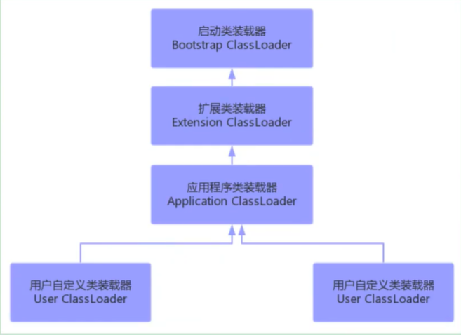 


### 双亲委派模型

每一个类都有一个对应它的类加载器。系统中的 ClassLoder 在协同工作的时候会默认使用 **双亲委派模型** 。即在类加载的时候，系统会首先判断当前类是否被加载过。已经被加载的类会直接返回，否则才会尝试加载。加载的时候，首先会把该请求委派该父类加载器的 `loadClass()` 处理，因此所有的请求最终都应该传送到顶层的启动类加载器 `BootstrapClassLoader` 中。当父类加载器无法处理时，才由自己来处理。当父类加载器为null时，会使用启动类加载器 `BootstrapClassLoader` 作为父类加载器。

[](https://camo.githubusercontent.com/daadd57b44169f84101f3e0c7bbf00f10b88c776ae70e260e08c8db90b9dfe86/68747470733a2f2f6d792d626c6f672d746f2d7573652e6f73732d636e2d6265696a696e672e616c6979756e63732e636f6d2f323031392d362f636c6173736c6f616465725f5750532545352539422542452545372538392538372e706e67)

每个类加载都有一个父类加载器，我们通过下面的程序来验证。

```java
public class ClassLoaderDemo {
    public static void main(String[] args) {
        System.out.println("ClassLodarDemo's ClassLoader is " + ClassLoaderDemo.class.getClassLoader());
        System.out.println("The Parent of ClassLodarDemo's ClassLoader is " + ClassLoaderDemo.class.getClassLoader().getParent());
        System.out.println("The GrandParent of ClassLodarDemo's ClassLoader is " + ClassLoaderDemo.class.getClassLoader().getParent().getParent());
    }
}
```

Output

```
ClassLodarDemo's ClassLoader is sun.misc.Launcher$AppClassLoader@18b4aac2
The Parent of ClassLodarDemo's ClassLoader is sun.misc.Launcher$ExtClassLoader@1b6d3586
The GrandParent of ClassLodarDemo's ClassLoader is null
```

`AppClassLoader`的父类加载器为`ExtClassLoader`， `ExtClassLoader`的父类加载器为null，**null并不代表`ExtClassLoader`没有父类加载器，而是 `BootstrapClassLoader`** 。


### 双亲委派模型实现源码分析

双亲委派模型的实现代码非常简单，逻辑非常清晰，都集中在 `java.lang.ClassLoader` 的 `loadClass()` 中，相关代码如下所示。

```java
private final ClassLoader parent; 
protected Class<?> loadClass(String name, boolean resolve)
        throws ClassNotFoundException
    {
        synchronized (getClassLoadingLock(name)) {
            // 首先，检查请求的类是否已经被加载过
            Class<?> c = findLoadedClass(name);
            if (c == null) {
                long t0 = System.nanoTime();
                try {
                    if (parent != null) {//父加载器不为空，调用父加载器loadClass()方法处理
                        c = parent.loadClass(name, false);
                    } else {//父加载器为空，使用启动类加载器 BootstrapClassLoader 加载
                        c = findBootstrapClassOrNull(name);
                    }
                } catch (ClassNotFoundException e) {
                   //抛出异常说明父类加载器无法完成加载请求
                }
                
                if (c == null) {
                    long t1 = System.nanoTime();
                    //自己尝试加载
                    c = findClass(name);

                    // this is the defining class loader; record the stats
                    sun.misc.PerfCounter.getParentDelegationTime().addTime(t1 - t0);
                    sun.misc.PerfCounter.getFindClassTime().addElapsedTimeFrom(t1);
                    sun.misc.PerfCounter.getFindClasses().increment();
                }
            }
            if (resolve) {
                resolveClass(c);
            }
            return c;
        }
    }
```

### 双亲委派模型的好处

双亲委派模型保证了Java程序的稳定运行，可以避免类的重复加载（JVM 区分不同类的方式不仅仅根据类名，相同的类文件被不同的类加载器加载产生的是两个不同的类），也保证了 Java 的核心 API 不被篡改。如果没有使用双亲委派模型，而是每个类加载器加载自己的话就会出现一些问题，比如我们编写一个称为 `java.lang.Object` 类的话，那么程序运行的时候，系统就会出现多个不同的 `Object` 类。

### 如果我们不想用双亲委派模型怎么办？

~~为了避免双亲委托机制，我们可以自己定义一个类加载器，然后重写 `loadClass()` 即可。~~

**🐛 修正（参见：[issue871](https://github.com/Snailclimb/JavaGuide/issues/871) ）** ：自定义加载器的话，需要继承 `ClassLoader` 。如果我们不想打破双亲委派模型，就重写 `ClassLoader` 类中的 `findClass()` 方法即可，无法被父类加载器加载的类最终会通过这个方法被加载。但是，如果想打破双亲委派模型则需要重写 `loadClass()` 方法


### ClassLoader 几个比较重要的方法如下：

抽象类ClassLoader的主要方法：（内部没有抽象方法）

返回该类加载器的超类加载器

```java
public final ClassLoader getParent()
```


加载名称为name的类，返回结果为java.lang.Class类的实例。如果找不到类，则返回 ClassNotFoundException异常。该方法中的逻辑就是双亲委派模式的实现

```java
public Class<?> loadClass(String name) throws ClassNotFoundException
```


查找二进制名称为name的类，返回结果为java.lang.Class类的实例。这是一个受保护的方法，JVM鼓励我们重写此方法，需要自定义加载器遵循双亲委托机制，该方法会在检查完父类加载器之后被loadClass()方法调用。

```java
protected Class<?> findClass(String name) throws ClassNotFoundException
```


根据给定的字节数组b转换为Class的实例，off和len参数表示实际Class信息在byte数组中的位置和长度，其中byte数组b是ClassLoader从外部获取的。这是受保护的方法，只有在自定义ClassLoader子类中可以使用。

```java
protected final Class<?> defineClass(String name, byte[] b,int off,int len)
```


-  在JDK1.2之前，在自定义类加载时，总会去继承ClassLoader类并重写loadClass方法，从而实现自定义的类加载类。但是在JDK1.2之后已不再建议用户去覆盖loadClass()方法，而是建议把自定义的类加载逻辑写在findClass()方法中，从前面的分析可知，findClass()方法是在loadClass()方法中被调用的，当loadClass()方法中父加载器加载失败后，则会调用自己的findClass()方法来完成类加载，这样就可以保证自定义的类加载器也符合双亲委托模式。 

-  需要注意的是ClassLoader类中并没有实现findClass()方法的具体代码逻辑，取而代之的是抛出ClassNotFoundException异常，同时应该知道的是findClass方法通常是和defineClass方法一起使用的。 

-  defineClass()方法是用来将byte字节流解析成JVM能够识别的Class对象（ClassLoader中已实现该方法逻辑），通过这个方法不仅能够通过class文件实例化class对象，也可以通过其他方式实例化class对象，如通过网络接收一个类的字节码，然后转换为byte字节流创建对应的Class对象。 


### 自定义类加载器

除了 `BootstrapClassLoader` 其他类加载器均由 Java 实现且全部继承自`java.lang.ClassLoader`。如果我们要自定义自己的类加载器，很明显需要继承 `ClassLoader`。

前面说过，ClassLoader是一个抽象类，很多方法是空的没有实现，比如findClass()、findResource()等。而URLClassLoader这个实现类为这些方法提供了具体的实现。并新增了URLClassPath类协助取得Class字节码流等功能。，这样就可以避免自己去编写findClass()方法及其获取字节码流的方式，使自定义类加载器编写更加简洁


## 引用类型


## 内存布局

## 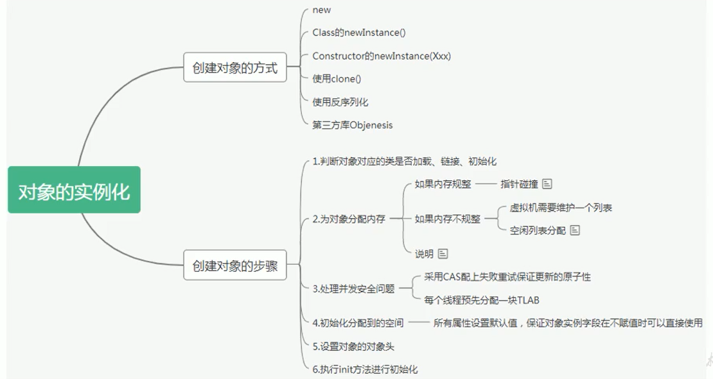 


 ### java 对象的内存布局


####  对象头（Header）

对象头包含了两部分，分别是运行时元数据（Mark Word）和类型指针。如果是数组，还需要记录数组的长度

运行时元数据

- 哈希值（HashCode）
- GC分代年龄
- 锁状态标志
- 线程持有的锁
- 偏向线程ID
- 翩向时间戳


#### 类型指针

指向类元数据InstanceKlass，确定该对象所属的类型。


####  实例数据（Instance Data）

它是对象真正存储的有效信息，包括程序代码中定义的各种类型的字段（包括从父类继承下来的和本身拥有的字段）

- 相同宽度的字段总是被分配在一起
- 父类中定义的变量会出现在子类之前
- 如果CompactFields参数为true（默认为true）：子类的窄变量可能插入到父类变量的空隙


#### 对齐填充（Padding）

不是必须的，也没有特别的含义，仅仅起到占位符的作用, jvm要求对象所占用的内存字节必须是8的倍数


**举例**

```
public class Customer{
    int id = 1001;
    String name;
    Account acct;

    {
        name = "匿名客户";
    }

    public Customer() {
        acct = new Account();
    }
}

public class CustomerTest{
    public static void main(string[] args){
        Customer cust=new Customer();
    }
}
```


**图示**


#### 小结


### 创建对象的几种方式

- new：最常见的方式、Xxx的静态方法，XxxBuilder/XxxFactory的静态方法
- Class的newInstance方法：反射的方式，只能调用空参的构造器，权限必须是public
- Constructor的newInstance(XXX)：反射的方式，可以调用空参、带参的构造器，权限没有要求
- 使用clone()：不调用任何的构造器，要求当前的类需要实现Cloneable接口，实现clone()
- 使用序列化：从文件中、从网络中获取一个对象的二进制流
- 第三方库 Objenesis


## JVM 内存模型

  

JVM 类加载器、运行时数据区、本地方法接口以及执行引擎四部分组成，其中运行时数据区由方法区、堆、虚拟机栈、程序计数器、本地方法栈等组成，详细的运行时数据区如下图：

  

我们根据上图来做一些比较重要的总结。

- 在jvm的运行时区域只有堆与方法区是线程共享的

- 每个线程都有自己独立的虚拟机栈、本地方法栈、程序计数器等

- JVM 中主要包含的后台线程有以下几个：

  - 虚拟机线程：这种线程的操作是需要JVM达到安全点才会出现。这些操作必须在不同的线程中发生的原因是他们都需要JVM达到安全点，这样堆才不会变化。这种线程的执行类型包括"stop-the-world"的垃圾收集，线程栈收集，线程挂起以及偏向锁撤销。

  - 周期任务线程：这种线程是时间周期事件的体现（比如中断），他们一般用于周期性操作的调度执行。

  - GC线程：这种线程对在JVM里不同种类的垃圾收集行为提供了支持。

  - 编译线程：这种线程在运行时会将字节码编译成到本地代码。

  - 信号调度线程：这种线程接收信号并发送给JVM，在它内部通过调用适当的方法进行处理。

  

### 虚拟机栈

每一个java线程都对应一个虚拟机栈，虚拟机栈中保存着一个个栈帧，每一个方法其实就是一个栈帧，方法的进入和出去就对应栈帧的压入和压出，如下图 

 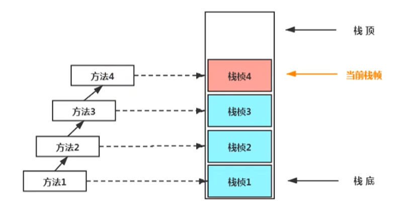 


每个栈帧中都包含以下一些基本的东西：

- 局部变量表（Local Variables）：局部变量表主要用来保存一些方法中定义的基本类型常量值以及引用类型变量值
- 操作数栈（operand Stack）（或表达式栈）
- 动态链接（DynamicLinking）（或指向运行时常量池的方法引用）
- 方法返回地址（Return Address）（或方法正常退出或者异常退出的定义）
- 一些附加信息

并行每个线程下的栈都是私有的，因此每个线程都有自己各自的栈，并且每个栈里面都有很多栈帧，栈帧的大小主要由局部变量表 和 操作数栈决定的

  


### 堆

在JVM 中堆主要有年轻代与老年代组成，而年轻代则由Eden、from、to区组成。其中年轻代与老年代的默认内存比例为1：2，而在年轻代中eden与 s0,s1的比例为 8：1：1，年轻代主要存放新生成的对象，而老年则存放一直存活的对象

 


一个对象的分配过程如下：

- new的对象先放伊甸园区。此区有大小限制。 
-  当伊甸园的空间填满时，程序又需要创建对象，JVM的垃圾回收器将对伊甸园区进行垃圾回收（MinorGC），将伊甸园区中的不再被其他对象所引用的对象进行销毁。再加载新的对象放到伊甸园区 
- 然后将伊甸园中的剩余对象移动到幸存者0区。 
-  如果再次触发垃圾回收，此时上次幸存下来的放到幸存者0区的，如果没有回收，就会放到幸存者1区。 
-  如果再次经历垃圾回收，此时会重新放回幸存者0区，接着再去幸存者1区。 
-  啥时候能去养老区呢？可以设置次数。默认是15次。 
- 在养老区，相对悠闲。当养老区内存不足时，再次触发GC：Major GC，进行养老区的内存清理 
- 若养老区执行了Major GC之后，发现依然无法进行对象的保存，就会产生OOM异常。  

  


### GC 类型

GC按照回收区域又分为两大种类型：一种是部分收集（Partial GC），一种是整堆收集（FullGC）

- 部分收集：不是完整收集整个Java堆的垃圾收集。其中又分为： 

  - 新生代收集（Minor GC / Young GC）：只是新生代的垃圾收集
  - 老年代收集（Major GC / Old GC）：只是老年代的圾收集。 
    - 目前，只有CMSGC会有单独收集老年代的行为。
    - 注意，很多时候Major GC会和Full GC混淆使用，需要具体分辨是老年代回收还是整堆回收。
  - 混合收集（MixedGC）：收集整个新生代以及部分老年代的垃圾收集。 
    - 目前，只有G1 GC会有这种行为

- 整堆收集（Full GC）：收集整个java堆和方法区的垃圾收集。


### GC 触发策略

#### 年轻代GC（Minor GC）触发机制

-  当年轻代空间不足时，就会触发MinorGC，这里的年轻代满指的是Eden代满，Survivor满不会引发GC。（每次Minor GC会清理年轻代的内存。） 
-  因为Java对象大多都具备朝生夕灭的特性.，所以Minor GC非常频繁，一般回收速度也比较快。这一定义既清晰又易于理解。 
-  Minor GC会引发STW，暂停其它用户的线程，等垃圾回收结束，用户线程才恢复运行 


#### 老年代GC（Major GC / Full GC）触发机制

-  指发生在老年代的GC，对象从老年代消失时，我们说 “Major GC” 或 “Full GC” 发生了 
-  出现了Major Gc，经常会伴随至少一次的Minor GC（但非绝对的，在Paralle1 Scavenge收集器的收集策略里就有直接进行MajorGC的策略选择过程） 
- 也就是在老年代空间不足时，会先尝试触发Minor Gc。如果之后空间还不足，则触发Major GC
-  Major GC的速度一般会比Minor GC慢10倍以上，STW的时间更长 
-  如果Major GC后，内存还不足，就报OOM了 


#### Full GC触发机制（后面细讲）：

触发Full GC执行的情况有如下五种：

- 调用System.gc()时，系统建议执行Full GC，但是不必然执行
- 老年代空间不足
- 方法区空间不足
- 通过Minor GC后进入老年代的平均大小大于老年代的可用内存
- 由Eden区、survivor space0（From Space）区向survivor space1（To Space）区复制时，对象大小大于To Space可用内存，则把该对象转存到老年代，且老年代的可用内存小于该对象大小

> 说明：Full GC 是开发或调优中尽量要避免的。这样暂时时间会短一些


### 内存分配策略

对象晋升老年代的年龄阀值，可以通过选项`-XX:MaxTenuringThreshold`来设置

针对不同年龄段的对象分配原则如下所示：

- 优先分配到Eden
- 大对象直接分配到老年代（尽量避免程序中出现过多的大对象）
- 长期存活的对象分配到老年代
- 动态对象年龄判断：如果survivor区中相同年龄的所有对象大小的总和大于Survivor空间的一半，年龄大于或等于该年龄的对象可以直接进入老年代，无须等到`MaxTenuringThreshold`中要求的年龄。
- 空间分配担保： `-XX:HandlePromotionFailure`


### TLAB

#### 为什么有TLAB

-  堆区是线程共享区域，任何线程都可以访问到堆区中的共享数据 
-  由于对象实例的创建在JVM中非常频繁，因此在并发环境下从堆区中划分内存空间是线程不安全的 
-  为避免多个线程操作同一地址，需要使用加锁等机制，进而影响分配速度。 


#### 什么是TLAB？

-  从内存模型而不是垃圾收集的角度，对Eden区域继续进行划分，JVM为每个线程分配了一个私有缓存区域，它包含在Eden空间内。 
- 多线程同时分配内存时，使用TLAB可以避免一系列的非线程安全问题，同时还能够提升内存分配的吞吐量，因此我们可以将这种内存分配方式称之为快速分配策略。 
- 据我所知所有OpenJDK衍生出来的JVM都提供了TLAB的设计。 

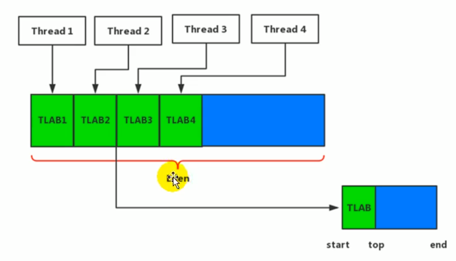


#### TLAB的再说明

-  尽管不是所有的对象实例都能够在TLAB中成功分配内存，但JVM确实是将TLAB作为内存分配的首选。 
- 在程序中，开发人员可以通过选项“`-XX:UseTLAB`”设置是否开启TLAB空间。 
-  默认情况下，TLAB空间的内存非常小，仅占有整个Eden空间的1%，当然我们可以通过选项 “`-XX:TLABWasteTargetPercent`” 设置TLAB空间所占用Eden空间的百分比大小。 
-  一旦对象在TLAB空间分配内存失败时，JVM就会尝试着通过使用加锁机制确保数据操作的原子性，从而直接在Eden空间中分配内存。 


## StringTable

### String的基本特性

- String：字符串，使用一对""引起来表示

- String声明为final的，不可被继承

- String实现了Serializable接口：表示字符串是支持序列化的。

- String实现了Comparable接口：表示string可以比较大小

- String在jdk8及以前内部定义了final char[] value用于存储字符串数据。JDK9时改为byte[]


在JDK 8及之前的版本中是采用 char 数组来保存字符串的内容，并且由于内部是使用final修饰的char  数据 所以保证了字符串的不可变性，而在jdk9中则是采用了 byte 数组来保存字符串，指在减少使用的空间，因为在原本的基础之上有很多字符默认是可以用一个字符也就是8个字节来存储，而char 的话则每个占用了2个字符既 16个字节

```java
public final class String implements java.io.Serializable, Comparable<String>, CharSequence {
    @Stable
    private final byte[] value;
}
```

String：代表不可变的字符序列。简称：不可变性。

- 当对字符串重新赋值时，需要重写指定内存区域赋值，不能使用原有的value进行赋值。

- 当对现有的字符串进行连接操作时，也需要重新指定内存区域赋值，不能使用原有的value进行赋值。

- 当调用string的replace()方法修改指定字符或字符串时，也需要重新指定内存区域赋值，不能使用原有的value进行赋值。


通过字面量的方式（区别于new）给一个字符串赋值，此时的字符串值声明在字符串常量池中。

字符串常量池是不会存储相同内容的字符串的

String的String Pool是一个固定大小的Hashtable，默认值大小长度是1009。如果放进String Pool的String非常多，就会造成Hash冲突严重，从而导致链表会很长，而链表长了后直接会造成的影响就是当调用String.intern时性能会大幅下降。

使用`-XX:StringTablesize`可设置StringTable的长度

-  在jdk6中StringTable是固定的，就是1009的长度，所以如果常量池中的字符串过多就会导致效率下降很快。StringTablesize设置没有要求 

-  在jdk7中，StringTable的长度默认值是60013，StringTablesize设置没有要求 

-  在JDK8中，设置StringTable长度的话，1009是可以设置的最小值 


### String的内存分配

字符串常量池就类似一个Java系统级别提供的缓存。8种基本数据类型的常量池都是系统协调的，String类型的常量池比较特殊。它的主要使用方法有两种。

-  直接使用双引号声明出来的String对象会直接存储在常量池中。 

-  如果不是用双引号声明的String对象，可以使用String提供的intern()方法。


Java 6及以前，字符串常量池存放在永久代

Java 7中 Oracle的工程师对字符串池的逻辑做了很大的改变，即将字符串常量池的位置调整到Java堆内

-  所有的字符串都保存在堆（Heap）中，和其他普通对象一样，这样可以让你在进行调优应用时仅需要调整堆大小就可以了。 

-  字符串常量池概念原本使用得比较多，但是这个改动使得我们有足够的理由让我们重新考虑在Java 7中使用`String.intern()`。 


Java8元空间，字符串常量在堆

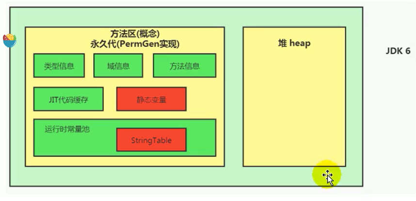

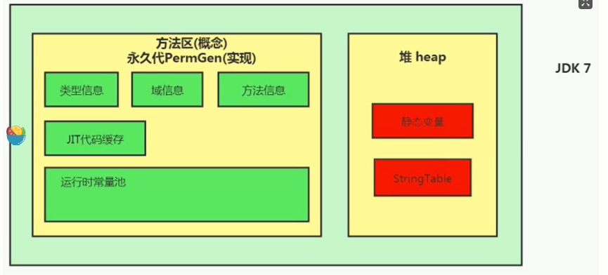


### String的基本操作

```java
@Test
public void test1() {
    System.out.print1n("1"); //2321
    System.out.println("2");
    System.out.println("3");
    System.out.println("4");
    System.out.println("5");
    System.out.println("6");
    System.out.println("7");
    System.out.println("8");
    System.out.println("9");
    System.out.println("10"); //2330
    System.out.println("1"); //2321
    System.out.println("2"); //2322
    System.out.println("3");
    System.out.println("4");
    System.out.println("5");
    System.out.print1n("6");
    System.out.print1n("7");
    System.out.println("8");
    System.out.println("9");
    System.out.println("10");//2330
}
```


```java
class Memory {
    public static void main(String[] args) {//line 1
        int i= 1;//line 2
        Object obj = new Object();//line 3
        Memory mem = new Memory();//Line 4
        mem.foo(obj);//Line 5
    }//Line 9
    private void foo(Object param) {//line 6
        String str = param.toString();//line 7
        System.out.println(str);
    }//Line 8
}
```

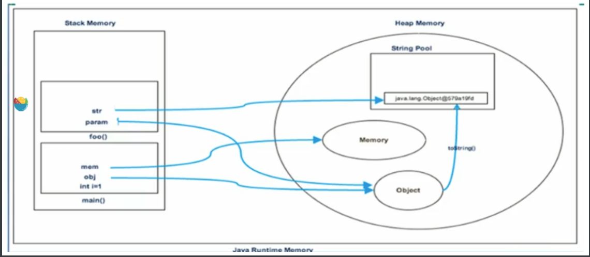


### 字符串拼接操作

- 常量与常量的拼接结果在常量池，原理是编译期优化

- 常量池中不会存在相同内容的变量

- 只要其中有一个是变量，结果就在堆中。变量拼接的原理是StringBuilder

- 如果拼接的结果调用intern()方法，则主动将常量池中还没有的字符串对象放入池中，并返回此对象地址


**举例1**

```java
  public static void test1() {
      // 都是常量，前端编译期会进行代码优化
      // 通过idea直接看对应的反编译的class文件，会显示 String s1 = "abc"; 说明做了代码优化
      String s1 = "a" + "b" + "c";  
      String s2 = "abc"; 
  
      // true，有上述可知，s1和s2实际上指向字符串常量池中的同一个值
      System.out.println(s1 == s2); 
  }
```


**举例2**

```java
public static void test5() {
    String s1 = "javaEE";
    String s2 = "hadoop";

    String s3 = "javaEEhadoop";
    String s4 = "javaEE" + "hadoop";    
    String s5 = s1 + "hadoop";
    String s6 = "javaEE" + s2;
    String s7 = s1 + s2;

    System.out.println(s3 == s4); // true 编译期优化
    System.out.println(s3 == s5); // false s1是变量，不能编译期优化
    System.out.println(s3 == s6); // false s2是变量，不能编译期优化
    System.out.println(s3 == s7); // false s1、s2都是变量
    System.out.println(s5 == s6); // false s5、s6 不同的对象实例
    System.out.println(s5 == s7); // false s5、s7 不同的对象实例
    System.out.println(s6 == s7); // false s6、s7 不同的对象实例

    String s8 = s6.intern();
    System.out.println(s3 == s8); // true intern之后，s8和s3一样，指向字符串常量池中的"javaEEhadoop"
}
```


**举例3**

```java
public void test6(){
    String s0 = "beijing";
    String s1 = "bei";
    String s2 = "jing";
    String s3 = s1 + s2;
    System.out.println(s0 == s3); // false s3指向对象实例，s0指向字符串常量池中的"beijing"
    String s7 = "shanxi";
    final String s4 = "shan";
    final String s5 = "xi";
    String s6 = s4 + s5;
    System.out.println(s6 == s7); // true s4和s5是final修饰的，编译期就能确定s6的值了
}
```

- 不使用final修饰，即为变量。如s3行的s1和s2，会通过new StringBuilder进行拼接

- 使用final修饰，即为常量。会在编译器进行代码优化。在实际开发中，能够使用final的，尽量使用


**举例4**

```java
public void test3(){
    String s1 = "a";
    String s2 = "b";
    String s3 = "ab";
    String s4 = s1 + s2;
    System.out.println(s3==s4);
}
```


**字节码**

我们拿例4的字节码进行查看，可以发现`s1 + s2`实际上是new了一个StringBuilder对象，并使用了append方法将s1和s2添加进来，最后调用了toString方法赋给s4

```shell
 0 ldc #2 <a>
 2 astore_1
 3 ldc #3 <b>
 5 astore_2
 6 ldc #4 <ab>
 8 astore_3
 9 new #5 <java/lang/StringBuilder>
12 dup
13 invokespecial #6 <java/lang/StringBuilder.<init>>
16 aload_1
17 invokevirtual #7 <java/lang/StringBuilder.append>
20 aload_2
21 invokevirtual #7 <java/lang/StringBuilder.append>
24 invokevirtual #8 <java/lang/StringBuilder.toString>
27 astore 4
29 getstatic #9 <java/lang/System.out>
32 aload_3
33 aload 4
35 if_acmpne 42 (+7)
38 iconst_1
39 goto 43 (+4)
42 iconst_0
43 invokevirtual #10 <java/io/PrintStream.println>
46 return
```


**字符串拼接操作性能对比**

```java
public class Test
{
    public static void main(String[] args) {
        int times = 50000;

        // String
        long start = System.currentTimeMillis();
        testString(times);
        long end = System.currentTimeMillis();
        System.out.println("String: " + (end-start) + "ms");

        // StringBuilder
        start = System.currentTimeMillis();
        testStringBuilder(times);
        end = System.currentTimeMillis();
        System.out.println("StringBuilder: " + (end-start) + "ms");

        // StringBuffer
        start = System.currentTimeMillis();
        testStringBuffer(times);
        end = System.currentTimeMillis();
        System.out.println("StringBuffer: " + (end-start) + "ms");
    }

    public static void testString(int times) {
        String str = "";
        for (int i = 0; i < times; i++) {
            str += "test";
        }
    }

    public static void testStringBuilder(int times) {
        StringBuilder sb = new StringBuilder();
        for (int i = 0; i < times; i++) {
            sb.append("test");
        }
    }

    public static void testStringBuffer(int times) {
        StringBuffer sb = new StringBuffer();
        for (int i = 0; i < times; i++) {
            sb.append("test");
        }
    }
}

// 结果
String: 7963ms
StringBuilder: 1ms
StringBuffer: 4ms
```


本实验进行5万次循环，String拼接方式的时间是StringBuilder.append方式的约8000倍，StringBuffer.append()方式的时间是StringBuilder.append()方式的约4倍

可以看到，通过StringBuilder的append方式的速度，要比直接对String使用“+”拼接的方式快的不是一点半点

那么，在实际开发中，对于需要多次或大量拼接的操作，在不考虑线程安全问题时，我们就应该尽可能使用StringBuilder进行append操作

除此之外，还有那些操作能够帮助我们提高字符串方面的运行效率呢？


StringBuilder空参构造器的初始化大小为16。那么，如果提前知道需要拼接String的个数，就应该直接使用带参构造器指定capacity，以减少扩容的次数（扩容的逻辑可以自行查看源代码）

```java
/**
 * Constructs a string builder with no characters in it and an
 * initial capacity of 16 characters.
 */
public StringBuilder() {
    super(16);
}

/**
 * Constructs a string builder with no characters in it and an
 * initial capacity specified by the {@code capacity} argument.
 *
 * @param      capacity  the initial capacity.
 * @throws     NegativeArraySizeException  if the {@code capacity}
 *               argument is less than {@code 0}.
 */
public StringBuilder(int capacity) {
    super(capacity);
}
```


### intern()的使用 

当调用intern方法时，如果池子里已经包含了一个与这个String对象相等的字符串，正如equals(Object)方法所确定的，那么池子里的字符串会被返回。否则，这个String对象被添加到池中，并返回这个String对象的引用。

由此可见，对于任何两个字符串s和t，当且仅当s.equals(t)为真时，s.intern() == t.intern()为真。

所有字面字符串和以字符串为值的常量表达式都是interned。

返回一个与此字符串内容相同的字符串，但保证是来自一个唯一的字符串池。

------

intern是一个native方法，调用的是底层C的方法

```java
public native String intern();
```

如果不是用双引号声明的String对象，可以使用String提供的intern方法，它会从字符串常量池中查询当前字符串是否存在，若不存在就会将当前字符串放入常量池中。

```java
String myInfo = new string("I love atguigu").intern();
```

也就是说，如果在任意字符串上调用String.intern方法，那么其返回结果所指向的那个类实例，必须和直接以常量形式出现的字符串实例完全相同。因此，下列表达式的值必定是true

```java
("a"+"b"+"c").intern() == "abc"
```

通俗点讲，Interned string就是确保字符串在内存里只有一份拷贝，这样可以节约内存空间，加快字符串操作任务的执行速度。注意，这个值会被存放在字符串内部池（String Intern Pool）

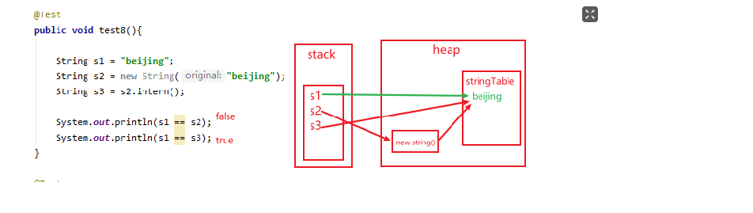


####  intern的使用：JDK6 vs JDK7/8

```java
/**
 * ① String s = new String("1")
 * 创建了两个对象
 * 		堆空间中一个new对象
 * 		字符串常量池中一个字符串常量"1"（注意：此时字符串常量池中已有"1"）
 * ② s.intern()由于字符串常量池中已存在"1"
 * 
 * s  指向的是堆空间中的对象地址
 * s2 指向的是堆空间中常量池中"1"的地址
 * 所以不相等
 */
String s = new String("1");
s.intern();
String s2 = "1";
System.out.println(s==s2); // jdk1.6 false jdk7/8 false

/*
 * ① String s3 = new String("1") + new String("1")
 * 等价于new String（"11"），但是，常量池中并不生成字符串"11"；
 *
 * ② s3.intern()
 * 由于此时常量池中并无"11"，所以把s3中记录的对象的地址存入常量池
 * 所以s3 和 s4 指向的都是一个地址
*/
String s3 = new String("1") + new String("1");
s3.intern();
String s4 = "11";
System.out.println(s3==s4); //jdk1.6 false jdk7/8 true
```

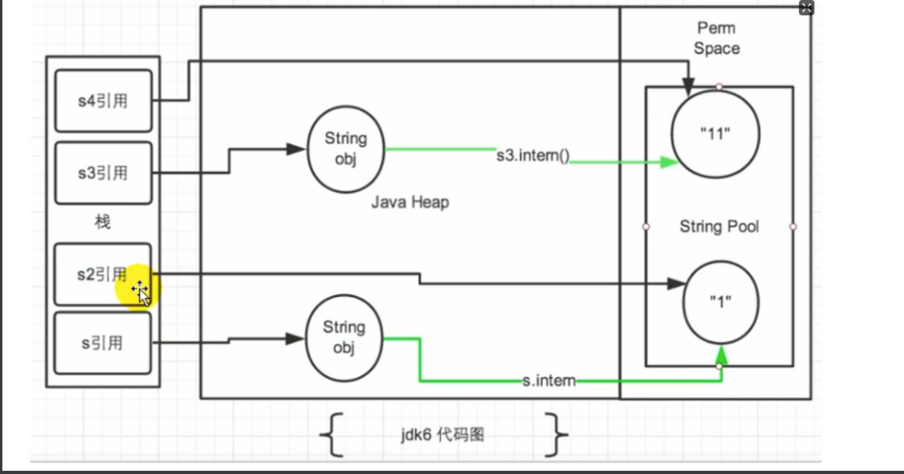

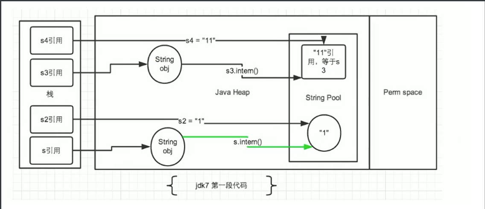

总结String的intern()的使用：

JDK1.6中，将这个字符串对象尝试放入串池。

- 如果串池中有，则并不会放入。返回已有的串池中的对象的地址

- 如果没有，会把此对象复制一份，放入串池，并返回串池中的对象地址


JDK1.7起，将这个字符串对象尝试放入串池。

- 如果串池中有，则并不会放入。返回已有的串池中的对象的地址

- 如果没有，则会把对象的引用地址复制一份，放入串池，并返回串池中的引用地址


#### intern的效率测试：空间角度

我们通过测试一下，使用了intern和不使用的时候，其实相差还挺多的

```java
public class StringIntern2 {
    static final int MAX_COUNT = 1000 * 10000;
    static final String[] arr = new String[MAX_COUNT];

    public static void main(String[] args) {
        Integer [] data = new Integer[]{1,2,3,4,5,6,7,8,9,10};
        long start = System.currentTimeMillis();
        for (int i = 0; i < MAX_COUNT; i++) {
            // arr[i] = new String(String.valueOf(data[i%data.length]));
            arr[i] = new String(String.valueOf(data[i%data.length])).intern();
        }
        long end = System.currentTimeMillis();
        System.out.println("花费的时间为：" + (end - start));

        try {
            Thread.sleep(1000000);
        } catch (Exception e) {
            e.getStackTrace();
        }
    }
}

// 运行结果
不使用intern：7256ms
使用intern：1395ms
```


**结论**：对于程序中大量使用存在的字符串时，尤其存在很多已经重复的字符串时，使用intern()方法能够节省内存空间。

大的网站平台，需要内存中存储大量的字符串。比如社交网站，很多人都存储：北京市、海淀区等信息。这时候如果字符串都调用intern()方法，就会很明显降低内存的大小。


### String 待研究

```java
  public static void main(String[] args) throws InterruptedException {
        String  a = new String("1") + new String("1");
        a.intern();
        String  b = "12";

        System.out.println( a == b);
        WeakReference<Object> reference = new WeakReference<>(a);
        WeakReference<Object> referenceB = new WeakReference<>(b);
        
        a = null;
        b = null;

        System.gc();
        TimeUnit.SECONDS.sleep(1);

        System.out.println(reference.get());
        System.out.println(referenceB.get());

    }
```


### StringTable的垃圾回收

我们通过下面的案例来看一下：

```java
public class StringGCTest {
    /**
     * -Xms15m -Xmx15m -XX:+PrintGCDetails
     */
    public static void main(String[] args) {
        
        for (int i = 0; i < 100000; i++) {
            String.valueOf(i).intern();
        }
    }
}
```


我们可以看到StringTable确实被存放在了堆中，运行结果如下：

```java
[GC (Allocation Failure) [PSYoungGen: 4096K->504K(4608K)] 4096K->1689K(15872K), 0.0581583 secs] [Times: user=0.00 sys=0.00, real=0.06 secs] 
[GC (Allocation Failure) [PSYoungGen: 4600K->504K(4608K)] 5785K->2310K(15872K), 0.0015621 secs] [Times: user=0.00 sys=0.00, real=0.00 secs] 
[GC (Allocation Failure) [PSYoungGen: 4600K->504K(4608K)] 6406K->2350K(15872K), 0.0034849 secs] [Times: user=0.00 sys=0.00, real=0.00 secs] 
Heap
 PSYoungGen      total 4608K, used 1919K [0x00000000ffb00000, 0x0000000100000000, 0x0000000100000000)
  eden space 4096K, 34% used [0x00000000ffb00000,0x00000000ffc61d30,0x00000000fff00000)
  from space 512K, 98% used [0x00000000fff00000,0x00000000fff7e010,0x00000000fff80000)
  to   space 512K, 0% used [0x00000000fff80000,0x00000000fff80000,0x0000000100000000)
 ParOldGen       total 11264K, used 1846K [0x00000000ff000000, 0x00000000ffb00000, 0x00000000ffb00000)
  object space 11264K, 16% used [0x00000000ff000000,0x00000000ff1cd9b0,0x00000000ffb00000)
 Metaspace       used 3378K, capacity 4496K, committed 4864K, reserved 1056768K
  class space    used 361K, capacity 388K, committed 512K, reserved 1048576K
```


### G1中的String去重操作

目前，许多大规模的Java应用程序在内存上遇到了瓶颈。测量表明，在这些类型的应用程序中，大约25%的Java堆实时数据集被`String'对象所消耗。此外，这些 "String "对象中大约有一半是重复的，其中重复意味着 "string1.equals(string2) "是真的。在堆上有重复的`String'对象，从本质上讲，只是一种内存的浪费。这个项目将在G1垃圾收集器中实现自动和持续的`String'重复数据删除，以避免浪费内存，减少内存占用。

------

注意这里说的重复，指的是在堆中的数据，而不是常量池中的，因为常量池中的本身就不会重复

背景：对许多Java应用（有大的也有小的）做的测试得出以下结果：

- 堆存活数据集合里面string对象占了25%

- 堆存活数据集合里面重复的string对象有13.5%

- string对象的平均长度是45


许多大规模的Java应用的瓶颈在于内存，测试表明，在这些类型的应用里面，Java堆中存活的数据集合差不多25%是String对象。更进一步，这里面差不多一半string对象是重复的，重复的意思是说： `stringl.equals(string2)= true`。堆上存在重复的String对象必然是一种内存的浪费。这个项目将在G1垃圾收集器中实现自动持续对重复的string对象进行去重，这样就能避免浪费内存。


**实现**

1、当垃圾收集器工作的时候，会访问堆上存活的对象。对每一个访问的对象都会检查是否是候选的要去重的String对象

2、如果是，把这个对象的一个引用插入到队列中等待后续的处理。一个去重的线程在后台运行，处理这个队列。处理队列的一个元素意味着从队列删除这个元素，然后尝试去重它引用的string对象。

3、使用一个hashtable来记录所有的被String对象使用的不重复的char数组。当去重的时候，会查这个hashtable，来看堆上是否已经存在一个一模一样的char数组。

4、如果存在，String对象会被调整引用那个数组，释放对原来的数组的引用，最终会被垃圾收集器回收掉。

5、如果查找失败，char数组会被插入到hashtable，这样以后的时候就可以共享这个数组了。


**命令行选项**

```
# 开启String去重，默认是不开启的，需要手动开启。 
UseStringDeduplication(bool)  
# 打印详细的去重统计信息 
PrintStringDeduplicationStatistics(bool)  
# 达到这个年龄的String对象被认为是去重的候选对象
StringpeDuplicationAgeThreshold(uintx)
```


## 常量池 

java中的常量池主要分为 class 文件常量池，运行时常量池以及 字符串常量池 ，在了解常量池之前我们先了解下jvm 的方法区


### 方法区

方法区主要用于存储已被虚拟机加载的类型信息、常量、静态变量、即时编译器编译后的代码缓存等。


#### 类型信息

对每个加载的类型（类class、接口interface、枚举enum、注解annotation），JVM必须在方法区中存储以下类型信息：

1. 这个类型的完整有效名称（全名=包名.类名）

1. 这个类型直接父类的完整有效名（对于interface或是java.lang.object，都没有父类）

1. 这个类型的修饰符（public，abstract，final的某个子集）

1. 这个类型直接接口的一个有序列表


#### 域（Field）信息

JVM必须在方法区中保存类型的所有域的相关信息以及域的声明顺序。

域的相关信息包括：域名称、域类型、域修饰符（public，private，protected，static，final，volatile，transient的某个子集）


#### 方法（Method）信息

JVM必须保存所有方法的以下信息，同域信息一样包括声明顺序：

1、方法名称

2、方法的返回类型（或void）

3、方法参数的数量和类型（按顺序）

4、方法的修饰符（public，private，protected，static，final，synchronized，native，abstract的一个子集）

5、方法的字节码（bytecodes）、操作数栈、局部变量表及大小（abstract和native方法除外）

6、异常表（abstract和native方法除外） 

- - 每个异常处理的开始位置、结束位置、代码处理在程序计数器中的偏移地址、被捕获的异常类的常量池索引


#### non-final的类变量

- 静态变量和类关联在一起，随着类的加载而加载，他们成为类数据在逻辑上的一部分

- 类变量被类的所有实例共享，即使没有类实例时，你也可以访问它

```java
public class MethodAreaTest {
    public static void main(String[] args) {
        Order order = new Order();
        order.hello();
        System.out.println(order.count);
    }
}
class Order {
    public static int count = 1;
    public static void hello() {
        System.out.println("hello!");
    }
}
```


#### 补充说明：全局常量（static final）

被声明为final的类变量的处理方法则不同，每个全局常量在编译的时候就会被分配了。


### 运行时常量池 VS 常量池

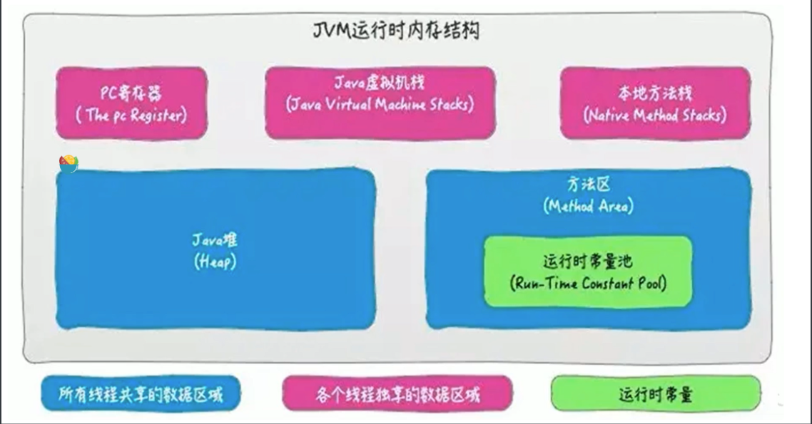

- 方法区，内部包含了运行时常量池

- 字节码文件，内部包含了常量池

- 要弄清楚方法区，需要理解清楚ClassFile，因为加载类的信息都在方法区。

- 要弄清楚方法区的运行时常量池，需要理解清楚ClassFile中的常量池。

官方文档：https://docs.oracle.com/javase/specs/jvms/se8/html/jvms-4.html

一个java源文件中的类、接口，编译后产生一个字节码文件。而Java中的字节码需要数据支持，通常这种数据会很大以至于不能直接存到字节码里，换另一种方式，可以存到常量池，这个字节码包含了指向常量池的引用。在动态链接的时候会用到运行时常量池


#### 常量池中有什么?

击中常量池内存储的数据类型包括：

- 数量值

- 字符串值

- 类引用

- 字段引用

- 方法引用


例如下面这段代码：

```java
public class MethodAreaTest2 {
    public static void main(String args[]) {
        Object obj = new Object();
    }
}
```

`Object obj = new Object();`将会被翻译成如下字节码：

```java
0: new #2  // Class java/lang/Object
1: dup
2: invokespecial // Method java/lang/Object "<init>"() V
```


#### 小结

常量池、可以看做是一张表，虚拟机指令根据这张常量表找到要执行的类名、方法名、参数类型、字面量等类型


### 运行时常量池

- 运行时常量池（Runtime Constant Pool）是方法区的一部分。

- 常量池表（Constant Pool Table）是Class文件的一部分，用于存放编译期生成的各种字面量与符号引用，这部分内容将在类加载后存放到方法区的运行时常量池中。

- 运行时常量池，在加载类和接口到虚拟机后，就会创建对应的运行时常量池。

- JVM为每个已加载的类型（类或接口）都维护一个常量池。池中的数据项像数组项一样，是通过索引访问的。

- 运行时常量池中包含多种不同的常量，包括编译期就已经明确的数值字面量，也包括到运行期解析后才能够获得的方法或者字段引用。此时不再是常量池中的符号地址了，这里换为真实地址。

- 运行时常量池，相对于Class文件常量池的另一重要特征是：具备动态性。

- 运行时常量池类似于传统编程语言中的符号表（symboltable），但是它所包含的数据却比符号表要更加丰富一些。

- 当创建类或接口的运行时常量池时，如果构造运行时常量池所需的内存空间超过了方法区所能提供的最大值，则JVM会抛OutOfMemoryError异常。


### 

### 方法区的垃圾回收

有些人认为方法区（如Hotspot虚拟机中的元空间或者永久代）是没有垃圾收集行为的，其实不然。《Java虚拟机规范》对方法区的约束是非常宽松的，提到过可以不要求虚拟机在方法区中实现垃圾收集。事实上也确实有未实现或未能完整实现方法区类型卸载的收集器存在（如JDK11时期的zGC收集器就不支持类卸载）。

一般来说这个区域的回收效果比较难令人满意，尤其是类型的卸载，条件相当苛刻。但是这部分区域的回收有时又确实是必要的。以前sun公司的Bug列表中，曾出现过的若干个严重的Bug就是由于低版本的HotSpot虚拟机对此区域未完全回收而导致内存泄漏。

方法区的垃圾收集主要回收两部分内容：常量池中废弃的常量和不再使用的类型。

先来说说方法区内常量池之中主要存放的两大类常量：字面量和符号引用。字面量比较接近Java语言层次的常量概念，如文本字符串、被声明为final的常量值等。而符号引用则属于编译原理方面的概念，包括下面三类常量：

- 类和接口的全限定名

- 字段的名称和描述符

- 方法的名称和描述符


HotSpot虚拟机对常量池的回收策略是很明确的，只要常量池中的常量没有被任何地方引用，就可以被回收。

回收废弃常量与回收Java堆中的对象非常类似。

判定一个常量是否“废弃”还是相对简单，而要判定一个类型是否属于“不再被使用的类”的条件就比较苛刻了。需要同时满足下面三个条件：

-  该类所有的实例都已经被回收，也就是Java堆中不存在该类及其任何派生子类的实例。 

-  加载该类的类加载器已经被回收，这个条件除非是经过精心设计的可替换类加载器的场景，如OSGi、JSP的重加载等，否则通常是很难达成的。 

-  该类对应的java.lang.Class对象没有在任何地方被引用，无法在任何地方通过反射访问该类的方法。 


Java虚拟机被允许对满足上述三个条件的无用类进行回收，这里说的仅仅是“被允许”，而并不是和对象一样，没有引用了就必然会回收。关于是否要对类型进行回收，HotSpot虚拟机提供了`-Xnoclassgc`参数进行控制，还可以使用`-verbose:class` 以及 `-XX:+TraceClassLoading`、`-XX:+TraceClassUnLoading`查看类加载和卸载信息

在大量使用反射、动态代理、CGLib等字节码框架，动态生成JSP以及OSGi这类频繁自定义类加载器的场景中，通常都需要Java虚拟机具备类型卸载的能力，以保证不会对方法区造成过大的内存压力。


### 常量池

介绍完方法区 我们来详细说一下java中的常量池，上面已经提到过，在java中常量池主要分为三大类，分别为Class 文件常量池、运行时常量池与 字符串常量池这三大类

我们首先来看一下jvm 的整个运行时数据区，如下图：

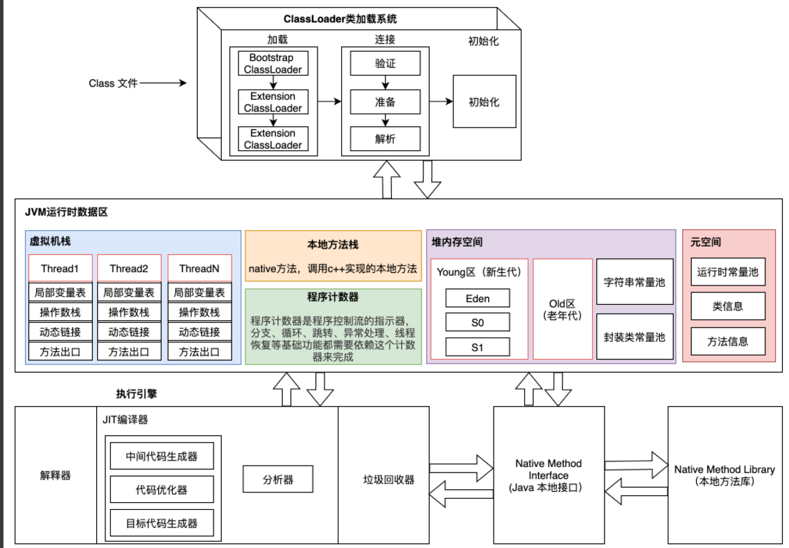

在上图中，我们需要重点关注几个类容：

1. 字符串常量池
2. 封装类常量池
3. 运行时常量池
4. JIT编译器


#### Class 文件常量池

每个`Class`文件的字节码中都有一个常量池，里面主要存放编译器生成的各种字面量和符号引用。为了更直观的理解，我们编写下面这个程序。

```java
public class StringExample {
    private int value = 1;
    public final static int fs=101;

    public static void main(String[] args) {
        String a="ab";
        String b="a"+"b";
        String c=a+b;
    }
}
```

上述程序编译后，通过`javap -v StringExample.class`查看该类的字节码文件，截取部分内容如下。

```java
Constant pool:
   #1 = Methodref          #9.#32         // java/lang/Object."<init>":()V
   #2 = Fieldref           #8.#33         // org/example/cl07/StringExample.value:I
   #3 = String             #34            // ab
   #4 = Class              #35            // java/lang/StringBuilder
   #5 = Methodref          #4.#32         // java/lang/StringBuilder."<init>":()V
   #6 = Methodref          #4.#36         // java/lang/StringBuilder.append:(Ljava/lang/String;)Ljava/lang/StrvalueingBuilder;
   #7 = Methodref          #4.#37         // java/lang/StringBuilder.toString:()Ljava/lang/String;
   #8 = Class              #38            // org/example/cl07/StringExample
   #9 = Class              #39            // java/lang/Object
  #10 = Utf8               value
  #11 = Utf8               I
  #12 = Utf8               fs
  #13 = Utf8               ConstantValue
  #14 = Integer            101
  #15 = Utf8               <init>
  #16 = Utf8               ()V
  #17 = Utf8               Code
  #18 = Utf8               LineNumberTable
  #19 = Utf8               LocalVariableTable
  #20 = Utf8               this
  #21 = Utf8               Lorg/example/cl07/StringExample;
  #22 = Utf8               main
  #23 = Utf8               ([Ljava/lang/String;)V
  #24 = Utf8               args
  #25 = Utf8               [Ljava/lang/String;
  #26 = Utf8               a
  #27 = Utf8               Ljava/lang/String;
  #28 = Utf8               b
  #29 = Utf8               c
  #30 = Utf8               SourceFile
  #31 = Utf8               StringExample.java
  #32 = NameAndType        #15:#16        // "<init>":()V
  #33 = NameAndType        #10:#11        // value:I
  #34 = Utf8               ab
  #35 = Utf8               java/lang/StringBuilder
  #36 = NameAndType        #40:#41        // append:(Ljava/lang/String;)Ljava/lang/StringBuilder;
  #37 = NameAndType        #42:#43        // toString:()Ljava/lang/String;
  #38 = Utf8               org/example/cl07/StringExample
  #39 = Utf8               java/lang/Object
  #40 = Utf8               append
  #41 = Utf8               (Ljava/lang/String;)Ljava/lang/StringBuilder;
  #42 = Utf8               toString
  #43 = Utf8               ()Ljava/lang/String;
```

我们关注一下`Constant pool`描述的部分，表示`Class`文件的常量池。在该常量池中主要存放两类常量。

1. 字面量。
2. 符号引用。

**字面量**

- 字面量，给基本类型变量赋值的方式就叫做字面量或者字面值。 比如：`String a=“b”` ，这里“b”就是字符串字面量，同样类推还有整数字面值、浮点类型字面量、字符字面量。

  在上述代码中，字面量常量的字节码为:

  ```java
  #3 = String             #34            // ab
  #26 = Utf8               a
  #34 = Utf8               ab
  ```

- 用`final`修饰的成员变量、静态变量、实例变量、局部变量，比如：

  ```java
    #11 = Utf8               I
    #12 = Utf8               fs
    #13 = Utf8               ConstantValue
    #14 = Integer            101
  ```

从上面的字节码来看，字面量和`final`修饰的属性是保存在常量池中，这些存在于常量池的字面量，指得是数据的值，比如`ab`，`101`。

对于基本数据类型，比如`private int value=1`，在常量池中只保留了他的`字段描述符（I）`和`字段名称(value)`，它的字面量不会存在与常量池。

```java
  #10 = Utf8               value
  #11 = Utf8               I
```

> 另外，对于`String c=a+b;`，`c`这个属性的值也没有保存到常量池，因为在编译期间，`a`和`b`的值时不确定的。
>
> ```java
> #29 = Utf8               c
> #35 = Utf8               java/lang/StringBuilder
> #36 = NameAndType        #40:#41        // append:(Ljava/lang/String;)Ljava/lang/StringBuilder;
> #37 = NameAndType        #42:#43        // toString:()Ljava/lang/String;
> #39 = Utf8               java/lang/Object
> #40 = Utf8               append
> #41 = Utf8               (Ljava/lang/String;)Ljava/lang/StringBuilder;
> ```

如果，我们把代码修改成下面这种形式

```java
public static void main(String[] args) {
  final String a="ab";
  final String b="a"+"b";
  String c=a+b;
}
```

重新生成字节码之后，可以看到字节码发生了变化，`c`这个属性的值`abab`也保存到了常量池中。

```java
#26 = Utf8               c
#27 = Utf8               SourceFile
#28 = Utf8               StringExample.java
#29 = NameAndType        #12:#13        // "<init>":()V
#30 = NameAndType        #7:#8          // value:I
#31 = Utf8               ab
#32 = Utf8               abab
```

**符号引用**

**符号引用**主要设涉及编译原理方面的概念，包括下面三类常量:

1. **类和接口的全限定名(Full Qualified Name)**，也就是`Ljava/lang/String;`，主要用于在运行时解析得到类的直接引用。

   ```java
     #23 = Utf8               ([Ljava/lang/String;)V
     #25 = Utf8               [Ljava/lang/String;
     #27 = Utf8               Ljava/lang/String;
   ```

2. **字段的名称和描述符(Descriptor)**，字段也就是类或者接口中声明的**变量**，包括**类级别变量(static)\**和\**实例级的变量**。

   ```java
   #1 = Methodref          #9.#32         // java/lang/Object."<init>":()V
   #2 = Fieldref           #8.#33         // org/example/cl07/StringExample.value:I
   #3 = String             #34            // ab
   #4 = Class              #35            // java/lang/StringBuilder
   #5 = Methodref          #4.#32         // java/lang/StringBuilder."<init>":()V
   #6 = Methodref          #4.#36         // java/lang/StringBuilder.append:(Ljava/lang/String;)Ljava/lang/StrvalueingBuilder;
   #7 = Methodref          #4.#37         // java/lang/StringBuilder.toString:()Ljava/lang/String;
   #8 = Class              #38            // org/example/cl07/StringExample
   
   #24 = Utf8               args
   #26 = Utf8               a
   #28 = Utf8               b
   #29 = Utf8               c
   ```

3. **方法的名称和描述符**,方法的描述类似于JNI动态注册时的“方法签名”，也就是**参数类型+返回值类型**，比如下面的这种字节码，表示`main`方法和`String`返回类型。

   ```java
     #19 = Utf8               main
     #20 = Utf8               ([Ljava/lang/String;)V
   ```

> 小结：在Class文件中，存在着一些不会发生变化的东西，比如一个类的名字、类的字段名字/所属数据类型、方法名称/返回类型/参数名、常量、字面量等。这些在JVM解释执行程序的时候非常重要，所以编译器将源代码编译成`class`文件之后，会用一部分字节分类存储这些不变的代码，而这些字节我们就称为常量池。


#### 运行时常量池

**运行时常量池是每一个类或者接口的常量池（Constant Pool)的运行时的表现形式。**

我们知道，一个类的加载过程，会经过：`加载`、`连接（验证、准备、解析）`、`初始化`的过程，而在类加载这个阶段，需要做以下几件事情：

1. 通过一个类的全类限定名获取此类的二进制字节流。
2. 在堆内存生成一个`java.lang.Class`对象,代表加载这个类,做为这个类的入口。
3. 将`class`字节流的静态存储结构转化成方法区(元空间）的运行时数据结构。

而其中第三点，`将class字节流代表的静态储存结构转化为方法区的运行时数据结构`这个过程，就包含了class文件常量池进入运行时常量池的过程。

所以，运行时常量池的作用是存储`class`文件常量池中的符号信息，在类的解析阶段会把这些符号引用转换成直接引用(实例对象的内存地址),翻译出来的直接引用也是存储在运行时常量池中。`class`文件常量池的大部分数据会被加载到运行时常量池。

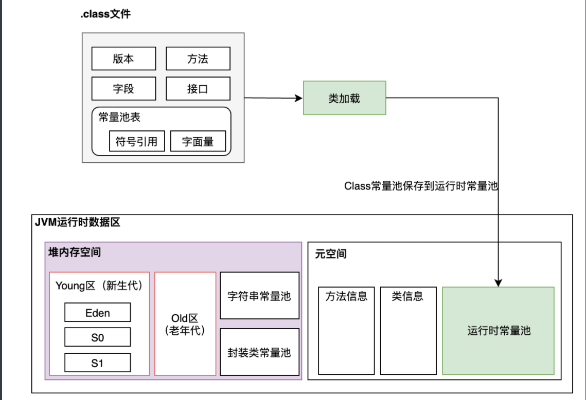

> 运行时常量池保存在方法区（JDK1.8元空间）中，它是全局共享的，不同的类共用一个运行时常量池。
>
> 另外，运行时常量池具有动态性的特征，它的内容并不是全部来源与编译后的class文件，在运行时也可以通过代码生成常量并放入运行时常量池。比如`String.intern()`方法。


#### 字符串常量池

字符串常量池，简单来说就是专门针对String类型设计的常量池。

字符串常量池的常用创建方式有两种。

```java
String a="Hello";
String b=new String("Mic");
```

1. `a`这个变量，是在编译期间就已经确定的，会进入到字符串常量池。
2. `b`这个变量，是通过`new`关键字实例化，`new`是创建一个对象实例并初始化该实例，因此这个字符串对象是在运行时才能确定的，创建的实例在堆空间上。

字符串常量池存储在堆内存空间中，创建形式如下图所示。


当使用`String a=“Hello”`这种方式创建字符串对象时，JVM首先会先检查该字符串对象是否存在与字符串常量池中，如果存在，则直接返回常量池中该字符串的引用。否则，会在常量池中创建一个新的字符串，并返回常量池中该字符串的引用。（这种方式可以减少同一个字符串被重复创建，节约内存，这也是享元模式的体现）。

> 如下图所示，如果再通过`String c=“Hello”`创建一个字符串，发现常量池已经存在了`Hello`这个字符串，则直接把该字符串的引用返回即可。（String里面的享元模式设计）


当使用`String b=new String(“Mic”)`这种方式创建字符串对象时，由于String本身的不可变性（后续分析），因此在JVM编译过程中，会把`Mic`放入到Class文件的常量池中，在类加载时，会在字符串常量池中创建`Mic`这个字符串。接着使用`new`关键字，在堆内存中创建一个`String`对象并指向常量池中`Mic`字符串的引用。

> 如下图所示，如果再通过`new String(“Mic”)`创建一个字符串对象，此时由于字符串常量池已经存在`Mic`，所以只需要在堆内存中创建一个`String`对象即可。


简单总结一下：JVM之所以单独设计字符串常量池，是JVM为了提高性能以及减少内存开销的一些优化：

1. String对象作为`Java`语言中重要的数据类型，是内存中占据空间最大的一个对象。高效地使用字符串，可以提升系统的整体性能。
2. 创建字符串常量时，首先检查字符串常量池是否存在该字符串，如果有，则直接返回该引用实例，不存在，则实例化该字符串放入常量池中。

> 字符串常量池是JVM所维护的一个字符串实例的引用表，在HotSpot VM中，它是一个叫做StringTable的全局表。在字符串常量池中维护的是字符串实例的引用，底层C++实现就是一个Hashtable。这些被维护的引用所指的字符串实例，被称作”被驻留的字符串”或”interned string”或通常所说的”进入了字符串常量池的字符串”!


#### 封装类常量池

除了字符串常量池，Java的基本类型的封装类大部分也都实现了常量池。包括`Byte,Short,Integer,Long,Character,Boolean`

> 注意，浮点数据类型`Float,Double`是没有常量池的。

封装类的常量池是在各自内部类中实现的，比如`IntegerCache`(`Integer`的内部类)。要注意的是，这些常量池是有范围的：

- Byte,Short,Integer,Long : [-128~127]
- Character : [0~127]
- Boolean : [True, False]

测试代码如下：

```java
public static void main(String[] args) {
  Character a=129;
  Character b=129;
  Character c=120;
  Character d=120;
  System.out.println(a==b);
  System.out.println(c==d);
  System.out.println("...integer...");
  Integer i=100;
  Integer n=100;
  Integer t=290;
  Integer e=290;
  System.out.println(i==n);
  System.out.println(t==e);
}
```

运行结果：

```java
false
true
...integer...
true
false
```

封装类的常量池，其实就是在各个封装类里面自己实现的缓存实例（并不是JVM虚拟机层面的实现），如在Integer中，存在`IntegerCache`，提前缓存了-128~127之间的数据实例。意味着这个区间内的数据，都采用同样的数据对象。这也是为什么上面的程序中，通过`==`判断得到的结果为`true`。

> 这种设计其实就是享元模式的应用。

```java
private static class IntegerCache {
  static final int low = -128;
  static final int high;
  static final Integer cache[];

  static {
    // high value may be configured by property
    int h = 127;
    String integerCacheHighPropValue =
      sun.misc.VM.getSavedProperty("java.lang.Integer.IntegerCache.high");
    if (integerCacheHighPropValue != null) {
      try {
        int i = parseInt(integerCacheHighPropValue);
        i = Math.max(i, 127);
        // Maximum array size is Integer.MAX_VALUE
        h = Math.min(i, Integer.MAX_VALUE - (-low) -1);
      } catch( NumberFormatException nfe) {
        // If the property cannot be parsed into an int, ignore it.
      }
    }
    high = h;

    cache = new Integer[(high - low) + 1];
    int j = low;
    for(int k = 0; k < cache.length; k++)
      cache[k] = new Integer(j++);

    // range [-128, 127] must be interned (JLS7 5.1.7)
    assert IntegerCache.high >= 127;
  }

  private IntegerCache() {}
}
```

封装类常量池的设计初衷其实String相同，也是针对频繁使用的数据区间进行缓存，避免频繁创建对象的内存开销。


#### 关于字符串常量池的问题探索

在上述常量池中，关于String字符串常量池的设计，还有很多问题需要探索：

1. 如果常量池中已经存在某个字符串常量，后续定义相同字符串的字面量时，是如何指向同一个字符串常量的引用？也就是下面这段代码的断言结果是`true`。

   ```java
   String a="Mic";
   String b="Mic";
   assert(a==b); //true
   ```

2. 字符串常量池的容量到底有多大？

3. 为什么要设计针对字符串单独设计一个常量池？


**为什么要设计针对字符串单独设计一个常量池？**

首先，我们来看一下String的定义。

```java
public final class String
    implements java.io.Serializable, Comparable<String>, CharSequence {
    /** The value is used for character storage. */
    private final char value[];

    /** Cache the hash code for the string */
    private int hash; // Default to 0
}
```

从上述源码中可以发现。

1. String这个类是被`final`修饰的，代表该类无法被继承。
2. String这个类的成员属性`value[]`也是被`final`修饰，代表该成员属性不可被修改。

因此`String`具有不可变的特性，也就是说`String`一旦被创建，就无法更改。这么设计的好处有几个。

1. 方便实现字符串常量池： 在Java中，由于会大量的使用String常量，如果每一次声明一个String都创建一个String对象，那将会造成极大的空间资源的浪费。Java提出了String pool的概念，在堆中开辟一块存储空间String pool，当初始化一个String变量时，如果该字符串已经存在了，就不会去创建一个新的字符串变量，而是会返回已经存在了的字符串的引用。如果字符串是可变的，某一个字符串变量改变了其值，那么其指向的变量的值也会改变，String pool将不能够实现！
2. 线程安全性，在并发场景下，多个线程同时读一个资源，是安全的，不会引发竞争，但对资源进行写操作时是不安全的，不可变对象不能被写，所以保证了多线程的安全。
3. 保证 hash 属性值不会频繁变更。确保了唯一性，使得类似`HashMap`容器才能实现相应的`key-value`缓存功能，于是在创建对象时其hashcode就可以放心的缓存了，不需要重新计算。这也就是Map喜欢将String作为Key的原因，处理速度要快过其它的键对象。所以HashMap中的键往往都使用String。

> 注意，由于`String`的不可变性可以方便实现字符串常量池这一点很重要，这时实现字符串常量池的前提。

字符串常量池，其实就是享元模式的设计，它和在JDK中提供的IntegerCache、以及Character等封装对象的缓存设计类似，只是String是JVM层面的实现。

字符串的分配，和其他的对象分配一样，耗费高昂的时间与空间代价。JVM为了提高性能和减少内存开销，在实例化字符串常量的时候进行了一些优化。为 了减少在JVM中创建的字符串的数量，字符串类维护了一个字符串池，每当代码创建字符串常量时，JVM会首先检查字符串常量池。如果字符串已经存在池中， 就返回池中的实例引用。如果字符串不在池中，就会实例化一个字符串并放到池中。Java能够进行这样的优化是因为字符串是不可变的，可以不用担心数据冲突 进行共享。

> 我们把字符串常量池当成是一个缓存，通过`双引号`定义一个字符串常量时，首先从字符串常量池中去查找，找到了就直接返回该字符串常量池的引用，否则就创建一个新的字符串常量放在常量池中。


**常量池有多大呢?**

我想大家一定和我一样好奇，常量池到底能存储多少个常量？

前面我们说过，常量池本质上是一个hash表，这个hash表示不可动态扩容的。也就意味着极有可能出现单个 bucket 中的链表很长，导致性能降低。

在JDK1.8中，这个hash表的固定Bucket数量是60013个，我们可以通过下面这个参数配置指定数量

```shell
-XX:StringTableSize=N
```

可以增加下面这个虚拟机参数，来打印常量池的数据。

```shell
-XX:+PrintStringTableStatistics
```

增加参数后，运行下面这段代码。

```java
public class StringExample {
    private int value = 1;
    public final static int fs=101;

    public static void main(String[] args) {
        final String a="ab";
        final String b="a"+"b";
        String c=a+b;
    }
}
```

在JVM退出时，会打印常量池的使用情况如下:

```java
SymbolTable statistics:
Number of buckets       :     20011 =    160088 bytes, avg   8.000
Number of entries       :     12192 =    292608 bytes, avg  24.000
Number of literals      :     12192 =    470416 bytes, avg  38.584
Total footprint         :           =    923112 bytes
Average bucket size     :     0.609
Variance of bucket size :     0.613
Std. dev. of bucket size:     0.783
Maximum bucket size     :         6
StringTable statistics:
Number of buckets       :     60013 =    480104 bytes, avg   8.000
Number of entries       :       889 =     21336 bytes, avg  24.000
Number of literals      :       889 =     59984 bytes, avg  67.474
Total footprint         :           =    561424 bytes
Average bucket size     :     0.015
Variance of bucket size :     0.015
Std. dev. of bucket size:     0.122
Maximum bucket size     :         2
```

可以看到字符串常量池的总大小是`60013`，其中字面量是`889`。


**字面量是什么时候进入到字符串常量池的**

字符串字面量，和其他基本类型的字面量或常量不同，并不会在类加载中的解析（resolve） 阶段填充并驻留在字符串常量池中，而是以特殊的形式存储在 运行时常量池（Run-Time Constant Pool） 中。而是只有当此字符串字面量被调用时（如对其执行ldc字节码指令，将其添加到栈顶），HotSpot VM才会对其进行resolve，为其在字符串常量池中创建对应的String实例。

具体来说，应该是在**执行ldc指令时（该指令表示int、float或String型常量从常量池推送至栈顶）**

在JDK1.8的HotSpot VM中，这种未真正解析（resolve）的String字面量，被称为pseudo-string，以JVM_CONSTANT_String的形式存放在运行时常量池中，此时并未为其创建String实例。

在编译期，字符串字面量以"CONSTANT_String_info"+"CONSTANT_Utf8_info"的形式存放在class文件的 常量池（Constant Pool） 中；

在类加载之后，字符串字面量以"JVM_CONSTANT_UnresolvedString(JDK1.7)"或者"JVM_CONSTANT_String(JDK1.8)"的形式存放在 运行时常量池（Run-time Constant Pool） 中；

在首次使用某个字符串字面量时，字符串字面量以真正的String对象的方式存放在 字符串常量池（String Pool） 中。

通过下面这段代码可以证明。

```java
public static void main(String[] args) {
  String a =new String(new char[]{'a','b','c'});
  String b = a.intern();
  System.out.println(a == b);

  String x =new String("def");
  String y = x.intern();
  System.out.println(x == y);
}
```

使用`new char[]{‘a’,’b’,’c’}`构建的字符串，并没有在编译的时候使用常量池，而是在调用`a.intern()`时，将`abc`保存到常量池并返回该常量池的引用。


### intern()方法

在Integer中的`valueOf`方法中，我们可以看到，如果传递的值`i`是在`IntegerCache.low`和`IntegerCache.high`范围以内，则直接从`IntegerCache.cache`中返回缓存的实例对象。

```java
public static Integer valueOf(int i) {
  if (i >= IntegerCache.low && i <= IntegerCache.high)
    return IntegerCache.cache[i + (-IntegerCache.low)];
  return new Integer(i);
}
```

那么，在String类型中，既然存在字符串常量池，那么有没有方法能够实现类似于IntegerCache的功能呢？

答案是：`intern()`方法。由于字符串池是虚拟机层面的技术，所以在`String`的类定义中并没有类似`IntegerCache`这样的对象池，`String`类中提及缓存/池的概念只有intern() 这个方法。

```java
/**
     * Returns a canonical representation for the string object.
     * <p>
     * A pool of strings, initially empty, is maintained privately by the
     * class {@code String}.
     * <p>
     * When the intern method is invoked, if the pool already contains a
     * string equal to this {@code String} object as determined by
     * the {@link #equals(Object)} method, then the string from the pool is
     * returned. Otherwise, this {@code String} object is added to the
     * pool and a reference to this {@code String} object is returned.
     * <p>
     * It follows that for any two strings {@code s} and {@code t},
     * {@code s.intern() == t.intern()} is {@code true}
     * if and only if {@code s.equals(t)} is {@code true}.
     * <p>
     * All literal strings and string-valued constant expressions are
     * interned. String literals are defined in section 3.10.5 of the
     * <cite>The Java&trade; Language Specification</cite>.
     *
     * @return  a string that has the same contents as this string, but is
     *          guaranteed to be from a pool of unique strings.
     */
public native String intern();
```

这个方法的作用是：**去拿String的内容去Stringtable里查表，如果存在，则返回引用，不存在，就把该对象的"引用"保存在Stringtable表里**。

比如下面这段程序：

```java
public static void main(String[] args) {
  String str = new String("Hello World");
  String str1=str.intern();
  String str2 = "Hello World";
  System.out.print(str1 == str2);
}
```

运行的结果为：true。

实现逻辑如下图所示，`str1`通过调用`str.intern()`去常量池表中获取`Hello World`字符串的引用，接着`str2`通过字面量的形式声明一个字符串常量，由于此时`Hello World`已经存在于字符串常量池中，所以同样返回该字符串常量`Hello World`的引用，使得`str1`和`str2`具有相同的引用地址，从而运行结果为`true`。


总结：intern方法会从字符串常量池中查询当前字符串是否存在：

- 若不存在就会将当前字符串放入常量池中，并返回当地字符串地址引用。
- 如果存在就返回字符串常量池那个字符串地址。

> 注意，所有字符串字面量在初始化时，会默认调用`intern()`方法。
>
> 这段程序，之所以`a==b`，是因为声明`a`时，会通过`intern()`方法去字符串常量池中查找是否存在字符串`Hello`，由于不存在，则会创建一个。同理，变量`b`也同样如此，所以`b`在声明时，发现字符常量池中已经存在`Hello`的字符串常量，所以直接返回该字符串常量的引用。
>
> ```java
> public static void main(String[] args) {
> String a="Hello";
> String b="Hello";
> }
> ```

OK，学习到这里，是不是感觉自己懂了？我出一道题目来考考大家，下面这段程序的运行结果是什么？

```java
public static void main(String[] args) {
  String a =new String(new char[]{'a','b','c'});
  String b = a.intern();
  System.out.println(a == b);

  String x =new String("def");
  String y = x.intern();
  System.out.println(x == y);
}
```

正确答案是：

```txt
true
false
```

第二个输出为`false`还可以理解，因为`new String(“def”)`会做两件事：

1. 在字符串常量池中创建一个字符串`def`。
2. `new`关键字创建一个实例对象`string`，并指向字符串常量池`def`的引用。

而`x.intern()`，是从字符串常量池获取`def`的引用，他们的指向地址不同，我后面的内容还会详细解释。

第一个输出结果为`true`是为啥捏？

> JDK文档中关于`intern()`方法的说明：当调用`intern`方法时，如果常量池（内置在 JVM 中的）中已经包含相同的字符串，则返回池中的字符串。否则，将此`String`对象添加到池中，并返回对该`String`对象的引用。

在构建`String a`的时候，使用`new char[]{‘a’,’b’,’c’}`初始化字符串时（不会自动调用`intern()`，字符串采用懒加载方式进入到常量池），并没有在字符串常量池中构建`abc`这个字符串实例。所以当调用`a.intern()`方法时，会把该`String`对象添加到字符常量池中，并返回对该`String`对象的引用，所以`a`和`b`指向的引用地址是同一个。


## 问题回答

> 面试题：String a = "ab"; String b = "a" + "b"; a == b 是否相等

**回答**： `a==b`是相等的，原因如下：

1. 变量`a`和`b`都是常量字符串，其中`b`这个变量，在编译时，由于不存在可变化的因素，所以编译器会直接把变量`b`赋值为`ab`（这个是属于编译器优化范畴，也就是编译之后，`b`会保存到Class常量池中的字面量）。
2. 对于字符串常量，初始化`a`时， 会在字符串常量池中创建一个字符串`ab`并返回该字符串常量池的引用。
3. 对于变量`b`，赋值`ab`时，首先从字符串常量池中查找是否存在相同的字符串，如果存在，则返回该字符串引用。
4. 因此，a和b所指向的引用是同一个，所以`a==b`成立。

问题总结

关于常量池部分的内容，要比较深入和全面的理解，还是需要花一些时间的。

比如大家通过阅读上面的内容，认为对字符串常量池有一个非常深入的理解，可以，我们再来看一个问题：

```java
public static void main(String[] args) {
  String str = new String("Hello World");
  String str1=str.intern();
  System.out.print(str == str1);
}
```

上面这段代码，很显然返回`false`，原因如下图所示。很明显`str`和`str1`所指向的引用地址不是同一个。


但是我们把上述代码改造一下：

```java
public static void main(String[] args) {
  String str = new String("Hello World")+new String("!");
  String str1=str.intern();
  System.out.print(str == str1);
}
```

上述程序输出的结果变成了：`true`。 为什么呢？

这里也是JVM编译器层面做的优化，因为String是不可变类型，所以理论上来说，上述程序的执行逻辑是：通过`+`进行字符串拼接时，相当于把原有的`String`变量指向的字符串常量`HelloWorld`取出来，加上另外一个`String`变量指向的字符串常量`!`，再生成一个新的对象。

假设我们是通过`for`循环来对String变量进行拼接，那将会生成大量的对象，如果这些对象没有被及时回收，会造成非常大的内存浪费。

所以JVM优化之后，其实是通过StringBuilder来进行拼接，也就是只会产生一个对象实例`StringBuilder`，然后再通过`append`方法来拼接。

为了证明我说的情况，来看一下上述代码的字节码。

```java
 public static void main(java.lang.String[]);
    descriptor: ([Ljava/lang/String;)V
    flags: ACC_PUBLIC, ACC_STATIC
    Code:
      stack=4, locals=3, args_size=1
         0: new           #3                  // class java/lang/StringBuilder
         3: dup
         4: invokespecial #4                  // Method java/lang/StringBuilder."<init>":()V
         7: new           #5                  // class java/lang/String
        10: dup
        11: ldc           #6                  // String Hello World
        13: invokespecial #7                  // Method java/lang/String."<init>":(Ljava/lang/String;)V
        16: invokevirtual #8                  // Method java/lang/StringBuilder.append:(Ljava/lang/String;)Ljava/lang/StringBuilder;
        19: new           #5                  // class java/lang/String
        22: dup
        23: ldc           #9                  // String !
        25: invokespecial #7                  // Method java/lang/String."<init>":(Ljava/lang/String;)V
        28: invokevirtual #8                  // Method java/lang/StringBuilder.append:(Ljava/lang/String;)Ljava/lang/StringBuilder;
        31: invokevirtual #10                 // Method java/lang/StringBuilder.toString:()Ljava/lang/String;
        34: astore_1
        35: aload_1
        36: invokevirtual #11                 // Method java/lang/String.intern:()Ljava/lang/String;
        39: astore_2
        40: getstatic     #12                 // Field java/lang/System.out:Ljava/io/PrintStream;
        43: aload_1
        44: aload_2
        45: if_acmpne     52
        48: iconst_1
        49: goto          53
        52: iconst_0
        53: invokevirtual #13                 // Method java/io/PrintStream.print:(Z)V
        56: return
```

从字节码中可以看到，构建了一个StringBuilder，

```java
 0: new           #3                  // class java/lang/StringBuilder
```

然后把字符串常量通过`append`方法进行拼接，最后调用`toString()`方法得到一个字符串常量。

```java
16: invokevirtual #8                  // Method java/lang/StringBuilder.append:(Ljava/lang/String;)Ljava/lang/StringBuilder;
28: invokevirtual #8                  // Method java/lang/StringBuilder.append:(Ljava/lang/String;)Ljava/lang/StringBuilder;
31: invokevirtual #10                 // Method java/lang/StringBuilder.toString:()Ljava/lang/String;
```

因此，上述代码，等价于下面这种形式。

```java
public static void main(String[] args) {
  StringBuilder sb=new StringBuilder().append(new String("Hello World")).append(new String("!"));
  String str=sb.toString();
  String str1=str.intern();
  System.out.print(str == str1);
}
```

所以，得到的结果是`true`。

> 基于这个问题的变体还有很多，比如再来变一次，下面这段程序的运行结果是多少？

```java
public static void main(String[] args) {
  String s1 = "a";
  String s2 = "b";
  String s3 = "ab";
  String s4 = s1 + s2;
  System.out.println(s3 == s4);
}
```

答案是`false`。

因为上述程序等价于， `s3`和`s4`指向不同的地址引用，自然不相等。

```java
public static void main(String[] args) {
  String s1 = "a";
  String s2 = "b";
  String s3 = "ab";
  StringBuilder sb=new StringBuilder().append(s1).append(s2);
  String s4 = sb.toString();
  System.out.println(s3 == s4);
}
```


## JVM 垃圾回收算法

jvm 的垃圾回收一般大致都分为两个阶段，具体的回收过程则根据具体的垃圾回收器决定

### 标记阶段

在GC执行垃圾回收之前，首先需要区分出内存中哪些是存活对象，哪些是已经死亡的对象。只有被标记为己经死亡的对象，GC才会在执行垃圾回收时，释放掉其所占用的内存空间，因此这个过程我们可以称为垃圾标记阶段

判断对象存活一般有两种方式：引用计数算法和可达性分析算法


#### 引用计数法

引用计数算法（Reference Counting）比较简单，对每个对象保存一个整型的引用计数器属性。用于记录对象被引用的情况。，但是最致命的缺点则是无法解决循环引用的问题


#### 可达性分析

- 可达性分析算法是以根对象集合（GCRoots）为起始点，按照从上至下的方式搜索被根对象集合所连接的目标对象是否可达。

- 使用可达性分析算法后，内存中的存活对象都会被根对象集合直接或间接连接着，搜索所走过的路径称为引用链（Reference Chain）

- 如果目标对象没有任何引用链相连，则是不可达的，就意味着该对象己经死亡，可以标记为垃圾对象。

- 在可达性分析算法中，只有能够被根对象集合直接或者间接连接的对象才是存活对象。

 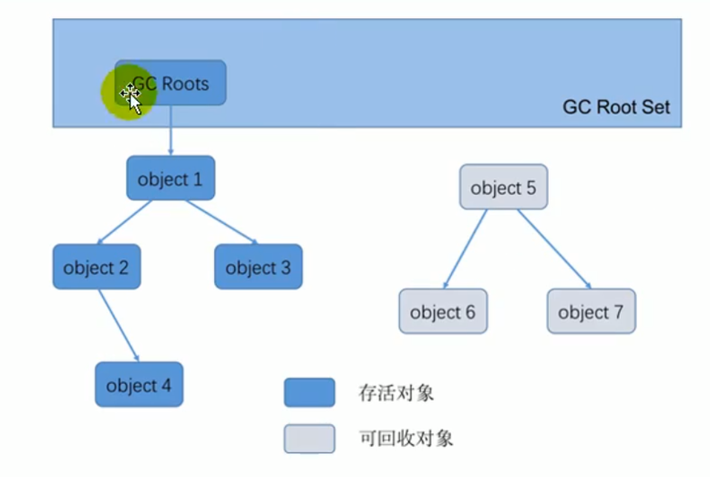 

**在Java语言中，GC Roots包括以下几类元素：**


- 虚拟机栈中引用的对象 

- 比如：各个线程被调用的方法中使用到的参数、局部变量等。

 

- 本地方法栈内JNI（通常说的本地方法）引用的对象

- 方法区中类静态属性引用的对象 

- 比如：Java类的引用类型静态变量

 

- 方法区中常量引用的对象 

- 比如：字符串常量池（String Table）里的引用

 

- 所有被同步锁synchronized持有的对象

- Java虚拟机内部的引用。 

- 基本数据类型对应的Class对象，一些常驻的异常对象（如：NullPointerException、OutOfMemoryError），系统类加载器。


### 清理阶段

当成功区分出内存中存活对象和死亡对象后，GC接下来的任务就是执行垃圾回收，释放掉无用对象所占用的内存空间，以便有足够的可用内存空间为新对象分配内存

目前在JVM中比较常见的三种垃圾收集算法是标记一清除算法（Mark-Sweep）、复制算法（copying）、标记-压缩算法（Mark-Compact）


#### 标记清除算法

当堆中的有效内存空间（available memory）被耗尽的时候，就会停止整个程序（也被称为stop the world），然后进行两项工作，第一项则是标记，第二项则是清除

-  标记：Collector从引用根节点开始遍历，标记所有被引用的对象。一般是在对象的Header中记录为可达对象。 
-  清除：Collector对堆内存从头到尾进行线性的遍历，如果发现某个对象在其Header中没有标记为可达对象，则将其回收 


**缺点**

- 标记清除算法的效率不算高
- 在进行GC的时候，需要停止整个应用程序，用户体验较差
- 这种方式清理出来的空闲内存是不连续的，产生内碎片，需要维护一个空闲列表


#### 标记整理算法

复制算法的高效性是建立在存活对象少、垃圾对象多的前提下的。这种情况在新生代经常发生，但是在老年代，更常见的情况是大部分对象都是存活对象。如果依然使用复制算法，由于存活对象较多，复制的成本也将很高。因此，基于老年代垃圾回收的特性，需要使用其他的算法

- 第一阶段和标记清除算法一样，从根节点开始标记所有被引用对象 
- 第二阶段将所有的存活对象压缩到内存的一端，按顺序排放。
-  之后，清理边界外所有的空间。 


标记-压缩算法的最终效果等同于标记-清除算法执行完成后，再进行一次内存碎片整理，因此，也可以把它称为标记-清除-压缩（Mark-Sweep-Compact）算法。


**优点**

- 消除了标记-清除算法当中，内存区域分散的缺点，我们需要给新对象分配内存时，JVM只需要持有一个内存的起始地址即可。
- 消除了复制算法当中，内存减半的高额代价。


**缺点**

- 从效率上来说，标记-整理算法要低于复制算法。
- 移动对象的同时，如果对象被其他对象引用，则还需要调整引用的地址
- 移动过程中，需要全程暂停用户应用程序。即：STW


#### 复制算法

将活着的内存空间分为两块，每次只使用其中一块，在垃圾回收时将正在使用的内存中的存活对象复制到未被使用的内存块中，之后清除正在使用的内存块中的所有对象，交换两个内存的角色，最后完成垃圾回收


**优点**

- 没有标记和清除过程，实现简单，运行高效
- 复制过去以后保证空间的连续性，不会出现“碎片”问题。


**缺点**

- 此算法的缺点也是很明显的，就是需要两倍的内存空间。
- 对于G1这种分拆成为大量region的GC，复制而不是移动，意味着GC需要维护region之间对象引用关系，不管是内存占用或者时间开销也不小

在新生代，对常规应用的垃圾回收，一次通常可以回收70% - 99% 的内存空间。回收性价比很高。所以现在的商业虚拟机都是用这种收集算法回收新生代。

  


### 分代收集算法

#### 年轻代（Young Gen）

年轻代特点：区域相对老年代较小，对象生命周期短、存活率低，回收频繁。

这种情况复制算法的回收整理，速度是最快的。复制算法的效率只和当前存活对象大小有关，因此很适用于年轻代的回收。而复制算法内存利用率不高的问题，通过hotspot中的两个survivor的设计得到缓解。


#### 老年代（Tenured Gen）

老年代特点：区域较大，对象生命周期长、存活率高，回收不及年轻代频繁。

这种情况存在大量存活率高的对象，复制算法明显变得不合适。一般是由标记-清除或者是标记-清除与标记-整理的混合实现。

- Mark阶段的开销与存活对象的数量成正比。
- Sweep阶段的开销与所管理区域的大小成正相关。
- Compact阶段的开销与存活对象的数据成正比。

以HotSpot中的CMS回收器为例，CMS是基于Mark-Sweep实现的，对于对象的回收效率很高。而对于碎片问题，CMS采用基于Mark-Compact算法的Serial Old回收器作为补偿措施：当内存回收不佳（碎片导致的Concurrent Mode Failure时），将采用Serial Old执行Full GC以达到对老年代内存的整理。


## JVM 垃圾回收器

jvm 垃圾回收器主要分为并行垃圾回收器与串行垃圾回收器，其中CMS、Parallbel Old、Parallbel Scanvrage、G1 都属于并行垃圾回收期，而Serial Old 、Serial则属于串行垃圾回收期

### 评估GC的性能指标（了解）

- 吞吐量：运行用户代码的时间占总运行时间的比例（总运行时间 = 程序的运行时间 + 内存回收的时间）
- 垃圾收集开销：吞吐量的补数，垃圾收集所用时间与总运行时间的比例。
- 暂停时间：执行垃圾收集时，程序的工作线程被暂停的时间。
- 收集频率：相对于应用程序的执行，收集操作发生的频率。
- 内存占用：Java堆区所占的内存大小。
- 快速：一个对象从诞生到被回收所经历的时间。


吞吐量、暂停时间、内存占用 这三者共同构成一个“不可能三角”。三者总体的表现会随着技术进步而越来越好。一款优秀的收集器通常最多同时满足其中的两项。

这三项里，暂停时间的重要性日益凸显。因为随着硬件发展，内存占用多些越来越能容忍，硬件性能的提升也有助于降低收集器运行时对应用程序的影响，即提高了吞吐量。而内存的扩大，对延迟反而带来负面效果。

简单来说，主要抓住两点：吞吐量、暂停时间


#### 吞吐量

吞吐量就是CPU用于运行用户代码的时间与CPU总消耗时间的比值，即吞吐量 = 运行用户代码时间 /（运行用户代码时间+垃圾收集时间）。比如：虚拟机总共运行了100分钟，其中垃圾收集花掉1分钟，那吞吐量就是99%。

这种情况下，应用程序能容忍较高的暂停时间，因此，高吞吐量的应用程序有更长的时间基准，快速响应是不必考虑的

吞吐量优先，意味着在单位时间内，STW的时间最短：0.2 + 0.2 = 0.4


#### 暂停时间

“暂停时间”是指一个时间段内应用程序线程暂停，让GC线程执行的状态。

例如，GC期间100毫秒的暂停时间意味着在这100毫秒期间内没有应用程序线程是活动的。

暂停时间优先，意味着尽可能让单次STW的时间最短：0.1 + 0.1 + 0.1 + 0.1 + 0.1 = 0.5


#### 吞吐量 vs 暂停时间

高吞吐量较好因为这会让应用程序的最终用户感觉只有应用程序线程在做“生产性”工作。直觉上，吞吐量越高程序运行越快。

低暂停时间（低延迟）较好因为从最终用户的角度来看不管是GC还是其他原因导致一个应用被挂起始终是不好的。这取决于应用程序的类型，有时候甚至短暂的200毫秒暂停都可能打断终端用户体验。因此，具有低的较大暂停时间是非常重要的，特别是对于一个交互式应用程序。

不幸的是”高吞吐量”和”低暂停时间”是一对相互竞争的目标（矛盾）。

- 因为如果选择以吞吐量优先，那么必然需要降低内存回收的执行频率，但是这样会导致GC需要更长的暂停时间来执行内存回收。

- 相反的，如果选择以低延迟优先为原则，那么为了降低每次执行内存回收时的暂停时间，也只能频繁地执行内存回收，但这又引起了年轻代内存的缩减和导致程序吞吐量的下降。

在设计（或使用）GC算法时，我们必须确定我们的目标：一个GC算法只可能针对两个目标之一（即只专注于较大吞吐量或最小暂停时间），或尝试找到一个二者的折衷。

现在标准：在最大吞吐量优先的情况下，降低停顿时间


### 垃圾回收器的组合关系

 

1. 两个收集器间有连线，表明它们可以搭配使用：Serial/Serial Old、Serial/CMS、ParNew/Serial Old、ParNew/CMS、Parallel Scavenge/Serial Old、Parallel Scavenge/Parallel Old、G1；
2. 其中Serial Old作为CMS出现"`Concurrent Mode Failure`"失败的后备预案。
3. （红色虚线）由于维护和兼容性测试的成本，在JDK 8时将Serial+CMS、ParNew+Serial Old这两个组合声明为废弃（JEP173），并在JDK9中完全取消了这些组合的支持（JEP214），即：移除。
4. （绿色虚线）JDK14中：弃用Parallel Scavenge和Serialold GC组合（JEP366）
5. （绿色虚框）JDK14中：删除CMS垃圾回收器（JEP363）


### Serial 收集器

Serial收集器采用复制算法、串行回收和"stop-the-World"机制的方式执行内存回收。

Serial Old收集器同样也采用了串行回收和"Stop the World"机制，只不过内存回收算法使用的是标记-压缩算法。Serial 0ld在Server模式下主要有两个用途：

- ① 与新生代的Parallel scavenge配合使用
-  ② 作为老年代CMS收集器的后备垃圾收集方案

 


### ParNew收集器

ParNew 收集器除了采用并行回收的方式执行内存回收外，两款垃圾收集器之间几乎没有任何区别。ParNew收集器在年轻代中同样也是采用复制算法、"Stop-the-World"机制

ParNew 是很多JVM运行在Server模式下新生代的默认垃圾收集器。

  


### Parallel Scavenge

Parallel Old收集器采用了标记-压缩算法，但同样也是基于并行回收和"Stop-the-World"机制。

- 和ParNew收集器不同，ParallelScavenge收集器的目标则是达到一个可控制的吞吐量（Throughput），它也被称为吞吐量优先的垃圾收集器。
- 自适应调节策略也是Parallel Scavenge与ParNew一个重要区别

  


### CMS

CMS 是一款并发收集器，它允许垃圾回收线程与用户线程同时工作，CMS的垃圾收集算法采用标记-清除算法，并且也会"Stop-the-World"，Cms垃圾回收器只能与ParNew 垃圾回收器一起使用

  

CMS整个过程比之前的收集器要复杂，整个过程分为4个主要阶段，即初始标记阶段、并发标记阶段、重新标记阶段和并发清除阶段

- **初始标记**（Initial-Mark）阶段：在这个阶段中，程序中所有的工作线程都将会因为“Stop-the-World”机制而出现短暂的暂停，这个阶段的主要任务仅仅只是标记出GCRoots能直接关联到的对象。一旦标记完成之后就会恢复之前被暂停的所有应用线程。由于直接关联对象比较小，所以这里的速度非常快。
- **并发标记**（Concurrent-Mark）阶段：从GC Roots的直接关联对象开始遍历整个对象图的过程，这个过程耗时较长但是不需要停顿用户线程，可以与垃圾收集线程一起并发运行。
- **重新标记**（Remark）阶段：由于在并发标记阶段中，程序的工作线程会和垃圾收集线程同时运行或者交叉运行，因此为了修正并发标记期间，因用户程序继续运作而导致标记产生变动的那一部分对象的标记记录，这个阶段的停顿时间通常会比初始标记阶段稍长一些，但也远比并发标记阶段的时间短。
- **并发清除**（Concurrent-Sweep）阶段：此阶段清理删除掉标记阶段判断的已经死亡的对象，释放内存空间。由于不需要移动存活对象，所以这个阶段也是可以与用户线程同时并发的

其初始化标记和再次标记这两个阶段中仍然需要执行“Stop-the-World”机制暂停程序中的工作线程

由于在垃圾收集阶段用户线程没有中断，所以在CMS回收过程中，还应该确保应用程序用户线程有足够的内存可用。因此，CMS收集器不能像其他收集器那样等到老年代几乎完全被填满了再进行收集，而是当堆内存使用率达到某一阈值时，便开始进行回收，以确保应用程序在CMS工作过程中依然有足够的空间支持应用程序运行

要是CMS运行期间预留的内存无法满足程序需要，就会出现一次“`Concurrent Mode Failure`” 失败，这时虚拟机将启动后备预案：临时启用Serial Old收集器来重新进行老年代的垃圾收集，这样停顿时间就很长了

>缺点如下：
>
>- 会产生内存碎片，导致并发清除后，用户线程可用的空间不足。在无法分配大对象的情况下，不得不提前触发FullGC。
>
>- CMS收集器对CPU资源非常敏感。在并发阶段，它虽然不会导致用户停顿，但是会因为占用了一部分线程而导致应用程序变慢，总吞吐量会降低。
>
>- CMS收集器无法处理浮动垃圾。可能出现“`Concurrent Mode Failure`"失败而导致另一次Full GC的产生。在并发标记阶段由于程序的工作线程和垃圾收集线程是同时运行或者交叉运行的，那么在并发标记阶段如果产生新的垃圾对象，CMS将无法对这些垃圾对象进行标记，最终会导致这些新产生的垃圾对象没有被及时回收，从而只能在下一次执行GC时释放这些之前未被回收的内存空间。


### G1 垃圾回收器

G1 垃圾回收期最大的特点就是设立了可预测的时间停顿模型，也就是说我们可以通过设定时间来控制垃圾回收的停顿

G1首先在内存结构上采用了region化的方法，将堆内存划分成2048个小块，每块大小1-32M（2的幂次），每块region都可以作为E、S、O、H任意一种，分配灵活，但是存在大对象问题。解决方法是：

- 小于一半region size的可以正常存入E区

- 一半到一个region size的直接存入O区一个region中，这个region又叫Humongous region，我们也可以把它叫做H区（他本质还是O区的）

- 比一个region size还要大的对象，需要存入连续的多个region中，这多个region都是H区。

    

并且在G1对应的内存模型中，Region 随时可能会属于年轻代，也可能会属于老年代，所以就无所谓给年轻代多少内存，给老年代多少内存一说了，实际上新生代和老年代各自的内存区域是不停的变动的，由G1自动控制。

G1垃圾回收器的设计思想，包括Region的划分，都是由G1决定的，然后Region动态转移给新生代或者老年代，按需分配


#### G1 预测停顿时间

G1 通过追踪每个Region里的回收价值，来实现在设立的停顿时间内收集价值比较高的Region

因为G1 将内存划分成了相同大小的Region，它必须要知道每个Region中的对象有多少是垃圾，如果对某个Region回收需要耗费多长时间，可回收多少垃圾，举个例子：

如下图，G1通过追踪发现，1个Region中的垃圾对象有10M，回收他们需要1s，另一个Region中的垃圾对象有10M，回收他们需要200ms

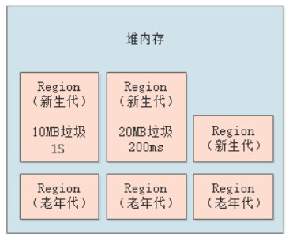

然后在垃圾回收的时候，G1会发现在最近一个时间段内，比如1小时内，垃圾回收已经导致了几百毫秒的系统停顿了，现在又要执行一次垃圾回收，那么必须是回收上图中那个只需要200ms就能回收掉20MB垃圾的Region啊！

于是G1触发一次垃圾回收，虽然可能导致系统停顿了200ms，但是一下子回收了更多的垃圾，就是20MB的垃圾，如下图。

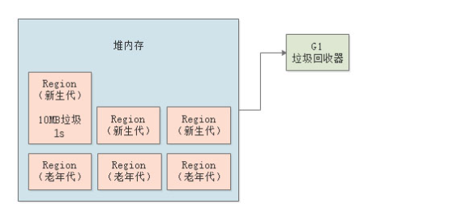

所以简单来说，G1可以做到让你来设定垃圾回收对系统的影响，他自己通过把内存拆分为大量小Region，以及追踪每个Region中可以回收的对象大小和预估时间，最后在垃圾回收的时候，尽量把垃圾回收对系统造成的影响控制在你指定的时间范围内，同时在有限的时间内尽量回收尽可能多的垃圾对象。

然后触发垃圾回收的时候，可以根据设定的预期系统停顿时间，来选择**最少回收时间和最多回收对象的Region进行垃圾回收**，保证GC对系统停顿的影响在可控范围内，同时还能尽可能回收最多的对象。


#### G1 分代回收原理

##### G1 年轻代

G1对应的是一大堆的Region内存区域，每个Region大小都是一直的，默认为2048个Region，可以通过-XX:HeapRegionSize 来设置每个Region的大小

假设堆内存大小为4G，每个Region的大小大约是2M，默认新生代的占比是5%，也就是200M左右，可以通过-XX:G1NewSizePercent来设置新生代的占比，在系统运行过程中，JVM其实会不停的给新生代增加更多的Region，但是最多新生代的占比不会超过60%，可以通过-XX:MaxG1NewSizePercent来设置

如下图，刚开始就是一部分的Region是属于新生代的

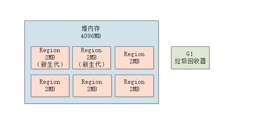


##### Eden 与 Suvivor

虽然G1把内存划分为了很多的Region，但是其实还是有很多新生代、老年代的区分，比如我们常用的新生代的参数 -XX:SuvivorRatito=8,我们通过这个比例也会发现G1其实也是根据这些来划分的，举个例子：比如新生代初始的时候有100个Region，那么可能有80个Region就是Eden区，20个Region 是 Suvivor 区，如下图：

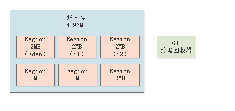

不同的区占用不同的Region，由G1进行分为，随着新生代内存的占用，属于新生代的Region也会不断增加


##### G1 新生代的垃圾回收

随着不停的在新生代的Eden对应的Region中放对象，JVM就会不停的给新生代加入更多的Region，直到新生代占据堆大小的最大比例60%。

一旦新生代达到了设定的占据堆内存的最大大小60%，比如都有1200个Region了，里面的Eden可能占据了1000个Region，每个Survivor是100个Region，而且Eden区还占满了对象，此时如下图所示。

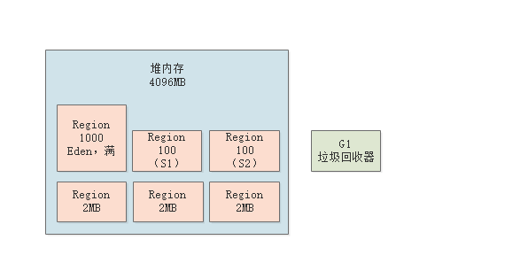

这个时候还是会触发新生代的GC，G1就会用之前说过的复制算法来进行垃圾回收，进入一个“Stop the World”状态

然后把Eden对应的Region中的存活对象放入S1对应的Region中，接着回收掉Eden对应的Region中的垃圾对象，如下图。

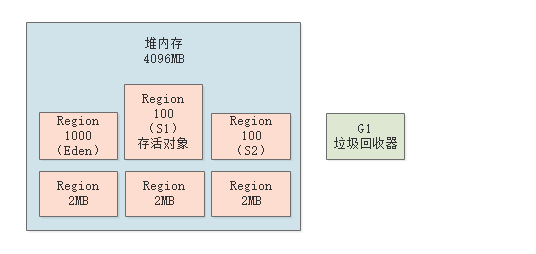

但是这个过程跟之前是有区别的，因为G1是可以设定目标GC停顿时间的，也就是G1执行GC的时候最多可以让系统停顿多长时间，可以通过“-XX:MaxGCPauseMills”参数来设定，默认值是200ms。

那么G1就会通过之前说的，对每个Region追踪回收他需要多少时间，可以回收多少对象来选择回收一部分的Region，保证GC停顿时间控制在指定范围内，尽可能多的回收掉一些对象。


##### 对象进入老年代

那么G1就会通过之前说的，对每个Region追踪回收他需要多少时间，可以回收多少对象来选择回收一部分的Region，保证GC停顿时间控制在指定范围内，尽可能多的回收掉一些对象。

那么触发年轻代对象进入老年代的条件和之前也是几乎一样的：

- 对象在新生代躲过了很多次的垃圾回收，达到了一定的年龄了，“-XX:MaxTenuringThreshold”参数可以设置这个年龄，他就会进入老年代

- 动态年龄判定规则，如果一旦发现某次新生代GC过后，存活对象超过了Survivor的50%

  > 比如年龄为1岁，2岁，3岁，4岁的对象的大小总和超过了Survivor的50%，此时4岁以上的对象全部会进入老年代，这就是动态年龄判定规则

如下图，经过一段时间的新生代使用和垃圾回收之后，就会有一些对象进入老年代

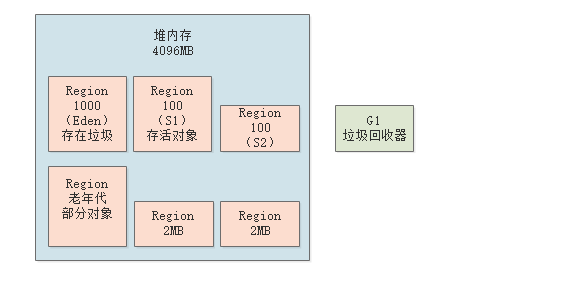


##### 大对象Region

在G1中，大对象的判定规则就是一个大对象超过了一个Region大小的50%，比如按照上面算的，每个Region是2MB，只要一个大对象超过了1MB，就会被放入大对象专门的Region中

而且一个大对象如果太大，可能会横跨多个Region来存放。如下图。

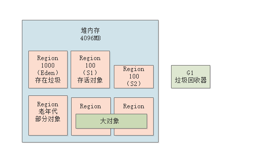


大对象虽然不属于新生代和老年代，但是在新生代或者是老年代回收的时候，会顺带着大对象Region一起回收


### G1 垃圾回收过程

G1GC的垃圾回收过程主要包括如下三个环节：

-  年轻代GC（Young GC） 
-  老年代并发标记过程（Concurrent Marking） 
-  混合回收（Mixed GC）
  （如果需要，单线程、独占式、高强度的Full GC还是继续存在的。它针对GC的评估失败提供了一种失败保护机制，即强力回收。）

  


在了解回收过程之前，先了解两个基本概念：

- RememberSets，又叫Rsets是每个region中都有的一份存储空间，用于存储本region的对象被其他region对象的引用记录。这样在进行标记阶段时，不需要扫描全堆，而只需要扫描 GCRoot 所在的Rset 即可

  > **RSet是一个空间换时间的数据结构。**
  >
  > 之前提到过一个卡表的数据结构，用来解决跨代引用的问题。RSet的功能与此类似，它的全称是Remembered Set，用于记录和维护Region之间的对象引用关系。
  >
  >  但RSet和Card Table有些不同的地方。Card Table 是一种Points-out（我引用了谁的对象）的结构，而RSet记录了其他Region中的对象引用本Region中对象的关系属于Points-into(谁引用了我的对象)，像是倒排索引。
  >
  > 可以把RSet理解成一个Hash，key是引用了我（对象）的Region的地址，value是引用它的对象的卡页集合。
  >
  > 
  >
  > 
  >
  > 有了这个数据结构，在回收某个Region的时候，就不必对整个堆内存的对象进行扫描了。它使得部分回收变成可行。

  

- CollectionSets，又叫Csets是一次GC中需要被清理的regions集合，注意G1每次GC不是全部region都参与的，可能只清理少数几个，这几个就被叫做Csets。 GC过程中在CSet中的所有存活数据（Live Data）都会被转移。

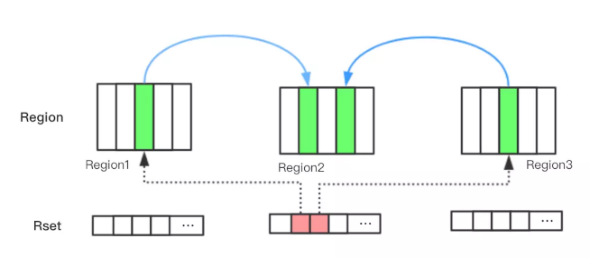

当年轻代的Eden区用尽时开始年轻代回收过程；G1的年轻代收集阶段是一个并行的独占式收集器。在年轻代回收期，G1GC暂停所有应用程序线程，启动多线程执行年轻代回收。然后从年轻代区间移动存活对象到Survivor区间或者老年区间，也有可能是两个区间都会涉及。


#### 触发新生代 + 老年代的混合垃圾回收

G1有一个参数，是“-XX:InitiatingHeapOccupancyPercent”，他的默认值是45%, 意思就是说，如果老年代占据了堆内存的45%的Region的时候，此时就会尝试触发一个新生代+老年代一起回收的混合回收阶段。

比如按照我们之前说的，堆内存有2048个Region，如果老年代占据了其中45%的Region，也就是接近1000个Region的时候，就会开始触发一个混合回收，如下图所示。

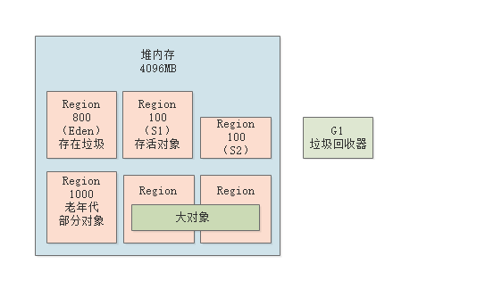


#### G1 回收大致过程

首先会触发一个“初始标记”的操作，这个过程是需要进入“Stop the World”的，仅仅只是标记一下GC  Roots直接能引用的对象，这个过程速度是很快的。

如下图，先停止系统程序的运行，然后对各个线程栈内存中的局部变量代表的GC Roots，以及方法区中的类静态变量代表的GC Roots，进行扫描，标记出来他们直接引用的那些对象。

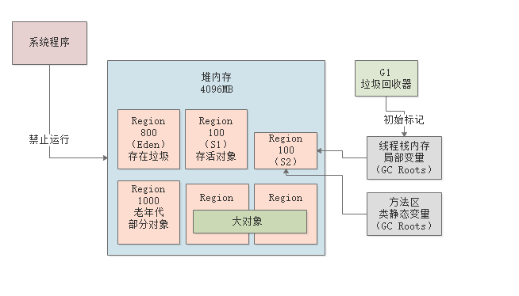

接着会进入“并发标记”的阶段，这个阶段会允许系统程序的运行，同时进行GC Roots追踪，从GC Roots开始追踪所有的存活对象，如下图所示。

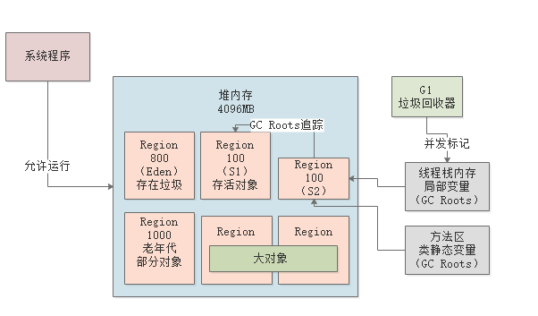

接着是下一个阶段，最终标记阶段，这个阶段会进入“Stop the World”，系统程序是禁止运行的，但是会根据并发标记 阶段记录的那些对象修改，最终标记一下有哪些存活对象，有哪些是垃圾对象，如下图所示。

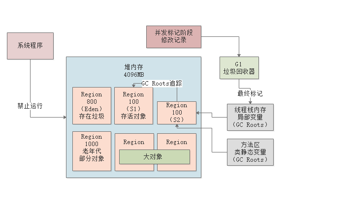

最后一个阶段，就是“混合回收“阶段，这个阶段会计算老年代中每个Region中的存活对象数量，存活对象的占比，还有执行垃圾回收的预期性能和效率。

比如说老年代此时有1000个Region都满了，但是因为根据预定目标，本次垃圾回收可能只能停顿200毫秒，那么通过之前的计算得知，可能回收其中800个Region刚好需要200ms，那么就只会回收800个Region，把GC导致的停顿时间控制在我们指定的范围内，如下图。


因为我们设定了对GC停顿时间的目标，所以说他会从新生代、老年代、大对象里各自挑选一些Region，保证用指定的时间（比如200ms）回收尽可能多的垃圾，这就是所谓的混合回收，如下图。

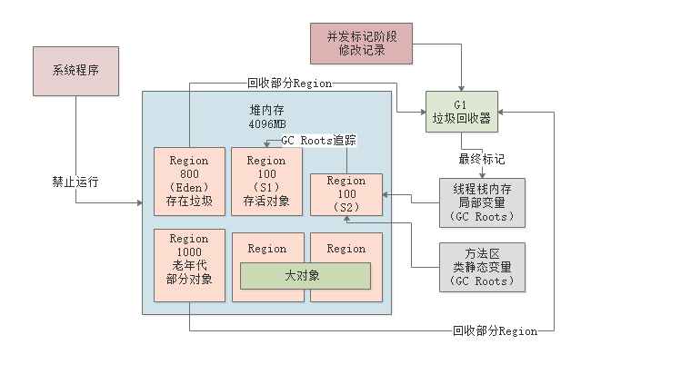

当老年代Region占据了堆内存Region的45%以后，会触发一个混合回收的过程也就是MixGC，根据我们设置的停顿时间，G1无法在一次MixGC中完成全部回收，那么就需要回收多次，该参数由XX:G1MixedGCCountTarget控制，默认为8次，并且G1 还有一个参数`-XX:G1HeapWastePercent`用于控制当堆内存空闲比达到多少时就停止回收，默认值是5%.

G1整体是基于复制算法对Region进行垃圾回收的，所以不存在内存碎片问题，但是回收这些Region是有条件的, G1通过参数`XX:G1MixedGCLiveThresholdPercent` 来控制当Region中存活对象小于设定比较例才会进行回收，默认值是85%


#### G1回收过程一：年轻代GC

年轻代垃圾回收只会回收Eden区和Survivor区。

首先G1停止应用程序的执行（Stop-The-World），G1创建回收集（Collection Set），回收集是指需要被回收的内存分段的集合，年轻代回收过程的回收集包含年轻代Eden区和Survivor区所有的内存分段。G1 依据GCRoot 以及 RSet 向下追溯标记存活对象


然后开始如下回收过程：

1. 第一阶段，扫描根。根是指static变量指向的对象，正在执行的方法调用链条上的局部变量等。根引用连同RSet记录的外部引用作为扫描存活对象的入口。
2. 第二阶段，更新RSet。处理dirty card queue（见备注）中的card，更新RSet。此阶段完成后，RSet可以准确的反映老年代对所在的内存分段中对象的引用。
3. 第三阶段，处理RSet。识别被老年代对象指向的Eden中的对象，这些被指向的Eden中的对象被认为是存活的对象。
4. 第四阶段，复制对象。此阶段，对象树被遍历，Eden区内存段中存活的对象会被复制到Survivor区中空的内存分段，Survivor区内存段中存活的对象如果年龄未达阈值，年龄会加1，达到阀值会被会被复制到Old区中空的内存分段。如果Survivor空间不够，Eden空间的部分数据会直接晋升到老年代空间。
5. 第五阶段，处理引用。处理Soft，Weak，Phantom，Final，JNI Weak 等引用。最终Eden空间的数据为空，GC停止工作，而目标内存中的对象都是连续存储的，没有碎片，所以复制过程可以达到内存整理的效果，减少碎片。


#### G1回收过程二：并发标记过程

G1有一个参数：“-XX：InitiatingHeapOccupancyPercent”,默认值是45%, 也就是说，**当老年代的大小占据了堆内存的45%的Region时，此时就会触发一个新生代和老年代的混合回收阶段，对E S 0 H进行全面回收**。

1. 初始标记阶段：标记从根节点直接可达的对象。这个阶段是STW的，并且会触发一次年轻代GC。
2. 根区域扫描（Root Region Scanning）：G1 GC扫描Survivor区直接可达的老年代区域对象，并标记被引用的对象。这一过程必须在YoungGC之前完成。
3. 并发标记（Concurrent Marking）：在整个堆中进行并发标记（和应用程序并发执行），此过程可能被YoungGC中断。在并发标记阶段，若发现区域对象中的所有对象都是垃圾，那这个区域会被立即回收。同时，并发标记过程中，会计算每个区域的对象活性（区域中存活对象的比例）。
4. 再次标记（Remark）：由于应用程序持续进行，需要修正上一次的标记结果。是STW的。G1中采用了比CMS更快的初始快照算法：snapshot-at-the-beginning（SATB）。
5. 独占清理（cleanup，STW）：计算各个区域的存活对象和GC回收比例，并进行排序，识别可以混合回收的区域。为下阶段做铺垫。是STW的，**。这个阶段并不会实际上去做垃圾的收集**
6. 并发清理阶段：识别并清理完全空闲的区域。


#### G1回收过程三：混合回收

当越来越多的对象晋升到老年代o1d region时，为了避免堆内存被耗尽，虚拟机会触发一个混合的垃圾收集器，即Mixed GC，该算法并不是一个Old GC，除了回收整个Young Region，还会回收一部分的Old Region。这里需要注意：是一部分老年代，而不是全部老年代。可以选择哪些Old Region进行收集，从而可以对垃圾回收的耗时时间进行控制。也要注意的是Mixed GC并不是Full GC。

该阶段一旦触发会导致系统进入STW，同时进行最后一个标记：

- 最终标记阶段：会根据并发标记阶段记录的对象修改，最终标记哪些对象是存活，哪些对象是垃圾

此时老年代也是根据标记-复制算法来进行回收的，会将标记存活的对象拷贝到新的Region中作为老年代区域：

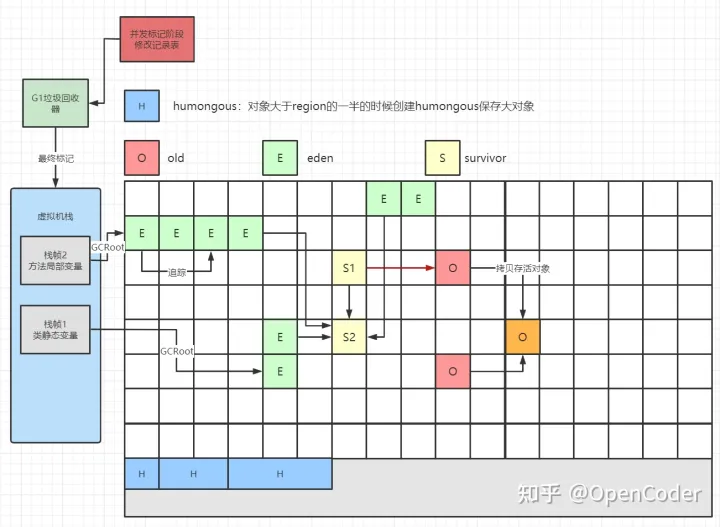

注意我们上面说过一个参数：**-XX：MaxGCPauseMillis=time** 指定收集的停顿时间，**默认是200ms**

由于混合回收是一个比较耗时的操作，那么根据G1的特点可以指定收集停顿时间，为了保证停顿时间这个目标，JVM会从新生代、老年代、以及大对象H区挑选一部分Region进行拷贝回收，如果回收不完，后续再进行回收，一部分一部分回收直到回收完毕。但是一次回收停顿的时长保证再200ms。

这里有一个参数：**“-XX：G1MixedGCCountTarget”**，可以设置在一次混合回收的过程中，最后一个阶段执行几次混合回收，默认值是8次！这样设置的目的也是能让每次回收停顿的时长记得到保证同时又能间隙的让系统接着运行。

同时还有一个参数：**“-XX：G1HeapWastePercent”**,默认值是5%，意思是当混合回收的时候，一旦空闲出来的Region数量达到了堆内存的5%，此时就会立即停止混合回收


#### G1回收可选的过程四：Full GC

G1的初衷就是要避免Full GC的出现。但是如果上述方式不能正常工作，G1会停止应用程序的执行（Stop-The-World），使用单线程的内存回收算法进行垃圾回收，性能会非常差，应用程序停顿时间会很长。

要避免Full GC的发生，一旦发生需要进行调整。什么时候会发生Full GC呢？比如堆内存太小，当G1在复制存活对象的时候没有空的内存分段可用，则会回退到Full GC，这种情况可以通过增大内存解决。

导致G1 Full GC的原因可能有两个：

- Evacuation的时候没有足够的to-space来存放晋升的对象；
- 并发处理过程完成之前空间耗尽。


## JVM 排查工具

- **`jps`** (JVM Process Status）: 类似 UNIX 的 `ps` 命令。用户查看所有 Java 进程的启动类、传入参数和 Java 虚拟机参数等信息；

- **`jstat`**（ JVM Statistics Monitoring Tool）: 用于收集 HotSpot 虚拟机各方面的运行数据;

- **`jinfo`** (Configuration Info for Java) : Configuration Info forJava,显示虚拟机配置信息;

- **`jmap`** (Memory Map for Java) :生成堆转储快照;

- **`jhat`** (JVM Heap Dump Browser ) : 用于分析 heapdump 文件，它会建立一个 HTTP/HTML 服务器，让用户可以在浏览器上查看分析结果;

- **`jstack`** (Stack Trace for Java):生成虚拟机当前时刻的线程快照，线程快照就是当前虚拟机内每一条线程正在执行的方法堆栈的集合。

- MAT ：图形化展示 jvm 堆中的内存情况

- perfma ： jvm的在线分析工具

- useful-scripts：使用 jstack 分析线程性能

-  Arthas ：排查java性能

  


## 常见其他面试题

### Class.forName 与 ClassLoader 的区别

ClassLoader 加载的类不会对类对象进行实例化，而Class.forName 加载的类会对类进行实例化，主要依据与Class.forName 中的 initalize 参数

ClassLoader是采用双亲委派机制来进行加载类的，当加载类是，自底向上检查类是否已经加载如过没有加载该类的话，默认会自顶向下的尝试进行加载Class.forName 默认打破了 双亲委派机制，直接调用当前的类加载器进行加载ClassLoader加载的类默认不会对该类进行实例化操作，而Class.forName 会实例化类对象（参数可控制）

加载类文件时首先会用findLoadedClass 来 查找已经加载的类文件 是否存在，如过不存在则调用parent.loadClass来查看当前class文件 是否加载 ，最后当parent为null的时候则调用 最顶层的BootstarpClassloader来尝试加载，如过还是加载不到的话 最后自订而下的调用 findClass来尝试加载如过加载到则尝试返回如过加载不到则 使用child来加载


原理：
使用Class.forName() 来加载 class文件 ：

```java
//Class.forName 和 classLoader.loadClass的区别
public static Class<?> forName(String name, boolean initialize,
               ClassLoader loader)
```

如何initialize 为True的话 则表示当前的class对象需要初始化，而loadClass则表示当前的类对象不需要初始化，（如过一个类中有 static方法的话）默认一个java对象初始化，首先需要初始化类对象，然后再初始化对象实例，在对象头中会放入当前类实例的指针。如过当前类有继承类的话默认会先初始化父类的class实例，然后初始化子类的class实例，然后初始化父类的构造方法，然后初始化子类的构造方法

类的加载方式分为三种：

- 隐式加载： new 关键字（先初class对象实例，然后初始化static变量，然后初始化static静态代码块，
  然后初始化本地变量表，然后初始化构造器，如过当前类没有继承任何其他类的话，默认会调用Object的构
  造方法来进行初始化）
- 显式加载：loadClass 
- Class.forName方法


## JVM 常用运行时参数

| 参数名称                   | 含义                                                       | 默认值               | 说明                                                         |
| -------------------------- | ---------------------------------------------------------- | -------------------- | ------------------------------------------------------------ |
| -Xms                       | 初始堆大小                                                 | 物理内存的1/64(<1GB) | 默认(MinHeapFreeRatio参数可以调整)空余堆内存小于40%时，JVM就会增大堆直到-Xmx的最大限制. |
| -Xmx                       | 最大堆大小                                                 | 物理内存的1/4(<1GB)  | 默认(MaxHeapFreeRatio参数可以调整)空余堆内存大于70%时，JVM会减少堆直到 -Xms的最小限制 |
| -Xmn                       | 年轻代大小(1.4or lator)                                    |                      | 注意：此处的大小是（eden+ 2 survivor space).与jmap -heap中显示的New gen是不同的。整个堆大小=年轻代大小 + 老年代大小 + 持久代（永久代）大小.增大年轻代后,将会减小年老代大小.此值对系统性能影响较大,Sun官方推荐配置为整个堆的3/8 |
| -XX:NewSize                | 设置年轻代大小(for 1.3/1.4)                                |                      |                                                              |
| -XX:MaxNewSize             | 年轻代最大值(for 1.3/1.4)                                  |                      |                                                              |
| -XX:PermSize               | 设置持久代(perm gen)初始值                                 | 物理内存的1/64       |                                                              |
| -XX:MaxPermSize            | 设置持久代最大值                                           | 物理内存的1/4        |                                                              |
| -Xss                       | 每个线程的堆栈大小                                         |                      | JDK5.0以后每个线程堆栈大小为1M,以前每个线程堆栈大小为256K.根据应用的线程所需内存大小进行 调整.在相同物理内存下,减小这个值能生成更多的线程.但是操作系统对一个进程内的线程数还是有限制的,不能无限生成,经验值在3000~5000左右一般小的应用， 如果栈不是很深， 应该是128k够用的 大的应用建议使用256k。这个选项对性能影响比较大，需要严格的测试。（校长）和threadstacksize选项解释很类似,官方文档似乎没有解释,在论坛中有这样一句话:-Xss is translated in a VM flag named ThreadStackSize”一般设置这个值就可以了 |
| -XX:NewRatio               | 年轻代(包括Eden和两个Survivor区)与年老代的比值(除去持久代) |                      | -XX:NewRatio=4表示年轻代与年老代所占比值为1:4,年轻代占整个堆栈的1/5Xms=Xmx并且设置了Xmn的情况下，该参数不需要进行设置。 |
| -XX:SurvivorRatio          | Eden区与Survivor区的大小比值                               |                      | 设置为8,则两个Survivor区与一个Eden区的比值为2:8,一个Survivor区占整个年轻代的1/10 |
| -XX:+DisableExplicitGC     | 关闭System.gc()                                            |                      | 这个参数需要严格的测试                                       |
| -XX:PretenureSizeThreshold | 对象超过多大是直接在旧生代分配                             | 0                    | 单位字节 新生代采用Parallel ScavengeGC时无效另一种直接在旧生代分配的情况是大的数组对象,且数组中无外部引用对象. |
| -XX:ParallelGCThreads      | 并行收集器的线程数                                         |                      | 此值最好配置与处理器数目相等 同样适用于CMS                   |
| -XX:MaxGCPauseMillis       | 每次年轻代垃圾回收的最长时间(最大暂停时间)                 |                      | 如果无法满足此时间,JVM会自动调整年轻代大小,以满足此值.       |


-XX:-UseBiasedLocking
是否开启偏向锁，如果开启偏向锁则存在 撤销偏向锁的开销，但是 可以提升性能

-XX:+ScavengeBeforeFullGC
在进行fullGC时先进行YGC。 


### GC 日志参数

1、GC 打印日志参数

- -XX:+PrintHeapAtGC 

  每一次GC前和GC后，都打印堆信息 

- -XX:+PrintGC

  这个打印的GC信息跟上个一样，就不做介绍了

- -XX:+PrintGCDetails 

  打印GC的详细信息。格式如下：

2、GC 写入日志参数

- -XX:+UseGCLogFileRotation 

- -XX:NumberOfGCLogFiles=5  

3、堆溢出时生成的内存快照

- -XX:+HeapDumpOnOutOfMemoryError  

    当首次遭遇内存溢出时Dump出此时的堆内存 

- -XX:HeapDumpPath=   ./java_pid.hprof 

  指定Dump堆内存时的路径 


### ParNew 收集器参数

```
-XX:+UseParNewGC

//限制线程数量，默认开启和CPU数据相同的线程数
-XX:ParallelGCThreads
```


### Prarallel Scavenge

- -XX:+UseParallelGC 
- -XX:+UseParallelOldGC 手动指定老年代都是使用并行回收收集器。 
  分别适用于新生代和老年代。默认jdk8是开启的。
  上面两个参数，默认开启一个，另一个也会被开启。（互相激活）
-  -XX:ParallelGCThreads 设置年轻代并行收集器的线程数。一般地，最好与CPU数量相等，以避免过多的线程数影响垃圾收集性能。  
   -XX:MaxGCPauseMillis 设置垃圾收集器最大停顿时间（即STw的时间）。单位是毫秒。 
-  -XX:GCTimeRatio 垃圾收集时间占总时间的比例（=1/（N+1））。用于衡量吞吐量的大小。 
  取值范围（0, 100）。默认值99，也就是垃圾回收时间不超过1%。
  与前一个-XX:MaxGCPauseMillis参数有一定矛盾性。暂停时间越长，Radio参数就容易超过设定的比例。
- -XX:+UseAdaptivesizePolicy 设置Parallel Scavenge收集器具有自适应调节策略 
  在这种模式下，年轻代的大小、Eden和Survivor的比例、晋升老年代的对象年龄等参数会被自动调整，已达到在堆大小、吞吐量和停顿时间之间的平衡点。

在手动调优比较困难的场合，可以直接使用这种自适应的方式，仅指定虚拟机的最大堆、目标的吞吐量（GCTimeRatio）和停顿时间（MaxGCPauseMills），让虚拟机自己完成调优工作。


### CMS 参数

- `-XX:+UseConcMarkSweepGC`手动指定使用CMS收集器执行内存回收任务。
  开启该参数后会自动将`-xx:+UseParNewGC`打开。即：ParNew（Young区用）+CMS（Old区用）+ Serial Old的组合。 

-  `-XX:CMSInitiatingOccupanyFraction` 设置堆内存使用率的阈值，一旦达到该阈值，便开始进行回收。 
- JDK5及以前版本的默认值为68，即当老年代的空间使用率达到68%时，会执行一次CMS回收。JDK6及以上版本默认值为92%
- 如果内存增长缓慢，则可以设置一个稍大的值，大的阀值可以有效降低CMS的触发频率，减少老年代回收的次数可以较为明显地改善应用程序性能。反之，如果应用程序内存使用率增长很快，则应该降低这个阈值，以避免频繁触发老年代串行收集器。因此通过该选项便可以有效降低Ful1Gc的执行次数。
-  `-XX:+UseCMSCompactAtFullCollection` 用于指定在执行完Full GC后对内存空间进行压缩整理，以此避免内存碎片的产生。不过由于内存压缩整理过程无法并发执行，所带来的问题就是停顿时间变得更长了。 
-  `-XX:CMSFullGCsBeforeCompaction` 设置在执行多少次Full GC后对内存空间进行压缩整理。 
-  `-XX:ParallelcMSThreads` 设置CMS的线程数量。 
- CMS默认启动的线程数是（ParallelGCThreads+3）/4，ParallelGCThreads是年轻代并行收集器的线程数。当CPU资源比较紧张时，受到CMS收集器线程的影响，应用程序的性能在垃圾回收阶段可能会非常糟糕


### G1 参数

| 可选项及默认值                       | 描述                                                         |
| :----------------------------------- | :----------------------------------------------------------- |
| -XX:+UseG1GC                         | 采用 Garbage First (G1) 收集器                               |
| -XX:MaxGCPauseMillis=n               | 设置最大GC 暂停时间。这是一个大概值，JVM 会尽可能的满足此值  |
| -XX:InitiatingHeapOccupancyPercent=n | 设置触发标记周期的 Java 堆占用率阈值。默认占用率是整个 Java 堆的 45%。默认值 45. |
| -XX:NewRatio=n                       | new/old 年代的大小比例. 默认值 2.                            |
| -XX:SurvivorRatio=n                  | eden/survivor 空间的大小比例. 默认值 8.                      |
| -XX:MaxTenuringThreshold=n           | 对象晋升年代的最大阀值。默认值 15.这个参数需要注意的是：最大值是15，不要超过这个数啊，要不然会被人笑话。原因为：JVM内部使用 4 bit （1111）来表示这个数。 |
| -XX:ParallelGCThreads=n              | 设置在垃圾回收器的并行阶段使用的线程数。默认值因与 JVM 运行的平台而不同。 |
| -XX:ConcGCThreads=n                  | 并发垃圾收集器使用的线程数。默认值因与 JVM 运行的平台而不同。 |
| -XX:G1ReservePercent=n               | 设置作为空闲空间的预留内存百分比以降低晋升失败的可能性。默认值10 |
| -XX:G1HeapRegionSize=n               | 使用G1，Java堆被划分为大小均匀的区域。这个参数配置各个子区域的大小。此参数的默认值根据堆大小的人工进行确定。最小值为 1Mb 且最大值为 32Mb。 |
| -XX:G1PrintRegionLivenessInfo        | 默认值false, 在情理阶段的并发标记环节,输出堆中的所有 regions 的活跃度信息 |
| -XX:G1PrintHeapRegions               | 默认值false, G1 将输出那些 regions 被分配和回收的信息        |

-XX:MaxGCPauseMillis

暂停时间，默认值200ms。这是一个软性目标，G1会尽量达成，如果达不成，会逐渐做自我调整。

对于Young GC来说，会逐渐减少Eden区个数，减少Eden空间那么Young GC的处理时间就会相应减少。对于Mixed GC，G1会调整每次Choose Cset的比例，默认最大值是10%，当然每次选择的Cset少了，所要经历的Mixed GC的次数会相应增加。

减少Eden的总空间时，就会更加频繁的触发Young GC，也就是会加快Mixed GC的执行频率，因为Mixed GC是由Young GC触发的，或者说借机同时执行的。频繁GC会对对应用的吞吐量造成影响，每次Mixed GC回收时间太短，回收的垃圾量太少，可能最后GC的垃圾清理速度赶不上应用产生的速度，那么可能会造成串行的Full GC，这是要极力避免的。所以暂停时间肯定不是设置的越小越好，当然也不能设置的偏大，转而指望G1自己会尽快的处理，这样可能会导致一次全部并发标记后触发的Mixed GC次数变少，但每次的时间变长，STW时间变长，对应用的影响更加明显。

-XX:G1HeapRegionSize

Region大小，若未指定则默认最多生成2048块，每块的大小需要为2的幂次方，如1,2,4,8,16,32，最大值为32M。Region的大小主要是关系到Humongous Object的判定，当一个对象超过Region大小的一半时，则为巨型对象，那么其会至少独占一个Region，如果一个放不下，会占用连续的多个Region。当一个Humongous Region放入了一个巨型对象，可能还有不少剩余空间，但是不能用于存放其他对象，这些空间就浪费了。所以如果应用里有很多大小差不多的巨型对象，可以适当调整Region的大小，尽量让他们以普通对象的形式分配，合理利用Region空间。

-XX:G1NewSizePercent和-XX:G1MaxNewSizePercent

新生代比例有两个数值指定，下限：-XX:G1NewSizePercent，默认值5%，上限：-XX:G1MaxNewSizePercent，默认值60%。G1会根据实际的GC情况(主要是暂停时间)来动态的调整新生代的大小，主要是Eden Region的个数。最好是Eden的空间大一点，毕竟Young GC的频率更大，大的Eden空间能够降低Young GC的发生次数。但是Mixed GC是伴随着Young GC一起的，如果暂停时间短，那么需要更加频繁的Young GC，同时也需要平衡好Mixed GC中新生代和老年代的Region，因为新生代的所有Region都会被回收，如果Eden很大，那么留给老年代回收空间就不多了，最后可能会导致Full GC。

-XX:ConcGCThreads

通过 -XX:ConcGCThreads来指定并发GC线程数，默认是-XX:ParallelGCThreads/4，也就是在非STW期间的GC工作线程数，当然其他的线程很多工作在应用上。当并发周期时间过长时，可以尝试调大GC工作线程数，但是这也意味着此期间应用所占的线程数减少，会对吞吐量有一定影响。

-XX:ParallelGCThreads

通过-XX:ParallelGCThreads来指定并行GC线程数，也就是在STW阶段工作的GC线程数，其值遵循以下原则：

如果用户显示指定了ParallelGCThreads，则使用用户指定的值。否则需要根据实际的CPU所能够支持的线程数来计算ParallelGCThreads的值。如果物理CPU所能够支持线程数小于8，则ParallelGCThreads的值为CPU所支持的线程数。这里的阀值为8，是因为JVM中调用nof_parallel_worker_threads接口所传入的switch_pt的值均为8。如果物理CPU所能够支持线程数大于8，则ParallelGCThreads的值为8加上一个调整值，调整值的计算方式为：物理CPU所支持的线程数减去8所得值的5/8或者5/16，JVM会根据实际的情况来选择具体是乘以5/8还是5/16。ParallelGCThreads= 8 + (N - 8) * 5 / 8 比如，在64线程的x86 CPU上，如果用户未指定ParallelGCThreads的值，则默认的计算方式为：ParallelGCThreads = 8 + (64 - 8) * (5/8) = 8 + 35 = 43。

-XX:G1MixedGCLiveThresholdPercent

通过这个参数指定被纳入Cset的Region的存活空间占比阈值，不同版本默认值不同，有65%和85%。在全局并发标记阶段，如果一个Region的存活对象的空间占比低于此值，则会被纳入Cset。此值直接影响到Mixed GC选择回收的区域，当发现GC时间较长时，可以尝试调低此阈值，尽量优先选择回收垃圾占比高的Region，但此举也可能导致垃圾回收的不够彻底，最终触发Full GC。

-XX:InitiatingHeapOccupancyPercent

通过这个参数指定触发全局并发标记的老年代使用占比，默认值45%，也就是老年代占堆的比例超过45%。如果Mixed GC周期结束后老年代使用率还是超过45%,那么会再次触发全局并发标记过程，这样就会导致频繁的老年代GC，影响应用吞吐量。同时老年代空间不大，Mixed GC回收的空间肯定是偏少的。可以适当调高IHOP的值，当然如果此值太高，很容易导致年轻代晋升失败而触发Full GC，所以需要多次调整测试。

-XX:G1HeapWastePercent

通过这个参数指定触发Mixed GC的堆垃圾占比，默认值5%，也就是在全局标记结束后能够统计出所有Cset内可被回收的垃圾占整对的比例值，如果超过5%，那么就会触发之后的多轮Mixed GC，如果不超过，那么会在之后的某次Young GC中重新执行全局并发标记。可以尝试适当的调高此阈值，能够适当的降低Mixed GC的频率。

-XX:G1OldCSetRegionThresholdPercent

通过这个参数指定每轮Mixed GC回收的Region最大比例，默认10%，也就是每轮Mixed GC附加的Cset的Region不超过全部Region的10%，最多10%，如果暂停时间短，那么可能会少于10%。一般这个值不需要额外调整。

-XX:G1MixedGCCountTarget

通过这个参数指定一个周期内触发Mixed GC最大次数，默认值8。一次全局并发标记后，最多接着8次Mixed GC，把全局并发标记阶段生成的Cset里的Region拆分为最多8部分，然后在每轮Mixed GC里收集一部分。这个值要和上一个参数配合使用，8*10%=80%，应该来说会大于每次标记阶段的Cset集合了。一般此参数也不需额外调整。

-XX:G1ReservePercent

通过这个参数指定G1为分配担保预留的空间比例，默认10%。也就是老年代会预留10%的空间来给新生代的对象晋升，如果经常发生新生代晋升失败而导致Full GC，那么可以适当调高此阈值。但是调高此值同时也意味着降低了老年代的实际可用空间。

-XX:MaxTenuringThreshold

晋升年龄阈值，默认值15。一般新生对象经过15次Young GC会晋升到老年代，巨型对象会直接分配在老年代，同时在Young GC时，如果相同age的对象占Survivors空间的比例超过 -XX:TargetSurvivorRatio的值(默认50%)，则会自动将此次晋升年龄阈值设置为此age的值，所有年龄超过此值的对象都会被晋升到老年代，此举可能会导致老年代需要不少空间应对此种晋升。一般这个值不需要额外调整。

调优建议

不要手动设置新生代和老年代的大小，只设置这个堆的大小 G1收集器在运行过程中，会自己调整新生代和老年代的大小 其实是通过adapt代的大小来调整对象晋升的速度和年龄，从而达到为收集器设置的暂停时间目标, 如果手动设置了大小就意味着放弃了G1的自动调优。

不断调优暂停时间目标，一般情况下这个值设置到100ms或者200ms， 暂停时间设置的太短，就会导致出现G1跟不上垃圾产生的速度。最终退化成Full GC。所以对这个参数的调优是一个持续的过程，逐步调整到最佳状态。暂停时间只是一个目标，并不能总是得到满足。


## JVM 优化

### 触年轻代进去老年代的几个条件

JVM优化的本质就是要减少full gc的发生，相比于年轻代来说老年代是用于存放长时间存活的对象，所以如果需要对JVM进行优化的话，就需要避免对象进入老年代而触发FullGC。触发对象进入老年代的几个条件如下：

- 1、大对象直接进入老年代，参数：-XX:PretenureSizeThreshold 用于设置大对象进入老年代的阀值
- 2、当对象达到规定年龄时进入老年代，-XX:MaxTenuringThreshold 默认为15次
- 3、动态年龄判定规则，如果一次新生代gc过后，发现Survivor区域中的几个年龄的对象加起来超过了Survivor区域的50%，比如说年龄1+年龄2+年龄3的对象大小总和，超过了Survivor区域的50%，此时就会把年龄3以上的对象都放入老年代。
- 4、新生代垃圾回收过后，存活对象太多了，无法放入 Surviovr中，此时直接进入老年代。

其实上述条件中，第二个和第三个都是很关键的，通常如果你的新生代中的Survivor区域内存过小，就会导致上述第二个和第三个条件频繁发生，然后导致大量对象快速进入老年代，进而频繁触发老年代的gc，如下图。

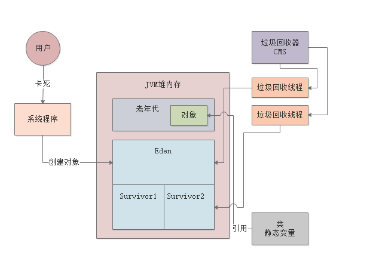


### 触发Full GC的几个条件

触发Full GC的几个条件如下：

- 当老年代空间 < 历次Minor GC 升入老年代对象的平均大小就会触发Full GC

- 当老年代达到阈值时就会触发Full GC，比如CMS垃圾回收器的-XX:CMSInitiatingOccupancyFaction，或者是G1的IHOP值

- 当 Metadata Space 大于其设定阈值时，也会触发Full GC

- 当Minor GC 后升入老年代的对象，老年代空间不足而导致无法存放

  


### 触发Yong GC 的几个条件

Yong GC 其实一般就是在新生代的Eden区域满了之后就会触发，采用复制算法来回收新生代的垃圾


### JVM优化点

JVM 优化最根本的思想还是在于避免对象频繁进入老年代而导致触发Full GC，所以我们要根据上面所提到的这些东西来进行分析优化

1、新生代垃圾回收优化之一，Survivor 空间到底是否足够，如果Survivor 空间无法容纳每次Minor GC 后的存活对象，那么这部分对象就会进入老年代，并且如果该部分对象并非是长时间存活对象那么就会导致老年代内存增加，从而触发Full GC，比如Suvivor 区有100M的空间，每次存活对象有150M，假设这150M对象只能存活两分钟，但是由于Suvivor无法容纳这些对象，根据老年代空间担保机制这些对象就会进入老年代，那么就很有可能导致Full GC的频繁发生

2、G1 垃圾回收的优化点主要在“-XX:MaxGCPauseMills”参数, 因为G1会通过我们设置的值来评估回收这些Region所需要的时间，如果时间过小可能会导致频繁GC，如果过大则可能会导致GC停顿时间过长，并且对于G1来说避免MixGC的思路和其他的垃圾回收期都是一样的思想都是需要避免对象进入老年代

3、通过jstat观察GC的次数、GC耗时以及观察年轻代、老年代内存的增长速率，来总结当前系统需要优化的一些点

4、不要将CMS触发FullGC的阈值设置的过大，因为在CMS垃圾回收器回收的过程中，存在并发标记和并发清理两个过程，这两个过程是不会STW，而是和用户程序一直执行的，如果在这两个过程期间 年轻代GC过后的对象老年代无法存放就会导致Concurrent Mode Failure异常


### JVM 优化分析

JVM 优化分析需要注意点主要有以下几种 ：

> 1、每秒占用多少内存？
>
> 2、多长时间触发一次Minor GC
>
> 3、一般Minor GC 后还有多少存活对象
>
> 4、Survivor 是否可以放得下
>
> 5、会不会频繁因为Suvoivor放不下而导致对象进入老年代
>
> 6、会不会因为动态年龄判断规则进入老年代

但是往往我们拿到一个新的系统后我们需要关注的东西就会比较多，所以我们一般从一下几个方便着手来优化分析

#### 1、一个新的系统开发完毕后如何设置JVM参数

首先大家应该估算一下自己负责的系统每个核心接口每秒多少次请求，每次请求会创建多少个对象，每个对象大概多大，每秒钟会使用多少内存空间？

这样接着就可以估算出来Eden区大概多长时间会占满？

然后就可以估算出来多长时间会发生一次Young GC，而且可以估算一下发生Young GC的时候，会有多少对象存活下来，会有多少对象升入老年代里，老年代对象增长的速率大概是多少，多久之后会触发一次Full GC。

原则就是：尽可能让每次Young GC后存活对象远远小于Survivor区域，避免对象频繁进入老年代触发Full GC。

最理想的状态下，就是系统几乎不发生Full GC，老年代应该就是稳定占用一定的空间，就是那些长期存活的对象在躲过15次Young GC后升入老年代自然占用的。然后平时主要就是几分钟发生一次Young GC，耗时几毫秒。


#### 2、在压测之后合理调整JVM参数

任何一个新系统上线都得进行压测，此时在模拟线上压力的场景下，可以用jstat等工具去观察JVM的运行内存模型：

<ul class=" list-paddingleft-2" style="list-style-type: disc;padding-left:30px;"><li><p style="margin-top: 0px; margin-bottom: 0px; line-height: 2em;">Eden区的对象增长速率多块？</p></li><li><p style="margin-top: 0px; margin-bottom: 0px; line-height: 2em;">Young GC频率多高？</p></li><li><p style="margin-top: 0px; margin-bottom: 0px; line-height: 2em;">一次Young GC多长耗时？</p></li><li><p style="margin-top: 0px; margin-bottom: 0px; line-height: 2em;">Young GC过后多少对象存活？</p></li><li><p style="margin-top: 0px; margin-bottom: 0px; line-height: 2em;">老年代的对象增长速率多高？</p></li><li><p style="margin-top: 0px; margin-bottom: 0px; line-height: 2em;">Full GC频率多高？</p></li><li><p style="margin-top: 0px; margin-bottom: 0px; line-height: 2em;">一次Full GC耗时？</p></li></ul>

压测时可以完全精准的通过jstat观察出来上述JVM运行指标，让我们对JVM运行时的情况了如指掌。然后就可以尽可能的优化JVM的内存分配，尽量避免对象频繁进入老年代，尽量让系统仅仅有Young GC。


#### 3、线上系统的监控和优化

系统上线之后，务必进行一定的监控，高大上的做法就是通过Zabbix、Open-Falcon之类的工具来监控机器和JVM的运行，频繁Full GC就要报警。比较差一点的做法，就是在机器上运行jstat，让其把监控信息写入一个文件，每天定时检查一下看一看。

一旦发现频繁Full GC的情况就要进行优化，优化的核心思路是类似的：通过jstat分析出来系统的JVM运行指标，找到Full GC的核心问题，然后优化一下JVM的参数，尽量让对象别进入老年代，减少Full GC的频率。


#### 4、线上频繁 Full GC的几种表现

总结起来就是，一旦系统发生频繁Full GC，大概看到的一些表象如下：

<ul class=" list-paddingleft-2" style="list-style-type: disc;padding-left:30px;"><li><p style="margin-top: 0px; margin-bottom: 0px; line-height: 2em;">机器CPU负载过高；</p></li><li><p style="margin-top: 0px; margin-bottom: 0px; line-height: 2em;">频繁Full GC报警；</p></li><li><p style="margin-top: 0px; margin-bottom: 0px; line-height: 2em;">系统无法处理请求或者处理过慢</p></li></ul>


#### 5、频繁Full GC的几种常见原因

①、 系统承载高并发请求，或者处理数据量过大，导致Young GC很频繁，而且每次Young GC过后存活对象太多，内存分配不合理，Survivor区域过小，导致对象频繁进入老年代，频繁触发Full GC。

②、系统一次性加载过多数据进内存，搞出来很多大对象，导致频繁有大对象进入老年代，必然频繁触发Full GC

③、系统发生了内存泄漏，莫名其妙创建大量的对象，始终无法回收，一直占用在老年代里，必然频繁触发Full GC

④、Metaspace（永久代）因为加载类过多触发Full GC

⑤、误调用System.gc()触发Full GC

> 其实常见的频繁Full GC原因无非就上述那几种，所以大家在线上处理Full GC的时候，就从这几个角度入手去分析即可，核心利器就是jstat。
>
> 如果jstat分析发现Full GC原因是第一种，那么就合理分配内存，调大Survivor区域即可。
>
> 如果jstat分析发现是第二种或第三种原因，也就是老年代一直有大量对象无法回收掉，年轻代升入老年代的对象病不多，那么就dump出来内存快照，然后用MAT工具进行分析即可
>
> 通过分析，找出来什么对象占用内存过多，然后通过一些对象的引用和线程执行堆栈的分析，找到哪块代码弄出来那么多的对象的。接着优化代码即可。
>
> 如果jstat分析发现内存使用不多，还频繁触发Full GC，必然是第四种和第五种，此时对应的进行优化即可。


### CMS 与 G1的区别

1、首先G1有可预测的停顿模型，可以设置其停顿时间，这对于大内存来说是比较重要的，因为对比于ParNew来说如果年轻代过大，就有可能导致年轻代垃圾回收时时间过长，因为 Minor GC 是需要STW的

2、CMS 与 G1 在内存划分上也是不一样的，对于CMS垃圾回收期来说，JVM 还是传统的年轻代 + 老年代 + 元空间，而G1则是把内存划分成了相同大小的Region, 并且将这些Region划分老年代、年轻代等等，虽然G1也有年轻代和老年代，但是都是从逻辑上划分的，根据我们所设置的年轻代或者老年代大小，G1会去动态调整，主要是为了较少GC次数

3、CMS 只是针对老年代进行垃圾回收，而G1则是针对整个堆，划分为三个过程分别是年轻代GC、全局并发标记、Mix GC

4、CMS 使用的是 标记清除的回收算法，而G1则是通过复制算法对正堆进行回收

5、G1 从用了STAB 算法来解决传统三色标记算法的漏标过程

6、对于大内存来说 G1要比CMS 更适合，因为G1 可以控制垃圾回收停顿的时间，虽然对于CMS来说是可以和程序并行的去回收，但是对于年轻代还是需要STW的，并且内存越大 STW的时间就要越长

其实G1 与 CMS 最核心的问题就在于，G1内部都是自动调节的，而不需要我们去过度干预的，G1会根据我们设置的停顿时间来进行计算是否需要回收，回收几次，如果设置的时间过短就会触发过多的回收次数，而CMS 更关注的问题是避免 年轻代进入老年代，减少FullGC的次数

总结一下就是 CMS 是传统的针对老年代进行回收的垃圾回收期，而G1 则是面向JVM整个堆，所以在实现上 G1要比CMS复杂很多，


### JVM的问题

JVM 一般表现出的问题在于内存溢出、内存泄漏 以及GC次数过多这三个问题：

- 内存溢出： 内存溢出与内存泄漏是比较相同的，常见原因比如：大对象进入老年代无法回收，S区无法存放对象放入老年代无法回收，总的表现出来点是这些对象确实是在使用的，但是又不能进行回收，就会导致内存溢出，通常表现为 年轻代还没有使用完就触发YongGC，那么就可以断定是Full GC触发带动的Yong GC，这个时候就要判断老年代为什么频繁触发Full GC
- 内存泄漏：内存泄漏与 内存溢出大体上是相同的，不同的点是，这些对象本质上是应该被回收的，但是却没有被回收，就会导致这些对象年龄增大，符合进入老年代的条件，那么就会在老年代一直存活，而无法被回收直到触发Full GC多次也无法被回收
- GC 次数过多：分为老年代与年轻代
  - Yong GC过多的点在于两个，一个是年轻代过小，一个是Full GC触发时 带动的 Yong GC
  - Full GC 过多的点也在于两个，一个是内存泄漏导致的老年代对象过多，另一个是年轻代 过小导致存活对象直接进入老年代，或者是大对象、对象年龄等等问题


### JVM调优的工具

#### jstat

jstat 可以用于查看对象增长的速率，Young GC的触发频率，Young GC的耗时，每次Young GC后有多少对象是存活下来的，每次Young GC过后有多少对象进入了老年代，老年代对象增长的速率，Full GC的触发频率，Full GC的耗时。

<ol class="undefined list-paddingleft-2"><li><p style="line-height: 2em;"><span class="author-p-53348239">S0C：这是From Survivor区的大小</span></p><p style="line-height: 2em;"><span class="author-p-53348239"></span></p></li><li><p style="line-height: 2em;"><span class="author-p-53348239">S1C：这是To Survivor区的大小</span></p></li><li><p style="line-height: 2em;"><span class="author-p-53348239">S0U：这是From Survivor区当前使用的内存大小</span></p></li><li><p style="line-height: 2em;"><span class="author-p-53348239">S1U：这是To Survivor区当前使用的内存大小</span></p></li><li><p style="line-height: 2em;"><span class="author-p-53348239">EC：这是Eden区的大小</span></p></li><li><p style="line-height: 2em;"><span class="author-p-53348239">EU：这是Eden区当前使用的内存大小</span></p></li><li><p style="line-height: 2em;"><span class="author-p-53348239">OC：这是老年代的大小</span></p></li><li><p style="line-height: 2em;"><span class="author-p-53348239">OU：这是老年代当前使用的内存大小</span></p></li><li><p style="line-height: 2em;"><span class="author-p-53348239">MC：这是方法区（永久代、元数据区）的大小</span></p></li><li><p style="line-height: 2em;"><span class="author-p-53348239">MU：这是方法区（永久代、元数据区）的当前使用的内存大小</span></p></li><li><p style="line-height: 2em;"><span class="author-p-53348239">YGC：这是系统运行迄今为止的Young GC次数</span></p></li><li><p style="line-height: 2em;"><span class="author-p-53348239">YGCT：这是Young GC的耗时</span></p></li><li><p style="line-height: 2em;"><span class="author-p-53348239">FGC：这是系统运行迄今为止的Full GC次数</span></p></li><li><p style="line-height: 2em;"><span class="author-p-53348239">FGCT：这是Full GC的耗时</span></p></li><li><p style="line-height: 2em;"><span class="author-p-53348239">GCT：这是所有GC的总耗时</span></p></li></ol>


除了上述的jstat -gc ，还有很多其他用于查看 gc的option选项

<ol class="undefined list-paddingleft-2"><li><p style="line-height: 2em;"><span class="author-p-53348239">jstat -gccapacity PID：堆内存分析</span></p><p style="line-height: 2em;"><span class="author-p-53348239"></span></p></li><li><p style="line-height: 2em;"><span class="author-p-53348239">jstat -gcnew PID：年轻代GC分析，这里的TT和MTT可以看到对象在年轻代存活的年龄和存活的最大年龄</span></p></li><li><p style="line-height: 2em;"><span class="author-p-53348239">jstat -gcnewcapacity PID：年轻代内存分析</span></p></li><li><p style="line-height: 2em;"><span class="author-p-53348239">jstat -gcold PID：老年代GC分析</span></p></li><li><p style="line-height: 2em;"><span class="author-p-53348239">jstat -gcoldcapacity PID：老年代内存分析</span></p></li><li><p style="line-height: 2em;"><span class="author-p-53348239">jstat -gcmetacapacity PID：元数据区内存分析</span></p></li></ol>


#### jmap 与 jhat

jmap -heap 可以查看当前jvm运行时的内存使用情况

jmap -histio 可以查看当前系统按照对象占用内存空间的大小降序排列

jmap -dump:live,format=b,file=dump.hprof PID，可以dump出当前堆内存的快照

jhat -port 端口 dump.hprof 可以图形化的分析内存里的对象分布情况


### GC 优化案例

其实简单的一句话就是: **尽量让每次Young GC后的存活对象小于Survivor区域的50%，都留存在年轻代里。尽量别让对象进入老年代。尽量减少Full GC的频率，避免频繁Full GC对JVM性能的影响。**

正常情况下的系统，会有一定频率的Young GC，一般在几分钟一次Young GC，或者几十分钟一次Young GC，一次耗时在几毫秒到几十毫秒的样子，都是正常的。

正常的Full GC频率在几十分钟一次，或者几个小时一次，这个范围内都是正常的，一次耗时应该在几百毫秒的样子。

#### 1、CMS内存脆片导致频繁触发Full GC

对于CMS垃圾回收器来说可能由于老年代并不是每一次Full GC都进行碎片整理，那么就会导致老年代没有连续可用的内存空间，大量的内存碎片会导致很多问题，其中一个问题，就是提高Full GC的频率。


#### 2、CMS 模板参数

对于CMS垃圾回收期还有一个优化点就是 通过开启 -XX:+CMSParallelInitialMarkEnabled，这个参数会在CMS垃圾回收器的“初始标记”阶段开启多线程并发执行。另外一个参数是-XX:+CMSScavengeBeforeRemark，这个参数会在CMS的重新标记阶段之前，先尽量执行一次Young GC。作用是CMS重新标识也会是STW的，所以如果在重新标记之前，先执行一次Young GC，就会回收掉一些年轻代里没有人引用的对象。如果先提前回收掉一些对象，那么在CMS的重新标记阶段就可以少扫描一些对象，此时就可以提升CMS的重新标记阶段的性能，减少他的耗时。CMS 调优模板参数:

```
//堆内存大小或者是永久代、Metadta Space的大小具体根据实际情况去决定
-Xms4096M -Xmx4096M -Xmn3072M -Xss1M  -XX:PermSize=256M -XX:MaxPermSize=256M 
-XX:+UseParNewGC 
-XX:+UseConcMarkSweepGC 
-XX:CMSInitiatingOccupancyFaction=92 
-XX:+UseCMSCompactAtFullCollection 
-XX:CMSFullGCsBeforeCompaction=0 
-XX:+CMSParallelInitialMarkEnabled 
-XX:+CMSScavengeBeforeRemark
-XX:+CMSParallelRemarkEnabled
```


##### 3、大对象进入老年代

如果我们设置了大对象的阈值，那么当对象大小 > 大对象阈值时就会进入老年代，那么就会触发老年代频繁GC，解决办法 通过 jmap -histio 或者是通过Visual VM来对快照进行分析


#### 4、System.gc 频繁触发Full GC

代码中写了System.gc 从而去主要触发Full GC，可以通过参数 `-XX:+DisableExplicitGC` 进行禁用，但是有一个需要注意点就是如果禁用System.gc 之后，那么在执行mmap操作失败后，Java会默认调用System.gc 对改内存进行回收，如果禁用就可能会导致堆外内存无法回收，从而导致内存泄漏，代码来自于FileChannelImpl 如下:

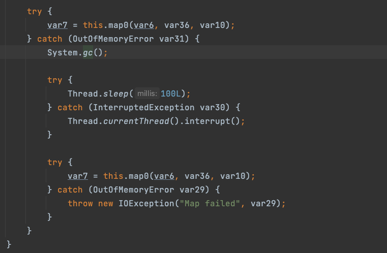


#### 5、线上CPU 负载过高的问题

**第一个场景**：是你自己在系统里创建了大量的线程，这些线程同时并发运行，而且工作负载都很重，过多的线程同时并发运行就会导致你的机器CPU负载过高。

**第二个场景**：，就是你的机器上运行的JVM在执行频繁的Full GC，Full GC是非常耗费CPU资源的，他是一个非常重负载的过程


#### 6、内存泄漏

<div id="text__resolve-main"><p class="paragraph text-align-type-left pap-line-1 pap-line-rule-auto pap-spacing-before-0pt pap-spacing-after-0pt" style="margin-top: 0px; margin-bottom: 0px; white-space: normal; line-height: 16px;"><span style="color: rgb(118, 146, 60); font-weight: bolder; font-size: 17px; line-height: 1.5;"><br></span></p><p class="paragraph text-align-type-left pap-line-1 pap-line-rule-auto pap-spacing-before-0pt pap-spacing-after-0pt" style="margin-top: 0px; margin-bottom: 0px; white-space: normal; line-height: 16px;"><span style="color: rgb(118, 146, 60); font-weight: bolder; font-size: 17px; line-height: 1.5;">案例实战：</span></p><p class="paragraph text-align-type-left pap-line-1 pap-line-rule-auto pap-spacing-before-0pt pap-spacing-after-0pt" style="margin-top: 0px; margin-bottom: 0px; white-space: normal; line-height: 16px;"><span style="color: rgb(118, 146, 60); font-weight: bolder; font-size: 17px; line-height: 1.5;">百万级数据误处理导致的频繁Full GC问题优化</span></p><hr><p style="margin-bottom: 15px; line-height: 2em;"><span style="font-size: 13px; line-height: 1.5;"></span></p><p style="margin-bottom: 15px; white-space: normal; line-height: 2em;"><span style="font-size: 13px; line-height: 1.5;"></span></p><p style="margin-bottom: 15px; white-space: normal; line-height: 2em;"><span style="font-size: 14px; line-height: 1.5;">欢迎大家加入我们的<span style="font-weight: bolder;">儒猿技术交流群</span>，一个纯粹的<span style="font-weight: bolder;">交流技术、分享面经</span>的地方。</span></p><p style="white-space: normal; line-height: 2em;"><span style="font-size: 14px; line-height: 1.5;">群里有一线大厂助教答疑、专栏优秀作业交流、互联网大厂面经分享、知名互联网公司内推，<span style="font-weight: bolder;"><span style="line-height: 1.5; color: rgb(192, 0, 0);">点击下方链接了解</span></span>：<br></span></p><ul class=" list-paddingleft-2" style="list-style-type: disc;padding-left:30px;"><li><p style="line-height: 2em;"><a href="https://apppukyptrl1086.h5.xiaoeknow.com/v1/course/text/i_5ef8ab2e37e28_RgqkyMxH?type=2&amp;pro_id=p_5d0ef9900e896_MyDfcJi8" style="text-decoration-line: underline; font-size: 14px; line-height: 1.5;"><span style="line-height: 1.5;">儒猿技术交流群学员面经分享</span></a></p></li><li><p style="line-height: 2em;"><a href="https://apppukyptrl1086.h5.xiaoeknow.com/v1/course/text/i_5ef8a02818e41_TgVYzoJ6?type=2&amp;pro_id=p_5d0ef9900e896_MyDfcJi8" style="text-decoration-line: underline; font-size: 14px; line-height: 1.5;"><span style="line-height: 1.5;">儒猿技术窝优秀学员作业展示</span></a></p></li><li><p style="line-height: 2em;"><span style="text-decoration: underline; font-size: 14px; line-height: 1.5;"><a href="https://apppukyptrl1086.h5.xiaoeknow.com/v1/course/text/i_5ef8af834a4e6_mkR1SGiN?type=2&amp;pro_id=p_5d0ef9900e896_MyDfcJi8" style="font-size: 13px; line-height: 1.5;">儒猿技术交流群日常技术交流及助教答疑</a></span></p></li></ul><p style="white-space: normal; line-height: 2em;"><span style="text-decoration: underline; font-size: 14px; line-height: 1.5;"><a href="https://apppukyptrl1086.h5.xiaoeknow.com/v1/course/text/i_5ef8af834a4e6_mkR1SGiN?type=2&amp;pro_id=p_5d0ef9900e896_MyDfcJi8" style="font-size: 13px; line-height: 1.5;"></a></span></p><p style="margin-top: 0px; margin-bottom: 0px; white-space: normal; text-align: justify; line-height: 2em;"><span style="font-size: 14px; line-height: 1.5; text-decoration: underline !important;"><br></span></p><p style="margin-top: 0px; margin-bottom: 0px; white-space: normal; text-align: justify; line-height: 2em;"><span style="font-size: 14px; line-height: 1.5; text-decoration: underline !important;"><span style="font-weight: bolder;"><a href="https://apppukyptrl1086.h5.xiaoeknow.com/v1/course/text/i_5e1af9f1add79_ionOqQzn?type=2&amp;pro_id=p_5d0ef9900e896_MyDfcJi8">如何加群？点击了解</a></span><a href="https://apppukyptrl1086.h5.xiaoeknow.com/v1/course/text/i_5e1af9f1add79_ionOqQzn?type=2&amp;pro_id=p_5d0ef9900e896_MyDfcJi8"></a></span></p><p style="white-space: normal;"><span style="font-size: 14px; line-height: 1.5; color: rgb(227, 108, 9);"></span></p><hr><p style="white-space: normal;"><br></p><p class="paragraph text-align-type-left pap-line-1 pap-line-rule-auto pap-spacing-before-0pt pap-spacing-after-0pt" style="margin-top: 0px; margin-bottom: 0px; white-space: normal; line-height: 16px;"><strong><br></strong><br></p><p style="margin-top: 0px; margin-bottom: 0px; line-height: 2em;"><strong>1、事故场景</strong></p><p class="paragraph text-align-type-left pap-line-1.3 pap-line-rule-auto pap-spacing-before-0pt pap-spacing-after-0pt" style="line-height: 130%; margin-top: 0px; margin-bottom: 0px;"><br></p><p style="margin-top: 0px; margin-bottom: 0px; line-height: 2em;">有一次一个线上系统进行了一次版本升级，结果升级过后才半小时，突然之间收到运营和客服雪花般的反馈，说这个系统对应的前端页面无法访问了，所有用户全部看到的是一片空白和错误信息。</p><p class="paragraph text-align-type-left pap-line-1.3 pap-line-rule-auto pap-spacing-before-0pt pap-spacing-after-0pt" style="line-height: 130%; margin-top: 0px; margin-bottom: 0px;"><br></p><p style="margin-top: 0px; margin-bottom: 0px; line-height: 2em;">这个时候通过监控报警平台也收到雪花般的报警，发现线上系统所在机器的CPU负载非常高，持续走高，甚至直接导致机器都宕机了。所以系统对应的前端页面当然是什么都看不到了。</p><p class="paragraph text-align-type-left pap-line-1.3 pap-line-rule-auto pap-spacing-before-0pt pap-spacing-after-0pt" style="line-height: 130%; margin-top: 0px; margin-bottom: 0px;"><br></p><p style="margin-top: 0px; margin-bottom: 0px; line-height: 2em;"><br></p><p style="margin-top: 0px; margin-bottom: 0px; line-height: 2em;"><br></p><p style="margin-top: 0px; margin-bottom: 0px; line-height: 2em;"><strong>2、CPU负载高原因分析</strong></p><p class="paragraph text-align-type-left pap-line-1.3 pap-line-rule-auto pap-spacing-before-0pt pap-spacing-after-0pt" style="line-height: 130%; margin-top: 0px; margin-bottom: 0px;"><br></p><p style="margin-top: 0px; margin-bottom: 0px; line-height: 2em;">上篇文章已经给大家总结过CPU负载高的原因了，这里我们直接说结论，看了一下监控和jstat，发现Full GC非常频繁，基本上两分钟就会执行一次Full GC，而且每次Full GC耗时非常长，在10秒左右！</p><p class="paragraph text-align-type-left pap-line-1.3 pap-line-rule-auto pap-spacing-before-0pt pap-spacing-after-0pt" style="line-height: 130%; margin-top: 0px; margin-bottom: 0px;"><br></p><p style="margin-top: 0px; margin-bottom: 0px; line-height: 2em;">所以直接入手尝试进行Full GC的原因定位。</p><p style="margin-top: 0px; margin-bottom: 0px; line-height: 2em;"><br></p><p style="margin-top: 0px; margin-bottom: 0px; line-height: 2em;"><br></p><p class="paragraph text-align-type-left pap-line-1.3 pap-line-rule-auto pap-spacing-before-0pt pap-spacing-after-0pt" style="line-height: 130%; margin-top: 0px; margin-bottom: 0px;"><br></p><p style="margin-top: 0px; margin-bottom: 0px; line-height: 2em;"><strong>3、Full GC频繁的原因分析</strong></p><p class="paragraph text-align-type-left pap-line-1.3 pap-line-rule-auto pap-spacing-before-0pt pap-spacing-after-0pt" style="line-height: 130%; margin-top: 0px; margin-bottom: 0px;"><br></p><p style="margin-top: 0px; margin-bottom: 0px; line-height: 2em;">上篇文章也给大家总结过Full GC频繁的几种常见原因了，其实分析Full GC频繁的原因，最好的工具不是监控平台，就是最实用的jstat工具，直接看线上系统运行时候的动态内存变化模型，什么问题都立马出来了。</p><p class="paragraph text-align-type-left pap-line-1.3 pap-line-rule-auto pap-spacing-before-0pt pap-spacing-after-0pt" style="line-height: 130%; margin-top: 0px; margin-bottom: 0px;"><br></p><p style="margin-top: 0px; margin-bottom: 0px; line-height: 2em;">基于jstat一分析发现了很大的问题，当时这个系统因为主要是用来进行大量数据处理然后提供数据给用户查看的，所以当时可是给JVM的堆分配了20G的内存，其中10G给了年轻代，10G给了老年代，如下图所示：</p><p style="margin-top: 0px; margin-bottom: 0px; line-height: 2em;">&nbsp; &nbsp; &nbsp; &nbsp; &nbsp; &nbsp;&nbsp; &nbsp; &nbsp;&nbsp;</p><p class="paragraph text-align-type-left pap-line-1.3 pap-line-rule-auto pap-spacing-before-0pt pap-spacing-after-0pt" style="line-height: 130%; margin-top: 0px; margin-bottom: 0px;"><br></p><p style="margin-top: 0px; margin-bottom: 0px; line-height: 2em;">这么大的年轻代，结果大家能猜到jstat看到什么现象吗？Eden区大概1分钟左右就会塞满，然后就会触发一次Young GC，而且Young GC过后有几个GB的对象都是存活的会进入老年代！</p><p style="margin-top: 0px; margin-bottom: 0px; line-height: 2em;"><br></p><p style="margin-top: 0px; margin-bottom: 0px; line-height: 2em;">如下图所示。</p><p style="margin-top: 0px; margin-bottom: 0px; line-height: 2em;">&nbsp; &nbsp; &nbsp; &nbsp; &nbsp; &nbsp; &nbsp; &nbsp; &nbsp; &nbsp; &nbsp; &nbsp;</p><p style="margin-top: 0px; margin-bottom: 0px; line-height: 2em;">这说明什么？这说明系统代码运行的时候在产生大量的对象，而且处理的极其的慢，经常在1分钟过后Young GC以后还有很多对象在存活，才会导致大量对象进入老年代中！这真是让人非常的无奈。</p><p class="paragraph text-align-type-left pap-line-1.3 pap-line-rule-auto pap-spacing-before-0pt pap-spacing-after-0pt" style="line-height: 130%; margin-top: 0px; margin-bottom: 0px;"><br></p><p style="margin-top: 0px; margin-bottom: 0px; line-height: 2em;">所以就是因为这个内存运行模型，才导致了平均两分钟就会触发一次Full GC，因为老年代两分钟就塞满了，而且老年代因为内存量很大，所以导致一次Full GC就要10秒的时间！</p><p style="margin-top: 0px; margin-bottom: 0px; line-height: 2em;"><br></p><p style="margin-top: 0px; margin-bottom: 0px; line-height: 2em;">大家想象一下，系统每隔2分钟就要暂停10秒，对用户是什么感觉！</p><p class="paragraph text-align-type-left pap-line-1.3 pap-line-rule-auto pap-spacing-before-0pt pap-spacing-after-0pt" style="line-height: 130%; margin-top: 0px; margin-bottom: 0px;"><br></p><p style="margin-top: 0px; margin-bottom: 0px; line-height: 2em;">更有甚者，普通的4核机器根本撑不住这么频繁，而且这么耗时的Full GC，所以这种长时间Full GC直接导致机器的CPU频繁打满，负载过高，也导致了用户经常无法访问系统，页面都是空白的！</p><p style="margin-top: 0px; margin-bottom: 0px; line-height: 2em;"><br></p><p style="margin-top: 0px; margin-bottom: 0px; line-height: 2em;"><br></p><p class="paragraph text-align-type-left pap-line-1.3 pap-line-rule-auto pap-spacing-before-0pt pap-spacing-after-0pt" style="line-height: 130%; margin-top: 0px; margin-bottom: 0px;"><br></p><p style="margin-top: 0px; margin-bottom: 0px; line-height: 2em;"><strong>4、以前那套GC优化策略还能奏效吗？</strong></p><p class="paragraph text-align-type-left pap-line-1.3 pap-line-rule-auto pap-spacing-before-0pt pap-spacing-after-0pt" style="line-height: 130%; margin-top: 0px; margin-bottom: 0px;"><br></p><p style="margin-top: 0px; margin-bottom: 0px; line-height: 2em;">那么大家想一下，以前我们给大家说过的那套GC优化策略此时还能奏效吗？</p><p style="margin-top: 0px; margin-bottom: 0px; line-height: 2em;"><br></p><p style="margin-top: 0px; margin-bottom: 0px; line-height: 2em;">即把年轻代调大一些，给Survivor更多的内存空间，避免对象进入老年代。</p><p style="margin-top: 0px; margin-bottom: 0px; line-height: 2em;"><br></p><p style="margin-top: 0px; margin-bottom: 0px; line-height: 2em;">明显不行，这个运行内存模型告诉我们，即使你给年轻代更大空间，甚至让每块Survivor区域达到2GB或者3GB，但是一次Young GC过后，还是会因为系统处理过慢，导致几个GB的对象存活下来，你Survivor区域死活都是放不下的！</p><p class="paragraph text-align-type-left pap-line-1.3 pap-line-rule-auto pap-spacing-before-0pt pap-spacing-after-0pt" style="line-height: 130%; margin-top: 0px; margin-bottom: 0px;"><br></p><p style="margin-top: 0px; margin-bottom: 0px; line-height: 2em;">所以这个时候就不是简单优化一下JVM参数就可以搞定的。</p><p class="paragraph text-align-type-left pap-line-1.3 pap-line-rule-auto pap-spacing-before-0pt pap-spacing-after-0pt" style="line-height: 130%; margin-top: 0px; margin-bottom: 0px;"><br></p><p style="margin-top: 0px; margin-bottom: 0px; line-height: 2em;">这个系统明显是因为代码层面有一定的改动和升级，直接导致了系统加载过多数据到内存中，而且对过多数据处理的还特别慢，在内存里几个GB的数据甚至要处理一分多钟，才能处理完毕。</p><p class="paragraph text-align-type-left pap-line-1.3 pap-line-rule-auto pap-spacing-before-0pt pap-spacing-after-0pt" style="line-height: 130%; margin-top: 0px; margin-bottom: 0px;"><br></p><p style="margin-top: 0px; margin-bottom: 0px; line-height: 2em;">这是明显的代码层面的问题了，其实要优化这个事故，就必须得优化代码，而不是简单的JVM参数！</p><p style="margin-top: 0px; margin-bottom: 0px; line-height: 2em;"><br></p><p style="margin-top: 0px; margin-bottom: 0px; line-height: 2em;">我们需要避免代码层面加载过多的数据到内存里去处理，这是最核心的一个点。</p><p style="margin-top: 0px; margin-bottom: 0px; line-height: 2em;"><br></p><p style="margin-top: 0px; margin-bottom: 0px; line-height: 2em;"><br></p><p class="paragraph text-align-type-left pap-line-1.3 pap-line-rule-auto pap-spacing-before-0pt pap-spacing-after-0pt" style="line-height: 130%; margin-top: 0px; margin-bottom: 0px;"><br></p><p style="margin-top: 0px; margin-bottom: 0px; line-height: 2em;"><strong>5、复杂的业务逻辑，自己都看不懂了怎么办？</strong></p><p class="paragraph text-align-type-left pap-line-1.3 pap-line-rule-auto pap-spacing-before-0pt pap-spacing-after-0pt" style="line-height: 130%; margin-top: 0px; margin-bottom: 0px;"><br></p><p style="margin-top: 0px; margin-bottom: 0px; line-height: 2em;">说优化代码，说起来很简单，但是实际做起来呢？</p><p style="margin-top: 0px; margin-bottom: 0px; line-height: 2em;"><br></p><p style="margin-top: 0px; margin-bottom: 0px; line-height: 2em;">有很多系统的代码都特别的复杂，别说别人看不懂了，自己可能写的代码过了几个月自己都看不懂了！所以直接通过走读代码来分析问题所在是很慢的！</p><p class="paragraph text-align-type-left pap-line-1.3 pap-line-rule-auto pap-spacing-before-0pt pap-spacing-after-0pt" style="line-height: 130%; margin-top: 0px; margin-bottom: 0px;"><br></p><p style="margin-top: 0px; margin-bottom: 0px; line-height: 2em;">我们必须有一个办法可以立马就定位到系统里到底是什么样的对象太多了占用了过多的内存，这个时候就得使用一个工具了：<strong>MAT</strong></p><p style="margin-top: 0px; margin-bottom: 0px; line-height: 2em;"><br></p><p style="margin-top: 0px; margin-bottom: 0px; line-height: 2em;">这个工具我们上篇文章介绍过，今天给大家深入讲讲他的使用，给出一些界面的截图出来。</p><p style="margin-top: 0px; margin-bottom: 0px; line-height: 2em;"><br></p><p style="margin-top: 0px; margin-bottom: 0px; line-height: 2em;"><br></p><p class="paragraph text-align-type-left pap-line-1.3 pap-line-rule-auto pap-spacing-before-0pt pap-spacing-after-0pt" style="line-height: 130%; margin-top: 0px; margin-bottom: 0px;"><br></p><p style="margin-top: 0px; margin-bottom: 0px; line-height: 2em;"><strong>6、准备一段示范用的代码</strong></p><p class="paragraph text-align-type-left pap-line-1.3 pap-line-rule-auto pap-spacing-before-0pt pap-spacing-after-0pt" style="line-height: 130%; margin-top: 0px; margin-bottom: 0px;"><br></p><p style="margin-top: 0px; margin-bottom: 0px; line-height: 2em;">现在我们来准备一段示范用的代码，在代码里创建一大堆的对象出来，然后我们尝试获取他的dump内存快照，再用MAT来进行分析。</p><p class="paragraph text-align-type-left pap-line-1.3 pap-line-rule-auto pap-spacing-before-0pt pap-spacing-after-0pt" style="line-height: 130%; margin-top: 0px; margin-bottom: 0px;"><br></p><p style="margin-top: 0px; margin-bottom: 0px; line-height: 2em;"></p><p class="paragraph text-align-type-left pap-line-1.3 pap-line-rule-auto pap-spacing-before-0pt pap-spacing-after-0pt" style="line-height: 130%; margin-top: 0px; margin-bottom: 0px;"><br></p><p style="margin-top: 0px; margin-bottom: 0px; line-height: 2em;">这段代码大家可以看到，非常的简单，就是在代码里创建10000个自定义的对象，然后就陷入一个阻塞状态就可以了，大家可以把这段代码运行起来。<br></p><p style="margin-top: 0px; margin-bottom: 0px; line-height: 2em;"><br></p><p style="margin-top: 0px; margin-bottom: 0px; line-height: 2em;"><br></p><p class="paragraph text-align-type-left pap-line-1.3 pap-line-rule-auto pap-spacing-before-0pt pap-spacing-after-0pt" style="line-height: 130%; margin-top: 0px; margin-bottom: 0px;"><br></p><p style="margin-top: 0px; margin-bottom: 0px; line-height: 2em;"><strong>7、获取jvm进程的dump快照文件</strong></p><p class="paragraph text-align-type-left pap-line-1.3 pap-line-rule-auto pap-spacing-before-0pt pap-spacing-after-0pt" style="line-height: 130%; margin-top: 0px; margin-bottom: 0px;"><br></p><p style="margin-top: 0px; margin-bottom: 0px; line-height: 2em;">先在本地命令行运行一下jps命令，查看一下启动的jvm进程的PID，如下所示：</p><p class="paragraph text-align-type-left pap-line-1.3 pap-line-rule-auto pap-spacing-before-0pt pap-spacing-after-0pt" style="line-height: 130%; margin-top: 0px; margin-bottom: 0px;"><br></p><p style="margin-top: 0px; margin-bottom: 0px; line-height: 2em;">&nbsp; &nbsp; &nbsp; &nbsp; &nbsp; &nbsp;
 &nbsp; &nbsp; &nbsp; &nbsp; &nbsp; &nbsp;</p><p class="paragraph text-align-type-left pap-line-1.3 pap-line-rule-auto pap-spacing-before-0pt pap-spacing-after-0pt" style="line-height: 130%; margin-top: 0px; margin-bottom: 0px;"><br></p><p style="margin-top: 0px; margin-bottom: 0px; line-height: 2em;">明显能看到，我们的Demo1这个类的进程ID为1177</p><p class="paragraph text-align-type-left pap-line-1.3 pap-line-rule-auto pap-spacing-before-0pt pap-spacing-after-0pt" style="line-height: 130%; margin-top: 0px; margin-bottom: 0px;"><br></p><p style="margin-top: 0px; margin-bottom: 0px; line-height: 2em;">接着执行下面的jmap命令可以导出dump内存快照：</p><p style="margin-top: 0px; margin-bottom: 0px; line-height: 2em;"><span style="font-size: 14px; line-height: 1.5;">jmap -dump:live,format=b,file=dump.hprof 1177</span></p><p style="margin-top: 0px; margin-bottom: 0px; line-height: 2em;"><br></p><p class="paragraph text-align-type-left pap-line-1.3 pap-line-rule-auto pap-spacing-before-0pt pap-spacing-after-0pt" style="line-height: 130%; margin-top: 0px; margin-bottom: 0px;"><br></p><p style="margin-top: 0px; margin-bottom: 0px; line-height: 2em;"><strong>8、使用MAT分析内存快照</strong></p><p class="paragraph text-align-type-left pap-line-1.3 pap-line-rule-auto pap-spacing-before-0pt pap-spacing-after-0pt" style="line-height: 130%; margin-top: 0px; margin-bottom: 0px;"><br></p><p style="margin-top: 0px; margin-bottom: 0px; line-height: 2em;">大家在下一个步骤，务必要注意到，如果是线上导出来的dump内存快照，很多时候可能都是几个GB的</p><p style="margin-top: 0px; margin-bottom: 0px; line-height: 2em;"><br></p><p style="margin-top: 0px; margin-bottom: 0px; line-height: 2em;">比如我们这里就是8个多GB的内存快照，所以就务必按照上节课所说的，在MAT的MemoryAnalyzer.ini文件里，修改他的启动堆大小为8GB。</p><p class="paragraph text-align-type-left pap-line-1.3 pap-line-rule-auto pap-spacing-before-0pt pap-spacing-after-0pt" style="line-height: 130%; margin-top: 0px; margin-bottom: 0px;"><br></p><p style="margin-top: 0px; margin-bottom: 0px; line-height: 2em;">接着就是打开MAT软件，如下图所示：</p><p class="paragraph text-align-type-left pap-line-1.3 pap-line-rule-auto pap-spacing-before-0pt pap-spacing-after-0pt" style="line-height: 130%; margin-top: 0px; margin-bottom: 0px;"><br></p><p style="margin-top: 0px; margin-bottom: 0px; line-height: 2em;">&nbsp; &nbsp; &nbsp; &nbsp; &nbsp; &nbsp;
 &nbsp; &nbsp; &nbsp; &nbsp; &nbsp; &nbsp;</p><p class="paragraph text-align-type-left pap-line-1.3 pap-line-rule-auto pap-spacing-before-0pt pap-spacing-after-0pt" style="line-height: 130%; margin-top: 0px; margin-bottom: 0px;"><br></p><p style="margin-top: 0px; margin-bottom: 0px; line-height: 2em;">然后选择其中的“Open a Heap Dump”打开自己的那个dump快照即可</p><p style="margin-top: 0px; margin-bottom: 0px; line-height: 2em;"><br></p><p style="margin-top: 0px; margin-bottom: 0px; line-height: 2em;">接着会看到下图的样子，大家如果跟我一样用的是最新版本的MAT，那么打开dump快照的时候就会提示你，要不要进行内存泄漏的分析，就是Leak Suspects Report，你一般勾选是即可。</p><p class="paragraph text-align-type-left pap-line-1.3 pap-line-rule-auto pap-spacing-before-0pt pap-spacing-after-0pt" style="line-height: 130%; margin-top: 0px; margin-bottom: 0px;"><br></p><p style="margin-top: 0px; margin-bottom: 0px; line-height: 2em;">&nbsp; &nbsp; &nbsp; &nbsp; &nbsp; &nbsp;
 &nbsp; &nbsp; &nbsp; &nbsp; &nbsp; &nbsp;</p><p class="paragraph text-align-type-left pap-line-1.3 pap-line-rule-auto pap-spacing-before-0pt pap-spacing-after-0pt" style="line-height: 130%; margin-top: 0px; margin-bottom: 0px;"><br></p><p style="margin-top: 0px; margin-bottom: 0px; line-height: 2em;">接着大家会看到如下的图：</p><p class="paragraph text-align-type-left pap-line-1.3 pap-line-rule-auto pap-spacing-before-0pt pap-spacing-after-0pt" style="line-height: 130%; margin-top: 0px; margin-bottom: 0px;"><br></p><p style="margin-top: 0px; margin-bottom: 0px; line-height: 2em;">&nbsp; &nbsp; &nbsp; &nbsp; &nbsp; &nbsp;
 &nbsp; &nbsp; &nbsp; &nbsp; &nbsp; &nbsp;</p><p style="margin-top: 0px; margin-bottom: 0px; line-height: 2em;">&nbsp; &nbsp; &nbsp; &nbsp; &nbsp; &nbsp;
 &nbsp; &nbsp; &nbsp; &nbsp; &nbsp; &nbsp;</p><p class="paragraph text-align-type-left pap-line-1.3 pap-line-rule-auto pap-spacing-before-0pt pap-spacing-after-0pt" style="line-height: 130%; margin-top: 0px; margin-bottom: 0px;"><br></p><p style="margin-top: 0px; margin-bottom: 0px; line-height: 2em;">从上面图里可以很清晰的看到了，别人都告诉你了，可能存在的内存泄漏的问题，尤其是第一个问题，“Problem Suspect 1”，他的英文里很清晰的告诉你了，java.lang.Thread main，就是说main线程，通过局部变量引用了占据24.97%内存的对象。</p><p class="paragraph text-align-type-left pap-line-1.3 pap-line-rule-auto pap-spacing-before-0pt pap-spacing-after-0pt" style="line-height: 130%; margin-top: 0px; margin-bottom: 0px;"><br></p><p style="margin-top: 0px; margin-bottom: 0px; line-height: 2em;">而且他告诉你那是一个java.lang.Object[]数组，这个数组占据了大量的内存。</p><p class="paragraph text-align-type-left pap-line-1.3 pap-line-rule-auto pap-spacing-before-0pt pap-spacing-after-0pt" style="line-height: 130%; margin-top: 0px; margin-bottom: 0px;"><br></p><p style="margin-top: 0px; margin-bottom: 0px; line-height: 2em;">那么大家肯定想要知道，到底这个数组里是什么东西呢？</p><p style="margin-top: 0px; margin-bottom: 0px; line-height: 2em;"><br></p><p style="margin-top: 0px; margin-bottom: 0px; line-height: 2em;">大家可以看到上面的“Problem Suspect 1”框框的里面最后一行是一个超链接的“<strong>Details</strong>”，大家点击进去就可以看到详细的说明了。</p><p class="paragraph text-align-type-left pap-line-1.3 pap-line-rule-auto pap-spacing-before-0pt pap-spacing-after-0pt" style="line-height: 130%; margin-top: 0px; margin-bottom: 0px;"><br></p><p style="margin-top: 0px; margin-bottom: 0px; line-height: 2em;">&nbsp; &nbsp; &nbsp; &nbsp; &nbsp; &nbsp;
 &nbsp; &nbsp; &nbsp; &nbsp; &nbsp; &nbsp;</p><p class="paragraph text-align-type-left pap-line-1.3 pap-line-rule-auto pap-spacing-before-0pt pap-spacing-after-0pt" style="line-height: 130%; margin-top: 0px; margin-bottom: 0px;"><br></p><p style="margin-top: 0px; margin-bottom: 0px; line-height: 2em;">通过这个详细的说明，尤其是那个“Accumulated Objects in Dominator Tree”，在里面我们可以看到，java.lang.Thread main线程中引用了一个java.util.ArrayList，这里面是一个java.lang.Object[]数组，数组里的每个元素都是Demo1$Data对象实例。</p><p class="paragraph text-align-type-left pap-line-1.3 pap-line-rule-auto pap-spacing-before-0pt pap-spacing-after-0pt" style="line-height: 130%; margin-top: 0px; margin-bottom: 0px;"><br></p><p style="margin-top: 0px; margin-bottom: 0px; line-height: 2em;">到此为止，就很清楚了，到底是什么对象在内存里占用了过大的内存。所以大家通过这个小小的范例就可以知道，你的系统中那些超大对象到底是什么，用MAT分析内存是非常方便的。</p><p style="margin-top: 0px; margin-bottom: 0px; line-height: 2em;"><br></p><p style="margin-top: 0px; margin-bottom: 0px; line-height: 2em;"><br></p><p class="paragraph text-align-type-left pap-line-1.3 pap-line-rule-auto pap-spacing-before-0pt pap-spacing-after-0pt" style="line-height: 130%; margin-top: 0px; margin-bottom: 0px;"><br></p><p style="margin-top: 0px; margin-bottom: 0px; line-height: 2em;"><strong>9、追踪线程执行堆栈，找到问题代码</strong></p><p class="paragraph text-align-type-left pap-line-1.3 pap-line-rule-auto pap-spacing-before-0pt pap-spacing-after-0pt" style="line-height: 130%; margin-top: 0px; margin-bottom: 0px;"><br></p><p style="margin-top: 0px; margin-bottom: 0px; line-height: 2em;">一旦发现某个线程在执行过程中创建了大量的对象之后，就可以尝试找找这个线程到底执行了哪些代码才创建了这些对象</p><p style="margin-top: 0px; margin-bottom: 0px; line-height: 2em;"><br></p><p style="margin-top: 0px; margin-bottom: 0px; line-height: 2em;">如下图所示，先点击页面中的一个“See stacktrace”，可然后就会进入一个线程执行代码堆栈的调用链：</p><p class="paragraph text-align-type-left pap-line-1.3 pap-line-rule-auto pap-spacing-before-0pt pap-spacing-after-0pt" style="line-height: 130%; margin-top: 0px; margin-bottom: 0px;"><br></p><p style="margin-top: 0px; margin-bottom: 0px; line-height: 2em;">&nbsp; &nbsp; &nbsp; &nbsp; &nbsp; &nbsp;
 &nbsp; &nbsp; &nbsp; &nbsp; &nbsp; &nbsp;</p><p class="paragraph text-align-type-left pap-line-1.3 pap-line-rule-auto pap-spacing-before-0pt pap-spacing-after-0pt" style="line-height: 130%; margin-top: 0px; margin-bottom: 0px;"><br></p><p style="margin-top: 0px; margin-bottom: 0px; line-height: 2em;">&nbsp; &nbsp; &nbsp; &nbsp; &nbsp; &nbsp;
 &nbsp; &nbsp; &nbsp; &nbsp; &nbsp; &nbsp;</p><p class="paragraph text-align-type-left pap-line-1.3 pap-line-rule-auto pap-spacing-before-0pt pap-spacing-after-0pt" style="line-height: 130%; margin-top: 0px; margin-bottom: 0px;"><br></p><p style="margin-top: 0px; margin-bottom: 0px; line-height: 2em;">在当时而言，我们就是按照这个方法追踪到了线上系统某个线程的执行堆栈，最终发现的是这个线程执行“String.split()”方法导致产生了大量的对象</p><p style="margin-top: 0px; margin-bottom: 0px; line-height: 2em;"><br></p><p style="margin-top: 0px; margin-bottom: 0px; line-height: 2em;">那么到底是为什么呢？接着我们来分析一下“String.split()”这个方法。</p><p style="margin-top: 0px; margin-bottom: 0px; line-height: 2em;"><br></p><p style="margin-top: 0px; margin-bottom: 0px; line-height: 2em;"><br></p><p class="paragraph text-align-type-left pap-line-1.3 pap-line-rule-auto pap-spacing-before-0pt pap-spacing-after-0pt" style="line-height: 130%; margin-top: 0px; margin-bottom: 0px;"><br></p><p style="margin-top: 0px; margin-bottom: 0px; line-height: 2em;"><strong>10、为什么“String.split()”会造成内存泄漏？</strong></p><p class="paragraph text-align-type-left pap-line-1.3 pap-line-rule-auto pap-spacing-before-0pt pap-spacing-after-0pt" style="line-height: 130%; margin-top: 0px; margin-bottom: 0px;"><br></p><p style="margin-top: 0px; margin-bottom: 0px; line-height: 2em;">其实原因很简单，当时这个线上系统用的是JDK 1.7。</p><p class="paragraph text-align-type-left pap-line-1.3 pap-line-rule-auto pap-spacing-before-0pt pap-spacing-after-0pt" style="line-height: 130%; margin-top: 0px; margin-bottom: 0px;"><br></p><p style="margin-top: 0px; margin-bottom: 0px; line-height: 2em;">在JDK 1.6的时候，String.split()方法的实现是这样子的，比如你有一个字符串，“Hello World Ha Ha”，然后你按照空格来切割这个字符串，应该会出来四个字符串“Hello”“World”“Ha”“Ha”，大家应该理解这个吧？</p><p class="paragraph text-align-type-left pap-line-1.3 pap-line-rule-auto pap-spacing-before-0pt pap-spacing-after-0pt" style="line-height: 130%; margin-top: 0px; margin-bottom: 0px;"><br></p><p style="margin-top: 0px; margin-bottom: 0px; line-height: 2em;">那么JDK 1.6的时候，比如“Hello World Ha Ha”这个原始字符串底层是基于一个数组来存放那些字符的</p><p style="margin-top: 0px; margin-bottom: 0px; line-height: 2em;"><br></p><p style="margin-top: 0px; margin-bottom: 0px; line-height: 2em;">比如[H,e,l,l,o,,W,o,r,l,d,,H,a,,H,a]这样的数组。然后切割出来的“Hello”字符串他不会对应一个新的数组，而是直接映射到原来那个字符串的数组，采用偏移量表明自己是对应原始数组中的哪些元素。</p><p class="paragraph text-align-type-left pap-line-1.3 pap-line-rule-auto pap-spacing-before-0pt pap-spacing-after-0pt" style="line-height: 130%; margin-top: 0px; margin-bottom: 0px;"><br></p><p style="margin-top: 0px; margin-bottom: 0px; line-height: 2em;">比如说“Hello”字符串可能就是对应[H,e,l,l,o,,W,o,r,l,d,,H,a,H,a]数组中的0~4位置的元素。</p><p class="paragraph text-align-type-left pap-line-1.3 pap-line-rule-auto pap-spacing-before-0pt pap-spacing-after-0pt" style="line-height: 130%; margin-top: 0px; margin-bottom: 0px;"><br></p><p style="margin-top: 0px; margin-bottom: 0px; line-height: 2em;">但是JDK 1.7的时候，他的实现是给每个切分出来的字符串都创建一个新的数组，比如“Hello”字符串就对应一个全新的数组，[H,e,l,l,o]。</p><p class="paragraph text-align-type-left pap-line-1.3 pap-line-rule-auto pap-spacing-before-0pt pap-spacing-after-0pt" style="line-height: 130%; margin-top: 0px; margin-bottom: 0px;"><br></p><p style="margin-top: 0px; margin-bottom: 0px; line-height: 2em;">所以当时那个线上系统的处理逻辑，就是加载大量的数据出来，可能有的时候一次性加载几十万条数据，数据主要是字符串</p><p style="margin-top: 0px; margin-bottom: 0px; line-height: 2em;"><br></p><p style="margin-top: 0px; margin-bottom: 0px; line-height: 2em;">然后对这些字符串进行切割，每个字符串都会切割为N个小字符串。</p><p class="paragraph text-align-type-left pap-line-1.3 pap-line-rule-auto pap-spacing-before-0pt pap-spacing-after-0pt" style="line-height: 130%; margin-top: 0px; margin-bottom: 0px;"><br></p><p style="margin-top: 0px; margin-bottom: 0px; line-height: 2em;">这就瞬间导致字符串数量暴增几倍甚至几十倍，这就是系统为什么会频繁产生大量对象的根本原因！！！</p><p class="paragraph text-align-type-left pap-line-1.3 pap-line-rule-auto pap-spacing-before-0pt pap-spacing-after-0pt" style="line-height: 130%; margin-top: 0px; margin-bottom: 0px;"><br></p><p style="margin-top: 0px; margin-bottom: 0px; line-height: 2em;">因为在本次系统升级之前，是没有String.split()这行代码的，所以当时系统基本运行还算正常，其实一次加载几十万条数据量也很大，当时基本上每小时都会有几次Full GC，不过基本都还算正常。</p><p class="paragraph text-align-type-left pap-line-1.3 pap-line-rule-auto pap-spacing-before-0pt pap-spacing-after-0pt" style="line-height: 130%; margin-top: 0px; margin-bottom: 0px;"><br></p><p style="margin-top: 0px; margin-bottom: 0px; line-height: 2em;">只不过系统升级之后代码加入了String.split()操作，瞬间导致内存使用量暴增N倍，引发了上面说的每分钟一次Young GC，两分钟一次Full GC，根本原因就在于这行代码的引入。</p><p style="margin-top: 0px; margin-bottom: 0px; line-height: 2em;"><br></p><p style="margin-top: 0px; margin-bottom: 0px; line-height: 2em;"><br></p><p class="paragraph text-align-type-left pap-line-1.3 pap-line-rule-auto pap-spacing-before-0pt pap-spacing-after-0pt" style="line-height: 130%; margin-top: 0px; margin-bottom: 0px;"><br></p><p style="margin-top: 0px; margin-bottom: 0px; line-height: 2em;"><strong>11、代码如何进行优化？</strong></p><p class="paragraph text-align-type-left pap-line-1.3 pap-line-rule-auto pap-spacing-before-0pt pap-spacing-after-0pt" style="line-height: 130%; margin-top: 0px; margin-bottom: 0px;"><br></p><p style="margin-top: 0px; margin-bottom: 0px; line-height: 2em;">后来紧急对这段代码逻辑进行了优化，避免对几十万条数据每一条都执行String.split()这行代码让内存使用量暴增N倍，然后再对那暴增N倍的字符串进行处理。</p><p style="margin-top: 0px; margin-bottom: 0px; line-height: 2em;"><br></p><p style="margin-top: 0px; margin-bottom: 0px; line-height: 2em;">就当时而言，其实String.split()这个代码逻辑是可用可不用的，所以直接去除就行了。</p><p class="paragraph text-align-type-left pap-line-1.3 pap-line-rule-auto pap-spacing-before-0pt pap-spacing-after-0pt" style="line-height: 130%; margin-top: 0px; margin-bottom: 0px;"><br></p><p style="margin-top: 0px; margin-bottom: 0px; line-height: 2em;">但是如果从根本而言，说白了，还是这种大数据量处理的系统，一次性加载过多数据到内存里来了，所以后续对代码还是做了很多的优化</p><p style="margin-top: 0px; margin-bottom: 0px; line-height: 2em;"><br></p><p style="margin-top: 0px; margin-bottom: 0px; line-height: 2em;">比较核心的思路，就是开启多线程并发处理大量的数据，尽量提升数据处理完毕的速度，这样到触发Young GC的时候避免过多的对象存活下来。</p><p style="margin-top: 0px; margin-bottom: 0px; line-height: 2em;"><br></p><p style="margin-top: 0px; margin-bottom: 0px; line-height: 2em;"><br></p><p class="paragraph text-align-type-left pap-line-1.3 pap-line-rule-auto pap-spacing-before-0pt pap-spacing-after-0pt" style="line-height: 130%; margin-top: 0px; margin-bottom: 0px;"><br></p><p style="margin-top: 0px; margin-bottom: 0px; line-height: 2em;"><strong>12、今日思考题</strong></p><p class="paragraph text-align-type-left pap-line-1.3 pap-line-rule-auto pap-spacing-before-0pt pap-spacing-after-0pt" style="line-height: 130%; margin-top: 0px; margin-bottom: 0px;"><br></p><p style="margin-top: 0px; margin-bottom: 0px; line-height: 2em;">今天给大家留一个小作业，可以去自己线上系统dump一个内存快照出来，用MAT练习一下分析自己系统的内存</p><p style="margin-top: 0px; margin-bottom: 0px; line-height: 2em;"><br></p><p style="margin-top: 0px; margin-bottom: 0px; line-height: 2em;">看看都有哪些较大的对象，什么线程创建的，看看线程执行堆栈，体验一下分析内存的感觉。</p><p><br></p><p style="margin-top: 0px; margin-bottom: 0px; white-space: normal; line-height: 2em; text-align: center;"><span style="color: rgb(118, 146, 60); font-size: 20px; font-weight: bolder;"></span></p><p style="white-space: normal; text-align: center; line-height: 2em;"><span style="font-size: 20px; line-height: 1.5;"><span style="font-weight: bolder;"><span style="line-height: 1.5;"></span></span></span></p><p style="font-size: medium; white-space: normal; font-family: &quot;Microsoft YaHei&quot;; text-align: center;"><span style="font-size: 20px; line-height: 1.5; font-weight: bolder; color: rgb(255, 0, 0);"></span></p><p style="font-size: medium; white-space: normal; font-family: &quot;Microsoft YaHei&quot;; text-align: center;"><span style="font-size: 20px; line-height: 1.5; font-weight: bolder; color: rgb(255, 0, 0);">End</span></p><p style="font-size: medium; white-space: normal; font-family: &quot;Microsoft YaHei&quot;; line-height: 2em;"><span style="font-size: 13px; line-height: 1.5;"></span></p><p style="white-space: normal; line-height: 2em;"><span style="font-size: 14px; line-height: 1.5;">版权：公众号<span style="line-height: 1.5; font-weight: bolder;">儒猿技术窝</span></span></p><p style="white-space: normal; line-height: 2em;"><span style="font-size: 14px; line-height: 1.5;">未经许可不得传播，如有侵权将追究法律责任</span></p><p style="white-space: normal; line-height: 2em;"><span style="font-size: 14px; line-height: 1.5;"></span></p><hr><p style="white-space: normal; line-height: 2em;"><span style="color: rgb(192, 80, 77); font-weight: bolder; font-size: 14px; line-height: 1.5;"></span></p><p style="white-space: normal; line-height: 2em;"><span style="font-size: 14px;">儒猿技术窝精品专栏及课程推荐：</span><br></p><ul class=" list-paddingleft-2" style="list-style-type: disc;padding-left:30px;"><li><p style="line-height: 2em;"><a href="https://apppukyptrl1086.h5.xiaoeknow.com/v1/course/column/p_5d887e7ea3adc_KDm4nxCm?type=3" style="text-decoration-line: underline; font-size: 14px; line-height: 1.5;"><span style="line-height: 1.5;">《从零开始带你成为消息中间件实战高手》</span></a></p></li><li><p style="line-height: 2em;"><a href="https://apppukyptrl1086.h5.xiaoeknow.com/v1/course/column/p_5d3114935b4d7_CEcL8yMS?type=3" style="text-decoration-line: underline; font-size: 14px; line-height: 1.5;"><span style="line-height: 1.5;">《互联网 Java 工程师面试突击》（第1季）</span></a><br></p></li><li><p style="line-height: 2em;"><a href="https://apppukyptrl1086.h5.xiaoeknow.com/v1/course/column/p_5d3110c3c0e9d_FnmTTtj4?type=3" style="text-decoration-line: underline; font-size: 14px; line-height: 1.5;"><span style="line-height: 1.5;">《互联网 Java 工程师面试突击》（第2季）</span></a></p></li><li><p style="line-height: 2em;"><a href="https://apppukyptrl1086.pc.xiaoe-tech.com/detail/p_5dd3ccd673073_9LnpmMju/6?fromH5=true" style="text-decoration-line: underline; font-size: 14px; line-height: 1.5;"><span style="line-height: 1.5;">《互联网 Java 工程师面试突击》（第3季）</span></a></p></li><li><p style="line-height: 2em;"><span style="text-decoration: underline; font-size: 14px; line-height: 1.5;"><a href="https://apppukyptrl1086.h5.xiaoeknow.com/v1/course/column/p_5e0c2a35dbbc9_MNDGDYba?type=3" style="line-height: 1.5;">《从零开始带你成为MySQL实战优化高手》</a></span></p></li><li><p style="line-height: 2em;"><span style="text-decoration: underline; font-size: 14px; line-height: 1.5;"><a href="https://apppukyptrl1086.h5.xiaoeknow.com/v1/course/column/p_5e0c2a35dbbc9_MNDGDYba?type=3" style="line-height: 1.5;"></a><a href="https://apppukyptrl1086.h5.xiaoeknow.com/v1/course/column/p_5f1e9ddbe4b0a1003cafad34?type=3" style="font-size: 14px; white-space: normal; text-decoration-line: underline !important;"><span style="line-height: 1.5;">《C2C电商系统微服务架构120天实战训练营》</span></a></span></p></li><li><p style="line-height: 2em;"><span style="text-decoration: underline; font-size: 14px; line-height: 1.5;"><a href="https://apppukyptrl1086.h5.xiaoeknow.com/v1/course/column/p_5f1e9ddbe4b0a1003cafad34?type=3" style="font-size: 14px; white-space: normal; text-decoration-line: underline !important;"><span style="line-height: 1.5;"></span></a><a href="https://apppukyptrl1086.h5.xiaoeknow.com/v1/course/column/p_5fd03fb3e4b04db7c093b40c?type=3" style="text-decoration-line: underline; white-space: normal; font-size: 14px; line-height: 1.5;"><span style="line-height: 1.5;">《基于RocketMQ的互联网酒店预订系统项目实战》</span></a></span></p></li><li><p style="line-height: 2em;"><a href="https://apppukyptrl1086.pc.xiaoe-tech.com/detail/p_607d8356e4b0d4eb0392eeba/6" style="text-decoration-line: underline; font-size: 14px; line-height: 1.5;"><span style="line-height: 1.5;">《Spring顶尖高手进阶：102讲带你实战互联网教育系统项目》</span></a></p></li></ul><p style="font-size: medium; white-space: normal; font-family: &quot;Microsoft YaHei&quot;; text-align: center;"><br></p></div>
