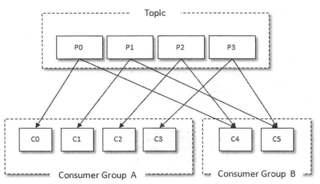
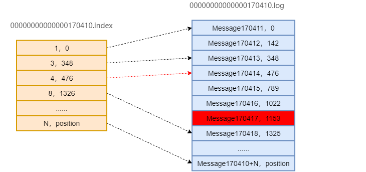
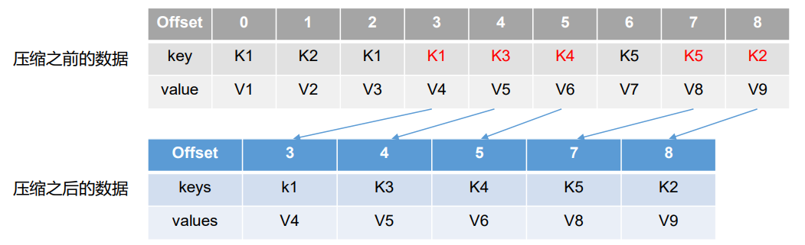
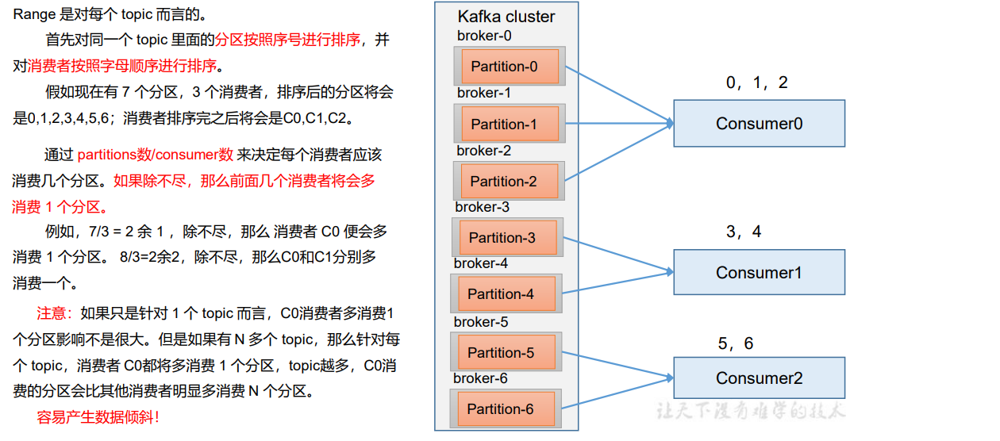

# Kafka

## Kafka 概览

kafka 需要注意的几个点如下：

- consumer group 的分配策略
- 生产者的ISR机制
- 生产者的ACK机制
- 事务消息 + Exaclty Onece
- 文件存储
- Kafka 生产者分区策略、消息发送拦截器，消息保存Offset
- Kafka 消息发送的 client 端流程
- kafka 消息积压以及问题如何排查


Kafka 主要由以下几个部分组成：


- 1）Producer ：消息生产者，就是向kafka broker发消息的客户端； 
- 2）Consumer ：消息消费者，向kafka broker取消息的客户端； 
- 3）Consumer Group （CG）：消费者组，由多个consumer组成。消费者组内每个消费者负责消费不同分区的数据，一个分区只能由一个组内消费者消费；消费者组之间互不影响。所有的消费者都属于某个消费者组，即消费者组是逻辑上的一个订阅者。 
- 4）Broker ：一台kafka服务器就是一个broker。一个集群由多个broker组成。一个broker可以容纳多个topic。
-  5）Topic ：可以理解为一个队列，生产者和消费者面向的都是一个topic； 
- 6）Partition：为了实现扩展性，一个非常大的topic可以分布到多个broker（即服务器）上，一个topic可以分为多个partition，每个partition是一个有序的队列；
-  7）Replica：副本，为保证集群中的某个节点发生故障时，该节点上的partition数据不丢失且kafka仍然能够继续工作，kafka提供了副本机制，一个topic的每个分区都有若干个副本，一个leader和若干个follower
- 8）leader：每个分区多个副本的“主”，生产者发送数据的对象，以及消费者消费数据的对象都是leader
- 9）follower：每个分区多个副本中的“从”，实时从leader中同步数据，保持和leader数据的同步。leader发生故障时，某个follower会成为新的follower


## Kafka 副本

Kafka 中副本分为：Leader 和 Follower。Kafka 生产者只会把数据发往 Leader， 然后 Follower 找 Leader 进行同步数据

**Kafka 副本作用：提高数据可靠性**。 kafka的topic被分成多个分区，分区是基本的数据块。每个分区可以有多个副本，其中一个是leader。所有事件都是发给leader，或者直接从leader读取数据。其他副本只需要与leader保持同步，并及时复制最新的数据。

Kafka 分区中的所有副本统称为 AR（Assigned Repllicas）。  AR = ISR + OSR 

- ISR，表示和 Leader 保持同步的 Follower 集合。如果 Follower 长时间未向 Leader 发送通信请求或同步数据，则该 Follower 将被踢出 ISR。该时间阈值由 replica.lag.time.max.ms
- OSR**，**表示 Follower 与 Leader 副本同步时，延迟过多的副本。 

> Kafka 默认副本 1 个，生产环境一般配置为 2 个，保证数据可靠性；太多副本会 增加磁盘存储空间，增加网络上数据传输，降低效率。 


**Leader维护了一个动态的in-sync replica set（ISR）**，意为和leader保持同步的follower集合。当ISR中的follower完成数据同步后，leader就会发送ack。如果follower长时间未向leader同步数据，则该follower将被踢出ISR，该时间阈值由[replica.lag.time.max.ms](https://link.segmentfault.com/?enc=SKhXg0gj%2B%2FpyEwpg34EWrQ%3D%3D.OaHDFCay6lHsVkVxCo%2B%2BetZX0o%2FOr5H4Drvh%2FR0ARNU%3D)参数设定。Leader不可用时，将会从ISR中选举新的leader。


每一个partition 都维护了一个HW 与LEO，HW 表示消费者可以看到的最大的Offset，LEO：每个副本最大的offset


**（1）follower故障**

 follower发生故障后会被临时踢出ISR，待该follower恢复后，follower会读取本地磁盘记录的上次的HW，并将log文件高于HW的部分截取掉，从HW开始向leader进行同步。等该follower的LEO大于等于该Partition的HW，即follower追上leader之后，就可以重新加入ISR了。


**（2）leader故障**

 leader发生故障后，会从ISR中选出一个新的leader，之后为了保证多个副本之间的数据一致性，其余的follower会先将各自的log文件高于HW的部分截掉，然后从新的leader同步数据。

 注意：这只能保证副本之间的数据一致性，并不能保证数据不丢失或者不重复


## Kafka Producer

### 发送流程

在消息发送的过程中，涉及到了**两个线程——**main **线程和** Sender **线程**。在 main 线程 中创建了**一个双端队列** RecordAccumulator。main 线程将消息发送给 RecordAccumulator，Sender 线程不断从 RecordAccumulator 中拉取消息发送到 Kafka Broker

Kafka的发送流程如下：


为了提高效率，消息被分批次写入kafka。批次就是一组消息，这些消息属于同一个主题和分区。（如果每一个消息都单独穿行于网络，会导致大量的网络开销，把消息分成批次传输可以减少网络开销。不过要在时间延迟和吞吐量之间做出权衡：批次越大，单位时间内处理的消息就越多，单个消息的传输时间就越长）。批次数据会被压缩，这样可以提升数据的传输和存储能力，但要做更多的计算处理

- **batch.size：**只有数据积累到batch.size后，sender才会发送数据。（单位：字节，注意：不是消息个数）。
- [linger.ms](https://link.segmentfault.com/?enc=Uths1l6ghqFOboI%2BVvRRoA%3D%3D.bQFVlbfhW3SbqAfCyCzS0HX%2B5j5c1YMbWz7%2FNYBXq5U%3D)**：**如果数据迟迟未达到batch.size，sender等待 [linger.ms](https://link.segmentfault.com/?enc=h3TZ3o0YSYrkbYQGphoAsw%3D%3D.y%2BBR7lAqxYSqrUIV7n0DNsaX5gg3dI%2Bj2fz0lnL3ZPg%3D)之后也会发送数据。（单位：毫秒）。
- [client.id](https://link.segmentfault.com/?enc=rhjNFkGmUug2hwx0WBRbYQ%3D%3D.UpNfbww5Q%2F2I22vu9MQNzlUWrlF2zAno%2FWs2EhMww5Y%3D)**：**该参数可以是任意字符串，服务器会用它来识别消息的来源，还可用用在日志和配额指标里。
- [max.in](https://link.segmentfault.com/?enc=uXQWuSzzxFwWtMsB52V8Xw%3D%3D.HVTyhc3CQiCD4GVVpW7idQ%3D%3D)**.flight.requests.per.connection：**该参数指定了生产者在收到服务器响应之前可以发送多少个消息。它的值越高，就会占用越多的内存，不过也会提升吞吐量。**把它设置为1可以保证消息时按发送的顺序写入服务器的，即使发生了重试。**


### 默认分区策略


### 可靠性保证

- **0：** producer不等待broker的ack，这一操作提供了一个最低的延迟，broker一接收到还没写入磁盘就已经返回，当broker故障时可能丢失数据；
-  **1：** producer等待leader的ack，partition的leader落盘成功后返回ack，如果在follower同步成功之前leader故障，那么将会丢失数据；
-  **-1（all）：**producer等待broker的ack，partition的leader和ISR里的follower全部落盘成功后才返回ack。但是如果在follower同步完成后，broker发送ack之前，leader发生故障，那么会造成重复数据。（极端情况下也有可能丢数据：ISR中只有一个Leader时，相当于1的情况）


## Kafka的消费

### 消费者组

消费者（ Consumer ）负责订阅 Kafka 中的主题（ Topic ），并且从订阅的主题上拉取消息。与其他一些消息中间件不同的是：在 Kafka 的消费理念中还有一层消费组（ Consumer Group) 的概念，每个消费者都有一个对应的消费组。当消息发布到主题后，只会被投递给订阅它的每个消费组中的一个消费者。




### Kafka的消费流程


### 消费者注意点

#### 订阅主题

Kafka可以通过两种方法来订阅主题，分别是subscribe 与 assgin 两种机制, 两种方式

```
public void subscribe(Pattern pattern);
public void subscribe(Collection<String> topics)
public void subscribe(Collection<String> topics, ConsumerRebalanceListener listener)
```

```
public void assign(Collection<TopicPartition> partitions) 
```


####  指定位移消费

Kafka 提供了两种方式用于帮助消费者指定offset的位置，既从何处进行消费

- auto.offset.reset
- seek

**auto.offset.reset**

auto.offset.reset 是当客户端需要订阅broker时设置的参数，当消费者订阅主题时，从哪里进行消费，默认有两个值分别是 earliest 与 latest，如下图：


- none
  如果没有为消费者找到先前的offset的值,即没有自动维护偏移量,也没有手动维护偏移量,则抛出异常

- earliest
  在各分区下有提交的offset时：从offset处开始消费

  在各分区下无提交的offset时：从头开始消费

- latest
  在各分区下有提交的offset时：从offset处开始消费

  在各分区下无提交的offset时：从最新的数据开始消费


这里需要注意的一个点是如果__consumer_offset 中没有保存 consumer 对应的offset


**seek**

Kafka 提供了一种更细粒度指定offset位移的api，可以让我们从特定的位移处开始拉取消息

```java
//从topic+partition 的offset位置进行消费
public void seek(TopicPartition partition, long offset)
```


#### 消费者拦截器

```java
public interface ConsumerInterceptor<K, V> extends Configurable {

    //在消息消费poll方法调用之前进行调用
    public ConsumerRecords<K, V> onConsume(ConsumerRecords<K, V> records);

   	//在offset提交之前进行调用
    public void onCommit(Map<TopicPartition, OffsetAndMetadata> offsets);

    /**
     * This is called when interceptor is closed
     */
    public void close();
```

Kafka Consumer会在poll（）方法返回之前调用拦截器的onConsume（）方法来对消息进行相应的定制化操作，比如修改返回的消息内容、按照某种规则过滤消息（可能会减少poll（）方法返回的消息的个数〉。如果onConsume（）方法中抛出异常，那么会被捕获并记录到日志中，但是异常不会再向上传递。


### Kafka Rebalance

#### Rebalance 机制

Rebalance就是说如果消费组里的消费者数量有变化或消费的分区数有变化，[kafka](https://so.csdn.net/so/search?q=kafka&spm=1001.2101.3001.7020)会重新分配消费者消费分区的关系。比如consumer group中某个消费者挂了，此时会自动把分配给他的分区交给其他的消费者，如果他又重启了，那么又会把一些分区重新交还给他。

**注意：**

rebalance只针对subscribe这种不指定分区消费的情况，如果通过assign这种消费方式指定了分区，kafka不会进行rebanlance。

如下情况可能会触发消费者rebalance

- 消费组里的consumer增加或减少了
- 动态给topic增加了分区
- 消费组订阅了更多的topic

rebalance过程中，消费者无法从kafka消费消息，这对kafka的TPS会有影响，如果kafka集群内节点较多，比如数百个，那重平衡可能会耗时极多，所以应尽量避免在系统高峰期的重平衡发生，Rebalence 的整个过程如下图所示：


- heartbeat.interval.ms

  Kafka 消费者和 coordinator 之间的心跳时间，默认 3s。 该条目的值必须小于 session.timeout.ms，也不应该高于  session.timeout.ms 的 1/3

- session.timeout.ms

  Kafka 消费者和 coordinator 之间连接超时时间，默认 45s。超 过该值，该消费者被移除，消费者组执行再平衡

- max.poll.interval.ms 

  消费者处理消息的最大时长，默认是 5 分钟。超过该值，该 消费者被移除，消费者组执行再平衡

- partition.assignment.strategy

  消 费 者 分 区 分 配 策 略 ， 默 认 策 略 是 Range + CooperativeSticky。Kafka 可以同时使用多个分区分配策略。 可 以 选 择 的 策 略 包 括 ： Range 、 RoundRobin 、 Sticky 、CooperativeSticky


#### Rebalance API

Kafka Consumer在订阅某个Topic时提供了ConsumerRebalanceListener监听器，用于在Reblence 发生时进行触发

```
( 1) void onPartitionsRevoked(Collection<TopicPartition> partitions) 
这个方法会在再均衡开始之前和消费者停止读取消息之后被调用。可以通过这个回调方法来处理消费位移的提交， 以此来避免一些不必要的重复消费现象的发生。参数 partitions 表示再均衡前所分配到的分区。

( 2) void onPartitionsAssigned(Collection<TopicPartition> partitions) 
这个方法会在重新分配分区之后和消费者开始读取消费之前被调用 。参数 partitions 表示再均衡后所分配到的分区 。
```


#### Rebalance过程

当有消费者加入消费组时，消费者、消费组及组协调器之间会经历以下几个阶段。

**第一阶段：选择组协调器**

组协调器GroupCoordinator：每个consumer group都会选择一个broker作为自己的组协调器coordinator，负责监控这个消费组里的所有消费者的心跳，以及判断是否宕机，然后开启消费者rebalance。

consumer group中的每个consumer启动时会向kafka集群中的某个节点发送 FindCoordinatorRequest 请求来查找对应的组协调器GroupCoordinator，并跟其建立网络连接。

组协调器选择方式：

consumer消费的offset要提交到__consumer_offsets的哪个分区，这个分区leader对应的broker就是这个consumer group的coordinator

**第二阶段：加入消费组JOIN GROUP**

在成功找到消费组所对应的 GroupCoordinator 之后就进入加入消费组的阶段，在此阶段的消费者会向 GroupCoordinator 发送 JoinGroupRequest 请求，并处理响应。然后GroupCoordinator 从一个consumer group中选择第一个加入group的consumer作为leader(消费组协调器)，把consumer group情况发送给这个leader，接着这个leader会负责制定分区方案。

**第三阶段（ SYNC GROUP)**

consumer leader通过给GroupCoordinator发送SyncGroupRequest，接着GroupCoordinator就把分区方案下发给各个consumer，他们会根据指定分区的leader broker进行网络连接以及消息消费


## Kafka的Offset 存储

Kafka的offset默认是存储在`__consumer_offsets` 的topic中，`__consumer_offsets` 默认会有50个partition，每个partition有三个副本，并且每个partition中保存了消费者对应的offset信息,

 __consumer_offsets 主题里面采用 key 和 value 的方式存储数据。key 是 group.id+topic+分区号，value 就是当前 offset 的值。每隔一段时间，kafka 内部会对这个 topic 进行compact，也就是每个 group.id+topic+分区号就保留最新数据


#### 创建 `__commit_offset`

当 Kafka 集群中的第一个 Consumer 程序启动时，Kafka 会自动创建位移主题。位移主题就是普通的 Kafka 主题，它也有对应的分区数。但如果是 Kafka 自动创建的，分区数的设定要看 Broker 端参数 offsets.topic.num.partitions 的取值。它的默认值是 50，因此 Kafka 会自动创建一个 50 分区的位移主题。副本数或备份因子是 Broker 端参数 offsets.topic.replication.factor 控制的。默认值是 3。如果 Kafka 日志路径下冒出很多 __consumer_offsets-xxx 这样的目录，这是 Kafka 自动创建的位移主题。


#### 写入offset

Kafka Consumer 提交位移时会写入该主题， Kafka Consumer 提交位移的方式有两种：自动提交位移和手动提交位移。

**自动提交**

Consumer 端有个参数叫 enable.auto.commit，如果值是 true，则 Consumer 在后台定期提交位移，提交间隔由参数 auto.commit.interval.ms 来控制。自动提交位移的优点就是省事，不用操心位移提交的事情，就能保证消息消费不会丢失。但这一点同时也是缺点，丧失了很大的灵活性和可控性，完全没法把控 Consumer 端的位移管理。

- enable.auto.commit**：**是否开启自动提交offset功能，默认是true
-  auto.commit.interval.ms**：**自动提交offset的时间间隔，默认是5s


**手动提交offset**

手动提交offset的方法有两种：分别是commitSync（同步提交）和commitAsync（异步提交）。两者的相 同点是，都会将本次提交的一批数据最高的偏移量提交；不同点是，同步提交阻塞当前线程，一直到提交成 功，并且会自动失败重试（由不可控因素导致，也会出现提交失败）；而异步提交则没有失败重试机制，故 有可能提交失败。

- commitSync（同步提交）：必须等待offset提交完毕，再去消费下一批数据。
- commitAsync（异步提交） ：发送完提交offset请求后，就开始消费下一批数据了。


#### 删除offset

Kafka 使用Compact 策略来删除位移主题中的过期消息。对于同一个 Key 的两条消息 M1 和 M2，如果 M1 的发送时间早于 M2，那么 M1 就是过期消息。Compact 的过程就是扫描日志的所有消息，剔除那些过期的消息，然后把剩下的消息整理在一起。图中位移为 0、2 和 3 的消息的 Key 都是 K1。Compact 之后，分区只需要保存位移为 3 的消息，因为它是最新发送的。

Kafka 提供后台线程定期地巡检待 Compact 的主题，看看是否存在满足条件的可删除数据。这个后台线程叫 Log Cleaner。如果位移主题无限膨胀占用过多磁盘空间的问题，可以去检查一下 Log Cleaner 线程的状态，通常都是这个线程挂掉了导致的。


## Kafka 存储

### 文件存储

topic是逻辑上的概念，而partition是物理上的概念，每个partition对应于一个log文件，该log文件中存储的就是producer生产的数据。Producer生产的数据会被不断追加到该log文件末端，且每条数据都有自己的offset。消费者组中的每个消费者，都会实时记录自己消费到了哪个offset，以便出错恢复时，从上次的位置继续消费


由于生产者生产的消息会不断追加到log文件末尾，为防止log文件过大导致数据定位效率低下，Kafka采取了分片和索引机制，将每个partition分为多个segment。每个segment对应两个文件——“.index”文件和“.log”文件。这些文件位于一个文件夹下，该文件夹的命名规则为：topic名称+分区序号。例如，first这个topic有三个分区，则其对应的文件夹为first0,first-1,first-2，如下：

```
00000000000000000000.index 
00000000000000000000.log 
00000000000000170410.index 
00000000000000170410.log 
00000000000000239430.index 
00000000000000239430.log
```

index和log文件以当前segment的第一条消息的offset命名。


### 定位数据

查找message的流程（比如要查找offset为170417的message）：



> 1. 首先用二分查找确定它是在哪个Segment文件中，其中0000000000000000000.index为最开始的文件，第二个文件为0000000000000170410.index（起始偏移为170410+1 = 170411），而第三个文件为0000000000000239430.index（起始偏移为239430+1 = 239431）。所以这个offset = 170417就落在第二个文件中。其他后续文件可以依此类推，以起始偏移量命名并排列这些文件，然后根据二分查找法就可以快速定位到具体文件位置。
> 2. 用该offset减去索引文件的编号，即170417 - 170410 = 7，也用二分查找法找到索引文件中等于或者小于7的最大的那个编号。可以看出我们能够找到[4，476]这组数据，476即offset=170410 + 4 = 170414的消息在log文件中的偏移量。
> 3. 打开数据文件（0000000000000170410.log），从位置为476的那个地方开始顺序扫描直到找到offset为170417的那条Message


### 日志清理策略

当日志片段大小达到log.segment.bytes指定的上限（默认是1GB）或者日志片段打开时长达到l[og.segment.ms](https://link.segmentfault.com/?enc=UsAhxMa3RSzVZ58DfA5Kaw%3D%3D.HlGYKzZi%2BRAZFDAQxHxOCGhzuA2MLCvArhRtLOHMjCs%3D)时，当前日志片段就会被关闭，一个新的日志片段被打开。如果一个日志片段被关闭，就开始等待过期。**当前正在写入的片段叫做活跃片段，活跃片段永远不会被删除，**所以如果你要保留数据1天，但是片段包含5天的数据，那么这些数据就会被保留5天，因为片段被关闭之前，这些数据无法被删除。

Kafka 中默认的日志保存时间为 7 天，可以通过调整如下参数修改保存时间

- log.retention.hours，最低优先级小时，默认 7 天。 
- log.retention.minutes，分钟。 
-  log.retention.ms，最高优先级毫秒。 
-  log.retention.check.interval.ms，负责设置检查周期，默认 5 分钟。

那么日志一旦超过了设置的时间，就会根据相应的日志清理策略来进行清理，默认分为两种：delete 和 compact


#### delete 清理

delete 日志删除：将过期数据删除

- log.cleanup.policy = delete 所有数据启用删除策略 

（1）基于时间：默认打开。以 segment 中所有记录中的最大时间戳作为该文件时间戳。 

（2）基于大小：默认关闭。超过设置的所有日志总大小，删除最早的 segment，log.retention.bytes，默认等于-1，表示无穷大


#### compat 清理

compact日志压缩：对于相同key的不同value值，只保留最后一个版本。

- log.cleanup.policy = compact 所有数据启用压缩策略



压缩后的offset可能是不连续的，比如上图中没有6，当从这些offset消费消息时，将会拿到比这个offset大 的offset对应的消息，实际上会拿到offset为7的消息，并从这个位置开始消费。

这种策略只适合特殊场景，比如消息的key是用户ID，value是用户的资料，通过这种压缩策略，整个消息 集里就保存了所有用户最新的资料。


### Kafka 数据同步

ISR 、AR


## 分区分配策略

博客地址：https://www.cnblogs.com/hzmark/p/sticky_assignor.html

 一个consumer group中有多个consumer，一个topic有多个partition，所以必然会涉及到partition的分配问题，即确定哪个partition由哪个consumer来消费。Kafka提供了3种消费者分区分配策略：RangeAssigor、RoundRobinAssignor、StickyAssignor。

 PartitionAssignor接口用于用户定义实现分区分配算法，以实现Consumer之间的分区分配。消费组的成员订阅它们感兴趣的Topic并将这种订阅关系传递给作为订阅组协调者的Broker。协调者选择其中的一个消费者来执行这个消费组的分区分配并将分配结果转发给消费组内所有的消费者。Kafka默认采用RangeAssignor的分配算法

### RangeAssignor



RangeAssignor对每个Topic进行独立的分区分配。对于每一个Topic，首先对分区按照分区ID进行排序，然后订阅这个Topic的消费组的消费者再进行排序，之后尽量均衡的将分区分配给消费者。这里只能是尽量均衡，因为分区数可能无法被消费者数量整除，那么有一些消费者就会多分配到一些分区。分配示意图如下：


分区分配的算法如下：

```java
@Override
public Map<String, List<TopicPartition>> assign(Map<String, Integer> partitionsPerTopic,
                                                Map<String, Subscription> subscriptions) {
    Map<String, List<String>> consumersPerTopic = consumersPerTopic(subscriptions);
    Map<String, List<TopicPartition>> assignment = new HashMap<>();
    for (String memberId : subscriptions.keySet())
        assignment.put(memberId, new ArrayList<TopicPartition>());
    //for循环对订阅的多个topic分别进行处理
    for (Map.Entry<String, List<String>> topicEntry : consumersPerTopic.entrySet()) {
        String topic = topicEntry.getKey();
        List<String> consumersForTopic = topicEntry.getValue();
 
        Integer numPartitionsForTopic = partitionsPerTopic.get(topic);
        if (numPartitionsForTopic == null)
            continue;
        //对消费者进行排序
        Collections.sort(consumersForTopic);
        //计算平均每个消费者分配的分区数
        int numPartitionsPerConsumer = numPartitionsForTopic / consumersForTopic.size();
        //计算平均分配后多出的分区数
        int consumersWithExtraPartition = numPartitionsForTopic % consumersForTopic.size();
 
        List<TopicPartition> partitions = AbstractPartitionAssignor.partitions(topic, numPartitionsForTopic);
        for (int i = 0, n = consumersForTopic.size(); i < n; i++) {
            //计算第i个消费者，分配分区的起始位置
            int start = numPartitionsPerConsumer * i + Math.min(i, consumersWithExtraPartition);
            //计算第i个消费者，分配到的分区数量
            int length = numPartitionsPerConsumer + (i + 1 > consumersWithExtraPartition ? 0 : 1);
            assignment.get(consumersForTopic.get(i)).addAll(partitions.subList(start, start + length));
        }
    }
    return assignment;
}
```

**这种分配方式明显的一个问题是随着消费者订阅的Topic的数量的增加，不均衡的问题会越来越严重，比如上图中4个分区3个消费者的场景，C0会多分配一个分区。如果此时再订阅一个分区数为4的Topic，那么C0又会比C1、C2多分配一个分区，这样C0总共就比C1、C2多分配两个分区了，而且随着Topic的增加，这个情况会越来越严重。分配结果：**


订阅2个Topic，每个Topic4个分区，共3个Consumer

- **C0：**[T0P0，T0P1，T1P0，T1P1]
- **C1：**[T0P2，T1P2]
- **C2：**[T0P3，T1P3]


### RoundRobinAssignor

RoundRobinAssignor是将所有的分区以及主题展开排序后进行分配，RoundRobinAssignor的分配策略是将消费组内订阅的所有Topic的分区及所有消费者进行排序后尽量均衡的分配（RangeAssignor是针对单个Topic的分区进行排序分配的）。如果消费组内，消费者订阅的Topic列表是相同的（每个消费者都订阅了相同的Topic），那么分配结果是尽量均衡的（消费者之间分配到的分区数的差值不会超过1）。如果订阅的Topic列表是不同的，那么分配结果是不保证“尽量均衡”的，因为某些消费者不参与一些Topic的分配。**RoundRobinAssignor 主要针对的是group内所有消费者订阅的topic是一样的情况下才可以使用的** 


以上两个topic的情况，相比于之前RangeAssignor的分配策略，可以使分区分配的更均衡。不过考虑这种情况，假设有三个消费者分别为C0、C1、C2，有3个Topic T0、T1、T2，分别拥有1、2、3个分区，并且C0订阅T0，C1订阅T0和T1，C2订阅T0、T1、T2，那么RoundRobinAssignor的分配结果如下：


看上去分配已经尽量的保证均衡了，不过可以发现C2承担了4个分区的消费而C1订阅了T1，是不是把T1P1交给C1消费能更加的均衡呢？


### StickyAssignor

StickyAssignor分区分配算法，目的是在执行一次新的分配时，能在上一次分配的结果的基础上，尽量少的调整分区分配的变动，节省因分区分配变化带来的开销。Sticky是“粘性的”，可以理解为分配结果是带“粘性的”——每一次分配变更相对上一次分配做最少的变动。其目标有两点：

- 分区的分配尽量的均衡。
- 每一次重分配的结果尽量与上一次分配结果保持一致。

当这两个目标发生冲突时，优先保证第一个目标。第一个目标是每个分配算法都尽量尝试去完成的，而第二个目标才真正体现出StickyAssignor特性的。

StickyAssignor算法比较复杂，下面举例来说明分配的效果（对比RoundRobinAssignor），前提条件：

- 有4个Topic：T0、T1、T2、T3，每个Topic有2个分区。
- 有3个Consumer：C0、C1、C2，所有Consumer都订阅了这4个分区。


上面红色的箭头代表的是有变动的分区分配，可以看出，StickyAssignor的分配策略，变动较小。


## 幂等与事务

### 幂等

**幂等性**就是指Producer不论向Broker发送多少次重复数据，Broker端都只会持久化一条，保证了不重复。Kafka幂等采用了 Exactly Once理念如下：

- **精确一次（Exactly Once）= 幂等性 + 至少一次（ ack=-1 + 分区副本数>=2 + ISR最小副本数量>=2） 。**

**重复数据的判断标准**：具有相同主键<PID, Partition, SeqNumber> 的消息提交时，Broker 只会持久化一条。其 中PID是Kafka每次重启都会分配一个新的；Partition 表示分区号；Sequence Number是单调自增的。

所以幂等性只能保证的是在单分区单会话内不重复, 可以通过参数开启。

- enable.idempotence 默认为 true，false 关闭


### 事务

```
// 1 初始化事务 
void initTransactions(); 
 
// 2 开启事务 
void beginTransaction() throws ProducerFencedException; 
 
// 3 在事务内提交已经消费的偏移量（主要用于消费者） 
void sendOffsetsToTransaction(Map<TopicPartition, OffsetAndMetadata> offsets, 
 String consumerGroupId) throws 
ProducerFencedException; 
 
// 4 提交事务 
void commitTransaction() throws ProducerFencedException; 
 
// 5 放弃事务（类似于回滚事务的操作） 
void abortTransaction() throws ProducerFencedException;
```


## 消息堆积

### 监控

通过kafka edger 监控每个partition 的lag 


### 解决方案

### 案例

假如现在有一个在线的业务，突然量大了起来，消费端或者说下游系统突然处理不过来了，MQ出现了大量的消息堆积，业务写入MQ异常，有什么办法可以相对平缓得解决呢？


### 解决思路

#### 从生产者端解决

一般我们的系统容量或者处理能力都是规划好的，出现消息堆积的情况，大部分是由于流量暴增引起，这个时候可以考虑控制生产者的速率，对前端机器流量进行限速限流。

#### 从消费者端解决

1、consumer 消费能力不足，partition != 添加consumer 实例就需要进行添加 consumer

2、在处理消息队列消息无序的情况下，consumer 消费能力不足，增大partition 的数量以及增加consumer实例

3、consumer 程序出现问题，修复consumer程序，并且将原topic中的数据通过程序导出到新的topic中，然后增加partition 比如以前是5个partition，现在就增加到20个，consumer程序修复好后对新的topic中的数据进行消费


## Controller选举

集群控制器组件（BrokerController）：

它是 Kafka 的核心组件。它的主要作用是在 ZooKeeper 的帮助下管理和协调整个 Kafka 集群，集群中的每个 broker 都可以称为 controller，但是在 Kafka 集群启动后，只有一个 broker 会成为 Controller 。
Controller Broker的主要职责有很多，主要是一些管理行为，主要包括以下几个方面：

• 创建、删除主题，增加分区并分配leader分区
• 集群Broker管理（新增 Broker、Broker 主动关闭、Broker 故障)
• preferred leader选举

分区重分配Kafka是基于zookeeper的，controller的选择也是在zookeeper上完成的。
Kafka 当前选举控制器的规则是：Kafka 集群中第一个启动的 broker 通过在 ZooKeeper 里创建一个临时节点 /controller 让自己成为 controller 控制器。其他 broker 在启动时也会尝试创建这个节点，但是由于这个节点已存在，所以后面想要创建 /controller 节点时就会收到一个 节点已存在 的异常。然后其他 broker 会在这个控制器上注册一个 ZooKeeper 的 watch 对象，/controller节点发生变化时，其他 broker 就会收到节点变更通知。这种方式可以确保只有一个控制器存在。那么只有单独的节点一定是有个问题的，那就是单点问题。

如果控制器关闭或者与 ZooKeeper 断开链接，ZooKeeper 上的临时节点就会消失。集群中的其他节点收到 watch 对象发送控制器下线的消息后，其他 broker 节点都会尝试让自己去成为新的控制器。其他节点的创建规则和第一个节点的创建原则一致，都是第一个在 ZooKeeper 里成功创建控制器节点的 broker 会成为新的控制器，那么其他节点就会收到节点已存在的异常，然后在新的控制器节点上再次创建 watch 对象进行监听。
