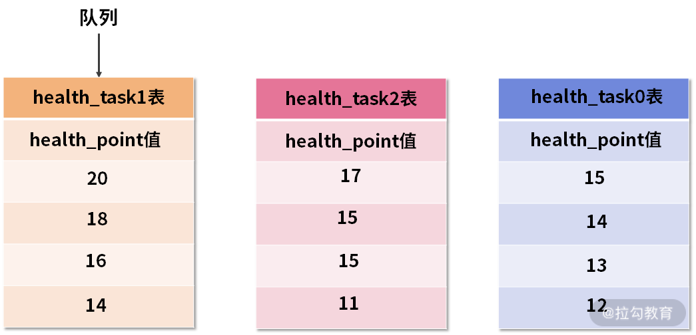

# Mysql

**注意：单表不能超过2000万**

### 优化点

Mysql的优化点在于下面几个方向：

- 定位mysql问题：客户端统计慢sql、服务端show profling 以及 information_schema 下的相关表 比如锁、事务相关的表

- mysql的索引，索引失效、联合索引避免回表、占用内存少

- 联合查询时 小表驱动大表、子查询时 避免物化相关操作，如果子查询产生物化操作使用exists代替

- 分表产生的问题：多表数据收集、分片算法：避免热点数据、避免数据倾斜、少迁移

- 锁：全局锁、表锁、元数据锁、NextKeyLock

- 事务：隔离级别、MVCC、当前读、快照读

- 分布式事务：单节点的XA，以及多节点的 TCC,AT模式

- 分布式ID：雪花算法，百度的 uid-generator

  

MySQL InnoDB 引擎现在广为使用，它提供了事务，行锁，日志等一系列特性，本文分析下 InnoDB的内部实现机制，MySQL 版本为 5.7.24，操作系统为 Debian 9。MySQL InnoDB 的实现非常复杂，本文只是总结了一些皮毛，希望以后能够研究的更加深入些。


## SQL 执行顺序


## InnoDB 架构


Innodb架构图

InnoDB 的架构分为两块：内存中的结构和磁盘上的结构。InnoDB 使用日志先行策略，将数据修改先在内存中完成，并且将事务记录成重做日志(Redo Log)，转换为顺序IO高效的提交事务。这里日志先行，说的是日志记录到数据库以后，对应的事务就可以返回给用户，表示事务完成。但是实际上，这个数据可能还只在内存中修改完，并没有刷到磁盘上去。内存是易失的，如果在数据落地前，机器挂了，那么这部分数据就丢失了。

InnoDB 通过 redo 日志来保证数据的一致性。如果保存所有的重做日志，显然可以在系统崩溃时根据日志重建数据。当然记录所有的重做日志不太现实，所以 InnoDB 引入了检查点机制。即定期检查，保证检查点之前的日志都已经写到磁盘，则下次恢复只需要从检查点开始。


### InnoDB 内存中的结构

内存中的结构主要包括 Buffer Pool，Change Buffer、Adaptive Hash Index以及 Log Buffer 四部分。如果从内存上来看，Change Buffer 和 Adaptive Hash Index 占用的内存都属于 Buffer Pool，Log Buffer占用的内存与 Buffer Pool独立。

#### Buffer Pool

缓冲池缓存的数据包括Page Cache、Change Buffer、Data Dictionary Cache等，通常 MySQL 服务器的 80% 的物理内存会分配给 Buffer Pool。

基于效率考虑，InnoDB中数据管理的最小单位为页，默认每页大小为16KB，每页包含若干行数据。为了提高缓存管理效率，InnoDB的缓存池通过一个页链表实现，很少访问的页会通过缓存池的 LRU 算法淘汰出去。InnoDB 的缓冲池页链表分为两部分：New sublist(默认占5/8缓存池) 和 Old sublist(默认占3/8缓存池，可以通过 innodb_old_blocks_pct修改，默认值为 37)，其中新读取的页会加入到 Old sublist的头部，而 Old sublist中的页如果被访问，则会移到 New sublist的头部。缓冲池的使用情况可以通过 `show engine innodb status` 命令查看。其中一些主要信息如下：

```bash
----------------------
BUFFER POOL AND MEMORY
----------------------
Total large memory allocated 137428992 # 分配给InnoDB缓存池的内存(字节)
Dictionary memory allocated 102398  # 分配给InnoDB数据字典的内存(字节)
Buffer pool size   8191 # 缓存池的页数目
Free buffers       7893 # 缓存池空闲链表的页数目
Database pages     298  # 缓存池LRU链表的页数目
Modified db pages  0    # 修改过的页数目
......
```


#### Change Buffer

通常来说，InnoDB辅助索引不同于聚集索引的顺序插入，如果每次修改二级索引都直接写入磁盘，则会有大量频繁的随机IO。Change buffer 的主要目的是将对 **非唯一** 辅助索引页的操作缓存下来，以此减少辅助索引的随机IO，并达到操作合并的效果。它会占用部分Buffer Pool 的内存空间。在 MySQL5.5 之前 Change Buffer其实叫 Insert Buffer，最初只支持 insert 操作的缓存，随着支持操作类型的增加，改名为 Change Buffer。如果辅助索引页已经在缓冲区了，则直接修改即可；如果不在，则先将修改保存到 Change Buffer。Change Buffer的数据在对应辅助索引页读取到缓冲区时合并到真正的辅助索引页中。Change Buffer 内部实现也是使用的 B+ 树。

可以通过 `innodb_change_buffering` 配置是否缓存辅助索引页的修改，默认为 all，即缓存 insert/delete-mark/purge 操作(注：MySQL 删除数据通常分为两步，第一步是delete-mark，即只标记，而purge才是真正的删除数据)。


Change Buffer

查看Change Buffer信息也可以通过 `show engine innodb status` 命令。更多信息见 [mysqlserverteam: the-innodb-change-buffer](https://mysqlserverteam.com/the-innodb-change-buffer/)。


```cpp
-------------------------------------
INSERT BUFFER AND ADAPTIVE HASH INDEX
-------------------------------------
Ibuf: size 1, free list len 0, seg size 2, 0 merges
merged operations:
 insert 0, delete mark 0, delete 0
discarded operations:
 insert 0, delete mark 0, delete 0
Hash table size 34673, node heap has 0 buffer(s)
Hash table size 34673, node heap has 0 buffer(s)
Hash table size 34673, node heap has 0 buffer(s)
Hash table size 34673, node heap has 0 buffer(s)
Hash table size 34673, node heap has 0 buffer(s)
Hash table size 34673, node heap has 0 buffer(s)
Hash table size 34673, node heap has 0 buffer(s)
Hash table size 34673, node heap has 0 buffer(s)
```


#### Adaptive Hash Index

自适应哈希索引(AHI)查询非常快，一般时间复杂度为 O(1)，相比 B+ 树通常要查询 3~4次，效率会有很大提升。innodb 通过观察索引页上的查询次数，如果发现建立哈希索引可以提升查询效率，则会自动建立哈希索引，称之为自适应哈希索引，不需要人工干预，可以通过 `innodb_adaptive_hash_index` 开启，MySQL5.7 默认开启。

考虑到不同系统的差异，有些系统开启自适应哈希索引可能会导致性能提升不明显，而且为监控索引页查询次数增加了多余的性能损耗， MySQL5.7 更改了 AHI 实现机制，每个 AHI 都分配了专门分区，通过 `innodb_adaptive_hash_index_parts`配置分区数目，默认是8个，如前一节命令列出所示。


#### Log Buffer

Log Buffer是 重做日志在内存中的缓冲区，大小由 `innodb_log_buffer_size` 定义，默认是 16M。一个大的 Log Buffer可以让大事务在提交前不必将日志中途刷到磁盘，可以提高效率。如果你的系统有很多修改很多行记录的大事务，可以增大该值。

配置项 `innodb_flush_log_at_trx_commit` 用于控制 Log Buffer 如何写入和刷到磁盘。注意，除了 MySQL 的缓冲区，操作系统本身也有内核缓冲区。

- 默认为1，表示每次事务提交都会将 Log Buffer 写入操作系统缓存，并调用配置的 "flush" 方法将数据写到磁盘。设置为 1 因为频繁刷磁盘效率会偏低，但是安全性高，最多丢失 1个 事务数据。而设置为 0 和 2 则可能丢失 1秒以上 的事务数据。
- 为 0 则表示每秒才将 Log Buffer 写入内核缓冲区并调用 "flush" 方法将数据写到磁盘。
- 为 2 则是每次事务提交都将 Log Buffer写入内核缓冲区，但是每秒才调用 "flush" 将内核缓冲区的数据刷到磁盘。

配置不同的值效果如下图所示：


<center>innodb_flush_log_at_trx_commit配置项图示</center>

`innodb_flush_log_at_timeout` 可以配置刷新日志缓存到磁盘的频率，默认是1秒。注意刷磁盘的频率并不保证就正好是这个时间，可能因为MySQL的一些操作导致推迟或提前。**而这个 "flush" 方法并不是C标准库的 fflush 方法(fflush是将C标准库的缓冲写到内核缓冲区，并不保证刷到磁盘)，它通过 `innodb_flush_method` 配置的，默认是 fsync，即日志和数据都通过 fsync 系统调用刷到磁盘。**

可以发现，InnoDB 基本每秒都会将 Log buffer落盘。而InnoDB中使用的 redo log 和 undo log，它们是分开存储的。redo log在内存中有log buffer，在磁盘对应ib_logfile文件。而undo log是记录在表空间ibd文件中的，InnoDB为undo log会生成undo页，对undo log本身的操作（比如向undo log插入一条记录），也会记录redo log，因此undo log并不需要马上落盘。而 redo log则通常会分配一块连续的磁盘空间，然后先写到log buffer，并每秒刷一次磁盘。redo log必须在数据落盘前先落盘(Write Ahead Log)，从而保证数据持久性和一致性。而数据本身的修改可以先驻留在内存缓冲池中，再根据特定的策略定期刷到磁盘。


### Innodb 在磁盘上的结构

 磁盘中的结构分为两大类：表空间和重做日志。 

- 表空间：

  - 系统表空间

    - Inndodb 数据字典
    - 双写缓冲区（Doublewrite Buffer）：位于系统表空间的一个存储区域，InnoDB在BufferPool中刷新页面时，会将数据页写入该缓冲区后才会写入磁盘。
    - ChangeBuffer
    - Undo log：数据更改前的快照，可以用来回滚数据

  - file-per-table 独立表空间 

    - 数据信息
    - 索引数据

    

- Redo log： 存储的就是 Log Buffer 刷到磁盘的数据 ，记录DML操作的日志，用来崩溃后的数据恢复


#### innodb 表空间

 表空间根据类型可以分为系统表空间，File-Per-Table 表空间，常规表空间，Undo表空间，临时表空间等。本节分析 File-Per-Table 表空间。 

- 系统表空间：包含内容有数据字典，双写缓冲，修改缓冲以及undo日志，以及在系统表空间创建的表的数据和索引。

- 常规表空间：类似系统表空间，也是一种共享的表空间，可以通过 `CREATE TABLESPACE` 创建常规表空间，多个表可共享一个常规表空间，也可以修改表的表空间。注意：必须删除常规表空间中的表后才能删除常规表空间。
- File-Per-Table表空间：MySQL InnoDB新版本提供了 `innodb_file_per_table` 选项，每个表可以有单独的表空间数据文件(.ibd)，而不是全部放到系统表空间数据文件 ibdata1 中。在 MySQL5.7 中该选项默认开启。
- 其他表空间：其他表空间中Undo表空间存储的是Undo日志。除了存储在系统表空间外，Undo日志也可以存储在单独的Undo表空间中。临时表空间则是非压缩的临时表的存储空间，默认是数据目录的 ibtmp1 文件，所有临时表共享，压缩的临时表用的是 File-Per-Table 表空间。


#### 独立表空间

- 优点：可以方便回收删除表所占的磁盘空间。如果使用系统表空间的话，删除表后空闲空间只能被 InnoDB 数据使用。TRUNCATE TABLE 操作会更快。可以单独拷贝表空间数据到其他数据库(使用 transportable tablespace 特性)，可以更方便的观测每个表空间数据的大小。

- 缺点：fsync 操作需要作用的多个表空间文件，比只对系统表空间这一个文件进行fsync操作会多一些 IO 操作。此外，mysqld需要维护更多的文件描述符。


#### 系统表空间

 系统表空间包含内容有：数据字典，双写缓冲，修改缓冲，undo日志，以及在系统表空间创建的表的数据和索引 ，包括创建的数据表的元信息数据


#### Undo log

详见UndoLog


#### RedoLog

详见RedoLog


## 架构方面

### Mysql的执行流程

大体来说，MySQL 可以分为 Server 层和存储引擎层两部分。

- Server 层包括连接器、查询缓存、分析器、优化器、执行器等，涵盖 MySQL 的大多数核心服务功能，以及所有的内置函数（如日期、时间、数学和加密函数等），所有跨存储引擎的功能都在这一层实现，比如存储过程、触发器、视图等。
-  存储引擎层负责数据的存储和提取。其架构模式是插件式的，支持 InnoDB、MyISAM、Memory 等多个存储引擎。现在最常用的存储引擎是 InnoDB，它从 MySQL 5.5.5 版本开始成为了默认存储引擎。


### Buffer Pool

内存的数据页是在 Buffer Pool (BP) 中管理的，在 WAL 里 Buffer Pool 起到了加速更新 的作用。而实际上，Buffer Pool 还有一个更重要的作用，就是加速查询。

在第 2 篇文章的评论区有同学问道，由于有 WAL 机制，当事务提交的时候，磁盘上的数 据页是旧的，那如果这时候马上有一个查询要来读这个数据页，是不是要马上把 redo log 应用到数据页呢？

答案是不需要。因为这时候内存数据页的结果是最新的，直接读内存页就可以了。你看， 这时候查询根本不需要读磁盘，直接从内存拿结果，速度是很快的。所以说，Buffer Pool 还有加速查询的作用

而 Buffer Pool 对查询的加速效果，依赖于一个重要的指标，即：内存命中率。

你可以在 show engine innodb status 结果中，查看一个系统当前的 BP 命中率。一般情 况下，一个稳定服务的线上系统，要保证响应时间符合要求的话，内存命中率要在 99% 以上。


如果所有查询需要的数据页都能够直接从内存得到，那是最好的，对应的命中率就是 100%。但，这在实际生产上是很难做到的。

InnoDB Buffer Pool 的大小是由参数 innodb_buffer_pool_size 确定的，一般建议设置 成可用物理内存的 60%~80%

**如果一个 Buffer Pool 满了，而又要从磁盘读入一个数据页，那肯定是要淘汰一个旧数据页的，InnoDB 内存管理用的是最近最少使用 (Least Recently Used, LRU) 算法，这个算法的核 心就是淘汰最久未使用的数据**


InnoDB 管理 Buffer Pool 的 LRU 算法，是用链表来实现的。

- 1、 在图 6 的状态 1 里，链表头部是 P1，表示 P1 是最近刚刚被访问过的数据页；假设内 存里只能放下这么多数据页； 
- 2、 这时候有一个读请求访问 P3，因此变成状态 2，P3 被移到最前面； 
- 3、状态 3 表示，这次访问的数据页是不存在于链表中的，所以需要在 Buffer Pool 中新申 请一个数据页 Px，加到链表头部。但是由于内存已经满了，不能申请新的内存。于 是，会清空链表末尾 Pm 这个数据页的内存，存入 Px 的内容，然后放到链表头部。 
- 4、 从效果上看，就是最久没有被访问的数据页 Pm，被淘汰了

假设按照这个算法，我们要扫描一个 200G 的表，而这个表是一个历史数据表，平时没有 业务访问它。

 那么，按照这个算法扫描的话，就会把当前的 Buffer Pool 里的数据全部淘汰掉，存入扫 描过程中访问到的数据页的内容。也就是说 Buffer Pool 里面主要放的是这个历史数据表 的数据。

对于一个正在做业务服务的库，这可不妙。你会看到，Buffer Pool 的内存命中率急剧下 降，磁盘压力增加，SQL 语句响应变慢

所以，InnoDB 不能直接使用这个 LRU 算法。实际上，InnoDB 对 LRU 算法做了改进。


在 InnoDB 实现上，按照 5:3 的比例把整个 LRU 链表分成了 young 区域和 old 区域。图 中 LRU_old 指向的就是 old 区域的第一个位置，是整个链表的 5/8 处。也就是说，靠近 链表头部的 5/8 是 young 区域，靠近链表尾部的 3/8 是 old 区域

改进后的 LRU 算法执行流程变成了下面这样：

- 1、图 7 中状态 1，要访问数据页 P3，由于 P3 在 young 区域，因此和优化前的 LRU 算 法一样，将其移到链表头部，变成状态 2。
- 2、之后要访问一个新的不存在于当前链表的数据页，这时候依然是淘汰掉数据页 Pm，但 是新插入的数据页 Px，是放在 LRU_old 处
- 3、处于 old 区域的数据页，每次被访问的时候都要做下面这个判断：
  - 若这个数据页在 LRU 链表中存在的时间超过了 1 秒，就把它移动到链表头部；
  - 如果这个数据页在 LRU 链表中存在的时间短于 1 秒，位置保持不变。1 秒这个时 间，是由参数innodb_old_blocks_time 控制的。其默认值是 1000，单位毫秒

这个策略，就是为了处理类似全表扫描的操作量身定制的。还是以刚刚的扫描 200G 的历 史数据表为例，我们看看改进后的 LRU 算法的操作逻辑：

- 1、扫描过程中，需要新插入的数据页，都被放到 old 区域 ;
- 2、一个数据页里面有多条记录，这个数据页会被多次访问到，但由于是顺序扫描，这个数 据页第一次被访问和最后一次被访问的时间间隔不会超过 1 秒，因此还是会被保留在 old 区域；
- 3、再继续扫描后续的数据，之前的这个数据页之后也不会再被访问到，于是始终没有机会 移到链表头部（也就是 young 区域），很快就会被淘汰出去。

**通过上面我们不难发现BufferPool 就是为了加速读而设计的，为了避免每次去磁盘进行读取，所以加了BufferPool这一层，并且为了避免在做全表扫描时导致Buffer Pool 缓存命中率低下，将传统的LRU 拆分为了 Yong 与 Old两部分，对于多次命中的数据页则被放在Yong，而新加载的数据页会先放在Old，如果1s之内对这个数据页还有访问则被放到Yong，否则就会通过LRU算法将其移除**


### Change Buffer

当需要更新一个数据页时，如果数据页在内存中就直接更新，而如果这个数据页还没有在内存中 的话，在不影响数据一致性的前提下，InooDB 会将这些更新操作缓存在 change buffer 中， 这样就不需要从磁盘中读入这个数据页了。在下次查询需要访问这个数据页的时候，将数据页读 入内存，然后执行 change buffer 中与这个页有关的操作。通过这种方式就能保证这个数据逻 辑的正确性。

需要说明的是，虽然名字叫作 change buffer，实际上它是可以持久化的数据。也就是说， change buffer 在内存中有拷贝，也会被写入到磁盘上

将 change buffer 中的操作应用到原数据页，得到最新结果的过程称为 purge。除了访问这个 数据页会触发 purge 外，系统有后台线程会定期 purge。在数据库正常关闭（shutdown）的 过程中，也会执行 purge 操作。

如果能够将更新操作先记录在 change buffer，减少读磁盘，语句的执行速度会得到明显 的提升。而且，数据读入内存是需要占用 buffer pool 的，所以这种方式还能够避免占用内存， 提高内存利用率。

对于唯一索引来说，所有的更新操作都要先判断这个操作是否违反唯一性约束。比如，要插入 (4,400) 这个记录，就要先判断现在表中是否已经存在 k=4 的记录，而这必须要将数据页读入内 存才能判断。如果都已经读入到内存了，那直接更新内存会更快，就没必要使用 change buffer 了。 因此，唯一索引的更新就不能使用 change buffer，实际上也只有普通索引可以使用

change buffer 用的是 buffer pool 里的内存，因此不能无限增大。change buffer 的大小，可 以通过参数 innodb_change_buffer_max_size 来动态设置。这个参数设置为 50 的时候，表示 change buffer 的大小最多只能占用 buffer pool 的 50%

现在，你已经理解了 change buffer 的机制，那么我们再一起来看看如果要在这张表中插入一 个新记录 (4,400) 的话，InnoDB 的处理流程是怎样的。

**第一种情况是，这个记录要更新的目标页在内存中。这时，InnoDB 的处理流程如下：**

-  对于唯一索引来说，找到 3 和 5 之间的位置，判断到没有冲突，插入这个值，语句执行结 束； 
- 对于普通索引来说，找到 3 和 5 之间的位置，插入这个值，语句执行结束。 

这样看来，普通索引和唯一索引对更新语句性能影响的差别，只是一个判断，只会耗费微小的 CPU 时间。 但，这不是我们关注的重点

**第二种情况是，这个记录要更新的目标页不在内存中。这时，InnoDB 的处理流程如下：**

- 对于唯一索引来说，需要将数据页读入内存，判断到没有冲突，插入这个值，语句执行结 束； 
- 对于普通索引来说，则是将更新记录在 change buffer，语句执行就结束了。 

将数据从磁盘读入内存涉及随机 IO 的访问，是数据库里面成本最高的操作之一。change buffer 因为减少了随机磁盘访问，所以对更新性能的提升是会很明显的。

**redo log 主要节省的是随 机写磁盘的 IO 消耗（转成顺序写），而 change buffer 主要节省的则是随机读磁盘的 IO 消 耗。**


## 日志

### UndoLog

#### 概念

undo log是mysql中比较重要的事务日志之一，顾名思义，undo log是一种用于撤销回退的日志，在事务没提交之前，MySQL会先记录更新前的数据到 undo log日志文件里面，当[事务回滚](https://so.csdn.net/so/search?q=事务回滚&spm=1001.2101.3001.7020)时或者数据库崩溃时，可以利用 undo log来进行回退。

#### undo log作用

- 1、提供回滚操作【undo log实现事务的原子性】

- 2、提供多版本控制(MVCC)【undo log实现多版本并发控制（MVCC）】

  > MVCC，即多版本控制。在MySQL数据库InnoDB存储引擎中，用undo Log来实现多版本并发控制(MVCC)。当读取的某一行被其他事务锁定时，它可以从undo log中分析出该行记录以前的数据版本是怎样的，从而让用户能够读取到当前事务操作之前的数据【快照读】。


#### undo log的存储机制

undo log的存储由InnoDB存储引擎实现，数据保存在InnoDB的数据文件中。在InnoDB存储引擎中，undo log是采用分段(segment)的方式进行存储的。rollback segment称为回滚段，每个回滚段中有1024个undo log segment。在MySQL5.5之前，只支持1个rollback segment，也就是只能记录1024个undo操作。在MySQL5.5之后，可以支持128个rollback segment，分别从resg slot0 - resg slot127，每一个resg slot，也就是每一个回滚段，内部由1024个undo segment 组成，即总共可以记录128 * 1024个undo操作。

下面以一张图来说明undo log日志里面到底存了哪些信息？


如上图，可以看到，undo log日志里面不仅存放着数据更新前的记录，还记录着RowID、事务ID、回滚指针。其中事务ID每次递增，回滚指针第一次如果是insert语句的话，回滚指针为NULL，第二次update之后的undo log的回滚指针就会指向刚刚那一条undo log日志，依次类推，就会形成一条undo log的回滚链，方便找到该条记录的历史版本


#### undo log的工作原理

在更新数据之前，MySQL会提前生成undo log日志，当事务提交的时候，并不会立即删除undo log，因为后面可能需要进行回滚操作，要执行回滚（rollback）操作时，从缓存中读取数据。undo log日志的删除是通过通过后台purge线程进行回收处理的。

同样，通过一张图来理解undo log的工作原理。


如上图：

- 1、事务A执行update操作，此时事务还没提交，会将数据进行备份到对应的undo buffer，然后由undo buffer持久化到磁盘中的undo log文件中，此时undo log保存了未提交之前的操作日志，接着将操作的数据，也就是Teacher表的数据持久保存到InnoDB的数据文件IBD。

- 2、此时事务B进行查询操作，直接从undo buffer缓存中进行读取，这时事务A还没提交事务，如果要回滚（rollback）事务，是不读磁盘的，先直接从undo buffer缓存读取。

  

用undo log实现原子性和持久化的事务的简化过程：

假设有A、B两个数据，值分别为1,2。

- A. 事务开始

- B. 记录A=1到undo log中

- C. 修改A=3

- D. 记录B=2到undo log中

- E. 修改B=4

- F. 将undo log写到磁盘 -------undo log持久化

- G. 将数据写到磁盘 -------数据持久化

- H. 事务提交 -------提交事务

  

之所以能同时保证原子性和持久化，是因为以下特点：

- 1、更新数据前记录undo log。
- 2、为了保证持久性，必须将数据在事务提交前写到磁盘，只要事务成功提交，数据必然已经持久化到磁盘。
- 3、undo log必须先于数据持久化到磁盘。如果在G,H之间发生系统崩溃，undo log是完整的，可以用来回滚。
- 4、如果在A - F之间发生系统崩溃，因为数据没有持久化到磁盘，所以磁盘上的数据还是保持在事务开始前的状态。


缺陷：每个事务提交前将数据和undo log写入磁盘，这样会导致大量的磁盘IO，因此性能较差。 如果能够将数据缓存一段时间，就能减少IO提高性能，但是这样就会失去事务的持久性。

> undo日志属于逻辑日志，redo是物理日志，所谓逻辑日志是undo log是记录一个操作过程，不会物理删除undo log，sql执行delete或者update操作都会记录一条undo日志。
> 


### RedoLog

Redo log是用来记录mysql数据库修改的，采用了WAL技术，当有一条记录需要更新的时候，InnoDB 引擎就会先把记录写到 redo log  里面，并更新内存，这个时候更新就算完成了。同时，InnoDB 引擎会在适当的时候，将这个操 作记录更新到磁盘里面，而这个更新往往是在系统比较空闲的时候做

因为Redo log 是采用顺序写的方式，如果mysql的数据每一次修改都直接写入到磁盘会产生大量的随机写，这样就会导致性能低下

WAL 的全称是 Write-Ahead Logging，它的关键点就是先写日志，再写磁盘，这样就可以保证每次写入都是顺序写入的，可以很大的提升io

InnoDB 的 redo log 是固定大小的，比如可以配置为一组 4 个文件，每个文件的大 小是 1GB，那么Redolog 总共就可以记录 4GB 的操作。从头开始写，写到末尾就又回到开 头循环写，如下面这个图所示。


wirte pos 是当前记录的位置，一边写一边后移，写到第 3 号文件末尾后就回到 0 号文件开头。 checkpoint 是当前要擦除的位置，也是往后推移并且循环的，擦除记录前要把记录更新到数据 文件。

 write pos 和 checkpoint 之间的是“粉板”上还空着的部分，可以用来记录新的操作。如果 write pos 追上 checkpoint，表示“粉板”满了，这时候不能再执行新的更新，得停下来先擦 掉一些记录，把 checkpoint 推进一下。 

有了 redo log，InnoDB 就可以保证即使数据库发生异常重启，之前提交的记录都不会丢失， 这个能力称为crash-safe。

<br/>

#### 日志双写

MySQL 整体来看，其实就有两块：一块是 Server 层，它主要做的是 MySQL 功能层面的事情；还有一块是引擎层，负责存储相关的具体事宜。上面我们聊到的粉板 redo log 是 InnoDB 引擎特有的日志，而 Server 层也有自己的日志，称为 binlog（归档日志）。

这两种日志有以下三点不同。 

- 1、redo log 是 InnoDB 引擎特有的；binlog 是 MySQL 的 Server 层实现的，所有引擎都可 以使用。 
- 2、redo log 是物理日志，记录的是“在某个数据页上做了什么修改”；binlog 是逻辑日志， 记录的是这个语句的原始逻辑，比如“给 ID=2 这一行的 c 字段加 1"
- 3、redo log 是循环写的，空间固定会用完；binlog 是可以追加写入的。“追加写”是指 binlog 文件写到一定大小后会切换到下一个，并不会覆盖以前的日志

以 update 为例流程如下：

- 1、执行器先找引擎取 ID=2 这一行。ID 是主键，引擎直接用树搜索找到这一行。如果 ID=2 这一行所在的数据页本来就在内存中，就直接返回给执行器；否则，需要先从磁盘读入内 存，然后再返回。 
- 2、执行器拿到引擎给的行数据，把这个值加上 1，比如原来是 N，现在就是 N+1，得到新的 一行数据，再调用引擎接口写入这行新数据。 
- 3、 引擎将这行新数据更新到内存中，同时将这个更新操作记录到 redo log 里面，此时 redo log 处于 prepare 状态。然后告知执行器执行完成了，随时可以提交事务。 
- 4、执行器生成这个操作的 binlog，并把 binlog 写入磁盘。 
- 5、 执行器调用引擎的提交事务接口，引擎把刚刚写入的 redo log 改成提交（commit）状 态，更新完成


### Binlog

博客地址：https://blog.csdn.net/kking_edc/article/details/111152198

binlog指二进制日志，它记录了数据库上的所有改变，并以二进制的形式保存在磁盘中，它可以用来查看数据库的变更历史、数据库增量备份和恢复、MySQL的复制（主从数据库的复制）。

binlog有三种格式：

- statement：基于SQL语句的复制（statement-based replication，SBR）
- row：基于行的复制（row-based replication，RBR）
- mixed：混合模式复制（mixed-based replication，MBR）

<br/>

**查看binlog信息**

1、获取binlog文件列表

```
show binary logs;
```

2、查看具体的binlog信息

```
show binlog events in 'mysql-bin.000005';
```

3、通过mysqlbinlog进行查看

```
mysqlbinlog "C:\ProgramData\MySQL\MySQL Server 5.6\data\mysql-bin.000005"
```


## 优化

### explain


### 驱动表

**尽量小表驱动大表**

首先，先给大家提出一个名词叫做：<strong>嵌套循环关联（nested-loop join）</strong>，这其实就是最基础的关联执行原理。

简单来说，假设有两个表要一起执行关联，此时会先在一个驱动表里根据他的where筛选条件找出一波数据，比如说找出10条数据吧

接着呢，就对这10条数据走一个循环，用每条数据都到另外一个被驱动表里去根据ON连接条件和WHERE里的被驱动表筛选条件去查找数据，找出来的数据就进行关联。

依次类推，假设驱动表里找出来10条数据，那么就要到被驱动表里去查询10次！

那么如果是三个表进行关联呢？那就更夸张了，你从表1里查出来10条数据，接着去表2里查10次，假设每次都查出来3条数据，然后关联起来，此时你会得到一个30条数据的结果集，接着再用这批数据去表3里去继续查询30次！，伪代码如下：


### 问题定位

Mysql的问题定位的流程：

1、首先从应用程序端来看，通过链路监控很快就可以发现问题出现在哪里，比如出现在sql查询上

2、如果是由于Sql查询导致的问题，则通过客户端Datasource 代理来监控，不建议直接在mysql端开启慢日志，因为在mysql client端也可以统计出慢sql，一般问题如下：

- 网络延时导致的查询过慢
- mysql server的问题，如果说mysql压力过大或者是mysql 语句执行过慢

3、针对mysql server的问题可以通过show processlist 来查看当前数据库的连接，通过Query + Time 两个字段来查询连接查询耗时

4、通过 设置 profiling 标志对某个sql语句进行排查，流程如下：

```mysql
# 设置记录 sql 语句
set profiling = 1;

#查看当前执行的sql
show profiles;
//查看语句执行的整个过程
show profile for query query_id;

//查看语句执行的cpu占比
show profile cpu for query query_id


//查看语句执行的io占比
show profile block io for query query_id
```

5、通过查询 information_schema  下的 profiling 与 processlist 来定位，

6、通过查询 information_shcema 下的 innodb_trx 与 innodb_lock 与 innodb_lock_wait 来发现长事务以及 sql占用锁时间过长问题


### 查询缓存

我们可以通过开启查询缓存来进行优化执行，但是 查询缓存有一定的弊端, 查询缓存要求查询的Sql 与 缓存中的SQL以完全一致的，并且查询缓存是基于Hash来实现的

```
查询缓存
	优先检查这个查询是否命中缓存中的数据。
	通过一个队大小写敏感的哈希查找来实现的
	Hash查找只能进行全值匹配

条件：
	查询sql和缓存中的sql是完全一致的

query_cache_type
	设置查询缓存是否可用
	ON | OFF
	DEMAND : 在查询语句中使用SQL_CACHE 和 SQL_NO_CACHE 来控制是否需要缓存
query_cache_size
	设置查询缓存的大小
query_cache_limit
	设置查询缓存可用存储的最大值
query_cache_wlock_invalidate
	设置数据表被锁定后是否返回缓存中的数据
query_cache_min_res_unit
	设置查询缓存分配的内存块的最小单位
```


### 半连接查询

#### 不相关子查询

如果*子查询*可以单独运行出结果，而不依赖于外层查询，我们把这个子查询称之为**不相关子查询**

```
select * from s1 where key1 in (select common_field from s2)
```

1. 单独执行子查询
2. 将子查询结果作为外层查询参数，并执行外层查询

#### 相关子查询

如果子查询的执行需要依赖于外层查询的值，我们就把这个子查询称之为**相关子查询**。

```
select * from s1 where key1 in (select common_field from s2 where s1.key2 = s2.key2)
```

1. 先从外查询中取一条记录
2. 从外查询中取出子查询涉及到的值，并执行子查询
3. 子查询的结果与where做匹配，成立则记录加入结果集，否则丢弃
4. 重复执行步骤1


#### 物化表

对于不相关的子查询 `select * from t1 where key1 in (select m1 from s2 where key2 = 'a')`

如果子查询单独查询，返回的结果非常的多，那将导致效率非常低下，甚至内存可能放不下这么多的结果，对于这种情况，

MySQL提出了物化表的概念，即将子查询的结果放到一张临时表(也称物化表)中，临时表的特征如下：

- 1、临时表中的列就是子查询中的列
- 2、临时表中的记录将被去重

临时表的去重通过建立唯一索引的方式去重，所有的列将被当做联合唯一索引，去重可以让临时表更节省空间，并且不会造成对结果的影响。一般情况下，临时表不会过大的话，会存放在内存中，即Memory表，并且为其建立哈希索引，通过哈希索引可更快的搜到临时表中对应的结果，如果临时表过大将被放到磁盘中（超过 tmp_table_size 或 max_heap_table_size），索引结构也转换为B+树，通过B+树也可快速找到记录。

**物化表转连接**

物化表也是一张表，有了物化表后，可以考虑将原本的表和物化表建立连接查询，针对之前的SQL：

```
select * from t1 where key1 in (select m1 from s2 where key2 = 'a')
```

如果t1表中的key1在物化表中的m1里存在，则加入结果集，对物化表说，如果m1在t1表中的key1里存在，则加入结果集，

此时可以将子查询转化为内连接查询，转成连接查询后，就可以计算连接成本，选择最优的执行计划了。

以t1作为驱动表的成本计算如下：

1. 子查询转物化表需要的成本
2. 扫描s1表的成本
3. s1表记录 * 通过 key1 对物化表进行单表访问的成本

以物化表作为驱动表的成本计算如下：

1. 子查询转物化表需要的成本
2. 扫描物化表的成本
3. 物化表记录 * 通过 m1 对t1表进行单表访问的成本

MySQL将选择二者之间成本较低的进行执行。


#### 半连接(semi-join)

>  **半连接是没有使用到物化表的**

通过物化表可以将子查询转换为连接查询，MySQL在物化表的基础上做了更进一步的优化，即不建立临时表，直接将子查询转为连接查询。

```
select * from t1 where key1 in (select m1 from s2 where key2 = 'a')
```

上面的SQL最终要达到的效果是，如果t1表中的记录key1存在于子查询s2表中的m1列中，则加入结果集，与下面的SQL较为相似：

```
select t1.* from t1 innert join s2 on t1.key1 = s2.m1 where s2.key2 = '1'
```

这么一看好像满足可以转换的趋势，不过需要考虑三种情况：

1. 对于t1表，s2结果集中如果没有满足on条件的，不加入结果集
2. 对于t1表，s2结果集中有且只有一条符合条件的，加入结果集
3. 对于t1表，s2结果集中有多条符合条件的，那么该记录将多次加入结果集

对于情况1、2的内连接，都是符合上面子查询的要求的，但是结果3，在子查询中只会出现一条记录，但是连接查询中将会出现多条，因此二者又不能完全等价，但是连接查询的效果又非常好，因此MySQL推出了半连接(semi-join)的概念。

对于t1表，只关心s1表中有没有符合条件的记录，而不关心有多少条记录与之匹配，最终的结果集只保留t1表中的就行了，因此MySQL内部的半连接语法类似是这么写的：

```mysql
#（这不能直接执行，半连接只是一种概念，不开放给用户使用）
select t1.* from t1 semi join s2 on t1.key1 = s2.m1 where s2.key2 = '1' 
```


#### 半连接的实现方式

##### Table pullout （子查询中的表上拉）

当子查询的查询列表处**只有主键或者唯一索引列**时，可以直接把子查询中的表上拉到外层查询的`FROM`子句中，并把子查询中的搜索条件合并到外层查询的搜索条件中，比如这个：

```sql
SELECT * FROM s1  WHERE key2 IN (SELECT key2 FROM s2 WHERE key3 = 'a');
复制代码
```

由于`key2`列是`s2`表的唯一二级索引列，所以我们可以直接把`s2`表上拉到外层查询的`FROM`子句中，并且把子查询中的搜索条件合并到外层查询的搜索条件中，实际上就是直接将子查询优化为连接查询，上拉之后的查询就是这样的：

```sql
SELECT s1.* FROM s1 INNER JOIN s2 ON s1.key2 = s2.key2 WHERE s2.key3 = 'a';
复制代码
```


##### DuplicateWeedout execution strategy （重复值消除）

比如下面这个查询语句：

```sql
SELECT * FROM s1  WHERE key1 IN (SELECT common_field FROM s2 WHERE key3 = 'a');
复制代码
```

转换为半连接查询后，`s1`表中的某条记录可能在`s2`表中有多条匹配的记录，所以该条记录可能多次被添加到最后的结果集中。为了消除重复，我们可以建立一个临时表，比方说这个临时表长这样：

```sql
CREATE TABLE tmp (
    id PRIMARY KEY
);
复制代码
```

这样在执行连接查询的过程中，每当某条s1表中的记录要加入结果集时，就首先把这条记录的id值加入到这个临时表里。这种使用临时表消除`semi-join`结果集中的重复值的方式称之为`DuplicateWeedout`。


##### LooseScan execution strategy （松散扫描）

比如下面这个查询语句：

```sql
SELECT * FROM s1 WHERE key3 IN (SELECT key1 FROM s2 WHERE key1 > 'a' AND key1 < 'b');
```

在子查询中，对于`s2`表的访问可以使用到`key1`列的索引，而恰好子查询的查询列表处就是`key1`列，这样在将该查询转换为半连接查询后，如果将`s2`作为驱动表执行查询的话，那么执行过程就是这样： 

 

如图所示，在`s2`表的`idx_key1`索引中，值为`'aa'`的二级索引记录一共有3条，那么只需要取第一条的值到s1表中查找`s1.key3 = 'aa'`的记录，如果能在`s1`表中找到对应的记录，那么就把对应的记录加入到结果集。**这种虽然是扫描索引，但只取值相同的记录的第一条去做匹配操作的方式称之为松散扫描。**


##### 首次匹配(FirstMatch)

首次匹配就是上面提到的 相关子查询执行方式。


#### 半连接的适用条件

并非所有的in子查询语句都可以转为半连接，只有下方类型语句才可以：

```
select ... from outer_tables where expr in (select ... from inner_tables ...) and ...
select ... from outer_tables where (o1,o2,...) in (select o1,o2,... from inner_tables ...) and ...
```

文字总结：

1. 子查询必须是与in操作符组合的布尔表达式，并在外层查询的where或者on子句中出现
2. 外层查询可以有其他的查询条件，不过必须使用 and 操作符与 in 操作符连接起来
3. 子查询必须是一个单一的查询，不能是union连接的若干个子查询
4. 子查询不能包含group by、having语句或聚合函数


#### 半连接的不适用条件(不能转成semi join的SQL)

1、在外层查询的where条件中，存在其他搜索条件使用or操作符与in子查询组成的布尔表达式

```
select * from s1 where key1 in (select m1 from s2 where key3 = 'a') or key2 > 100
```

2、使用not in，而不是 in

```
select * from s1 where key1 not in (select m1 from s2 where key3 = 'a')
```

3、位于 select 子句中

```
select key1 in (select m1 from s2 where key3 = 'a') from s1
```

4、子查询中包含 group by 、having 或者 聚合函数

```
select * from s1 where key1 not in (select count(*) from s2 group by key1)
```

5、子查询包括union

```
select * from s1 where key1 in (select m1 from s2 where key3 = 'a' union select m1 from s2 where key3 = 'b')
```

<br/>

**对于无法转为半连接的子查询优化**

**1. 物化**

```
select * from s1 where key1 not in (select m1 from s2 where key3 = 'a')
```

对于not in，无法半连接，可以直接将子查询物化，然后判断结果是否在物化表中，进行速度加快。

**2. 转为 exists**

在where或on子句中的in子查询无论是相关还是不相关的，都可以转为exists子查询，通用的转换表示如下：

```
outer_expr in (select inner_expr from ... where subquery_where)
```

可以转换为

```
exists (select inner_expr from ... where subquery_where and outer_expr = inner_expr)
```

转换成exists的好处是，可以有效的利用索引，例如：

```
select * from s1 where key1 in (select key3 from s2 where s1.common_field = s2.common_field) or key2 > 1000
```

假设上表中的 common_field 并非索引，但是key1和key3是索引，那么上面中直接走子查询将无法利用索引，但是转换为exists如下：

```
select * from s1 where exists (select 1 from s2 where s1.common_field = s2.common_field and s1.key1 = s2.key3) or key2 > 1000
```

如果in不符合半连接的条件，那么将从子查询物化和exists的转换之间选一个成本更低的来执行。


#### SIMPLE

查询语句中不包含`UNION`或者`子查询`的查询都算作是`SIMPLE`类型，比如常见的单表查询和连接查询等。


#### PRIMARY

对于包含`UNION`、`UNION ALL`或者`子查询`的大查询来说，它是由几个小查询组成的，其中最左边的那个查询的`select_type`值就是`PRIMARY`，比方说：

```text
mysql> EXPLAIN SELECT * FROM s1 UNION SELECT * FROM s2;
+----+--------------+------------+------------+------+---------------+------+---------+------+------+----------+-----------------+
| id | select_type  | table      | partitions | type | possible_keys | key  | key_len | ref  | rows | filtered | Extra           |
+----+--------------+------------+------------+------+---------------+------+---------+------+------+----------+-----------------+
|  1 | PRIMARY      | s1         | NULL       | ALL  | NULL          | NULL | NULL    | NULL | 9688 |   100.00 | NULL            |
|  2 | UNION        | s2         | NULL       | ALL  | NULL          | NULL | NULL    | NULL | 9954 |   100.00 | NULL            |
| NULL | UNION RESULT | <union1,2> | NULL       | ALL  | NULL          | NULL | NULL    | NULL | NULL |     NULL | Using temporary |
+----+--------------+------------+------------+------+---------------+------+---------+------+------+----------+-----------------+
3 rows in set, 1 warning (0.00 sec)
复制代码
```


#### UNION

对于包含`UNION`或者`UNION ALL`的大查询来说，它是由几个小查询组成的，其中除了最左边的那个小查询以外，其余的小查询的`select_type`值就是`UNION`。


#### UNION RESULT

`MySQL`选择使用临时表来完成`UNION`查询的去重工作，针对该临时表的查询的`select_type`就是`UNION RESULT`。


#### SUBQUERY

如果包含子查询的查询语句不能够转为对应的`semi-join`的形式，并且该子查询是不相关子查询，并且查询优化器决定采用将该**子查询物化**的方案来执行该子查询时，该子查询的第一个`SELECT`关键字代表的那个查询的`select_type`就是`SUBQUERY`，比如下边这个查询：

```text
mysql> EXPLAIN SELECT * FROM s1 WHERE key1 IN (SELECT key1 FROM s2) OR key3 = 'a';
+----+-------------+-------+------------+-------+---------------+----------+---------+------+------+----------+-------------+
| id | select_type | table | partitions | type  | possible_keys | key      | key_len | ref  | rows | filtered | Extra       |
+----+-------------+-------+------------+-------+---------------+----------+---------+------+------+----------+-------------+
|  1 | PRIMARY     | s1    | NULL       | ALL   | idx_key3      | NULL     | NULL    | NULL | 9688 |   100.00 | Using where |
|  2 | SUBQUERY    | s2    | NULL       | index | idx_key1      | idx_key1 | 303     | NULL | 9954 |   100.00 | Using index |
+----+-------------+-------+------------+-------+---------------+----------+---------+------+------+----------+-------------+
2 rows in set, 1 warning (0.00 sec)
```


#### DEPENDENT SUBQUERY

如果包含子查询的查询语句不能够转为对应的`semi-join`的形式，并且该子查询是相关子查询，则该子查询的第一个`SELECT`关键字代表的那个查询的`select_type`就是`DEPENDENT SUBQUERY`，比如下边这个查询：

```text
mysql> EXPLAIN SELECT * FROM s1 WHERE key1 IN (SELECT key1 FROM s2 WHERE s1.key2 = s2.key2) OR key3 = 'a';
+----+--------------------+-------+------------+------+-------------------+----------+---------+-------------------+------+----------+-------------+
| id | select_type        | table | partitions | type | possible_keys     | key      | key_len | ref               | rows | filtered | Extra       |
+----+--------------------+-------+------------+------+-------------------+----------+---------+-------------------+------+----------+-------------+
|  1 | PRIMARY            | s1    | NULL       | ALL  | idx_key3          | NULL     | NULL    | NULL              | 9688 |   100.00 | Using where |
|  2 | DEPENDENT SUBQUERY | s2    | NULL       | ref  | idx_key2,idx_key1 | idx_key2 | 5       | xiaohaizi.s1.key2 |    1 |    10.00 | Using where |
+----+--------------------+-------+------------+------+-------------------+----------+---------+-------------------+------+----------+-------------+
2 rows in set, 2 warnings (0.00 sec)
```


#### DEPENDENT UNION

在包含`UNION`或者`UNION ALL`的大查询中，如果各个小查询都依赖于外层查询的话，那除了最左边的那个小查询之外，其余的小查询的`select_type`的值就是`DEPENDENT UNION`。

```text
mysql> EXPLAIN SELECT * FROM s1 WHERE key1 IN (SELECT key1 FROM s2 WHERE key1 = 'a' UNION SELECT key1 FROM s1 WHERE key1 = 'b');
+----+--------------------+------------+------------+------+---------------+----------+---------+-------+------+----------+--------------------------+
| id | select_type        | table      | partitions | type | possible_keys | key      | key_len | ref   | rows | filtered | Extra                    |
+----+--------------------+------------+------------+------+---------------+----------+---------+-------+------+----------+--------------------------+
|  1 | PRIMARY            | s1         | NULL       | ALL  | NULL          | NULL     | NULL    | NULL  | 9688 |   100.00 | Using where              |
|  2 | DEPENDENT SUBQUERY | s2         | NULL       | ref  | idx_key1      | idx_key1 | 303     | const |   12 |   100.00 | Using where; Using index |
|  3 | DEPENDENT UNION    | s1         | NULL       | ref  | idx_key1      | idx_key1 | 303     | const |    8 |   100.00 | Using where; Using index |
| NULL | UNION RESULT       | <union2,3> | NULL       | ALL  | NULL          | NULL     | NULL    | NULL  | NULL |     NULL | Using temporary          |
+----+--------------------+------------+------------+------+---------------+----------+---------+-------+------+----------+--------------------------+
4 rows in set, 1 warning (0.03 sec)
```


#### DERIVED

对于采用物化的方式执行的包含派生表的查询，该派生表对应的子查询的`select_type`就是`DERIVED`，比方说下边这个查询：

```text
mysql> EXPLAIN SELECT * FROM (SELECT key1, count(*) as c FROM s1 GROUP BY key1) AS derived_s1 where c > 1;
+----+-------------+------------+------------+-------+---------------+----------+---------+------+------+----------+-------------+
| id | select_type | table      | partitions | type  | possible_keys | key      | key_len | ref  | rows | filtered | Extra       |
+----+-------------+------------+------------+-------+---------------+----------+---------+------+------+----------+-------------+
|  1 | PRIMARY     | <derived2> | NULL       | ALL   | NULL          | NULL     | NULL    | NULL | 9688 |    33.33 | Using where |
|  2 | DERIVED     | s1         | NULL       | index | idx_key1      | idx_key1 | 303     | NULL | 9688 |   100.00 | Using index |
+----+-------------+------------+------------+-------+---------------+----------+---------+------+------+----------+-------------+
2 rows in set, 1 warning (0.00 sec)
```


#### MATERIALIZED

当查询优化器在执行包含子查询的语句时，选择将子查询物化之后与外层查询进行连接查询时，该子查询对应的`select_type`属性就是`MATERIALIZED`，比如下边这个查询：

```text
mysql> EXPLAIN SELECT * FROM s1 WHERE key1 IN (SELECT key1 FROM s2);
+----+--------------+-------------+------------+--------+---------------+------------+---------+-------------------+------+----------+-------------+
| id | select_type  | table       | partitions | type   | possible_keys | key        | key_len | ref               | rows | filtered | Extra       |
+----+--------------+-------------+------------+--------+---------------+------------+---------+-------------------+------+----------+-------------+
|  1 | SIMPLE       | s1          | NULL       | ALL    | idx_key1      | NULL       | NULL    | NULL              | 9688 |   100.00 | Using where |
|  1 | SIMPLE       | <subquery2> | NULL       | eq_ref | <auto_key>    | <auto_key> | 303     | xiaohaizi.s1.key1 |    1 |   100.00 | NULL        |
|  2 | MATERIALIZED | s2          | NULL       | index  | idx_key1      | idx_key1   | 303     | NULL              | 9954 |   100.00 | Using index |
+----+--------------+-------------+------------+--------+---------------+------------+---------+-------------------+------+----------+-------------+
3 rows in set, 1 warning (0.01 sec)
```


## 分库分表


### 设置分片键

[分库分表](https://so.csdn.net/so/search?q=分库分表&spm=1001.2101.3001.7020)方案中有常用的方案，hash取模和range范围方案；分库分表方案最主要就是路由算法，把路由的key按照指定的算法进行路由存放。下边来介绍一下两个方案的特点。

1、**hash取模方案**


 在我们设计系统之前，可以先预估一下大概这几年的订单量，如：4000万。每张表我们可以容纳1000万，也我们可以设计4张表进行存储。

那具体如何路由存储的呢？hash的方案就是对指定的路由key（如：id）对分表总数进行取模，上图中，id=12的订单，对4进行取模，也就是会得到0，那此订单会放到0表中。id=13的订单，取模得到为1，就会放到1表中。为什么对4取模，是因为分表总数是4。

- 优点：订单数据可以均匀的放到那4张表中，这样此订单进行操作时，就不会有热点问题。

热点的含义：热点的意思就是对订单进行操作集中到1个表中，其他表的操作很少。

订单有个特点就是时间属性，一般用户操作订单数据，都会集中到这段时间产生的订单。如果这段时间产生的订单 都在同一张订单表中，那就会形成热点，那张表的压力会比较大。

- 缺点：将来的数据迁移和扩容，会很难。如：业务发展很好，订单量很大，超出了4000万的量，那我们就需要增加分表数。如果我们增加4个表


 一旦我们增加了分表的总数，取模的基数就会变成8，以前id=12的订单按照此方案就会到4表中查询，但之前的此订单时在0表的，这样就导致了数据查不到。就是因为取模的基数产生了变化。

遇到这个情况，我们小伙伴想到的方案就是做数据迁移，把之前的4000万数据，重新做一个hash方案，放到新的规划分表中。也就是我们要做数据迁移。这个是很痛苦的事情。有些小公司可以接受晚上停机迁移，但大公司是不允许停机做数据迁移的。

当然做数据迁移可以结合自己的公司的业务，做一个工具进行，不过也带来了很多工作量，每次扩容都要做数据迁移

那有没有不需要做数据迁移的方案呢，我们看下面的方案

2、**range范围方案**

range方案也就是以范围进行拆分数据。


 range方案比较简单，就是把一定范围内的订单，存放到一个表中；如上图id=12放到0表中，id=1300万的放到1表中。设计这个方案时就是前期把表的范围设计好。通过id进行路由存放。

- 优点： 我们小伙伴们想一下，此方案是不是有利于将来的扩容，不需要做数据迁移。即时再增加4张表，之前的4张表的范围不需要改变，id=12的还是在0表，id=1300万的还是在1表，新增的4张表他们的范围肯定是 大于 4000万之后的范围划分的。
- 缺点： 有热点问题，我们想一下，因为id的值会一直递增变大，那这段时间的订单是不是会一直在某一张表中，如id=1000万 ～ id=2000万之间，这段时间产生的订单是不是都会集中到此张表中，这个就导致1表过热，压力过大，而其他的表没有什么压力。

3、**总结**

- **hash取模方案**：没有热点问题，但扩容迁移数据痛苦
- **range方案**：不需要迁移数据，但有热点问题


### 数据归并

博客地址：https://juejin.cn/post/6921164359821918221

ShardingSphere支持的结果归并从功能上分为遍历、排序、分组、分页和聚合5种类型，它们是组合而非互斥的关系。 从结构划分，可分为流式归并、内存归并和装饰者归并。流式归并和内存归并是互斥的，装饰者归并可以在流式归并和内存归并之上做进一步的处理，Sharidng jdbc 处理各个数据库节点返回数据的流程如下：

- 1、通过QueryResult 对返回结果进行包装，返回结果分为内存收集以及流式收集两种
- 2、通过MergeEngine 对结果进行归并，MergeEngine 分为了DQL以及DAL两种归并方式
  - DQL：基于常用查询的结果归并
  - DAL：与数据库管理语句相关的，比如show create table
- 3、通过不同的MergeEngine#merge来做数据结果归并根据不通的归并类型返回不同类型的MergeResult，其中分为了内存、流式以及装饰三种，包括遍历、排序、分组等等
- 4、通过MergeResult遍历查询返回数据 


#### 归并的分类及其实现方案

所谓**归并**，就是将从各个数据节点获取的多数据结果集，通过一定的策略组合成为一个结果集并正确的返回给请求客户端的过程。

**按照不同的 SQL 类型以及应用场景划分**，归并的类型可以分为遍历、排序、分组、分页和聚合 5 种类型，这 5 种类型是组合而非互斥的关系。

其中遍历归并是最简单的归并，而排序归并是最常用地归并，在下文我会对两者分别详细介绍。


**按照归并实现的结构划分**，ShardingSphere 中又存在流式归并、内存归并和装饰者归并这三种归并方案。

- 所谓的**流式归并**，类似于 JDBC 中从 ResultSet 获取结果的处理方式，也就是说通过逐条获取的方式返回正确的单条数据；
- **内存归并**的思路则不同，是将结果集的所有数据先存储在内存中，通过统一的计算之后，再将其封装成为逐条访问的数据结果集进行返回。
- 最后的**装饰者归并**是指，通过装饰器模式对所有的结果集进行归并，并进行统一的功能增强，类似于改写引擎中 SQLRewriteContextDecorator 对 SQLRewriteContext 进行装饰的过程。

显然，流式归并和内存归并是互斥的，装饰者归并可以在流式归并和内存归并之上做进一步的处理。

**归并方案**与归并类型之间同样存在一定的关联关系，其中遍历、排序以及流式分组都属于流式归并的一种，内存归并可以作用于统一的分组、排序以及聚合，而装饰者归并有分页归并和聚合归并这 2 种类型，它们之间的对应关系如下图所示：


归并类型与归并方案之间的对应关系图


#### 归并引擎

讲完概念回到代码，我们首先来到 shardingsphere-merge 代码工程中的 MergeEngine 接口：

```csharp
public interface MergeEngine {
    //执行归并
    MergedResult merge() throws SQLException;
}
```

可以看到 MergeEngine 接口非常简单，只有一个 merge 方法。在 ShardingSphere 中，该接口存在五个实现类，其类层结构如下所示：


从命名上看，可以看到名称中带有“Encrypt”的两个 MergeEngine 与数据脱敏相关，放在后续专题中再做讲解，其余的三个我们会先做一些分析。

在此之前，我们还要来关注一下代表归并结果的 MergedResult 接口：

```java
public interface MergedResult {
    boolean next() throws SQLException;
    Object getValue(int columnIndex, Class<?> type) throws SQLException;
    Object getCalendarValue(int columnIndex, Class<?> type, Calendar calendar) throws SQLException;
    InputStream getInputStream(int columnIndex, String type) throws SQLException;
    boolean wasNull() throws SQLException;
}
```

可以看到 MergedResult 与执行引擎中的 QueryResult 非常相似，只是少了几个方法。理解了归并引擎的定义以及归并结果的表现形式之后，我们来分析创建 MergeEngine 的过程，前面已经看到这实际上是依赖于工厂类 MergeEngineFactory，其实现过程如下所示：

```java
public static MergeEngine newInstance(final DatabaseType databaseType, final ShardingRule shardingRule,
                                          final SQLRouteResult routeResult, final RelationMetas relationMetas, final List<QueryResult> queryResults) {

     //如果是查询语句，就创建一个 DQLMergeEngine
     if (routeResult.getSqlStatementContext() instanceof SelectSQLStatementContext) {
            return new DQLMergeEngine(databaseType, (SelectSQLStatementContext) routeResult.getSqlStatementContext(), queryResults);
        } 
     //如果是数据库管理语句，就创建一个 DALMergeEngine
        if (routeResult.getSqlStatementContext().getSqlStatement() instanceof DALStatement) {
            return new DALMergeEngine(shardingRule, queryResults, routeResult.getSqlStatementContext(), relationMetas);
        }
        return new TransparentMergeEngine(queryResults);
}
```

这个 newInstance 方法的参数值得关注一下，这些参数我们都很眼熟，包括数据库类型 DatabaseType、分片规则 ShardingRule、路由结果 SQLRouteResult、执行结果列表 List 等。

然后，我们看到代码逻辑会根据 SQLRouteResult 中 SqlStatementContext 的不同类型返回不同类型的 MergeEngine，即如果是 SelectSQLStatementContext 则返回用于查询的 DQLMergeEngine；而如果 SQLStatement 是一种执行数据库管理语句的 DALStatement，则返回 DALMergeEngine；如果都不是，则直接返回 TransparentMergeEngine。

对于归并而言，显然 DQLMergeEngine 是最重要的一种引擎类型，我们重点对它进行展开，

它的 merge 方法如下所示：

```csharp
public MergedResult merge() throws SQLException {
         //如果结果集数量为 1
        if (1 == queryResults.size()) {
            return new IteratorStreamMergedResult(queryResults);
        }
        Map<String, Integer> columnLabelIndexMap = getColumnLabelIndexMap(queryResults.get(0));
        selectSQLStatementContext.setIndexes(columnLabelIndexMap);
        //如果结果集数量大于 1，则构建不同的归并方案
        return decorate(build(columnLabelIndexMap));
}
```

这里先出现了一个判断，即当查询结果集数量为 1 时，我们只需调用遍历结果集进行归并即可，这种类型就属于遍历归并。遍历归并是我们将要介绍的第一种归并类型，也是所有归并类型中最为简单的一种。

如果结果集不是只有一个，那就意味了需要进行合并，我们会通过如下所示的 build 方法根据不同的条件构建不同的 MergedResult 并返回：

```scss
private MergedResult build(final Map<String, Integer> columnLabelIndexMap) throws SQLException {
         //查询语句中分组语句或者聚合函数不为空，则执行分组归并
         if (isNeedProcessGroupBy()) {
            return getGroupByMergedResult(columnLabelIndexMap);
        } 
         //如果聚合中存在 Distinct 列，设置分组 Context 并执行分组归并
        if (isNeedProcessDistinctRow()) {
            setGroupByForDistinctRow();
            return getGroupByMergedResult(columnLabelIndexMap);
        } 
        //排序语句不为空，则执行排序结果集归并
        if (isNeedProcessOrderBy()) {
            return new OrderByStreamMergedResult(queryResults, selectSQLStatementContext.getOrderByContext().getItems());
        } 
        //如果都不满足归并提交，则执行遍历结果集归并
        return new IteratorStreamMergedResult(queryResults);
}
```

可以看到，这里涉及了分组归并和排序归并这两大类归并策略。然后，我们还看到有一个构建在上述 build 方法之上的 decorate 方法。这个 decorate 方法体现的就是一种装饰者归并，用于针对不同的数据库方言完成分页归并操作，我们会在下一课时中对这个方法做详细展开。

这样，我们把 ShardingSphere 中的各种归并类型通过归并引擎 MergeEngine 串联了起来，接下来的时间就来讨论各种归并类型的具体实现机制

<br/>

#### QueryResult

ShardingSphere的查询结果通过QueryResult进行封装，每一个QueryResult就对应一个数据库实例返回的数据，Sharding jdbc 通过Executor 从数据库进行数据查找，并且将所有数据库实例返回的结果封装到QueryResult 集合中，然后进行返回，代码如下：

```java
//通过executeQuery方法返回所有数据库实例的结果，每一个QueryResult代表一个数据库实例的ResultSet
public List<QueryResult> executeQuery() throws SQLException {
        final boolean isExceptionThrown = ExecutorExceptionHandler.isExceptionThrown();
        SQLExecuteCallback<QueryResult> executeCallback = new SQLExecuteCallback<QueryResult>(getDatabaseType(), isExceptionThrown) {
            
            @Override
            protected QueryResult executeSQL(final String sql, final Statement statement, final ConnectionMode connectionMode) throws SQLException {
                return getQueryResult(statement, connectionMode);
            }
        };
        return executeCallback(executeCallback);
    }
```

```java
//通过每一个数据库实例的statement进行数据查询，然后将返回结果ResultSet包装为QueryResult
private QueryResult getQueryResult(final Statement statement, final ConnectionMode connectionMode) throws SQLException {
        PreparedStatement preparedStatement = (PreparedStatement) statement;
        ResultSet resultSet = preparedStatement.executeQuery();
        getResultSets().add(resultSet);
        return ConnectionMode.MEMORY_STRICTLY == connectionMode ? new StreamQueryResult(resultSet) : new MemoryQueryResult(resultSet);
    }
```

<br/>

QueryResult 分为两种分别为StreamQueryResult 与 MemoryQueryResult，分别对应流式归并与内存归并，MemoryQueryResult 是将单个数据库实例的返回结果全部收集到内存中，而StreamQueryResult 则是在需要的时候时候通过ResultSet#next方法进行获取


**StreamQueryResult **

StreamQueryResult 是对流式归并的封装，StreamQueryResult 内部维护了数据库的ResultSet对象，当需要对返回结果进行查询时直接通过ResultSet#next方法进行获取，这样就可以避免内存中堆积大量数据而导致内存占用的问题

```java
public final class StreamQueryResult implements QueryResult {
    
    private final ResultSetMetaData resultSetMetaData;
    
    //内部维护了一个resultSet对象
    private final ResultSet resultSet;
    
    public StreamQueryResult(final ResultSet resultSet) throws SQLException {
        resultSetMetaData = resultSet.getMetaData();
        this.resultSet = resultSet;
    }
    
    @Override
    public boolean next() throws SQLException {
    	//当调用next获取下一条时，直接resultSet.next进行和获取
        return resultSet.next();
    }
    
	//...省略代码
}
```

<br/>

**MemoryQueryResult**

MemoryQueryResult 是将单个数据库实例的返回结果全部收集到内存中,  并且在内存中对ResultSet进行遍历，获取所有数据，代码如下：

```java
public final class MemoryQueryResult implements QueryResult {
    
    private final ResultSetMetaData resultSetMetaData;
    
    private final Iterator<List<Object>> rows;
    
    private List<Object> currentRow;
    
    public MemoryQueryResult(final ResultSet resultSet) throws SQLException {
        resultSetMetaData = resultSet.getMetaData();
        //遍历resultSet 将数据加载到内存中
        rows = getRows(resultSet);
    }
    
    private Iterator<List<Object>> getRows(final ResultSet resultSet) throws SQLException {
        Collection<List<Object>> result = new LinkedList<>();
        while (resultSet.next()) {
            List<Object> rowData = new ArrayList<>(resultSet.getMetaData().getColumnCount());
            for (int columnIndex = 1; columnIndex <= resultSet.getMetaData().getColumnCount(); columnIndex++) {
                Object rowValue = getRowValue(resultSet, columnIndex);
                rowData.add(resultSet.wasNull() ? null : rowValue);
            }
            result.add(rowData);
        }
        return result.iterator();
    }
    
    @Override
    public boolean next() {
        if (rows.hasNext()) {
            //通过内存中的list来进行遍历
            currentRow = rows.next();
            return true;
        }
        currentRow = null;
        return false;
    }
}
```

<br/>

#### MergeResult 

MergetResult 是通过MergeEgine对所有数据节点返回结果的封装常用的分为流式以及装饰者两种，如下：


<br/>

**最简单的归并：遍历归并**

**遍历归并**是最为简单的归并方式，我们只需将多个数据结果集合并为一个单向链表就可以了。遍历数据的操作，就相当于是在遍历一个单向列表。而在实现上，这个遍历结果集的表现形式就是一个 IteratorStreamMergedResult 类，该类又继承自 StreamMergedResult，代表的是一种流式合并结果。

IteratorStreamMergedResult 的 next 方法如下所示：

```java
@Override
public boolean next() throws SQLException {
        if (getCurrentQueryResult().next()) {
            return true;
        }
        if (!queryResults.hasNext()) {
            return false;
        }
        //流式获取结果并设置为当前的 QueryResult
        setCurrentQueryResult(queryResults.next());
        boolean hasNext = getCurrentQueryResult().next();
        if (hasNext) {
            return true;
        }
        while (!hasNext && queryResults.hasNext()) {
            setCurrentQueryResult(queryResults.next());
            hasNext = getCurrentQueryResult().next();
        }
        return hasNext;
}
```

它的 getValue 方法在父类 StreamMergedResult，如下所示：

```java
@Override
public Object getValue(final int columnIndex, final Class<?> type) throws SQLException {
        Object result = getCurrentQueryResult().getValue(columnIndex, type);
        wasNull = getCurrentQueryResult().wasNull();
        return result;
}
```

这里同样也是通过 getCurrentQueryResult 方法流式获取当前的数据项，进而获取具体的值。

<br/>

**最常用的归并：排序归并**

我们将要介绍的第二个归并类型是排序归并，它的返回结果是一个 OrderByStreamMergedResult，该类同样继承了用于流式归并的 StreamMergedResult 类。

在介绍 OrderByStreamMergedResult 前，我们可以先想象一下排序归并的场景。

当在多个数据库中执行某一条 SQL 语句时，我们可以做到在每个库的内部完成排序功能。也就是说，我们的执行结果中保存着内部排好序的多个 QueryResult，然后要做的就是把它们放在一个地方然后进行全局的排序。因为每个 QueryResult 内容已经是有序的，因此只需要将 QueryResult 中当前游标指向的数据值进行排序即可，相当于对多个有序的数组进行排序。

这个过程有点抽象，我们通过如下的示意图进行进一步说明。假设，在我们的健康任务 health_task 表中，存在一个健康点数字段 health_point，用于表示完成这个健康任务能够获取的健康分数。

然后，我们需要根据这个 health_point 进行排序归并，初始的数据效果如下图所示：


三张 health_task 表中的初始数据

上图中展示了 3 张表返回的数据结果集，每个数据结果集都已经根据 health_point 字段进行了排序，但是 3 个数据结果集之间是无序的。排序归并的做法就是将 3 个数据结果集的当前游标指向的数据值进行排序，并放入到一个排序好的队列中。

在上图中可以看到 health_task0 的第一个 health_point 最小，health_task1 的第一个 health_point 最大，health_task2 的第一个 health_point 次之，因此队列中应该按照 health_task1，health_task2 和 health_task0 的方式排序队列，效果如下：

队列中已排序的三张 health_task 表

在 OrderByStreamMergedResult 中，我们可以看到如下所示的队列定义，用到了 JDK 中的 Queue 接口：

```swift
private final Queue<OrderByValue> orderByValuesQueue;
```

而在 OrderByStreamMergedResult 的构造函数中，我们进一步看到 orderByValuesQueue 实际上是一个 PriorityQueue：

```java
public OrderByStreamMergedResult(final List<QueryResult> queryResults, final Collection<OrderByItem> orderByItems) throws SQLException {
        this.orderByItems = orderByItems;
        //构建 PriorityQueue
        this.orderByValuesQueue = new PriorityQueue<>(queryResults.size());
        //初始化 PriorityQueue
        orderResultSetsToQueue(queryResults);
        isFirstNext = true;
}
```

讲到这里，有必要对 JDK 中的 PriorityQueue 做一下简单介绍。对于 PriorityQueue 而言，它的特性是可以对其中所包含的元素进行自动排序，既可以存放基本数据类型的包装类，也可以支持自定义类。对于基本数据类型的包装器类，优先级队列中元素默认排列顺序是升序排列，而对于自己定义的类来说，需要定义定制化的比较器。

PriorityQueue 的常用方法如下所示：

- peek()：返回队首元素
- poll()：返回队首元素，并且将队首元素弹出队列
- offer()：添加元素
- size()：返回队列元素个数
- isEmpty()：判断队列是否为空

了解了 PriorityQueue 的功能特性之后，我们来看一下如何基于一个 QueryResult 列表对队列进行初始化，orderResultSetsToQueue 方法如下所示：

```java
private void orderResultSetsToQueue(final List<QueryResult> queryResults) throws SQLException {
        for (QueryResult each : queryResults) {
             //构建 OrderByValue
            OrderByValue orderByValue = new OrderByValue(each, orderByItems);
            if (orderByValue.next()) {
                //添加 OrderByValue 到队列中
                orderByValuesQueue.offer(orderByValue);
            }
        }
        setCurrentQueryResult(orderByValuesQueue.isEmpty() ? queryResults.get(0) : orderByValuesQueue.peek().getQueryResult());
}
```

这里基于 QueryResult 构建了 OrderByValue 对象，并通过该对象的 next 方法判断是否需要将其添加到 PriorityQueue 中。

我们看到这里调用了 PriorityQueue 的 offer 方法将特定元素插入到优先级队列中。

当将所有的 OrderByValue 添加到 PriorityQueue 之后，OrderByStreamMergedResult 通过父类 StreamMergedResult 的 setCurrentQueryResult 方法将 PriorityQueue 中的第一个元素作为当前的查询结果，这时候 PriorityQueue 指向的就是全局排序好的第一个元素，也就是上图中的 50。

显然，对于 PriorityQueue 而言，这里新创建的 OrderByValue 就是自定义类，所以需要实现自定义的比较器。我们在 OrderByValue 类中看到它实现了 Java 的 Comparable 接口，compareTo 方法实现如下，针对每个排序项 OrderByItem 进行值的比对：

```csharp
@Override
public int compareTo(final OrderByValue o) {
        int i = 0;
        for (OrderByItem each : orderByItems) {
            int result = CompareUtil.compareTo(orderValues.get(i), o.orderValues.get(i), each.getSegment().getOrderDirection(),
                each.getSegment().getNullOrderDirection(), orderValuesCaseSensitive.get(i));
            if (0 != result) {
                return result;
            }
            i++;
        }
        return 0;
}
```

根据前面示意图中的结果，当使用 PriorityQueue 每次获取下一条数据时，我们只需将队列顶端结果集的游标下移，并根据新游标重新进入优先级队列并找到自己的位置即可。

这个步骤体现在如下所示的 next 方法中：

```java
@Override
public boolean next() throws SQLException {
        if (orderByValuesQueue.isEmpty()) {
            return false;
        }
        if (isFirstNext) {
            isFirstNext = false;
            return true;
        }

        //获取 PriorityQueue 中的第一个元素，并弹出该元素
        OrderByValue firstOrderByValue = orderByValuesQueue.poll();

        //将游标指向 firstOrderByValue 的下一个元素，并重新插入到 PriorityQueue 中，这会促使 PriorityQueue 进行自动的重排序
        if (firstOrderByValue.next()) {
            orderByValuesQueue.offer(firstOrderByValue);
        }
        if (orderByValuesQueue.isEmpty()) {
            return false;
        }

        //将当前结果集指向 PriorityQueue 的第一个元素
      setCurrentQueryResult(orderByValuesQueue.peek().getQueryResult());
        return true;
}
```

这个过程同样需要用一系列图来进行解释。当进行第一次 next 调用时，排在队列首位的 health_task1 将会被弹出队列，并且将当前游标指向的数据值 50 返回。同时，我们还会将游标下移一位之后，重新把 health_task1 放入优先级队列。而优先级队列也会根据 health_task1 的当前数据结果集指向游标的数据值 45 进行排序，根据当前数值，health_task1 将会被排列在队列的第三位。如下所示：


第一次 next 之后的优先级队列中的三张 health_task 表

之前队列中排名第二的 health_task2 的数据结果集则自动排在了队列首位。而在进行第二次 next 时，只需要将目前排列在队列首位的 health_task2 弹出队列，并且将其数据结果集游标指向的值返回。当然，对于 health_task2 而言，我们同样下移游标，并继续将它加入优先级队列中，以此类推。


第二次 next 之后的优先级队列中的三张 health_task 表

可以看到，基于上述的设计和实现方法，对于每个数据结果集内部数据有序、而多数据结果集整体无序的情况下，我们无需将所有的数据都加载至内存即可进行排序。

因此，ShardingSphere 在这里使用的是流式归并的方式，充分提高了归并效率


## 事务

### 事务特性

mysql 事务有四大特性，ACID 特性

- A： 原子性 
  一个事物总的所有操作，要么全部完成要不全部不完成
- C： 一致性
  在事物开始之前和事物结束之后，数据的完整性没有破坏
- I： 隔离性
  事物的隔离性要求每个读写事物的对象与其他事物的操作对象能相互隔离，既该事物提交前对于其他事物是不可见的
- D： 持久性


事务有 ACID 四个属性， InnoDB 是支持事务的，它实现 ACID 的机制如下：

#### Atomicity

innodb的原子性主要是通过提供的事务机制实现，与原子性相关的特性有：

- Autocommit 设置。
- COMMIT 和 ROLLBACK 语句(通过 Undo Log实现)。

#### Consistency

innodb的一致性主要是指保护数据不受系统崩溃影响，相关特性包括：

- InnoDB 的双写缓冲区(doublewrite buffer)。
- InnoDB 的故障恢复机制(crash recovery)。

#### Isolation

innodb的隔离性也是主要通过事务机制实现，特别是为事务提供的多种隔离级别，相关特性包括：

- Autocommit设置。
- SET ISOLATION LEVEL 语句。
- InnoDB 锁机制。

#### Durability

innodb的持久性相关特性：

- Redo log。
- 双写缓冲功能。可以通过配置项 `innodb_doublewrite` 开启或者关闭。
- 配置 `innodb_flush_log_at_trx_commit`。用于配置innodb如何写入和刷新 redo 日志缓存到磁盘。默认为1，表示每次事务提交都会将日志缓存写入并刷到磁盘。`innodb_flush_log_at_timeout` 可以配置刷新日志缓存到磁盘的频率，默认是1秒。
- 配置 sync_binlog。用于设置同步 binlog 到磁盘的频率，为0表示禁止MySQL同步binlog到磁盘，binlog刷到磁盘的频率由操作系统决定，性能最好但是最不安全。为1表示每次事务提交前同步到磁盘，性能最差但是最安全。MySQL文档推荐是 `sync_binlog` 和 `innodb_flush_log_at_trx_commit` 都设置为 1。
- 操作系统的 fsync 系统调用。
- UPS设备和备份策略等。


### 隔离级别

数据库的四大隔离级别：

- 读未提交（read uncommitted）是指，一个事务还没提交时，它做的变更就能被别的事务看到。

- 读已提交（Read_Commited） 是指 一个事务提交之后，它做的变更才会被其他事务看到

- 可重复读（RR） 是指 一个事务执行过程中看到的数据，总是跟这个事务在启动时看到的数据是一致的。当然在可重复读隔离级别下，未提交变更对其他事务也是不可见的。

- 串行化(serializable) 顾名思义是对于同一行记录，“写”会加“写锁”，“读”会加“读锁”。当出现读写锁冲突的时候，后访问的事务必须等前一个事务执行完成，才能继续执行

其中读已提交级别解决了脏读的问题，可重复读级别解决了 不可重复读的问题，而 innodb 的 next-key lock + 可重复读 + mvcc 解决了 幻读问题


### MVCC

MVCC是在并发访问数据库时，通过对数据做多版本管理，避免因为写锁的阻塞而造成读数据的并发阻塞问题。 

通俗的讲就是MVCC通过保存数据的历史版本，根据比较版本号来处理数据的是否显示，从而达到读取数据的时候不需要加锁就可以保证事务隔离性的效果 。

innodb 引擎的表中，每个事务有一个唯一的事务 ID，叫作 transaction id。每一行数据也是有多个版本的，每次事务更新数据的时候，都会生成一个新的数据版本，并且把 transaction id 赋值给这个数据版本的事务 ID，记为 row trx_id。

当我们对某一行数据做修改的时候都会将旧的记录相应的生成一个回滚段(即拷贝的行记录)保存在 undo log 中，然后再进行修改，并且将当前事务的ID 赋值给 修改完成后行记录的 row trx_id,  回滚指针指向拷贝到undo log的副本记录 ， 表示我的上一个版本就是它 


由于我们每次开启一个事务都会产生一个事务ID，所以相应的每一个事务启动的时候都会创建一个属于当前事务的read-view。read-view 就是用于保存当前正在执行的事务信息，并且记录了三个关键性的值，分别为：

- trx_list:  一个数值列表，用来维护Read View生成时刻系统正活跃的事务ID 

- low_limit_id:  trx_list列表中事务ID最大的ID 

- up_limit_id：已提交的最大事务id

当我们在某一个事务中需要快照读或者一致性读时，需要遵循 read-view 的 可见性算法，既规则如下：

当我们根据当前行的 roll_ptr 从 undo log中获取记录时，首先要将获取记录的 row trx_id 与 read-view 中维护的三个关键性值 做比较：

- 1、比较 row trx_id 是否与当前事务的 trx_id 相等，如果相等则表示是当前事务刚刚更新的值，直接返回

- 2、比较 row trx_id  是否小于 up_limit_id, 如果小于，则当前事务能看到 已提交事务的 所在的记录，如果大于等于进入下一个判断

- 3、接下来判断 row trx_id 大于等于 low_limit_id , 如果大于等于则代表row trx_id  所在的记录在Read View生成后才出现的，那对当前事务肯定不可见，如果小于则进入下一个判断

- 4、判断row trx_id 是否在活跃事务之中，trx_list.contains(row trx_id )，如果在，则代表我Read View生成时刻，你这个事务还在活跃，还没有Commit，你修改的数据，我当前事务也是看不见的；如果不在，则说明，你这个事务在Read View生成之前就已经Commit了，你修改的结果，我当前事务是能看见的


在 inndodb 中，每一行都添加了两个隐藏字段 分别为：trx_id, 与 roll_ptr

- DB_TRX_ID, 保存事务id，即trx->id， 用于可见性判断。
- DB_ROLL_PTR, 保存回滚段地址信息（spaceid，pageno，offset），用于回溯上一个版本。


如图 2 所示，就是一个记录被多个事务连续更新后的状态。


- 对于两种常用隔离级别：

  - **RC**（Read Commited）：每个查询都单独构建read view；
  - **RR**（Repeatable Read）： 事务开始后第一条Select时生成一个read view，一直用到事务结束。

  因此，Innodb中，**rr效率比rc高**；而串行化隔离级别，用锁实现，而非mvcc


### 当前读 与 快照读

#### 当前读

更新数据都是先读后写的，而这个读，只能读当前的值，称为“当前读（current read），读取的是已提交事务的最新的值

像select lock in share mode(共享锁), select for update ; update, insert ,delete(排他锁)这些操作都是一种当前读，为什么叫当前读？就是它读取的是记录的最新版本，读取时还要保证其他并发事务不能修改当前记录，会对读取的记录进行加锁。


#### 快照读

像不加锁的select操作就是快照读，即不加锁的非阻塞读；快照读的前提是隔离级别不是串行级别，串行级别下的快照读会退化成当前读；之所以出现快照读的情况，是基于提高并发性能的考虑，快照读的实现是基于多版本并发控制，即MVCC,可以认为MVCC是行锁的一个变种，但它在很多情况下，避免了加锁操作，降低了开销；既然是基于多版本，即快照读可能读到的并不一定是数据的最新版本，而有可能是之前的历史版本


### UndoLog

MySQL的MVCC(多版本并发控制)依赖Undo Log实现。MySQL的表空间文件 t.ibd 存储的是记录最新值，每个记录都有一个回滚指针(见前面图中的Roll Ptr)，指向该记录的最近一条Undo记录，而每条Undo记录都会指向它的前一条Undo记录，如下图所示。默认情况下 undo log存储在系统表空间 ibdata1 中。


举例如下：

```csharp
CREATE TABLE `t3` (
  `id` int(11) NOT NULL,
  `a` varchar(100) DEFAULT NULL,
  PRIMARY KEY (`id`)
) ENGINE=InnoDB DEFAULT CHARSET=utf8mb4;

insert into t3 values(1, 'A');

update t3 set a='B' where id=1;
update t3 set a='C' where id=1;
```


插入一条数据后，可以发现当前 t3.ibd 文件中的记录是 (1, 'A')，而 Undo Log此时有一条 insert 的记录。如下：

```ruby
root@stretch:/var/lib/mysql# innodb_space -s ibdata1 -T test/t3 -p 3 -R 127 record-history
Transaction   Type                Undo record
(n/a)         insert              (id=1) → ()
```


执行后面的update语句，可以看到 undo log如下：

```ruby
root@stretch:/var/lib/mysql# innodb_space -s ibdata1 -T test/t3 -p 3 -R 127 record-history
Transaction   Type                Undo record
2333          update_existing     (id=1) → (a="B")
2330          update_existing     (id=1) → (a="A")
(n/a)         insert              (id=1) → ()
```

需要注意的是，Undo Log 在事务执行过程中就会产生，事务提交后才会持久化，如果事务回滚了则Undo Log也会删除。

另外，删除记录并不会立即在表空间中删除该记录，而只是做个标记(delete-mark)，真正的删除则是等由后台运行的 purge 进程处理。除了每条记录有Undo Log的列表外，整个数据库也会有一个历史列表，purge 进程会根据该历史列表真正删除已经没有再被其他事务使用的 delete-mark 的记录。purge 进程会删除该记录以及该记录的 Undo Log。


## 主从复制

### binlog

binlog写到日志文件后，在主从环境下，主库的dump 线程会将日志发送给从库。

binlog 日志格式支持：

- row，行格式，记录变更行的内容，日志最大，但对数据恢复以及对接大数据生态系统非常有用，建议格式；
- statement，语句格式，记录完整的SQL语句，对随机函数会有主从数据一致性问题；
- mixed，混合格式，结合了row和statement的特点


### 异步复制

MySQL异步复制是主从复制过程中默认的复制模式。主从复制涉及三个线程，master I/O线程、slave I/O线程、slave sql线程。

**因为是异步复制，所以master事务的提交，不需要经过slave的确认，即master I/O线程提交事务后，不需要等待slave I/O线程的回复确认，master并不保证binlog一定写入到了relay log中；**

而slave I/O把binlog写入relay log后，由slave sql线程异步执行应用到slave mysql中，slave I/O也不需要slave sql的回复确认，并不保证relay log日志完整写入到了mysql中。

**主库为每个从库分配一个dump thread，从库有IO thread和SQL thread，IO线程从主库拉取和接收事件，写入到从库的relay log文件，SQL从relay log读取事件进行应用。**


### 半同步复制

基于传统异步存在的缺陷，mysql在5.5版本推出半同步复制，是对传统异步复制的改进。在master事务commit前，必须确保binlog日志已经写入slave 的relay log日志中，收到slave给master的响应后，才能进行事务的commit。但是后半部分的relay log到sql线程仍然属于异步执行


1、Master提交时，会首先将该事务的redo log刷入磁盘，

2、然后将事务的binlog刷入磁盘(这里其实还涉及到两阶段提交的问题，这里不展开讲)，然后进入innodb commit流程，这个步骤主要是释放锁，标记事务为提交状态(其他用户可以看到该事务的更新)，这个过程完成后，

3、等待Slave发送的ACK消息，等到Slave的响应后，Master才成功返回给用户
