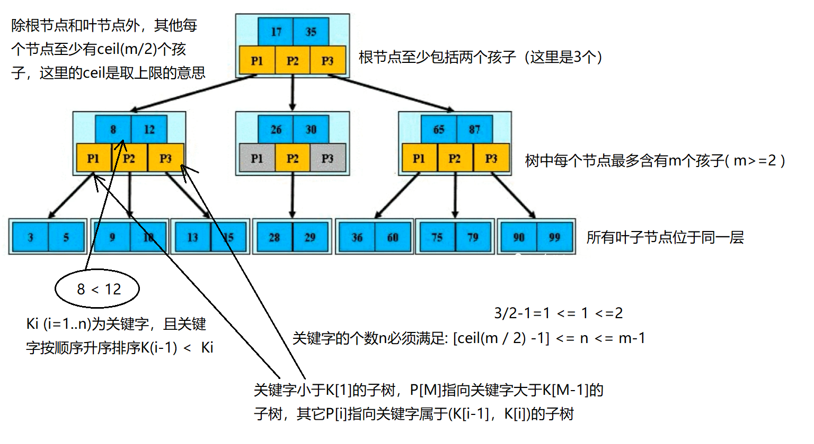
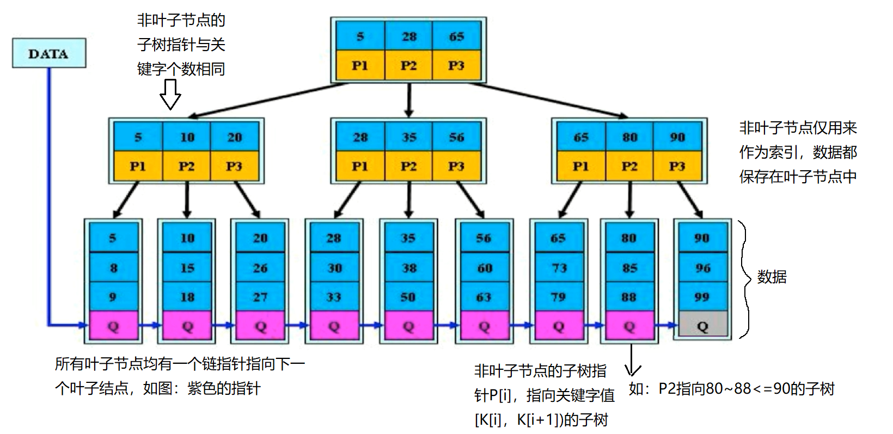
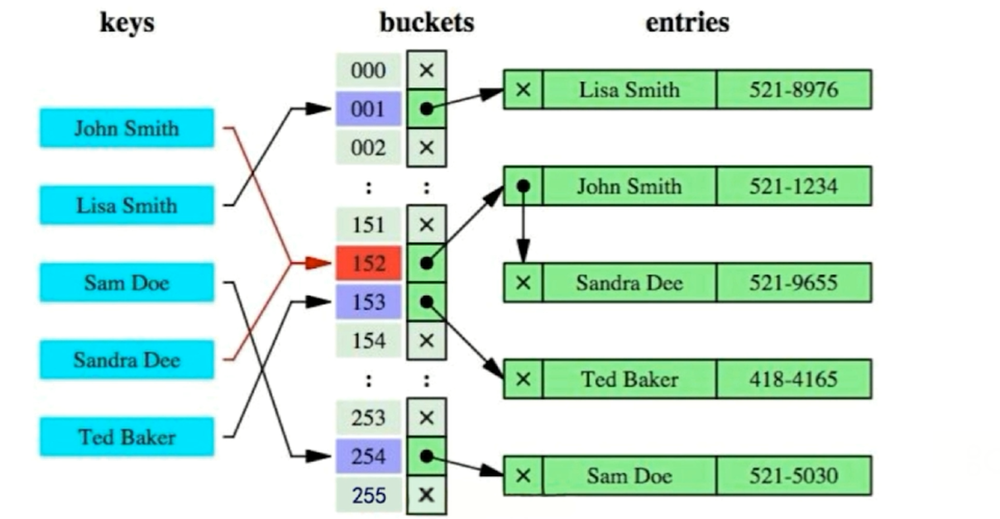
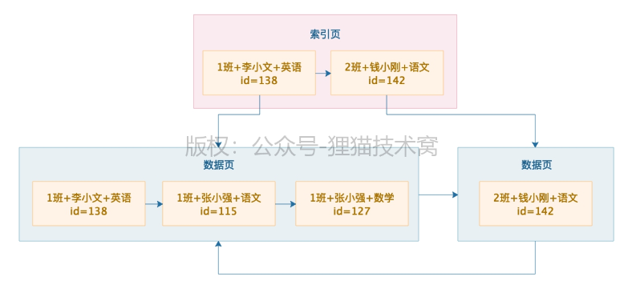
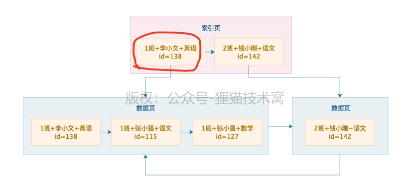
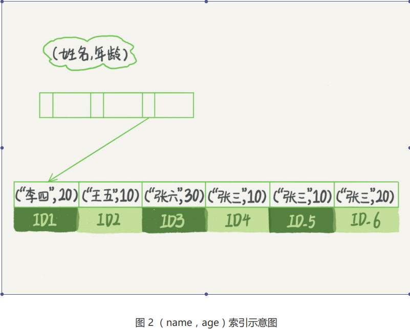
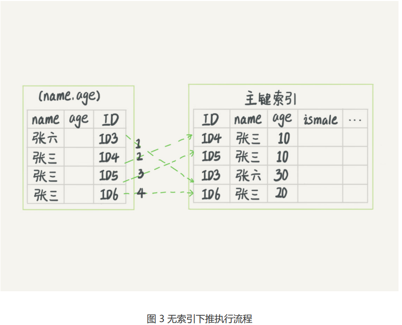
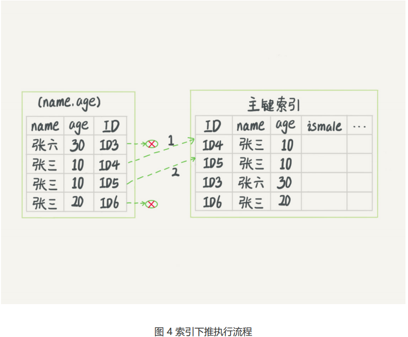
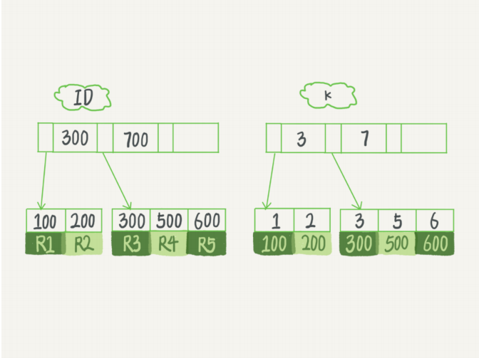

## Mysql 索引

### 索引分类

Mysql 索引类型大致分为两类，分别为BTree 索引与 Hash索引，BTree索引就是我们常说的B+树索引。

> 这里先声明以下，所谓B树的实现表现语义为  B-Tree，B+树 的表现语义为 BTree


Btree 索引又大致分为两类，分别为聚簇索引（也就是我们所说的一级索引）与 二级索引


#### 聚簇索引

聚簇索引 又常被称之为主键索引，mysql的表数据都是根据主键顺序以索引的形式存放的，这种存储方式的表称为索引组织 表，聚簇索引的叶子节点存放的是行数据

Mysql不允许指定某一列作为聚簇索引，只有当为表设定主键的时候才会生成聚簇索引，如果没有定义主键，InndoDB 将会选择唯一的非空索引替代，如果没有这样的索引，Innodb 会隐式定义一个主键作为聚簇索引

聚簇索引的分类代表：主键索引、唯一索引


#### 二级索引

二级索引与主键索引不一样，二级索引叶子节点存放的则是主键的值，当我们根据二级索引查找某一行数据时，根据索引树定位到某个索引子节点时，取出来索引子节点存放的主键值，再根据主键值从新查找 主键索引树的子节点，然后将子节点的值返回给mysql server，这个过程称之为回表

二级索引分类代表：普通索引与联合索引、前缀索引等等


### 为什么Mysql 使用BTree 来存储索引

在 InnoDB 中，表都是根据主键顺序以索引的形式存放的，这种存储方式的表称为索引组织表。又因为前面我们提到的，InnoDB 使用了 B+ 树索引模型，所以数据都是存储在 B+ 树中的。每一个索引在 InnoDB 里面对应一棵 B+ 树。

#### B-Tree

我们先来对比一下B + 树 与 B 树索引的区别， B-Tree 实际的存储图如下：

- 所有键值分布在整个树中
- 任何关键字出现且只出现在一个节点中
- 搜索有可能在非叶子节点结束
- 在关键字全集内做一次查找，性能逼近二分查找算法 

  


#### BTree

BTree 存储图如下：

- 非叶子节点的子树指针与关键字个数相同

- 非叶子节点的子树指针P[i]，指向关键字值[K[i]，K[i+1])的子树

- 非叶子节点仅用来作为索引，数据都保存在叶子节点中

- 所有叶子节点均有一个链指针指向下一个叶子结点

    


#### BTree 与 B-Tree 的区别

我们先来总结下B-Tree 有 BTree 的区别：

-  B-树的关键字和记录是放在一起的，叶子节点可以看作外部节点，不包含任何信息；B+树的非叶子节点中只有关键字和指向下一个节点的索引，记录只放在叶子节点中。 

-  在B-树中，越靠近根节点的记录查找时间越快，只要找到关键字即可确定记录的存在；

  

- **B+Tree更有利于对数据库的扫描** 

  B Tree在提高了磁盘IO性能的同时，并没有解决元素遍历的效率底下的问题，而B+Tree只需要遍历叶子节点就可以解决对全部关键字信息的扫描 ，B+Tree 的每个叶子节点都有用只想下一个叶子节点的指针，且是有序的，这样的话就方便顺序遍历，比如遍历某个表中的所有记录、或者遍历一个目录下的所有文件

- **B+树的磁盘读写代价更低 **

  B+树的内部结点并没有指向关键字具体信息的指针。因此其内部结点相对B 树更小。如果把所有同一内部结点的关键字存放在同一盘块中，那么盘块所能容纳的关键字数量也越多。一次性读入内存中的需要查找的关键字也就越多。相对来说IO读写次数也就降低了。 

- **B+树的查询效率更加稳定**

  由于B+Tree内部节点并不是直接指向文件内容的节点，而只是叶子节点中关键字的索引，所以任何关键字的查找必须走一条从根节点到叶子节点的路，所有关键字查询的路径长度相同，导致每一个数据的查询效率也几乎是相同的，所以查询效率更稳定  


**总结**

1、首先Mysql 使用B+树来存储索引，B+Tree 是多路搜索树既一个节点可以包含很多数据，具体包含多少要根据所在机器的page size 与 索引大小而决定，索引关键字越小那么一个节点存储的就越多，就可以相应的减少磁盘IO次数，又因为B+树的非叶子节点是不存储实际数据的，只存储索引值，所以每一个节点可以存储更多的索引值。这样带来的好处是减少磁盘访问次数

2、B+ 树相比 B 树来说更稳定一些，因为B+ 树的非叶子节点是不存储数据的，所有的数据都被存储到了叶子节点，所以不管我们查找的 数据在B+树的第几层，我们都要到叶子节点获取索引对应的data

3、B + 树的叶子节点是有序的，每一个叶子节点都拥有指向下一个叶子节点的指针，当我们根据索引查询数据时，mysql 会搜索 B + 树存储的索引找到第一个匹配的值所在的叶子节点之后将数据返回给server 层，接着依次向后遍历直到遇到不满足的值即 终止。

4、我们根据 **3 特点** 得出，B + 树 更稳定，不管我们查找的索引值是在第几层，都需要到实际的子节点找到对应的值


#### 二叉树的缺点

一棵 100 万节点的平衡二叉树，树高 20。一次查询可能需要访问 20 个数据块。在机械硬盘时代，从磁盘随机读一个数据块需要 10 ms 左右的寻址时间。也就是说，对于一个 100 万行的表，如果使用二叉树来存储，单独访问一个行可能需要 20 个 10 ms 的时间，这个查询可真够慢的。

为了让一个查询尽量少地读磁盘，就必须让查询过程访问尽量少的数据块。那么，我们就不应该使用二叉树，而是要使用“N 叉”树。这里，“N 叉”树中的“N”取决于数据块的大小。


### Hash 索引

  

#### Hash 索引的优点

根据哈希函数的运算，那只需经过一次定位便能找到需要的数据，相比起B+Tree索引，需要从根节点到非叶子节点，再到叶子节点才能访问到我们需要的数据，这样可能会经过多次的IO访问，所以呢，哈希索引的查询效率理论上要高于B+Tree索引。 


#### Hash 索引的缺点

1、仅仅能满足“=” 、“IN”，不能使用范围查询

2、无法被用来避免数据的排序操作

3、不能利用部分索引建来查询

4、不能避免表扫描

5、遇到大量Hash值相等的情况后性能并不一定就会比B-Tree索引高


### MyISAM 索引与 Innodb 索引的区别

#### Myisam 的特点

1、存储结构MyISAM 存储的表分为三个文件frm(表结构)、MYD（表数据）， MYI（表索引）

2、myisam不支持事务

3、myisam只支持表级锁

4、MyISAM: B+Tree 叶节点的 存储的是指向实际 data 的数据指针，既主键索引与 二级索引的叶子节点都存放的是指向实际data 的指针


#### innodb 的特点

1、Innodb 存储的表分为两个 一个是frm（表结构）、ibd（数据文件和索引文件放在了一起）

2、innodb支持事务

3、innodb支持行级锁， 具有比较好的并发性能，但是行级锁只有在where子句是对索引筛选才生效，非索引where会锁全表

4、InnoDB: 其数据文件本身就是索引文件，innodb 的 主键索引 的 BTree 叶子节点存放的是实际的data 数据，而 二级索引叶子节点存放的是主键的值


### 联合索引

1、联合索引要遵循最左匹配原则，如果联合索引中如果左侧列使用了范围查找，那么右侧列将无法使用该索引来进行数据查询

2、在order by 或者是 group by 查询时，一样要遵循最左匹配原则，否则会导致索引失效，使用文件排序或者是使用临时表分组

举个例子，假如现在存在一个联合索引为 (index_a, index_b), 针对order by 与 group by分析如下：

**order by**

1、如果在where 查询中没有使用到联合索引，那么在进行排序时必须要按照联合索引的顺序使用，否则会导致firesort

```sql
select * from test order by index_b   #firesort

select * from test order by index_a, index_b   #using index
```

2、在where条件中使用到了联合索引，并且在排序时不遵循最左匹配原则，也会导致使用文件排序

```sql
#错误使用方法
select * from test where index_a > 1 order by  index_b   #firesort

# 正确使用方法
select * from test where index_a > 1 order by index_a, index_b  #using index
```

3、、在where条件中使用到了联合索引，并且左侧列为等值查询，那么在order by时可以通过最左匹配原则进行使用

```sql
select * from test where index_a = 1 order by index_b  #using index
```


**group by**

1、在where条件中使用到了联合索引，并且在排序时不遵循最左匹配原则，会导致使用临时表

```sql
#错误使用方法
select * from test where index_a > 1 group by index_b   #Using temporary

# 正确使用方法
select * from test where index_a > 1 group by index_a, index_b  #using index
```

2、在where条件中使用到了联合索引，并且左侧列为等值查询，那么在group by时可以通过最左匹配原则进行使用

```sql
select * from test where index_a = 1 group by index_b  #using index
```

3、如果在where 查询中没有使用到联合索引，那么在进行分组时必须要按照最左匹配原则来使用，否则会导致使用临时表

```sql
#错误使用方法
select count(*) from test group by index_b   #using temporary

#正确使用方法
select count(*) from test group by index_a, index_b   #using index
```


**orderby 与 group by 混用**

> 举个例子，假如现在存在一个联合索引为 (index_a, index_b, index_c), 针对order by 与 group by分析如下：

1、在where条件中使用到了联合索引，并且又同时使用到了group by 以及 order by 那么在使用联合索引的过程中就必须要保证 group by 以及 order by中都要按照联合索引的顺序进行使用

```sql
#错误使用方法（虽然了遵循了联合索引的匹配方式，但是在group by 和 order by 使用时，必须全部遵循联合索引的匹配原则）
1、select count(*) from test where index_a group by index_b order by index_c   #using temporary, using filesort  type=index

#错误使用方法（因为order by 没有遵循联合索引的最左匹配原则，导致group by 也会失效）
2、select count(*) from test where index_a = '1' group by index_a, index_b, index_c order by index_c    #using temporary, using filesort  type=index

#错误使用方法 (在group by 以及 order by 一起使用时，必须要符合联合索引的最左匹配)
3、select * from test  where index_a = '11' group by index_b order by index_a, index_b, index_c

#正确使用方法（在公用order_by 以及 group by 时，要保证order by 中的排序字段一定在group by 中出现过）
4、select * from test force index (test_idx) where index_a = '11' group by index_b，index_c order by index_b

#正确使用方法 (在group by 以及 order by 一起使用时，如果group by遵循了最左匹配原则，那么 order by 只要保证与where 条件搭配即可)
5、select * from test force index (test_idx) where index_a = '11' group by index_a, index_b,index_c order by index_b 

# 正确使用方法 （group by 以及 order by 都遵循最左匹配原则，并且order by 中出现的排序值在group by 中也出现了）
6、select * from test force index (test_idx) where index_a = '11' group by index_b, index_c order by index_b, index_c

#正确使用方法
7、select count(*) from test where index_a group by index_a, index_b order by index_a, index_b    #using index  type=index

#正确使用方法 （type=ref， 这是最优的方式）
8、select * from test  where index_a = '11' group by index_a,index_a,index_c order by index_a, index_b

```

**注意： 需要注意的一点事，group by 以及 order by 是不支持索引下推模式的，如果在搭配group by 或者是order by 使用联合索引就一定要保证联合索引的顺序以及要符合联合索引的查找规范，如下：**

1、在 group by 以及 order by 一起使用的时候，任意一个不遵循联合索引的匹配原则都会导致索引失效，但是这里的失效是指 group by 以及 order by 用不到索引，并不是说where 查找用不到索引

2、在 group by 以及 order by 一起使用的时候，要保证在order by 中使用的联合索引 column 一定在group by中出现过，并且order by 一定也要符合联合索引的匹配规范，比如上面的例子 2 会导致索引失效，但是例子 4  以及 例子 5 则不会

3、在  group by 以及 order by 一起使用的时候，如果where 条件中用到了联合索引，那么就要保证在group by 以及 order by 使用时 都要遵循最左匹配规范，并且还要保证 order by 中用到的联合索引的column 一定要在 group by 中出现过，比如上面的例子 4

4、在  group by 或者 order by 单独使用的时候，只需要符合联合索引的最左匹配原则即可，如下：

```sql
select * from test where index_a = '11' group by index_b   #可以用到索引
select * from test where index_a > '11' group by index_b   #不可以用到索引，因为不符合联合索引的匹配原则

#可以用到索引，虽然在where中index_a用到了范围查询，但是在group by 时匹配了联合索引的使用规范
select * from test where index_a > '11' group by index_a,index_b,index_c   
```


### 索引优化

1、主键长度越小，普通索引的叶子节点就越小，普通索引占用的空间也就越小。

2、尽量使用覆盖索引，避免回表查询

3、我们应该尽量保证主键索引的有序性，或者索引的有序性，尽量使用有序的列来作为索引列，因为mysql是以page的方式来存储这些索引信息的，否则当索引无序时，可能由于插入的数据过多产生大量的页分裂，影响性能与存储空间

4、不建议重建主键索引，由于索引中存储的是主键的key值，那么重建主键时，不但会重建主键，所有的普通索引也会重新构建，所以通常不建议重建索引，无普通索引的除外。

6、尽量选择区分度高的列作为索引， 区分度的公式是count(distinct col)/count(*)，表示字段不重复的比例，比例越大我们扫描的记录数越少，唯一键的区分度是1，而一些状态、性别字段可能在大数据面前区分度就是0，那可能有人会问，这个比例有什么经验值吗？使用场景不同，这个值也很难确定，一般需要join的字段我们都要求是0.1以上，即平均1条扫描10条记录。 

7、 尽量的扩展索引，不要新建索引。比如表中已经有a的索引，现在要加(a,b)的索引，那么只需要修改原来的索引即可。 

8、 禁止在更新十分频繁、区分度不高的属性上建立索引 

9、 建立组合索引，必须把区分度高的字段放在前面 

10、最佳左前缀法则（带头索引不能死，中间索引不能断）


### 索引失效

1、**索引字段使用 or 时，会导致索引失效而转向全表扫描**，如果 or 左右都是索引的话就会使用union(a, b) 索引进行查询，类似于 select * from a union select * from b

2、where语句中索引列使用了负向查询，可能会导致索引失效

3、索引字段可以为null，使用is not null时，可能会导致索引失效，**是在使用is null 时可以通过B+树直接定位到对应的节点**

4、**不要在索引上做任何操作（计算、函数、自动/手动类型转换），不然会导致索引失效而转向全表扫描**

5、对索引列进行运算，一定会导致索引失效

6、**索引字段使用like以通配符开头（‘%字符串’）时，会导致索引失效而转向全表扫描**

7、联合索引中，where中索引列违背最左匹配原则，一定会导致索引失效， 最左前缀匹配原则，非常重要的原则，mysql会一直向右匹配直到遇到范围查询(>、<、between、like)就停止匹配，比如a = 1 and b = 2 and c > 3 and d = 4 如果建立(a,b,c,d)顺序的索引，d是用不到索引的，如果建立(a,b,d,c)的索引则都可以用到，a,b,d的顺序可以任意调整。 

8、MySQL优化器的最终选择，不走索引

9、**索引字段是字符串，但查询时不加单引号，会导致索引失效而转向全表扫描**

10、当我们使用联合索引查询数据时，不能使用联合索引前面的索引进行**范围条件（bettween、<、>、in等）** 查询，这里离需要考虑索引下推，如果是左侧列in查询就一定不支持

11、联合索引主要涉及到以下几个点：

- 最左侧列匹配，并且一定要保证有序
- 最佳左前缀匹配原则，既 类似于 `select * from student_score where class_name like '1%'`，查找所有1打头的班级的分数，那么也是可以用到索引的。
- 全值匹配规则，且保证都是等值操作，mysql会自动帮我们来优化这个顺序
- 范围查找原则，既在联合索引中如果左侧列使用了范围查找，那么右侧列将无法使用该索引来进行数据查询
- 等值匹配+范围匹配的规则，即在建立联合索引的过程中优先将等值查询的列放在左侧，而范围查询的列放在右侧，这样在等值匹配 + 范围查询的时候可以用到该索引


### 联合索引的原理

首先建立联合索引有以下优缺点需要知道：

1、如果常用查询的列在联合索引中那么可以避免回表，增加查询效率

2、我们知道每一个索引都对应了一颗B+树，相对于多索引列来说联合索引可以节省存储空间

3、在使用联合索引的时候并不能像使用多索引列那样，因为联合索引有个原则就是最左匹配原则，我们在查询时必须要按照建立联合索引的顺序来进行查询，否则就会导致索引失效

#### 存储原理

联合索引的存储与普通索引一样，但是在数据页上存储的数据是按照联合索引的数据来排序的，如下图：



上面有两个数据页，第一个数据页里有三条数据，每条数据都包含了联合索引的三个字段的值和主键值，数据页内部是按照顺序排序的。

首先按照班级字段的值来排序，如果一样则按照学生姓名字段来排序，如果一样，则按照科目名称来排序，所以数据页内部都是按照三个字段的值来排序的，而且还组成了单向链表。

然后数据页之间也是有顺序的，第二个数据页里的三个字段的值一定都大于上一个数据页里三个字段的值，比较方法也是按照班级名称、学生姓名、科目名称依次来比较的，数据页之间组成双向链表。

索引页里就是两条数据，分别指向两个数据页，索引存放的是每个数据页里最小的那个数据的值，大家看到，索引页里指向两个数据页的索引项里都是存放了那个数据页里最小的值！

好了，那么现在假设我们想要搜索：1班+张小强+数学的成绩，此时你可能会写一个类似下面的SQL语句，select * from student_score where class_name='1班' and student_name='张小强' and subject_name='数学'。

首先到索引页里去找，索引页里有多个数据页的最小值记录，此时直接在索引页里基于二分查找法来找就可以了，先是根据班级名称来找1班这个值对应的数据页，直接可以定位到他所在的数据页，如下图。



然后可以直接找到索引指向的那个数据页就可以了，在数据页内部本身也是一个单向链表，你也是直接就做二分查找就可以了，先按1班这个值来找，你会发现几条数据都是1班，此时就可以按照张小强这个姓名来二分查找，此时会发现多条数据都是张小强，接着就按照科目名称数学来二分查找。

**其实也就是说当我们根据联合索引进行查找的时候首先根据联合索引最左侧的列进行查找，然后再根据联合索引中的第二列进行筛选，接着是第三列、第四列等等**

所以在联合索引中已经要遵循最左匹配原则，因为在数据筛选的过程中是依次按照联合索引中的列来进行筛选的，如果无法使用中间的列来进行筛选那么就会导致剩下的无法使用


### 索引下推

索引下推是针对联合索引的优化，联合索引是要遵循最左匹配原则的，但是mysql5.6 之后对联合索引做了优化，即便没有办法遵循联合索引的最左原则，依旧可以用到联合索引，这里指的就是索引下推，案例如下：

> 前提：在通过索引查找时，如果无法直接通过索引定位到数据，就需要进行全表扫描，这个时候 Extra中 提示的信息为：Using Where，如果可以直接通过索引定位到数据的话就是 Using Index Condition

```sql
# index(name, age, class_name) Extra: Using Index Condition，Fiter: 10%
explain select * from teacher where name = '2' and age > 3 and class_name = '3';
# index(name, age, class_name) Extra: Using Index Condition, Fiter: 10%
explain select * from teacher where name = '2' and class_name = 1;
# index(name, age, class_name) Extra: Using Index Condition, Fiter: 100%
explain select * from teacher where name = '2' and age = 1 and class_name = '3';
```


这里 以tuser表为例，新建联合索引（name, age），然后进行分析：

```mysql
CREATE TABLE `tuser` ( 
    `id` int(11) NOT NULL,
    `id_card` varchar(32) DEFAULT NULL, 
    `name` varchar(32) DEFAULT NULL, 
    `age` int(11) DEFAULT NULL, 
    `ismale` tinyint(1) DEFAULT NULL,
    PRIMARY KEY (`id`), 
    KEY `id_card` (`id_card`), 
    KEY `name_age` (`name`,`age`)
) ENGINE=InnoDB
```

<br/>

t_user 表中的数据存储如下：




我们以市民表的联合索引（name, age）为例。如果现在有一个需求：检索出表中“名字第一个字是张，而且年龄是 10 岁的所有男孩”。那么，SQL 语句是这么写的：

```mysql
mysql> select * from tuser where name like '张 %' and age=10 and ismale=1;
```

你已经知道了前缀索引规则  `（如果前面的索引使用了like查询是没办法用到后边的索引的）`， 所以这个语句在搜索索引树的时候，只能用 “张”，找到第一个满足条件的记录 ID3。当然，这还不错，总比全表扫描要好。

**在 MySQL 5.6 之前，只能从 ID3 开始一个个回表。到主键索引上找出数据行，再对比字段值。而 MySQL 5.6 引入的索引下推优化（index condition pushdown)， 可以在索引遍历过程中，对索引中包含的字段先做判断，直接过滤掉不满足条件的记录，减少回表次数。**

图 3 和图 4，是这两个过程的执行流程图。






在图 3 和 4 这两个图里面，每一个虚线箭头表示回表一次。

图 3 中，在 (name,age) 索引里面我特意去掉了 age 的值，这个过程 InnoDB 并不会去看 age的值，只是按顺序把“name 第一个字是’张’”的记录一条条取出来回表。因此，需要回表 4次。

图 4 跟图 3 的区别是，InnoDB 在 (name,age) 索引内部就判断了 age 是否等于 10，对于不等于 10 的记录，直接判断并跳过。在我们的这个例子中，只需要对 ID4、ID5 这两条记录回表取数据判断，就只需要回表 2 次。

**总结：当我们使用联合索引查找数据时，如果在索引的左侧列上使用了进行了某些运算导致右边的索引列失效，在查询数据时，会根据左侧列筛选出的结果进行回表查询判断满足右侧列的数据，在 mysql5.6 以后，会优先从在联合索引判断右侧列的数据是否满足，如果不满足则直接排除，减少了回表次数**


### 索引维护

假设，我们有一个主键列为 ID 的表，表中有字段 k，并且在 k 上有索引。

```mysql
mysql> create table T(
    id int primary key, 
    k int not null, 
    name varchar(16),
    index (k)
)engine=InnoDB;
```


这个表的建表语句是：表中 R1~R5 的 (ID,k) 值分别为 (100,1)、(200,2)、(300,3)、(500,5) 和 (600,6)，两棵树的示例示意图如下。



B+ 树为了维护索引有序性，在插入新值的时候需要做必要的维护。以上面这个图为例，如果插入新的行 ID 值为 700，则只需要在 R5 的记录后面插入一个新记录。如果新插入的 ID 值为400，就相对麻烦了，需要逻辑上挪动后面的数据，空出位置。

而更糟的情况是，如果 R5 所在的数据页已经满了，根据 B+ 树的算法，这时候需要申请一个新的数据页，然后挪动部分数据过去。这个过程称为页分裂。在这种情况下，性能自然会受影响。

除了性能外，页分裂操作还影响数据页的利用率。原本放在一个页的数据，现在分到两个页中，整体空间利用率降低大约 50%。

当然有分裂就有合并。当相邻两个页由于删除了数据，利用率很低之后，会将数据页做合并。合并的过程，可以认为是分裂过程的逆过程。

基于上面的索引维护过程说明，我们来讨论一个案例：

> 你可能在一些建表规范里面见到过类似的描述，要求建表语句里一定要有自增主键。当然事无绝对，我们来分析一下哪些场景下应该使用自增主键，而哪些场景下不应该。

自增主键是指自增列上定义的主键，在建表语句中一般是这么定义的： NOT NULL PRIMARYKEY AUTO_INCREMENT。

插入新记录的时候可以不指定 ID 的值，系统会获取当前 ID 最大值加 1 作为下一条记录的 ID值。

也就是说，自增主键的插入数据模式，正符合了我们前面提到的递增插入的场景。每次插入一条新记录，都是追加操作，都不涉及到挪动其他记录，也不会触发叶子节点的分裂。

你可能在一些建表规范里面见到过类似的描述，要求建表语句里一定要有自增主键。当然事无绝对，我们来分析一下哪些场景下应该使用自增主键，而哪些场景下不应该。而有业务逻辑的字段做主键，则往往不容易保证有序插入，这样写数据成本相对较高。


### 注意

1、INNODB行锁是通过给索引项加锁来实现的，即只有通过索引条件检索数据，InnoDB才使用行级锁，否则将使用表锁。 

2、INNODB表是索引组织的表，主键是聚集索引，非主键索引都包含主键信息。