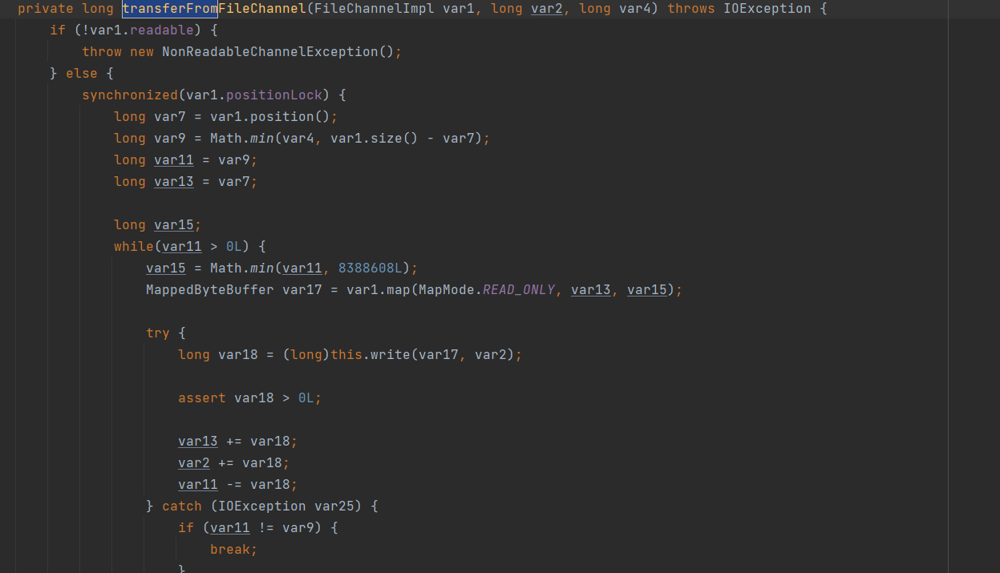

# Nio

Linux IO 执行过程： https://lrita.github.io/2019/03/13/the-internal-of-file-syscall/ （最后回来看）

## JDK 源码

github: https://github.com/openjdk/jdk/blob/jdk8-b120/jdk/src/share/native/java/io/io_util.c

openjdk网址： https://hg.openjdk.java.net/jdk8u/jdk8u/jdk/file/7fcf35286d52/src/solaris/native/sun/nio/ch/FileDispatcherImpl.c

## 总览

Nio 主要由三部分组成 分别为 Channel、Buffer、Selector 三部分，主要增强体现在文件、网络与堆外内存三个地方。API 由以下组成：

- Channel：主要用于文件、或者网络读写
- Channels：用于Channel的工具类
- Buffer：主要用于存储数据，分为堆外堆内两部分
- Selector：
- Path：替代io中的File，用于代表文件或者是路径
- Paths：用于操作Path的工具类
- Files：用于操作文件的工具类
- FileSystem：用于代表不通的操作系统，主要是针对磁盘文件
- FileSystems：用于FileSystem的工具类
- FileSystemPrivider：针对文件的所有操作，包括创建Channel等等，也是用于代表不同系统的底层实现，比如Windows、Linux等等
- SelectorProvider：针对网络的所有操作，包括创建对应的Channel、Selector等等，也是用于代表不同系统的底层实现，比如Windows、Linux等等


### 介绍

Nio 与 IO 对比来说最大提升分别为文件IO与网络io 两部分上，除了底层方面的不同，在API 层次也有所改变。

IO 的实现主要分为以下几种：

- 针对字节流的`InputStream`、`OutputStream`
- 针对字符流的 Reader、Writer
- 针对网络的 Socket 与 ServerSocket

而NIO 完全摒弃了 java io的思想定义了一套新的API ，主要分为以下几种：

- 针对数据存储的 Buffer，分为了HeapBuffer 与 DirectByteBuffer 两种
- 针对数据传输的Channel，分为了 ReadableChannle（读） 、 WriteableChannel（写）、ByteChannel（读写）、FileChanne（文件传输）、SelectableChanne（网络Channel抽象类）、SocketChannel 与 ServerSocketChannel
- 针对非阻塞的 Selector，通过系统底层实现比如：select、poll、epoll 等等，通过selector来轮训对应的socket事件，比如空轮训以及阻塞


### 针对文件io的增强

Nio除了在文件API有所增强，对于文件底层的操作也有增强，主要体现在以下地方：

- 增加了mmap操作，针对磁盘读写方面有很大的增强
- 增加了sendfile操作，可以实现零拷贝，避免了堆内、堆外的复制操作
- 底层文件读写的增强，增加了pwrite、pread 等操作


### 针对 网络io的增强

与文件IO相似，除了API方便的增强，在网络底层操作上的增强如下：

- 增加了非阻塞的直接，其中Selector是最主要的体现，底层实现为epoll、poll、select在不同的系统上有不同的实现

  > **注意：** 在网络环境下的sendfile 必须要借助FileChannel的transferTo方法来实现，transferFrom不支持从网络channel直接到文件
  >
  > <br/>
  >
  > **FileChannel#transferFrom **
  >
  > transferFrom指的是将来源channel的数据拷贝到FileChannel对应的文件中，对于网络这块是压根不支持的，必须要通过中转的DirectByteBuffer实现，代码如下：
  >
  > 
  >
  > 
  >
  > 并且java本身针对文件的的transferFrom方法也是通过mmap来实现的，不存在sendfille一说，代码如下：
  >
  > 
  >
  > 


 ## Buffer

Buffer 主要分为两种，分别为HeapByteBuffer 与 DirectByteBuffer 两种，所有涉及到堆外内存的都需要申请DirectByteBuffer 来进行映射，比如像MappedByteBuffer底层通过mmap来进行映射，但是由于jvm在垃圾回收时堆中的内存位置会进行移动，所以所有涉及到固定内存位置的地方就必须要由堆外内存完成

Nio设计了一个Buffer 抽象类来用于完成Buffer的大部分操作，类图如下：


### 抽象类 Buffer 

Buffer 本质上是一块可以写入数据，然后可以从中读取数据的内存。这块内存被包装成NIO Buffer对象，并提供了一组方法，用来方便的访问该块内存。

为了理解Buffer的工作原理，需要熟悉它的三个属性：

- capacity
- position
- limit

这里有一个关于capacity，position和limit在读写模式中的说明，详细的解释在插图后面。


#### capacity

作为一个内存块，Buffer有一个固定的大小值，也叫“capacity” 表示当前缓冲区的容量,也就是最多只能写入容量值得字节，整形等数据。一旦buffer写满了就需要清空已读数据以便下次继续写入新的数据。

#### position

当写入数据到Buffer的时候需要中一个确定的位置开始，默认初始化时这个位置position为0，一旦写入了数据比如一个字节，整形数据，那么position的值就会指向数据之后的一个单元，position最大可以到capacity-1.

当从Buffer读取数据时，也需要从一个确定的位置开始。

buffer从写入模式变为读取模式时，position会归零，每次读取后，position向后移动。

#### limit

在写模式，limit的含义是我们所能写入的最大数据量。它等同于buffer的容量。

一旦切换到读模式，limit则代表我们所能读取的最大数据量，他的值等同于写模式下position的位置。

数据读取的上限时buffer中已有的数据，也就是limit的位置（原position所指的位置）。


### Buffer 重要方法

**slice 方法**

创建一个新的Buffer对象，但是公用同一个byte数组，并且position被置为0，limit 和 capnity 为 remaining

**duplicate 方法**

创建一个新的Buffer对象，但是公用同一个byte数组，属性与原来一致

```java
  public ByteBuffer slice() {
        return new HeapByteBuffer(hb,
                                        -1,
                                        0,
                                        this.remaining(),
                                        this.remaining(),
                                        this.position() + offset);
    }

    public ByteBuffer duplicate() {
        return new HeapByteBuffer(hb,
                                        this.markValue(),
                                        this.position(),
                                        this.limit(),
                                        this.capacity(),
                                        offset);
    }
```


### HeapByteBuffer

HeapByteBuffer 指的是堆内开辟的存储空间用于存储数据，在从磁盘或者是从网络socket中读取数据时要求申请的内存空间位置不得移动也就是说内存位置不能改变，但是JVM在垃圾回收时会移动内存中的数据位置，比如像常用的CMS垃圾回收器可能会涉及到碎片整理、或者像G1垃圾回收器在回收完成后为了避免磁盘碎片会使用复制算法来复制GC后的存活对象，那这样就会导致这些对象在内存中移动，所以为了避免GC之后内存移动带来的影响，每次读取或者写入数据到磁盘、网络时，都需要借助堆外的内存来完成。不管是FileChannel 还是SocketChannel底层都是通过sun包下的IOUtil这个类来实现的，内部实现代码如下，这里以写入为例：

```java
static int write(FileDescriptor var0, ByteBuffer var1, long var2, NativeDispatcher var4) throws IOException {
    	//首先判断是否是DirectByteBuffer，如果是DirectByteBuffer则直接写入
        if (var1 instanceof DirectBuffer) {
            return writeFromNativeBuffer(var0, var1, var2, var4);
        } else {
            int var5 = var1.position();
            int var6 = var1.limit();

            assert var5 <= var6;

            int var7 = var5 <= var6 ? var6 - var5 : 0;
            
            //如果不是DirectByteBuffer，则开辟一块临时堆外内存用于写入
            ByteBuffer var8 = Util.getTemporaryDirectBuffer(var7);

            int var10;
            try {
               	//将堆内存中的数据拷贝到DirectByteBuffer
                var8.put(var1);
                var8.flip();
                var1.position(var5);
                //从堆外内存写入到文件描述符中（在linux中不管是文件还是socket都是一个文件描述符）
                int var9 = writeFromNativeBuffer(var0, var8, var2, var4);
                if (var9 > 0) {
                    var1.position(var5 + var9);
                }

                var10 = var9;
            } finally {
                Util.offerFirstTemporaryDirectBuffer(var8);
            }

            return var10;
        }
    }
```

同理，读取也是这样的流程，都是要通过堆外内存来完成


### DirectByteBuffer

DirectByteBuffer 指的是堆外开辟的空间，java所有涉及到文件io、网路io的都是基于堆外内存来完成的。而堆外内存的创建与释放都是借助于Unsafe对象来完成。

但是有一点要注意，针对堆内的Buffer垃圾回收都是有GC 帮我们完成的，而堆外内存的回收则需要借助Cleaner来帮助回收。在创建DirectByteBuffer对象时会同时创建一个Cleaner对象的成员变量，这个对象就是用于帮助回收堆外内存的，DirectByteBuffer对象本身是在JVM内部申请的，但是堆外内存的起始位置则保存在了DirectByteBuffer对象内部，实现代码如下：

```java
private final Cleaner cleaner;

public Cleaner cleaner() { return cleaner; }

DirectByteBuffer(int cap) {                   // package-private

        super(-1, 0, cap, cap);
        //代码省略...
        long base = 0;
        try {
        
        	//通过unsafe来开辟堆外内存
            base = unsafe.allocateMemory(size);
        } catch (OutOfMemoryError x) {
            Bits.unreserveMemory(size, cap);
            throw x;
        }
        
        //初始化内存
        unsafe.setMemory(base, size, (byte) 0);
        //代码省略...
        
        //创建Cleaner对象，Deallocator用于主要的责任是用于回收上面申请的内存区域
        cleaner = Cleaner.create(this, new Deallocator(base, size, cap));
    }
    
    
    private static class Deallocator
        implements Runnable
    {

        private static Unsafe unsafe = Unsafe.getUnsafe();

        //地址起始偏移位置
        private long address;
        private long size;
        private int capacity;

        private Deallocator(long address, long size, int capacity) {
            assert (address != 0);
            this.address = address;
            this.size = size;
            this.capacity = capacity;
        }

        public void run() {
            if (address == 0) {
                // Paranoia
                return;
            }
            
            //通过unsafe对象来释放当前的内存区域
            unsafe.freeMemory(address);
            address = 0;
            Bits.unreserveMemory(size, capacity);
        }

    }
```

> **扩展**
>
> Cleaner 本身继承了PhantomReference类的，而PhantomReference代表的是一个虚引用，只要关联的强引用对象没有引用时，那么虚引用持有的对象会被直接回收，举个例子：比如我们创建来了一个PhantomReference对象，并且传入了一个Object的强引用对象，那么当这个Object对象没有再被其他对象引用时，就可以直接进行回收, 在nio这一块就是为了避免内存泄漏产生，示例代码如下：
>
> ```java
> Object obj = new Object();
> PhantomReference reference = new PhantomReference(obj, null);
> obj = null;
> ```
>
> 我们从代码可以看到当外部不再持有obj对象的引用时，那么这个对象就会被直接回收。
>
> 
>
> Cleaner内部代码如下：
>
> ```java
> public class Cleaner extends PhantomReference<Object> {
>     //为所有需要回收的堆外内存对象通用一个ReferenceQueue
>     private static final ReferenceQueue<Object> dummyQueue = new ReferenceQueue();
>     private static Cleaner first = null;
>     private Cleaner next = null;
>     private Cleaner prev = null;
>     private final Runnable thunk;
> 
>    
>     private Cleaner(Object var1, Runnable var2) {
>         super(var1, dummyQueue);
>         this.thunk = var2;
>     }
>     public void clean() {
>         if (remove(this)) {
>             try {
>                 //执行Deallocator的run方法，来释放当前的堆外内存
>                 this.thunk.run();
>             } catch (final Throwable var2) {
>                 //代码省略...
> 
>         }
>     }
> }
> ```
>
> Cleaner对象则会在对当前对象回收时进行调用，这块代码在Reference类中来实现的，这也就是为什么Cleaner要继承PhantomReference的原因，一部分是为了加速回收这些堆外内存，另一部分则是为了通过Reference的回收代码来完成，其实也是为了解耦，总的来说就是 Cleaner类是为了那些资源使用完成后需要进行释放资源的地方使用的，Reference 代码如下：
>
> **在Reference类内部有一个static修饰的线程对象，目的就是为了处理这些需要回收的对象**
>
> ```java
> //在static修饰的线程对象内部的run方法中被调用
> static boolean tryHandlePending(boolean waitForNotify) {
>         Reference<Object> r;
>         Cleaner c;
>         try {
>             synchronized (lock) {
>             	//判断当前被回收的对象是否为空，pending由jvm为我们赋值，既当前需要回收的对象对应的Reference
>                 if (pending != null) {
>                     r = pending;
>                     // 'instanceof' might throw OutOfMemoryError sometimes
>                     // so do this before un-linking 'r' from the 'pending' chain...
>                     //判断是否为cleaner对象，如果是cleaner对象则进行赋值
>                     c = r instanceof Cleaner ? (Cleaner) r : null;
>                     // unlink 'r' from 'pending' chain
>                     //下一个需要处理的Reference对象，由JVM帮我们赋值
>                     pending = r.discovered;
>                     r.discovered = null;
>                 } else {
>                     // The waiting on the lock may cause an OutOfMemoryError
>                     // because it may try to allocate exception objects.
>                     if (waitForNotify) {
>                         lock.wait();
>                     }
>                     // retry if waited
>                     return waitForNotify;
>                 }
>             }
>         } catch (OutOfMemoryError x) {
>             // Give other threads CPU time so they hopefully drop some live references
>             // and GC reclaims some space.
>             // Also prevent CPU intensive spinning in case 'r instanceof Cleaner' above
>             // persistently throws OOME for some time...
>             Thread.yield();
>             // retry
>             return true;
>         } catch (InterruptedException x) {
>             // retry
>             return true;
>         }
> 
> 	    // 如果Cleaner对象不为null，也就是说当前Reference是Cleaner对象的实例，那么就执行clean方法，来进行调用，比如nio的话就是来释放内存
>         // Fast path for cleaners
>         if (c != null) {
>             c.clean();
>             return true;
>         }
> 
>         ReferenceQueue<? super Object> q = r.queue;
>         //将当前需要回收的Reference对象添加到ReferenceQueue中，代表已经回收完成了
>         if (q != ReferenceQueue.NULL) q.enqueue(r);
>         return true;
>     }
> ```


### PageCache

**Page cache 是用户空间与磁盘之间的一层缓存，通过将一部分硬盘上的数据存放在内存中，使得对这部分数据的访问不需要再读取硬盘了，从而提高了读写性能。也就是说当需要与磁盘进行交互时，都必须要先与Page Cache进行交互.**，如下图：


Page Cache以页为单位，一般一页为4kb。linux通过 `getconf PAGESIZE` 进行查看，当程序需要将数据写入文件时，并不会，也不能直接将数据写到磁盘上，而是先将数据复制到Page Cache中，并标记为dirty，等待系统的flusher线程定时将这部分数据落到硬盘上。

对于用户程序来说，**因为不能直接访问内核缓存，所以读取文件数据都必须等待系统将数据从磁盘上复制到page cache中，再从page cache复制一份到用户态的内存中。于是读取文件就产生了2次数据的复制：`硬盘->page cache，page cache=>用户态内存`。**

mmap是一种内存映射文件的方法，即将一个文件或者其它对象映射到进程的内存中，实现文件磁盘地址和进程内存地址的映射关系。映射完成后，进程就可以直接读写操作这一段内存，而系统会自动回写dirty页面到对应的文件磁盘上，`即完成了对文件的操作而不必再调用read,write等系统调用函数。`

## 


### 虚拟内存

#### 概念

在了解虚拟内存之前，这里先了解几个概念

- **MMU**：CPU的内存管理单元。
- **物理内存**：即内存条的内存空间。
- **虚拟内存**：计算机系统内存管理的一种技术。它使得应用程序认为它拥有连续的可用的内存（一个连续完整的地址空间），而实际上，它通常是被分隔成多个物理内存碎片，还有部分暂时存储在外部磁盘存储器上，在需要时进行数据交换。
- **交换空间**：操作系统反映构建并使用虚拟内存的硬盘空间大小而创建的文件，在windows下，即pagefile.sys文件，其存在意味着物理内存被占满后，将暂时不用的数据移动到硬盘上。
- **缺页中断**：当程序试图访问已映射在虚拟地址空间中但未被加载至物理内存的一个分页时，由MMC发出的中断。如果操作系统判断此次访问是有效的，则尝试将相关的页从虚拟内存文件中载入物理内存。

我们知道物理内存就是我们常说的内存条，在我们申请或者使用内存时，往往需要申请连续的内存，但是在使用过程中可能由于申请的内存并不是统一规格，这样会造成很多内存碎片，为了更有效的利用这些内存碎片就提出了虚拟内存的概念，当我们需要申请连续的内存时，我们只要保证在虚拟内存中是连续的就可以了，因为虚拟内存与物理内存是通过page table来进行维护的，当我们申请虚拟内存时并不会建立正真的隐射，而是在实际对这块虚拟内存进行操作时才会进行映射

引入虚拟地址之后，对于每一个进程，操作系统提供一种假象，让每个进程感觉自己拥有一个巨大的连续的内存可以使用，这个虚拟的空间甚至还可以比内存的容量还大。这个“假象”就是虚拟地址空间。虚拟地址是面向每个进程的，只是一个“假象”罢了。

此时CPU使用虚拟地址向内存寻址，通过专用的内存管理单元（MMU）硬件把虚拟地址转换为真实的物理地址（地址翻译），操作系统负责把虚拟地址和物理地址的映射关系维护在页表之中。


#### 页表

在计算机上有一个页表（page table），就是映射虚拟内存页到物理内存页的，更确切的说是页号到页帧号的映射，而且是一对一的映射。

虚拟地址和物理地址的映射关系是以“页”为单位的。分页就是把整个虚拟内存和物理内存分割成大小固定的块，以一个页作为映射的最小单位。运行时，CPU请求一个虚拟地址，虚拟地址又被翻译为物理地址，从而确定数据在内存中的哪个位置。下面的页表中记录了这个进程虚拟内存每个页的映射关系。


当CPU寻址的时候，这个映射会有三种可能。

- 未分配：虚拟地址所在的那一页并未被分配，代表没有数据和他们关联，这部分也不会占用内存。
- 未缓存：虚拟地址所在的那一页被分配了，但并不在内存中。
- 已缓存：虚拟地址所在的那一页就在内存中。

　　当访问一个未缓存的区域时，系统将产生缺页中断，然后进程被阻塞，等待操作系统将缺失的那一页从磁盘复制到内存。当复制完成后，CPU继续执行导致缺页中断的那条指令，此时就会正常执行了。这种仅在需要的时候将页面拷贝到内存的策略叫做**按需调度页面**。 可以想象当程序被装入内存的时候，开始时仅有有很小的一部分内容被放入内存。程序在运行中不断缺页，不断的把需要的部分拷贝进内存。


### 传统的文件读写

#### 页缓存

`页缓存(page cache)` 是读写文件时的中间层，内核使用 `页缓存` 与文件的数据块关联起来。所以应用程序读写文件时，实际操作的是 `页缓存`。read/write 也是如此，当我们需要进行读取、写入操作时也都是需要依赖Page Cache为完成的，以修改文件为例，修改一个文件的内容需要如下3个步骤，如下图：

- 把文件内容读入到内存中。
- 修改内存中的内容。
- 把内存的数据写入到文件中。


我们从上图可以看到不管是read还是write操作的都是Page Cache，这就表明不只是mmap，而是在系统层次来说如果需要与磁盘做交互都需要借助于Page Cache来来完成，如果使用代码来实现上面的过程，代码如下：

```c
read(fd, buf, 1024);  // 读取文件的内容到buf
...                   // 修改buf的内容
write(fd, buf, 1024); // 把buf的内容写入到文件
```


#### 读写流程


根据上图分析流程流程如下： 

**写入流程** 

用户程序通过write 写系统调用，启动io操作。

- step 1）write 写系统调用导致进程从用户态切换到内核态。

- step 2）sys_write  内核函数，将用户空间内存数据放入内核地址空间缓冲区。

  这是一次CPU负责的内存复制。但是，这次将数据放入另一个与文件或者设备相关的缓冲区.，如果该内核地址缓冲区与套接字相关，叫做socket send  buffer，如果与文件系统相关，叫做filesystem cache，

- step 3） 当DMA引擎将数据从内核缓冲区传递到协议栈引擎时。这是一次DMA负责的内存复制，CPU不用参与其中。
- step 4）write系统调用返回，进程从内核模式切换到用户模式


**读取流程**

- step 1）read系统调用,  首先导致进程从用户模式切换到内核模式。在阻塞式的IO模式下，  用户进程等待系统调用返回。系统会等待内核缓存中的数据。

- step 2）  数据的最初的副本，由DMA引擎执行复制，复制到内核缓存。这是一次DMA负责的内存复制，CPU不用参与其中。

  DMA引擎读取文件内容（或者网卡协议栈缓存内容），并将其存储到内核地址空间缓冲区中

- step 3）sys_read 内核函数，将数据从内核缓冲区复制到用户缓冲区，然后读取的系统调用返回这是一次CPU负责的内存复制。

- step 4）read调用返回，导致进程从内核切换回用户模式。现在，数据存储在用户地址空间缓冲区中，并且进程可以重新开始


### mmap + write

mmap+write 与 sendfile 对比： https://zhuanlan.zhihu.com/p/507905978

所有现代操作系统都使用虚拟内存，使用**虚拟地址取代物理地址**，这样做的好处就是：

> 1、多个虚拟内存可以指向同一个物理地址
> 2、虚拟内存空间可以远远大于物理内存空间

我们利用**第一条特性可以优化一下上面的设计思路**，就是把**内核空间和用户空间的虚拟地址映射到同一个物理地址**，这样就不需要来回复制了，看图：


#### mmap读流程

使用mmap+write方式替换原来的传统IO方式，就是利用了虚拟内存的特性，**mmap读流程如下**


​     

#### mmap写流程


整体流程的核心区别就是，把数据读取到内核缓冲区后，应用程序进行写入操作时，直接是把**内核的Read Buffer的数据复制到 Socket Buffer 以便进行写入，这次内核之间的复制也是需要CPU参与的**。

> 注意：最后把Socket Buffer数据拷贝到很多地方，统称protocol engine（协议引擎）

这个流程就**少了一个CPU Copy**，提升了IO的速度。不过发现**上下文的切换还是4次**，没有减少，因为还是要**应用程序发起write操作**, 分为**两步操作**，如下：

```java
mmap();  //1、内存映射
write();  //2、数据写入
```


### MappedByteBuffer

MappedByteBuffer 详解： https://www.cnblogs.com/crazymakercircle/p/15625329.html

MappedByteBuffer指的是通过mmap调用之后在用户空间映射缓冲区域与PageCache相对应，底层实现也是DirectByteBuffer，从这里也可以看出所有涉及到内存位置不可移动的底层都是通过堆外内存来完成的，在java层面虽然用了DirectByteBuffer对象来代表所有的堆外内存，但是对于mmap隐射的区域也有部分特有的操作，比如load，force等等

> 虽然底层是使用DirectByteBuffer但是作用于不通的场景时还是有些区别的，比如read/write时就只是被当做一块堆外内存，而mmap时则被作为Page Cache 对应的用户空间缓冲区域，主要区别还是在于调用是read/write还是mmap操作
>
> java 中的mmap 操作被内置在FileChannel的map方法中来实现的，我们通过上面mmap函数可以看到有一个flag参数，就是用来mmap时指定映射对象的类型，在java中 flag被指定为了 `MAP_SHARD`
>
> ```
> MAP_SHARED //与其它所有映射这个对象的进程共享映射空间。对共享区的写入，相当于输出到文件。直到msync()或者munmap()被调用，文件实际上不会被更新。
> ```
>

java 在创建MappedByteBuffer 时 会使用DirectByteBuffer不同的构造器实现，这里不会开辟新的内存，而是通过指针操作，如下：

```java
	//如果是创建堆外内存的时候使用的是单参数构造器
    DirectByteBuffer(int cap) {                   // package-private

        super(-1, 0, cap, cap);
        boolean pa = VM.isDirectMemoryPageAligned();
        int ps = Bits.pageSize();
        long size = Math.max(1L, (long)cap + (pa ? ps : 0));
        Bits.reserveMemory(size, cap);

        long base = 0;
        try {
            //开辟新的内存
            base = unsafe.allocateMemory(size);
        } catch (OutOfMemoryError x) {
            Bits.unreserveMemory(size, cap);
            throw x;
        }
        unsafe.setMemory(base, size, (byte) 0);
        if (pa && (base % ps != 0)) {
            // Round up to page boundary
            address = base + ps - (base & (ps - 1));
        } else {
            address = base;
        }
        cleaner = Cleaner.create(this, new Deallocator(base, size, cap));
        att = null;
}
```

```java
//如果是创建的是MappedByteBuffer时，使用的是address 赋值构造器,这里不会开辟新的内存，而是将mmap之后的指针地址赋值给address
protected DirectByteBuffer(int cap, long addr,
                                     FileDescriptor fd,
                                     Runnable unmapper)
    {
        super(-1, 0, cap, cap, fd);
        address = addr;
        cleaner = Cleaner.create(this, unmapper);
        att = null;
    }
```


#### mmap读写文件

从上面传统读写文件的过程中，我们可以发现有个地方可以优化：如果可以直接在用户空间读写 `页缓存`，那么就可以免去将 `页缓存` 的数据复制到用户空间缓冲区的过程。使用 `mmap` 系统调用可以将用户空间的虚拟内存地址与文件进行映射（绑定），对映射后的虚拟内存地址进行读写操作就如同对文件进行读写操作一样。原理如图  所示：


从java的角度来看的话就是，首先在简历mmap之前会在堆外建立一个与mmap对应大小的缓冲区，然后通过映射将该缓冲区直接映射到PageCache，这样就避免了从用户缓冲区复制到PageCache的过程（也就是从堆外复制到PageCache的过程），并且我们通过上面知道传统的读写都是通过read/write操作来进行的，而mmap则帮忙省略了这个过程，也就是说**mmap之后，不需要在通过read/write来读写内存了**

从上图可看出读写文件都需要经过 `页缓存`，所以 `mmap` 映射的正是文件的 `页缓存`，而非磁盘中的文件本身。由于 `mmap` 映射的是文件的 `页缓存`，所以就涉及到同步的问题，即 `页缓存` 会在什么时候把数据同步到磁盘

Linux 内核并不会主动把 `mmap` 映射的 `页缓存` 同步到磁盘，而是需要用户主动触发。同步 `mmap` 映射的内存到磁盘有 4 个时机：

- 调用 `msync` 函数主动进行数据同步（主动）。
- 调用 `munmap` 函数对文件进行解除映射关系时（主动）。
- 进程退出时（被动）。
- 系统关机时（被动）。


当我们通过 mmap 读取文件时，将经历以下步骤：

1. 在当前用户虚拟内存空间中分配一片 **指定映射大小** 的虚拟内存区域。
2. 将磁盘中的文件映射到这片内存区域，等待后续 **按需** 进行页面调度。
3. 当CPU真正访问数据时，触发 **缺页异常** 将所需的数据页从磁盘拷贝到物理内存，并将物理页地址记录到页表。
4. 进程通过页表得到的物理页地址访问文件数据。


而作为对比，当通过 **标准IO** 读取一个文件时，步骤为：

1. 将 **完整** 的文件从磁盘拷贝到物理内存（内核空间）。
2. 将完整文件数据从 **内核空间** 拷贝到 **用户空间** 以供进程访问。


#### mmap 内存映射

我们从上面了解到虚拟内存需要与物理内存进行关联才能使用，那么在mmap的系统调用过程中，并不会对虚拟内存进行任何的映射操作, 而是只进行了简单的字段赋值，但我们**要注意的是虚拟内存必须映射到物理内存才能使用。如果访问没有映射到物理内存的虚拟内存地址，CPU 将会触发缺页异常。也就是说，虚拟内存并不能直接映射到磁盘中的文件。**

读写文件时并不是直接对磁盘上的文件进行操作的，而是通过 `页缓存` 作为中转的，而页缓存就是物理内存中的内存页。所以，`mmap()` 可以通过将文件的页缓存映射到虚拟内存空间来实现对文件的映射。

但我们在 `mmap()` 系统调用的实现中，也没看到将文件页缓存映射到虚拟内存空间。那么映射过程是在什么时候发生的呢？`答案就是：缺页异常`

`mmap()` 是通过将虚拟内存地址映射到文件的页缓存来实现的。当对映射后的虚拟内存进行读写操作时，其效果等价于直接对文件的页缓存进行读写操作。对文件的页缓存进行读写操作，也等价于对文件进行读写操作。如下图：


> **扩展 （不重要）：**
>
> ## **mmap 实现**
>
> ### **1. 文件映射**
>
> 当我们使用 `mmap()` 系统调用对文件进行映射时，将会触发调用 `do_mmap_pgoff()` 内核函数来完成工作，我们来看看 `do_mmap_pgoff()` 函数的实现（经过精简后）：
>
> ```cpp
> unsigned long
> do_mmap_pgoff(struct file *file, unsigned long addr, 
>               unsigned long len, unsigned long prot, 
>               unsigned long flags, unsigned long pgoff)
> {
>     ...
>     // 1. 获取一个未被使用的虚拟内存区
>     addr = get_unmapped_area(file, addr, len, pgoff, flags);
>     if (addr & ~PAGE_MASK)
>         return addr;
> 
>     ...
>     // 2. 调用 mmap_region() 函数继续进行映射操作
>     return mmap_region(file, addr, len, flags, vm_flags, pgoff, accountable);
> }
> ```
>
> 经过精简后的 `do_mmap_pgoff()` 函数主要完成 2 个工作：
>
> - 首先，调用 `get_unmapped_area()` 函数来获取进程没被使用的虚拟内存区，并且返回此内存区的首地址。
> - 然后，调用 `mmap_region()` 函数继续进行映射操作。
>
> > 在 32 位的操作系统中，每个进程都有 4GB 的虚拟内存空间，应用程序在使用内存前，需要先向操作系统发起申请内存的操作。操作系统会从进程的虚拟内存空间中查找未被使用的内存地址，并且返回给应用程序。
> > 操作系统会记录进程正在使用中的虚拟内存地址，如果内存地址没被登记，说明此内存地址是空闲的（未被使用）。
>
> 我们继续来看看 `mmap_region()` 函数的实现，代码如下（经过精简后）：
>
> ```cpp
> unsigned long
> mmap_region(struct file *file, unsigned long addr,
>             unsigned long len, unsigned long flags,
>             unsigned int vm_flags, unsigned long pgoff,
>             int accountable)
> {
>     struct mm_struct *mm = current->mm;
>     struct vm_area_struct *vma, *prev;
>     int correct_wcount = 0;
>     int error;
>     ...
> 
>     // 1. 申请一个虚拟内存区管理结构(vma)
>     vma = kmem_cache_zalloc(vm_area_cachep, GFP_KERNEL);
>     ...
> 
>     // 2. 设置vma结构各个字段的值
>     vma->vm_mm = mm;
>     vma->vm_start = addr;
>     vma->vm_end = addr + len;
>     vma->vm_flags = vm_flags;
>     vma->vm_page_prot = protection_map[vm_flags & (VM_READ|VM_WRITE|VM_EXEC|VM_SHARED)];
>     vma->vm_pgoff = pgoff;
> 
>     if (file) {
>         ...
>         vma->vm_file = file;
> 
>         /* 3. 此处是内存映射的关键点，调用文件对象的 mmap() 回调函数来设置vma结构的 fault() 回调函数。
>          *    vma对象的 fault() 回调函数的作用是：
>          *        - 当访问的虚拟内存没有映射到物理内存时，
>          *        - 将会调用 fault() 回调函数对虚拟内存地址映射到物理内存地址。
>          */
>         error = file->f_op->mmap(file, vma);
>         ...
>     }
>     ...
> 
>     // 4. 把 vma 结构连接到进程虚拟内存区的链表和红黑树中。
>     vma_link(mm, vma, prev, rb_link, rb_parent);
>     ...
> 
>     return addr;
> }
> ```
>
> `mmap_region()` 函数主要完成以下 4 件事情：
>
> - 申请一个 `vm_area_struct` 结构（vma），内核使用 vma 来管理进程的虚拟内存地址
> - 设置 vma 结构各个字段的值。
> - 通过调用文件对象的 `mmap()` 回调函数来设置vma结构的 `fault()` 回调函数，一般文件对象的 `mmap()` 回调函数为：`generic_file_mmap()`。
> - 把新创建的 vma 结构连接到进程的虚拟内存区链表和红黑树中。
>
> 内核使用 `vm_area_struct` 结构来管理进程的虚拟内存地址。当进程需要使用内存时，首先要向操作系统进行申请，操作系统会使用 `vm_area_struct` 结构来记录被分配出去的内存区的大小、起始地址和权限等。
>
> 我们来看看 `vm_area_struct` 结构的定义：
>
> ```cpp
> struct vm_area_struct {
>     struct mm_struct *vm_mm;
>     unsigned long vm_start;              // 内存区的开始地址
>     unsigned long vm_end;                // 内存区的结束地址
>     struct vm_area_struct *vm_next;      // 把进程所有已分配的内存区链接起来
>     pgprot_t vm_page_prot;               // 内存区的权限
>     ...
>     struct rb_node vm_rb;                // 为了加快查找内存区而建立的红黑树
>     ...
>     struct vm_operations_struct *vm_ops; // 内存区的操作回调函数集
> 
>     unsigned long vm_pgoff;
>     struct file *vm_file;                // 如果映射到文件，将指向映射的文件对象
>     ...
> };
> 
> struct vm_operations_struct {
>     // 当虚拟内存区没有映射到物理内存地址时，将会触发缺页异常，
>     // 而在缺页异常处理函数中，将会调用此回调函数来对虚拟内存映射到物理内存。
>     int (*fault)(struct vm_area_struct *vma, struct vm_fault *vmf);
>     ...
> };
> ```
>
> 当把文件映射到虚拟内存空间时，需要把 `vma` 结构的 `vm_file` 字段设置为要映射的文件对象，然后调用文件对象的 `mmap()` 回调函数来设置 `vma` 结构的 `fault()` 回调函数。
>
> > `vma` 结构的 `fault()` 回调函数的作用是：当虚拟内存区没有映射到物理内存地址时，将会触发缺页异常。而在缺页异常处理中，将会调用此回调函数来对虚拟内存映射到物理内存。
>
> 我们来看看 `generic_file_mmap()` 函数是怎么设置 `vma` 结构的 `fault()` 回调函数的：
>
> ```cpp
> struct vm_operations_struct generic_file_vm_ops = {
>     .fault = filemap_fault, // 将 fault() 回调函数设置为：filemap_fault()
> };
> 
> int generic_file_mmap(struct file *file, struct vm_area_struct *vma)
> {
>     ...
>     vma->vm_ops = &generic_file_vm_ops;
>     ...
>     return 0;
> }
> ```
>
> 至此，文件映射的过程已经分析完毕。我们来看看其调用链：
>
> ```cpp
> sys_mmap()
> └→ do_mmap_pgoff()
>    └→ mmap_region()
>       └→ generic_file_mmap()
> ```
>
> ### **2. 缺页异常**
>
> 前面介绍了 `mmap()` 系统调用的处理过程，可以发现 `mmap()` 只是将 `vma` 的 `vm_file` 字段设置为被映射的文件对象，并且将 `vma` 的 `fault()` 回调函数设置为 `filemap_fault()`。也就是说，`mmap()` 系统调用并没有对虚拟内存进行任何的映射操作。
>
> 虚拟内存必须映射到物理内存才能使用。如果访问没有映射到物理内存的虚拟内存地址，CPU 将会触发缺页异常。也就是说，虚拟内存并不能直接映射到磁盘中的文件。
>
> 那么 mmap() 是怎么将文件映射到虚拟内存中呢？
>
> 读写文件时并不是直接对磁盘上的文件进行操作的，而是通过 `页缓存` 作为中转的，而页缓存就是物理内存中的内存页。所以，`mmap()` 可以通过将文件的页缓存映射到虚拟内存空间来实现对文件的映射。
>
> 但我们在 `mmap()` 系统调用的实现中，也没看到将文件页缓存映射到虚拟内存空间。那么映射过程是在什么时候发生的呢？
>
> > 答案就是：**缺页异常**。
>
> 由于 `mmap()` 系统调用并没有直接将文件的页缓存映射到虚拟内存中，所以当访问到没有映射的虚拟内存地址时，将会触发 `缺页异常`。当 CPU 触发缺页异常时，将会调用 `do_page_fault()` 函数来修复触发异常的虚拟内存地址。
>
> 我们主要来看看 `do_page_fault()` 函数对文件映射的实现部分，其调用链如下：
>
> ```cpp
> do_page_fault()
> └→ handle_mm_fault()
>    └→ handle_pte_fault()
>       └→ do_linear_fault()
>          └→ __do_fault()
> ```
>
> 所以我们直接来看看 `__do_fault()` 函数的实现：
>
> ```cpp
> static int
> __do_fault(struct mm_struct *mm, struct vm_area_struct *vma,
>            unsigned long address, pmd_t *pmd, pgoff_t pgoff,
>            unsigned int flags, pte_t orig_pte)
> {
>     ...
>     vmf.virtual_address = address & PAGE_MASK; // 要映射的虚拟内存地址
>     vmf.pgoff = pgoff;                         // 映射到文件的偏移量
>     vmf.flags = flags;                         // 标志位
>     vmf.page = NULL;                           // 映射到虚拟内存中的物理内存页
> 
>     // 1. 如果虚拟内存管理区提供了 falut() 回调函数，那么将调用此函数来获取要映射的物理内存页，
>     //    我们在 mmap() 系统调用的实现中看到，已经将其设置为 filemap_fault() 函数了。
>     if (likely(vma->vm_ops->fault)) {
>         ret = vma->vm_ops->fault(vma, &vmf);
>         ...
>     }
>     ...
> 
>     if (likely(pte_same(*page_table, orig_pte))) {
>         ...
>         // 2. 通过物理内存页生成一个页表项值（可以参考内存映射一文）
>         entry = mk_pte(page, vma->vm_page_prot);
>         if (flags & FAULT_FLAG_WRITE)
>             entry = maybe_mkwrite(pte_mkdirty(entry), vma);
> 
>         // 3. 将虚拟内存地址映射到物理内存（也就是将进程的页表项设置为刚生成的页表项的值）
>         set_pte_at(mm, address, page_table, entry);
>         ...
>     }
>     ...
> 
>     return ret;
> }
> ```
>
> `__do_fault()` 函数对处理文件映射部分主要分为 3 个步骤：
>
> - 调用虚拟内存管理区结构（vma）的 `fault()` 回调函数（也就是 `filemap_fault()` 函数）来获取到文件的页缓存。
> - 将虚拟内存地址映射到页缓存的物理内存页（也就是将进程的页表项设置为上面生成的页表项的值）。
>
> 对于 `filemap_fault()` 函数是怎样读取文件页缓存的，本文不作解释，有兴趣的可以自行阅读源码。
>
> 最后，我们以一幅图来描述一下虚拟内存是如何与文件进行映射的：
>
> 
>
> 从上图可以看出，`mmap()` 是通过将虚拟内存地址映射到文件的页缓存来实现的。当对映射后的虚拟内存进行读写操作时，其效果等价于直接对文件的页缓存进行读写操作。对文件的页缓存进行读写操作，也等价于对文件进行读写操作。


#### mmap 重点

这里就要介绍一下mmap的优点了，**mmap和write/read一样需要从pagecache中进行刷盘，但是mmap的好处就是减少了一次数据复制**，直接将pagecache刷到硬盘上而不需要经过内核态。

从上面所说我们从磁盘文件中读取的内容都会存在page cache中，但当我们关闭这个文件时，**page cache中内容会立马释放掉吗？答案是否**，磁盘的读取速度比内存慢太多，如果能命中page cache可以显著提升性能，万一后续又有对这个文件的操作，系统就可以很快速的响应。当然，这些文件内容也不是一直存在page cache中的，一般只要系统有空闲物理内存，操作系统都会拿来当缓存使用，但当物理内存不够用，内存会清理出部分page cache应急。

还有就是普通的write调用只是将数据写到page cache中，并将其标记为dirty就返回了，磁盘I/O通常不会立即执行，这样做的好处是减少磁盘的回写次数，提供吞吐率，不足就是机器一旦意外挂掉，page cache中的数据就会丢失。一般安全性比较高的程序会在每次write之后，调用fsync立即将page cache中的内容回写到磁盘中。


#### load 方法

load( )方法会整个文件加载到内存中。但是并不能保证文件一定会被加载到内存中，调用此方法可能会导致一些页面错误和I/O操作发生（因为需要发生缺页中断）


#### force方法

该方法会强制将此缓冲区对应的内核缓冲区（PageCache）中的更改写入到磁盘存储上。

如果映射到该缓冲区的文件还存在于当前本地存储设备上，那么当该方法返回时，它保证对创建的缓冲区进行的所有更改，或者自上次调用该方法后的更改 将被写入磁盘存储设备上。 如果文件已经不存在于磁盘上，则不提供这样的保证。

**当用 MappedByteBuffer 对象来更新一个文件，应该使用 MappedByteBuffer.force( )而非 FileChannel.force( )，因为FileChannel对象可能
 不清楚通过映射缓冲区做出的文件内容更改。并且MappedByteBuffer 在调用force方法时元数据总是会同时被更新的。**

> 注意：如果映射是以 MapMode.READ_ONLY 或 MAP_MODE.PRIVATE 模式建立的，那么调用 force( ) 方法将不起任何作用，因为永远不会有更改被写入到磁盘上（但是这样做也是没有害处的）。


#### isLoaded 方法

我们可以通过调用 isLoaded( )方法来判断一个被映射的文件是否完全加载内存了。
 如果该方法返回ture，意味着该缓冲区中的所有数据很可能完全加载到物理内存中了，因此可以在不产生任何虚拟内存页错误或I/O操作的情况下访问。
 不过，该方法返回false，并不一定意味着缓冲区的内容没有加载到物理内存中。

返回值是一个提示，而不是一个保证，因为底层操作系统在调用该方法返回的时候可能已经分出了一些缓冲区的数据。


#### msync 函数

```
int msync ( void * addr /*刷新的地址*/, size_t len/*大小*/, int flags) /标志和权限/
```

该方法会强制将此缓冲区对应的内核缓冲区（PageCache）中的更改写入到磁盘存储上。

**MS_SYNC**

等同于调用fsync

**MS_ASYNC**

实际什么都不做，等待系统自动将dirty page 刷入到磁盘


#### madvice 函数

```
madvise(caddr_t addr, size_t len, int advice);
```

madvise() 函数建议内核，在从 addr 指定的地址开始，长度等于 len 参数值的范围内，该区域的用户虚拟内存应遵循特定的使用模式。如果使用 madvise() 函数的程序明确了解其内存访问模式，则使用此函数可以提高系统性能。

**MADV_WILLNEED**

预计在不久的将来访问，对所有当前不在内存中的数据，请内核进行部分预读，也不做swap。


#### mlock 函数

```
mlock (addr, alloc_size)
```

mlock 其可以将进程使用的部分或者全部的地址空间锁定在物理内存中，防止其被交换到swap空间。但是要注意的是：在调用mmap之后并没有实际去建立对应的内存地址映射，所以需要在将文件内存加载到物理内存后才可以调用mlock进行锁定


## Channel

Channel主要分为两部分，除了顶层的读写Channel 还分为了针对文件的FileChannel以及针对文件的SelectableChannel，类图如下：


- Channel ：顶级接口，用于IO读写

- WritableByteChannel： 用于向通道写入数据

- ReadableByteChannel：用于从通道读取数据

- ByteChannel：表示当前通道既可以读取，也可以写入数据，既双向通道

- GatheringByteChannel：可以向通道写入数据，可以穿入ByteBuffer 数组。

- ScatteringByteChannel：可以从通道读取到多个ByeBuffer 数组

- NetworkChannel: 表示当前通道用于 网络IO，绑定、设置socket选项等。

- SelectableChannel：表示当前通道可以被注册在Selector 上，使用Selector 来管理所有的通道，这个就是多路复用提供的部分实现API。

- SocketChannel：用于操作socket描述符，代表一个网络socket连接

- ServerSocketChannel：用于监听socket描述符，代表Server端

- AsynchronousChannel ：用于异步的Channel 

  > AsynchronousChannel 对比于Channel 来说不一样的地方在于AsynchronousChannel 是异步的，并且对于Windows 和linux来说底层实现也不一样
  >
  > - Windows 底层是依赖于IOCP来实现，不管是针对文件io还是 网络IO 底层都是异步的，通过IOCP来监听文件描述符来实现，代码实现： `WindowsAsynchronousSocketChannelImpl`、`WindowsAsynchronousFileChannelImpl`
  > - Linux 底层则是依赖于Executor来实现，既将代码内置于Runnable中，完全是依赖于线程实现的，代码实现：`UnixAsynchronousSocketChannelImpl`、`SimpeAsynchronousFileChannelImpl`
  >
  > 


### FilleChannel

FileChannel 是作用于文件IO的Channel，对比于IO来说, 主要有以下几点增强：

- 增加了sendfile 操作，通过transferTo方法进行支持
- 增加mmap 操作，通过map方法来支持
- 传统的IO的底层的是通过read/write来实现，而NIO除了传统的read/write操作，底层还增加了readv/writev以及pread、pwrite两种操作
- 增加了fysnc、fdatasync操作，可以通过调用force方法主动将文件对应的缓冲区Page Cache刷入到磁盘
- 增加文件锁（struct flock + fcntl）支持，可以通过调用lock、trylock 方法来对指定范围内的数据进行加锁访问

> java 底层对于IO的大部分操作都是使用IOUtil 这个类以及  FileDispatcherImpl 类来实现的


#### Open Options

当使用FileChannel 打开一个文件时，需要传入OpenOptions ，其中有两个是比较重要的，如果在用不好的情况下可能会影响性能，解释如下：

```java

    //省略常用的....

    /**
     * Requires that every update to the file's content or metadata be written
     * synchronously to the underlying storage device.
     *
     * @see <a href="package-summary.html#integrity">Synchronized I/O file integrity</a>
     */
    //将对应缓冲区中的数据以及元数据信息全部刷入到磁盘（在open文件时添加 O_SYNC flag）
    SYNC,

    /**
     * Requires that every update to the file's content be written
     * synchronously to the underlying storage device.
     *
     * @see <a href="package-summary.html#integrity">Synchronized I/O file integrity</a>
     */
    //将对应缓冲区中的数据刷入到磁盘（不包括元数据信息） （在open文件时添加 O_DSYNC flag）
    DSYNC;
```

>**Open Flag : O_DIRECT**
>
>直接IO：Linux允许应用程序在执行磁盘IO时绕过缓冲区高速缓存，从用户空间直接将数据传递到文件或磁盘设备，称为直接IO（direct IO）或者裸IO（raw IO）。
>
>**应用场景**：数据库系统，其高速缓存和IO优化机制均自成一体，无需内核消耗CPU时间和内存去完成相同的任务。
>
>**使用直接IO的弊端：**可能会大大降低性能，内核对缓冲区告诉缓存做了不少优化，包括：按顺序预读取，在成簇磁盘块上执行IO，允许访问同一文件的多个进程共享高速缓存的缓冲区。
>
>**使用方法：在调用open函数打开文件或设备时指定O_DIRECT标志。**
>
>注意可能发生的不一致性：若一进程以O_DIRECT标志打开某文件，而另一进程以普通（即使用了高速缓存缓冲区）打开同一文件，则由直接IO所读写的数据与缓冲区高速缓存中内容之间不存在一致性，应尽量避免这一场景。
>
>使用直接IO需要遵守的一些限制：
>- 用于传递数据的缓冲区，其内存边界必须对齐为块大小的整数倍
>- 数据传输的开始点，即文件和设备的偏移量，必须是块大小的整数倍
>- 待传递数据的长度必须是块大小的整数倍。


#### sendfile

```
ssize_t sendfile(int out_fd, int in_fd, off_t* offset, size_t count);
```

我们常说的零拷贝就是依赖于sendfile实现的，`sendfile`是Linux2.1内核版本后引入的一个系统调用函数，通过使用`sendfile`数据可以直接在内核空间进行传输，因此避免了用户空间和内核空间的拷贝，同时由于使用`sendfile`替代了`read+write`从而节省了一次系统调用，也就是2次上下文切换，如下图：


Java 对sendfile的支持仅局限在FileChannel的transferTo方法，但其实在FileChannel中是有两个方法的：

- transferTo (WriteableChannel dstChannel, int postion, int size)

  将当前文件的数据传输到目标dstChannel中

- trnasferFrom(ReadableChannel srcChannel, int postion, int size)

  将源目标channel对应的数据复制到当前channel中，也就是对应的文件中

那么从上面两个方法就可以看到其实这里就是做数据传输的，当我们不需要对传输的数据做修改时，那么在传输过程中就没有必要在经过用户空间，而是在内核空间就可以直接完成，但是上面已经说了sendfile 只在FileChannel的transferTo中有体现，下面我们分析下 transferTo  方法与trnasferFrom方法的不同，这个代码位于sun包下的FileChannelImpl实现

##### **transferTo**

transferTo 方法底层对于不同的目标Channel底层是有不同的实现的，我们将这些Channel 分为三类，分别是针对文件的FileChannel、针对网络的NetworkChannel 以及我们自定义的Channel或者是通过Channels工具类创建的Channel，针对这三种情况的实现如下：

- **目标channel为FileChannel或者是blocking状态的NetworkChannel、PipelineChannel**： 底层直接通过sendfile实现，也就是上面所说的sendfile函数去操作
- **目标channel为非blocking的NetworkChannel，或者是java版本不支持sendfile **：通过mmap+write实现，先通过mmap在堆外做一层映射，然后通过write将这块数据写入到socket buffer中
- **目标channel为自定义的channel：** 通过`FileChannel.read`读取到堆外内存 + `WriteableChannel.write` 实现

<br/>

transferTo 方法实现如下：

```java
public long transferTo(long var1, long var3, WritableByteChannel dstChannel) throws IOException {
   //代码省略...	
   //判断dstChannel是否支持sendfile，如果支持则直接通过sendfile实现
   if ((var9 = this.transferToDirectly(var1, var8, dstChannel)) >= 0L) {
        return var9;
    } 
   else {
   	   //如果不支持则直接transferToTrustedChannel 或者是transferToArbitraryChannel方法实现
 	   return (var9 = this.transferToTrustedChannel 或者是(var1, (long)var8, dstChannel)) >= 0L ? var9 : this.transferToArbitraryChannel(var1, var8, dstChannel);
    }
}
```


<br/>

transferToDirectly 方法实现如下, 目标channel为FileChannel 或者是 blocking状态的NetworkChannel ：

```java
private long transferToDirectly(long var1, int var3, WritableByteChannel var4) throws IOException {
        if (!transferSupported) {
            return -4L;
        } else {
            FileDescriptor var5 = null;
            if (var4 instanceof FileChannelImpl) {
                if (!fileSupported) {
                    return -6L;
                }

                var5 = ((FileChannelImpl)var4).fd;
            //判断channel是否为网络channel    
            } else if (var4 instanceof SelChImpl) {
                if (var4 instanceof SinkChannelImpl && !pipeSupported) {
                    return -6L;
                }

                SelectableChannel networkChannel = (SelectableChannel)var4;
                //如果是网络channel则判断是否支持sendfile操作，其实就是通过networkChannel.isBlocking()进行判断的，如果非block状态则直接返回
                if (!this.nd.canTransferToDirectly(networkChannel)) {
                    return -6L;
                }

                var5 = ((SelChImpl)var4).getFD();
            }

            if (var5 == null) {
                return -4L;
            } else {
                int var19 = IOUtil.fdVal(this.fd);
                int var7 = IOUtil.fdVal(var5);
                if (var19 == var7) {
                    return -4L;
                } else if (this.nd.transferToDirectlyNeedsPositionLock()) {
                    synchronized(this.positionLock) {
                        long var9 = this.position();

                        long var11;
                        try {
                        	//通过调用 transferToDirectlyInternal方法来实现，方法内部其实就是调用sendfile实现的
                            var11 = this.transferToDirectlyInternal(var1, var3, var4, var5);
                        } finally {
                            this.position(var9);
                        }

                        return var11;
                    }
                } else {
                    return this.transferToDirectlyInternal(var1, var3, var4, var5);
                }
            }
        }
    }
```

<br/>

transferToTrustedChannel 方法实现如下, 目标channel为非blocking的NetworkChannel 或者是java版本不支持sendfile：

```java
private long transferToTrustedChannel(long var1, long var3, WritableByteChannel dstChannel) throws IOException {
        boolean isNetworkChannel = dstChannel instanceof SelChImpl;
    	//如果dstChannel既不是 FileChannel的实现也不是NetworkChannel的实现，则直接返回
        if (!(dstChannel instanceof FileChannelImpl) && !isNetworkChannel) {
            return -4L;
        } else {
            long var7 = var3;

            while(var7 > 0L) {
                long var9 = Math.min(var7, 8388608L);

                try {
                    //通过mmap将当前channel对应的文件内容映射到缓冲区
                    MappedByteBuffer var11 = this.map(MapMode.READ_ONLY, var1, var9);

                    try {
                        
                        //通过dstChannel.write 将缓冲区的内容写入到目标channel
                        int var12 = var5.write(var11);

                        assert var12 >= 0;

                        var7 -= (long)var12;
                        if (var6) {
                            break;
                        }

                        assert var12 > 0;

                        var1 += (long)var12;
                    } finally {
                        unmap(var11);
                    }
                } catch (ClosedByInterruptException var20) {
                    assert !var5.isOpen();

                    try {
                        this.close();
                    } catch (Throwable var18) {
                        var20.addSuppressed(var18);
                    }

                    throw var20;
                } catch (IOException var21) {
                    if (var7 != var3) {
                        break;
                    }

                    throw var21;
                }
            }

            return var3 - var7;
        }
    }
```


<br/>

transferToArbitraryChannel 方法实现如下, 目标channel为自定义Channel或者是Channels工具类生成的Channel ：

```java

    private long transferToArbitraryChannel(long var1, int var3, WritableByteChannel dstChannel) throws IOException {
        int var5 = Math.min(var3, 8192);
        //申请一块新的堆外内存
        ByteBuffer var6 = Util.getTemporaryDirectBuffer(var5);
        long var7 = 0L;
        long var9 = var1;

        long var12;
        try {
            Util.erase(var6);

            while(true) {
                if (var7 < (long)var3) {
                    var6.limit(Math.min((int)((long)var3 - var7), 8192));
                    //将当前文件的内容读取到堆外内存中
                    int var11 = this.read(var6, var9);
                    if (var11 > 0) {
                        var6.flip();
                        //将读取到堆外内存中的数据写入到dstChannel中
                        int var20 = dstChannel.write(var6);
                        var7 += (long)var20;
                        if (var20 == var11) {
                            var9 += (long)var20;
                            var6.clear();
                            continue;
                        }
                    }
                }

                long var19 = var7;
                return var19;
            }
        } catch (IOException var17) {
            if (var7 <= 0L) {
                throw var17;
            }

            var12 = var7;
        } finally {
            Util.releaseTemporaryDirectBuffer(var6);
        }

        return var12;
    }
```


##### **transferFrom**

transferFrom 方法**底层是没有使用sendfile实现的**，具体原因也不是清楚，对于不同的目标Channel底层是有不同的实现的，，我们将这些Channel 分为三类，分别是针对文件的FileChannel、以及其他Channel，针对这两种情况的实现如下：

- **src channel 为 FileChannel**：底层通过mmap+write来实现
- **src channel 为 其他channel**：底层通过 `src channel.read` 读取到堆外内存 + `FileChannel.write` 实现

<br/>

transferFrom 方法实现如下：

```java
public long transferFrom(ReadableByteChannel srcChannel, long var2, long var4) throws IOException {
      //代码省略...
   
   	 // 判断 srcChannel 是否为FileChannel的实例，如果是则调用transferFromFileChannel方法，否则调用transferFromArbitraryChannel方法
     return var1 instanceof FileChannelImpl ? this.transferFromFileChannel((FileChannelImpl)var1, var2, var4) : this.transferFromArbitraryChannel(var1, var2, var4);
        //代码省略...
    }
```

<br/>

transferFromFileChannel 方法实现如下，src channel 为 FileChannel：

```java

    private long transferFromFileChannel(FileChannelImpl srcChannel, long var2, long var4) throws IOException {
        if (!var1.readable) {
            throw new NonReadableChannelException();
        } else {
            synchronized(var1.positionLock) {
                long var7 = srcChannel.position();
                long var9 = Math.min(var4, var1.size() - var7);
                long var11 = var9;
                long var13 = var7;

                long var15;
                while(var11 > 0L) {
                    var15 = Math.min(var11, 8388608L);
                    
                    //通过mmap将srcChannel对应的文件映射到缓冲区，并且为只读
                    MappedByteBuffer var17 = srcChannel.map(MapMode.READ_ONLY, var13, var15);

                    try {
                        //调用write方法将缓冲区的内容写入到当前channel
                        long var18 = (long)this.write(var17, var2);

                        assert var18 > 0L;

                        var13 += var18;
                        var2 += var18;
                        var11 -= var18;
                    } catch (IOException var25) {
                        if (var11 != var9) {
                            break;
                        }

                        throw var25;
                    } finally {
                        unmap(var17);
                    }
                }

                var15 = var9 - var11;
               
                srcChannel.position(var7 + var15);
                return var15;
            }
        }
    }
```

<br/>

transferFromArbitraryChannel方法实现如下，src channel 为 其他channel（NetworkChannel + 自定义Channel）： 

```java
private long transferFromArbitraryChannel(ReadableByteChannel srcChannel, long var2, long var4) throws IOException {
        int var6 = (int)Math.min(var4, 8192L);
        
        //申请一块堆外内存，用于辅助传输
        ByteBuffer var7 = Util.getTemporaryDirectBuffer(var6);
        long var8 = 0L;
        long var10 = var2;

        long var13;
        try {
            Util.erase(var7);

            while(true) {
                if (var8 < var4) {
                    var7.limit((int)Math.min(var4 - var8, 8192L));
                    //将srcChannel对应的内容读取到堆外内存中
                    int var12 = srcChannel.read(var7);
                    if (var12 > 0) {
                        var7.flip();
                        //调用write方法将读取到堆外内存中的数据写入到当前channel
                        int var21 = this.write(var7, var10);
                        var8 += (long)var21;
                        if (var21 == var12) {
                            var10 += (long)var21;
                            var7.clear();
                            continue;
                        }
                    }
                }

                long var20 = var8;
                return var20;
            }
        } catch (IOException var18) {
            if (var8 <= 0L) {
                throw var18;
            }

            var13 = var8;
        } finally {
            Util.releaseTemporaryDirectBuffer(var7);
        }

        return var13;
    }
```


#### mmap

mmap 上面其实已经介绍过了，其实就是通过FileChannel的map方法来实现的，代码如下：

```java
//省略部分代码
if (var4 == 0L) {
    var7 = 0L;
    var33 = new FileDescriptor();
   
   	//判断是否是可写的
    if (this.writable && var6 != 0) {
        //如果是可写的则通过DirectByteBuffer的构造器来创建一个对象
        var34 = Util.newMappedByteBuffer(0, 0L, var33, (Runnable)null);
        return var34;
    } else {
        //否则通过DirectByteBufferR的构造器来创建对象
       	var34 = Util.newMappedByteBufferR(0, 0L, var33, (Runnable)null);
       	return var34;
    }
 } else {
      try {
        //通过mmap64做堆外内存到PageCache的内存隐射  
        var7 = this.map0(var6, var13, var15);
      }
 }
```


#### pread/pwrite、writev/readv

资料来源：https://evian-zhang.github.io/introduction-to-linux-x86_64-syscall/src/filesystem/read-pread64-readv-preadv-preadv2.html

**pread**

```
ssize_t read(int fd, void *buf, size_t count);
ssize_t pread(int fd, void *buf, size_t count, off_t offset);
```

pread 与 read是基本上相似的，不同地方在于read函数调用后会改变文件中offset的偏移位置，而pread不会，那么在多线程的情况下就会避免很多问题，也就是说pread更适合与多线程的场景

 java 代码体现在： `FileChannel#int read(ByteBuffer src, long position)` 方法

<br/>

**readv**

```
ssize_t readv(int fd, const struct iovec *iov, int iovcnt);
```

readv 与read功能不一样的点在于，如果想要将数据读取到多块内存时（这里值的是多块不连续的内存），就需要依赖于readv函数来实现

 java代码体现在： `FileChannel# read(ByteBuffer[] dsts, int offset, int length)` 方法

<br/>

**pwrite**

pwrite与write的 与 pread是相似的

```
ssize_t write(int fd, const void *buf, size_t count);
ssize_t pwrite(int fd, const void *buf, size_t count, off_t offset);
```

java 代码体现在： `FileChannel#int write(ByteBuffer src, long position)` 方法

**注意：在不同的操作系统调用write(ByteBuffer src, long position) 是不一样的实现，在linux下是支持多线程写入的，但是在windows下，jdk默认会加锁，也可以通过 AsynchronousFileChannel实现。**


<br/>

**writev**

writev 与 write 功能不一样的 同readv相似

```
ssize_t writev(int fd, const struct iovec *iov, int iovcnt);
```

java 代码体现在： `FileChannel# write(ByteBuffer[] dsts, int offset, int length)` 方法


#### force (boolean metadata)

对比IO来说，FileChannel 提供了force方法让我们可以主动将内核缓冲区中的数据刷入到磁盘，底层采用了fsync 或者是 fdatasync来实现

我们从上面了解到，文件的读取和写入都需要借助于PageCache来完成，如果操作系统宕机，那么在PageCache中的内容可能会有丢失，所以对于一些重要的数据我们将其刷入到磁盘，所以调用force方法可能会导致性能下降，需要根据实际场景进行评估

当我们调用force方法时，需要传入一个bool类型的metadata，这个metadata就代表是否需要将对应的元数据也输入到磁盘，代码如下：

```c
JNIEXPORT jint JNICALL
Java_sun_nio_ch_FileDispatcherImpl_force0(JNIEnv *env, jobject this,
                                          jobject fdo, jboolean md)
{
    jint fd = fdval(env, fdo);
    int result = 0;
    //如果metadata为false，则调用fdatasync，否则调用fsync
    if (md == JNI_FALSE) {
        result = fdatasync(fd);
    } else {
        result = fsync(fd);
    }
    return handle(env, result, "Force failed");
}
```

代码中对应的函数调用的涵义如下：

- **sync** 只是将所有修改过的块缓冲区加入写队列，然后就返回，它并不等待实际写磁盘操作结束。所以调用了sync函数，并不意味着已安全的送到磁盘文件上。通常称为update的系统守护进程会周期性地（一般每隔30秒）调用sync函数。这就保证了定期冲洗内核的块缓冲区。
- **fsync** 函数只针对单个文件，只对由文件描述符fd指定的单一文件起作用，并且等待写磁盘操作结束，然后同步返回。fsync不仅会同步更新文件数据，还会同步更新文件的属性（比如atime,mtime等）。fsync可用于数据库这样的应用程序，这种应用程序需要确保将修改过的块立即写到磁盘上。
- **fdatasync** 当初设计是考虑到有特殊的时候一些基本的元数据比如atime，mtime这些不会对以后读取造成不一致性，因此少了这些元数据的同步可能会在IO性能上有提升。该函数类似于fsync，但它只影响文件的数据部分，如果该写操作并不影响读取刚写入的数据，则不需等待文件属性被更新


#### 文件锁 lock

NIO通过FileLock类用于支持文件锁，而在FileChannel中内置了两个方法用于支持文件锁，代码如下：

```java
// position 文件需要加锁的offset起始位置
// size 需要加锁的文件大小
// shared 是否是共享锁，对应的是读锁和写锁
FileLock lock(long position, long size, boolean shared);

// position 文件需要加锁的offset起始位置
// size 需要加锁的文件大小
// shared 是否是共享锁，对应的是读锁和写锁
FileLock tryLock(long position, long size, boolean shared)
```

<br/>

##### 加锁

lock 与 tryLock 不同点在于，当我们需要获取文件锁时，如果调用的lock方法并且无法获取到当前锁时就会进行阻塞，而tryLock则会直接返回，底层通过 flock + fnctl 实现，代码如下

```c
NIEXPORT jint JNICALL
Java_sun_nio_ch_FileDispatcherImpl_lock0(JNIEnv *env, jobject this, jobject fdo,
                                      jboolean block, jlong pos, jlong size,
                                      jboolean shared)
{
    jint fd = fdval(env, fdo);
    jint lockResult = 0;
    int cmd = 0;
    //flock结构体，用于设置锁的一些属性，比如是否共享锁以及需要加锁的内容起始位置等等
    struct flock64 fl;

    fl.l_whence = SEEK_SET;
    if (size == (jlong)java_lang_Long_MAX_VALUE) {
        fl.l_len = (off64_t)0;
    } else {
        fl.l_len = (off64_t)size;
    }
    fl.l_start = (off64_t)pos;
    //判断是否是共享锁，如果是type则为F_RLOCK, 否则将锁类型设置为F_WRLCK
    if (shared == JNI_TRUE) {
        fl.l_type = F_RDLCK;
    } else {
        fl.l_type = F_WRLCK;
    }
    //设置fcntl的flags，这里就是用来区别lock与tryLock，如果需要阻塞那么flag = F_SETLKW64，否则为F_SETLK64
    if (block == JNI_TRUE) {
        cmd = F_SETLKW64;
    } else {
        cmd = F_SETLK64;
    }
    //调用fcntl来设置文件描述符的状态
    lockResult = fcntl(fd, cmd, &fl);
    if (lockResult < 0) {
        if ((cmd == F_SETLK64) && (errno == EAGAIN || errno == EACCES))
            return sun_nio_ch_FileDispatcherImpl_NO_LOCK;
        if (errno == EINTR)
            return sun_nio_ch_FileDispatcherImpl_INTERRUPTED;
        JNU_ThrowIOExceptionWithLastError(env, "Lock failed");
    }
    return 0;
}
```

F_SETLKW64 与 F_SETLK64 的解释如下：

- F_OFD_SETLK

  设置或清除打开的文件描述锁。请参阅[打开文件描述锁](https://xy2401.com/local-docs/gnu/manual.zh/libc/Open-File-Description-Locks.html#Open-File-Description-Locks) 。特定于Linux。

- F_OFD_SETLKW

  喜欢`F_OFD_SETLK` ，但直到获得锁为止才阻塞。请参阅[打开文件描述锁](https://xy2401.com/local-docs/gnu/manual.zh/libc/Open-File-Description-Locks.html#Open-File-Description-Locks) 。特定于Linux。


##### 解锁

调用 FileLock.release() 来进行解锁，底层代码实现如下：

```c
JNIEXPORT void JNICALL
Java_sun_nio_ch_FileDispatcherImpl_release0(JNIEnv *env, jobject this,
                                         jobject fdo, jlong pos, jlong size)
{
    jint fd = fdval(env, fdo);
    jint lockResult = 0;
    struct flock64 fl;
    //设置flag状态，用于清除锁标志
    int cmd = F_SETLK64;

    fl.l_whence = SEEK_SET;
    if (size == (jlong)java_lang_Long_MAX_VALUE) {
        fl.l_len = (off64_t)0;
    } else {
        fl.l_len = (off64_t)size;
    }
    fl.l_start = (off64_t)pos;
    //将flock的type设置为解锁类型
    fl.l_type = F_UNLCK;
    //设置文件描述符的状态=解锁
    lockResult = fcntl(fd, cmd, &fl);
    if (lockResult < 0) {
        JNU_ThrowIOExceptionWithLastError(env, "Release failed");
    }
}
```


#### NetworkChannel

NetworkChannel的大多数实现都是继承自SelectableChannel，因为大多数需要借助于Selector来完成，NetworkworkChannel的实现主要由以下组成：

- SocketChannel 针对普通的网络socket连接
- ServerSocketChannel 针对需要监听接口的socket
- DatagramChannel 用于支持UDP协议，
- AsyncXXXChannel：作用于异步的网络Channel

> NetworkChannel的大多数操作都是依赖于 sun 包下的Net类来完成的，底层代码：https://github.com/openjdk/jdk/blob/jdk8-b120/jdk/src/solaris/native/sun/nio/ch/Net.c

**在jvm 底层实现的代码中，当我们通过open来开启一个NetworkChannel时，会创建一个socket文件描述符，这时候socket还是阻塞的，与IO中的socket是没有区别的**

NetworkChannel中的大多数读写操作与FileChannel是类似的，这里着重说一下 下面两个方法分别为Net 类的 socket方法与 IOUtil 类的configureBlocking 方法

<br/>

**Net#socket 方法**

Net#socket 方法就是打开一个socket文件描述符，但是在调用socket方法时需要传入一个bool值，这个bool值代表的当前socket是用于tcp 还是udp协议

```c
JNIEXPORT int JNICALL
Java_sun_nio_ch_Net_socket0(JNIEnv *env, jclass cl, jboolean preferIPv6,
                            jboolean stream, jboolean reuse)
{
    int fd;
    //如果为true则代表的是stream既tcp否则用于udp
    int type = (stream ? SOCK_STREAM : SOCK_DGRAM);
#ifdef AF_INET6
    int domain = (ipv6_available() && preferIPv6) ? AF_INET6 : AF_INET;
#else
    int domain = AF_INET;
#endif

    fd = socket(domain, type, 0);
    if (fd < 0) {
        return handleSocketError(env, errno);
    }
	//代码省略...
    return fd;
}
```

从上面的代码可以看出，通过socket来打开一个文件描述符，但是没有添加非阻塞的flags，那么就说明socket其实还是阻塞的，可以通过设置其flags设置为非阻塞，如下：

```c
 socket(AF_INET, SOCK_STREAM | SOCK_NONBLOCK, 0);
```


<br/>

**IOUtil#configureBlocking 方法**

IOUtil#configureBlocking 方法是用于将一个socket 描述符设置为非阻塞，既为socket文件描述符添加 F_NONBLOCK 标志，代码实现如下：

> IOUtil#configureBlocking 方法其实就是对应于java 中我们自己调用的 configureBlocking 方法

```c
// blocking 是否需要阻塞
static int configureBlocking(int fd, jboolean blocking)
{
    //获取当前文件描述符的flags
    int flags = fcntl(fd, F_GETFL);
    //然后根据传入的bool值添加对应的flags
    int newflags = blocking ? (flags & ~O_NONBLOCK) : (flags | O_NONBLOCK);
    
    //通过fcntl 对文件描述符进行设置
    return (flags == newflags) ? 0 : fcntl(fd, F_SETFL, newflags);
}
```


## Selector

Selector(选择器)是 Java NIO 中能够检测到一到多个 NIO 通道，并能够知道通道是否为读写事件做好准备。这样，一个单独的线程可以管理多个 Channel，从而管理多个网络连接。

仅用单个线程来处理多个 Channel 的好处是，只需要更少的线程来处理通道。事实上，可以只用一个线程处理所有的通道。对于操作系统来说，线程之间上下文切换的开销很大，而且每个线程都要占用系统的一些资源（如内存）。因此，使用的线程越少越好。

但是，现代的操作系统和 CPU 在多任务方面表现的越来越好，所以多线程的开销随着时间的推移，变得越来越小了。实际上，如果一个 CPU 有多个内核，不使用多任务可能是在浪费CPU 能力，暴殄天物。在这里主要了解通过 Selector 处理多个通道。单线程使用单个 Selector


### Selector 方法

- Selector.open() :     //得到一个选择器对象
- selector.select() :    //阻塞 监控所有注册的通道,当有对应的事件操作时, 会将SelectionKey放入集合内部并返回事件数量
- selector.select(1000):    //阻塞 1000 毫秒，监控所有注册的通道,当有对应的事件操作时, 会将SelectionKey放入集合内部并返回
- selectNow() : 不会阻塞，不管是否有就绪事件都会直接返回
- selector.selectedKeys() :    // 返回存有SelectionKey的集合
- wakeup(): 用于唤醒阻塞的selector，不管通道是否有就绪事件


### SelectionKey 事件

#### OP_CONNECT

当有connection 就绪时，返回当前事件，当connection就绪时，**我们需要从selector 中将CONNECT事件删除掉，否则会导致selector 不在阻塞，而陷入死循环**

#### OP_READ

当有可读事件时，返回当前事件

#### OP_ACCECPT

当有新的连接接入时，返回当前事件

#### OP_WRITE

OP_WRITE 是比较特殊的，如果我们在为NetworkChannel添加事件时，添加了OP_WRITE ，那么就会一直有可写的就绪事件发生，作用是什么呢？

作用就是当我们需要发送数据时，可能socket buffer 已经满了，无法在发送这些数据，这个时候selector就会帮我们检测到当前socket buffer 已经不可以写入了，其实就是当socket buffer < buffer_max 时，就会一直产生OP_WRITE 事件，直到socket_buffer >= buffer_max时，停止产生 OP_WRITE  事件，等到socket buffer 又可以写入时， 才会继续产生OP_WRITE事件

Netty中的使用方法是，当需要write数据到网络中时，才会将OP_WRITE事件添加到selector，直到数据写入完成后，才将OP_WRITE从selector中移除


### Selector 空轮训BUG

epoll是Linux下一种高效的IO复用方式，相较于select和poll机制来说。其高效的原因是将基于事件的fd放到内核中来完成，在内核中基于红黑树+链表数据结构来实现，链表存放有事件发生的fd集合，然后在调用epoll_wait时返回给应用程序，由应用程序来处理这些fd事件。

使用IO多路复用，Linux下一般默认就是epoll，Java NIO在Linux下默认也是epoll机制，但是JDK中epoll的实现却是有漏洞的。其中一个就是Epoll的空轮询Bug, 就是即使是关注的select轮询事件返回数量为0，NIO照样不断的从select本应该阻塞的Selector.select()/Selector.select(timeout)中wake up出来，导致CPU飙到100%问题。

**Netty解决方法：**

```java
private void select(boolean oldWakenUp) throws IOException {
    Selector selector = this.selector;
    try {
        // selectCnt记录轮询次数, 空轮询次数超过SELECTOR_AUTO_REBUILD_THRESHOLD(默认512)之后，
        // 则重建selector
        int selectCnt = 0;
        // 记录当前事件
        long currentTimeNanos = System.nanoTime();
        // selectDeadLineNanos = 当前时间 + 距离最早的定时任务开始执行的时间
        // 计算出select操作必须在哪个时间点之前被wakeUp （不然一直被阻塞的话，定时任务就没发被执行）
        long selectDeadLineNanos = currentTimeNanos + delayNanos(currentTimeNanos);

        long normalizedDeadlineNanos = selectDeadLineNanos - initialNanoTime();
        if (nextWakeupTime != normalizedDeadlineNanos) {
            nextWakeupTime = normalizedDeadlineNanos;
        }

        for (;;) {
            // 计算出当前select操作能阻塞的最久时间
            long timeoutMillis = (selectDeadLineNanos - currentTimeNanos + 500000L) / 1000000L;
            // 超过最长等待时间：有定时task需要执行
            if (timeoutMillis <= 0) {
                if (selectCnt == 0) {
                    //非阻塞，没有数据返回0
                    selector.selectNow();
                    selectCnt = 1;
                }
                break;
            }

            // If a task was submitted when wakenUp value was true, the task didn't get a chance to call
            // Selector#wakeup. So we need to check task queue again before executing select operation.
            // If we don't, the task might be pended until select operation was timed out.
            // It might be pended until idle timeout if IdleStateHandler existed in pipeline.
            // 确定当前确实没有任务需要去执行
            if (hasTasks() && wakenUp.compareAndSet(false, true)) {
                selector.selectNow();
                selectCnt = 1;
                break;
            }

            // 进行select操作, 下面select阻塞中，别人唤醒也可以可以的
            int selectedKeys = selector.select(timeoutMillis);
            selectCnt ++;

            if (selectedKeys != 0 || oldWakenUp || wakenUp.get() || hasTasks() || hasScheduledTasks()) {
                // - Selected something,
                // - waken up by user, or
                // - the task queue has a pending task.
                // - a scheduled task is ready for processing
                break;
            }

            // 如果select没有触发超时返回，并且确实是监听到了新事件而不是空轮询，那么就一定会在上面的if中返回了
            // 所以往下走的话，有2个情况:
            //      1. select超时
            //      2. 发生了空轮询

            if (Thread.interrupted()) {
                // Thread was interrupted so reset selected keys and break so we not run into a busy loop.
                // As this is most likely a bug in the handler of the user or it's client library we will
                // also log it.
                //
                // See https://github.com/netty/netty/issues/2426
                if (logger.isDebugEnabled()) {
                    logger.debug("Selector.select() returned prematurely because " +
                            "Thread.currentThread().interrupt() was called. Use " +
                            "NioEventLoop.shutdownGracefully() to shutdown the NioEventLoop.");
                }
                selectCnt = 1;
                break;
            }


            long time = System.nanoTime();
            // select超时的情况（因为实际经过的时间确实是 >= 应该最大阻塞时间 ）
            if (time - TimeUnit.MILLISECONDS.toNanos(timeoutMillis) >= currentTimeNanos) {
                // timeoutMillis elapsed without anything selected.
                selectCnt = 1;
            } else if (SELECTOR_AUTO_REBUILD_THRESHOLD > 0 &&
                    selectCnt >= SELECTOR_AUTO_REBUILD_THRESHOLD) {
                // 空轮询次数超过了 SELECTOR_AUTO_REBUILD_THRESHOLD（默认512）
                // The code exists in an extra method to ensure the method is not too big to inline as this
                // branch is not very likely to get hit very frequently.

                // 重建selector
                selector = selectRebuildSelector(selectCnt);
                selectCnt = 1;
                break;
            }

            currentTimeNanos = time;
        }

        if (selectCnt > MIN_PREMATURE_SELECTOR_RETURNS) {
            if (logger.isDebugEnabled()) {
                logger.debug("Selector.select() returned prematurely {} times in a row for Selector {}.",
                        selectCnt - 1, selector);
            }
        }
    } catch (CancelledKeyException e) {
        if (logger.isDebugEnabled()) {
            logger.debug(CancelledKeyException.class.getSimpleName() + " raised by a Selector {} - JDK bug?",
                    selector, e);
        }
        // Harmless exception - log anyway
    }
}
```


### Epoll、Poll、Select

https://zhuanlan.zhihu.com/p/272891398


## Reactor 模式

实现： 具体实现参照 Netty 的EventLoopGroup 实现，或者是： https://blog.csdn.net/danny_idea/article/details/89286195

### 单线程模式

单线程主要流程总结如下：

> 1. 服务器端的 Reactor 是一个线程对象，该线程会启动事件循环，并使用 Selector (选择器) 来实现 IO 的多路复用。注册一个 Acceptor 事件处理器到 Reactor 中，Acceptor 事件处理器所关注的事件是 ACCEPT 事件，这样 Reactor 会监听客户端向服务器端发起的连接请求事件。
>
> 2. 客户端向服务器端发起一个连接请求，Reactor 监听到了该 ACCEPT 事件的发生并将该 ACCEPT 事件派发给相应的 Acceptor 处理器来进行处理。Acceptor 处理器通过 accept () 方法得到与这个客户端对应的连接 (SocketChannel)，然后将该连接所关注的 READ 事件以及对应的 READ 事件处理器注册到 Reactor 中，这样一来 Reactor 就会监听该连接的 READ 事件了。
>
> 3. 当 Reactor 监听到有读或者写事件发生时，将相关的事件派发给对应的处理器进行处理。比如，读处理器会通过 SocketChannel 的 read () 方法读取数据，此时 read () 操作可以直接读取到数据，而不会阻塞与等待可读的数据到来。
>
> 4. 每当处理完所有就绪的感兴趣的 I/O 事件后，Reactor 线程会再次执行 select () 阻塞等待新的事件就绪并将其分派给对应处理器进行处理。

​    

​    单线程主要是针对于 I/O 操作而言，也就是所有的 I/O 的 accept ()、read ()、write () 以及 connect () 操作都在一个线程上完成的。单线程 Reactor 模式中，不仅 I/O 操作在该 Reactor 线程上，连非 I/O 的业务操作也在该线程上进行处理了，这可能会大大延迟 I/O 请求的响应。对于一些小容量应用场景，可以使用单线程模型。但是对于高负载、大并发或大数据量的应用场景却不合适，主要原因如下：

> 1. 一个 NIO 线程同时处理成百上千的链路，性能上无法支撑，即便 NIO 线程的 CPU 负荷达到 100%，也无法满足海量消息的读取和发送；
> 2. 当 NIO 线程负载过重之后，处理速度将变慢，这会导致大量客户端连接超时，超时之后往往会进行重发，这更加重了 NIO 线程的负载，最终会导致大量消息积压和处理超时，成为系统的性能瓶颈。

所以可以考虑将非 I/O 的业务逻辑操作从 Reactor 线程上拆分，以此来加速 Reactor 线程对 I/O 请求的响应。


### 单线程 + Worker 线程池模式

​     与单线程不同的是，添加了一个 Worker 线程池，并将非 I/O 操作从 Reactor 线程中移出转交给 Worker 线程池来执行。这样能够提高 Reactor 线程的 I/O 响应，不至于因为一些耗时的业务逻辑而延迟对后面 I/O 请求的处理。


​    使用线程池有如下好处：

> 1. 通过重用现有的线程而不是创建新线程，可以在处理多个请求时分摊在线程创建和销毁过程产生的巨大开销。
> 2. 另一个额外的好处是，当请求到达时，工作线程通常已经存在，因此不会由于等待创建线程而延迟任务的执行，从而提高了响应性。
> 3. 通过适当调整线程池的大小，可以创建足够多的线程以便使处理器保持忙碌状态。同时，还可以防止过多线程相互竞争资源而使应用程序耗尽内存或失败。


### 多线程主从模式

多线程主从模式主要流程如下：

> 1、 注册一个 Acceptor 事件处理器到 mainReactor 中，Acceptor 事件处理器所关注的事件是 ACCEPT 事件，这样 mainReactor 会监听客户端向服务器端发起的连接请求事件 (ACCEPT 事件)。启动 mainReactor 的事件循环。
> 2、 客户端向服务器端发起一个连接请求，mainReactor 监听到了该 ACCEPT 事件并将该 ACCEPT 事件派发给 Acceptor 处理器来进行处理。Acceptor 处理器通过 accept () 方法得到与这个客户端对应的连接 (SocketChannel)，然后将这个 SocketChannel 传递给 subReactor 线程池。
> 3、subReactor 线程池分配一个 subReactor 线程给这个 SocketChannel，即将 SocketChannel 关注的 READ 事件以及对应的 READ 事件处理器注册到 subReactor 线程中。当然也注册 WRITE 事件以及 WRITE 事件处理器到 subReactor 线程中以完成 I/O 写操作。subReactor 线程池中的每一 subReactor 线程都会有自己的 Selector、线程和分发的循环逻辑。
> 4、当有 I/O 事件就绪时，相关的 subReactor 就将事件派发给响应的处理器处理。注意，这里 subReactor 线程只负责完成 I/O 的 read () 操作，在读取到数据后将业务逻辑的处理放入到线程池中完成，若完成业务逻辑后需要返回数据给客户端，则相关的 I/O 的 write 操作还是会被提交回 subReactor 线程来完成。


​    多 Reactor 线程模式将 “接受客户端的连接请求” 和 “与该客户端的通信” 分在了两个 Reactor 线程来完成。mainReactor 完成接收客户端连接请求的操作，它不负责与客户端的通信，而是将建立好的连接转交给 subReactor 线程来完成与客户端的通信，这样一来就不会因为 read () 数据量太大而导致后面的客户端连接请求得不到即时处理的情况。并且多 Reactor 线程模式在海量的客户端并发请求的情况下，还可以通过实现 subReactor 线程池来将海量的连接分发给多个 subReactor 线程，在多核的操作系统中这能大大提升应用的负载和吞吐量。


## 扩展

进程调用mmap，内核做了哪些呢？

1. 建立进程虚拟地址空间与文件内容空间之间的映射
2. 而后第一次读写mmap映射的内存时，由于页表并未与物理内存映射，触发缺页异常
3. 缺页异常程序先根据要访问的偏移和大小从page cache中查询是否有该文件的缓存，如果找到就更新进程页表指向page cache那段物理内存
4. 没找到就将文件从磁盘加载到内核page cache，然后再令进程的mmap虚拟地址的页表指向这段page cache中文件部分的物理内存

所以结论是，内核会把文件读到page cache中。

也只有这样，其它进程打开的文件会和mmap打开的文件读写结果保持一致。


## 总结

1、mmap+write： 当我们没有办法直接借助于sendfile来实现某些功能时，可以通过mmap+write 来提高性能

2、谨慎使用FileChannel的force方法或者是MappedByteBuffer的force方法，因为有可能会导致性能下降

3、在适当的情况下可以使用DirectByteBuffer 来帮助我们提高性能
