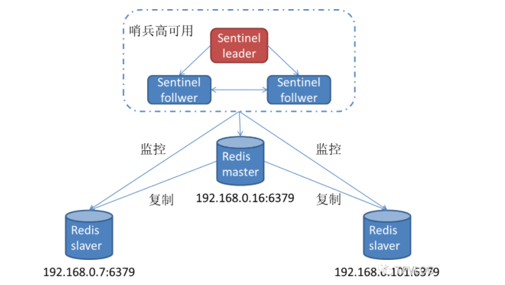

## Redis 面试


### Redis 与 Memcache 的区别

**redis 支持复杂的数据结构**

redis 相比 memcached 来说，拥有更多的数据结构，能支持更丰富的数据操作。如果需要缓存能够支持更复杂的结构和操作， redis 会是不错的选择。


**redis 原生支持集群模式**

在 redis3.x 版本中，便能支持 cluster 模式，而 memcached 没有原生的集群模式，需要依靠客户端来实现往集群中分片写入数据。


**性能对比**

由于 redis 只使用单核，而 memcached 可以使用多核，所以平均每一个核上 redis 在存储小数据时比memcached 性能更高。而在 100k 以上的数据中，memcached 性能要高于 redis。虽然 redis 最近也在存储大数据的性能上进行优化，但是比起 memcached，还是稍有逊色


### Redis 单线程的优点

- 纯内存操作
- 核心是基于非阻塞的 IO 多路复用机制
- 单线程反而避免了多线程的频繁上下文切换问题


### Redis 线程模型

redis 内部使用文件事件处理器 file event handler，这个文件事件处理器是单线程的，所以 redis 才叫做单线程的模型。它采用 IO 多路复用机制同时监听多个 socket，将产生事件的 socket 压入内存队列中，事件分派器根据 socket 上的事件类型来选择对应的事件处理器进行处理。

文件事件处理器的结构包含 4 个部分：

- 多个 socket
- IO 多路复用程序
- 文件事件分派器
- 事件处理器（连接应答处理器、命令请求处理器、命令回复处理器）

多个 socket 可能会并发产生不同的操作，每个操作对应不同的文件事件，但是 IO 多路复用程序会监听多个 socket，会将产生事件的 socket 放入队列中排队，事件分派器每次从队列中取出一个 socket，根据 socket 的事件类型交给对应的事件处理器进行处理。

来看客户端与 redis 的一次通信过程：

[](https://img-blog.csdnimg.cn/20210505221627697.png)

要明白，通信是通过 socket 来完成的，不懂的同学可以先去看一看 socket 网络编程。

> - 客户端 socket01 向 redis 的 server socket 请求建立连接，此时 server socket 会产生一个 `AE_READABLE` 事件，IO 多路复用程序监听到 server socket 产生的事件后，将该事件压入队列中。文件事件分派器从队列中获取该事件，交给`连接应答处理器`。连接应答处理器会创建一个能与客户端通信的 socket01，并将该 socket01 的 `AE_READABLE` 事件与命令请求处理器关联。
> - 假设此时客户端发送了一个 `set key value` 请求，此时 redis 中的 socket01 会产生 `AE_READABLE` 事件，IO 多路复用程序将事件压入队列，此时事件分派器从队列中获取到该事件，由于前面 socket01 的 `AE_READABLE` 事件已经与命令请求处理器关联，因此事件分派器将事件交给命令请求处理器来处理。命令请求处理器读取 socket01 的 `key value` 并在自己内存中完成 `key value` 的设置。操作完成后，它会将 socket01 的 `AE_WRITABLE` 事件与令回复处理器关联。
> - 如果此时客户端准备好接收返回结果了，那么 redis 中的 socket01 会产生一个 `AE_WRITABLE` 事件，同样压入队列中，事件分派器找到相关联的命令回复处理器，由命令回复处理器对 socket01 输入本次操作的一个结果，比如 `ok`，之后解除 socket01 的 `AE_WRITABLE` 事件与命令回复处理器的关联。

这样便完成了一次通信。


### Redis 五大类型

Redis 主要有以下几种数据类型：

- string
- hash
- list
- set
- sorted set

#### string

这是最简单的类型，就是普通的 set 和 get，做简单的 KV 缓存。

```
set college szu
```


#### hash

这个是类似 map 的一种结构，这个一般就是可以将结构化的数据，比如一个对象（前提是**这个对象没嵌套其他的对象**）给缓存在 redis 里，然后每次读写缓存的时候，可以就操作 hash 里的**某个字段**。

```
hset person name bingo
hset person age 20
hset person id 1
hget person name
person = {
    "name": "bingo",
    "age": 20,
    "id": 1
}
```


#### list

list 是有序列表，这个可以玩儿出很多花样。

比如可以通过 list 存储一些列表型的数据结构，类似粉丝列表、文章的评论列表之类的东西。

比如可以通过 lrange 命令，读取某个闭区间内的元素，可以基于 list 实现分页查询，这个是很棒的一个功能，基于 redis 实现简单的高性能分页，可以做类似微博那种下拉不断分页的东西，性能高，就一页一页走。

```
# 0开始位置，-1结束位置，结束位置为-1时，表示列表的最后一个位置，即查看所有。
lrange mylist 0 -1
```

比如可以搞个简单的消息队列，从 list 头怼进去，从 list 尾巴那里弄出来。

```
lpush mylist 1
lpush mylist 2
lpush mylist 3 4 5

# 1
rpop mylist
```


#### set

set 是无序集合，自动去重。

直接基于 set 将系统里需要去重的数据扔进去，自动就给去重了，如果你需要对一些数据进行快速的全局去重，你当然也可以基于 jvm 内存里的 HashSet 进行去重，但是如果你的某个系统部署在多台机器上呢？得基于 redis 进行全局的 set 去重。

可以基于 set 玩儿交集、并集、差集的操作，比如交集吧，可以把两个人的粉丝列表整一个交集，看看俩人的共同好友是谁？对吧。

把两个大 V 的粉丝都放在两个 set 中，对两个 set 做交集。

```
#-------操作一个set-------
# 添加元素
sadd mySet 1

# 查看全部元素
smembers mySet

# 判断是否包含某个值
sismember mySet 3

# 删除某个/些元素
srem mySet 1
srem mySet 2 4

# 查看元素个数
scard mySet

# 随机删除一个元素
spop mySet

#-------操作多个set-------
# 将一个set的元素移动到另外一个set
smove yourSet mySet 2

# 求两set的交集
sinter yourSet mySet

# 求两set的并集
sunion yourSet mySet

# 求在yourSet中而不在mySet中的元素
sdiff yourSet mySet
```


#### sorted set

sorted set 是排序的 set，去重但可以排序，写进去的时候给一个分数，自动根据分数排序。

```
zadd board 85 zhangsan
zadd board 72 lisi
zadd board 96 wangwu
zadd board 63 zhaoliu

# 获取排名前三的用户（默认是升序，所以需要 rev 改为降序）
zrevrange board 0 3

# 获取某用户的排名
zrank board zhaoliu
```


### 从海量Key中查询出某一固定前缀的值

Scan curosor（0） [MATCH PATTERN] [COUNT count]

- 基于游标的迭代器，需要给予上一次的游标续航之前的迭代过程
- 以0作为游标开始新的迭代，直到命令返回游标0，完成一次遍历
- 不保证每次执行都返回某个给定数量的元素，支持模糊匹配
- 一次返回的数量不可控，只能是大概率符合count参数
- 返回的数据可能会有重复，需要自定义去重


### Redis ZSet 跳表实现


### Redis 的持久化方式

Redis 有两种持久化方式，分别为 RDB 与 AOF

#### RDB

RDB 持久化，是保存某个时间点的全量数据，对数据进行周期性的持久化，有两种方式，一种是手动一种是自动保存

- 自动保存

  我们可以在 redis.conf 文件中写入 save 900 3 这样的指令，表示在 3分钟内 则自动写入磁盘，

- 手动执行BGSVAE、SAVE 指令将数据保存到磁盘，不同的是 BGSAVE是非阻塞的，SAVE是阻塞的

  - SAVE：阻塞redis的服务器进程，直到RDB文件被创建完成
  - BGSAVE: Fork 出一个子进程来创建RDB文件，不阻塞服务器进程


优点：

- RDB会生成多个数据文件，每个数据文件都代表了某一个时刻中Redis的数据，这种多个数据文件的方式，非常**适合做定期的冷备**；
- RDB 对 redis 对外提供的读写服务，影响非常小，可以让 redis 保持高性能，因为 redis 主进程只需要 fork 一个子进程，让子进程执行磁盘 IO 操作来进行 RDB 持久化即可。·
- 相对于AOF持久化机制来说，直接基于RDB数据文件来重启和恢复数据更加快速。


缺点：

- RDB持久化不能做到实时，因为频繁fork子进程的开销是很大的。所以如果想要在Redis故障时，尽可能减少数据丢失，那应该开启AOF。一般来说，RDB数据快照文件，都是每隔5分钟或者更长时间生成一次；
- RDB每次fork子进程生成数据快照文件时，如果数据文件特别大，可能会导致对客户端提供的服务暂停数毫秒，甚至数秒。所以，我们一般会控制Redis实例的内存在10GB以内。


#### AOF

AOF 持久化，是对每条写入的命令以append-only的方式，写入一个AOF日志文件中，在Redis重启的时候，可以通过回放AOF日志中的写入指令来重新构建整个数据集。

> 持久化的核心原理，和多数开源分布式框架差不多，无非就是先写入os cache，然后定时刷盘

AOF 持久化主要分为三个步骤：

- 命令追加（append）
- 文件写入（sync）
- 文件重写（rewrite）

流程图如下：


**命令追加**

Redis 所有写入的命令都会追加到 aof_buf 缓冲区的末尾, 这个缓冲区其实就是操作系统的filesystem cache，可以大幅提升磁盘IO的性能。

**文件写入**

Redis 提供了三种文件写入的策略，一般使用的是everysec ，既每秒调用操作西永的fsync 命令将数据刷新到磁盘

AOF缓冲区的数据，会根据一定的策略写入到磁盘上的AOF日志文件中，具体有以下几种策略，由参数 `appendfsync`控制：

**1. always** 

每次写入AOF缓存后，立即调用操作系统的fsync命令，将数据刷到磁盘。一般不建议配置，因为会大幅降低吞吐量，除非对数据可用性有非常高的要求。

**2. no** 

由操作系统自身去控制何时将os cache中的数据刷到磁盘上，同步周期不可控。一般也不建议配置。

**3. everysec**

每隔1秒钟（默认），调用操作系统的fsync命令将数据刷到磁盘。推荐配置。


**文件重写**

AOF 日志文件会越来越大，需要定期对AOF 文件进行rewrite，以达到压缩的目的

因为AOF 会记录每一条写的命令，所以会导致存在冗余的命令，所以Redis会创建一个新的AOF文件来替换老文件，新旧两个文件所保存的数据状态完全相同，但是新文件不会包含任何浪费空间的冗余命令。

主进程通过 `bgrewriteaof`命令进行重写：

1. 父进程fork一个子进程；
2. 子进程根据当前的内存快照，按照命令合并规则（避免命令冗余），写入到新的AOF文件；
3. 在此期间，主进程会把接收到的新的写入命令追加到AOF缓存区（aofbuf），同时再写入一份到AOF重写缓存区（aofrewrite_buf）；
4. 子进程完成新的AOF文件写入后，会发送信号给父进程；
5. 父进程接受到信号后，把aofrewritebuf的数据写入到新的AOF文件中，这样新AOF文件中的数据状态就和当前数据状态是一致的了；
6. 重命名新的AOF文件，覆盖掉老文件，完成AOF重写。

流程图如下：


优点：

- AOF可以更好的保护数据不丢失，AOF默认每隔1秒，通过一个后台线程执行一次fsync操作，所以最多丢失1秒钟的数据；
- AOF日志文件以append-only模式写入，所以没有任何磁盘寻址的开销，写入性能非常高，而且文件不容易损坏，即使文件尾部破损，也很容易修复；
- AOF日志文件过大的时候，即使出现重写，由于是后台操作，所以也不会影响客户端的读写。
- AOF日志文件的命令以可读的方式进行记录，非常适合做灾难性的误删除操作的紧急恢复。比如某人不小心用flushall命令清空了所有数据，只要这个时候后台rewrite还没有发生，那么就可以立即拷贝AOF文件，将最后一条flushall命令删除，然后再将该AOF文件放回去，就可以通过恢复机制，自动恢复所有数据。


缺点：

- 对于同一份数据来说，AOF日志文件通常比RDB数据快照文件更大；
- AOF开启后，支持的写QPS会比RDB低，因为AOF一般会配置成每秒fsync一次日志文件；
- AOF这种基于命令日志回放的方式，比RDB每次持久化一份完整数据快照的方式，更加脆弱一些，容易有bug。不过AOF就是为了避免rewrite过程导致的bug，因此每次rewrite并不是基于旧的指令日志进行merge的，而是基于当时内存中的数据，进行指令的重新构建，这样健壮性会好很多。


### Redis 主从复制原理

Redis 主从复制，主要是为了保证Redis 的高可用，当启动一个slave node时，它会发送一个 `PSYNC`命令给master node。 `psync`命令用于完成主从数据同步，数据同步可能有两种情况：**全量复制**和**增量复制**。


#### 全量复制

如果这个slave node是第一次连接master node，那么会触发一次全量复制（full resynchronization）。全量复制的整体流程如下：

1. master node收到 `psync`命令后执行 `bgsave`命令，在后台生成RDB文件，同时将从现在开始执行的所有写命令记录到缓冲区；
2. RDB文件生成完毕后，master node将其发送给slave node。slave node接收保存，然后载入这个RDB文件；
3. master node将缓冲区中的命令发送给slave node，slave node将自己的状态更新至Master当前所处的状态，保持数据最终一致。


## 


#### 增量复制

增量复制，主要用于处理在主从复制过程中，因**网络闪断**等原因造成的数据丢失场景。如果全量复制过程中，master-slave网络连接断掉，那么salve重新连接master时，可能会触发增量复制。

此时，master直接从自己的backlog中获取部分丢失的数据，发送给slave node，默认backlog就是1MB。因为补发的数据远远小于全量数据，所以可以有效避免全量复制的开销。

那么问题来了，slave如何知道要从哪个地方开始获取数据呢？从Redis 2.8开始，Redis开始支持主从复制的断点续传，整个过程如下：


- master node的复制偏移量（**replication offset**）和slave node的复制偏移量；
- master node的复制积压缓存区（**replication backlog**）；
- 服务器的运行ID（**run ID**）


**replication offset**

复制偏移量（replication offset），标识着master和slave的数据同步进度。

当slave因为网络闪断等原因与master失去连接后，如果再次连接上master，会通过 `PSYNC`命令将自己的offset发送给master，master根据偏移量决定执行全量复制还是部分复制：

- 如果offset之后的数据（offset+1开始）仍存在于master的复制积压缓存区中，则进行部分复制；
- 否则，进行全量复制。

当master每次向slave传播N个字节的数据时，就将自己的offset值加上N；slave每次收到master传播来的N个字节数据时，就将自己的offset值加上N：


**replication backlog**

复制积压缓存区，是由master维护的一个固定大小的FIFO队列（默认为1MB），主要是用来做全量复制中断后的增量复制。当master进行命令传播（给slave发送数据）时，它不仅会将写命令发送给所有salve，还会将写命令入队到复制积压缓冲区里面。也就是说，复制积压缓存区保存着一部分最近传播的写命令：


> 当主从节点网络中断后，slave再次连上master时，会发送 `psync{offset}{runId}`命令请求部分复制。如果请求的offset不在master的积压缓冲区内，则无法提供给slave数据，因此部分复制会退化为全量复制


**run ID**

每个Redis服务节点，在启动时都会生成自己的run ID。run ID由40个随机的十六进制字符串组成。当进行初次全量复制时，master会将自己的运行ID传送给slave，而slave则将这个ID保存起来。当slave断线重连成功后，会将之前保存的运行ID发送给master：

- 如果Master发现Slave上送的运行ID与自身的运行ID不同，则进行全量复制；
- 如果Master发现Slave上送的运行ID与自身的运行ID相同，则进行部分复制。

> 如果master因故障重启，那么它的run ID会改变，slave发现与master的运行ID不匹配时，会认为自己复制的是一个新的master节点，从而进行全量复制。这种情况应从架构上规避，比如提供**故障转移功能**：当主节点发生故障后，**自动提升从节点为主节点**。


#### 数据一致性问题


**复制延迟**

由于主从之间的数据复制是异步的，所以当Client往Master节点写入数据后，Master会立即响应Client结果，然后异步往从节点同步数据。那么主从节点在某一时刻，数据可能是不一致的，如果网络延迟比较大，那主从节点间的数据相差可能会比较多。


比如上图中，主节点的offset是10119，从节点是10000，那此时主从节点之间的数据是不一致的，如果此时Master突然宕机，然后进行了故障自动转移，Slave晋升为新的Master节点，那旧Master中的部分数据就丢失了。最重要的是，这种延迟是不可控的，如果网络经常出现抖动，主从之间的数据差异会越来越大，那当Master节点宕机时，丢失的数据就会很多。


**脑裂**

脑裂，也就是网络分区，即某个master突然脱离了正常的网络，跟其他slave不能连接了，但是实际上master还运行着。此时哨兵可能就会认为master宕机了，将其它slave切换成master，这个时候，集群里就会有两个master，也就是所谓的脑裂。

此时，Client可能还没来得及切换到新的master，继续向旧master写数据。当网络分区恢复后，旧master会被作为一个slave挂到新的master上去，自己的数据会清空，重新从新的master复制数据，这样就发生了数据丢失。

​      

**解决方案**

我们可以通过设置一些Redis参数来解决上述这两个问题：

- `min-slaves-to-write`：要求至少有多少个slave；
- `min-slaves-max-lag`：数据复制和同步的最大延迟（秒）。

上面的参数的含义是： **如果Slave节点的数量少于 min-slaves-to-write 个，或所有Slave节点的复制响应延迟都超过10秒，那么Master就直接拒绝客户端的写请求**。

`min-slaves-to-write`可以用来解决脑裂问题，比如在一个1主2从的架构下，我们将 `min-slaves-to-write`设置为1，那么当出现网络分区时，如果主节点被单独隔离，由于此时它没有了从节点，所以会拒绝客户端的写入，从而保证了数据一致性。

`min-slaves-max-lag`可以用来解决复制延迟问题，比如 `min-slaves-max-lag`设置为10。那么当Master接受到客户端的写请求后，如果有一个slave的ack延时超过10秒，那Master就会认为与Slave的数据差异过大，就拒绝写请求。这样就可以将复制延迟导致的可能导致的数据丢失控制在可控范围内，比如按照上面的配置，最多就丢失10秒的数据。


### Redis 哨兵原理

Redis 的哨兵模式主要是为了保证当master 宕机或者出问题之后 将Slave 节点提升为Master

#### 基本架构



> Redis Sentinel包含了若干个Sentinel节点，这样做也带来了两个好处：①对于节点的故障判断是由多个Sentinel节点共同完成，这样可以有效地防止误判；②即使个别Sentinel节点不可用，整个Sentinel集群依然是可用的。

哨兵模式提供了以下核心功能：

- **监控：**每个Sentinel节点会对数据节点（Redis master/slave 节点）和其余Sentinel节点进行监控；
- **通知：**Sentinel节点会将故障转移的结果通知给应用方；
- **故障转移：**实现slave晋升为master，并维护后续正确的主从关系；
- **配置中心：**在Redis Sentinel模式中，客户端在初始化的时候连接的是Sentinel节点集合，从中获取主节点信息。


#### 基本原理

Sentinel 节点主要是监控Master 与 Slave 以及其他Sentinel 节点的状态，是通过Pub/Sub 进行实现的，Sentinel通过 三个定时任务完成对各个节点的监控，当Master或者 主观或者客观下线时，进行节点剔除或者有效的故障转移，将Slave 提升为新的Master 节点保证高可用

**主观下线**

每个Sentinel节点，每隔1秒会对数据节点发送 `ping`命令做心跳检测，当这些节点超过 `down-after-milliseconds`没有进行有效回复时，Sentinel节点会对该节点做失败判定，这个行为叫做主观下线。

**客观下线**

客观下线，是指当大多数Sentinel节点，都认为master节点宕机了，那么这个判定就是客观的，叫做客观下线。

> Sentinel认为主观下线之后通过发送 `sentinelis-master-down-by-addr*`来确认主节点是否客观下线。
>
> | 参数          | 意义                                                         |
> | :------------ | :----------------------------------------------------------- |
> | ip/port       | 当前认为下线的主节点的ip和端口                               |
> | current_epoch | 配置纪元                                                     |
> | run_id        | *标识仅用于查询是否下线 有值标识该哨兵节点希望对方将自己设置为leader **询问时用\*，选举时用run_id** |


**哨兵选举**

Redis使用了[Raft算法](http://mp.weixin.qq.com/s?__biz=MzIwMjU4MzU4MA==&mid=2247484698&idx=1&sn=ca53dcbb50957daab29beebbba2f0140&chksm=96dd3e69a1aab77f1c27aa488d04ae52c0ce1dfecf2b909374934291596bf65eb8d3585ed3f8&scene=21#wechat_redirect)来实现哨兵领导者选举，大致思路如下：

1. 每个Sentinel节点都有资格成为领导者，当它认为主节点客观下线后，会向其他Sentinel节点发送 `sentinelis-master-down-by-addr`命令，携带 `run_id`要求自己成为领导者；
2. 收到命令的Sentinel节点，如果没有同意过其他Sentinel节点的 `sentinelis-master-down-by-addr`命令，将同意该请求，否则拒绝（每个Sentinel节点只有1票）；
3. 如果该Sentinel节点发现自己的票数已经大于等于 `MAX(quorum,num(sentinels)/2+1)`，那么它将成为领导者；
4. 如果此过程没有选举出领导者，将进入下一次选举。


**故障转移**

选举出的Leader Sentinel节点将负责故障转移，也就是进行master/slave节点的主从切换。故障转移，首先要从slave节点中筛选出一个作为新的master，主要考虑以下slave信息：

1. 跟master断开连接的时长：如果一个slave跟master的断开连接时长已经超过了 `down-after-milliseconds`的10倍，外加master宕机的时长，那么该slave就被认为不适合选举为master；
2. slave的优先级配置： `slave priority`参数值越小，优先级就越高；
3. 复制offset：当优先级相同时，哪个slave复制了越多的数据（offset越靠后），优先级越高；
4. run id：如果offset和优先级都相同，则哪个slave的run id越小，优先级越高。

接着，筛选完slave后， 会对它执行 `slaveofnoone`命令，让其成为主节点。最后，Sentinel领导者节点会向剩余的slave节点发送命令，让它们成为新的master节点的从节点，复制规则与 `parallel-syncs`参数有关。


#### 总结

Redis sentinel 是一个分布式系统中监控 redis 主从服务器，并在主服务器下线时自动进行故障转移。

Redis sentinel 其中三个特性：

- 监控（Monitoring）：

Sentinel 会不断地检查你的主服务器和从服务器是否运作正常。

- 提醒（Notification）：

当被监控的某个 Redis 服务器出现问题时， Sentinel 可以通过 API 向管理员或者其他应用程序发送通知。

- 自动故障迁移（Automatic failover）：

当一个主服务器不能正常工作时， Sentinel 会开始一次自动故障迁移操作。

特点：

- 1、保证高可用
- 2、监控各个节点
- 3、自动故障迁移

缺点：

主从模式，切换需要时间丢数据

没有解决 master 写的压力


### Redis 内存策略

Redis 的内存模型分为 对象内存、缓冲内存、以及子进程内存消耗

####  对象内存

对象内存，是Redis内存占用最大的一块，存储着用户所有的数据。Redis所有的数据都采用key-value格式，每次创建键值对时，至少创建两个类型对象：key对象和value对象。key对象都是字符串，value对象包含五种数据结构类型。所以，对象内存消耗可以简单理解为 `sizeof（keys）+sizeof（values）`。


####  缓冲内存

缓冲内存主要包括：客户端缓冲、复制积压缓冲区、AOF缓冲区：

- **客户端缓冲：**指的是所有接入到Redis服务器TCP连接的输入输出缓冲；
- **复制积压缓冲区：**Redis在2.8版本之后提供了一个可重用的固定大小缓冲区，用于实现部分复制功能，根据 `repl-backlog-size`参数控制，默认1MB。对于复制积压缓冲区，只有Master节点存在，所有Slave节点共享此缓冲区。
- **AOF缓冲区：**用于在Redis重写期间保存最近的写入命令，其消耗的内存取决于AOF重写时间和写入量，这部分空间占用通常很小。


#### 子进程内存消耗

子进程内存消耗，主要是在执行**AOF/RDB重写**时，Redis创建的子进程内存消耗。Redis执行 `fork`操作产生的子进程，内存占用量与父进程相同，理论上需要一倍的物理内存来完成重写操作。

Redis提供了一个命令：**info** **memory**，可以获取自身使用内存的统计数据：

| 属性名                  | 属性说明                                                     |
| :---------------------- | :----------------------------------------------------------- |
| used_memory             | Redis分配器分配的内存总量，也就是内部存储的所有数据内存占用量 |
| used_memory_rss         | 从操作系统的角度显示Redis进程占用的物理内存总量              |
| mem_fragmentation_ratio | 内存碎片率，used_memory_rss/used_memory的比值                |

我们需要重点关注的指标有：used_memory_rss和used_memory，以及它们的比值mem_fragmentation_ratio ：

- mem_fragmentation_ratio>1时，说明多出的部分内存并没有用于数据存储，而是被内存碎片所消耗；
- mem_fragmentation_ratio<1时 ，说明可能是操作系统把Redis内存swap到磁盘导致。


> 以上内容了解 即可


#### Redis 内存管理

Redis主要通过控制内存上限和**回收策略**实现内存管理。控制内存上限就是使用 `maxmemory`参数限制最大可用内存，当超出内存上限时，将使用一些算法来释放内存空间。所以控制内存上限的方法一般也叫**缓存淘汰策略**。

Redis 的内存回收策略分为两种： 定期删除、惰性删除


**定期删除**

所谓定期删除，指的是Redis默认每隔100ms就**随机抽取**一些设置了过期时间的key，检查其是否过期，如果过期就删除。

> 假设 redis 里放了 10w 个 key，都设置了过期时间，你每隔几百毫秒，就检查 10w 个 key，那 redis 基本上就死了，cpu 负载会很高的，消耗在你的检查过期 key 上了。注意，这里可不是每隔 100ms 就遍历所有的设置过期时间的 key，那样就是一场性能上的灾难。实际上 redis 是每隔 100ms 随机抽取一些key 来检查和删除的。

**定期删除的缺点是，会导致很多过期的Key 过期之后并没有删除掉**


**惰性删除**

由于定期删除的缺点，所以一般搭配惰性删除一起使用，所谓惰性删除就是指当客户端获取某个key的时候，Redis会检查这个key是否设置了过期时间，如果设置了是否已过期？如果过期了就会删除，不会给客户端返回任何东西。


**淘汰策略**

**定期删除**和**惰性删除**只能解决内存空间足够情况下的内存回收，如果大量过期key堆积在内存里，导致Redis内存耗尽，或者说内存使用达到了maxmemory上限，此时则会对内存进行淘汰

Redis一共有六种可选的缓存淘汰策略：

- noeviction：默认策略，不会删除任何数据，拒绝所有写入操作并返回客户端错误信息；（一般没人用）
- volatile-lru：根据LRU算法，删除设置了超时属性（expire）的键，直到腾出足够空间为止。如果没有可删除的键对象，回退到noeviction策略；（一般很少使用）
- allkeys-lru：根据LRU算法删除key，不管数据有没有设置超时属性，直到腾出足够空间为止；（最常用）
- allkeys-random：随机删除所有键，直到腾出足够空间为止；（一般没人用）
- volatile-random：随机删除过期键，直到腾出足够空间为止；
- volatile-ttl：在设置了过期时间的键空间中，有更早过期时间的key优先移除。如果没有，回退到noeviction策略。

前缀为volatile-和allkeys-的区别在于二者选择要清除的键时的字典不同，volatile-前缀的策略代表从 redisDb中的expire字典中选择键进行清除；allkeys-开头的策略代表从dict字典中选择键进行清除。


**LRU 算法**

LRU算法是一种常用的缓存淘汰算法。LRU的淘汰规则是基于访问时间。每个缓存都有个最近使用时间戳，每次缓存命中的时候都会更新这个时间戳为当前时间点，每次淘汰缓存的时候，就**淘汰时间戳距当前时间点最早的数据**。类比于guava的LoadingCache 或者 java的LinkedHashMap


### Redis 集群原理

RedisCluster 的核心原理主要包括以下几个点：

- Redis Cluster 实现数据分区
- 分布式缓存节点之间的通讯
- 请求分布式缓存的路由
- 缓存节点的扩展和收缩
- 故障发现和恢复


#### RedisCluster实现数据分区

分布式数据库要解决的就是将整块数据，按照规则分配到多个缓存节点，解决的是单个缓存节点处理数量大的问题，比如常用的Hash算法以及一致性Hash算法

Redis Cluster 则采用的是虚拟槽分区算法。其中提到了槽（Slot）的概念。这个槽是用来存放缓存信息的单位，在 Redis 中将存储空间分成了 16384 个槽，也就是说 Redis Cluster 槽的范围是 0 -16383（2^4 * 2^10）

缓存信息通常是用 Key-Value 的方式来存放的，在存储信息的时候，集群会对 Key 进行 CRC16 校验并对 16384 取模（slot = CRC16(key)%16383）。

得到的结果就是 Key-Value 所放入的槽，从而实现自动分割数据到不同的节点上。然后再将这些槽分配到不同的缓存节点中保存。


​																							图1：Redis 集群中的数据分片


如图 1 所示，假设有三个缓存节点分别是 1、2、3。Redis Cluster 将存放缓存数据的槽（Slot）分别放入这三个节点中：
缓存节点 1 存放的是（0-5000）Slot 的数据。
缓存节点 2 存放的是（5001-10000）Slot 的数据。
缓存节点 3 存放的是（10000-16383）Slot 的数据。

1、此时 Redis Client 需要根据一个 Key 获取对应的 Value 的数据，首先通过 CRC16(key)%16383 计算出 Slot 的值，假设计算的结果是 5002。

2、将这个数据传送给 Redis Cluster，集群接受到以后会到一个对照表中查找这个 Slot=5002 属于那个缓存节点。

3、发现属于“缓存节点 2”，于是顺着红线的方向调用缓存节点 2 中存放的 Key-Value 的内容并且返回给 Redis Client。

 此时 Redis Client 需要根据一个 Key 获取对应的 Value 的数据，首先通过 CRC16(key)%16383 计算出 Slot 的值，假设计算的结果是 5002。将这个数据传送给 Redis Cluster，集群接受到以后会到一个对照表中查找这个 Slot=5002 属于那个缓存节点。发现属于“缓存节点 2”，于是顺着红线的方向调用缓存节点 2 中存放的 Key-Value 的内容并且返回给 Redis Client。


#### 分布式缓存节点之间的通讯

Redis Cluster 的虚拟槽算法解决的是数据拆分和存放的问题，那么存放缓存数据的节点之间则是通过下图中的方式进行通讯


​																				图 2：新上线的缓存节点 2 和缓存节点 1 进行通讯

缓存节点的数目也有可能根据缓存数据量和支持的并发进行扩展。如图 2 所示，

1、假设 Redis Cluster 中存在“缓存节点 1”，此时由于业务扩展新增了“缓存节点 2”。新加入的节点会通过 Gossip 协议向老节点，发出一个“Meet 消息”。

2、收到消息以后“缓存节点 1”，会礼貌地回复一个“Pong 消息”。

3、此后“缓存节点 2”会定期发送给“缓存节点 1” 一个“Ping 消息”，同样的“缓存节点 1”每次都会回复“Pong 消息”。

上面这个例子说明了，在 Redis Cluster 中缓存节点之间是通过 Gossip 协议进行通讯的。


**整个传输过程大致分为以下几点：**

Redis Cluster 的每个缓存节点都会开通一个独立的 TCP 通道，用于和其他节点通讯。
有一个节点定时任务，每隔一段时间会从系统中选出“发送节点”。这个“发送节点”按照一定频率，例如：每秒 5 次，随机向最久没有通讯的节点发起 Ping 消息。
接受到 Ping 消息的节点会使用 Pong 消息向“发送节点”进行回复。不断重复上面行为，让所有节点保持通讯。他们之间通讯是通过 Gossip 协议实现的。

从类型上来说其分为了四种，分别是：

- Meet 消息，用于通知新节点加入。就好像上面例子中提到的新节点上线会给老节点发送 Meet 消息，表示有“新成员”加入。
- Ping 消息，这个消息使用得最为频繁，该消息中封装了自身节点和其他节点的状态数据，有规律地发给其他节点。
- Pong 消息，在接受到 Meet 和 Ping 消息以后，也将自己的数据状态发给对方。同时也可以对集群中所有的节点发起广播，告知大家的自身状态。
- Fail 消息，如果一个节点下线或者挂掉了，会向集群中广播这个消息。


​																		图 3：Gossip 协议结构


Gossip 协议的结构如图 3 所示，有其中 type 定义了消息的类型，例如：Meet、Ping、Pong、Fail 等消息。另外有一个 myslots 的数组定义了节点负责的槽信息。每个节点发送 Gossip 协议给其他节点最重要的就是将该信息告诉其他节点。另外，消息体通过 clusterMsgData 对象传递消息征文。


#### 请求分布式缓存的路由

**节点的槽指派信息：**对内，分布式缓存的节点通过 Gossip 协议互相发送消息，为了保证节点之间了解对方的情况，那么对外来说，一个 Redis 客户端如何通过分布式节点获取缓存数据，就是分布式缓存路由要解决的问题了

上文提到了 Gossip 协议会将每个节点管理的槽信息发送给其他节点，其中用到了 `unsigned char myslots[CLUSTER_SLOTS/8]` 这样一个数组存放每个节点的槽信息。myslots 属性是一个二进制位数组（bit array），其中 CLUSTER_SLOTS 为 16384。

这个数组的长度为 16384/8=2048 个字节，由于每个字节包含 8 个 bit 位（二进制位），所以共包含 16384 个 bit，也就是 16384 个二进制位。

每个节点用 bit 来标识自己是否拥有某个槽的数据。如图 4 所示，假设这个图表示节点 A 所管理槽的情况。


0、1、2 三个数组下标就表示 0、1、2 三个槽，如果对应的二进制值是 1，表示该节点负责存放 0、1、2 三个槽的数据。同理，后面的数组下标位 0 就表示该节点不负责存放对应槽的数据。

用二进制存放的优点是，判断的效率高，例如对于编号为 1 的槽，节点只要判断序列的第二位，时间复杂度为 O（1）。

```c
typeof struct clusterState {
	clusterNode *myslef;
	clusterNode *slots[CLUSTER_SLOTS];
}
```

如图上述代码所示，当收到发送节点的节点槽信息以后，接受节点会将这些信息保存到本地的 clusterState 的结构中，其中 Slots 的数组就是存放每个槽对应哪些节点信息。

<br/>

**集群所有槽的指派信息：** 如下图所示，ClusterState 中保存的 Slots 数组中每个下标对应一个槽，每个槽信息中对应一个 clusterNode 也就是缓存的节点。这些节点会对应一个实际存在的 Redis 缓存服务，包括 IP 和 Port 的信息。

Redis Cluster 的通讯机制实际上保证了每个节点都有其他节点和槽数据的对应关系。


​																				图 6：ClusterStatus 结构以及槽与节点的对应


#### 集群的请求重定向

##### MOVED重定向

Redis 的客户端无论访问集群中的哪个节点都可以路由到对应的节点上，因为每个节点都有一份 ClusterState，它记录了所有槽和节点的对应关系。

下面来看看 Redis 客户端是如何通过路由来调用缓存节点的：


上图表述的就是Redis MOVED重定向请求，MOVED重定向请求主要被分为一下几个流程：

1、Redis客户端通过CRC16(key)%16383 计算出 Slot 的值，发现需要找“缓存节点 1”读/写数据，但是由于缓存数据迁移或者其他原因导致这个对应的 Slot 的数据被迁移到了“缓存节点 2”上面。

2、虽然Redis客户端无法从缓存节点1获取对应的数据，但是*缓存节点1*中保存了所有集群中缓存节点的信息，因此它知道这个 Slot 的数据在“缓存节点 2”中保存，因此向 Redis 客户端发送了一个 MOVED 的重定向请求。

3、MOVED请求告诉其应该访问的“缓存节点 2”的地址。Redis 客户端拿到这个地址，继续访问“缓存节点 2”并且拿到数据。

通过上边的例子，数据 Slot 从“缓存节点 1”已经迁移到“缓存节点 2”了，那么客户端可以直接找“缓存节点 2”要数据


##### ASK重定向

通过MOVED中的例子我们会发现一个问题，MOVED重定向只能针对已经迁移完成的节点，如果是正在迁移中的节点则是通过ASK进行重定向，如下图：


如上图所示：

1、Redis 客户端向“缓存节点 1”发出请求，此时“缓存节点 1”正向“缓存节点 2”迁移数据，如果没有命中对应的 Slot，它会返回客户端一个 ASK 重定向请求并且告诉“缓存节点 2”的地址。

2、客户端向“缓存节点 2”发送 Asking 命令，询问需要的数据是否在“缓存节点 2”上，“缓存节点 2”接到消息以后返回数据是否存在的结果


#### 缓存节点的扩展与收缩

作为分布式部署的缓存节点总会遇到缓存扩容和缓存故障的问题。这就会导致缓存节点的上线和下线的问题。

由于每个节点中保存着槽数据，因此当缓存节点数出现变动时，这些槽数据会根据对应的虚拟槽算法被迁移到其他的缓存节点上

##### **扩容**

> - （1）启动新节点
> - （2）使用cluster meet命令将新节点加入到集群
> - （3）迁移槽和数据：添加新节点后，需要将一些槽和数据从旧节点迁移到新节点


如上图所示，集群中本来存在“缓存节点 1”和“缓存节点 2”，此时“缓存节点 3”上线了并且加入到集群中。此时根据虚拟槽的算法，“缓存节点 1”和“缓存节点 2”中对应槽的数据会应该新节点的加入被迁移到“缓存节点 3”上面。

新节点加入到集群的时候，作为孤儿节点是没有和其他节点进行通讯的。因此，其会采用 cluster meet 命令加入到集群中。

```shell
//在集群中任意节点执行 cluster meet 命令让新节点加入进来。
//假设新节点是 192.168.1.1 5002，老节点是 192.168.1.1 5003，那么运行以下命令将新节点加入到集群中。
192.168.1.1 5003 > cluster meet 192.168.1.1 5002
```

这个是由老节点发起的，有点老成员欢迎新成员加入的意思。新节点刚刚建立没有建立槽对应的数据，也就是说没有缓存任何数据。如果这个节点是主节点，需要对其进行槽数据的扩容；如果这个节点是从节点，就需要同步主节点上的数据。总之就是要同步数据


如上图所示，由客户端发起节点之间的槽数据迁移，数据从源节点往目标节点迁移：

>- （1）客户端对目标节点发起准备导入槽数据的命令，让目标节点准备好导入槽数据。使用命令：cluster setslot {slot} importing {sourceNodeId}
>- （2）之后对源节点发起送命令，让源节点准备迁出对应的槽数据。使用命令：cluster setslot {slot} migrating {targetNodeId}
>- （3）此时源节点准备迁移数据了，在迁移之前把要迁移的数据获取出来。通过命令 cluster getkeysinslot {slot} {count}。Count 表示迁移的 Slot 的个数。
>- （4）然后在源节点上执行，migrate {targetIP} {targetPort} “” 0 {timeout} keys {keys} 命令，把获取的键通过流水线批量迁移到目标节点。
>- （5）重复 3 和 4 两步不断将数据迁移到目标节点。
>- （6）完成数据迁移到目标节点以后，通过 cluster setslot {slot} node {targetNodeId} 命令通知对应的槽被分配到目标节点，并且广播这个信息给全网的其他主节点，更新自身的槽节点对应表。


##### **收缩**

- 迁移槽。
- 忘记节点。通过命令 cluster forget {downNodeId} 通知其他的节点


为了安全删除节点，Redis集群只能下线没有负责槽的节点。因此如果要下线有负责槽的master节点，则需要先将它负责的槽迁移到其他节点。迁移的过程也与上线操作类似，不同的是下线的时候需要通知全网的其他节点忘记自己，此时通过命令 cluster forget {downNodeId} 通知其他的节点


### Redis实现异步队列

一般使用list结构作为队列，rpush生产消息，lpop消费消息。当lpop没有消息的时候，要适当sleep一会再重试。或者使用blpop 在没有消息的时候，它会阻塞住直到消息到来

如果需要生产一次消费多次的话，则使用pub/sub 模式，消费者下线的情况下，生产的消息会丢失，得使用专业的消息队列如rabbitmq等

如果需要redis 实现延时队列的话，可以使用sortedset，拿时间戳作为score，消息内容作为key调用zadd来生产消息，消费者用zrangebyscore指令获取N秒之前的数据轮询进行处理

 

### 防止Redis 大量Key 同时过期的方法

如果大量的key过期时间设置的过于集中，到过期的那个时间点，redis可能会出现短暂的卡顿现象。一般需要在时间上加一个随机值，使得过期时间分散一些


