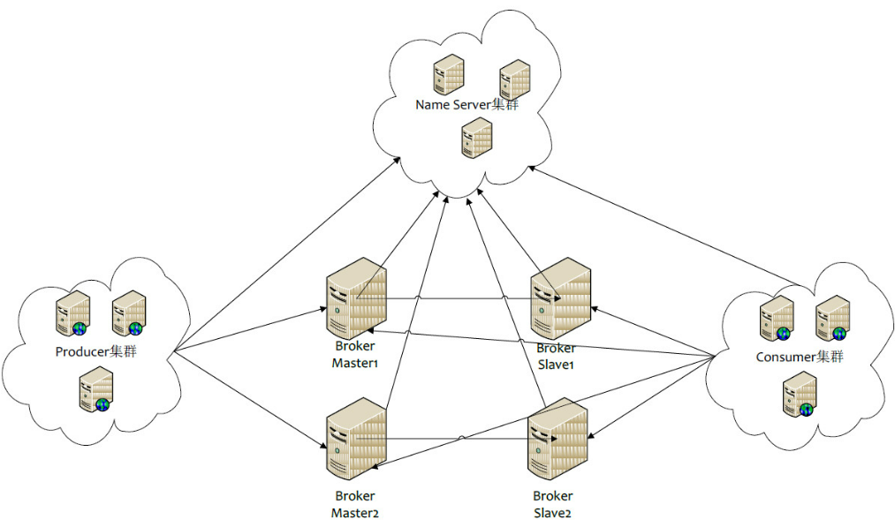
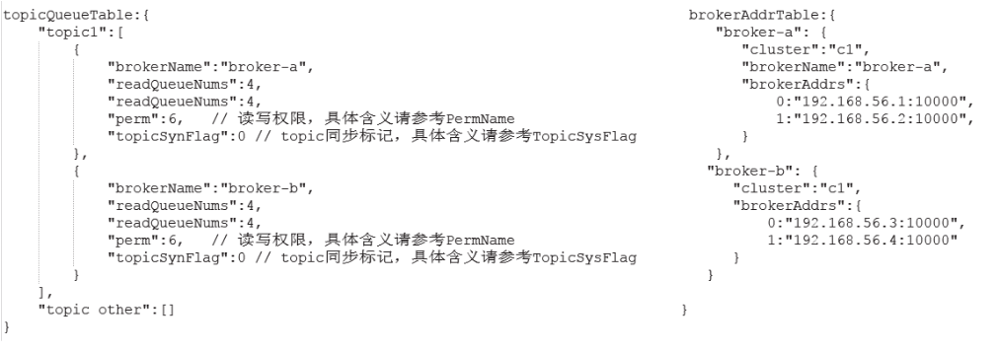

# NameSrv

## 概览

NameSrv 是属于AP类型的注册中心实现，不过不同的点在于NameSrv只是针对RocketMQ的，但是它提供的AP思想实现也是在一些问题场景中提供了很好的解决问题思路，关于注册中心的集中实现请看注册中心一文



Broker消息服务器在启动的时向所有NameServer注册，消息生产者（Producer）在发送消息时之前先从NameServer获取Broker服务器地址列表，然后根据负载均衡算法从列表中选择一台服务器进行发送。NameServer与每台Broker保持长连接，并间隔30S检测Broker是否存活，如果检测到Broker宕机，则从路由注册表中删除。但是路由变化不会马上通知消息生产者。这样设计的目的是为了降低NameServer实现的复杂度，在消息发送端提供容错机制保证消息发送的可用性。

NameServer本身的高可用是通过部署多台NameServer来实现，但彼此之间不通讯，也就是NameServer服务器之间在某一个时刻的数据并不完全相同，但这对消息发送并不会造成任何影响，这也是NameServer设计的一个亮点，总之，RocketMQ设计追求简单高效。


### 启动流程

NameSrv的启动流程如下（了解即可）：


## 路由管理

### RouteInfoManager

NameSrv本质上只是维护了关于Broker的一些元数据信息，大度都是以Topic为维度的，核心实现被定义在RouteInfoManager中, 如下：

```java
//核心Map: 集群映射： brokerName到Master/Slave机器列表
HashMap<String/* brokerName */, BrokerData> brokerAddrTable;

//核心Map之1: topic到QueueData ，topic的分区消息或者消费队列信息
HashMap<String/* topic */, List<QueueData>> topicQueueTable;

//核心Map之3: 集群名称，到集群节点映射  ： 1个cluster多个broker
HashMap<String/* clusterName */, Set<String/* brokerName */>> clusterAddrTable;

//活跃Broker映射表，NameServer每次收到心跳包是会替换该信息
HashMap<String/* brokerAddr */, BrokerLiveInfo> brokerLiveTable;

HashMap<String/* brokerAddr */, List<String>/* Filter Server */> filterServerTable;
```

其中关于QueueData、BrokerData、BrokerliveInfo的展示图如下：

- **topicQueueTable：**Topic消息队列路由信息，消息发送时根据路由表进行负载均衡
- **brokerAddrTable：**Broker基础信息，包括brokerName、所属集群名称、主备Broker地址
- **clusterAddrTable：**Broker集群信息，存储集群中所有Broker名称
- **brokerLiveTable：**Broker状态信息，NameServer每次收到心跳包是会替换该信息
- **filterServerTable：**Broker上的FilterServer列表，用于类模式消息过滤。


> RocketMQ基于定于发布机制，一个Topic拥有多个消息队列，一个Broker为每一个主题创建4个读队列和4个写队列。多个Broker组成一个集群，集群由相同的多台Broker组成Master-Slave架构，brokerId为0代表Master，大于0为Slave。BrokerLiveInfo中的lastUpdateTimestamp存储上次收到Broker心跳包的时间。
>
> **topicTable 以及 brokerAddrTable如下：**
>
> 
>
> 
>
> **brokerLiveTable (心跳管理) 如下：**
>
> 


### 路由注册

RocketMQ路由注册是通过Broker与NameServer的心跳功能实现的。Broker启动时向集群中所有的NameServer发送心跳信息，每隔30s向集群中所有NameServer发送心跳包，NameServer收到心跳包时会更新brokerLiveTable缓存中BrokerLiveInfo的lastUpdataTimeStamp信息，然后NameServer每隔10s扫描brokerLiveTable，如果连续120S没有收到心跳包，NameServer将移除Broker的路由信息同时关闭Socket连接。

#### ***BrokerController#start***

```java
//注册Broker信息
this.registerBrokerAll(true, false, true);
//每隔30s上报Broker信息到NameServer
this.scheduledExecutorService.scheduleAtFixedRate(new Runnable() {

    @Override
    public void run() {
        try {
            BrokerController.this.registerBrokerAll(true, false, brokerConfig.isForceRegister());
        } catch (Throwable e) {
            log.error("registerBrokerAll Exception", e);
        }
    }
}, 1000 * 10, Math.max(10000, Math.min(brokerConfig.getRegisterNameServerPeriod(), 60000)), 
                                                  TimeUnit.MILLISECONDS);
```


#### ***BrokerOuterAPI#registerBrokerAll***

```java
//获得nameServer地址信息
List<String> nameServerAddressList = this.remotingClient.getNameServerAddressList();
//遍历所有nameserver列表
if (nameServerAddressList != null && nameServerAddressList.size() > 0) {
//封装请求头
final RegisterBrokerRequestHeader requestHeader = new RegisterBrokerRequestHeader();
requestHeader.setBrokerAddr(brokerAddr);
requestHeader.setBrokerId(brokerId);
requestHeader.setBrokerName(brokerName);
requestHeader.setClusterName(clusterName);
requestHeader.setHaServerAddr(haServerAddr);
requestHeader.setCompressed(compressed);
//封装请求体
RegisterBrokerBody requestBody = new RegisterBrokerBody();
requestBody.setTopicConfigSerializeWrapper(topicConfigWrapper);
requestBody.setFilterServerList(filterServerList);
final byte[] body = requestBody.encode(compressed);
final int bodyCrc32 = UtilAll.crc32(body);
requestHeader.setBodyCrc32(bodyCrc32);
final CountDownLatch countDownLatch = new CountDownLatch(nameServerAddressList.size());
for (final String namesrvAddr : nameServerAddressList) {
    brokerOuterExecutor.execute(new Runnable() {
        @Override
        public void run() {
            try {
                //分别向NameServer注册
                RegisterBrokerResult result = registerBroker(namesrvAddr,oneway, timeoutMills,requestHeader,body);
                if (result != null) {
                    registerBrokerResultList.add(result);
                }

                log.info("register broker[{}]to name server {} OK", brokerId, namesrvAddr);
            } catch (Exception e) {
                log.warn("registerBroker Exception, {}", namesrvAddr, e);
            } finally {
                countDownLatch.countDown();
            }
        }
    });
}

try {
    countDownLatch.await(timeoutMills, TimeUnit.MILLISECONDS);
} catch (InterruptedException e) {
}
```


### 路由删除

`Broker`每隔30s向`NameServer`发送一个心跳包，心跳包包含`BrokerId`，`Broker`地址，`Broker`名称，`Broker`所属集群名称、`Broker`关联的`FilterServer`列表。但是如果`Broker`宕机，`NameServer`无法收到心跳包，此时`NameServer`如何来剔除这些失效的`Broker`呢？`NameServer`会每隔10s扫描`brokerLiveTable`状态表，如果`BrokerLive`的**lastUpdateTimestamp**的时间戳距当前时间超过120s，则认为`Broker`失效，移除该`Broker`，关闭与`Broker`连接，同时更新`topicQueueTable`、`brokerAddrTable`、`brokerLiveTable`、`filterServerTable`。

**RocketMQ有两个触发点来删除路由信息**：

- NameServer定期扫描brokerLiveTable检测上次心跳包与当前系统的时间差，如果时间超过120s，则需要移除broker。
- Broker在正常关闭的情况下，会执行unregisterBroker指令

这两种方式路由删除的方法都是一样的，就是从相关路由表中删除与该broker相关的信息。


### 路由发现

RocketMQ路由发现是非实时的，当Topic路由出现变化后，NameServer不会主动推送给客户端，而是由客户端定时拉取主题最新的路由。

***DefaultRequestProcessor#getRouteInfoByTopic***

```java
public RemotingCommand getRouteInfoByTopic(ChannelHandlerContext ctx,
    RemotingCommand request) throws RemotingCommandException {
    final RemotingCommand response = RemotingCommand.createResponseCommand(null);
    final GetRouteInfoRequestHeader requestHeader =
        (GetRouteInfoRequestHeader) request.decodeCommandCustomHeader(GetRouteInfoRequestHeader.class);
	//调用RouteInfoManager的方法,从路由表topicQueueTable、brokerAddrTable、filterServerTable中分别填充TopicRouteData的List<QueueData>、List<BrokerData>、filterServer
    TopicRouteData topicRouteData = this.namesrvController.getRouteInfoManager().pickupTopicRouteData(requestHeader.getTopic());
	//如果找到主题对应你的路由信息并且该主题为顺序消息，则从NameServer KVConfig中获取关于顺序消息相关的配置填充路由信息
    if (topicRouteData != null) {
        if (this.namesrvController.getNamesrvConfig().isOrderMessageEnable()) {
            String orderTopicConf =
                this.namesrvController.getKvConfigManager().getKVConfig(NamesrvUtil.NAMESPACE_ORDER_TOPIC_CONFIG,
                    requestHeader.getTopic());
            topicRouteData.setOrderTopicConf(orderTopicConf);
        }

        byte[] content = topicRouteData.encode();
        response.setBody(content);
        response.setCode(ResponseCode.SUCCESS);
        response.setRemark(null);
        return response;
    }

    response.setCode(ResponseCode.TOPIC_NOT_EXIST);
    response.setRemark("No topic route info in name server for the topic: " + requestHeader.getTopic()
        + FAQUrl.suggestTodo(FAQUrl.APPLY_TOPIC_URL));
    return response;
}
```


## 总结

NameSrv 本质就是为Broker提供的注册中心侧，其中包括维护了实例的元数据信息以及定期扫描实例是否存活，如果不存活则剔出等等


NameSrv的整体如下：

1、NameSrv负责存储Broker中topic的一些元数据信息以及broker的一些元数据信息，并且通过定时任务定时扫描broker心跳是否超时

2、Producor 从NameSrv 拉取Topic的元数据信息，包括topic对应的broker、broker的地址等等，并且在client端添加定时任务定时拉取元数据

3、Broker在启动时添加定时任务每10s向broker上报心跳以及元数据信息，并且在topic更新或者修改时都会实时将元数据上报到NameSrv

