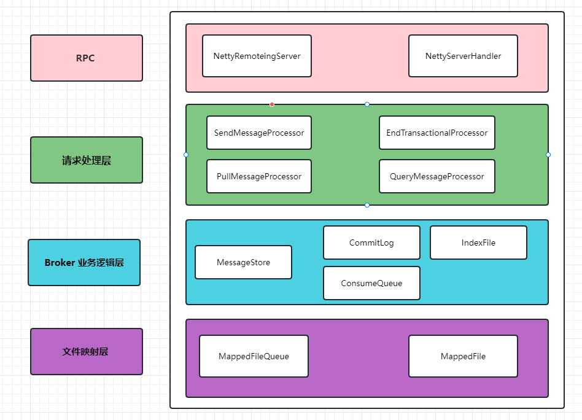
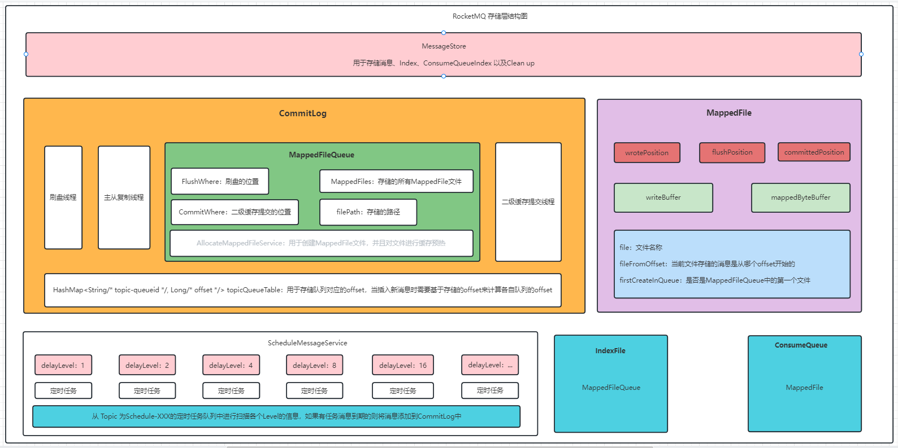
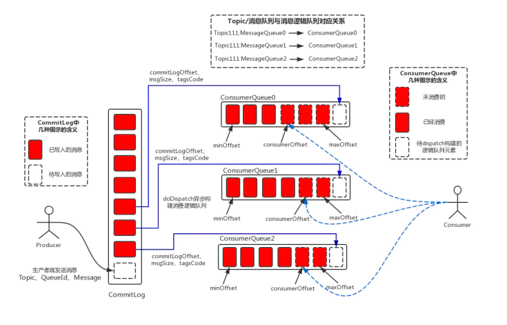
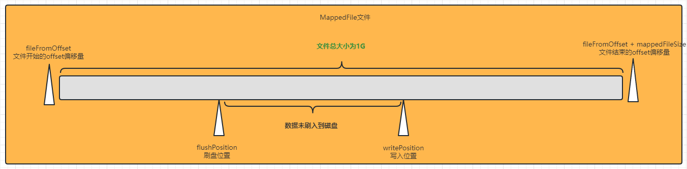
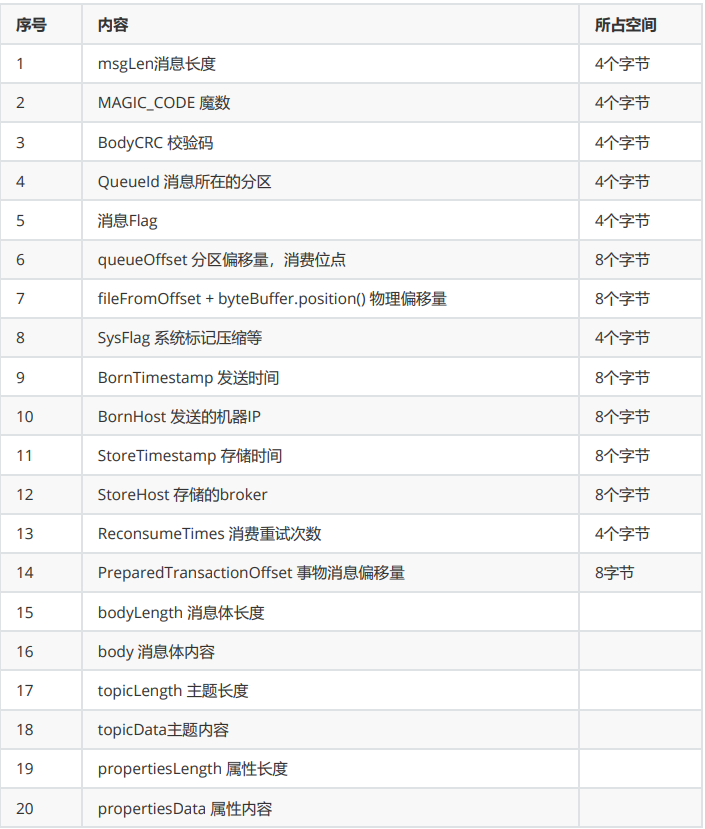
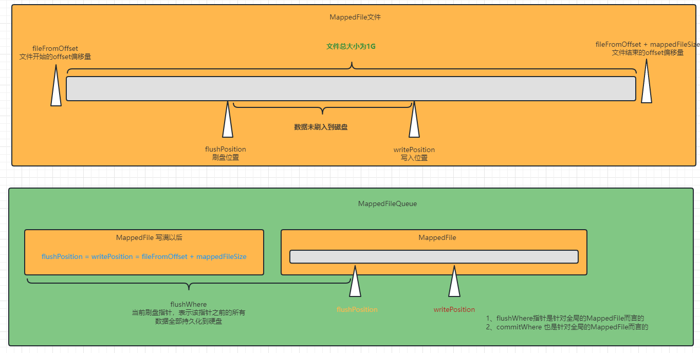
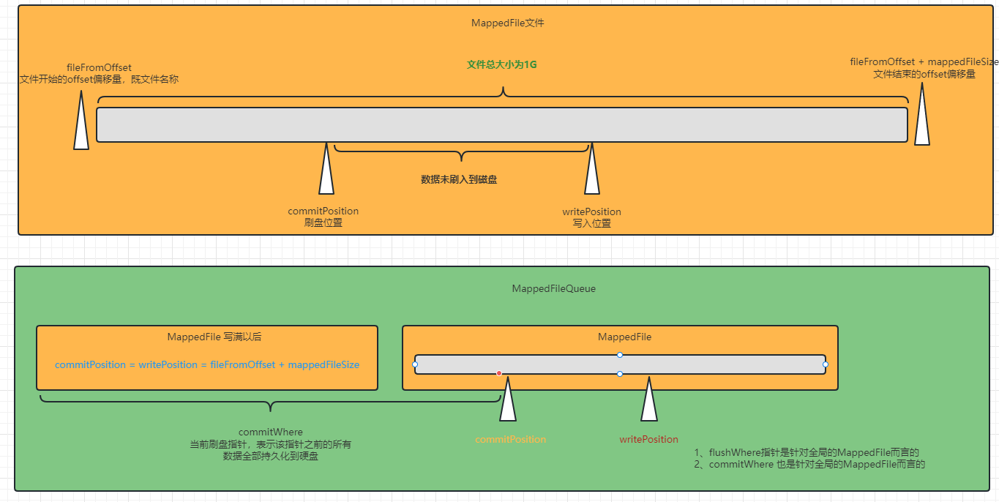
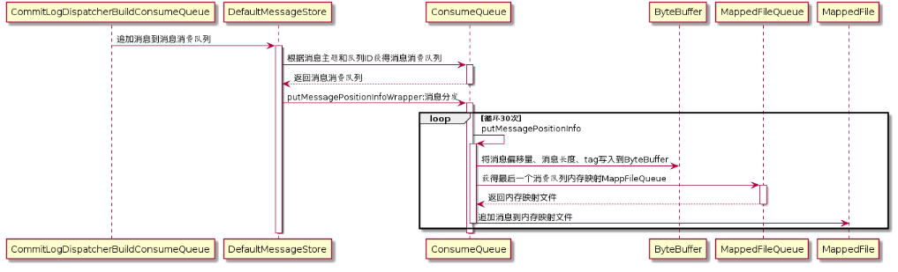
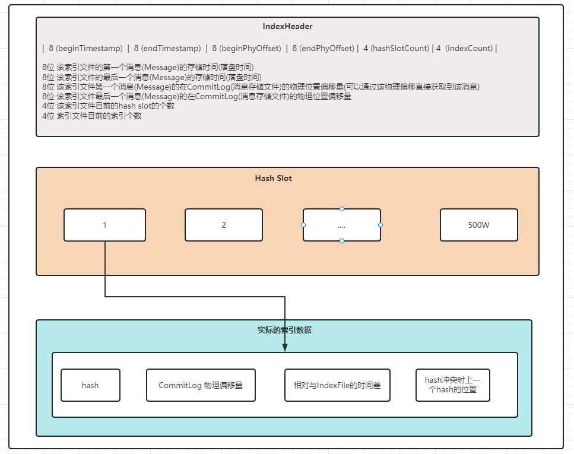
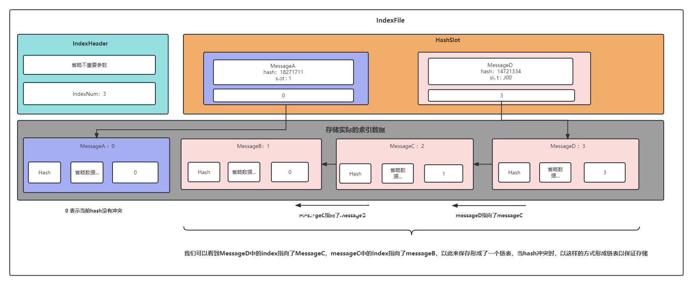

# RocketMQ 文件存储

## 存储架构

RocketMQ的文件存储主要分为三部分，分别是CommitLog、IndexFile、以及ConsumeQueue 三部分，其中每一个broker都会对应一个commit log 文件用于存储当前broker的数据，然后针对于当前broker 在做数据查询时，我们可能会直接通过某一个messageId 来进行查找，那这个时候就需要index file 文件来进行辅助查找

存储架构如下：

- RPC层（NettyRemoteingServer、NettyServerHandler）
- 请求处理层（SendMessageProcessor、PullMessageProcessor、EndTransactionalProcessor、QueryMessageProcessor）
- Broker 业务逻辑层（MessageStore、CommitLog、ConsumeQueue、IndexFile）
- 文件映射层 （MappedFileQueue、MappedFile）
- 文件存储层（DISK)




### 概览

在RocketMQ中所有涉及到文件存储的地方底层都是通过MappedFile实现的，以CommitLog为例，我们知道对于RocketMQ来说一个Broker对应了一个CommitLog文件，但是由于系统mmap的限制，一般在做mmap操作时都会将内存大小设置为1G，所以RocketMQ沿用了这样的方式，将CommitLog切分成了很多文件，每一个文件大小为 1G

RocketMQ的存储层核心点主要包括以下：

- DefaultMessageStore ：针对于broker存储层来说，其中包括 CommitLog、IndexFile、ConsumeQueue、Cleanup Thread等等
- CommitLog：用于存储当前broker的消息数据
- MappedFileQueue ：用于保存当前类型的所有MappedFile文件，比如基于ConsumeQueue 会有自己的MappedFileQueue对象，而基于CommitLog也会有自  己的MappedFileQueue对象
- AllocateMappedFileService ：用于创建MappedFile文件，并且如果开启文件预热功能则通过wramUp方法来进行文件预热
- MappedFile：每一个MappedFile 就对应于一个文件，内部通过mmap 做内存映射来提高性能
- ScheduleMessageService：用于处理定时任务信息，扫描各个delayLevel的 延时消息，如果到期则将消息添加到conmitlog中




### Broker 层存储

RocketMQ的存储大致分为以下几部分，首先我们知道RocketMQ是以Broker为单位来进行数据存储的，那最后的存储的数据都是以Broker为单位落到磁盘上的

**RocketMQ 以Broker为单位进行存储，其中包括CommitLog、ConsumeQueue、IndexFile 三大部分**


#### CommitLog

CommitLog 主要用来存储实际的消息，当我们将消息发送到Broker时要将数据实际落到磁盘，那么实际存放的就是CommitLog中

#### ConsumeQueue

一个Broker中可能存放多个Topic的数据，那么为了高效的在CommitLog中查找数据，我们就需要知道Topic+QueueId + offset 实际在commit log中存储的位置，所以就需要针对每一个ConsumeQueue简历对应的索引（topic + queueId）

#### IndexFile

IndexFile


### 文件层存储

文件层存储主要针对实际的文件写入数据、包括高效读写的方式，主要分为以下：

#### MappedFile

CommitLog 会按照每1G进行分割，当CommitLog 文件写满1G之后会创建新的文件，那么在底层对文件进行操作时，为了实现高效处理，就需要通过对每个文件mmap 来实现


#### MappedFileQueue

不管是IndexFile 还是 CommitLog 由于mmap大小有限制，所以每次对文件进行映射时只能映射1G，所以就需要多个文件来进行存储数据，那么MappedFileQueue就对应的是多个文件也是一个目录，如下：

- CommitLog --> MappedFileQueue
- IndexFile --> MappedFileQueue
- ConsumeQueue(topic + queueId) ==> MappedFileQueue


#### AllocateMappedFileService

AllocateMappedFileService 用于创建新的MappedFile文件，也就是当现在的MappedFile文件写满以后，需要创建新的MappedFile 文件来存储数据，并且为了避免Mmap 带来的大量中断问题，就需要对文件进行wramUp


#### TransientStorePool

TransientStorePool 是主要针对MappedFile文件写操作的性能提升，可以理解为内存池的概念，因为我们每一次创建新的文件都会通过mmap来做内存映射，并且在文件预热时会将内存进行lock，如果文件越来越多，那么被lock的内存也越来越多，这时候就可能会导致内存不够用，或者是如果没有对文件进行预热，会导致内存在使用过程中被swap

**通过TransientStorePool可以来限制内存的使用大小，并且创建之后这些内存会被lock，并不会被swap**


### 刷盘、复制线程

刷盘线程主要用于将写入到MappedFile中的数据写入到磁盘，因为MappedFile 是通过mmap进行内存映射过的，虽然利用了PageCache的机制，但是在写入数据时不会实时的写入到磁盘（会根据系统自己的脏页刷盘策略刷入到磁盘），需要我们手动调用force来刷入到磁盘，否则系统宕机或者其他问题会导致数据不完整

- GroupCommitService：同步刷盘操作

- FlushRealTimeService：异步刷盘操作

- CommitRealTimeService：专用缓存刷盘

  





## DefaultMessageStore

MessageStore 是Broker 存储的入口，其中包括针对定时消息服务、CommitLog、IndexFile以及ComsumeQueue操作等。主要用于存储消息信息，包括消息的存储，ComsumeQueue的索引创建，以及IndexFile索引创建

```java
//消息配置属性
private final MessageStoreConfig messageStoreConfig;

//CommitLog文件存储的实现类
private final CommitLog commitLog;		

//消息队列存储缓存表,按照消息主题分组
private final ConcurrentMap<String/* topic */, ConcurrentMap<Integer/* queueId */, ConsumeQueue>> consumeQueueTable;	

//消息队列文件刷盘线程
private final FlushConsumeQueueService flushConsumeQueueService;

//清除CommitLog文件服务
private final CleanCommitLogService cleanCommitLogService;	

//清除ConsumerQueue队列文件服务
private final CleanConsumeQueueService cleanConsumeQueueService;	

//索引实现类
private final IndexService indexService;	

//MappedFile分配服务
private final AllocateMappedFileService allocateMappedFileService;	

//CommitLog消息分发,根据CommitLog文件构建ConsumerQueue、IndexFile文件
private final ReputMessageService reputMessageService;

//存储HA机制
private final HAService haService;	

//消息服务调度线程
private final ScheduleMessageService scheduleMessageService;	

//消息存储服务
private final StoreStatsService storeStatsService;	

//消息堆外内存缓存
private final TransientStorePool transientStorePool;	

//Broker状态管理器
private final BrokerStatsManager brokerStatsManager;	

//消息拉取长轮询模式消息达到监听器
private final MessageArrivingListener messageArrivingListener;	

//Broker配置类
private final BrokerConfig brokerConfig;	

//文件刷盘监测点
private StoreCheckpoint storeCheckpoint;	

//CommitLog文件转发请求
private final LinkedList<CommitLogDispatcher> dispatcherList;	
```


### 消息存储流程


## 逻辑存储

### CommitLog

```java
    //文件队列， 通过他来获取 MappedFile
    protected final MappedFileQueue mappedFileQueue;

    //刷盘线程，GroupCommitService 同步刷盘等待线程，FlushRealTimeService 异步刷盘线程
    private final FlushCommitLogService flushCommitLogService;

    //If TransientStorePool enabled, we must flush message to FileChannel at fixed periods
    //CommitRealTimeService   专用的写入缓存writebuffer提交线程
    private final FlushCommitLogService commitLogService;

    //写入消息协议数据
    private final AppendMessageCallback appendMessageCallback;
    
    private final ThreadLocal<MessageExtBatchEncoder> batchEncoderThreadLocal;
    
    //用于存储对于topic-queueid的offset，因为对于不通的topic-queueid来说都会有自己的offset
    protected HashMap<String/* topic-queueid */, Long/* offset */> topicQueueTable = new HashMap<String, Long>(1024);
```

<br/>

####  **putMessage**

```

```

```java

//获取消息的类型 
final int tranType = MessageSysFlag.getTransactionValue(msg.getSysFlag());

// 如果是 非事务消息
// 或者 事务提交消息
if (tranType == MessageSysFlag.TRANSACTION_NOT_TYPE
        || tranType == MessageSysFlag.TRANSACTION_COMMIT_TYPE) {

    //进一步判断是不是设置了延迟时间
    // Delay Delivery
    if (msg.getDelayTimeLevel() > 0) {
        // 如果设置了延迟时间
        if (msg.getDelayTimeLevel() > this.defaultMessageStore.getScheduleMessageService().getMaxDelayLevel()) {
            //延迟级别不能超过最大的延迟级别，超过也设置为最大的延迟级别
            msg.setDelayTimeLevel(this.defaultMessageStore.getScheduleMessageService().getMaxDelayLevel());
        }

        //设置延迟消息的topic
        topic = ScheduleMessageService.SCHEDULE_TOPIC;

        //延迟消息的queueId= 延迟级别-1
        queueId = ScheduleMessageService.delayLevel2QueueId(msg.getDelayTimeLevel());

        // Backup real topic, queueId
        //备份真正的topic和queueId
        //把消息的`PROPERTY_REAL_QUEUE_ID`属性修改为`queueId`,消息的`PROPERTY_REAL_TOPIC`属性设置为`topic`
        MessageAccessor.putProperty(msg, MessageConst.PROPERTY_REAL_TOPIC, msg.getTopic());
        MessageAccessor.putProperty(msg, MessageConst.PROPERTY_REAL_QUEUE_ID, String.valueOf(msg.getQueueId()));
        msg.setPropertiesString(MessageDecoder.messageProperties2String(msg.getProperties()));

        //设置延迟topic和queue id
        msg.setTopic(topic);
        msg.setQueueId(queueId);
    }
}

//记录消息存储时间
msg.setStoreTimestamp(beginLockTimestamp);

//判断如果mappedFile如果为空或者已满,创建新的mappedFile文件
if (null == mappedFile || mappedFile.isFull()) {
    mappedFile = this.mappedFileQueue.getLastMappedFile(0); 
}
//如果创建失败,直接返回
if (null == mappedFile) {
    log.error("create mapped file1 error, topic: " + msg.getTopic() + " clientAddr: " + msg.getBornHostString());
    beginTimeInLock = 0;
    return new PutMessageResult(PutMessageStatus.CREATE_MAPEDFILE_FAILED, null);
}

//写入消息到mappedFile中
result = mappedFile.appendMessage(msg, this.appendMessageCallback);

//处理 数据刷盘
handleDiskFlush(result, putMessageResult, msg);

//处理 主从复制
handleHA(result, putMessageResult, msg);
```

消息添加的流程如下：

```sequence
participant MessageStore as store
participant CommitLog as commit_log
participant ScheduleMessage as schedule_message
participant MappedFileQueue as mapped_queue
participant MappedFile as mapped_file

store->commit_log: putMessage
commit_log-->schedule_message: 针对非事务消息以及事务提交类型的延迟消息\n 延迟消息topic：SCHEDULE_TOPIC_XXXX \n queueId: message.delayTimeLevel

schedule_message->schedule_message: 启动定时任务扫描
commit_log->mapped_queue: 获取最后一个MappedFile文件
commit_log->commit_log: 如果mappedFile不存在或者是剩余存储空间不够\n则创建一个新的MappedFile
commit_log->mapped_file: 添加信息 appendMessage

commit_log->commit_log: Statistics 统计
commit_log->commit_log: 处理数据刷盘
commit_log->commit_log: 处理主从复制
```


#### 消息刷盘

消息的刷盘分为同步刷盘和异步刷盘两种方式，但是在

```java
public void handleDiskFlush(AppendMessageResult result, PutMessageResult putMessageResult, MessageExt messageExt) {
    // Synchronization flush
    // 同步刷盘 场景
    if (FlushDiskType.SYNC_FLUSH == this.defaultMessageStore.getMessageStoreConfig().getFlushDiskType()) {

        //进入阻塞等待刷盘,
        //方式此处获取的服务为GroupCommitService类实例
        final GroupCommitService service = (GroupCommitService) this.flushCommitLogService;

        //如果该消息满足messageExt.isWaitStoreMsgOK()，则将这一条成功写入的消息生成GroupCommitRequest对象，
        // 将该对像放入GroupCommitService的requestsWrite列表中（List<GroupCommitRequest>），
        // 等待刷盘线程调用doCommit，对列表中的消息进行刷盘，
        // doCommit中每对一个request处理完成后，会调用wakeupCustomer。
        // 等待时间5s后或者request的countDownLatch记数为0时，
        // 则将这条消息是否已经刷盘成功进行汇报，如果没有刷盘成功，则再日志中记录错误，并将putMessageResult设置为FLUSH_DISK_TIMEOUT。

        if (messageExt.isWaitStoreMsgOK()) {

            // 这个和主从Broker同步复制使用同样的类，
            // 该类主要记录了当前写入后需要等待刷盘的进度，
            // 只有达到该进度才从阻塞中返回
            GroupCommitRequest request = new GroupCommitRequest(result.getWroteOffset() + result.getWroteBytes());
            service.putRequest(request);
            //等待同步刷盘任务完成或发生失败
            //当前线程，为请求的等待线程
            boolean flushOK = request.waitForFlush(this.defaultMessageStore.getMessageStoreConfig().getSyncFlushTimeout());
            if (!flushOK) {
                log.error("do groupcommit, wait for flush failed, topic: " + messageExt.getTopic() + " tags: " + messageExt.getTags()
                        + " client address: " + messageExt.getBornHostString());
                putMessageResult.setPutMessageStatus(PutMessageStatus.FLUSH_DISK_TIMEOUT);
            }
        } else {

            service.wakeup();
        }
    }
    // Asynchronous flush
    //异步刷盘  场景
    else {
        //如果是异步刷盘，则唤醒相关的服务，
        // 这里根据是否启用了暂存池, 去 调用不同的服务进行后台刷盘动作

        if (!this.defaultMessageStore.getMessageStoreConfig().isTransientStorePoolEnable()) {
            //没有  启用 暂存池  场景
            //唤醒FlushRealTimeService服务线程
            flushCommitLogService.wakeup();
        } else {

            //开启了暂时 的存储池    场景
            //唤醒CommitRealTimeService服务线程
            commitLogService.wakeup();
        }
    }
}
```


## 文件存储

### MappedFile

MappedFile就表示实际在磁盘上存储的物理文件，MappedFile 中有几个比较重要的参数如下：

```java
    //commitLog内存（ByteBuffer）写入位点，标记消息写到哪了，下次从该位置开始写。
     //在消息写完后递增，递增大小为消息的长度

    // 1 mappedbytebuffer 文件系统缓存    2 专用写入缓存
    protected final AtomicInteger wrotePosition = new AtomicInteger(0);

    //提交位置
    protected final AtomicInteger committedPosition = new AtomicInteger(0);

    //文件系统缓存里边的内容，刷入磁盘的位置
    private final AtomicInteger flushedPosition = new AtomicInteger(0);
    
    //文件大小
    protected int fileSize;
    protected FileChannel fileChannel;
    /**
     * Message will put to here first, and then reput to FileChannel if writeBuffer is not null.
     */
    protected ByteBuffer writeBuffer = null;
    
    //用于分配写入缓存的的内存池
    protected TransientStorePool transientStorePool = null;
    
    //文件名称
    private String fileName;
    
    //当前文件其实的offset位置，每个文件大小都是1G
	// 举个例子 第一个文件：000000， 第二个文件名称 0 + 1G ，fileFromOffset = 0 + 1G
    private long fileFromOffset;
    private File file;
    
    //当前文件对应的MappedByteBuffer
    private MappedByteBuffer mappedByteBuffer;
    private volatile long storeTimestamp = 0;
    
    //当前文件是否对应于MappedFileQueue中的第一个文件
    private boolean firstCreateInQueue = false;
```

<br/>

MappedFile 文件中有几个比较重要的属性如下：

- fileFromOffset：
- flushPostion：
- writePosition：
- endPosition：
- commitPosition：




<br/>

#### **appendMessagesInner**

**这里需要注意一个点就是返回的AppendResult中 writePostion 为写入之前的position，而writeBytes 既当前消息实际写入的长度，那么nextWritePosition = writePosition + writeBytes**

消息的协议数据如下：



MappedFile 添加消息的流程如下：

```java
//获取当前内存对象的写入位置（wrotePostion变量值）；
// 若写入位置没有超过文件大小则继续顺序写入；
int currentPos = this.wrotePosition.get();

if (currentPos < this.fileSize) {
    //由内存对象mappedByteBuffer创建一个指向同一块内存的ByteBuffer对象，并将内存对象的写入指针指向写入位置；
    ByteBuffer byteBuffer = writeBuffer != null ? writeBuffer.slice() : this.mappedByteBuffer.slice();
    byteBuffer.position(currentPos);
    AppendMessageResult result;
    
    //以文件的起始偏移量（fileFromOffset）、ByteBuffer对象、该内存对象剩余的空间（fileSize-wrotePostion）、消息对象msg为参数调用AppendMessageCallback回调类的doAppend方法；
    if (messageExt instanceof MessageExtBrokerInner) {
        result = cb.doAppend(this.getFileFromOffset(), byteBuffer, this.fileSize - currentPos, (MessageExtBrokerInner) messageExt);
    } else if (messageExt instanceof MessageExtBatch) {
        result = cb.doAppend(this.getFileFromOffset(), byteBuffer, this.fileSize - currentPos, (MessageExtBatch) messageExt);
    } else {
        return new AppendMessageResult(AppendMessageStatus.UNKNOWN_ERROR);
    }

    //将MapedFile.wrotePostion的值加上写入的字节数（AppendMessageResult对象返回的值）；
    this.wrotePosition.addAndGet(result.getWroteBytes());

    //更新存储时间戳MapedFile.storeTimestamp
    this.storeTimestamp = result.getStoreTimestamp();
    return result;
}
```

```sequence
participant MappedFile as mapped_file
participant AppendMessageCallback as callback

mapped_file->mapped_file: 获取当前writePosition的位置
mapped_file->mapped_file: 是否开启写入缓存，如果开启写入缓存则使用writeBuffer\n否则使用mappedByteBuffer

mapped_file->callback: doAppend 添加信息

callback->callback: 计算全局的物理其实偏移量：\nfileFromOffset+内存相对位置\nbyteBuffer.position(wrotePosition)
callback->callback: 写入totalSize
callback->callback: 写入magic code
callback->callback: 写入topic
callback->callback: 写入queueId
callback->callback: 写入....
callback->callback: 写入当前消息对于topic+queue的相对offset\n既1,2,3,4 顺序增长
callback->callback: 返回写入结果:\n1、写入之前的全局物理其实位置\n2、消息的总长度

```


#### warmMappedFile

消息预热，当创建MappedFile完成后，就会判断是否开启内存预热，如果开启则会通过MappedFile.warmMappedFile 来提前将文件数据加载到内存中，因为 MappedByteBuffer自带的load 方法底层是通过 `` 参数实现的，该参数只是建议将文件内容加载到文件中，所以这里通过warmMappedFile 的方式来产生页中断将文件内容加载到物理内存，因为在mmap之后通常是通过虚拟内存进行的映射，只有在正真访问文件内容时才会产生页中断加载然后将数据加载到物理内存，mmap内容具体见 nio 部分

首先我们知道在linux中，所有的数据都是以Page的方式加载到内存的，warmMappedFile 方法就是通过向每一个Page写入一个字节来产生页中断，然后将数据加载到物理内存，在通过lock 方法将该内存进行加锁，防止被swap

```java
public void warmMappedFile(FlushDiskType type, int pages) {
    long beginTime = System.currentTimeMillis();
    ByteBuffer byteBuffer = this.mappedByteBuffer.slice();
    int flush = 0;
    long time = System.currentTimeMillis();

    //每次循环都会将i + MappedFile.OS_PAGE_SIZE，默认是4KB，具体参照操作系统的物理变量
    for (int i = 0, j = 0; i < this.fileSize; i += MappedFile.OS_PAGE_SIZE, j++) {

        //每隔 4K向文件写入一个字节，这样就会使操作系统将该Page页加载到物理内存
        byteBuffer.put(i, (byte) 0);
        // force flush when flush disk type is sync

        //如果刷盘方式为同步刷盘，则将数据同步刷入到磁盘
        if (type == FlushDiskType.SYNC_FLUSH) {
            if ((i / OS_PAGE_SIZE) - (flush / OS_PAGE_SIZE) >= pages) {
                flush = i;
                mappedByteBuffer.force();
            }
        }

        // prevent gc
        if (j % 1000 == 0) {
            log.info("j={}, costTime={}", j, System.currentTimeMillis() - time);
            time = System.currentTimeMillis();
            try {

                // Thread中sleep函数的作用是让该线程进入休眠状态，让出cpu的执行时间给其他进程，该线程休眠后进入就绪队列和其他线程一起竞争cpu的执行时间。
                //
                //　所以sleep(0)的作用就是让该线程立即从运行阶段进入就绪队列而非等待队列，释放cpu时间，
                // 可以让操作系统切换其他线程来执行，提升效率。
                // 总得来说就是，sleep(0)让当前已完成功能的线程让出自己的资源（时间片）给其他线程，
                // “Thread.Sleep(0)作用,就是“触发操作系统立刻重新进行一次CPU竞争”。　让其他线程有竞争cpu资源的机会（该线程也在就绪队列参与竞争）

                // 如果是 GC线程 获得CPU控制权 ， 就开始 进行GC处理， 清理其他引用 .
                // Thread.sleep(0); 的 副作用是： 可能更频繁地运行GC
                //  GC线程 获得CPU控制权 的好处：这可以防止 单次GC 操作 长时间运行,
                // 比如这里没隔1000次迭代，就尝试GC运行，比一直都不让gc运行，然后让gc长时间运行效果更好 .

                // 上面的注释，有歧义，准确来说，应该是 prevent long time  gc
                Thread.sleep(0);
            } catch (InterruptedException e) {
                log.error("Interrupted", e);
            }
        }
    }

 
    //调用mlock方法将该内存锁住，防止被swap到swap分区
    //在mlock 方法中调用了两个系统函数，分别是mlock，以及madvice，具体介绍请看nio章节
    this.mlock();
}
```


#### commit

将二级缓存中的数据刷入到磁盘，并且更新commitPosition位置


#### flush

将数据刷入到磁盘，并且更新flushPosition

该方法主要是将调用MappedByteBuffer#force方法强制将写入的消息刷入到磁盘，并且将MappedFile.flushPosition 设置为readPosition, 既写入消息后的位置

```java
public int flush(final int flushLeastPages) {
    //通过isAbleToFlush检查 刷盘的条件 是否满足
    if (this.isAbleToFlush(flushLeastPages)) {
        if (this.hold()) {

            //通过getReadPosition获取当前消息内容写入后的位置
            //因为在写入完消息之后就已经更新了readPosition，所以现在的readPosition = writeOffset + writeBytes
            int value = getReadPosition();

            try {			
				//省略部分代码...
				
                 // 这里调用mappedByteBuffer的force方法，
                 // 通过JDK的NIO操作，将mappedByteBuffer缓存中的数据写入CommitLog文件中
                 this.mappedByteBuffer.force();
            } catch (Throwable e) {
                log.error("Error occurred when force data to disk.", e);
            }

            // 设置新的刷新 ReadPosition
            this.flushedPosition.set(value);
            this.release();
        } else {
            log.warn("in flush, hold failed, flush offset = " + this.flushedPosition.get());
            this.flushedPosition.set(getReadPosition());
        }
    }
    //返回新的刷新 ReadPosition
    return this.getFlushedPosition();
}
```


<br/>

### MappedFileQueue

MappedFileQueue 主要用来保存创建完成的MappedFile文件，当MappedFile文件不存在或者是需要被创建时，会通过内部的AllocateMappedFileService来进行创建 核心属性如下：

```java
//MappedFileQueue对应的存储目录，既要对哪个目录下的文件做mmap内存映射
    private final String storePath;

    // CommitLog file size,default is 1G
    private final int mappedFileSize;
    
    //用于存储当前目录对应的所有MappedFile文件
    private final CopyOnWriteArrayList<MappedFile> mappedFiles = new CopyOnWriteArrayList<MappedFile>();

    //用于创建MappedFile文件
    private final AllocateMappedFileService allocateMappedFileService;

    //当前刷盘指针，表示该指针之前的所有数据全部持久化到硬盘
    private long flushedWhere = 0;

    //当前数据提交指针，内存中byteBuffer当前的写指针，该值大于等于 flushedWhere
    private long committedWhere = 0;
```

在MappedFileQueue中有两个属性比较重要如下：

- flushedWhere： flushWhere是针对全局文件而言的，我们知道一个CommitLog可能对应了多个MappedFile文件，那么对于MappedFile而言 flushPosition是 MappedFile 自身文件的刷盘位置，而flushWhere则是全局文件的刷盘位置
- committedWhere：commitWhere 与 flushedWhere是一样的都是针对全局而言的


**举个例子：**

> **MappedFile ** ：{fileName = 1024, flushPostion = 3, writePosition = 10}  表示当前文件写入到了position 为 10的位置，但是刷盘才到position为3 的位置
>
> **MappedFileQueue **：{flushWhere = 1024 + 3，committedWhere = 1024 + mappedFile.commitPostion} 




<br/>

#### getLastMappedFile

getLastMappedFile 是从MappedFileQueue中获取最后一个MappedFile文件，如果获取不到或者是最后一个MappedFile文件已经满了，则会创建一个新的MappedFile文件放入到MappedFileQueue中


```sequence
participant CommitLog as commit_log
participant MappedFileQueue as mapped_queue
participant AllocateMappedFileService as allocate_service


commit_log->mapped_queue: 从MappedFileQueue中获取最新的MappedFile文件

mapped_queue->mapped_queue: "从mappedFiles集合中\n获取最后一个MappedFile文件"

mapped_queue->mapped_queue: 如果mappedFileLast 为空\n则通过startOffset计算出新文件的起始偏移量
mapped_queue->mapped_queue: 如果mappedFileLast已经满了，则通过最后一个\nmappedFile文件的fileFromOffset + mappedFileSize\n来计算新文件的其实偏移量

mapped_queue->mapped_queue: =====

mapped_queue-->allocate_service: 如果需要创建新的文件则通过\nallocateMappedFileService进行创建
mapped_queue->mapped_queue: 将新创建的MappedFile文件添加到mappedFiles集合中
mapped_queue->mapped_queue: 如果mappedFiles集合为空，则设置\n mappedFile.setFirstCreateInQueue(true);

```

```java

    public MappedFile getLastMappedFile(final long startOffset, boolean needCreate) {
        long createOffset = -1;

        // 获取要写入的CommitLog文件对应的 MappedFile
        MappedFile mappedFileLast = getLastMappedFile();

        //mappedFileLast 为空或者最后一个对象对应的文件已经写满，
        // 则创建一个新的文件（即新的 MapedFile 对象） ；
        // 计算出新文件的起始偏移量（起始偏移量就是文件名称）
        if (mappedFileLast == null) {
            createOffset = startOffset - (startOffset % this.mappedFileSize);
        }

        //如果可以获取到最后一个mappedfile 并且最后一个mappedfile也满了
        // createOffset = lastFileFromOffset + mappedFileSize
        if (mappedFileLast != null && mappedFileLast.isFull()) {
            createOffset = mappedFileLast.getFileFromOffset() + this.mappedFileSize;
        }

        if (createOffset != -1 && needCreate) {
            //下一个文件
            String nextFilePath = this.storePath + File.separator + UtilAll.offset2FileName(createOffset);

            //下下一个文件
            String nextNextFilePath = this.storePath + File.separator
                    + UtilAll.offset2FileName(createOffset + this.mappedFileSize);

            MappedFile mappedFile = null;

            // 判断 allocateMappedFileService 服务是否初始化，
            // 并创建下一个文件和下下一个文件
            if (this.allocateMappedFileService != null) {
				
                mappedFile = this.allocateMappedFileService.putRequestAndReturnMappedFile(nextFilePath,
                        nextNextFilePath, this.mappedFileSize);
            } else {
                try {

                    // 如果allocateMappedFileService 没有创建，则直接创建文件
                    mappedFile = new MappedFile(nextFilePath, this.mappedFileSize);
                } catch (IOException e) {
                    log.error("create mappedFile exception", e);
                }
            }

            //最后将创建或返回的 MapedFile 对象存入 MapedFileQueue 的 MapedFile 列表中，
            //并且将MappedFile的firstCreateInQUeue设置为true，表示当前MappedFile是在MappedFileQueue的第一个位置
            // 并返回该 MapedFile 对象给调用者
            if (mappedFile != null) {
                //如果mappedFiles集合为空，则将mappedFile的firstCreateInQueue属性设置为true，
                //表示当前MappedFile是MappedFileQueue中的第一个MappedFile文件
                if (this.mappedFiles.isEmpty()) {
                    mappedFile.setFirstCreateInQueue(true);
                }
                this.mappedFiles.add(mappedFile);
            }

            return mappedFile;
        }

        return mappedFileLast;
    }
```


#### flush 操作

```java
/**
 * 对于同步刷盘时，flushLeastPages = 0
 */
public boolean flush(final int flushLeastPages) {
    boolean result = true;
    // 这里首先根据  上一次刷盘完成后的offset : flushedWhere ，
    // 通过findMappedFileByOffset方法，找到需要刷盘的MapppedFile文件，既当前commit log 文件
    //
    MappedFile mappedFile = this.findMappedFileByOffset(this.flushedWhere, this.flushedWhere == 0);
    if (mappedFile != null) {
        long tmpTimeStamp = mappedFile.getStoreTimestamp();

        // 执行刷盘
        int offset = mappedFile.flush(flushLeastPages);

        // 计算新的 位置，既当前文件的全局全局物理偏移量 + MappedFile当前刷盘位置的offset
        // 举个例子：当前文件的名称为 1024，那么1024就是为全局物理偏移量 + MappedFile的刷盘位置假设为500
        // 那么flushWhere = 1024 + 500 既全局的物理刷盘位置
        long where = mappedFile.getFileFromOffset() + offset;
        result = where == this.flushedWhere;

        //更新flushedWhere的值
        this.flushedWhere = where;
        if (0 == flushLeastPages) {
            this.storeTimestamp = tmpTimeStamp;
        }
    }

    //此时缓存中的数据完成了持久化
    return result;
}
```


### AllocateMappedFileService

AllocateMappedFileService 用于创建新的MappedFile文件，并且根据配置判断对于新的MappedFile文件是否需要进行文件预热等

```sequence
participant MappedFileQueue as mapped_queue
participant AllocateMappedFileService as allocate_service
participant AllocateMappedFileService_ServiceThread as allocate_service_queue
participant MappedFile as mmap_file


mapped_queue->allocate_service: putRequestAndReturnMappedFile\n 创建新的MappedFile文件

allocate_service->allocate_service_queue: 创建AllocateReuest请求用于创建NextFile

allocate_service_queue->allocate_service_queue: 判断是否开启二级缓存
allocate_service_queue->allocate_service_queue: 开启二级缓存则通过内存池获取一块内存\n用于后续的写入、刷盘操作
allocate_service_queue->allocate_service_queue: 如果没有开启则通过mmap进行操作
allocate_service_queue->allocate_service_queue: ===
allocate_service_queue-->mmap_file: 通过wramUp来进行文件预热\n1、每4K像文件写入一个0\n2、然后通过mlock锁住这块内存

allocate_service->allocate_service_queue: 创建AllocateReuest请求用于创建NextNextFile
allocate_service_queue->allocate_service_queue: NextNextFile与NextFile流程是一样的

allocate_service->allocate_service: 将创建好的下下个文件缓存起来\n在下次使用时可以快速返回
```

<br/>

#### **创建AllocateReuest**

创建AllocateReuest请求用于创建NextFile

```java
//创建下一个 CommitLog 文件和下下一个CommitLog文件。
//1、构建 AllocateRequest nexReq 对象，并把该对象存放到 requestQueue 队列中
//2、构建 AllocateRequest nextNextReq 对象，并把该对象存放到 requestQueue 队列中
//然后在 AllocateMappedFileService.run() 方法中从 requestQueue 阻塞中获取需要创建的任务，并创建文件。
public MappedFile putRequestAndReturnMappedFile(String nextFilePath, String nextNextFilePath, int fileSize) {
 
    AllocateRequest nextReq = new AllocateRequest(nextFilePath, fileSize);

    // 尝试向 ConcurrentHashMap 中存放 nextReq ，如果存放失败说明有别的线程已经创建文件
   boolean nextPutOK = this.requestTable.putIfAbsent(nextFilePath, nextReq) == null;

    //存放成功，则进行向requestQueue中存放数据
    if (nextPutOK) {
   		
        //向requestQueue中放入请求，由ServiceThread帮我们创建MappedFile
        boolean offerOK = this.requestQueue.offer(nextReq);
        if (!offerOK) {
            log.warn("never expected here, add a request to preallocate queue failed");
        }
        canSubmitRequests--;
    }
    
    
    // 再创建一个 NextNextCommitLog 文件，这样可以在下一次创建时直接返回创建好的MappedFile文件提高性能
    AllocateRequest nextNextReq = new AllocateRequest(nextNextFilePath, fileSize);
    boolean nextNextPutOK = this.requestTable.putIfAbsent(nextNextFilePath, nextNextReq) == null;
    if (nextNextPutOK) {
          boolean offerOK = this.requestQueue.offer(nextNextReq);
            if (!offerOK) {
                log.warn("never expected here, add a request to preallocate queue failed");
            }
    }

  
	// 获取创建的结果
    AllocateRequest result = this.requestTable.get(nextFilePath);
    try {
        if (result != null) {
            boolean waitOK = result.getCountDownLatch().await(waitTimeOut, TimeUnit.MILLISECONDS);
            if (!waitOK) {
                log.warn("create mmap timeout " + result.getFilePath() + " " + result.getFileSize());
                return null;
            } else {
                
                //将缓存的NextFile文件从requestTable中移除，但是这个时候nextNextFile的文件数据还是缓存在requestTable中的
                this.requestTable.remove(nextFilePath);
                return result.getMappedFile();
            }
        } else {
            log.error("find preallocate mmap failed, this never happen");
        }
    } catch (InterruptedException e) {
        log.warn(this.getServiceName() + " service has exception. ", e);
    }

    return null;
}
```

<br/>


#### **接收AllocateRequest请求**

接收AllocateRequest请求，创建MappedFile

```java
    // 从 requestQueue 阻塞队列中获取 AllocateRequest  任务。
    req = this.requestQueue.take();
    
    AllocateRequest expectedRequest = this.requestTable.get(req.getFilePath());
 	
    if (req.getMappedFile() == null) {
        long beginTime = System.currentTimeMillis();

        MappedFile mappedFile;

        // 判断是否开启 isTransientStorePoolEnable ，如果开启则使用直接内存进行写入数据，
        // 最后从直接内存中 commit 到 FileChannel 中。
        if (messageStore.getMessageStoreConfig().isTransientStorePoolEnable()) {
            try {
                //如果开启二级缓存的话那么MappedFile的写入则不在通过mappedBytesBuffer直接写入而是通过fileChannel + 二级缓存写入
                mappedFile = ServiceLoader.load(MappedFile.class).iterator().next();
                mappedFile.init(req.getFilePath(), req.getFileSize(), messageStore.getTransientStorePool());
            } catch (RuntimeException e) {
                log.warn("Use default implementation.");
                mappedFile = new MappedFile(req.getFilePath(), req.getFileSize(), messageStore.getTransientStorePool());
            }
        } else {

            // 使用 mmap 方式创建 MappedFile
            mappedFile = new MappedFile(req.getFilePath(), req.getFileSize());
        }

        // pre write mappedFile
        // 预写入数据。
        // 按照系统的 pagesize 进行每个pagesize 写入一个字节数据。
        // 为了把mmap 方式映射的文件都加载到内存中。
        if (mappedFile.getFileSize() >= this.messageStore.getMessageStoreConfig()
                .getMappedFileSizeCommitLog()
                &&
                this.messageStore.getMessageStoreConfig().isWarmMapedFileEnable()) {
            mappedFile.warmMappedFile(this.messageStore.getMessageStoreConfig().getFlushDiskType(),
                    this.messageStore.getMessageStoreConfig().getFlushLeastPagesWhenWarmMapedFile());
        }

	   //将创建好的文件放入到Request中
        req.setMappedFile(mappedFile);
        this.hasException = false;
        isSuccess = true;
    }
```


<br/>

### TransientStorePool

> TransientStorePool有些像页高速缓存那样，为了避免页面被换出到交换区，mq申请了一块内 存，并且用指定这些页面不能被操作系统换出，然后将这些内存分配给业务使用

TransientStorePool 是临时内存池，既然文件已经有了Mmap了，为什么还要用内存池呢？

用内存池或者是二级缓存有以下几个好处：

1、首先我们在生产环境每天都有大量的消息写入，那么对于Broker来说我们所有的数据都是存放在CommitLog目录的，随着消息的增加，CommitLog目录下的MappedFile文件也就越来越多，当我们开启文件预热优化时，在文件余热完成过后这些内存会被lock到内存中，而不会被置换出去，随着MappedFile文件数量的增加，那么内存使用也越来越多，使用也会越来越紧张，这个时候我们为了缩小内存的时候就需要通过内存池来规避这个问题

2、如果我们的MappedFile文件没有开启内存预热，那么这些内存会被置换到swap分区，当每次需要使用时需要将swap分区的数据置换到内存，将内存的数据置换到swap分区，这样无疑是浪费了很多性能

综合以上两点，RocketMQ增加了二级缓存既内存池优化，我们可以通过设计内存池中的内存大小来规避内存使用过多，以及内存被置换问题，具体使用方式根据场景而定

```java
//内存池用维护的ByteBuffer的数量，每一个ByteBuffer都会有 fileSize 大小
private final int poolSize; 

//每个ByteBuffer大小，默认是1G
private final int fileSize; 

//ByteBuffer容器。双端队列
private final Deque<ByteBuffer> availableBuffers; 
```

<br/>

#### **初始化**

```java
public void init() {
    
    //创建poolSize个堆外内存
    for (int i = 0; i < poolSize; i++) {
        ByteBuffer byteBuffer = ByteBuffer.allocateDirect(fileSize);
        final long address = ((DirectBuffer) byteBuffer).address();
        Pointer pointer = new Pointer(address);
        
        //使用com.sun.jna.Library类库将该批内存锁定,避免被置换到交换区,提高存储性能
        LibC.INSTANCE.mlock(pointer, new NativeLong(fileSize));
        availableBuffers.offer(byteBuffer);
   }
}
```

<br/>

#### **获取二级缓存**

```java
public ByteBuffer borrowBuffer() {
    ByteBuffer buffer = availableBuffers.pollFirst();
    if (availableBuffers.size() < poolSize * 0.4) {
        log.warn("TransientStorePool only remain {} sheets.", availableBuffers.size());
    }
    return buffer;
}
```

<br/>

#### **归回二级缓存**

```java
public void returnBuffer(ByteBuffer byteBuffer) {
    //将bytesBuffer的position位置置为0，并且将limit置为fileSize
    //还原当前ByteBuffer
    byteBuffer.position(0);
    byteBuffer.limit(fileSize);
    this.availableBuffers.offerFirst(byteBuffer);
}
```


### 刷盘线程

刷盘线程分为以下三种，分别是

- GroupCommitService 用于同步刷盘

- FlushRealTimeService：用于异步刷盘

- CommitRealTimeService：用于二级缓存刷盘


> GroupCommitService 的 刷盘流程大致与FlushRealTimeService是一致的，都是通过MappedFile.flush来进行刷盘，不过不一样的在于异步刷盘时除了消息写入时的主动唤醒外，在写入消息数据超过16K 时也会将数据刷入到磁盘


#### GroupCommitService 

同步刷盘时 writePosition 位置 以及 flushPosition的位置 以及 MappedFileQueue中 的位置记录如下：


RocketMQ的同步刷盘是通过GroupCommitService 完成的，并且在内部实现了mpsc 多生产者，单消费者模式，如下：

```java
/**
 *  同步刷盘  GroupCommit Service，，mpsc 多生产者，单消费者模式
 */
class GroupCommitService extends FlushCommitLogService {


    // 不断交替 写入列表  requestsWrite 和 读取列表 requestsRead
    // 类似于生产者和消费者 ，但是生产和消费队列分开，不断交替


    //这是是GroupCommitService 设计的一个亮点，把读写分离，每处理完requestsRead中的任务，就交换这两个队列

    //写入列表：用于写
    //不断接受写入的请求

    private volatile List<GroupCommitRequest> requestsWrite = new ArrayList<GroupCommitRequest>();

    // 读取列表： 用于读
    // 当刷盘线程被唤醒工作的时候, 首先会将requestsWrite和requestsRead进行交换，然后从requestsRead中读取数据
    // 交换之前，之前的requestsRead请求已经刷盘，可以用于写入新的请求了
    private volatile List<GroupCommitRequest> requestsRead = new ArrayList<GroupCommitRequest>();


    public synchronized void putRequest(final GroupCommitRequest request) {
        synchronized (this.requestsWrite) {
            this.requestsWrite.add(request);
        }

        //通知 消费者
        if (hasNotified.compareAndSet(false, true)) {
            waitPoint.countDown(); // notify
        }
    }

    //交换 生产和消费队列
    //交换读写 swapRequests（） ,刷盘请求的requestsWrite->requestsRead
    private void swapRequests() {
        List<GroupCommitRequest> tmp = this.requestsWrite;
        this.requestsWrite = this.requestsRead;
        this.requestsRead = tmp;
    }
    
}
```


****

**GroupCommitService#doCommit**

消息的刷盘流程如下，这里着重说明下nextOffset，这里的nextOffset指的是当前消息写入MappedFile之后的位置，计算如下

> writeOffset  为未写入数据前的writeOffset，writeBytes为当前消息的大小
> nextOffset = writeOffset + writeBytes

```java
private void doCommit() {
    synchronized (this.requestsRead) {

        //当requestsRead不为空的时候,进行刷盘
        if (!this.requestsRead.isEmpty()) {
            //循环每一个刷盘请求
            for (GroupCommitRequest req : this.requestsRead) {
                // There may be a message in the next file,
                // so a maximum of two times the flush
                boolean flushOK = false;
                for (int i = 0; i < 2 && !flushOK; i++) {

                    // 判断是否已经刷盘过了
                    // 当前刷盘指针（已经刷盘的位置） 和当前消息下次刷盘需要的位置比较
                    // 其中flushedWhere是当前刷盘指针，用来记录上一次刷盘完成后的offset，
                    // 若是上一次的刷盘位置大于等于NextOffset，
                    // 就说明NextOffset位置已经被刷新过了，不需要刷新，
                    // 否则调用mappedFileQueue的flush方法进行刷盘
                    flushOK = CommitLog.this.mappedFileQueue.getFlushedWhere() >= req.getNextOffset();

				  //如果flushWhere < nextOffset 说明当前消息还未被写入到磁盘，则立即刷盘
                    if (!flushOK) {
                        //参数0，表示立刻刷盘，不管 page cache 中的数据是多少
                        CommitLog.this.mappedFileQueue.flush(0);
                    }
                }

                //唤醒 被 刷盘请求的所阻塞的 线程
                req.wakeupCustomer(flushOK);
            }

            long storeTimestamp = CommitLog.this.mappedFileQueue.getStoreTimestamp();

            //设置刷盘的时间点
            if (storeTimestamp > 0) {
                CommitLog.this.defaultMessageStore.getStoreCheckpoint().setPhysicMsgTimestamp(storeTimestamp);
            }

            //清空requestsRead对象
            //在最后, 调用requestsRead的clear方法, 清空所有刷过盘的请求
            //下一次会变成写入列表的角色
            this.requestsRead.clear();
        } else {
            // Because of individual messages is set to not sync flush, it
            // will come to this process
            CommitLog.this.mappedFileQueue.flush(0);
        }
    }
}
```

****

**MappedFileQueue#flush**

MappedFileQueue的flush主要是在MappedFile刷盘完成后修改flushWhere变量来记录当前刷盘的全局物理偏移量

```java
/**
 * 对于同步刷盘时，flushLeastPages = 0
 */
public boolean flush(final int flushLeastPages) {
    boolean result = true;
    // 这里首先根据  上一次刷盘完成后的offset : flushedWhere ，
    // 通过findMappedFileByOffset方法，找到需要刷盘的MapppedFile文件，既当前commit log 文件
    MappedFile mappedFile = this.findMappedFileByOffset(this.flushedWhere, this.flushedWhere == 0);
    if (mappedFile != null) {
        long tmpTimeStamp = mappedFile.getStoreTimestamp();

        // 执行刷盘
        int offset = mappedFile.flush(flushLeastPages);

        // 计算新的 位置，既当前文件的全局全局物理偏移量 + MappedFile当前刷盘位置的offset
        // 举个例子：当前文件的名称为 1024，那么1024就是为全局物理偏移量 + MappedFile的刷盘位置假设为500
        // 那么flushWhere = 1024 + 500 既全局的物理刷盘位置
        long where = mappedFile.getFileFromOffset() + offset;
        result = where == this.flushedWhere;

        //更新flushedWhere的值
        this.flushedWhere = where;
        if (0 == flushLeastPages) {
            this.storeTimestamp = tmpTimeStamp;
        }
    }

    //此时缓存中的数据完成了持久化
    return result;
}
```

****

**MappedFile#flush**

该方法主要是将调用MappedByteBuffer#force方法强制将写入的消息刷入到磁盘，并且将MappedFile.flushPosition 设置为readPosition, 既写入消息后的位置

```java
public int flush(final int flushLeastPages) {
    //通过isAbleToFlush检查 刷盘的条件 是否满足
    if (this.isAbleToFlush(flushLeastPages)) {
        if (this.hold()) {

            //通过getReadPosition获取当前消息内容写入后的位置
            //因为在写入完消息之后就已经更新了readPosition，所以现在的readPosition = writeOffset + writeBytes
            int value = getReadPosition();

            try {			
				//省略部分代码...
				
                 // 这里调用mappedByteBuffer的force方法，
                 // 通过JDK的NIO操作，将mappedByteBuffer缓存中的数据写入CommitLog文件中
                 this.mappedByteBuffer.force();
            } catch (Throwable e) {
                log.error("Error occurred when force data to disk.", e);
            }

            // 设置新的刷新 ReadPosition
            this.flushedPosition.set(value);
            this.release();
        } else {
            log.warn("in flush, hold failed, flush offset = " + this.flushedPosition.get());
            this.flushedPosition.set(getReadPosition());
        }
    }
    //返回新的刷新 ReadPosition
    return this.getFlushedPosition();
}
```


#### FlushRealTimeService

异步刷盘的话流程与同步刷入磁盘是大致相似的，不过不同点在于，异步刷盘会有触发条件，如下：

- 当写入数据超过16K时，会触发刷盘操作，默认刷盘的大小为16KB
- 当写入事件超过200ms后，会触发刷盘操作
- 当有消息写入完成时，唤醒当前异步刷盘线程，这时候会将写入的消息数据刷入到磁盘

```java
public void run() {
    CommitLog.log.info(this.getServiceName() + " service started");

    while (!this.isStopped()) {

        //是否使用定时刷盘
        boolean flushCommitLogTimed = CommitLog.this.defaultMessageStore.getMessageStoreConfig().isFlushCommitLogTimed();

        // 每次刷盘的间隔时间，默认 500ms
        int interval = CommitLog.this.defaultMessageStore.getMessageStoreConfig().getFlushIntervalCommitLog();

        // 每次commit最少的页数 默认4页
        int flushPhysicQueueLeastPages = CommitLog.this.defaultMessageStore.getMessageStoreConfig().getFlushCommitLogLeastPages();

        // 强制刷盘间隔
        // 写入到文件的最大间隔时间，默认为200
        int flushPhysicQueueThoroughInterval =
                CommitLog.this.defaultMessageStore.getMessageStoreConfig().getFlushCommitLogThoroughInterval();

        boolean printFlushProgress = false;

        // 如果上次刷新的时间+写入间隔 小于当前时间，则改变 flushPhysicQueueLeastPages =0
        // 重点：将flushPhysicQueueLeastPages设置为0以后，那么会将MappedBytesBuffer中的所有数据都刷入到磁盘
        long currentTimeMillis = System.currentTimeMillis();
        if (currentTimeMillis >= (this.lastFlushTimestamp + flushPhysicQueueThoroughInterval)) {
            this.lastFlushTimestamp = currentTimeMillis;
            flushPhysicQueueLeastPages = 0;
            
        }

        try {
            // 定时刷盘，每次执行前sleep 500ms
            if (flushCommitLogTimed) {
                Thread.sleep(interval);
            } else {
                // 实时刷盘，等待500ms或者被wakeup执行
                this.waitForRunning(interval);
            }


            long begin = System.currentTimeMillis();

            // 交给mappedFileQueue执行flush
            //flushPhysicQueueLeastPages 可能为0，也可能为16KB
            CommitLog.this.mappedFileQueue.flush(flushPhysicQueueLeastPages);
            long storeTimestamp = CommitLog.this.mappedFileQueue.getStoreTimestamp();
            if (storeTimestamp > 0) {
                CommitLog.this.defaultMessageStore.getStoreCheckpoint().setPhysicMsgTimestamp(storeTimestamp);
            }
            long past = System.currentTimeMillis() - begin;
            if (past > 500) {
                log.info("Flush data to disk costs {} ms", past);
            }
        } catch (Throwable e) {
            CommitLog.log.warn(this.getServiceName() + " service has exception. ", e);
            this.printFlushProgress();
        }
    }

   
}
```


#### CommitRealTimeService

异步刷盘时 writePosition 位置 以及 commitPosition的位置 以及 MappedFileQueue中 的位置记录如下：




### ConsumeQueue 

ConsumeQueue主要用于存在每个队列的索引数据，对于mq来说，topic是逻辑上存在的，而queue则是将Topic拆分为了不同的ConsumeQueue用于存储相应的索引数据，**这里对名词做一下区分，offset：指的是文件的偏移量，cqOffset：指的是ConsumeQueue的消息offset, 这部分被保存在了CommitLog的topicTable中**

ConsumeQueue中有主要以下几点：

- 存放的每一条索引数据大小为20个字节，其中offset占用了8个字节，消息长度占用4个字节，tagCode占用8个字节

  > 这里的offset并不是指消费的offset，而是在commitLog中消息的物理偏移量，这个物理偏移量是对于CommitLog而言的全局物理偏移量

- 内部维护了一个MappedFileQueue用于为每个不同的queueId创建多个MappedFile文件，与CommitLog相似

- 存储最小的逻辑偏移量，用于表示当前ConsumeQueue存储的最小的consumeQueueOffset是多少


#### ConsumeQueue 核心属性

```java
//作用于某一个ConsumeQueue的MappedFile
private final MappedFileQueue mappedFileQueue;

//对应的topic
private final String topic;

//对应的queueId
private final int queueId;

//用于写入每一条ConsumeQueue索引
private final ByteBuffer byteBufferIndex;

//存储路径
private final String storePath;

//mappedFile文件大小
private final int mappedFileSize;

//最大的物理偏移，用于判断消息是否存在重复添加
private long maxPhysicOffset = -1;

//最小的逻辑偏移，用于表示当前ConsumeQueue存储的最小的 cqOffset
private volatile long minLogicOffset = 0;

//ConsumeQueue的扩展信息
private ConsumeQueueExt consumeQueueExt = null;
```


#### ConsumeQueue 存储流程

当 CommitLogDispatcherBuildConsumeQueue 被触发时，会调用DefaultMessageStore#putMessagePositionInfo 进行添加索引




**DefaultMessageStroe#putMessagePositionInfo**

```java
//为commitlog中添加的消息建立索引
public void putMessagePositionInfo(DispatchRequest dispatchRequest) {

	//通过topic + queueId 获取到对应的ConsumeQueue
    ConsumeQueue cq = this.findConsumeQueue(dispatchRequest.getTopic(), dispatchRequest.getQueueId());
    cq.putMessagePositionInfoWrapper(dispatchRequest);
}
```


**ConsumeQueue#putMessagePositionInfo**

```java
// 每一条索引占用20个字节
//依次将消息偏移量、消息长度、tag写入到ByteBuffer中
this.byteBufferIndex.flip();
this.byteBufferIndex.limit(CQ_STORE_UNIT_SIZE);
this.byteBufferIndex.putLong(offset);
this.byteBufferIndex.putInt(size);
this.byteBufferIndex.putLong(tagsCode);
//获得内存映射文件
MappedFile mappedFile = this.mappedFileQueue.getLastMappedFile(expectLogicOffset);
if (mappedFile != null) {
    //将消息追加到内存映射文件,异步输盘
    return mappedFile.appendMessage(this.byteBufferIndex.array());
}
```


#### ConsumeQueue#getIndexBuffer

getIndexBuffer是从当前ConsumeQueue中根据 consumeQueueOffset 获取到 cqOffset - MappedFile.readPosition之间的所有数据

```java
//逻辑偏移量，换成物理偏移量
//单个索引项是20字节，计算出物理偏移量
// 然后根据物理偏移，截取对应的queue文件映射缓冲区
public SelectMappedBufferResult getIndexBuffer(final long cqOffset) {
    int mappedFileSize = this.mappedFileSize;
    
    //根据consumeQueueOffset 获取当前cqOffset在文件中的起始偏移量
    long offset = cqOffset * CQ_STORE_UNIT_SIZE;
    
    //如果offset < consumeQueue的minLogicOffset 说明，之间的索引数据可能已经被清理了，则直接返回null
    if (offset >= this.getMinLogicOffset()) {
        
        //根据offset从MappedFileQueue中获取到对应的MappedFile文件
        MappedFile mappedFile = this.mappedFileQueue.findMappedFileByOffset(offset);
        if (mappedFile != null) {
            
            //从MappedFile中获取对应的offset - readPosition 之间的数据
            SelectMappedBufferResult result = mappedFile.selectMappedBuffer((int) (offset % mappedFileSize));
            return result;
        }
    }
    return null;
}
```


DefaultMessageStore#ReputMessageService

```
```


### IndexService


### ScheduleMessageService

ScheduleMessageService 有几个比较重要的组成部分，如下：

- 所有的延时消息都会被存放在 Topic为 `SCHEDULE_TOPIC_XXXX` 中

- Topic对应的ConsumeQueue则是对应的 delayLevel

  ```
  1s 5s 10s 30s 1m 2m 3m 4m 5m 6m 7m 8m 9m 10m 20m 30m 1h 2h
  ```

- 每一个ConsumeQueue 对应的offset 则被存储在了delayOffset.json 中

- RocketMQ 为每个delayLevel 创建一个对应的定时任务，用于扫描对应的延时消息是否过期

  > 举个例子：
  >
  > 假设delayLevel = 1的队列中有三个消息，分别为： messageA，messageB，messageC
  >
  > 那么在扫描延时任务时只需要为每一个delayLevel创建一个定时任务，每次定时任务取出queue 中的第一条消息判断是否过期即可，不会存在说messageB的 延时时间 < messageA的延迟时间，因为他们的延迟level是相同的

ScheduleMessageService 主要负责定时任务消息的处理，RocketMQ将定时任务消息划分为以下级别：

```
1s 5s 10s 30s 1m 2m 3m 4m 5m 6m 7m 8m 9m 10m 20m 30m 1h 2h
```

并且在其内部创建了两个Map 用于保存 delayLevel对应的 延时时间以及延时level对应消费的offset：

```java
private final ConcurrentMap<Integer /* level */, Long/* delay timeMillis */> delayLevelTable =
        new ConcurrentHashMap<Integer, Long>(32);

//存储在 delayOffset.json 消费进度偏移
private final ConcurrentMap<Integer /* level */, Long/* offset */> offsetTable =
        new ConcurrentHashMap<Integer, Long>(32);
```


#### 启动过程

```java
public void start() {

    //设置运行状态为开始
    if (started.compareAndSet(false, true)) {
        this.timer = new Timer("ScheduleMessageTimerThread", true);

        // 遍历延时级别map，为每一个延时级别建立一个DeliverDelayedMessageTimerTask定时任务，
        // 并设置指定offset，第一次调度延时为FIRST_DELAY_TIME，即1s
        for (Map.Entry<Integer, Long> entry : this.delayLevelTable.entrySet()) {

            //获取等级和 延迟时间长度
            Integer level = entry.getKey();
            Long timeDelay = entry.getValue();
            //获取对应延迟级别的 消息 偏移量缓存，这里缓存的是ConsumeQueue文件中的消息的偏移量
            Long offset = this.offsetTable.get(level);
            //如果偏移量为null，说明没有消息需要处理，这设置为0
            //offset 消费进度偏移
            if (null == offset) {
                offset = 0L;
            }

            //为每一个延时级别建立一个DeliverDelayedMessageTimerTask定时任务，
            // 并设置指定offset，第一次调度延时为FIRST_DELAY_TIME，即1s
            //level 对应的延时级别，因为要根据ConsumeQueue中的索引从CommitLog中获取对应的数据
            if (timeDelay != null) {
                this.timer.schedule(new DeliverDelayedMessageTimerTask(level, offset), FIRST_DELAY_TIME);
            }
        }

        // 每隔10秒持久化延时消息消费进度，也就是将对应的offsetTable转为json写入到delayOffset.json中
        this.timer.scheduleAtFixedRate(new TimerTask() {

            @Override
            public void run() {
                try {
                    if (started.get()) ScheduleMessageService.this.persist();//持久化
                } catch (Throwable e) {
                    log.error("scheduleAtFixedRate flush exception", e);
                }
            }
        }, 10000, this.defaultMessageStore.getMessageStoreConfig().getFlushDelayOffsetInterval());
    }
}
```


#### 添加延时任务

**CommitLog#putMessage**

```java
if (tranType == MessageSysFlag.TRANSACTION_NOT_TYPE
        || tranType == MessageSysFlag.TRANSACTION_COMMIT_TYPE) {

    //判断是不是设置了延迟时间
    // Delay Delivery
    if (msg.getDelayTimeLevel() > 0) {
        // 如果设置了延迟时间
        if (msg.getDelayTimeLevel() > this.defaultMessageStore.getScheduleMessageService().getMaxDelayLevel()) {
            //延迟级别不能超过最大的延迟级别，超过也设置为最大的延迟级别
            msg.setDelayTimeLevel(this.defaultMessageStore.getScheduleMessageService().getMaxDelayLevel());
        }

        //设置延迟消息的topic，默认为SCHEDULE_TOPIC_XXX
        topic = ScheduleMessageService.SCHEDULE_TOPIC;

        //延迟消息的queueId = 延迟级别 - 1
        queueId = ScheduleMessageService.delayLevel2QueueId(msg.getDelayTimeLevel());

        // Backup real topic, queueId
        //备份真正的topic和queueId, 将消息真实的topic 以及 queueId 放入的MessageProperty中
        //把消息的`PROPERTY_REAL_QUEUE_ID`属性修改为`queueId`,消息的`PROPERTY_REAL_TOPIC`属性设置为`topic`
        MessageAccessor.putProperty(msg, MessageConst.PROPERTY_REAL_TOPIC, msg.getTopic());
        MessageAccessor.putProperty(msg, MessageConst.PROPERTY_REAL_QUEUE_ID, String.valueOf(msg.getQueueId()));
        msg.setPropertiesString(MessageDecoder.messageProperties2String(msg.getProperties()));

        //设置延迟topic 和delayLvel Queue id
        msg.setTopic(topic);
        msg.setQueueId(queueId);
    }
}
```


#### 延时任务

```java
class DeliverDelayedMessageTimerTask extends TimerTask {

	//延时任务对应的delayLevel
    private final int delayLevel;
    
    //当前延时任务对应的 offset 消费偏移量
    private final long offset; 

	
	//扫描延时level队列中的消息，如果到期则将消息添加到队列的队列中，
	//这里会将消息再次添加到commitLog, 不过消息对应的consumeQueue索引则是正确的队列
    public void executeOnTimeup() {

            //根据 SCHEDULE_TOPIC 和 延迟级别 找到对应的ConsumeQueue
            ConsumeQueue cq =
                    ScheduleMessageService.this.defaultMessageStore.findConsumeQueue(SCHEDULE_TOPIC, delayLevel2QueueId(delayLevel));

            //offset 消费进度偏移
            long failScheduleOffset = offset;

            if (cq != null) {
                //根据传入的  offset  的从ConsumeQueue中获取对应的 MappedBufferResult
                //MappedBufferResult 中包含了从 offset开始 到 MappedFile.readPosition 之间的所有数据
                
                //---| 1    2    3    4    5    6    7    8 |---- ConsumeQueue
                //        offset              readPos  
               
                //getIndexBuffer 会返回startPos 为 2， endPos 为 6的所有数据
                
                SelectMappedBufferResult bufferCQ = cq.getIndexBuffer(this.offset);
                if (bufferCQ != null) {
                    try {
                        long nextOffset = offset;
                        int i = 0;
                        //获取额外的信息单元
                        ConsumeQueueExt.CqExtUnit cqExtUnit = new ConsumeQueueExt.CqExtUnit();
                        
                        //循环查找的所有数据，因为每一条ConsumeQueue索引数据的大小为 20个字节，所以这里 += 20
                        for (; i < bufferCQ.getSize(); i += ConsumeQueue.CQ_STORE_UNIT_SIZE) {
                            //获取消息在CommitLog中的真实位置
                            long offsetPy = bufferCQ.getByteBuffer().getLong();
                            //获取消息的大小
                            int sizePy = bufferCQ.getByteBuffer().getInt();
                            //消息对应的tag的hashcode
                            long tagsCode = bufferCQ.getByteBuffer().getLong();

                            //然后根据Offset从CommitLog中获取消息的落盘时间
                            //...忽略部分代码
                           

                            //计算当前时间和落盘时间的时间差，检查延迟时间是否到了
                            long now = System.currentTimeMillis();
                            
                            //计算消息的延迟时间
                            long deliverTimestamp = this.correctDeliverTimestamp(now, tagsCode);

                            //下一个消息单元的偏移量，下面有详细的说明 
                            nextOffset = offset + (i / ConsumeQueue.CQ_STORE_UNIT_SIZE);

                            //判断延时消息是否已经到期
                            long countdown = deliverTimestamp - now;

                            //消息的延迟时间到了，如果没有到期则将创建新的定时任务，延时时间为countdown
                            if (countdown <= 0) {
                                
                                //从commitLog中获取对应的消息
                                MessageExt msgExt =
                                        //offsetPy：CommitLog中的offset位置
                                        //sizePy：消息的size
                                        ScheduleMessageService.this.defaultMessageStore.lookMessageByOffset(offsetPy, sizePy);

                                //锁定消息
                                if (msgExt != null) {
                                    try {
                                        //构建真正的消息，将消息真实的Topic和QueueId 恢复到新的消息中
                                        MessageExtBrokerInner msgInner = this.messageTimeup(msgExt);

                                        //把消息保存到CommitLog，等待消费
                                        PutMessageResult putMessageResult =
                                                ScheduleMessageService.this.writeMessageStore
                                                        .putMessage(msgInner);

                                        //保存成功，则继续处理下一条消息
                                        if (putMessageResult != null
                                                && putMessageResult.getPutMessageStatus() == PutMessageStatus.PUT_OK) {
                                            continue;
                                        } else {
                                         
                                            //忽略部分代码...
                                        }
                                    } catch (Exception e) {
                                		//忽略部分代码
                                    }
                                }
                            } else {
                                //如果没有到期
                                //重新构建DeliverDelayedMessageTimerTask，等待下个时间段在来扫描
                                //这里的nextOffset本质是还是在for循环中需要处理的的offset，举个例子：
                                //假设offset = 1，i = 0 那么nextOffset = 1，
                                //假设offset = 1，for循环中 i = 60，那么nextOffset = offset + (i / 20) = 4
                                //      那么就说明在处理到第四条消息的时候有问题了，需要重新处理
                                ScheduleMessageService.this.timer.schedule(
                                        new DeliverDelayedMessageTimerTask(this.delayLevel, nextOffset),
                                        countdown);
                                ScheduleMessageService.this.updateOffset(this.delayLevel, nextOffset);
                                return;
                            }
                        } // end of for

                        
                        //这里的nextOffset 是在处理完所有延时任务后需要处理的最新一条的offset，
                        //假设offset = 1，delayLevel对应的messageQueue中有四条消息
                        //那么在处理完成后 i = 80，因为在结束for循环时还是会执行 i+=CQ_UNIT_SIZE
                        //那么nextOffset = (1 + 80 / 20) = 5
                        nextOffset = offset + (i / ConsumeQueue.CQ_STORE_UNIT_SIZE);
                        ScheduleMessageService.this.timer.schedule(new DeliverDelayedMessageTimerTask(
                                this.delayLevel, nextOffset), DELAY_FOR_A_WHILE);
                        ScheduleMessageService.this.updateOffset(this.delayLevel, nextOffset);
                        return;
                    }
                    
                    //忽略部分代码....
                } 
            } 

        }

}
```


### IndexFile

RocketMQ 通过IndexFile 来存储基于 commit log的索引，索引的维度是以message key 为维度存储对的，其中在每次存储message时，会以存储message key 的hash 对应的 commit log 文件的实际物理偏移量， Index 文件的的文件存储结构如下：




IndexFile 主要字段说明如下：

```java
/**
 * hashSlot 中index占用的字节数
 */
private static int hashSlotSize = 4;

/**
 * 实际的消息索引占用的字节数
 */
private static int indexSize = 20;
private static int invalidIndex = 0;

/**
 * 单个索引文件存放的 hash slot 的数量 500_0000
 */
private final int hashSlotNum;

/**
 * 单个索引文件存放的索引个数 500_0000 * 4 = 2000W
 */
private final int indexNum;

/**
 * 每一个IndexFile都对应一个MappedFile, IndexService对应的MappedFileQueue
 */
private final MappedFile mappedFile;
private final FileChannel fileChannel;
private final MappedByteBuffer mappedByteBuffer;

/**
 * 用于存储当前index文件的描述、统计信息，比如当前IndexFile存储的index数量
 * 以及使用的hashSlot数量包括存放message的最小物理偏移量以及最大偏移量等等
 */
private final IndexHeader indexHeader;
```


#### IndexHeader 

从上面可以看到IndexHeader 主要存储了当前IndexFile 的一些附加信息：

- 存储索引的起始时间
- 当前IndexFile 对应 commit log 的第一个消息的物理偏移量以及最后一个消息的物理偏移量
- 当前索引文件的实际索引个数


#### HashSlot

HashSlot 则是通过MessageKey 计算对应的hash值，然后在对应的hash位置写入当前消息的索引位置，当出现hash 冲突时，会在实际的索引数据中通过记录上一个message来解决的，这里可能有些绕下面画个图理解下


#### 实际的索引数据

RocketMQ 存储实际的索引数据时是以一条一条的方式添加的，每一条索引数据占用了20个字节，举个例子如下：假设有messageA，messageB，messageC 三条消息，那么这三条消息对应了不同的messageKey以及不同的hash，那么在存储message索引时的起始偏移量为：IndexHeader (40字节) +  HashSlot (500W * 4) ，假设这个值 = baseOffset 并且 messageA，messageB，messageC 的相对offset 分别为 `0, 1, 2`   那么实际存储如下：

```
messageA = baseOffset + 0 * 20

messageB = baseOffset + 1 * 20

messgaeB = baseOffset + 2 * 20
```

在添加实际的索引数据时则是顺序向后添加，并且在hash slot 对应的索引位置会记录下当前message key 相对offset 以保证根据当前messageKey查找时可以找到实际存放索引的位置，并且当出现hash冲突时会以链的形式串联起来


通过下图示例可以很清晰的看到当hash冲突时，IndexFile内部会生成链表，并且在每个索引块中保存前一个索引的索引值，已形成链表：




#### IndexFile写入数据

通过上图可以看到，当写入存在hash冲突时，会通过链表的方式来进行存储，但是并不会移动消息索引的位置，并且在添加消息索引时，是以顺序的方式进行添加（**这里并不是指顺序写**），代码如下：

```java
/**
 * 向IndexFile中添加消息索引
 * @param key 消息的messageKey
 * @param phyOffset 消息的物理偏移量
 * @param storeTimestamp 消息存储的时间
 */
public boolean putKey(final String key, final long phyOffset, final long storeTimestamp) {

    //1. 判断该索引文件的索引数小于最大的索引数，如果>=最大索引数，IndexService就会尝试新建一个索引文件

    if (this.indexHeader.getIndexCount() < this.indexNum) {
        //计算当前消息key的hash值
        int keyHash = indexKeyHashMethod(key);
        // 计算出 slot的位置
        //默认的 hashSlotNum  为500W
        int slotPos = keyHash % this.hashSlotNum;

        //slot的数据存放位置 40 + keyHash %（500W）* 4
        int absSlotPos = IndexHeader.INDEX_HEADER_SIZE + slotPos * hashSlotSize;

        FileLock fileLock = null;

        try {

            //这里存的是逻辑编号，上一个 entry 的位置，第一个为0
            int slotValue = this.mappedByteBuffer.getInt(absSlotPos);

            //计算时间差
            long timeDiff = storeTimestamp - this.indexHeader.getBeginTimestamp();

		   //将时差换算为 秒
            timeDiff = timeDiff / 1000;

            //省略部分代码....

            //计算实际的索引写入的起始物理偏移量，这里需要说的是 在实际写入索引时是按照顺序的方式写入的
            //所以通过IndexHeader中的IndexCount 可以计算出当前的索引需要写入的下一个位置在哪里
            int absIndexPos =
                IndexHeader.INDEX_HEADER_SIZE + // 头部40个字节
                        this.hashSlotNum * hashSlotSize  //默认的 hashSlotNum  为500W  ,（500W）* 4
                    + this.indexHeader.getIndexCount() * indexSize;  // 逻辑编号 * 20 字节

            /**
             * 4字节  存的 key的hash值
             * 8字节  存的是消息理的物理地址  在commitlog上的物地址
             * 4字节  相对于当前文件的时间偏差
             * 4字节   同hash值上一个索引的逻辑编号
             */

            //Index Linked list
            //topic+message key的hash值
            this.mappedByteBuffer.putInt(absIndexPos, keyHash);
            //消息在CommitLog的物理文件地址, 可以直接查询到该消息(索引的核心机制)
            this.mappedByteBuffer.putLong(absIndexPos + 4, phyOffset);
            //消息的落盘时间与header里的beginTimestamp的差值(如果直接存message的落盘时间就得8bytes，为了节省存储空间，差值为4字节)
            this.mappedByteBuffer.putInt(absIndexPos + 4 + 8, (int) timeDiff);
            //记录该slot上一个index
            //hash冲突处理的关键之处,
            // 相同hash值上一个消息索引的index
            // (如果当前消息索引是该hash值的第一个索引，则prevIndex=0, 也是消息索引查找时的停止条件)，
            // 每个slot位置的第一个消息的prevIndex就是0的
            this.mappedByteBuffer.putInt(absIndexPos + 4 + 8 + 4, slotValue);


            //更新slotValue ， 将当前是第几个索引，更新到这个slotValue的内容中
            this.mappedByteBuffer.putInt(absSlotPos, this.indexHeader.getIndexCount());

            if (this.indexHeader.getIndexCount() <= 1) {
                this.indexHeader.setBeginPhyOffset(phyOffset);
                this.indexHeader.setBeginTimestamp(storeTimestamp);
            }

            this.indexHeader.incHashSlotCount();
            //将index count 自增，表示又写入了一个索引
            this.indexHeader.incIndexCount();
            this.indexHeader.setEndPhyOffset(phyOffset);
            this.indexHeader.setEndTimestamp(storeTimestamp);

            return true;
        } 
        
        // 省略部分代码...
    } else {
        // 省略部分代码...
    }

    return false;
}
```


#### IndexFile 读取数据

根据上面的图我们可以知道当出现hash冲突时，IndexFIile会通过链表的方式来记录hash冲突的消息key

那么在根据messageKey查询消息时，首先会根据HashSlot这种存放的 index编号来找到索引具体存放的位置，将索引读取完成后判断prevIndex是否大于0，如果大于0就说明存在hash冲突的情况，就会一直向前查找直到找出所有的message phynicOffsets

```java
/**
 * 
 * 根据messageKey 获取对应的消息在commit log中的物理偏移量
 * 
 * @param phyOffsets 这里传入的list 是主要存放commit log中的物理偏移量
 * @param key 消息key
 * @param maxNum 返回的最大消息数
 */
public void selectPhyOffset(final List<Long> phyOffsets, final String key, final int maxNum,
    final long begin, final long end, boolean lock) {
    if (this.mappedFile.hold()) {

        //keyHash: 计算hash值
        int keyHash = indexKeyHashMethod(key);
        //slotPos:  hash值对500万取余算出对应的slot序号
        int slotPos = keyHash % this.hashSlotNum;
        //absSlotPos:  根据40+(n-1)*4(公式1)算出该slot在文件中的位置
        int absSlotPos = IndexHeader.INDEX_HEADER_SIZE + slotPos * hashSlotSize;

        FileLock fileLock = null;
        try {
           	
           	
           	//忽略部分代码...

            //读取slot值，也就是 entry的 编号
            int slotValue = this.mappedByteBuffer.getInt(absSlotPos);
            
            if (slotValue <= invalidIndex || slotValue > this.indexHeader.getIndexCount()
                || this.indexHeader.getIndexCount() <= 1) {
            } else {
                for (int nextIndexToRead = slotValue; ; ) {
                    if (phyOffsets.size() >= maxNum) {
                        break;
                    }

                    //根据40+5000000*4+(s)*20(公式2)算出该 entry的 在文件中的位置
                    int absIndexPos =
                        IndexHeader.INDEX_HEADER_SIZE + this.hashSlotNum * hashSlotSize
                            + nextIndexToRead * indexSize;

                    //读取该 entry的 各个元素
                    int keyHashRead = this.mappedByteBuffer.getInt(absIndexPos);
                    
                    //获取消息的物理偏移量
                    long phyOffsetRead = this.mappedByteBuffer.getLong(absIndexPos + 4);

                    //获取时差
                    long timeDiff = (long) this.mappedByteBuffer.getInt(absIndexPos + 4 + 8);
                    
                    //获取前一个entry的编号
                    int prevIndexRead = this.mappedByteBuffer.getInt(absIndexPos + 4 + 8 + 4);

                  	//忽略部分代码....

                    //时间范围校验：将key的hash值以及传入的时间范围与index的keyHash值以及timeDiff值进行比对
                    long timeRead = this.indexHeader.getBeginTimestamp() + timeDiff;
                    boolean timeMatched = (timeRead >= begin) && (timeRead <= end);

                    //如果key的hash与写入的索引的hash一直并且时间也满足,则加入结果集合
                    if (keyHash == keyHashRead && timeMatched) {
                        phyOffsets.add(phyOffsetRead);
                    }

                    if (prevIndexRead <= invalidIndex
                        || prevIndexRead > this.indexHeader.getIndexCount()
                        || prevIndexRead == nextIndexToRead || timeRead < begin) {
                        break;
                    }

                    //在 indexLinkedList 根据entry 的preIndexNo找到上一个entry，继续查找满足时间要求的
                    //持续迭代，直到slot的indexLinkedList 到末尾
                    nextIndexToRead = prevIndexRead;
                }
            }
        } 
        
        //忽略部分代码....
    }
}
```
