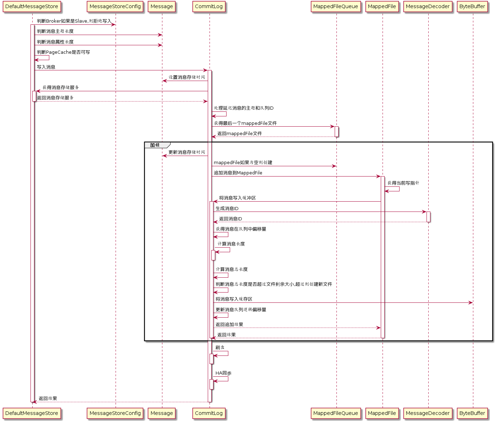

# RocketMQ 文件存储

## 存储架构

RocketMQ的文件存储主要分为三部分，分别是CommitLog、IndexFile、以及ConsumeQueue 三部分，其中每一个broker都会对应一个commit log 文件用于存储当前broker的数据，然后针对于当前broker 在做数据查询时，我们可能会直接通过某一个messageId 来进行查找，那这个时候就需要index file 文件来进行辅助查找

存储架构如下：

- RPC层（NettyRemoteingServer、NettyServerHandler）
- 请求处理层（SendMessageProcessor、PullMessageProcessor、EndTransactionalProcessor、QueryMessageProcessor）
- Broker 业务逻辑层（MessageStore、CommitLog、ConsumeQueue、IndexFile）
- 文件映射层 （MappedFileQueue、MappedFile）
- 文件存储层（DISK)


### 概览

在RocketMQ中所有涉及到文件存储的地方底层都是通过MappedFile实现的，以CommitLog为例，我们知道对于RocketMQ来说一个Broker对应了一个CommitLog文件，但是由于系统mmap的限制，一般在做mmap操作时都会将内存大小设置为1G，所以RocketMQ沿用了这样的方式，将CommitLog切分成了很多文件，每一个文件大小为 1G

RocketMQ的存储层核心点主要包括以下：

- DefaultMessageStore ：针对于broker存储层来说，其中包括 CommitLog、IndexFile、ConsumeQueue、Cleanup Thread等等
- CommitLog：用于存储当前broker的消息数据
- MappedFileQueue ：用于保存当前类型的所有MappedFile文件，比如基于ConsumeQueue 会有自己的MappedFileQueue对象，而基于CommitLog也会有自  己的MappedFileQueue对象
- AllocateMappedFileService ：用于创建MappedFile文件，并且如果开启文件预热功能则通过wramUp方法来进行文件预热
- MappedFile：每一个MappedFile 就对应于一个文件，内部通过mmap 做内存映射来提高性能
- ScheduleMessageService：用于处理定时任务信息，扫描各个delayLevel的 延时消息，如果到期则将消息添加到conmitlog中


### Broker 层存储

RocketMQ的存储大致分为以下几部分，首先我们知道RocketMQ是以Broker为单位来进行数据存储的，那最后的存储的数据都是以Broker为单位落到磁盘上的

**RocketMQ 以Broker为单位进行存储，其中包括CommitLog、ConsumeQueue、IndexFile 三大部分**


#### CommitLog

CommitLog 主要用来存储实际的消息，当我们将消息发送到Broker时要将数据实际落到磁盘，那么实际存放的就是CommitLog中

#### ConsumeQueue

一个Broker中可能存放多个Topic的数据，那么为了高效的在CommitLog中查找数据，我们就需要知道Topic+QueueId + offset 实际在commit log中存储的位置，所以就需要针对每一个ConsumeQueue简历对应的索引（topic + queueId）

#### IndexFile

IndexFile


### 文件层存储

文件层存储主要针对实际的文件写入数据、包括高效读写的方式，主要分为以下：

#### MappedFile

CommitLog 会按照每1G进行分割，当CommitLog 文件写满1G之后会创建新的文件，那么在底层对文件进行操作时，为了实现高效处理，就需要通过对每个文件mmap 来实现


#### MappedFileQueue

不管是IndexFile 还是 CommitLog 由于mmap大小有限制，所以每次对文件进行映射时只能映射1G，所以就需要多个文件来进行存储数据，那么MappedFileQueue就对应的是多个文件也是一个目录，如下：

- CommitLog --> MappedFileQueue
- IndexFile --> MappedFileQueue
- ConsumeQueue(topic + queueId) ==> MappedFileQueue


#### AllocateMappedFileService

AllocateMappedFileService 用于创建新的MappedFile文件，也就是当现在的MappedFile文件写满以后，需要创建新的MappedFile 文件来存储数据，并且为了避免Mmap 带来的大量中断问题，就需要对文件进行wramUp


#### TransientStorePool

TransientStorePool 是主要针对MappedFile文件写操作的性能提升，可以理解为内存池的概念，因为我们每一次创建新的文件都会通过mmap来做内存映射，并且在文件预热时会将内存进行lock，如果文件越来越多，那么被lock的内存也越来越多，这时候就可能会导致内存不够用，或者是如果没有对文件进行预热，会导致内存在使用过程中被swap

**通过TransientStorePool可以来限制内存的使用大小，并且创建之后这些内存会被lock，并不会被swap**


### 刷盘、复制线程

刷盘线程主要用于将写入到MappedFile中的数据写入到磁盘，因为MappedFile 是通过mmap进行内存映射过的，虽然利用了PageCache的机制，但是在写入数据时不会实时的写入到磁盘（会根据系统自己的脏页刷盘策略刷入到磁盘），需要我们手动调用force来刷入到磁盘，否则系统宕机或者其他问题会导致数据不完整

- GroupCommitService：同步刷盘操作

- FlushRealTimeService：异步刷盘操作

- CommitRealTimeService：专用缓存刷盘

  


## DefaultMessageStore

MessageStore 是Broker 存储的入口，其中包括针对定时消息服务、CommitLog、IndexFile以及ComsumeQueue操作等。主要用于存储消息信息，包括消息的存储，ComsumeQueue的索引创建，以及IndexFile索引创建

```java
//消息配置属性
private final MessageStoreConfig messageStoreConfig;

//CommitLog文件存储的实现类
private final CommitLog commitLog;		

//消息队列存储缓存表,按照消息主题分组
private final ConcurrentMap<String/* topic */, ConcurrentMap<Integer/* queueId */, ConsumeQueue>> consumeQueueTable;	

//消息队列文件刷盘线程
private final FlushConsumeQueueService flushConsumeQueueService;

//清除CommitLog文件服务
private final CleanCommitLogService cleanCommitLogService;	

//清除ConsumerQueue队列文件服务
private final CleanConsumeQueueService cleanConsumeQueueService;	

//索引实现类
private final IndexService indexService;	

//MappedFile分配服务
private final AllocateMappedFileService allocateMappedFileService;	

//CommitLog消息分发,根据CommitLog文件构建ConsumerQueue、IndexFile文件
private final ReputMessageService reputMessageService;

//存储HA机制
private final HAService haService;	

//消息服务调度线程
private final ScheduleMessageService scheduleMessageService;	

//消息存储服务
private final StoreStatsService storeStatsService;	

//消息堆外内存缓存
private final TransientStorePool transientStorePool;	

//Broker状态管理器
private final BrokerStatsManager brokerStatsManager;	

//消息拉取长轮询模式消息达到监听器
private final MessageArrivingListener messageArrivingListener;	

//Broker配置类
private final BrokerConfig brokerConfig;	

//文件刷盘监测点
private StoreCheckpoint storeCheckpoint;	

//CommitLog文件转发请求
private final LinkedList<CommitLogDispatcher> dispatcherList;	
```


### 消息存储流程




## 逻辑存储

### CommitLog

```java
    //文件队列， 通过他来获取 MappedFile
    protected final MappedFileQueue mappedFileQueue;

    //刷盘线程，GroupCommitService 同步刷盘等待线程，FlushRealTimeService 异步刷盘线程
    private final FlushCommitLogService flushCommitLogService;

    //If TransientStorePool enabled, we must flush message to FileChannel at fixed periods
    //CommitRealTimeService   专用的写入缓存writebuffer提交线程
    private final FlushCommitLogService commitLogService;

    //写入消息协议数据
    private final AppendMessageCallback appendMessageCallback;
    
    private final ThreadLocal<MessageExtBatchEncoder> batchEncoderThreadLocal;
    
    //用于存储对于topic-queueid的offset，因为对于不通的topic-queueid来说都会有自己的offset
    protected HashMap<String/* topic-queueid */, Long/* offset */> topicQueueTable = new HashMap<String, Long>(1024);
```

<br/>

####  **putMessage**

```java
//记录消息存储时间
msg.setStoreTimestamp(beginLockTimestamp);

//判断如果mappedFile如果为空或者已满,创建新的mappedFile文件
if (null == mappedFile || mappedFile.isFull()) {
    mappedFile = this.mappedFileQueue.getLastMappedFile(0); 
}
//如果创建失败,直接返回
if (null == mappedFile) {
    log.error("create mapped file1 error, topic: " + msg.getTopic() + " clientAddr: " + msg.getBornHostString());
    beginTimeInLock = 0;
    return new PutMessageResult(PutMessageStatus.CREATE_MAPEDFILE_FAILED, null);
}

//写入消息到mappedFile中
result = mappedFile.appendMessage(msg, this.appendMessageCallback);
```

消息添加的流程如下：

```sequence
participant MessageStore as store
participant CommitLog as commit_log
participant ScheduleMessage as schedule_message
participant MappedFileQueue as mapped_queue
participant MappedFile as mapped_file

store->commit_log: putMessage
commit_log-->schedule_message: 针对非事务消息以及事务提交类型的延迟消息\n 延迟消息topic：SCHEDULE_TOPIC_XXXX \n queueId: message.delayTimeLevel

schedule_message->schedule_message: 启动定时任务扫描
commit_log->mapped_queue: 获取最后一个MappedFile文件
commit_log->commit_log: 如果mappedFile不存在或者是剩余存储空间不够\n则创建一个新的MappedFile
commit_log->mapped_file: 添加信息 appendMessage

commit_log->commit_log: Statistics 统计
commit_log->commit_log: 处理数据刷盘
commit_log->commit_log: 处理主从复制
```


## 文件存储

### MappedFile

MappedFile就表示实际在磁盘上存储的物理文件，MappedFile 中有几个比较重要的参数如下：

```java
    //commitLog内存（ByteBuffer）写入位点，标记消息写到哪了，下次从该位置开始写。
     //在消息写完后递增，递增大小为消息的长度

    // 1 mappedbytebuffer 文件系统缓存    2 专用写入缓存
    protected final AtomicInteger wrotePosition = new AtomicInteger(0);

    //提交位置
    protected final AtomicInteger committedPosition = new AtomicInteger(0);

    //文件系统缓存里边的内容，刷入磁盘的位置
    private final AtomicInteger flushedPosition = new AtomicInteger(0);
    
    //文件大小
    protected int fileSize;
    protected FileChannel fileChannel;
    /**
     * Message will put to here first, and then reput to FileChannel if writeBuffer is not null.
     */
    protected ByteBuffer writeBuffer = null;
    
    //用于分配写入缓存的的内存池
    protected TransientStorePool transientStorePool = null;
    
    //文件名称
    private String fileName;
    
    //当前文件其实的offset位置，每个文件大小都是1G
	// 举个例子 第一个文件：000000， 第二个文件名称 0 + 1G ，fileFromOffset = 0 + 1G
    private long fileFromOffset;
    private File file;
    
    //当前文件对应的MappedByteBuffer
    private MappedByteBuffer mappedByteBuffer;
    private volatile long storeTimestamp = 0;
    
    //当前文件是否对应于MappedFileQueue中的第一个文件
    private boolean firstCreateInQueue = false;
```

<br/>

MappedFile 文件中有几个比较重要的属性如下：

- fileFromOffset：
- flushPostion：
- writePosition：
- endPosition：
- commitPosition：


<br/>

#### **appendMessagesInner**

**这里需要注意一个点就是返回的AppendResult中 writePostion 为写入之前的position，而writeBytes 既当前消息实际写入的长度，那么nextWritePosition = writePosition + writeBytes**

消息的协议数据如下：


MappedFile 添加消息的流程如下：

```java
//获取当前内存对象的写入位置（wrotePostion变量值）；
// 若写入位置没有超过文件大小则继续顺序写入；
int currentPos = this.wrotePosition.get();

if (currentPos < this.fileSize) {
    //由内存对象mappedByteBuffer创建一个指向同一块内存的ByteBuffer对象，并将内存对象的写入指针指向写入位置；
    ByteBuffer byteBuffer = writeBuffer != null ? writeBuffer.slice() : this.mappedByteBuffer.slice();
    byteBuffer.position(currentPos);
    AppendMessageResult result;
    
    //以文件的起始偏移量（fileFromOffset）、ByteBuffer对象、该内存对象剩余的空间（fileSize-wrotePostion）、消息对象msg为参数调用AppendMessageCallback回调类的doAppend方法；
    if (messageExt instanceof MessageExtBrokerInner) {
        result = cb.doAppend(this.getFileFromOffset(), byteBuffer, this.fileSize - currentPos, (MessageExtBrokerInner) messageExt);
    } else if (messageExt instanceof MessageExtBatch) {
        result = cb.doAppend(this.getFileFromOffset(), byteBuffer, this.fileSize - currentPos, (MessageExtBatch) messageExt);
    } else {
        return new AppendMessageResult(AppendMessageStatus.UNKNOWN_ERROR);
    }

    //将MapedFile.wrotePostion的值加上写入的字节数（AppendMessageResult对象返回的值）；
    this.wrotePosition.addAndGet(result.getWroteBytes());

    //更新存储时间戳MapedFile.storeTimestamp
    this.storeTimestamp = result.getStoreTimestamp();
    return result;
}
```

```sequence
participant MappedFile as mapped_file
participant AppendMessageCallback as callback

mapped_file->mapped_file: 获取当前writePosition的位置
mapped_file->mapped_file: 是否开启写入缓存，如果开启写入缓存则使用writeBuffer\n否则使用mappedByteBuffer

mapped_file->callback: doAppend 添加信息

callback->callback: 计算全局的物理其实偏移量：\nfileFromOffset+内存相对位置\nbyteBuffer.position(wrotePosition)
callback->callback: 写入totalSize
callback->callback: 写入magic code
callback->callback: 写入topic
callback->callback: 写入queueId
callback->callback: 写入....
callback->callback: 写入当前消息对于topic+queue的相对offset\n既1,2,3,4 顺序增长
callback->callback: 返回写入结果:\n1、写入之前的全局物理其实位置\n2、消息的总长度

```


#### commit

将二级缓存中的数据刷入到磁盘，并且更新commitPosition位置


#### flush

将数据刷入到磁盘，并且更新flushPosition


<br/>

### MappedFileQueue

MappedFileQueue 主要用来保存创建完成的MappedFile文件，当MappedFile文件不存在或者是需要被创建时，会通过内部的AllocateMappedFileService来进行创建 核心属性如下：

```java
//MappedFileQueue对应的存储目录，既要对哪个目录下的文件做mmap内存映射
    private final String storePath;

    // CommitLog file size,default is 1G
    private final int mappedFileSize;
    
    //用于存储当前目录对应的所有MappedFile文件
    private final CopyOnWriteArrayList<MappedFile> mappedFiles = new CopyOnWriteArrayList<MappedFile>();

    //用于创建MappedFile文件
    private final AllocateMappedFileService allocateMappedFileService;

    //当前刷盘指针，表示该指针之前的所有数据全部持久化到硬盘
    private long flushedWhere = 0;

    //当前数据提交指针，内存中byteBuffer当前的写指针，该值大于等于 flushedWhere
    private long committedWhere = 0;
```

在MappedFileQueue中有两个属性比较重要如下：

- flushedWhere： flushWhere是针对全局文件而言的，我们知道一个CommitLog可能对应了多个MappedFile文件，那么对于MappedFile而言 flushPosition是 MappedFile 自身文件的刷盘位置，而flushWhere则是全局文件的刷盘位置
- committedWhere：commitWhere 与 flushedWhere是一样的都是针对全局而言的


**举个例子：**

> **MappedFile ** ：{fileName = 1024, flushPostion = 3, writePosition = 10}  表示当前文件写入到了position 为 10的位置，但是刷盘才到position为3 的位置
>
> **MappedFileQueue **：{flushWhere = 1024 + 3，committedWhere = 1024 + mappedFile.commitPostion} 


<br/>

#### getLastMappedFile

getLastMappedFile 是从MappedFileQueue中获取最后一个MappedFile文件，如果获取不到或者是最后一个MappedFile文件已经满了，则会创建一个新的MappedFile文件放入到MappedFileQueue中


```sequence
participant CommitLog as commit_log
participant MappedFileQueue as mapped_queue
participant AllocateMappedFileService as allocate_service


commit_log->mapped_queue: 从MappedFileQueue中获取最新的MappedFile文件

mapped_queue->mapped_queue: "从mappedFiles集合中\n获取最后一个MappedFile文件"

mapped_queue->mapped_queue: 如果mappedFileLast 为空\n则通过startOffset计算出新文件的起始偏移量
mapped_queue->mapped_queue: 如果mappedFileLast已经满了，则通过最后一个\nmappedFile文件的fileFromOffset + mappedFileSize\n来计算新文件的其实偏移量

mapped_queue->mapped_queue: =====

mapped_queue-->allocate_service: 如果需要创建新的文件则通过\nallocateMappedFileService进行创建
mapped_queue->mapped_queue: 将新创建的MappedFile文件添加到mappedFiles集合中
mapped_queue->mapped_queue: 如果mappedFiles集合为空，则设置\n mappedFile.setFirstCreateInQueue(true);

```

```java

    public MappedFile getLastMappedFile(final long startOffset, boolean needCreate) {
        long createOffset = -1;

        // 获取要写入的CommitLog文件对应的 MappedFile
        MappedFile mappedFileLast = getLastMappedFile();

        //mappedFileLast 为空或者最后一个对象对应的文件已经写满，
        // 则创建一个新的文件（即新的 MapedFile 对象） ；
        // 计算出新文件的起始偏移量（起始偏移量就是文件名称）
        if (mappedFileLast == null) {
            createOffset = startOffset - (startOffset % this.mappedFileSize);
        }

        //如果可以获取到最后一个mappedfile 并且最后一个mappedfile也满了
        // createOffset = lastFileFromOffset + mappedFileSize
        if (mappedFileLast != null && mappedFileLast.isFull()) {
            createOffset = mappedFileLast.getFileFromOffset() + this.mappedFileSize;
        }

        if (createOffset != -1 && needCreate) {
            //下一个文件
            String nextFilePath = this.storePath + File.separator + UtilAll.offset2FileName(createOffset);

            //下下一个文件
            String nextNextFilePath = this.storePath + File.separator
                    + UtilAll.offset2FileName(createOffset + this.mappedFileSize);

            MappedFile mappedFile = null;

            // 判断 allocateMappedFileService 服务是否初始化，
            // 并创建下一个文件和下下一个文件
            if (this.allocateMappedFileService != null) {
				
                mappedFile = this.allocateMappedFileService.putRequestAndReturnMappedFile(nextFilePath,
                        nextNextFilePath, this.mappedFileSize);
            } else {
                try {

                    // 如果allocateMappedFileService 没有创建，则直接创建文件
                    mappedFile = new MappedFile(nextFilePath, this.mappedFileSize);
                } catch (IOException e) {
                    log.error("create mappedFile exception", e);
                }
            }

            //最后将创建或返回的 MapedFile 对象存入 MapedFileQueue 的 MapedFile 列表中，
            //并且将MappedFile的firstCreateInQUeue设置为true，表示当前MappedFile是在MappedFileQueue的第一个位置
            // 并返回该 MapedFile 对象给调用者
            if (mappedFile != null) {
                //如果mappedFiles集合为空，则将mappedFile的firstCreateInQueue属性设置为true，
                //表示当前MappedFile是MappedFileQueue中的第一个MappedFile文件
                if (this.mappedFiles.isEmpty()) {
                    mappedFile.setFirstCreateInQueue(true);
                }
                this.mappedFiles.add(mappedFile);
            }

            return mappedFile;
        }

        return mappedFileLast;
    }
```


### AllocateMappedFileService

AllocateMappedFileService 用于创建新的MappedFile文件，并且根据配置判断对于新的MappedFile文件是否需要进行文件预热等

```sequence
participant MappedFileQueue as mapped_queue
participant AllocateMappedFileService as allocate_service
participant AllocateMappedFileService_ServiceThread as allocate_service_queue
participant MappedFile as mmap_file


mapped_queue->allocate_service: putRequestAndReturnMappedFile\n 创建新的MappedFile文件

allocate_service->allocate_service_queue: 创建AllocateReuest请求用于创建NextFile

allocate_service_queue->allocate_service_queue: 判断是否开启二级缓存
allocate_service_queue->allocate_service_queue: 开启二级缓存则通过内存池获取一块内存\n用于后续的写入、刷盘操作
allocate_service_queue->allocate_service_queue: 如果没有开启则通过mmap进行操作
allocate_service_queue->allocate_service_queue: ===
allocate_service_queue-->mmap_file: 通过wramUp来进行文件预热\n1、每4K像文件写入一个0\n2、然后通过mlock锁住这块内存

allocate_service->allocate_service_queue: 创建AllocateReuest请求用于创建NextNextFile
allocate_service_queue->allocate_service_queue: NextNextFile与NextFile流程是一样的

allocate_service->allocate_service: 将创建好的下下个文件缓存起来\n在下次使用时可以快速返回
```

<br/>

#### **创建AllocateReuest**

创建AllocateReuest请求用于创建NextFile

```java
//创建下一个 CommitLog 文件和下下一个CommitLog文件。
//1、构建 AllocateRequest nexReq 对象，并把该对象存放到 requestQueue 队列中
//2、构建 AllocateRequest nextNextReq 对象，并把该对象存放到 requestQueue 队列中
//然后在 AllocateMappedFileService.run() 方法中从 requestQueue 阻塞中获取需要创建的任务，并创建文件。
public MappedFile putRequestAndReturnMappedFile(String nextFilePath, String nextNextFilePath, int fileSize) {
 
    AllocateRequest nextReq = new AllocateRequest(nextFilePath, fileSize);

    // 尝试向 ConcurrentHashMap 中存放 nextReq ，如果存放失败说明有别的线程已经创建文件
   boolean nextPutOK = this.requestTable.putIfAbsent(nextFilePath, nextReq) == null;

    //存放成功，则进行向requestQueue中存放数据
    if (nextPutOK) {
   		
        //向requestQueue中放入请求，由ServiceThread帮我们创建MappedFile
        boolean offerOK = this.requestQueue.offer(nextReq);
        if (!offerOK) {
            log.warn("never expected here, add a request to preallocate queue failed");
        }
        canSubmitRequests--;
    }
    
    
    // 再创建一个 NextNextCommitLog 文件，这样可以在下一次创建时直接返回创建好的MappedFile文件提高性能
    AllocateRequest nextNextReq = new AllocateRequest(nextNextFilePath, fileSize);
    boolean nextNextPutOK = this.requestTable.putIfAbsent(nextNextFilePath, nextNextReq) == null;
    if (nextNextPutOK) {
          boolean offerOK = this.requestQueue.offer(nextNextReq);
            if (!offerOK) {
                log.warn("never expected here, add a request to preallocate queue failed");
            }
    }

  
	// 获取创建的结果
    AllocateRequest result = this.requestTable.get(nextFilePath);
    try {
        if (result != null) {
            boolean waitOK = result.getCountDownLatch().await(waitTimeOut, TimeUnit.MILLISECONDS);
            if (!waitOK) {
                log.warn("create mmap timeout " + result.getFilePath() + " " + result.getFileSize());
                return null;
            } else {
                
                //将缓存的NextFile文件从requestTable中移除，但是这个时候nextNextFile的文件数据还是缓存在requestTable中的
                this.requestTable.remove(nextFilePath);
                return result.getMappedFile();
            }
        } else {
            log.error("find preallocate mmap failed, this never happen");
        }
    } catch (InterruptedException e) {
        log.warn(this.getServiceName() + " service has exception. ", e);
    }

    return null;
}
```

<br/>


#### **接收AllocateRequest请求**

接收AllocateRequest请求，创建MappedFile

```java
    // 从 requestQueue 阻塞队列中获取 AllocateRequest  任务。
    req = this.requestQueue.take();
    
    AllocateRequest expectedRequest = this.requestTable.get(req.getFilePath());
 	
    if (req.getMappedFile() == null) {
        long beginTime = System.currentTimeMillis();

        MappedFile mappedFile;

        // 判断是否开启 isTransientStorePoolEnable ，如果开启则使用直接内存进行写入数据，
        // 最后从直接内存中 commit 到 FileChannel 中。
        if (messageStore.getMessageStoreConfig().isTransientStorePoolEnable()) {
            try {
                //如果开启二级缓存的话那么MappedFile的写入则不在通过mappedBytesBuffer直接写入而是通过fileChannel + 二级缓存写入
                mappedFile = ServiceLoader.load(MappedFile.class).iterator().next();
                mappedFile.init(req.getFilePath(), req.getFileSize(), messageStore.getTransientStorePool());
            } catch (RuntimeException e) {
                log.warn("Use default implementation.");
                mappedFile = new MappedFile(req.getFilePath(), req.getFileSize(), messageStore.getTransientStorePool());
            }
        } else {

            // 使用 mmap 方式创建 MappedFile
            mappedFile = new MappedFile(req.getFilePath(), req.getFileSize());
        }

        // pre write mappedFile
        // 预写入数据。
        // 按照系统的 pagesize 进行每个pagesize 写入一个字节数据。
        // 为了把mmap 方式映射的文件都加载到内存中。
        if (mappedFile.getFileSize() >= this.messageStore.getMessageStoreConfig()
                .getMappedFileSizeCommitLog()
                &&
                this.messageStore.getMessageStoreConfig().isWarmMapedFileEnable()) {
            mappedFile.warmMappedFile(this.messageStore.getMessageStoreConfig().getFlushDiskType(),
                    this.messageStore.getMessageStoreConfig().getFlushLeastPagesWhenWarmMapedFile());
        }

	   //将创建好的文件放入到Request中
        req.setMappedFile(mappedFile);
        this.hasException = false;
        isSuccess = true;
    }
```


<br/>

### TransientStorePool

> TransientStorePool有些像页高速缓存那样，为了避免页面被换出到交换区，mq申请了一块内 存，并且用指定这些页面不能被操作系统换出，然后将这些内存分配给业务使用

TransientStorePool 是临时内存池，既然文件已经有了Mmap了，为什么还要用内存池呢？

用内存池或者是二级缓存有以下几个好处：

1、首先我们在生产环境每天都有大量的消息写入，那么对于Broker来说我们所有的数据都是存放在CommitLog目录的，随着消息的增加，CommitLog目录下的MappedFile文件也就越来越多，当我们开启文件预热优化时，在文件余热完成过后这些内存会被lock到内存中，而不会被置换出去，随着MappedFile文件数量的增加，那么内存使用也越来越多，使用也会越来越紧张，这个时候我们为了缩小内存的时候就需要通过内存池来规避这个问题

2、如果我们的MappedFile文件没有开启内存预热，那么这些内存会被置换到swap分区，当每次需要使用时需要将swap分区的数据置换到内存，将内存的数据置换到swap分区，这样无疑是浪费了很多性能

综合以上两点，RocketMQ增加了二级缓存既内存池优化，我们可以通过设计内存池中的内存大小来规避内存使用过多，以及内存被置换问题，具体使用方式根据场景而定

```java
//内存池用维护的ByteBuffer的数量，每一个ByteBuffer都会有 fileSize 大小
private final int poolSize; 

//每个ByteBuffer大小，默认是1G
private final int fileSize; 

//ByteBuffer容器。双端队列
private final Deque<ByteBuffer> availableBuffers; 
```

<br/>

#### **初始化**

```java
public void init() {
    
    //创建poolSize个堆外内存
    for (int i = 0; i < poolSize; i++) {
        ByteBuffer byteBuffer = ByteBuffer.allocateDirect(fileSize);
        final long address = ((DirectBuffer) byteBuffer).address();
        Pointer pointer = new Pointer(address);
        
        //使用com.sun.jna.Library类库将该批内存锁定,避免被置换到交换区,提高存储性能
        LibC.INSTANCE.mlock(pointer, new NativeLong(fileSize));
        availableBuffers.offer(byteBuffer);
   }
}
```

<br/>

#### **获取二级缓存**

```java
public ByteBuffer borrowBuffer() {
    ByteBuffer buffer = availableBuffers.pollFirst();
    if (availableBuffers.size() < poolSize * 0.4) {
        log.warn("TransientStorePool only remain {} sheets.", availableBuffers.size());
    }
    return buffer;
}
```

<br/>

#### **归回二级缓存**

```java
public void returnBuffer(ByteBuffer byteBuffer) {
    //将bytesBuffer的position位置置为0，并且将limit置为fileSize
    //还原当前ByteBuffer
    byteBuffer.position(0);
    byteBuffer.limit(fileSize);
    this.availableBuffers.offerFirst(byteBuffer);
}
```


### 刷盘线程

刷盘线程分为以下三种，分别是

- GroupCommitService 用于同步刷盘

- FlushRealTimeService：用于异步刷盘

- CommitRealTimeService：用于二级缓存刷盘

  

#### GroupCommitService 

同步刷盘时 writePosition 位置 以及 flushPosition的位置 以及 MappedFileQueue中 的位置记录如下：


### 刷盘线程

- 

  


####  GroupCommitService 


#### FlushRealTimeService


#### CommitRealTimeService


刷盘线程主要分为一下三种：


### ConsumeQueue 存放数据

DefaultMessageStore#ReputMessageService


