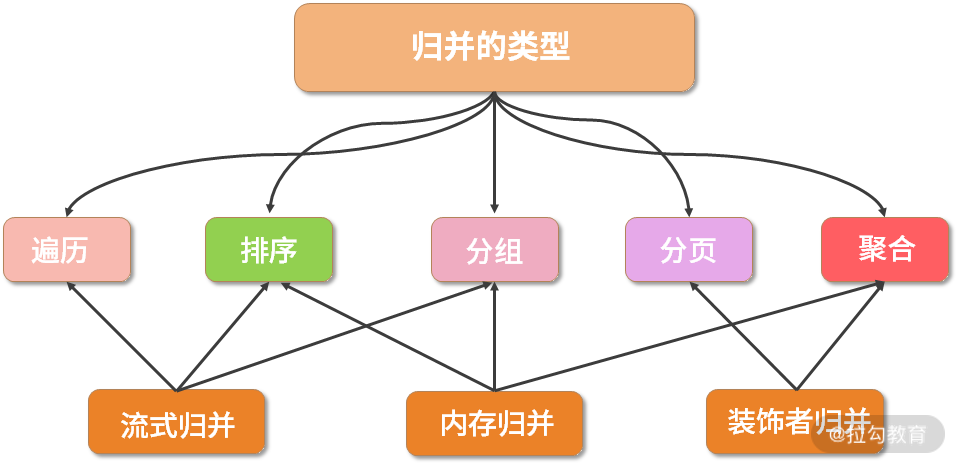
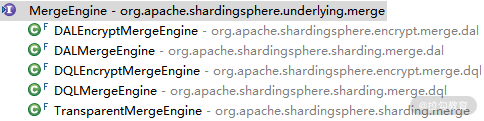
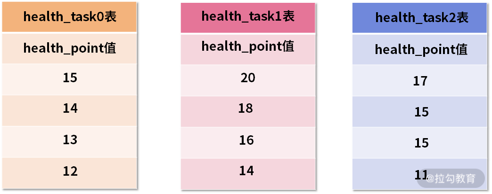
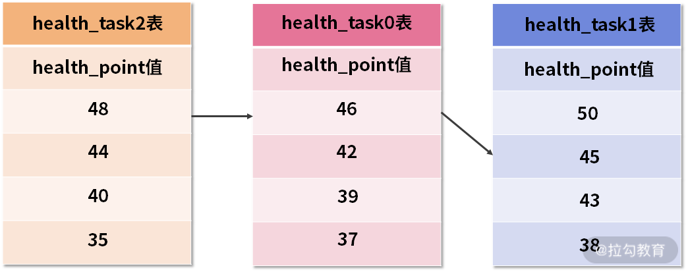

# Sharding Sphere

ShardingSphere 由三部分组成，分别为sharding-jdbc、sharding-proxy以及sharding-sidecar三部分组成，我们现在需要关注的大多都是sharding-jdbc这一部分，sharding-jdbc是一款轻量级的分库、分表的框架


## 分库分表的前提条件

### 分表的前提条件

**单表数据量不超过2000W**

首先我们要搞清楚为什么要分表、以及什么时候需要才需要进行分表，因为分表也有一些弊端，比如分表后可能产生的分布式事务以及主键自增问题都需要去解决

我们以mysql中的innodb引擎为例，我们知道mysql中的一张表在物理上是以一个文件的形式来进行存储的，一张表就是一个ibd文件，并且表相关的索引也是存放在ibd文件中，而表数据存储也是以B+树的形式来进行存放在ibd中的，当一个表的数据量越来越大的时候 B+树的高度也会越来越高，那么我们在进行数据查询时就会有多次磁盘IO，并且当并发量比较大时，单表IO性能就会比较差，而且当我们根据索引来进行筛选时同样也是基于单标io来决定的


### 分库的前提条件

一般来说分表就已经可以解决我们大部分的问题了，为什么还需要分库呢

对于mysql来说，一个实例才被称为一个数据库，而数据库中又分为了不通的schema 与 schema下不同的表，而每个实例都对应不通的服务器，服务器本身也会有网路io、文件io、cpu等的一些限制，当并发量越来越大的时候我们单实例已经无法支撑的时候就需要进行所谓的分库，当然这是在表数据量比较大的前提下才需要做的，否则表的数据量比较小，而并发量比较大的话我们可以通过读写分离、多主多从的方式也可以减轻压力

**就是一个库以经验而言，最多支撑到并发 2000，一定要扩容了。而且一个健康的 单库并发值 ，最好保持在 每秒1000 左右 ，不要太大。如果高并发下，QPS达到万级别的呢？那么你可以将一个库的数据拆分到多个库中，访问的时候就访问一个库好了。也就是说如果有5000左右QPS，把每个库的QPS维持在 1000左右，分发到五个库左右。**

### 分库分表前后对比


## 分表分库的方案

分库分表的方案主要还是关注数据的倾斜以及数据的热点问题，在分表分库时既要避免数据热点、又要避免数据倾斜是一个比较难的问题。

分表分库时需要关注的点如下：

- 分片键的选择
- 分片策略的选择
- 分片算法的选择


### range 分片

一种是按照 range 来分，就是每个片，一段连续的数据，这个一般是按比如**时间范围/数据范围**来的，但是这种一般较少用，因为很容易发生**数据倾斜**，大量的流量都打在**最新的数据**上了。

比如，安装数据范围分片，把1到100个数字，要保存在3个节点上

按照顺序分片，把数据平均分配三个节点上

- 1号到33号数据保存到节点1上
- 34号到66号数据保存到节点2上
- 67号到100号数据保存到节点3上


#### 缺点

1、**很容易产生数据热点问题** ，如节假日活动大量的流量都打在某个库某个表上了。

2、**可能会导致数据清晰问题**


### hash 取余分片

hash 取余的标准算法为： **dbId = hash(id)  % dbSize,  tbId = hash(id)  / dbSize % tbSize**

> 为什么这里需要先做除法呢，如果不做除法的话可能会导致每个库只用同一个表，比如 hashId 为 1，计算公式为如下：
>
> dbId = hash(id)  % dbSize ,  tbId = hash(id)  % tbSize 
>
> 根据公式计算结果为 第一个库的第一张表，那么什么时候会用到第二张表呢，答案是会用到但是很不均匀
>
> ```java
>    @Test
>    public void testmod() {
>        for (int i = 0; i < 128; i++) {
>            int id=1000+i;
>            System.out.print("id = " + id);
>            System.out.print(" id%8 = " + id % 8 );
>            System.out.print("   id/8%16 = " + id % 16 );
>            System.out.println(" " );
>        }
>    }
> ```
>
> 


使用hash 算法，获取key的哈希结果，再按照规则进行分片，这样可以保证数据被打散，同时保证数据分布的比较均匀

例如1到100个数字，对每个数字进行哈希运算，然后对每个数的哈希结果除以节点数进行取余，余数为1则保存在第1个节点上，余数为2则保存在第2个节点上，余数为0则保存在第3个节点，这样可以保证数据被打散，同时保证数据分布的比较均匀

比如有100个数据，对每个数据进行hash运算之后，与节点数进行取余运算，根据余数不同保存在不同的节点上


#### 哈希取模的问题

> 即当增加或减少节点时，原来节点中的80%的数据会进行迁移操作，对所有数据重新进行分布

哈希取余分片，建议使用多倍扩容的方式，例如以前用3个节点保存数据，扩容为比以前多一倍的节点即6个节点来保存数据，这样只需要适移50%的数据。

数据迁移之后，第一次无法从缓存中读取数据，必须先从数据库中读取数据，然后回写到缓存中，然后才能从缓存中读取迁移之后的数据


#### 优缺点

哈希取余分片优点：

- 配置简单：对数据进行哈希，然后取余

哈希取余分片缺点：

- 数据节点伸缩时，导致数据迁移
- 迁移数量和添加节点数据有关，建议翻倍扩容


### 一致性hash分片

文档地址：https://www.jianshu.com/p/528ce5cd7e8f

#### 一致性Hash算法原理

一致性Hash算法也是使用取模的方法，不过，上述的取模方法是对服务器的数量进行取模，而一致性的Hash算法是对`2的32方`取模。即，一致性Hash算法将整个Hash空间组织成一个虚拟的圆环，Hash函数的值空间为`0 ~ 2^32 - 1(一个32位无符号整型)`，整个哈希环如下：


<center>图1-4：Hash圆环</center>


 整个圆环以`顺时针方向组织`，圆环正上方的点代表0，0点右侧的第一个点代表1，以此类推。
 第二步，我们将各个服务器使用Hash进行一个哈希，具体可以选择服务器的IP或主机名作为关键字进行哈希，这样每台服务器就确定在了哈希环的一个位置上，比如我们有三台机器，使用IP地址哈希后在环空间的位置如图1-4所示：


<center>图1-4：服务器在哈希环上的位置</center>


现在，我们使用以下算法定位数据访问到相应的服务器：

> 将数据Key使用相同的函数Hash计算出哈希值，并确定此数据在环上的位置，从此位置沿环顺时针查找，遇到的服务器就是其应该定位到的服务器。

例如，现在有ObjectA，ObjectB，ObjectC三个数据对象，经过哈希计算后，在环空间上的位置如下：


<center>图1-5：数据对象在环上的位置</center>																				

根据一致性算法，Object -> NodeA，ObjectB -> NodeB, ObjectC -> NodeC


#### 一致性Hash算法的容错性和可扩展性

现在，假设我们的Node C宕机了，我们从图中可以看到，A、B不会受到影响，只有Object C对象被重新定位到Node A。所以我们发现，在一致性Hash算法中，如果一台服务器不可用，受影响的数据仅仅是此服务器到其环空间前一台服务器之间的数据（这里为Node C到Node B之间的数据），其他不会受到影响。如图1-6所示：


​																	图1-6：C节点宕机情况，数据移到节点A上


另外一种情况，现在我们系统增加了一台服务器Node X，如图1-7所示：


<center>图1-7：增加新的服务器节点X</center>


此时对象ObjectA、ObjectB没有受到影响，只有Object C重新定位到了新的节点X上。
 如上所述：

> 一致性Hash算法对于节点的增减都只需重定位环空间中的一小部分数据，有很好的容错性和可扩展性。


#### 数据倾斜问题

在一致性Hash算法服务节点太少的情况下，容易因为节点分布不均匀面造成`数据倾斜（被缓存的对象大部分缓存在某一台服务器上）问题`，如图1-8特例：


<center>图1-8：数据倾斜</center>

 这时我们发现有大量数据集中在节点A上，而节点B只有少量数据。为了解决数据倾斜问题，一致性Hash算法引入了`虚拟节点机制`，即对每一个服务器节点计算多个哈希，每个计算结果位置都放置一个此服务节点，称为虚拟节点。
 具体操作可以为服务器IP或主机名后加入编号来实现，实现如图1-9所示：


<center>图1-9：增加虚拟节点情况</center>


数据定位算法不变，只需要增加一步：虚拟节点到实际点的映射。
所以加入虚拟节点之后，即使在服务节点很少的情况下，也能做到数据的均匀分布。


#### 注意

比如在分表的情况下，如果数据持续增长过高可能会需要针对现有分表的一些情况进行重新拆分，这样就会影响到我们目前数据库中所有的物理分表，因为需要进行重新hash操作，但是一致性hash的出现可以帮我们将影响压缩到最小，但是我们知道通常我们分表或者拆分实例也很少会超过100张表或者是100台机器，拿为了保证数据的分散均匀，我们就可能会为每一个节点去创建对应的虚拟节点，尽量的数据分散均匀化，那这样就会引起一个问题，就是当我们为某个物理节点创建出虚拟节点后，相应的其他物理节点也会存在虚拟节点，那当虚拟节点越来越多时，其实际影响的物理节点也越来越多，所以我们要在这两者之间做好一个更好的权衡,公式如下：

```
n * 虚拟节点 =  影响物理节点数量
这个公式代表说当虚拟节点持续增长时，所影响的物理节点数量也会跟着持续增长
```


#### 缺点

**一致性hash 虽然可以通过添加虚拟节点的方式来减少数据倾斜的问题，但是随着虚拟节点的增加就导致所影响的物理节点越来越多，在这种情况下的话就需要对虚拟节点做一个权衡，以保证在数据均匀的情况下影响的物理节点也少**


#### 代码实现

**Hash 算法实现如下**

``` java
public class HashService implements IHashService {

    /**
     * MurMurHash算法,性能高,碰撞率低
     *
     * @param key String
     * @return Long
     */
    public Long hash(String key) {
        ByteBuffer buf = ByteBuffer.wrap(key.getBytes());
        int seed = 0x1234ABCD;

        ByteOrder byteOrder = buf.order();
        buf.order(ByteOrder.LITTLE_ENDIAN);

        long m = 0xc6a4a7935bd1e995L;
        int r = 47;

        long h = seed ^ (buf.remaining() * m);

        long k;
        while (buf.remaining() >= 8) {
            k = buf.getLong();

            k *= m;
            k ^= k >>> r;
            k *= m;

            h ^= k;
            h *= m;
        }

        if (buf.remaining() > 0) {
            ByteBuffer finish = ByteBuffer.allocate(8).order(ByteOrder.LITTLE_ENDIAN);
            finish.put(buf).rewind();
            h ^= finish.getLong();
            h *= m;
        }

        h ^= h >>> r;
        h *= m;
        h ^= h >>> r;

        buf.order(byteOrder);
        return h;

    }
}
```


**ConsistentHashAlgorithm**

一致性Hash 代码实现如下

```java
package com.example.study.sharding;


import com.baomidou.mybatisplus.core.toolkit.StringUtils;
import com.google.common.collect.Lists;
import com.google.common.collect.Maps;
import lombok.Getter;

import java.util.*;
import java.util.concurrent.atomic.AtomicLong;

public class ConsistentHashAlgorithm {


    //虚拟节点，key表示虚拟节点的hash值，value表示虚拟节点的名称
    @Getter
    private NavigableMap<Long, String> virtualNodes = new TreeMap<>();

    private SortedMap<String, Long> virtualHash = new TreeMap<>();

    //当节点的数目很少时，容易造成数据的分布不均，所以增加虚拟节点来平均数据分布
    //虚拟节点的数目；虚拟节点的生成主要是用来让数据尽量均匀分布
    //虚拟节点是真实节点的不同映射而已
    //比如真实节点user1的hash值为100，那么我们增加3个虚拟节点user1-1、user1-2、user1-3，分别计算出来的hash值可能就为200，345，500；通过这种方式来将节点分布均匀
    private static final int VIRTUAL_NODES = 5;


    public ConsistentHashAlgorithm() {
    }


    public ConsistentHashAlgorithm(NavigableMap<Long, String> virtualTableNodes, Collection<String> tableNodes) {
        if (Objects.isNull(virtualTableNodes)) {
            virtualTableNodes = initNodesToHashLoop(tableNodes);
        }

        this.virtualNodes = virtualTableNodes;
    }

    public NavigableMap<Long, String> initNodesToHashLoop(Collection<String> tableNodes) {
        NavigableMap<Long, String> virtualTableNodes = new TreeMap<>();
        for (String node : tableNodes) {
            for (int i = 0; i < VIRTUAL_NODES; i++) {
                String s = String.valueOf(i);
                String virtualNodeName = node + "@VN" + s;
                long hash = getHash(virtualNodeName);

                virtualTableNodes.put(hash, virtualNodeName);
                virtualHash.put(virtualNodeName, hash);
            }
        }

        return virtualTableNodes;
    }

    /**
     * 通过计算key的hash
     * 计算映射的表节点
     *
     * @param key
     * @return
     */
    public String getTableNode(String key) {
        //key的hash
        long hash = getHash(key);
        String virtualNode = getVirtualTableNode(hash,false );

        //虚拟节点名称截取后获取真实节点
        return getActualNode(virtualNode);
    }


    /**
     * 通过计算key的hash
     * 计算映射的表节点
     *
     * @param key
     * @return
     */
    public Map<String, Set<Pair<String,String>>> affectNode(String key, Map<String, Set<Pair<String,String>>> affectMap) {
        //key的hash
        long hash = getHash(key);
        String virtualNode = getVirtualTableNode(hash,false);

        Long virtualNodeHash = virtualHash.get(virtualNode);

        //获取当前虚拟节点的下一个节点
        String virtualNextNode = getVirtualTableNode(virtualNodeHash,true);

        String actualNode = getActualNode(virtualNode);
        String actualNextNode = getActualNode(virtualNextNode);

        if (!actualNode.equals(actualNextNode)) {
            affectMap.compute(actualNode, (node, affectSet)-> {
                if (affectSet == null)
                    affectSet = new HashSet<>();

                affectSet.add(new Pair<>(virtualNode, virtualNextNode));
                return affectSet;
            });
        }

        //虚拟节点名称截取后获取真实节点
        return affectMap;
    }


    /**
     * 通过计算key的hash 计算映射的表节点，这里还会计算受影响的物理节点数量
     *
     * @param key
     * @return
     */
    public String affectActualNode(String key, Map<String, Set<String>> affectMap) {
        //key的hash
        long hash = getHash(key);
        String virtualNode = getVirtualTableNode(hash,false);

        Long virtualNodeHash = virtualHash.get(virtualNode);

        //获取当前虚拟节点的下一个节点
        String virtualNextNode = getVirtualTableNode(virtualNodeHash,true);

        String actualNode = getActualNode(virtualNode);
        String actualNextNode = getActualNode(virtualNextNode);

        if (!actualNode.equals(actualNextNode)) {
            affectMap.compute(actualNode, (node, affectSet)-> {
                if (affectSet == null)
                    affectSet = new HashSet<>();

                affectSet.add(actualNextNode);
                return affectSet;
            });
        }

        //虚拟节点名称截取后获取真实节点
        return actualNode;
    }


    public String getActualNode(String virtualNode) {
        //虚拟节点名称截取后获取真实节点
        if (StringUtils.isNotBlank(virtualNode)) {
            return virtualNode.substring(0, virtualNode.indexOf("@"));
        }
        return null;
    }

    /**
     * 获取虚拟节点
     *
     * @return
     */
    public String getVirtualTableNode(Long hash, boolean computeEffect) {

        // 得到大于该Hash值的所有Map
        SortedMap<Long, String> subMap = computeEffect ? virtualNodes.tailMap(hash,false) : virtualNodes.tailMap(hash);
        String virtualNode;
        if (subMap.isEmpty()) {
            //如果没有比该key的hash值大的，则从第一个node开始
            Long i = virtualNodes.firstKey();
            //返回对应的服务器
            virtualNode = virtualNodes.get(i);
        } else {
            //第一个Key就是顺时针过去离node最近的那个结点
            Long i = subMap.firstKey();
            //返回对应的服务器
            virtualNode = subMap.get(i);
        }

        return virtualNode;
    }

    /**
     * 使用FNV1_32_HASH算法计算key的Hash值
     *
     * @param key
     * @return
     */
    public long getHash(String key) {
        final int p = 16777619;
        int hash = (int) 2166136261L;
        for (int i = 0; i < key.length(); i++)
            hash = (hash ^ key.charAt(i)) * p;
        hash += hash << 13;
        hash ^= hash >> 7;
        hash += hash << 3;
        hash ^= hash >> 17;
        hash += hash << 5;

        // 如果算出来的值为负数则取其绝对值
        if (hash < 0)
            hash = Math.abs(hash);
        return hash;
    }

    static class Pair<F,S> {

        private final F first;

        private final S second;

        public Pair(F first, S second) {
            this.first = first;
            this.second = second;
        }

        public F getFirst(){
            return  first;
        }

        public S getSecond() {
            return second;
        }

        public static <F,S> Pair<F,S> newPair(F first, S second) {
            return new Pair<F,S>(first, second);
        }


        @Override
        public boolean equals(Object o) {
            if (this == o) return true;
            if (o == null || getClass() != o.getClass()) return false;
            Pair<?, ?> pair = (Pair<?, ?>) o;
            return Objects.equals(first, pair.first) && Objects.equals(second, pair.second);
        }


        @Override
        public int hashCode() {
            return Objects.hash(first, second);
        }

        @Override
        public String toString() {
            return "Pair{" +
                    "first=" + first +
                    ", second=" + second +
                    '}';
        }
    }

    public static void main(String[] args) {

        ArrayList<String> tableNodes = Lists.newArrayList("t_order_0", "t_order_1",
                "t_order_2", "t_order_3", "t_order_4", "t_order_5","t_order_6","t_order_7", "t_order_8");

        ConsistentHashAlgorithm hashAlgorithm = new ConsistentHashAlgorithm(null, tableNodes);

        HashMap<String, AtomicLong> hashMap = Maps.newHashMap();


        Map<String, Set<Pair<String,String>>> affectMap = Maps.newHashMap();
        Map<String, Set<String>> affectNodeMap = Maps.newHashMap();

        for (int i = 0; i < 1000000; i++) {
           String tableNode = hashAlgorithm.affectActualNode(String.valueOf(i), affectNodeMap);
           hashMap.compute(tableNode, (node, value) -> {
                AtomicLong count = value;

                if (count == null)
                    count = new AtomicLong();

                count.incrementAndGet();

                return count;
            });
        }

        //影响节点数量
        affectNodeMap.forEach((key,value)-> {
            System.out.println(key + " : " + value);
        });

        //数据分布情况
        System.out.println(hashMap);

    }

}

```


### 一致性hash 改良版

一致性Hash 改良版与 标准不一样的地方在于，环形Hash范围从 0-2^32 -1 改为了 0 - 63，我们在做分表时通过将每一段数据划分为一个组，如下：

|                              |                              |                               |
| ---------------------------- | ---------------------------- | ----------------------------- |
| 0  1  2  3                   | 4  5  6  7                   | 8  9  10  11                  |
| t_order_4（hash 环中的位置） | t_order_8（hash 环中的位置） | t_order_12（hash 环中的位置） |

在做具体划分时，我们通过id 对 64 直接取余这样可以保证数据的位置都会落在当前的这个hash环上，那么 t_order_4 的位置在hash环中对应的位置就是4，t_order_8 在hash环中对应的位置就是8 ，依次类推。

我们通过 hash环的大小  64 / 平均分散的位置 (这里是4)，就可以计算出在hash环中一共存在16个位置，那这16个位置每一个位置就对应一张表，按照一张表1000万的数据来计算的话就可以存放大概1.6亿的数据，对于普通业务来说已经够用了，当然我们可以进行扩容在扩容时就要考虑数据的迁移，按照上面的划分在每一次迁移时就需要迁移 1/2 的数据 


####  一致性Hash理念——平均分布方案

利用一致性hash理论，分库选择hash(key)的公式基准为 value= key mod 64，分表公式value= key / 64 mod 64，key为订单号或者userId等这类经常查询的主要字段。（后续会对这个公式有变化） 我们假定上述公式，则可以分64个库，每个库64个表，假设一个表1千万行记录。则最大64 * 64 * 1000万数据，我相信不会有这一天的到来，所以我们以这个作为最大值比较合理，甚至选择32 * 32都可以。

```
分组公式：64 = 每组多少个count  * group需要分组的个数 
数据所在环的位置（也就是在哪个库中）：value = key mode 64 / count  * count 
```

以下举例为16组，也就是16个库，group=16 这个时候库的公式为value = key mode 64 / 4 * 4，除以4后，会截取小数位得出一个整数，然后 * 4倍，就是数据所在位置。

```
// 按4个为一组，分两个表
count = 4：
Integer dbValue = userId % 64 / count * count ;
```


```
hash(key)在0~3之间在第0号库
hash(key)在4~7之间在第4号库
hash(key)在8~11之间在第8号库
……
```

> 备注：其实一开始可以64个为一组就是一个库，后续变化32个为一组就是两个库，从一个库到两个库，再到4个库，逐步递进。


**从分1库开始扩容的迭代：**


下图中举例分16组后，变为分到32组，需要每个库都拿出一半的数据迁移到新数据，扩容直到分64个组。


可以看到当需要进行扩容一倍时需要迁移一半的数据量，以2^n递增，所以进行影响范围会比较大

**优点：**

- 如果直接拆分32组，那么就比较一劳永逸
- 如果数据量比较大，未做过分表可以用一劳永逸方式。
- 分布均匀
- 迁移数据时不需要像方案一那样大部分的数据都需要进行迁移并有重复迁移，只需要迁移一半

**缺点：**

- 可以扩展，但是影响范围大。
- 迁移的数据量比较大，虽然不像方案一那样大部分数据迁移，当前方案每个表或库都需要一半数据的迁移。
- 若要一劳永逸，则需要整体停机来迁移数据


#### 一致性Hash理念——按迭代增加节点

#####  方案四问题

方案四是设定最大范围64，按2^n指数形式从1增加库或者表数量，这样带来的是每次拆分进行迁移时会影响当总体数据量的1/2的数据，影响范围比较大，所以要么就直接拆分到32组、64组一劳永逸，要么每次1/2迁移。

方案四对应迁移方案：

1. 第一种是停机迁移数据，成功后，再重新启动服务器。影响范围为所有用户，时间长。
2. 第二种是把数据源切到从库，让用户只读，主库迁移数据，成功后再切到主库，虽然用户能适用，影响业务增量
3. 第三种是设定数据源根据规则让一半的用户能只读，另一半的用户能读能写，因为方案四迁移都是影响一般的数据的，所以最多能做到这个方式。


##### 方案五详解

现在我想方法时，保持一致性hash理念，1个1个节点来增加，而不是方案四的每次增加2^n-n个节点。但是代码上就需要进行对新节点内的数据hash值判断。

我们基于已经发生过1次迭代分了两个库的情况来做后续迭代演示，首先看看已经拆分两个库的情况：

数据落在第64号库名为db64和第32号库名为db32


****

迭代二： 区别与方案四直接增加两个节点，我们只增加一个节点，这样迁移数据时由原本影响1/2的用户，将会只影响1/4的用户。


在代码中，我们先把分组从32个一组改为16个一组，再给代码特殊处理 0~16的去到新的节点 16~32走回原来的32号节点 32~63走回原来64号节点 所以下面就要对节点特殊if else

```java
// 按32改为16个为一组，分两变为4个库
count = 16；
Integer dbValue = userId  % 64 / count * count ;
if(dbValue<16){
    // 上一个迭代这些数据落在db32中，现在走新增节点名为db16号的那个库
    dbValue =  16;
    return dbValue;
} else {
    // 按原来规则走
    return dbValue;
}
```

****

迭代三：


这样就可以分迭代完成方案四种的一轮的迁移

迁移前可以先上线，增加一段开关代码，请求接口特殊处理hash值小于16的订单号或者用户号，这样就只会影响1/4的人

```java
// 在请求接口中增加逻辑
    public void doSomeService(Integer userId){
        if(迁移是否完成的开关){
            // 如果未完成
            Integer dbValue = userId  % 64 / count * count ;
            if(dbValue<16){
                //这部分用户暂时不能走下面的逻辑
                return ;
            }
        }
        return dbValue;
    }
}
```

```java
// 在分片时按32个为一组，分两个库
count = 16；
Integer dbValue = userId  % 64 / count * count ;
if(dbValue<16){
    // 上一个迭代这些数据落在db32中，有一半需要走新增节点名为db16号的那个库
    if(迁移是否完成的开关){
        // 如果已经完成，就去db16的库
        dbValue =  16;
    }
    return dbValue;
} else {
    // 按原来规则走
    return dbValue;
}
```

> 如此类推，下一轮总共8个节点时，每次迁移只需要迁移1/8。

**其实也可以在第一个迭代时，不选择dbValue小于16号的来做。直接8个分一组，只选择dbValue<8的来做，这样第一个迭代的影响范围也会比较案例中小。上述案例用16只是比较好演示**

**优点：**

- 易于扩展
- 数据逐渐增大过程中，慢慢增加节点
- 影响用户数量少
- 按迭代进行，减少风险
- 迁移时间短，如敏捷迭代思想

**缺点：**

- 一段时间下不均匀


#### 一致性Hash理念——按范围分库

> userId  % 64 / count * count

因为上述公式，得出结果中，不一定每一片数据都是平均分布的。其实我们可以取模后，按范围划分分片，如下公式。

```erlang
 第一片 0<userId  % 64<15
 第二片 16<userId  % 64<31
 第三片 32<userId  % 64<47
 第四片 48<userId  % 64<63
```

当然范围可以自定义，看取模后落入哪个值的数量比较多，就切某一片数据就好了，具体就不画图了，跟平均分布似。

因为迁移数据的原因，方案平均分布方案中，如果数据量大，达到1000万行记录，每次迁移都需要迁移很多的数据，所以很多公司会尽早分库分表。

但是在业务优先情况下，一直迭代业务，数据一进达到很多的情况下16分支一也是很多的数据时，我们就可以用一致性Hash理念--按范围分库


#### 代码实现

```java
package com.example.study.sharding;


import com.baomidou.mybatisplus.core.toolkit.Sequence;
import com.baomidou.mybatisplus.core.toolkit.StringUtils;
import com.google.common.collect.Lists;
import com.google.common.collect.Maps;
import lombok.Getter;

import java.util.*;
import java.util.concurrent.TimeUnit;
import java.util.concurrent.atomic.AtomicLong;

public class ConsistentHashAlgorithm64 {


    //虚拟节点，key表示虚拟节点的hash值，value表示虚拟节点的名称
    @Getter
    private NavigableMap<Long, String> virtualNodes = new TreeMap<>();

    private SortedMap<String, Long> virtualHash = new TreeMap<>();

    public ConsistentHashAlgorithm64() {
    }


    public ConsistentHashAlgorithm64(NavigableMap<Long, String> virtualTableNodes, List<String> tableNodes) {
        if (Objects.isNull(virtualTableNodes)) {
            virtualTableNodes = initNodesToHashLoop(tableNodes);
        }

        this.virtualNodes = virtualTableNodes;
    }

    
 	public NavigableMap<Long, String> initNodesToHashLoop(List<String> tableNodes) {
        NavigableMap<Long, String> virtualTableNodes = new TreeMap<>();

        for (String tableNode : tableNodes) {
            int i = tableNode.lastIndexOf("_");
            String index = tableNode.substring(i + 1);
            virtualTableNodes.put(Long.valueOf(index), tableNode);
        }

        return virtualTableNodes;
    }


    /**
     * 通过计算key的hash
     * 计算映射的表节点
     *
     * @param key
     * @return
     */
    public String getTableNode(String key) {
        //key的hash，这里不做hash也可以，因为id是通过雪花算法生成，是有序的
        long hash = getHash(key);
        return getVirtualTableNode(hash % 64, false);
    }


 
    /**
     * 获取对应的节点
     *
     * @return
     */
    public String getVirtualTableNode(Long hash, boolean computeEffect) {

        if (hash == 0)
            hash = 64L;

        // 得到大于该Hash值的所有Map
        SortedMap<Long, String> subMap = computeEffect ? virtualNodes.tailMap(hash,false) : virtualNodes.tailMap(hash);
        String virtualNode;
        if (subMap.isEmpty()) {
            //如果没有比该key的hash值大的，则从第一个node开始
            Long i = virtualNodes.firstKey();
            //返回对应的服务器
            virtualNode = virtualNodes.get(i);
        } else {
            //第一个Key就是顺时针过去离node最近的那个结点
            Long i = subMap.firstKey();
            //返回对应的服务器
            virtualNode = subMap.get(i);
        }

        return virtualNode;
    }

    /**
     * 使用FNV1_32_HASH算法计算key的Hash值
     *
     * @param key
     * @return
     */
    public long getHash(String key) {
        final int p = 16777619;
        int hash = (int) 2166136261L;
        for (int i = 0; i < key.length(); i++)
            hash = (hash ^ key.charAt(i)) * p;
        hash += hash << 13;
        hash ^= hash >> 7;
        hash += hash << 3;
        hash ^= hash >> 17;
        hash += hash << 5;

        // 如果算出来的值为负数则取其绝对值
        if (hash < 0)
            hash = Math.abs(hash);
        return hash;
    }

    public static void main(String[] args) throws InterruptedException {

        ArrayList<String> tableNodes = Lists.newArrayList("t_order_16", "t_order_32",
                "t_order_48", "t_order_64");

        ConsistentHashAlgorithm64 hashAlgorithm = new ConsistentHashAlgorithm64(null, tableNodes);

        HashMap<String, AtomicLong> hashMap = Maps.newHashMap();

        Sequence sequence = new Sequence(1, 1);

        for (int i = 0; i < 1000000; i++) {
           String tableNode = hashAlgorithm.getTableNode(String.valueOf(sequence.nextId()));
           hashMap.compute(tableNode, (node, value) -> {
                AtomicLong count = value;

                if (count == null)
                    count = new AtomicLong();

                count.incrementAndGet();

                return count;
            });
        }

        //数据分布情况
        System.out.println(hashMap);
    }

}

```


### 虚拟槽分片

> Redis Cluster在设计中没有使用一致性哈希（Consistency Hashing），而是使用数据分片引入哈希槽（hash slot）来实现；

虚拟槽分片是Redis Cluster采用的分片方式. **Redis Cluster中预设虚拟槽的范围为0到16383**

虚拟槽分片 ，可以理解为范围分片的变种， hash取模分片+范围分片， 把hash值取余数分为n段，一个段给一个节点负责

在该分片方式中：

- 首先 预设虚拟槽，每个槽为一个hash值，每个node负责一定槽范围。
- 每一个值都是key的hash值取余，每个槽映射一个数据子集，一般比节点数大


**3个节点的Redis集群虚拟槽分片结果：**

```shell
[root@localhost redis-cluster]# docker exec -it redis-cluster_redis1_1 redis-cli --cluster check 172.18.8.164:6001
172.18.8.164:6001 (c4cfd72f...) -> 0 keys | 5461 slots | 1 slaves.
172.18.8.164:6002 (c15a7801...) -> 0 keys | 5462 slots | 1 slaves.
172.18.8.164:6003 (3fe7628d...) -> 0 keys | 5461 slots | 1 slaves.
[OK] 0 keys in 3 masters.
0.00 keys per slot on average.
>>> Performing Cluster Check (using node 172.18.8.164:6001)
Master: c4cfd72f7cbc22cd81b701bd4376fabbe3d162bd 172.18.8.164:6001
   slots:[0-5460] (5461 slots) master
   1 additional replica(s)
Slave: a212e28165b809b4c75f95ddc986033c599f3efb 172.18.8.164:6006
   slots: (0 slots) slave
   replicates 3fe7628d7bda14e4b383e9582b07f3bb7a74b469
Master: c15a7801623ee5ebe3cf952989dd5a157918af96 172.18.8.164:6002
   slots:[5461-10922] (5462 slots) master
   1 additional replica(s)
Slave: 5e74257b26eb149f25c3d54aef86a4d2b10269ca 172.18.8.164:6004
   slots: (0 slots) slave
   replicates c4cfd72f7cbc22cd81b701bd4376fabbe3d162bd
Slave: 8fb7f7f904ad1c960714d8ddb9ad9bca2b43be1c 172.18.8.164:6005
   slots: (0 slots) slave
   replicates c15a7801623ee5ebe3cf952989dd5a157918af96
Master: 3fe7628d7bda14e4b383e9582b07f3bb7a74b469 172.18.8.164:6003
   slots:[10923-16383] (5461 slots) master
   1 additional replica(s)
[OK] All nodes agree about slots configuration.
>>> Check for open slots...
>>> Check slots coverage...
[OK] All 16384 slots covered.
```


**虚拟槽分片的路由机制**

1、把16384槽按照节点数量进行平均分配，由节点进行管理

2、对每个key按照CRC16规则进行hash运算

3、把hash结果对16383进行取模

4、把余数发送给Redis节点

5、节点接收到数据，验证是否在自己管理的槽编号的范围

- 如果在自己管理的槽编号范围内，则把数据保存到数据槽中，然后返回执行结果
- 如果在自己管理的槽编号范围外，则会把数据发送给正确的节点，由正确的节点来把数据保存在对应的槽中

> 需要注意的是：Redis Cluster的节点之间会共享消息，每个节点都会知道是哪个节点负责哪个范围内的数据槽

虚拟槽分布方式中，由于每个节点管理一部分数据槽，数据保存到数据槽中。

当节点扩容或者缩容时，对数据槽进行重新分配迁移即可，数据不会丢失。


### ES 的分片路由

#### Shards

代表索引分片，es可以把一个完整的索引分成多个分片，这样的好处是可以把一个大的索引拆分成多个，分布到不同的节点上。构成分布式搜索。

> 分片的数量只能在索引创建前指定，并且索引创建后不能更改。（why，大家可以独立思考一下!）

**分片配置建议：**

每个分片大小不要超过30G，硬盘条件好的话，不建议超过100G.

（官方推荐，每个shard的数据量应该在20GB - 50GB）。

总而言之，每个分片都是一个Lucene实例，当查询请求打到ES后，ES会把请求转发到每个shard上分别进行查询，最终进行汇总。这时候，shard越少，产生的额外开销越少


#### 路由机制

**一条数据是如何落地到对应的shard上的？**

当索引一个文档的时候，文档会被存储到一个主分片中。

Elasticsearch 如何知道一个文档应该存放到哪个分片中呢？


es的路由过程是根据下面这个算法决定的：

```python
shard_num = hash(_routing) % num_primary_shards

1、其中 _routing是一个可变值，默认是文档的 _id 的值  ，也可以设置成一个自定义的值。Elasticsearch文档的ID（类似于关系数据库中的自增ID）
2、_routing 通过 hash 函数生成一个数字，然后这个数字再除以  num_of_primary_shards （主分片的数量）后得到余数 。
3、这个分布在 0 到  number_of_primary_shards-1 之间的余数，就是我们所寻求的文档所在分片的位置。
```

<br/>

**这就解释了为什么我们要在创建索引的时候就确定好主分片的数量** **并且永远不会改变这个数量**：

因为如果数量变化了，那么所有之前路由的值都会无效，文档也再也找不到了。

假设你有一个100个分片的索引。当一个请求在集群上执行时会发生什么呢？

```markdown
1. 这个搜索的请求会被发送到一个节点
2. 接收到这个请求的节点，将这个查询广播到这个索引的每个分片上（可能是主分片，也可能是复本分片）
3. 每个分片执行这个搜索查询并返回结果
4. 结果在通道节点上合并、排序并返回给用户
```


## 分片

### 核心概念

#### 分⽚键

⽤于分⽚的字段，是将数据库（表）⽔平拆分的关键字段。

在对表中的数据进行分片时，首先要选出一个分片键（Shard Key），即用户可以通过这个字段进行数据的水平拆分。

> 例：将订单表中的订单主键的尾数取模分⽚，则订单主键为分⽚字段。

**执行表的选择**

我们将 t_order 表分片以后，当执行一条 SQL 时，通过对字段 order_id 取模的方式来决定要执行的表, 这条数据该在哪个数据库中的哪个表中执行，此时 order_id 字段就是分片健。


**执行库的选择(数据源的选择)**

这样以来同一个订单的相关数据就会存在同一个数据库表中，大幅提升数据检索的性能，

#### 说明

- 除了使用单个字段作为分片件， sharding-jdbc 还支持根据多个字段作为分片健进行分片。
- SQL 中如果⽆分⽚字段，将执⾏全路由，性能较差。


#### 数据节点

数据节点是分库分表中一个不可再分的最小数据单元（表），它由数据源名称和数据表组成，

例如上图中 ds1.t_user_0 就表示一个数据节点。

<br/>

#### 逻辑表

逻辑表是指一组具有相同逻辑和数据结构表的总称。

比如我们将订单表 t_order 拆分成 t_order_0 ··· t_order_9 等 10 张表。

此时我们会发现分库分表以后数据库中已不在有 t_order 这张表，取而代之的是 t_order_n，但我们在代码中写 SQL 依然按 t_order 来写。

此时 t_order 就是这些拆分表的逻辑表。例如上图中 t_user 就表示一个数据节点。


#### 真实表（物理表）

真实表也就是上边提到的 t_order_n 数据库中真实存在的物理表。

例如上图中 t_user _0就表示一个真实表


### 分片策略

分片策略是一种抽象的概念，实际分片操作的是由分片算法和分片健来完成的。


Sharding jdbc 支持五种分片策略，分别如下：

- 标准分片策略 （Precise、Range）
- 符合分片策略
- 行表达式分片策略
- Hint 分片策略
- 不分片策略


#### 标准分片策略

对应StandardShardingStrategy。**提供对SQL语句中的=, >, <, >=, <=, IN和BETWEEN AND的分片操作支持。**

StandardShardingStrategy只支持单分片键，提供PreciseShardingAlgorithm和RangeShardingAlgorithm两个分片算法。

- PreciseShardingAlgorithm是必选的，用于处理=和IN的分片。

- RangeShardingAlgorithm是可选的，用于处理BETWEEN AND, >, <, >=, <= 分片，如果不配置RangeShardingAlgorithm，SQL中的BETWEEN AND将按照全库路由处理。


<br/>

**StandardShardingStrategy 配置**

- standard.sharding-column 分片键；
- standard.precise-algorithm-class-name 精确分片算法类名；
- standard.range-algorithm-class-name 范围分片算法类名


#### 复合分片策略

对应ComplexShardingStrategy。复合分片策略。提供对SQL语句中的=, >, <, >=, <=, IN和BETWEEN AND的分片操作支持。

ComplexShardingStrategy支持多分片键，由于多分片键之间的关系复杂，因此并未进行过多的封装，而是直接将分片键值组合以及分片操作符透传至分片算法，完全由应用开发者实现，提供最大的灵活度。

**ComplexShardingStrategyConfiguration: 复合分片策略的创建**

```java
//我们针对两个字段进行复合分片算法，分别为 id、price 两个字段
ShardingStrategyConfiguration complexConfiguration = new ComplexShardingStrategyConfiguration("id,  price",
	new ComplexKeysShardingAlgorithm<Comparable<?>>() {
            @Override
        	// availableTargetNames 对应实际的数据节点
        	// shardingValue：分批键位
            public Collection<String> doSharding(Collection<String> availableTargetNames,
            							ComplexKeysShardingValue<Comparable<?>> shardingValue) {
                
                System.out.println(availableTargetNames);
                for (String availableTargetName : availableTargetNames) {
                    return Collections.singletonList(availableTargetName);
                }
                return Collections.emptyList();
            }
        });
```

<br/>

**ComplexKeysShardingValue : 复合分片键**

```java
public final class ComplexKeysShardingValue<T extends Comparable<?>> implements ShardingValue {
    
    //对应的逻辑表名，就是针对哪一个逻辑表的分片键
    private final String logicTableName;
    
    //针对 PreciseShardingAlgorithm 分片键，当SQL语句为 IN 或者 = 查询时，会使用 columnNameAndShardingValuesMap包装分片键以及对应的值
    private final Map<String, Collection<T>> columnNameAndShardingValuesMap;
    
    //针对 RangeShardingAlgorithm 的分片键，当SQL语句为范围查询时，会使用 columnNameAndRangeValuesMap 包装分片键以及对应的值
    private final Map<String, Range<T>> columnNameAndRangeValuesMap;
}

```


#### 行表达式分片策略

行表达式分片策略 对应InlineShardingStrategy。**支持对 SQL语句中的 = 和 IN 的分片操作，但只支持单分片键。**

使用Groovy的表达式，提供对SQL语句中的=和IN的分片操作支持，只支持单分片键。对于简单的分片算法，可以通过简单的配置使用，从而避免繁琐的Java代码开发，如: `t_user_$->{u_id % 8}` 表示t_user表根据u_id 模 8，而分成8张表，表名称为`t_user_0`到`t_user_7`。

**InlineShardingStrategy**

- inline.shardingColumn 分片键；
- inline.algorithmExpression 分片表达式


#### Hint分片策略

对应HintShardingStrategy。通过Hint指定分片值而非从SQL中提取分片值的方式进行分片的策略。

对于分⽚值⾮ SQL 决定，不是来自于分片建，甚至连分片建都没有 ，而由其他外置条件决定的场景，可使⽤Hint 分片策略 。

前面的分片策略都是解析 SQL 语句， 提取分片建和分片值，并根据设置的分片算法进行分片。Hint 分片算法 指定分⽚值而⾮从 SQL 中提取，而是手工设置的⽅式，进⾏分⽚的策略。

例：内部系统，按照员⼯登录主键分库，而数据库中并⽆此字段。


#### 不分片策略

对应NoneShardingStrategy。不分片的策略。


### 分片算法

从执行 SQL 的角度来看，分库分表可以看作是一种路由机制，把 SQL 语句路由到我们期望的数据库或数据表中并获取数据，分片算法可以理解成一种路由规则。

分片策略只是抽象出的概念，它是由分片算法和分片健组合而成，分片算法做具体的数据分片逻辑。

分库、分表的分片策略配置是相对独立的，可以各自使用不同的策略与算法，每种策略中可以是多个分片算法的组合，每个分片算法可以对多个分片健做逻辑判断。


Sharding 提供了四种分片算法以及两种分片策略, 提供了抽象分片算法类：`ShardingAlgorithm`，根据类型又分为：

- 精确分片算法：对应`PreciseShardingAlgorithm`类，主要用于处理 `=` 和 `IN`的分片；
- 区间分片算法：对应`RangeShardingAlgorithm`类，主要用于处理 `BETWEEN AND`, `>`, `<`, `>=`, `<=` 分片；
- 复合分片算法：对应`ComplexKeysShardingAlgorithm`类，用于处理使用多键作为分片键进行分片的场景；
- Hint分片算法：对应`HintShardingAlgorithm`类，用于处理使用 `Hint` 行分片的场景


#### 精确分片算法 

对应 PreciseShardingAlgorithm，精确分片算法（PreciseShardingAlgorithm）用于单个字段作为分片键，SQL中有 **= 与 IN** 等条件的分片，需要配合 **StandardShardingStrategy **使⽤。

#### 范围分片算法

范围分片算法（RangeShardingAlgorithm）用于单个字段作为分片键，SQL中有 **BETWEEN AND、>、<、>=、<=** 等条件的分片，需要需要配合 StandardShardingStrategy 使⽤。


**有上下边界的分片算法** 

```java
public final class RangeOrderShardingAlgorithm implements RangeShardingAlgorithm<Integer> {

    @Override
    public Collection<String> doSharding(final Collection<String> availableTargetNames, final 
                                         RangeShardingValue<Integer> shardingValue) {
        Collection<String> result = new HashSet<>(2);
        
        for (int i = shardingValue.getValueRange().lowerEndpoint(); i <= 
             shardingValue.getValueRange().upperEndpoint();  i++) {

            for (String each : availableTargetNames) {
                System.out.println("shardingValue = " + shardingValue.getValueRange() +
                                   " target = " + each + "  shardingValue.getValue() % 2) = " + i % 2);
                
                if (each.endsWith(String.valueOf(i % 2))) {
                    result.add(each);
                }
            }
        }
        return result;
    }
}

```


**没有上下边界的分片算法**

当我们使用 < 、<= 、>、>= 时 对应的Range 分片会缺少相应的上下边界，比如 使用 < 时，会缺少 上边界，这样我们就没办法直接使用上、下边界来执行循环遍历找到对应的分片了，这个时候就只能全库路由

```java
String sql = "select * from  t_user where user_id > 10000";

public final class RouteInfinityRangeShardingAlgorithm implements RangeShardingAlgorithm<Integer> {

    @Override
    public Collection<String> doSharding(final Collection<String> availableTargetNames, final 
                                         RangeShardingValue<Integer> shardingValue) {

        Collection<String> result = new HashSet<>();
        result.addAll(availableTargetNames);
        return result;
    }
}


```


#### 复合分片算法

对应ComplexKeysShardingAlgorithm，用于处理使用多键作为分片键进行分片的场景，包含多个分片键的逻辑较复杂，需要应用开发者自行处理其中的复杂度。需要配合ComplexShardingStrategy使用。


#### Hint分片算法

对应HintShardingAlgorithm，用于处理使用Hint行分片的场景。需要配合HintShardingStrategy使用。

就需要通过 Java API 等方式 指定 分片值，这也叫**强制路由**，SQL Hint ⽀持通过 Java API 和 SQL 注释（待实现）两种⽅式使⽤。


**HintShardingAlgorithm 实例**

```java
 ShardingStrategyConfiguration hintStrategy = new HintShardingStrategyConfiguration(new HintShardingAlgorithm<Comparable<?>>() {
            @Override
            public Collection<String> doSharding(Collection<String>availableTargetNames, 
                                                 HintShardingValue<Comparable<?>> shardingValue) {
               Collection<String> result = new HashSet<>(2);
        	   Collection<Integer> values = hintShardingValue.getValues();

                for (String each : availableTargetNames) {
                    for (int shardingValue : values) {
                        
                        System.out.println("shardingValue = " + shardingValue + " target = " 
                                           + each + " shardingValue % 2 = " + shardingValue % 2);
                        
                        if (each.endsWith(String.valueOf(shardingValue % 2))) {
                            result.add(each);
                        }
                    }
                }
                return result;
            }
        });
```


**HintManager 指定路由分片**

```java
Order order = new Order();

//指定逻辑表插入时的分片值，可以添加多个， 对应 分片键: 分片键值
HintManager.getInstance().addTableShardingValue("t_order", 2);
HintManager.getInstance().addTableShardingValue("t_order", 2);

order.setOrderName("手机");
order.setPrice(1000d);

//在插入时根据指定的shardingValue来选择具体要插入的数据节点
orderMapper.insert(order);
```

ShardingSphere 使用 `ThreadLocal` 管理分片键值。 可以通过编程的方式向 `HintManager` 中添加分片条件，该分片条件仅在当前线程内生效。

除了通过编程的方式使用强制分片路由，ShardingSphere 还可以通过 SQL 中的特殊注释的方式引用 Hint，使开发者可以采用更加透明的方式使用该功能。

指定了强制分片路由的 SQL 将会无视原有的分片逻辑，直接路由至指定的真实数据节点。


## 广播表与绑定表

### 广播表

什么是广播表：**存在于所有的数据源中的表，表结构和表中的数据在每个数据库中均完全一致。**

一般是为字典表或者配置表 t_config，, 某个表一旦被配置为广播表，只要修改某个数据库的广播表，所有数据源中广播表的数据都会跟着同步。

广播表需要满足如下：

- （1）在每个数据库表都存在该表以及表结构都一样。
- （2）当保存的时候，每个数据库都会插入相同的数据。


**广播表的添加**

当保存的时候，每个数据库都会插入相同的数据。

```java
//逻辑SQL
[main] INFO  ShardingSphere-SQL - Logic SQL: insert into t_config (status, id) values (?, ?)
//实际物理SQL，全添加
[main] INFO  ShardingSphere-SQL - Actual SQL: ds0 ::: insert into t_config (status, id) values (?, ?) ::: [UN_KNOWN, 1]
//实际物理SQL，全添加
[main] INFO  ShardingSphere-SQL - Actual SQL: ds1 ::: insert into t_config (status, id) values (?, ?) ::: [UN_KNOWN, 1]
```


**广播表的查询**

当查询的时候，会随机的选择一个数据源进行查询。

```java
[main] INFO  o.h.h.i.QueryTranslatorFactoryInitiator - HHH000397: Using ASTQueryTranslatorFactory
//查询的逻辑SQLL
[main] INFO  ShardingSphere-SQL - Logic SQL: select configenti0_.id as id1_0_, configenti0_.status as status2_0_ from t_config configenti0_ limit ?

//实际查询的SQL，会随机选择一个数据源进行查询   
[main] INFO  ShardingSphere-SQL - Actual SQL: ds1 ::: select configenti0_.id as id1_0_, configenti0_.status as status2_0_ from t_config configenti0_ limit ? ::: [3]
[ConfigBean(id=1, status=UN_KNOWN), ConfigBean(id=704836248892059648, status=UN_KNOWN0), ConfigBean(id=704836250150350849, status=UN_KNOWN1)]

```


### 绑定表

**绑定表：那些分片规则一致的主表和子表。**比如：t_order 订单表和 t_order_item 订单服务项目表，都是按 order_id 字段分片，因此两张表互为绑定表关系。

那绑定表存在的意义是啥呢？

通常在我们的业务中都会使用 t_order 和 t_order_item 等表进行多表联合查询，但由于分库分表以后这些表被拆分成N多个子表。如果不配置绑定表关系，会出现笛卡尔积关联查询，


**逻辑SQL**

```sql
SELECT i.* FROM t_order o JOIN t_order_item i ON o.order_id=i.order_id WHERE o.order_id in (10, 11);
```


**配置绑定表**

```sql
SELECT i.* FROM t_order_0 o JOIN t_order_item_0 i ON o.order_id=i.order_id WHERE o.order_id in (10, 11);

SELECT i.* FROM t_order_1 o JOIN t_order_item_1 i ON o.order_id=i.order_id WHERE o.order_id in (10, 11);
```


**不配置绑定表**

```sql
SELECT i.* FROM t_order_0 o JOIN t_order_item_0 i ON o.order_id=i.order_id WHERE o.order_id in (10, 11);

SELECT i.* FROM t_order_0 o JOIN t_order_item_1 i ON o.order_id=i.order_id WHERE o.order_id in (10, 11);

SELECT i.* FROM t_order_1 o JOIN t_order_item_0 i ON o.order_id=i.order_id WHERE o.order_id in (10, 11);

SELECT i.* FROM t_order_1 o JOIN t_order_item_1 i ON o.order_id=i.order_id WHERE o.order_id in (10, 11);
```


## 分片配置

### 分片策略配置

**ShardingSphere 对于逻辑表的配置如下：**

```java
public final class TableRuleConfiguration {
    //逻辑表名称
    private final String logicTable;
    //逻辑表对应的数据节点 ，见下面的数据节点配置
    private final String actualDataNodes;
    //数据库分片策略配置
    private ShardingStrategyConfiguration databaseShardingStrategyConfig;
    //表分片策略配置
    private ShardingStrategyConfiguration tableShardingStrategyConfig;
    //ID 自增策略配置
    private KeyGeneratorConfiguration keyGeneratorConfig;

}
```

对于分片策略存有数据源分片策略和表分片策略两种维度。

- 数据库分片策略

​	对应于DatabaseShardingStrategy。用于配置数据被分配的目标数据源。

- 表分片策略

​	对应于TableShardingStrategy。用于配置数据被分配的目标表，该目标表存在与该数据的目标数据源内。故表分片策略是依赖与数据源分片策略的结果的。


### 分片规则配置

配置分片规则`ShardingRuleConfiguration`，包括多种配置规则：表规则配置、绑定表配置、广播表配置、默认数据源名称、默认数据库分片策略、默认表分片策略、默认主键生成策略、主从规则配置、加密规则配置；

- 表规则配置 **tableRuleConfigs**：也就是上面配置的库分片策略和表分片策略，也是最常用的配置；
- 绑定表配置 **bindingTableGroups**：指分⽚规则⼀致的主表和⼦表；绑定表之间的多表关联查询不会出现笛卡尔积关联，关联查询效率将⼤⼤提升；
- 广播表配置 **broadcastTables**：所有的分⽚数据源中都存在的表，表结构和表中的数据在每个数据库中均完全⼀致。适⽤于数据量不⼤且需要与海量数据的表进⾏关联查询的场景；
- 默认数据源名称 **defaultDataSourceName**：未配置分片的表将通过默认数据源定位；
- 默认数据库分片策略 defaultDatabaseShardingStrategyConfig：表规则配置可以设置数据库分片策略，如果没有配置可以在这里面配置默认的；
- 默认表分片策略 **defaultTableShardingStrategyConfig**：表规则配置可以设置表分片策略，如果没有配置可以在这里面配置默认的；
- 默认主键生成策略 **defaultKeyGeneratorConfig**：表规则配置可以设置主键生成策略，如果没有配置可以在这里面配置默认的；内置UUID、SNOWFLAKE生成器；
- 主从规则配置 **masterSlaveRuleConfigs**：用来实现读写分离的，可配置一个主表多个从表，读面对多个从库可以配置负载均衡策略；
- 加密规则配置 **encryptRuleConfig**：提供了对某些敏感数据进行加密的功能，提供了⼀套完整、安全、透明化、低改造成本的数据加密整合解决⽅案；


### 自增逐渐生成策略

UUID + 雪花算法


### 数据节点配置

- 均匀分布

指数据表在每个数据源内呈现均匀分布的态势，例如：

```
db0
  ├── t_order0 
  └── t_order1 
db1
  ├── t_order0 
  └── t_order1
```

那么数据节点的配置如下：

```
db0.t_order0, db0.t_order1, db1.t_order0, db1.t_order1
```

- 自定义分布

指数据表呈现有特定规则的分布，例如：

```
db0
  ├── t_order0 
  └── t_order1 
db1
  ├── t_order2
  ├── t_order3
  └── t_order4
```

那么数据节点的配置如下：

```
db0.t_order0, db0.t_order1, db1.t_order2, db1.t_order3, db1.t_order4
```


## 流程剖析

博客地址：https://shardingsphere.apache.org/document/4.1.1/cn/features/sharding/principle/

shardingjdbc 对原有的 `DataSource`、`Connection` 等接口扩展成 `ShardingDataSource`、`ShardingConnection`，

而对外暴露的分片操作接口与 JDBC 规范中所提供的接口完全一致，只要你熟悉 JDBC 就可以轻松应用 Sharding-JDBC 来实现分库分表。


一张表经过分库分表后被拆分成多个子表，并分散到不同的数据库中，

在不修改原业务 SQL 的前提下，`Sharding-JDBC` 就必须对 SQL进行一些改造才能正常执行。

大致的执行流程：`SQL 解析` -> `查询优化` -> `SQL 路由` -> `SQL 改写` -> `SQL 执⾏` -> `结果归并` 六步组成，一起瞅瞅每个步骤做了点什么。


### 解析引擎

解析过程分为词法解析和语法解析。 词法解析器用于将SQL拆解为不可再分的原子符号，称为Token。并根据不同数据库方言所提供的字典，将其归类为关键字，表达式，字面量和操作符。 再使用语法解析器将SQL转换为抽象语法树。

例如，以下SQL：

```sql
SELECT id, name FROM t_user WHERE status = 'ACTIVE' AND age > 18
```

解析之后的为抽象语法树见下图。

[](https://shardingsphere.apache.org/document/current/img/sharding/sql_ast.png)


### 路由引擎

SQL路由根据有无分片健区分出 `分片路由` 和 `广播路由`。 有分⽚键的路由叫分片路由，细分为直接路由、标准路由和笛卡尔积路由这3种类型。


>
>
>#### DDL
>
>**DDL (Data Definition Language) 数据库定义语言** , 用于创建、改变、删除对象的SQL语句统称：DDL。
>
>- Create
>
>  create命令用于创建对象如：表、索引、存储过程、触发器、函数等。　　
>
>- Alter
>
>  　Alter命令用于创建数据库和对象。
>
>- Drop
>
>  Drop命令用于从数据库中删除对象。　　
>
>- Truncate
>
>  Truncate表命令用户移除表中所有的记录，包括所分配的空间（不可恢复）
>
>- Rename
>
>  Rename用于重命名对象
>
>- Comment
>
>  // -> 单行 Comments, /* --多行 Comments-- */ 用户注释SQL
>
>
>
>#### DML
>
>DML(Data Manipulation Language) 数据库操作语言，  用于操作数据库（insert、modify、delete）的SQL命令，统称：DML
>
>- insert
>- Modify、update
>- Delete
>
>
>
>#### DQL
>
>用于从数据库检索数据的SQL命令，统称：DQL， 所以，所有的select语句都属于DQL
>
>- select
>
>
>
>#### DCL
>
>DCL(Data Control Language) 数据库控制语言，用于在数据库访问中控制访问限制的SQL命令统称：DCL
>
>- Grant： 授权
>- Revoke：取消授权
>
>
>
>#### TCL
>
>TCL(Transaction Control Language) 事务控制语言，用于控制数据库冲突的SQL 统称为TCL。 如：
>
>- Commit： 提交事务，并使已对数据库进行的所有修改称为永久性。
>
>- Rollback：　回滚用户的事务，并撤销正在进行的所有未提交的事务。
>
>- Save Point：保存回滚点
>
>- Set Transaction
>
>  INNODB存储引擎提供的事务隔离级别READ UNCOMMITTED、READ COMMITTED、REPEATABLE READ和SERIALIZABLLE.
>
>
>
>#### DAL
>
>DESCRIBE table, Show create table


#### 直接路由 

直接路由是通过使用 `HintAPI` 直接将 SQL路由到指定⾄库表的一种分⽚方式，而且直接路由可以⽤于分⽚键不在SQL中的场景，还可以执⾏包括⼦查询、⾃定义函数等复杂情况的任意SQL。

比如根据 `t_order_id` 字段为条件查询订单，此时希望在不修改SQL的前提下，加上 `user_id`作为分片条件就可以使用直接路由。

直接路由需要通过 Hint(使用 HintAPI 直接指定路由至库表)方式指定分片值，

不需要提取分片键值，并且 是只分库不分表的前提下，则可以避免 SQL 解析。

因此它的兼容性最好，可以执行包 括子查询、自定义函数等复杂情况的任意 SQL。直接路由还可以用于分片键不在 SQL 中的场景。例如，设 置用于数据库分片的值为 3

```css
hintManager.setDatabaseShardingValue(3);
```

假如路由算法为 value % 2，当一个逻辑库 t_order 对应 2 个真实库 t_order_0 和 t_order_1 时， 路由后 SQL 将在 t_order_1 上执行。


#### 标准路由

标准路由是最推荐也是最为常⽤的分⽚⽅式，它的适⽤范围是不包含关联查询或仅包含绑定表之间关联查询的SQL。

- 当 SQL分片健的运算符为 `=` 时，路由结果将落⼊单库（表），路由策略返回的是单个的目标。
- 当分⽚运算符是`BETWEEN` 或`IN` 等范围时，路由结果则不⼀定落⼊唯⼀的库（表），因此⼀条逻辑SQL最终可能被拆分为多条⽤于执⾏的真实SQL。

如果按照 order_id 的奇数和偶数进行数据分片，一个单表查询的 SQL 如下:

```sql
SELECT * FROM t_order  where t_order_id in (1,2)
```

SQL路由处理后

```sql
SELECT * FROM t_order_0  where t_order_id in (1,2)
SELECT * FROM t_order_1  where t_order_id in (1,2)
```

绑定表的关联查询与单表查询复杂度和性能相当。

举例说明，如果一个包含绑定表的关联查询的 SQL 如 下:

```csharp
 SELECT * FROM t_order o JOIN t_order_item i ON o.order_id=i.order_id WHERE order_ id IN (1, 2);
```

那么路由的结果应为:

```csharp
SELECT * FROM t_order_0 o JOIN t_order_item_0 i ON o.order_id=i.order_id WHERE order_id IN (1, 2);
SELECT * FROM t_order_1 o JOIN t_order_item_1 i ON o.order_id=i.order_id WHERE order_id IN (1, 2);
```

可以看到，SQL 拆分的数目与单表是一致的。


#### 笛卡尔积路由

笛卡尔路由是由非绑定表之间的关联查询产生的，查询性能较低尽量避免走此路由模式。

笛卡尔路由是最复杂的情况，它无法根据绑定表的关系定位分片规则，因此非绑定表之间的关联查询需 要拆解为笛卡尔积组合执行。

如果上个示例中的 SQL 并未配置绑定表关系，那么路由的结果应为:

```csharp
SELECT * FROM t_order_0 o JOIN t_order_item_0 i ON o.order_id=i.order_id WHERE order_id IN (1, 2);
SELECT * FROM t_order_0 o JOIN t_order_item_1 i ON o.order_id=i.order_id WHERE order_id IN (1, 2);
SELECT * FROM t_order_1 o JOIN t_order_item_0 i ON o.order_id=i.order_id WHERE order_id IN (1, 2);
SELECT * FROM t_order_1 o JOIN t_order_item_1 i ON o.order_id=i.order_id WHERE order_id IN (1, 2);
```

笛卡尔路由查询性能较低，需谨慎使用。

#### 广播路由

无分⽚键的路由又叫做广播路由，可以划分为全库表路由、全库路由、 全实例路由、单播路由和阻断路由这 5种类型。


#### 全库路由

全库路由⽤于处理对数据库的操作，包括⽤于库设置的 SET 类型的数据库管理命令，以及 TCL 这样的事务控制语句。

在这种情况下，会根据逻辑库的名字遍历所有符合名字匹配的真实库，并在真实库中执⾏该命令，例如：

```sql
SET autocommit=0;
```

在 t_order 中执⾏，t_order 有 2 个真实库。

则实际会在 t_order_0 和 t_order_1 上都执⾏这个命令。

#### 全库表路由

全库表路由⽤于处理对数据库中与其逻辑表相关的所有真实表的操作，主要包括不带分⽚键的 DQL 和DML，以及 DDL 等。例如：

```sql
SELECT * FROM t_order WHERE good_prority IN (1, 10);
```

则会遍历所有数据库中的所有表，逐⼀匹配逻辑表和真实表名，能够匹配得上则执⾏。路由后成为

```sql
SELECT * FROM t_order_0 WHERE good_prority IN (1, 10);
SELECT * FROM t_order_1 WHERE good_prority IN (1, 10);
SELECT * FROM t_order_2 WHERE good_prority IN (1, 10);
SELECT * FROM t_order_3 WHERE good_prority IN (1, 10);
```


#### 全实例路由

全实例路由是针对数据库实例的 DCL 操作（设置或更改数据库用户或角色权限），

比如：创建一个用户 order ，这个命令将在所有的真实库实例中执行，以此确保 order 用户可以正常访问每一个数据库实例。

```sql
CREATE USER order@127.0.0.1 identified BY '程序员内点事';
```

⽆论⼀个实例中包含多少个 Schema，每个数据库的实例只执⾏⼀次。例如：

```sql
CREATE USER customer@127.0.0.1 identified BY '123';
```

这个命令将在所有的真实数据库实例中执⾏，以确保 customer ⽤⼾可以访问每⼀个实例。


#### 单播路由

单播路由用来获取某一真实表信息，比如获得表的描述信息：

```sql
DESCRIBE t_order; 
```

`t_order` 的真实表是 `t_order_0` ···· `t_order_n`，他们的描述结构相完全同，我们只需在任意的真实表执行一次就可以。


#### 阻断路由

⽤来屏蔽SQL对数据库的操作，例如：

```php
USE order_db;
```

这个命令不会在真实数据库中执⾏，因为 `ShardingSphere` 采⽤的是逻辑 Schema（数据库的组织和结构） ⽅式，所以无需将切换数据库的命令发送⾄真实数据库中。


### 改写引擎


### 执行引擎


### 归并引擎

博客地址：https://juejin.cn/post/6921164359821918221

ShardingSphere支持的结果归并从功能上分为遍历、排序、分组、分页和聚合5种类型，它们是组合而非互斥的关系。 从结构划分，可分为流式归并、内存归并和装饰者归并。流式归并和内存归并是互斥的，装饰者归并可以在流式归并和内存归并之上做进一步的处理，Sharidng jdbc 处理各个数据库节点返回数据的流程如下：

- 1、通过QueryResult 对返回结果进行包装，返回结果分为内存收集以及流式收集两种
- 2、通过MergeEngine 对结果进行归并，MergeEngine 分为了DQL以及DAL两种归并方式
  - DQL：基于常用查询的结果归并
  - DAL：与数据库管理语句相关的，比如show create table
- 3、通过不同的MergeEngine#merge来做数据结果归并根据不通的归并类型返回不同类型的MergeResult，其中分为了内存、流式以及装饰三种，包括遍历、排序、分组等等
- 4、通过MergeResult遍历查询返回数据 


#### 归并的分类及其实现方案

所谓**归并**，就是将从各个数据节点获取的多数据结果集，通过一定的策略组合成为一个结果集并正确的返回给请求客户端的过程。

**按照不同的 SQL 类型以及应用场景划分**，归并的类型可以分为遍历、排序、分组、分页和聚合 5 种类型，这 5 种类型是组合而非互斥的关系。

其中遍历归并是最简单的归并，而排序归并是最常用地归并，在下文我会对两者分别详细介绍。


**按照归并实现的结构划分**，ShardingSphere 中又存在流式归并、内存归并和装饰者归并这三种归并方案。

- 所谓的**流式归并**，类似于 JDBC 中从 ResultSet 获取结果的处理方式，也就是说通过逐条获取的方式返回正确的单条数据；
- **内存归并**的思路则不同，是将结果集的所有数据先存储在内存中，通过统一的计算之后，再将其封装成为逐条访问的数据结果集进行返回。
- 最后的**装饰者归并**是指，通过装饰器模式对所有的结果集进行归并，并进行统一的功能增强，类似于改写引擎中 SQLRewriteContextDecorator 对 SQLRewriteContext 进行装饰的过程。

显然，流式归并和内存归并是互斥的，装饰者归并可以在流式归并和内存归并之上做进一步的处理。

**归并方案**与归并类型之间同样存在一定的关联关系，其中遍历、排序以及流式分组都属于流式归并的一种，内存归并可以作用于统一的分组、排序以及聚合，而装饰者归并有分页归并和聚合归并这 2 种类型，它们之间的对应关系如下图所示：



归并类型与归并方案之间的对应关系图


#### 归并引擎

讲完概念回到代码，我们首先来到 shardingsphere-merge 代码工程中的 MergeEngine 接口：

```csharp
public interface MergeEngine {
    //执行归并
    MergedResult merge() throws SQLException;
}
```

可以看到 MergeEngine 接口非常简单，只有一个 merge 方法。在 ShardingSphere 中，该接口存在五个实现类，其类层结构如下所示：



从命名上看，可以看到名称中带有“Encrypt”的两个 MergeEngine 与数据脱敏相关，放在后续专题中再做讲解，其余的三个我们会先做一些分析。

在此之前，我们还要来关注一下代表归并结果的 MergedResult 接口：

```java
public interface MergedResult {
    boolean next() throws SQLException;
    Object getValue(int columnIndex, Class<?> type) throws SQLException;
    Object getCalendarValue(int columnIndex, Class<?> type, Calendar calendar) throws SQLException;
    InputStream getInputStream(int columnIndex, String type) throws SQLException;
    boolean wasNull() throws SQLException;
}
```

可以看到 MergedResult 与执行引擎中的 QueryResult 非常相似，只是少了几个方法。理解了归并引擎的定义以及归并结果的表现形式之后，我们来分析创建 MergeEngine 的过程，前面已经看到这实际上是依赖于工厂类 MergeEngineFactory，其实现过程如下所示：

```java
public static MergeEngine newInstance(final DatabaseType databaseType, final ShardingRule shardingRule,
                                          final SQLRouteResult routeResult, final RelationMetas relationMetas, final List<QueryResult> queryResults) {

     //如果是查询语句，就创建一个 DQLMergeEngine
     if (routeResult.getSqlStatementContext() instanceof SelectSQLStatementContext) {
            return new DQLMergeEngine(databaseType, (SelectSQLStatementContext) routeResult.getSqlStatementContext(), queryResults);
        } 
     //如果是数据库管理语句，就创建一个 DALMergeEngine
        if (routeResult.getSqlStatementContext().getSqlStatement() instanceof DALStatement) {
            return new DALMergeEngine(shardingRule, queryResults, routeResult.getSqlStatementContext(), relationMetas);
        }
        return new TransparentMergeEngine(queryResults);
}
```

这个 newInstance 方法的参数值得关注一下，这些参数我们都很眼熟，包括数据库类型 DatabaseType、分片规则 ShardingRule、路由结果 SQLRouteResult、执行结果列表 List 等。

然后，我们看到代码逻辑会根据 SQLRouteResult 中 SqlStatementContext 的不同类型返回不同类型的 MergeEngine，即如果是 SelectSQLStatementContext 则返回用于查询的 DQLMergeEngine；而如果 SQLStatement 是一种执行数据库管理语句的 DALStatement，则返回 DALMergeEngine；如果都不是，则直接返回 TransparentMergeEngine。

对于归并而言，显然 DQLMergeEngine 是最重要的一种引擎类型，我们重点对它进行展开，

它的 merge 方法如下所示：

```csharp
public MergedResult merge() throws SQLException {
         //如果结果集数量为 1
        if (1 == queryResults.size()) {
            return new IteratorStreamMergedResult(queryResults);
        }
        Map<String, Integer> columnLabelIndexMap = getColumnLabelIndexMap(queryResults.get(0));
        selectSQLStatementContext.setIndexes(columnLabelIndexMap);
        //如果结果集数量大于 1，则构建不同的归并方案
        return decorate(build(columnLabelIndexMap));
}
```

这里先出现了一个判断，即当查询结果集数量为 1 时，我们只需调用遍历结果集进行归并即可，这种类型就属于遍历归并。遍历归并是我们将要介绍的第一种归并类型，也是所有归并类型中最为简单的一种。

如果结果集不是只有一个，那就意味了需要进行合并，我们会通过如下所示的 build 方法根据不同的条件构建不同的 MergedResult 并返回：

```scss
private MergedResult build(final Map<String, Integer> columnLabelIndexMap) throws SQLException {
         //查询语句中分组语句或者聚合函数不为空，则执行分组归并
         if (isNeedProcessGroupBy()) {
            return getGroupByMergedResult(columnLabelIndexMap);
        } 
         //如果聚合中存在 Distinct 列，设置分组 Context 并执行分组归并
        if (isNeedProcessDistinctRow()) {
            setGroupByForDistinctRow();
            return getGroupByMergedResult(columnLabelIndexMap);
        } 
        //排序语句不为空，则执行排序结果集归并
        if (isNeedProcessOrderBy()) {
            return new OrderByStreamMergedResult(queryResults, selectSQLStatementContext.getOrderByContext().getItems());
        } 
        //如果都不满足归并提交，则执行遍历结果集归并
        return new IteratorStreamMergedResult(queryResults);
}
```

可以看到，这里涉及了分组归并和排序归并这两大类归并策略。然后，我们还看到有一个构建在上述 build 方法之上的 decorate 方法。这个 decorate 方法体现的就是一种装饰者归并，用于针对不同的数据库方言完成分页归并操作，我们会在下一课时中对这个方法做详细展开。

这样，我们把 ShardingSphere 中的各种归并类型通过归并引擎 MergeEngine 串联了起来，接下来的时间就来讨论各种归并类型的具体实现机制

<br/>

#### QueryResult

ShardingSphere的查询结果通过QueryResult进行封装，每一个QueryResult就对应一个数据库实例返回的数据，Sharding jdbc 通过Executor 从数据库进行数据查找，并且将所有数据库实例返回的结果封装到QueryResult 集合中，然后进行返回，代码如下：

```java
//通过executeQuery方法返回所有数据库实例的结果，每一个QueryResult代表一个数据库实例的ResultSet
public List<QueryResult> executeQuery() throws SQLException {
        final boolean isExceptionThrown = ExecutorExceptionHandler.isExceptionThrown();
        SQLExecuteCallback<QueryResult> executeCallback = new SQLExecuteCallback<QueryResult>(getDatabaseType(), isExceptionThrown) {
            
            @Override
            protected QueryResult executeSQL(final String sql, final Statement statement, final ConnectionMode connectionMode) throws SQLException {
                return getQueryResult(statement, connectionMode);
            }
        };
        return executeCallback(executeCallback);
    }
```

```java
//通过每一个数据库实例的statement进行数据查询，然后将返回结果ResultSet包装为QueryResult
private QueryResult getQueryResult(final Statement statement, final ConnectionMode connectionMode) throws SQLException {
        PreparedStatement preparedStatement = (PreparedStatement) statement;
        ResultSet resultSet = preparedStatement.executeQuery();
        getResultSets().add(resultSet);
        return ConnectionMode.MEMORY_STRICTLY == connectionMode ? new StreamQueryResult(resultSet) : new MemoryQueryResult(resultSet);
    }
```

<br/>

QueryResult 分为两种分别为StreamQueryResult 与 MemoryQueryResult，分别对应流式归并与内存归并，MemoryQueryResult 是将单个数据库实例的返回结果全部收集到内存中，而StreamQueryResult 则是在需要的时候时候通过ResultSet#next方法进行获取


**StreamQueryResult **

StreamQueryResult 是对流式归并的封装，StreamQueryResult 内部维护了数据库的ResultSet对象，当需要对返回结果进行查询时直接通过ResultSet#next方法进行获取，这样就可以避免内存中堆积大量数据而导致内存占用的问题

```java
public final class StreamQueryResult implements QueryResult {
    
    private final ResultSetMetaData resultSetMetaData;
    
    //内部维护了一个resultSet对象
    private final ResultSet resultSet;
    
    public StreamQueryResult(final ResultSet resultSet) throws SQLException {
        resultSetMetaData = resultSet.getMetaData();
        this.resultSet = resultSet;
    }
    
    @Override
    public boolean next() throws SQLException {
    	//当调用next获取下一条时，直接resultSet.next进行和获取
        return resultSet.next();
    }
    
	//...省略代码
}
```

<br/>

**MemoryQueryResult**

MemoryQueryResult 是将单个数据库实例的返回结果全部收集到内存中,  并且在内存中对ResultSet进行遍历，获取所有数据，代码如下：

```java
public final class MemoryQueryResult implements QueryResult {
    
    private final ResultSetMetaData resultSetMetaData;
    
    private final Iterator<List<Object>> rows;
    
    private List<Object> currentRow;
    
    public MemoryQueryResult(final ResultSet resultSet) throws SQLException {
        resultSetMetaData = resultSet.getMetaData();
        //遍历resultSet 将数据加载到内存中
        rows = getRows(resultSet);
    }
    
    private Iterator<List<Object>> getRows(final ResultSet resultSet) throws SQLException {
        Collection<List<Object>> result = new LinkedList<>();
        while (resultSet.next()) {
            List<Object> rowData = new ArrayList<>(resultSet.getMetaData().getColumnCount());
            for (int columnIndex = 1; columnIndex <= resultSet.getMetaData().getColumnCount(); columnIndex++) {
                Object rowValue = getRowValue(resultSet, columnIndex);
                rowData.add(resultSet.wasNull() ? null : rowValue);
            }
            result.add(rowData);
        }
        return result.iterator();
    }
    
    @Override
    public boolean next() {
        if (rows.hasNext()) {
            //通过内存中的list来进行遍历
            currentRow = rows.next();
            return true;
        }
        currentRow = null;
        return false;
    }
}
```

<br/>

#### MergeResult 

MergetResult 是通过MergeEgine对所有数据节点返回结果的封装常用的分为流式以及装饰者两种，如下：


<br/>

**最简单的归并：遍历归并**

**遍历归并**是最为简单的归并方式，我们只需将多个数据结果集合并为一个单向链表就可以了。遍历数据的操作，就相当于是在遍历一个单向列表。而在实现上，这个遍历结果集的表现形式就是一个 IteratorStreamMergedResult 类，该类又继承自 StreamMergedResult，代表的是一种流式合并结果。

IteratorStreamMergedResult 的 next 方法如下所示：

```java
@Override
public boolean next() throws SQLException {
        if (getCurrentQueryResult().next()) {
            return true;
        }
        if (!queryResults.hasNext()) {
            return false;
        }
        //流式获取结果并设置为当前的 QueryResult
        setCurrentQueryResult(queryResults.next());
        boolean hasNext = getCurrentQueryResult().next();
        if (hasNext) {
            return true;
        }
        while (!hasNext && queryResults.hasNext()) {
            setCurrentQueryResult(queryResults.next());
            hasNext = getCurrentQueryResult().next();
        }
        return hasNext;
}
```

它的 getValue 方法在父类 StreamMergedResult，如下所示：

```java
@Override
public Object getValue(final int columnIndex, final Class<?> type) throws SQLException {
        Object result = getCurrentQueryResult().getValue(columnIndex, type);
        wasNull = getCurrentQueryResult().wasNull();
        return result;
}
```

这里同样也是通过 getCurrentQueryResult 方法流式获取当前的数据项，进而获取具体的值。

<br/>

**最常用的归并：排序归并**

我们将要介绍的第二个归并类型是排序归并，它的返回结果是一个 OrderByStreamMergedResult，该类同样继承了用于流式归并的 StreamMergedResult 类。

在介绍 OrderByStreamMergedResult 前，我们可以先想象一下排序归并的场景。

当在多个数据库中执行某一条 SQL 语句时，我们可以做到在每个库的内部完成排序功能。也就是说，我们的执行结果中保存着内部排好序的多个 QueryResult，然后要做的就是把它们放在一个地方然后进行全局的排序。因为每个 QueryResult 内容已经是有序的，因此只需要将 QueryResult 中当前游标指向的数据值进行排序即可，相当于对多个有序的数组进行排序。

这个过程有点抽象，我们通过如下的示意图进行进一步说明。假设，在我们的健康任务 health_task 表中，存在一个健康点数字段 health_point，用于表示完成这个健康任务能够获取的健康分数。

然后，我们需要根据这个 health_point 进行排序归并，初始的数据效果如下图所示：



三张 health_task 表中的初始数据

上图中展示了 3 张表返回的数据结果集，每个数据结果集都已经根据 health_point 字段进行了排序，但是 3 个数据结果集之间是无序的。排序归并的做法就是将 3 个数据结果集的当前游标指向的数据值进行排序，并放入到一个排序好的队列中。

在上图中可以看到 health_task0 的第一个 health_point 最小，health_task1 的第一个 health_point 最大，health_task2 的第一个 health_point 次之，因此队列中应该按照 health_task1，health_task2 和 health_task0 的方式排序队列，效果如下：

队列中已排序的三张 health_task 表

在 OrderByStreamMergedResult 中，我们可以看到如下所示的队列定义，用到了 JDK 中的 Queue 接口：

```swift
private final Queue<OrderByValue> orderByValuesQueue;
```

而在 OrderByStreamMergedResult 的构造函数中，我们进一步看到 orderByValuesQueue 实际上是一个 PriorityQueue：

```java
public OrderByStreamMergedResult(final List<QueryResult> queryResults, final Collection<OrderByItem> orderByItems) throws SQLException {
        this.orderByItems = orderByItems;
        //构建 PriorityQueue
        this.orderByValuesQueue = new PriorityQueue<>(queryResults.size());
        //初始化 PriorityQueue
        orderResultSetsToQueue(queryResults);
        isFirstNext = true;
}
```

讲到这里，有必要对 JDK 中的 PriorityQueue 做一下简单介绍。对于 PriorityQueue 而言，它的特性是可以对其中所包含的元素进行自动排序，既可以存放基本数据类型的包装类，也可以支持自定义类。对于基本数据类型的包装器类，优先级队列中元素默认排列顺序是升序排列，而对于自己定义的类来说，需要定义定制化的比较器。

PriorityQueue 的常用方法如下所示：

- peek()：返回队首元素
- poll()：返回队首元素，并且将队首元素弹出队列
- offer()：添加元素
- size()：返回队列元素个数
- isEmpty()：判断队列是否为空

了解了 PriorityQueue 的功能特性之后，我们来看一下如何基于一个 QueryResult 列表对队列进行初始化，orderResultSetsToQueue 方法如下所示：

```java
private void orderResultSetsToQueue(final List<QueryResult> queryResults) throws SQLException {
        for (QueryResult each : queryResults) {
             //构建 OrderByValue
            OrderByValue orderByValue = new OrderByValue(each, orderByItems);
            if (orderByValue.next()) {
                //添加 OrderByValue 到队列中
                orderByValuesQueue.offer(orderByValue);
            }
        }
        setCurrentQueryResult(orderByValuesQueue.isEmpty() ? queryResults.get(0) : orderByValuesQueue.peek().getQueryResult());
}
```

这里基于 QueryResult 构建了 OrderByValue 对象，并通过该对象的 next 方法判断是否需要将其添加到 PriorityQueue 中。

我们看到这里调用了 PriorityQueue 的 offer 方法将特定元素插入到优先级队列中。

当将所有的 OrderByValue 添加到 PriorityQueue 之后，OrderByStreamMergedResult 通过父类 StreamMergedResult 的 setCurrentQueryResult 方法将 PriorityQueue 中的第一个元素作为当前的查询结果，这时候 PriorityQueue 指向的就是全局排序好的第一个元素，也就是上图中的 50。

显然，对于 PriorityQueue 而言，这里新创建的 OrderByValue 就是自定义类，所以需要实现自定义的比较器。我们在 OrderByValue 类中看到它实现了 Java 的 Comparable 接口，compareTo 方法实现如下，针对每个排序项 OrderByItem 进行值的比对：

```csharp
@Override
public int compareTo(final OrderByValue o) {
        int i = 0;
        for (OrderByItem each : orderByItems) {
            int result = CompareUtil.compareTo(orderValues.get(i), o.orderValues.get(i), each.getSegment().getOrderDirection(),
                each.getSegment().getNullOrderDirection(), orderValuesCaseSensitive.get(i));
            if (0 != result) {
                return result;
            }
            i++;
        }
        return 0;
}
```

根据前面示意图中的结果，当使用 PriorityQueue 每次获取下一条数据时，我们只需将队列顶端结果集的游标下移，并根据新游标重新进入优先级队列并找到自己的位置即可。

这个步骤体现在如下所示的 next 方法中：

```java
@Override
public boolean next() throws SQLException {
        if (orderByValuesQueue.isEmpty()) {
            return false;
        }
        if (isFirstNext) {
            isFirstNext = false;
            return true;
        }

        //获取 PriorityQueue 中的第一个元素，并弹出该元素
        OrderByValue firstOrderByValue = orderByValuesQueue.poll();

        //将游标指向 firstOrderByValue 的下一个元素，并重新插入到 PriorityQueue 中，这会促使 PriorityQueue 进行自动的重排序
        if (firstOrderByValue.next()) {
            orderByValuesQueue.offer(firstOrderByValue);
        }
        if (orderByValuesQueue.isEmpty()) {
            return false;
        }

        //将当前结果集指向 PriorityQueue 的第一个元素
      setCurrentQueryResult(orderByValuesQueue.peek().getQueryResult());
        return true;
}
```

这个过程同样需要用一系列图来进行解释。当进行第一次 next 调用时，排在队列首位的 health_task1 将会被弹出队列，并且将当前游标指向的数据值 50 返回。同时，我们还会将游标下移一位之后，重新把 health_task1 放入优先级队列。而优先级队列也会根据 health_task1 的当前数据结果集指向游标的数据值 45 进行排序，根据当前数值，health_task1 将会被排列在队列的第三位。如下所示：



第一次 next 之后的优先级队列中的三张 health_task 表

之前队列中排名第二的 health_task2 的数据结果集则自动排在了队列首位。而在进行第二次 next 时，只需要将目前排列在队列首位的 health_task2 弹出队列，并且将其数据结果集游标指向的值返回。当然，对于 health_task2 而言，我们同样下移游标，并继续将它加入优先级队列中，以此类推。


第二次 next 之后的优先级队列中的三张 health_task 表

可以看到，基于上述的设计和实现方法，对于每个数据结果集内部数据有序、而多数据结果集整体无序的情况下，我们无需将所有的数据都加载至内存即可进行排序。

因此，ShardingSphere 在这里使用的是流式归并的方式，充分提高了归并效率


## 分表架构

### 索引与存储隔离的架构

例如有sharding column的查询走分库分表，一些模糊查询，或者多个不固定条件筛选则走es，海量存储则交给HBase。


**HBase特点：**

所有字段的全量数据保存到HBase中，Hadoop体系下的HBase存储能力是海量的，

rowkey查询速度快，快如闪电(可以优化到50Wqps甚至更高)。

**es特点：**

es的多条件检索能力非常强大。可能参与条件检索的字段索引到ES中。

这个方案把es和HBase的优点发挥的淋漓尽致，同时又规避了它们的缺点，可以说是一个扬长避免的最佳实践。

这就是经典的ES+HBase组合方案，即索引与数据存储隔离的方案。

它们之间的交互大概是这样的：

- 先根据用户输入的条件去es查询获取符合过滤条件的rowkey值，
- 然后用rowkey值去HBase查询

交互图如下所示：


对于海量数据，且有一定的并发量的分库分表，绝不是引入某一个分库分表中间件就能解决问题，而是一项系统的工程。

需要分析整个表相关的业务，让合适的中间件做它最擅长的事情。

例如有sharding column的查询走分库分表，

一些模糊查询，或者多个不固定条件筛选则走es，海量存储则交给HBase


### biglog同步保障数据一致性的架构

在很多业务情况下，我们都会在系统中加入redis缓存做查询优化， 使用es 做全文检索。

如果数据库数据发生更新，这时候就需要在业务代码中写一段同步更新redis的代码。

这种**数据同步的代码跟业务代码糅合在一起会不太优雅**，能不能把这些数据同步的代码抽出来形成一个独立的模块呢，答案是可以的。


## 分布式ID

### UUID

采⽤ UUID.randomUUID() 的⽅式产⽣分布式主键。但不是有序的


### 雪花算法

在分⽚规则配置模块可配置每个表的主键⽣成策略，默认使⽤雪花算法（snowfl ake ）⽣成 64bit 的⻓整型数据。
雪花算法是由 Twitter 公布的分布式主键⽣成算法，它能够保证不同进程主键的不重复性，以及相同进程主键的有序性。

#### 实现原理

在同⼀个进程中，它⾸先是通过时间位保证不重复，如果时间相同则是通过序列位保证。同时由于时间位是单调递增的，且各个服务器如果⼤体做了时间同步，那么⽣成的主键在分布式环境可以认为是总体有序的，这就保证了对索引字段的插⼊的⾼效性。

例如 MySQL 的 Innodb 存储引擎的主键。
使⽤雪花算法⽣成的主键，⼆进制表⽰形式包含 4 部分，从⾼位到低位分表为：

- 1bit 符号位、
- 41bit 时间戳位、
- 10bit ⼯作进程位以及
- 12bit 序列号位。

#### 符号位（1bit）

预留的符号位，恒为零。

#### 时间戳位（41bit）

41 位的时间戳可以容纳的毫秒数是 2 的 41 次幂，⼀年所使⽤的毫秒数是：365 * 24 * 60 * 60 *1000。

通过计算可知：
Math.pow(2, 41) / (365 * 24 * 60 * 60 * 1000L);
结果约等于 69.73 年。

Apache ShardingSphere 的雪花算法的时间纪元从 2016 年 11 ⽉ 1 ⽇零点开始，可以使⽤到 2086 年，

相信能满⾜绝⼤部分系统的要求。

#### **⼯作进程位（10bit）**

该标志在 Java 进程内是唯⼀的，如果是分布式应⽤部署应保证每个⼯作进程的 id 是不同的。该值默认为0，可通过属性设置。

#### 序列号位（12bit）

该序列是⽤来在同⼀个毫秒内⽣成不同的 ID。

如果在这个毫秒内⽣成的数量超过 4096 (2 的 12 次幂)，那么⽣成器会等待到下个毫秒继续⽣成。
雪花算法主键的详细结构⻅下图。


#### 时钟回拨

服务器时钟回拨会导致产⽣重复序列，因此默认分布式主键⽣成器提供了⼀个最⼤容忍的时钟回拨毫秒数。

如果时钟回拨的时间超过最⼤容忍的毫秒数阈值，则程序报错；

如果在可容忍的范围内，默认分布式主键⽣成器会等待时钟同步到最后⼀次主键⽣成的时间后再继续⼯作。

最⼤容忍的时钟回拨毫秒数的默认值为 0，可通过属性设置。

#### 步长不均衡

导致数据倾斜


### uid-generator

#### 传统雪花算法

传统的雪花算法存在三个问题：

- 第一个问题是时钟回拨的问题
- 第二个问题是 worker id 重复问题，因为在k8s中，可能存在相同ip地址的机器（比如当某个服务实例挂掉以后，新启动的服务实例应用了旧的服务实例地址，如果出现时钟回拨的情况就会导致生成的id重复）
- workdId：10位存储，最大可以保存1024个节点，如果每次重启服务时从数据库获取workdId 并且+1，那么最大增加到 1023 时就要从新置为0，这个情况下就要保证0这个workdId不被其他服务节点使用，否则就会导致id 重复


雪花算法比较注重两块，分别是时间、workdId，从上面的结论不难看出，传统雪花算法的workId 是通过10个bit位存储的，时间是通过 41个bit位存储的，而 sequence 则是12个bit位，表示每一毫秒最大可以生成4096个id，如果超出则需要等待到下一毫秒


#### uid-generator 的改善

uid-generator 实际上还是通过雪花算法来生成的id，只不过在标准雪花算法上做了一些改进，将时间所占用的bit 位减少，并且增大了workd_id 的bit位 ，在服务每次启动启动时，会向数据库插入一条数据，并且获取插入数据自增ID，用于表示work_id 唯一，可以为每一个服务维护一个woker_node 这样就可以保证每一个服务实例的worker_id 唯一，并且 uid-generator 增加了workerid的bit位，默认最大为几百万，那么就表示服务可以启动几百万次

uid -generator 对比于传统的 雪花算法 将 毫秒改为了秒的单位，并且workd_id 通过 22bit来进行存储，如下：

Snowflake算法描述：指定机器 & 同一时刻 & 某一并发序列，是唯一的。据此可生成一个64 bits的唯一ID（long)。默认采用下图字节分配方式：


- sign(1bit)
  固定1bit符号标识，即生成的UID为正数。
- delta seconds (28 bits)
  当前时间，相对于时间基点"2016-05-20"的增量值，单位：秒，最多可支持约8.7年
- worker id (22 bits)
  机器id，最多可支持约420w次机器启动。内置实现为在启动时由数据库分配，默认分配策略为用后即弃，后续可提供复用策略。
- sequence (13 bits)
  每秒下的并发序列，13 bits可支持每秒8192个并发。


#### **WorkerNode**

表示一个工作节点，在启动时向数据库插入一个wokernode，并且返回数据的自增id，用于表示worker_node唯一

#### **WorkerIdAssigner**

用于分配worker id，worker_id 必须唯一，uid-generator中只实现了基于数据库的 DatabaseWorkerIdAssigner，下面是基于Redis的 RedisWorkerIdAssigner

```java
/**
 * workId分配器，用于保证workId唯一
 *
 * @author zhangyang
 */
@Slf4j
public class RedisIdAssigner implements WorkerIdAssigner, InitializingBean, BeanFactoryAware {
	
    //redis key的名称
    private static final String DEFAULT_REDIS_KEY_TEMPLATE = "REDIS_ID_ASSIGNER:%s";
    private static final String DEFAULT_REDIS_KEY = "REDIS_ID_ASSIGNER:GLOBAL";
    //worker_id 对应的名称
    private static final String REDIS_INCR_KEY = "ID_ASSIGNER:WORK_ID";

    @Setter(onMethod_ = {@Autowired(required = false)})
    @Getter
    private SystemProperties systemProperties;

    @Autowired
    private RedissonClient redissonClient;

    private ObjectMapper jsonMapper;

    private AbstractAutowireCapableBeanFactory beanFactory;

    private final String redisKey;

    public RedisIdAssigner() {
        //如果不传入redisKey则使用默认的全局RedisKey，一旦项目启动确定使用哪一种形式就不能在改变
        this.redisKey = DEFAULT_REDIS_KEY;
    }

    //以服务名称为 redisKey
    public RedisIdAssigner(String serviceName) {
        Assert.hasText(serviceName, "The redis assigner for service key must not be null");
        this.redisKey = String.format(DEFAULT_REDIS_KEY_TEMPLATE, serviceName);
    }

    @Override
    public void setBeanFactory(@NonNull BeanFactory beanFactory) throws BeansException {
        this.beanFactory = (AbstractAutowireCapableBeanFactory) beanFactory;
    }

    @Override
    public void afterPropertiesSet() throws Exception {
        jsonMapper = new ObjectMapper();
        jsonMapper.addMixIn(WorkerNode.class, WorkModeMixIn.class);
        if (systemProperties == null) {
            systemProperties = (SystemProperties) beanFactory.createBean(SystemProperties.class, AutowireCapableBeanFactory.AUTOWIRE_NO, false);
        }
    }

    public long assignWorkerId() {
        WorkerNode workerNode = this.getWorkerNode();
        this.saveWorkerNode(workerNode);
        log.info("uid generator log. save worker node: {}", workerNode);
        return workerNode.getId();
    }

    //通过hash存放对应的worker id
    // hash ： 
    //	ID_ASSIGNER:WORK_ID： 服务对应的worker_id
    //  具体的worker_id: 对应worker_node 的内容，比如 worker_id 为 1时，对应的服务实例节点信息      
    private void saveWorkerNode(WorkerNode workerNode) {
        long id = -1L;
        try {
            String workValue = jsonMapper.writeValueAsString(workerNode);
            id = redissonClient.getScript(LongCodec.INSTANCE).eval(RScript.Mode.READ_WRITE,
                    "local result = tonumber(redis.call('hincrby', KEYS[1], ARGV[1], 1));" +
                            "redis.call('hset', KEYS[1], result, ARGV[2]);" +
                            "return result;", RScript.ReturnType.INTEGER, Lists.newArrayList(redisKey), REDIS_INCR_KEY, workValue);
        } catch (Exception ex) {
            throw new RuntimeException("uid generator error. error when insert worker_node.", ex);
        }

        if (id == -1L) {
            log.error("uid generator error log. error when insert worker_node. node: {}", workerNode);
            throw new RuntimeException("uid generator error. error when insert worker_node.");
        } else {
            workerNode.setId(id);
        }
    }

    private WorkerNode getWorkerNode() {
        WorkerNode workerNode = new WorkerNode();
        workerNode.setInstance(this.systemProperties.getInstance());
        workerNode.setHostName(this.systemProperties.getHostname());
        workerNode.setPort(this.systemProperties.getPort());
        workerNode.setPid(this.systemProperties.getPid());
        workerNode.setType(this.systemProperties.getType());
        workerNode.setActiveProfiles(this.systemProperties.getActiveProfiles());
        workerNode.setCreateTime(new Date());
        return workerNode;
    }


    abstract class WorkModeMixIn {

        @JsonIgnore
        abstract Date getUpdateTime();

    }

}

```


#### **BitsAllocator**

用于设置 雪花算法中对应的bit位大小，比如 timestamp 多少位，worker_id 多少bit位, 以及定义了雪花算法，并且生成相应的id值

```java
public class BitsAllocator {

    /**
     * 使用 64 位 long 类型长度
     */
    public static final int TOTAL_BITS = 1 << 6;

    /**
     * 标识位长度，1 bit（第一位 0，表示正数）
     */
    private int signBits = 1;

    /**
     * 时间戳长度（bit）
     */
    private final int timestampBits;

    /**
     * workerId 长度（bit）
     */
    private final int workerIdBits;

    /**
     * 序列号长度（bit）
     */
    private final int sequenceBits;

    /**
     * 最大增量（秒），（当前时间 - 初始化时间）（seconds） = maxDeltaSeconds
     */
    private final long maxDeltaSeconds;

    /**
     * 最大 workerId
     */
    private final long maxWorkerId;

    /**
     * 最大序列号
     */
    private final long maxSequence;

    /**
     * 时间戳偏移量（timestampShift = workerIdShift + workerId bit 长度）
     */
    private final int timestampShift;

    /**
     * workerId 偏移量（workerIdShift = 序列号 bit 长度）
     */
    private final int workerIdShift;

    public BitsAllocator(int timestampBits, int workerIdBits, int sequenceBits) {
        int allocateTotalBits = signBits + timestampBits + workerIdBits + sequenceBits;
        Assert.isTrue(allocateTotalBits == TOTAL_BITS, "allocate not enough 64 bits");

        this.timestampBits = timestampBits;
        this.workerIdBits = workerIdBits;
        this.sequenceBits = sequenceBits;

        this.maxDeltaSeconds = ~(-1L << timestampBits);
        this.maxWorkerId = ~(-1L << workerIdBits);
        this.maxSequence = ~(-1L << sequenceBits);

        this.timestampShift = workerIdBits + sequenceBits;
        this.workerIdShift = sequenceBits;
    }

    /**
     * 生成 uid
     *
     * @param deltaSeconds
     * @param workerId
     * @param sequence
     * @return
     */
    public long allocate(long deltaSeconds, long workerId, long sequence) {
        return (deltaSeconds << timestampShift) | (workerId << workerIdShift) | sequence;
    }
}
```


#### **DefaultUidGenerator**

定义了雪花算法生成的逻辑，用于生成ID，代码如下：

```java
/**
 * default uid generator
 * <p>
 * +------+----------------------+----------------+-----------+
 * | sign |     delta seconds    | worker node id | sequence  |
 * +------+----------------------+----------------+-----------+
 * 1bit          28bits              22bits         13bits
 *
 * @author ztkool
 * @since
 */
public class DefaultUidGenerator implements UidGenerator<Long>, InitializingBean {

    private static final Logger log = LoggerFactory.getLogger(DefaultUidGenerator.class);

    /**
     * 28 位 时间戳
     */
    protected int timeBits = 28;

    /**
     * 22 位 workerId
     */
    protected int workerBits = 22;

    /**
     * 13 位 序列号，最大 2 ^ 13 = 8192
     */
    protected int seqBits = 13;

    /**
     * 初始化时间戳
     */
    protected String epochStr = "2021-11-11";
    protected long epochSeconds = TimeUnit.MILLISECONDS.toSeconds(DateUtil.parseByDayPattern(epochStr).getTime());

    /**
     * bit 分配器
     */
    protected BitsAllocator bitsAllocator;

    /**
     * workerId
     */
    protected long workerId;

    /**
     * 起始 序列号
     */
    protected long sequence = 0L;

    /**
     * 最后生成 uid 的时间（秒）
     */
    protected long lastSecond = -1L;

    /**
     * Spring property
     */
    protected WorkerIdAssigner workerIdAssigner;

    /**
     * 是否循环使用 workerId
     * <p>
     * 数据库 id 超过 2 ^ workerIdBit 后 （2 ^ 22 = 4194304），所有服务将不可用，使用循环方式，即取 workerId & （2 ^ 22）
     */
    protected boolean useCycleWorkerId;

    public DefaultUidGenerator(WorkerIdAssigner workerIdAssigner) {
        Assert.notNull(workerIdAssigner, "workerIdAssigner is null.");
        this.workerIdAssigner = workerIdAssigner;
    }

    @Override
    public void afterPropertiesSet() throws Exception {
        bitsAllocator = new BitsAllocator(timeBits, workerBits, seqBits);
        workerId = workerIdAssigner.assignWorkerId();
        workerId = checkWorkerId(workerId);
        log.info("uid generator log. Initialized bits(1, {}, {}, {}) for workerID: {}", timeBits, workerBits, seqBits, workerId);
    }

    /**
     * 检查 workerId
     *
     * @return
     */
    private long checkWorkerId(long workerId) {
        if (useCycleWorkerId) {
            return workerId & bitsAllocator.getMaxWorkerId();
        }
        if (workerId > bitsAllocator.getMaxWorkerId()) {
            throw new RuntimeException("Worker id " + workerId + " exceeds the max " + bitsAllocator.getMaxWorkerId());
        }
        return workerId;
    }

    @Override
    public Long get() throws UidGenerateException {
        try {
            return nextId();
        } catch (Exception e) {
            log.error("uid generator error log. Generate unique id exception. ", e);
            throw new UidGenerateException(e);
        }
    }

    @Override
    public String parse(Long uid) {
        long totalBits = BitsAllocator.TOTAL_BITS;
        long signBits = bitsAllocator.getSignBits();
        long timestampBits = bitsAllocator.getTimestampBits();
        long workerIdBits = bitsAllocator.getWorkerIdBits();
        long sequenceBits = bitsAllocator.getSequenceBits();

        long sequence = (uid << (totalBits - sequenceBits)) >>> (totalBits - sequenceBits);
        long workerId = (uid << (timestampBits + signBits)) >>> (totalBits - workerIdBits);
        long deltaSeconds = uid >>> (workerIdBits + sequenceBits);

        Date thatTime = new Date(TimeUnit.SECONDS.toMillis(epochSeconds + deltaSeconds));
        String thatTimeStr = DateUtil.formatByDateTimePattern(thatTime);

        return String.format("{\"UID\":\"%d\",\"timestamp\":\"%s\",\"workerId\":\"%d\",\"sequence\":\"%d\"}",
                uid, thatTimeStr, workerId, sequence);
    }

    /**
     * 生成 uid
     *
     * @return
     */
    protected synchronized long nextId() {

        // 获取当前时间戳（秒）
        long currentSecond = getCurrentSecond();

        if (currentSecond < lastSecond) {
            // 时钟回拨情况，抛出异常
            long refusedSeconds = lastSecond - currentSecond;
            throw new UidGenerateException("Clock moved backwards. Refusing for %d seconds", refusedSeconds);
        }

        // 如果当前时间戳和上次生成 uid 使用的时间戳相同，则序列号递增，否则重置序列号
        if (currentSecond == lastSecond) {
            // 通过 & 运算判断序号是否已经达到当前时间戳下最大值
            sequence = (sequence + 1) & bitsAllocator.getMaxSequence();
            if (sequence == 0) {
                // 序列号已达到最大值，通过自旋，将当前时间戳更新到下一秒
                currentSecond = getNextSecond(lastSecond);
            }
        } else {
            sequence = 0L;
        }

        // 存储最后使用的时间戳，用于判断时钟回拨和序号递增
        lastSecond = currentSecond;

        // 生成 uid
        return bitsAllocator.allocate(currentSecond - epochSeconds, workerId, sequence);
    }

    /**
     * 自旋获取下一秒时间戳
     */
    private long getNextSecond(long lastTimestamp) {
        long timestamp = getCurrentSecond();
        while (timestamp <= lastTimestamp) {
            timestamp = getCurrentSecond();
        }
        return timestamp;
    }

    /**
     * 获取当前 second
     */
    private long getCurrentSecond() {
        long currentSecond = TimeUnit.MILLISECONDS.toSeconds(System.currentTimeMillis());
        if (currentSecond - epochSeconds > bitsAllocator.getMaxDeltaSeconds()) {
            throw new UidGenerateException("Timestamp bits is exhausted. Refusing UID generate. Now: " + currentSecond);
        }
        return currentSecond;
    }

    public void setTimeBits(int timeBits) {
        if (timeBits > 0) {
            this.timeBits = timeBits;
        }
    }

    public void setWorkerBits(int workerBits) {
        if (workerBits > 0) {
            this.workerBits = workerBits;
        }
    }

    public void setSeqBits(int seqBits) {
        if (seqBits > 0) {
            this.seqBits = seqBits;
        }
    }

    public void setEpochStr(String epochStr) {
        if (StringUtils.isNotBlank(epochStr)) {
            this.epochStr = epochStr;
            this.epochSeconds = TimeUnit.MILLISECONDS.toSeconds(DateUtil.parseByDayPattern(epochStr).getTime());
        }
    }

    public void setUseCycleWorkerId(boolean useCycleWorkerId) {
        this.useCycleWorkerId = useCycleWorkerId;
    }
}
```


#### CachedUidGenerator

RingBuffer环形数组，数组每个元素成为一个slot。RingBuffer容量，默认为Snowflake算法中sequence最大值，且为2^N。可通过`boostPower`配置进行扩容，以提高RingBuffer 读写吞吐量。

Tail指针、Cursor指针用于环形数组上读写slot：

- ail指针
  表示Producer生产的最大序号(此序号从0开始，持续递增)。Tail不能超过Cursor，即生产者不能覆盖未消费的slot。当Tail已赶上curosr，此时可通过`rejectedPutBufferHandler`指定PutRejectPolicy
- Cursor指针
  表示Consumer消费到的最小序号(序号序列与Producer序列相同)。Cursor不能超过Tail，即不能消费未生产的slot。当Cursor已赶上tail，此时可通过`rejectedTakeBufferHandler`指定TakeRejectPolicy


CachedUidGenerator采用了双RingBuffer，Uid-RingBuffer用于存储Uid、Flag-RingBuffer用于存储Uid状态(是否可填充、是否可消费)

由于数组元素在内存中是连续分配的，可最大程度利用CPU cache以提升性能。但同时会带来「伪共享」FalseSharing问题，为此在Tail、Cursor指针、Flag-RingBuffer中采用了CacheLine 补齐方式。


#### RingBuffer 内部结构

> **如果是对 2的整数倍 可以直接做 与 运算，就可以不必再使用 % 取余算法，实例代码如下**
>
> ```java
>  public static void main(String[] args) {
>         int bufferSize = 16;
>         int mask = bufferSize - 1;
>         for (int i = 0; i < 1000; i++) {
>             System.out.println(i & mask);
>         }
>     }
> ```


RingBuffer环形数组，数组每个元素成为一个slot。RingBuffer容量（默认为 65536 ），默认为Snowflake算法中sequence最大值，且为2^N。可通过`boostPower`配置进行扩容，以提高RingBuffer 读写吞吐量。当RingBuffer中 超过 50%的位置空闲时会进行填充操作

RingBuffer 中有两个指针用于表示写入的位置（Tail 指针），以及读取的位置 （Cusor 指针）

- Tail指针
  表示Producer生产的最大序号(此序号从0开始，持续递增)。Tail不能超过Cursor，即生产者不能覆盖未消费的slot。当Tail已赶上curosr，此时可通过`rejectedPutBufferHandler`指定PutRejectPolicy
- Cursor指针
  表示Consumer消费到的最小序号(序号序列与Producer序列相同)。Cursor不能超过Tail，即不能消费未生产的slot。当Cursor已赶上tail，此时可通过`rejectedTakeBufferHandler`指定TakeRejectPolicy


<br/>

**RingBuffer 属性如下：**

```java
//表示指针开始的位置
private static final int START_POINT = -1;
//FLAG: 表示当前slot 是否可放入数据
private static final long CAN_PUT_FLAG = 0L;

//FLAG: 表示当前slot 是否可以take 数据
private static final long CAN_TAKE_FLAG = 1L;

/**
 * 默认填充因子（百分之五十）
 */
public static final int DEFAULT_PADDING_PERCENT = 50;

//环形数组大小
private final int bufferSize;

//用于计算数组对应的下表位置
private final long indexMask;

/**
 * slots 用于存储 uid
 */
private final long[] slots;

/**
 * flags 用来存储标志（CAN_PUT_FLAG：0 - 允许插入；CAN_TAKE_FLAG：1 - 允许读取）
 */
private final AtomicValue[] flags;

/**
 * 当前生产数据的增量（每次加1），通过 (tail.get() & indexMask) 计算元素索引
 */
private final AtomicValue tail = new AtomicValue(START_POINT);

/**
 * 当前消费数据的增量（每次加1），通过 (tail.get() & indexMask) 计算元素索引
 */
private final AtomicValue cursor = new AtomicValue(START_POINT);

/**
 * 填充阀值
 */
private final int paddingThreshold;

/**
 * Reject put/take buffer handle policy
 */
private RejectedPutBufferHandler rejectedPutHandler = new DefaultRejectedPutBufferHandler();
private RejectedTakeBufferHandler rejectedTakeHandler = new DefaultRejectedTakeBufferHandler();

/**
 * Executor of padding buffer
 */
private BufferPaddingExecutor bufferPaddingExecutor;

public RingBuffer(int bufferSize) {
    this(bufferSize, DEFAULT_PADDING_PERCENT);
}

public RingBuffer(int bufferSize, int paddingFactor) {
    Assert.isTrue(bufferSize > 0L, "RingBuffer size must be positive");
    Assert.isTrue(Integer.bitCount(bufferSize) == 1, "RingBuffer size must be a power of 2");
    Assert.isTrue(paddingFactor > 0 && paddingFactor < 100, "RingBuffer size must be positive in (0, 100)");

    this.bufferSize = bufferSize;
    this.indexMask = bufferSize - 1;
    this.slots = new long[bufferSize];
    this.flags = initFlags(bufferSize);
	
    //填充的阀值，当ring buffer 超过50%空闲时，进行填充
    this.paddingThreshold = bufferSize * paddingFactor / 100;
}
```

<br/>

**put 操作**

向RingBuffer 填充id值，这里需要注意的是 tailIndex 、cursorIndex 与传统的RingBuffer不通，他们是无限增长的，不会说什么当 tailIndex  == buffSize -1 时进行重置，所以在计算 buffer 是否满时，是需要通过tailIndex - cursorIndex 来进行计算的，如果 tailIndex - cursorIndex  == bufferSize - 1 表示buffer已经写满了

```java
public synchronized boolean put(long uid) {
        //获取写指针
        long currentTail = tail.get();
        //获取读指针
        long currentCursor = cursor.get();
		
	    //如果写指针 - 读指针  == bufferSize -1 表示RingBuffer已经写满了
        long distance = currentTail - (currentCursor == START_POINT ? 0 : currentCursor);
        if (distance == bufferSize - 1) {
            // buffer 已满，执行写拒绝策略
            rejectedPutHandler.rejectPutBuffer(this, uid);
            return false;
        }

        // 计算应插入的索引
        int nextTailIndex = calSlotIndex(currentTail + 1);

        if (flags[nextTailIndex].get() != CAN_PUT_FLAG) {
            // 如果待插入索引出的 flag 不是 CAN_PUT_FLAG，即不能插入，执行写拒绝策略
            rejectedPutHandler.rejectPutBuffer(this, uid);
            return false;
        }

        // 缓存 uid
        slots[nextTailIndex] = uid;
        // 设置 索引处的 flag 为 CAN_TAKE_FLAG（可读）
        flags[nextTailIndex].set(CAN_TAKE_FLAG);
        // tail 自增
        tail.incrementAndGet();
        return true;
    }
```

<br/>

**take 操作**

take操作是可以多线程操作的，它通过 cas 来保证每一个线程都拿到属于自己的 nextCursor 值

```java
	public long take() {
        // 获取当前已经消费的增量值
        long currentCursor = cursor.get();
        // 通过 cas 保证一个线程获取一个索引位置的值（比较 tail 增量值，如果相等，则表示已消费到最后一个元素）
        long nextCursor = cursor.updateAndGet(old -> old == tail.get() ? old : old + 1);
        Assert.isTrue(nextCursor >= currentCursor, "Cursor can't move back");
        // 获取当前已生产元素的增量值
        long currentTail = tail.get();
        if (currentTail - nextCursor < paddingThreshold) {
            // 如果剩余可读元素小于填充阀值(小于50%)，则触发填充操作
            log.info("uid generator log. Reach the padding threshold:{}. tail:{}, cursor:{}, rest:{}",
                    paddingThreshold, currentTail, nextCursor, currentTail - nextCursor);
            // 异步更新 buffer
            bufferPaddingExecutor.asyncPadding();
        }
        if (nextCursor == currentCursor) {
            // 上次消费就已经消费到最后一个元素，执行读拒绝逻辑
            rejectedTakeHandler.rejectTakeBuffer(this);
        }
        // 计算本次消费索引
        int nextCursorIndex = calSlotIndex(nextCursor);
        // 判断本次消费索引处的元素 flag 是否为 CAN_TAKE_FLAG：可读
        Assert.isTrue(flags[nextCursorIndex].get() == CAN_TAKE_FLAG, "Cursor not in can take status");
        // 获取本次消费索引处的数据
        long uid = slots[nextCursorIndex];
        // 将本次消费索引处的 flag 设置为 CAN_PUT_FLAG：可写
        flags[nextCursorIndex].set(CAN_PUT_FLAG);
        return uid;
    }
```

<br/>

**RingBuffer填充时机**

- 初始化预填充

  RingBuffer初始化时，预先填充满整个RingBuffer.

- 即时填充

  Take消费时，即时检查剩余可用slot量(`tail` - `cursor`)，如小于设定阈值，则补全空闲slots。阈值可通过`paddingFactor`来进行配置，请参考Quick Start中CachedUidGenerator配置

- 周期填充

  通过Schedule线程，定时补全空闲slots。可通过`scheduleInterval`配置，以应用定时填充功能，并指定Schedule时间间隔


#### 解决问题

- 只要保证workdID 不是重复的，就算是时钟回拨也不会出问题（如果uid-generator检测到时钟回拨的话是会抛出异常的）
- 可用的时间变少了，最多可支持约8.7年，因为减少了 timestamp的bit位
- 当sequence用完时会通过自旋到下一秒的方式来进行等待
- **epoch 的时间不能改动，如果改动会导致重复**
- 采用了RingBuffer的数组，可以缓存 65536 个 id 值，这样就减少了计算的时间，当 RingBuffer 中的数据不足 50 % 时，会进行异步填充


## 分片带来的问题

在分库分表后，如果我们在查询中没办法通过分片查询的话，就会导致全库表路由，这样情况下性能会极地，我们就需要借助其他的工具来减少全库表路由的产生

解决方法：我们可以将全量数据全部存储到es或者存储部分数据到es，比如 对 order_id 对 分片，但是现在需要通过用户user_id查询, 那么如果直接从数据库查询就会导致全库表路由，我们就可以将user_id 存储到es中，这样就可以通过user_id反向查找分片键 order_id，然后在通过order_id 进行查询

弊端：数据库数据在同步到es时，可能会存在延迟，没办法实时，这个时候就需要根据具体的业务做处理


## 数据同步

1、保证分配比较均衡

2、双写双读的过程

- 1、全量同步、同步（增量）
- 2、迁移的过程 （保证原库数据没有问题，）
  - 保证原库数据没有问题
  - 打开双写双读往新库写入数据（服务停了之后先让运维增量关掉，等增量同步的服务关掉，原库和新库的数据对等，（偏移量），启动新的服务，新的请求来之后服务来以后原库有数据也会同步到新的库），
- 3、验证：有一个专门的校验服务，对比原库和新库的数据，找一定时间段内有过变更的数据, 不一致以原库为主，原来的读切到新库上，原来的写也切入到新库上

3千万的标准 就要拆分，分表的依据不会 > 500W

插件 （配置下发）、新老不同步的问题

要做过表的操作是串行化的、reactor 


在岗位上做到什么、技术上的提升，怎么实现。。。


需要完整的运维系统保证workerid唯一，workerId 不唯一，


- 

