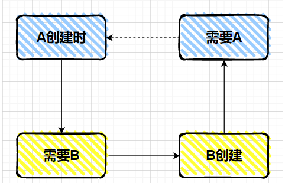
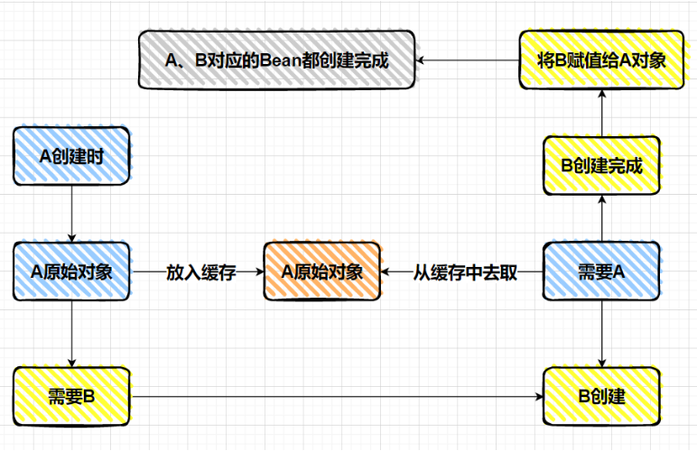
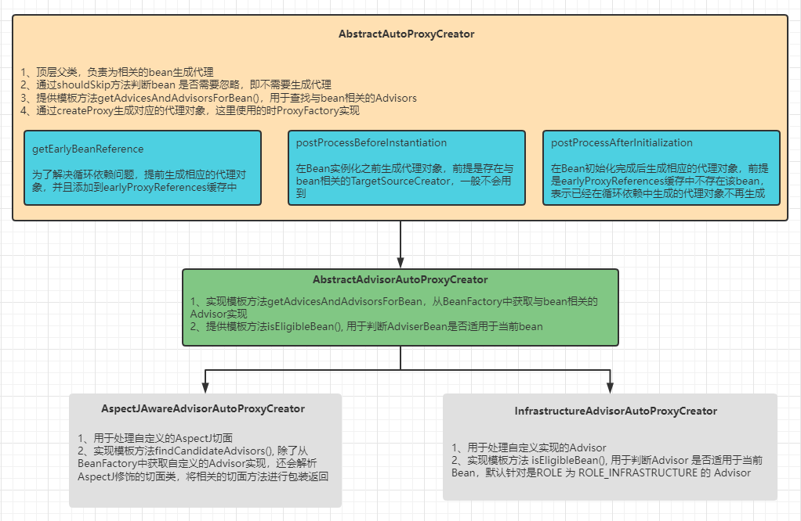
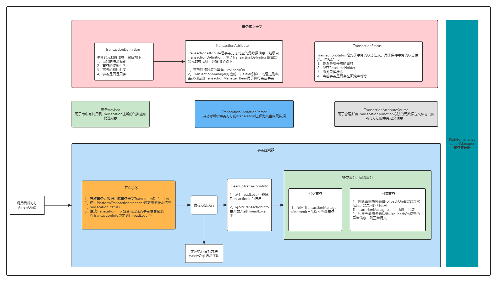
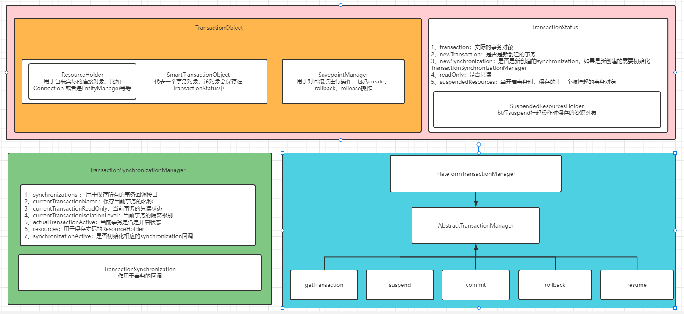
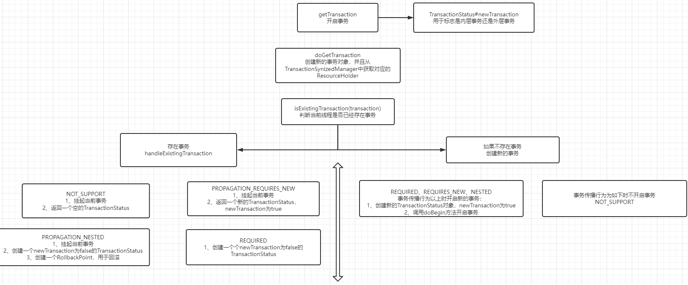
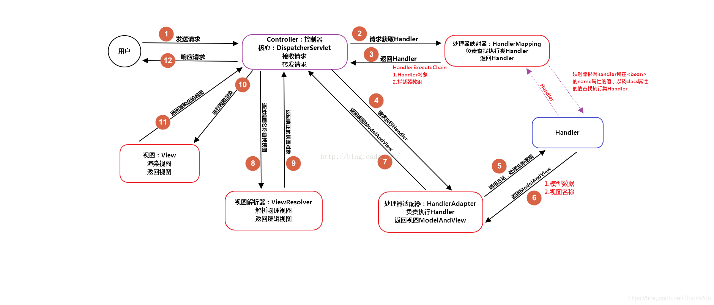
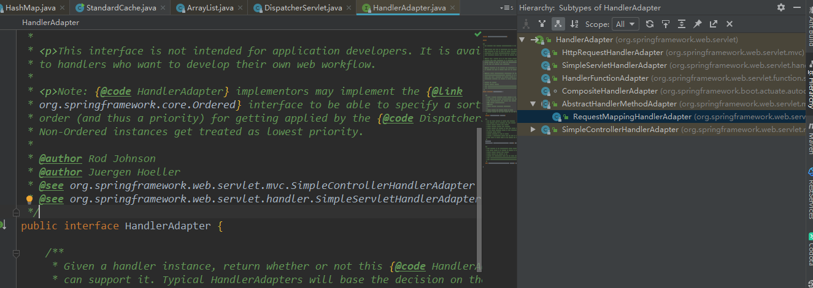

# Spring

## Spring 初始化流程 （待补充）

```
prepareRefresh();
			
			//创建BeanFactory
			// Tell the subclass to refresh the internal bean factory.
			ConfigurableListableBeanFactory beanFactory = obtainFreshBeanFactory();

			//预处理一些BeanFactory 的BeanPostProcessor 或者是 不需要依赖住的Class对象
			// Prepare the bean factory for use in this context.
			prepareBeanFactory(beanFactory);

			try {
				//扫描包下的Bean信息并且进行注册
				// Allows post-processing of the bean factory in context subclasses.
				postProcessBeanFactory(beanFactory);

				//执行BeanFactoryPostProcessor
				// Invoke factory processors registered as beans in the context.
				invokeBeanFactoryPostProcessors(beanFactory);

				//注册BeanPostProcessor
				// Register bean processors that intercept bean creation.
				registerBeanPostProcessors(beanFactory);

				// Initialize message source for this context.
				initMessageSource();

				//注册ApplicationEventMutilCaster
				// Initialize event multicaster for this context.
				initApplicationEventMulticaster();

				//执行onRefresh钩子方法
				// Initialize other special beans in specific context subclasses.
				onRefresh();
				
				
				//注册监听器
				// Check for listener beans and register them.
				registerListeners();


				//完成所有非lazy的单例bean实例化
				// Instantiate all remaining (non-lazy-init) singletons.
				finishBeanFactoryInitialization(beanFactory);

				// Last step: publish corresponding event.
				finishRefresh();
```

其中 finishBeanFactoryInitialization 内部通过循环遍历所有的Beandifinition 进行调用 doGetBean 进行bean的实例化，实例化bean主要有三个步骤

- instanceBean 实例化bean
- populateBean：为bean的属性进行赋值
- initializeBean 对Bean进行初始化
  - 1、先执行 @PostConstroct
  - 2、执行afterPropertySet
  - 3、执行 initMethod，即在申明bean时设置的init-method


## Spring 解决循环依赖

Spring 解决循环依赖是通过 三级缓存来实现的，所谓循环依赖就是相互引用，这样就会导致Spring在初始化Bean时陷入死循环，如下：



为了解决上述问题，Spring 引入了三级缓存，分别为如下：

- **singletonObjects：用于存放完全初始化好的bean，从该缓存中去除的bean可以直接使用**
- **earlySignletonObjects：表示缓存的是早期的 bean对象（尚未填充属性）。早期指的是 Bean 的生命周期还没走完就把这个 Bean 放入了 earlySingletonObjects**
- **singletonFactories：缓存的是 ObjectFactory，表示对象工厂，用来创建某个对象的。用于解决循环依赖时对象引用不一致问题，比如 A-> B ,B->A, 如果我们需要对A 生成代理对象，那么在Bean初始化时可能实在beforeAfterInitlization之后创建的代理对象，如果B持有的是A 的没有被代理的对象就会导致在BeanFactory中的对象与 B持有的A 对象不一致**

如下图，我们可以通过缓存的方式来解决循环依赖的问题，当A 创建时将A 的半成品对象进行缓存，然后对A 的属性进行赋值时，会关联创建B对象，这个时候从缓存中获取A 的半成品设置到B中，就可以避免循环依赖问题




A 的 Bean 在创建过程中，在进行依赖注入之前，先把 A 的原始 Bean 放入缓存（提早暴露，只要放到缓存了，其他 Bean 需要时就可以从缓存中拿了），放入缓存后，再进行依赖注入，此时 A 的Bean 依赖了 B 的 Bean 。

如果 B 的 Bean 不存在，则需要创建 B 的 Bean，而创建 B 的 Bean 的过程和 A 一样，也是先创建一个 B 的原始对象，然后把 B 的原始对象提早暴露出来放入缓存中，然后在对 B 的原始对象进行依赖注入 A，此时能从缓存中拿到 A 的原始对象（虽然是 A 的原始对象，还不是最终的 Bean），B 的原始对象依赖注入完了之后，B 的生命周期结束，那么 A 的生命周期也能结束。

因为整个过程中，都只有一个 A 原始对象，所以对于 B 而言，就算在属性注入时，注入的是 A 原始对象，也没有关系，因为A 原始对象在后续的生命周期中在堆中没有发生变化


### 为什么需要三级缓存

我们从上面可以看到明明二级缓存就已经解决了循环依赖问题，为什么还需要三级缓存呢？

如果 A 的原始对象注入给 B 的属性之后，A 的原始对象进行了 AOP 产生了一个代理对象，此时就会出现，对于 A 而言，它的 Bean 对象其实应该是 AOP 之后的代理对象，而 B 的 a 属性对应的并不是 AOP 之后的代理对象，这就产生了冲突。

**B 依赖的 A 和最终的 A 不是同一个对象。**

那么如何解决这个问题？ 这个问题可以说没有办法解决。因为在一个 Bean 的生命周期最后，Spring提供了 BeanPostProcessor 可以去对 Bean 进行加工，这个加工不仅仅只是能修改 Bean 的属性值，也可以替换掉当前 Bean 。

**在BeanPostProcessor 中可以完全替换掉某个 beanName 对应的 bean 对象。**

而 BeanPostProcessor 的执行在 Bean 的生命周期中是处于属性注入之后的，循环依赖是发生在属性注入过程中的，所以很有可能导致，注入给 B 对象的 A 对象和经历过完整生命周期之后的 A 对象，不是一个对象。这就是有问题的

基于上面的了解我们不难发现，Spring 使用三级缓存就是为了避免在PostProcessor时对半成品对象做修改而导致的依赖对象不一致的问题。也就是上面提到的 **B 依赖的 A 和最终的 A 不是同一个对象。**

.png)


## Bean的生命周期

Bean的生命周期主要分为四部分，分别为bean的实例化、bean的属性赋值、bean的初始化以及bean销毁四个周期


## Spring AOP 原理

### SpringAOP 核心概念

SpringAOP中有几个比较核心的点如下：

- `Advisor`: 提建议者
- `Pointcut`：切点，给哪一类人提建议
- `Advise`：建议，通知（建议的内容）

当然这里面还有几个隐藏的角色，AOP体系也有对应的定义：

- `TargetSource`: 目标对象
- `Joinpoint` ：连接点，当领导提到建议具体到某个方法上时，Joinpoint就是那个方法的信息封装体。在`Joinpoint`中我们可以获取到目标方法的相关信息
- `Advised`：当一个人被建议成功后，他就可以看做一个Advised

他们之间的关系：

- Advisor= Pointcut + Advise
- Advised = N * Advisor :一个人可能被多个 建议者建议。

.png)


### Spring AOP 创建过程

Spring AOP的创建过程主要有两个类负责完成，分别为 针对AspectJ 实现的AspectJAwareAdvisorAutoProxyCreator 以及针对自定义AOP实现的InfrastructureAdvisorAutoProxyCreator 两种，如下图：




从上图可以看到 Spring AOP 的处理实现分为三层，分别为顶层的AbstractAutoProxyCreator、用于查找Advisor的AsbtractAdvisorAutoProxyCreator，以及底层的针对不同的AOP场景的AspectJAwareAdvisorAutoProxyCreator（针对AspectJ实现）、InfrastructureAdvisorAutoProxyCreator（针对自定义Advisor实现）

#### AbstractAutoProxyCreator

AbstractAutoProxyCreator中提供了三个入口，分别为如下：

- 解决循环依赖时
- bean实例化之前
- bean初始化之后

在创建具体代理对象时通过 调用 wrapIfNecessary 方法创建对应的代理对象，流程如下：

```java
//判断bean是否已经创建过代理对象
if (StringUtils.hasLength(beanName) && this.targetSourcedBeans.contains(beanName)) {
   return bean;
}

//通过缓存adviceBeans判断该bean是否需要创建代理对象
if (Boolean.FALSE.equals(this.advisedBeans.get(cacheKey))) {
   return bean;
}

//判断当前bean是否需要被忽略，即不需要创建代理对象
if (isInfrastructureClass(bean.getClass()) || shouldSkip(bean.getClass(), beanName)) {
   this.advisedBeans.put(cacheKey, Boolean.FALSE);
   return bean;
}

// Create proxy if we have advice.
//获取与bean相关的Advisors对象，如果不存在则将该bean添加到advisedBeans缓存中，表示该bean不需要被代理
Object[] specificInterceptors = getAdvicesAndAdvisorsForBean(bean.getClass(), beanName, null);
if (specificInterceptors != DO_NOT_PROXY) {
   this.advisedBeans.put(cacheKey, Boolean.TRUE);
   Object proxy = createProxy(
         bean.getClass(), beanName, specificInterceptors, new SingletonTargetSource(bean));
   this.proxyTypes.put(cacheKey, proxy.getClass());
   return proxy;
}

this.advisedBeans.put(cacheKey, Boolean.FALSE);
return bean;
```


#### AsbtractAdvisorAutoProxyCreator

AsbtractAdvisorAutoProxyCreator 实现了模板方法getAdvicesAndAdvisorsForBean，用于查找与bean相关的Advisor实现，并且提供模板方法isEligibleBean 用于判断Advisor是否适用于该bean

```java
	@Override
	@Nullable
	protected Object[] getAdvicesAndAdvisorsForBean(
			Class<?> beanClass, String beanName, @Nullable TargetSource targetSource) {
		// 调用 findEligibleAdvisors 获取与bean相关的advisors对象
		List<Advisor> advisors = findEligibleAdvisors(beanClass, beanName);
		if (advisors.isEmpty()) {
			return DO_NOT_PROXY;
		}
		return advisors.toArray();
	}
```

```java
	protected List<Advisor> findEligibleAdvisors(Class<?> beanClass, String beanName) {
         //获取所有的advisors对象
		List<Advisor> candidateAdvisors = findCandidateAdvisors();
         //通过pointcut的匹配条件判断Advisor是否适用于当前bean，通过AOPUtils.canApply实现
		List<Advisor> eligibleAdvisors = findAdvisorsThatCanApply(candidateAdvisors, beanClass, beanName);
         // 对eligibleAdvisors做一些扩展操作（可忽略）
		extendAdvisors(eligibleAdvisors);
		if (!eligibleAdvisors.isEmpty()) {
             //将与bean相关的eligibleAdvisors进行排序
			eligibleAdvisors = sortAdvisors(eligibleAdvisors);
		}
		return eligibleAdvisors;
	}
```

```java
public List<Advisor> findAdvisorBeans() {
		// Determine list of advisor bean names, if not cached already.
		String[] advisorNames = this.cachedAdvisorBeanNames;
		if (advisorNames == null) {
			// Do not initialize FactoryBeans here: We need to leave all regular beans
			// uninitialized to let the auto-proxy creator apply to them!
            //从beanFactory中获取所有的Advisor对象
			advisorNames = BeanFactoryUtils.beanNamesForTypeIncludingAncestors(
					this.beanFactory, Advisor.class, true, false);
			this.cachedAdvisorBeanNames = advisorNames;
		}
		if (advisorNames.length == 0) {
			return new ArrayList<>();
		}

		List<Advisor> advisors = new ArrayList<>();
		for (String name : advisorNames) {
             //调用isEligibleBean模板方法判断当前Advisor是否适用于当前Bean
			if (isEligibleBean(name)) {
                 //如果Advisor Bean正在创建，则忽略
				if (this.beanFactory.isCurrentlyInCreation(name)) {
					if (logger.isTraceEnabled()) {
						logger.trace("Skipping currently created advisor '" + name + "'");
					}
				}
				else {
					try {
                          //将AdvisorBean 添加到返回列表中
						advisors.add(this.beanFactory.getBean(name, Advisor.class));
					}
					catch (BeanCreationException ex) {
						Throwable rootCause = ex.getMostSpecificCause();
						if (rootCause instanceof BeanCurrentlyInCreationException) {
							BeanCreationException bce = (BeanCreationException) rootCause;
							String bceBeanName = bce.getBeanName();
							if (bceBeanName != null && this.beanFactory.isCurrentlyInCreation(bceBeanName)) {
								if (logger.isTraceEnabled()) {
									logger.trace("Skipping advisor '" + name +
											"' with dependency on currently created bean: " + ex.getMessage());
								}
								// Ignore: indicates a reference back to the bean we're trying to advise.
								// We want to find advisors other than the currently created bean itself.
								continue;
							}
						}
						throw ex;
					}
				}
			}
		}
		return advisors;
	}
```


### Spring AOP Proxy

Spring 生成的代理对象分为两种，分别为JdkDyamicProxy 以及 CglibAopProxy两种，通过ProxyFactory 内置的 AopProxyFactory 生成，默认实现为DefaultAopProxyFactory，并且通过AdvisorChainFactory 来生成对应的Interceptor责任链，即在执行方法时对应的拦截链

```java
	@Override
	public AopProxy createAopProxy(AdvisedSupport config) throws AopConfigException {
         //判断是否时基于targetClass生成代理，入股哦是基于targetClass生成代理，则使用cglib，否则使用jdk生成
		if (config.isOptimize() || config.isProxyTargetClass() || hasNoUserSuppliedProxyInterfaces(config)) {
			Class<?> targetClass = config.getTargetClass();
			if (targetClass == null) {
				throw new AopConfigException("TargetSource cannot determine target class: " +
						"Either an interface or a target is required for proxy creation.");
			}
             //如果targetClas是接口或者本身就是代理类的话，则使用JDK的代理生成
			if (targetClass.isInterface() || Proxy.isProxyClass(targetClass)) {
				return new JdkDynamicAopProxy(config);
			}
			return new ObjenesisCglibAopProxy(config);
		}
		else {
			return new JdkDynamicAopProxy(config);
		}
	}
```


## Spring Transaction 原理

```java
/**
 * 编程式事务对象工厂
 *
 * <pre>
 *
 *     事务定义信息
 *     TransactionDefinition definition = new  DefaultTransactionDefinition();
 *
 *     事务状态信息
 *     TransactionStatus status = transactionManager.getTransaction(definition);
 *
 *     try{
 *
 *        do something
 *     }catch(Exception e){
 *
 *         if(!status.isCompleted()){
 *             e.setRollbackOnly(true);
 *             e.rollback(status);
 *         }
 *
 *     }
 *
 * </pre>
 *
 * @see PlatformTransactionManager 事务管理器
 * @see org.springframework.transaction.TransactionStatus 事务状态信息
 * @see org.springframework.transaction.support.DefaultTransactionStatus  事务状态信息-默认实现（包装器）
 * @see TransactionTemplate 编程式事务对象，封装了包括回滚 提交等行为
 * @see TransactionDefinition 事务信息(传播行为、隔离机制、超时等等)
 * @see org.springframework.transaction.support.DefaultTransactionDefinition 事务信息的默认实现
 * @see org.springframework.transaction.support.TransactionSynchronizationManager 事务与线程关联挂载器
 *
 */
```

依赖于TransactionSynchorizedManager 实现

注解依赖于Aop 进行实现


## Spring 事务

Spring 事务由两个核心模块组成，分别为事务拦截器 与 事务管理器 两部分组成

### 事务核心定义

Spring 事务基础概念包括三部分

- 事务的定义：TransacationDefinition
- 方法事务的元数据信息：TransacationAttribute
- 事务的状态：TransanctionStatus ,当事务开启后会返回当前事务的状态信息，在提交和回滚事务时都需要用到事务的状态信息

#### TransacationDefinition

TransacationDefinition定义了事务的基本组成，包括事务的传播行为、隔离级别、超时时间、事务名称等等，当我们需要开启一个事务时需要通过传入事务的定义来进行开启：

```
TransactionDefinition definition = new DefaultTransactionalDefinition();
// 设置事务的属性

//开启事务
TransactionStatus status = transactionManager.getTrasaction(definition);
```


#### TransacationAttribute

TransacationAttribute 是方法事务元数据信息，继承自TransacationDefinition，除了包含事务的基本属性定义还扩展了 如下：

- rollbackOn (Exception e)：表示当前事务在失败抛出异常时时，是否可以进行回滚
- getQualifier(): 用于获取当前事务指定的transactionManager，既transactionManager的别名


#### TransanctionStatus 

 TransanctionStatus 代表了当前事务的状态，当我们开启事务后，会生成一个对应的事务状态对象既TransanctionStatus，其中包括了：

- isNewTransaction： 是否是新生成的事务，因为事务是可以存在嵌套或者是重复使用的

- hasSavepoint：是否有保存的回滚点

- setRollbackOnly：将当前事务设置为只读

- isRollbackOnly ：事务是否是只读的

- flush：将事务进行flush操作

- isCompleted： 事务是否已经完成

  


### 事务传播行为

事务的传播行为主要分为四种，分别是REQUIRED、REQUIRES_NEW 、NESTED 、NOT_SUPPORTED

- Propagation.REQUIRED（required）：支持当前事务，如果当前有事务， 那么加入事务， 如果当前没有事务则新建一个(默认情况)
- Propagation.NOT_SUPPORTED（not_supported) ： 以非事务方式执行操作，如果当前存在事务就把当前事务挂起，执行完后恢复事务（忽略当前事务）；
- Propagation.SUPPORTS (supports) ：如果当前有事务则加入，如果没有则不用事务。
- Propagation.MANDATORY (mandatory) ：支持当前事务，如果当前没有事务，则抛出异常。（当前必须有事务）
- PROPAGATION_NEVER (never) ：以非事务方式执行，如果当前存在事务，则抛出异常。（当前必须不能有事务）
- Propagation.REQUIRES_NEW (requires_new) ：支持当前事务，如果当前有事务，则挂起当前事务，然后新创建一个事务，如果当前没有事务，则自己创建一个事务。
- Propagation.NESTED (nested 嵌套事务) ：如果当前存在事务，则嵌套在当前事务中。如果当前没有事务，则新建一个事务自己执行（和required一样）。嵌套的事务使用保存点作为回滚点，当内部事务回滚时不会影响外部事物的提交；但是外部回滚会把内部事务一起回滚回去。（这个和新建一个事务的区别）


### 事务拦截器

Spring的事务拦截器是基于Spring AOP实现的，我们知道SpringAOP的实现方式分为两种一种是基于自定义的Advisor，一种是基于Aspect，而 事务拦截器就是基于自定义Advisor实现的，整个流程如下：



Spring 对于事务拦截器的处理分为了两块，分别为启动时和运行时两部分：

**启动时**

- 1、在Spring启动时 会扫描所有带有Transacation的Method 方法，如果存在对应的注解则会为对应的类生成代理类
- 2、通过AnnottaionParser 对注解进行解析，通过解析出来的信息生成事务元数据信息（TransactionAttribute）
- 3、将生成的TransactionAttribute元数据信息添加到元数据管理器中 （TransacationAttributeSource）

**运行时**

- 1、通过Method 获取数据的元数据信息
- 2、通过transactionManager 开启事务，并且生成相应的TransactionInfo
- 3、执行具体的目标方法
- 4、根据事务执行的结果 提交或者回滚事务


### 事务管理器

Spring的事务管理器是基于PlatformTransactionManager进行实现的，主要依赖于四部分，分别为PlatformTransactionManager的实现、TransactionSynchroizationManager以及 TransactionObject、ResourceHolder四部分，如下图：




#### TransactionObject

TransactionObject 代表是一个事务对象，不同的TransactionManager有不同的TransactionObject 实现， 当每次需要开启事务时，都需要创建对应的事务对象，再根据事务的传播行为判断是否需要创建新的ResourceHolder对象，例如针对jdbc的JdbcTransactionObjectSupport对象，以及针对Redission的RedissionTransactionObjectSupport对象，这里以DataSourceTransactionObject为例：

```java
private static class DataSourceTransactionObject extends JdbcTransactionObjectSupport {
		
		//是否是新创建的ConnectionHolder，这里主要是为了避免事务在传播时外层事务对内层事务的资源操作，举个例子：
		//比如现在有一个事务对象为事务传播A, 这个时候调用其他方法时通过REQUIRE传播又创建了一个新的事务对象为事务传播B，那么在事务传播B 进行提交回滚时是		   //不需要对实际的事务进行任何操作的，只有最内层事务才可以对Resource资源进行提交或者回滚操作
		private boolean newConnectionHolder;

		private boolean mustRestoreAutoCommit;

		public void setConnectionHolder(@Nullable ConnectionHolder connectionHolder, boolean newConnectionHolder) {
			//设置对应的ResourceHolder对象,既实际的资源对象
			super.setConnectionHolder(connectionHolder);
			this.newConnectionHolder = newConnectionHolder;
		}

		public boolean isNewConnectionHolder() {
			return this.newConnectionHolder;
		}

		public void setMustRestoreAutoCommit(boolean mustRestoreAutoCommit) {
			this.mustRestoreAutoCommit = mustRestoreAutoCommit;
		}

		public boolean isMustRestoreAutoCommit() {
			return this.mustRestoreAutoCommit;
		}

		//将事务设置为只读状态
		public void setRollbackOnly() {
			getConnectionHolder().setRollbackOnly();
		}

		@Override
		public boolean isRollbackOnly() {
			return getConnectionHolder().isRollbackOnly();
		}

		@Override
		public void flush() {
			if (TransactionSynchronizationManager.isSynchronizationActive()) {
				TransactionSynchronizationUtils.triggerFlush();
			}
		}
	}
```


#### TransactionStatus

TransactionStatus 既事务的状态，每当需要开启一个事务时就会创建一个对应的TransactionStatus对象，用于代表当前事务的状态，一般会分为三种情况：

- **不存在事务时创建新的事务**

  这个时候会将事务的 newTransaction 设置为true表示新创建的事务，newSynchronization 设置为true 表示需要初始化Synchronization相关的设置

- **存在事务时使用当前的事务：**

  这个时候会将事务的 newTransaction 设置为false表示使用的是旧的事务，newSynchronization 设置为true 表示需要初始化Synchronization相关的设置

- **存在事务时使用新的事务：**

  这个时候会将事务的 newTransaction 设置为true表示新创建的事务，newSynchronization 设置为true 表示需要初始化Synchronization相关的设置，并且还会将当前的事务相关的数据保存到SuspendedResourcesHolder中，放入到新创建的TransactionStatus中

在每次创建事务时都会创建对应的TransactionObject对象，然后将TransactionObject对象放入到TransactionStatus中，用于事务的回滚以及提交，在TransactionStatus还有一个比较重要的是SuspendedResourcesHolder对象，主要是为了解决当开启新的事务时需要挂起当前事务，那么就需要对当前事务进行保存，以保证在行的事务执行完后进行恢复

```java
public class DefaultTransactionStatus extends AbstractTransactionStatus {

   //TransactionObject对象
   @Nullable
   private final Object transaction;

   //是否是新开启的事务，用于标志是内层事务还是外层事务
   //比如现在有一个事务对象为事务传播A, 这个时候调用其他方法时通过REQUIRE传播又创建了一个新的事务对象为事务传播B，那么在事务传播B 进行提交回滚时是		    //不需要对实际的事务进行任何操作的，只有最内层事务才可以对Resource资源进行提交或者回滚操作
   private final boolean newTransaction;

   //是否是新创建的事务 synchronization，大多时候都是为True的，只有在事务传播行为是NESTED时并且可以使用回滚点的情况下为false
   private final boolean newSynchronization;

   //事务是否是只读的
   private final boolean readOnly;
  
 
   private final boolean debug;

   //当创建新的事务时需要挂起的前一个事务对象，这里用SuspendedResourcesHolder进行包装
   @Nullable
   private final Object suspendedResources;

	
   //获取TransactionObject对象
   public Object getTransaction() {
      Assert.state(this.transaction != null, "No transaction active");
      return this.transaction;
   }

   //判断是否存在事务对象，只有在事务传播行为=NOT_SUPPORT时为fallse，既不会创建对应的TransactionObject对象
   public boolean hasTransaction() {
      return (this.transaction != null);
   }

   //是否是新创建的事务
   @Override
   public boolean isNewTransaction() {
      return (hasTransaction() && this.newTransaction);
   }

   //是否是新创建的事务 synchronization
   public boolean isNewSynchronization() {
      return this.newSynchronization;
   }


   //---------------------------------------------------------------------
   // Enable functionality through underlying transaction object
   //---------------------------------------------------------------------

   /**
    * Determine the rollback-only flag via checking the transaction object, provided
    * that the latter implements the {@link SmartTransactionObject} interface.
    * <p>Will return {@code true} if the global transaction itself has been marked
    * rollback-only by the transaction coordinator, for example in case of a timeout.
    * @see SmartTransactionObject#isRollbackOnly()
    */
   //事务是否是全局只读的
   @Override
   public boolean isGlobalRollbackOnly() {
      return ((this.transaction instanceof SmartTransactionObject) &&
            ((SmartTransactionObject) this.transaction).isRollbackOnly());
   }
```


#### TransactionSynchronizationManager

TransactionSynchronizationManager 事务同步管理器，也是整个Spring 事务实现的核心，主要用于为每个线程保存事务的信息，底层通过ThreadLocal实现，当我们需要开启事务时会通过TransactionSynchronizationManager 来绑定与线程对应的ResourceHolder对象，包括当事务执行前、执行后的一些callback回调，主要作用如下：

- 保存线程对应的ResourceHolder对象 ，既为每个线程绑定Connection 连接，就可以保证在多线程的情况下互不影响
- 保存每个事务对应的 TransactionSynchronization回调，在事务的整个生命周期中会通过TransactionSynchronizationManager 来触发相应的回调
- 标志当前线程是否开启事务
- 保存事务状态以及元数据，比如是否只读、事务的隔离级别以及事务的名称

TransactionSynchronizationManager是整个Spring 事务实现的核心，内部通过变换ThreadLocal维护的ConnectionHollder对象来实现不同的事务传播行为

```java
public abstract class TransactionSynchronizationManager {

	private static final Log logger = LogFactory.getLog(TransactionSynchronizationManager.class);

	//主要用于保存在整个事务的声明周期中的一些资源对象，比如Connection、SqlSession
	private static final ThreadLocal<Map<Object, Object>> resources =
			new NamedThreadLocal<>("Transactional resources");

  	//事务的回调实现，在事务的整个声明周期中会通过当前实例会获取对应的回调实现
	private static final ThreadLocal<Set<TransactionSynchronization>> synchronizations =
			new NamedThreadLocal<>("Transaction synchronizations");

	//事务的名称
	private static final ThreadLocal<String> currentTransactionName =
			new NamedThreadLocal<>("Current transaction name");

	//事务的只读状态
	private static final ThreadLocal<Boolean> currentTransactionReadOnly =
			new NamedThreadLocal<>("Current transaction read-only status");

	//是否的隔离级别
	private static final ThreadLocal<Integer> currentTransactionIsolationLevel =
			new NamedThreadLocal<>("Current transaction isolation level");

	//保存当前事务开启的状态，当开启一个事务时会将actualTransactionActive设置为true
	private static final ThreadLocal<Boolean> actualTransactionActive =
			new NamedThreadLocal<>("Actual transaction active");

	//判断当前Transaction Synchronization 是否开启
	public static boolean isSynchronizationActive() {
		return (synchronizations.get() != null);
	}


	public static boolean isCurrentTransactionReadOnly() {
		return (currentTransactionReadOnly.get() != null);
	}

	public static void setCurrentTransactionIsolationLevel(@Nullable Integer isolationLevel) {
		currentTransactionIsolationLevel.set(isolationLevel);
	}
	
	public static Integer getCurrentTransactionIsolationLevel() {
		return currentTransactionIsolationLevel.get();
	}

	//判断当前是否是开启状态
	public static boolean isActualTransactionActive() {
		return (actualTransactionActive.get() != null);
	}

	//获取所有的回调接口实现
	public static List<TransactionSynchronization> getSynchronizations() throws IllegalStateException {
		Set<TransactionSynchronization> synchs = synchronizations.get();
		if (synchs == null) {
			throw new IllegalStateException("Transaction synchronization is not active");
		}
		// Return unmodifiable snapshot, to avoid ConcurrentModificationExceptions
		// while iterating and invoking synchronization callbacks that in turn
		// might register further synchronizations.
		if (synchs.isEmpty()) {
			return Collections.emptyList();
		}
		else {
			// Sort lazily here, not in registerSynchronization.
			List<TransactionSynchronization> sortedSynchs = new ArrayList<>(synchs);
			AnnotationAwareOrderComparator.sort(sortedSynchs);
			return Collections.unmodifiableList(sortedSynchs);
		}
	}
	
	//初始化 Transaction Synchronization
	public static void initSynchronization() throws IllegalStateException {
		if (isSynchronizationActive()) {
			throw new IllegalStateException("Cannot activate transaction synchronization - already active");
		}
		logger.trace("Initializing transaction synchronization");
		synchronizations.set(new LinkedHashSet<>());
	}


}
```


#### PlatformTransactionManager 

PlatFormTransactionManager 事务管理器主要用于管理事务的行为, 见下面章节


### PlatformTransactionManager 

PlatFormTransactionManager 事务管理器主要用于管理事务的行为，包括开启事务、提交事务、回滚事务等等，接口定义如下：

```java
public interface PlatformTransactionManager {

   //通过事务定义开启事务
   TransactionStatus getTransaction(@Nullable TransactionDefinition definition) throws TransactionException;

   //通过事务状态提交当前事务
   void commit(TransactionStatus status) throws TransactionException;

   //回滚事务
   void rollback(TransactionStatus status) throws TransactionException;

}
```

PlatformTransactionManager 的大部分业务实现都是在AbstractTransactionManager中来实现的，流程实现如下：



下面以DataSourceTransactionManager为例来梳理整个流程的实现：

#### getTransaction 开启事务

**getTransaction**

getTransaction 主要是用来开启事务，并且创建对应的TransactionStatus，针对不同的传播行为有不同的实现，如下：

```java
	@Override
	public final TransactionStatus getTransaction(@Nullable TransactionDefinition definition) throws TransactionException {
		
		//通过模板方法创建TransactionObject对象
		Object transaction = doGetTransaction();
		
		// Cache debug flag to avoid repeated checks.
		boolean debugEnabled = logger.isDebugEnabled();

		if (definition == null) {
			// Use defaults if no transaction definition given.
			definition = new DefaultTransactionDefinition();
		}
		
		//当线程存在事务时
		if (isExistingTransaction(transaction)) {
			// Existing transaction found -> check propagation behavior to find out how to behave.
			return handleExistingTransaction(definition, transaction, debugEnabled);
		}
		
		
		//当线程不存在事务时
		
	}
```

<br/>

**doGetTransaction**

创建TransactionObject对象，并且设置 ResourceHolder

```java
@Override
protected Object doGetTransaction() {
   //创建新的TransactionObject对象
   DataSourceTransactionObject txObject = new DataSourceTransactionObject();
   txObject.setSavepointAllowed(isNestedTransactionAllowed());
   //从当前线程中获取对应的Connection
   ConnectionHolder conHolder =
         (ConnectionHolder) TransactionSynchronizationManager.getResource(obtainDataSource());
         
   //将现有的Connection设置到txObject中，并且将isNewConnection设置为false，表示connection不是新开启的
   txObject.setConnectionHolder(conHolder, false);
   return txObject;
}
```


<br/>

##### **线程不存在事务**

线程中不存在事务时，根据不同的传播行为进行不同的操作，如下：

```java
		// Check definition settings for new transaction.
		if (definition.getTimeout() < TransactionDefinition.TIMEOUT_DEFAULT) {
			throw new InvalidTimeoutException("Invalid transaction timeout", definition.getTimeout());
		}

		// No existing transaction found -> check propagation behavior to find out how to proceed.
		if (definition.getPropagationBehavior() == TransactionDefinition.PROPAGATION_MANDATORY) {
			throw new IllegalTransactionStateException(
					"No existing transaction found for transaction marked with propagation 'mandatory'");
		}
		
		//当事务传播为 REQUIRED、REQUIRES_NEW、NESTED时开启新的事务
		else if (definition.getPropagationBehavior() == TransactionDefinition.PROPAGATION_REQUIRED ||
				definition.getPropagationBehavior() == TransactionDefinition.PROPAGATION_REQUIRES_NEW ||
				definition.getPropagationBehavior() == TransactionDefinition.PROPAGATION_NESTED) {
			
			//挂起当前的事务，这里返回null	
			SuspendedResourcesHolder suspendedResources = suspend(null);
			if (debugEnabled) {
				logger.debug("Creating new transaction with name [" + definition.getName() + "]: " + definition);
			}
			try {
				//是否需要初始化Transaction Synchronization，默认为true
				boolean newSynchronization = (getTransactionSynchronization() != SYNCHRONIZATION_NEVER);
				
				//创建新的TransactionStatus
				DefaultTransactionStatus status = newTransactionStatus(
						definition, transaction, true, newSynchronization, debugEnabled, suspendedResources);
						
				//通过调用doBegin模板方法开启事务
				doBegin(transaction, definition);
				
				//初始化Transaction Synchronization
				prepareSynchronization(status, definition);
				return status;
			}
			catch (RuntimeException | Error ex) {
				resume(null, suspendedResources);
				throw ex;
			}
		}
		//当事务传播为NOT_SUPPORT 时，返回一个空的TransactionStatus
		else {
			// Create "empty" transaction: no actual transaction, but potentially synchronization.
			if (definition.getIsolationLevel() != TransactionDefinition.ISOLATION_DEFAULT && logger.isWarnEnabled()) {
				logger.warn("Custom isolation level specified but no actual transaction initiated; " +
						"isolation level will effectively be ignored: " + definition);
			}
			
			boolean newSynchronization = (getTransactionSynchronization() == SYNCHRONIZATION_ALWAYS);
			//创建一个空的TransactionStatus，设置newSynchronization = true，并且对Transaction Synchronization 进行初始化
			return prepareTransactionStatus(definition, null, true, newSynchronization, debugEnabled, null);
		}
```


<br/>

**doBegin**

```java
@Override
	protected void doBegin(Object transaction, TransactionDefinition definition) {
		DataSourceTransactionObject txObject = (DataSourceTransactionObject) transaction;
		Connection con = null;

		try {
		    // 如果当前TransactionObject中不存在Connection对象，则创建一个新的Connection
			if (!txObject.hasConnectionHolder() ||
					txObject.getConnectionHolder().isSynchronizedWithTransaction()) {
				Connection newCon = obtainDataSource().getConnection();
				if (logger.isDebugEnabled()) {
					logger.debug("Acquired Connection [" + newCon + "] for JDBC transaction");
				}
				txObject.setConnectionHolder(new ConnectionHolder(newCon), true);
			}

			//设置同状态，既ResourceHolder是否与事务同步对应
			txObject.getConnectionHolder().setSynchronizedWithTransaction(true);
			con = txObject.getConnectionHolder().getConnection();

			Integer previousIsolationLevel = DataSourceUtils.prepareConnectionForTransaction(con, definition);
			txObject.setPreviousIsolationLevel(previousIsolationLevel);

			// Switch to manual commit if necessary. This is very expensive in some JDBC drivers,
			// so we don't want to do it unnecessarily (for example if we've explicitly
			// configured the connection pool to set it already).
			if (con.getAutoCommit()) {
				txObject.setMustRestoreAutoCommit(true);
				if (logger.isDebugEnabled()) {
					logger.debug("Switching JDBC Connection [" + con + "] to manual commit");
				}
				con.setAutoCommit(false);
			}

			prepareTransactionalConnection(con, definition);
			
			//将事务状态设置为开启状态
			txObject.getConnectionHolder().setTransactionActive(true);
			
			//设置超时时间
			int timeout = determineTimeout(definition);
			if (timeout != TransactionDefinition.TIMEOUT_DEFAULT) {
				txObject.getConnectionHolder().setTimeoutInSeconds(timeout);
			}
			
			//如果是新开启的事务，则通过TransactionSynchronizationManager将Connection绑定到当前线程
			// Bind the connection holder to the thread.
			if (txObject.isNewConnectionHolder()) {
				TransactionSynchronizationManager.bindResource(obtainDataSource(), txObject.getConnectionHolder());
			}
		}

		catch (Throwable ex) {
			if (txObject.isNewConnectionHolder()) {
				DataSourceUtils.releaseConnection(con, obtainDataSource());
				txObject.setConnectionHolder(null, false);
			}
			throw new CannotCreateTransactionException("Could not open JDBC Connection for transaction", ex);
		}
	}
```


<br/>

##### **线程存在事务**

线程中存在事务时，根据不同的传播行为进行不同的操作，如下：

**handleExistingTransaction**

```java
private TransactionStatus handleExistingTransaction(
			TransactionDefinition definition, Object transaction, boolean debugEnabled)
			throws TransactionException {

		if (definition.getPropagationBehavior() == TransactionDefinition.PROPAGATION_NEVER) {
			throw new IllegalTransactionStateException(
					"Existing transaction found for transaction marked with propagation 'never'");
		}
		
		//传播行为 = PROPAGATION_NOT_SUPPORTED
		if (definition.getPropagationBehavior() == TransactionDefinition.PROPAGATION_NOT_SUPPORTED) {
			if (debugEnabled) {
				logger.debug("Suspending current transaction");
			}
			//挂起当前事务
			Object suspendedResources = suspend(transaction);
			boolean newSynchronization = (getTransactionSynchronization() == SYNCHRONIZATION_ALWAYS);
			
			//创建新的TransactionStatus，并且将isNewtransaction设置为false，标示其在commit 与 rollback时不需要对Connection进行任何操作
			//并且将挂起的Resource资源放入到新的TransactionStatus中
			return prepareTransactionStatus(
					definition, null, false, newSynchronization, debugEnabled, suspendedResources);
		}

		//传播行为 = PROPAGATION_REQUIRES_NEW
		if (definition.getPropagationBehavior() == TransactionDefinition.PROPAGATION_REQUIRES_NEW) {
			if (debugEnabled) {
				logger.debug("Suspending current transaction, creating new transaction with name [" +
						definition.getName() + "]");
			}
			//挂起当前事务
			SuspendedResourcesHolder suspendedResources = suspend(transaction);
			try {
				boolean newSynchronization = (getTransactionSynchronization() != SYNCHRONIZATION_NEVER);
				//创建新的TransactionStatus，并且将isNewTransaction设置为true，表示其在rollback与commit时需要对Connection进行操作
				DefaultTransactionStatus status = newTransactionStatus(
						definition, transaction, true, newSynchronization, debugEnabled, suspendedResources);
				//开启事务
				doBegin(transaction, definition);
				
				//对 Trasaction Synchronization进行初始化
				prepareSynchronization(status, definition);
				return status;
			}
			catch (RuntimeException | Error beginEx) {
				resumeAfterBeginException(transaction, suspendedResources, beginEx);
				throw beginEx;
			}
		}
		
		//传播行为 = PROPAGATION_NESTED
		if (definition.getPropagationBehavior() == TransactionDefinition.PROPAGATION_NESTED) {
			if (!isNestedTransactionAllowed()) {
				throw new NestedTransactionNotSupportedException(
						"Transaction manager does not allow nested transactions by default - " +
						"specify 'nestedTransactionAllowed' property with value 'true'");
			}
			if (debugEnabled) {
				logger.debug("Creating nested transaction with name [" + definition.getName() + "]");
			}
			//判断是否可以使用SavePoint回滚点
			if (useSavepointForNestedTransaction()) {
				// Create savepoint within existing Spring-managed transaction,
				// through the SavepointManager API implemented by TransactionStatus.
				// Usually uses JDBC 3.0 savepoints. Never activates Spring synchronization.
				//创建新的TransactionStatus，将isNewTransaction设置为false，标识commit、rollback时不需要对Connection进行操作
				DefaultTransactionStatus status =
						prepareTransactionStatus(definition, transaction, false, false, debugEnabled, null);
						
				//创建SavePoint并且将其设置到TransactionStatus中，用于回滚操作
				status.createAndHoldSavepoint();
				return status;
			}
			else {
				// Nested transaction through nested begin and commit/rollback calls.
				// Usually only for JTA: Spring synchronization might get activated here
				// in case of a pre-existing JTA transaction.
				boolean newSynchronization = (getTransactionSynchronization() != SYNCHRONIZATION_NEVER);
				DefaultTransactionStatus status = newTransactionStatus(
						definition, transaction, true, newSynchronization, debugEnabled, null);
				doBegin(transaction, definition);
				prepareSynchronization(status, definition);
				return status;
			}
		}

		// Assumably PROPAGATION_SUPPORTS or PROPAGATION_REQUIRED.
		if (debugEnabled) {
			logger.debug("Participating in existing transaction");
		}
		if (isValidateExistingTransaction()) {
			if (definition.getIsolationLevel() != TransactionDefinition.ISOLATION_DEFAULT) {
				Integer currentIsolationLevel = TransactionSynchronizationManager.getCurrentTransactionIsolationLevel();
				if (currentIsolationLevel == null || currentIsolationLevel != definition.getIsolationLevel()) {
					Constants isoConstants = DefaultTransactionDefinition.constants;
					throw new IllegalTransactionStateException("Participating transaction with definition [" +
							definition + "] specifies isolation level which is incompatible with existing transaction: " +
							(currentIsolationLevel != null ?
									isoConstants.toCode(currentIsolationLevel, DefaultTransactionDefinition.PREFIX_ISOLATION) :
									"(unknown)"));
				}
			}
			if (!definition.isReadOnly()) {
				if (TransactionSynchronizationManager.isCurrentTransactionReadOnly()) {
					throw new IllegalTransactionStateException("Participating transaction with definition [" +
							definition + "] is not marked as read-only but existing transaction is");
				}
			}
		}
		//传播行为 = PROPAGATION_REQUIRED
		boolean newSynchronization = (getTransactionSynchronization() != SYNCHRONIZATION_NEVER);
		//创建新的TransactionStatus，将isNewTransaction设置为false，标识commit、rollback时不需要对Connection进行操作
		return prepareTransactionStatus(definition, transaction, false, newSynchronization, debugEnabled, null);
	}
```

<br/>


#### commit 提交事务

在commit提交事务时需要注意的一个点是，如果在外层事务执行失败时，会将ConnectionHolder的rollback-only 设置为true，既表示当前Connection 已经无法作用于commit操作，而只能进行回滚。

```java
@Override
public final void commit(TransactionStatus status) throws TransactionException {
		if (status.isCompleted()) {
			throw new IllegalTransactionStateException(
					"Transaction is already completed - do not call commit or rollback more than once per transaction");
		}

		DefaultTransactionStatus defStatus = (DefaultTransactionStatus) status;
		//判断事务是否是 local rollback-only，如果是则进行回滚操作, 一般不会成立，可忽略
		if (defStatus.isLocalRollbackOnly()) {
			if (defStatus.isDebug()) {
				logger.debug("Transactional code has requested rollback");
			}
			processRollback(defStatus, false);
			return;
		}
		
		// shouldCommitOnGlobalRollbackOnly：当事务出现GlobalRollbackOnly时是否还可以进行提交，默认为false
		// isGlobalRollbackOnly: 外层事务执行出错时会将Connection 设置为 rollback-only
		//判断事务是否需要全局回滚，在复用内层事务时，可能由于外层事务执行出错，会将ConnectionHolder的rollback-only设置为true，
		//导致内层事务在commit时无法commit而需要回滚
		if (!shouldCommitOnGlobalRollbackOnly() && defStatus.isGlobalRollbackOnly()) {
			if (defStatus.isDebug()) {
				logger.debug("Global transaction is marked as rollback-only but transactional code requested commit");
			}
			processRollback(defStatus, true);
			return;
		}

		processCommit(defStatus);
	}
```

<br/>

**processCommit**

```java
private void processCommit(DefaultTransactionStatus status) throws TransactionException {
		try {
			boolean beforeCompletionInvoked = false;

			try {
				boolean unexpectedRollback = false;
				prepareForCommit(status);
				triggerBeforeCommit(status);
				triggerBeforeCompletion(status);
				beforeCompletionInvoked = true;
				
				//判断TransactionStatus 是否有回滚点，如果有则进行释放，主要是针对NESTED传播行为
				if (status.hasSavepoint()) {
					if (status.isDebug()) {
						logger.debug("Releasing transaction savepoint");
					}
					unexpectedRollback = status.isGlobalRollbackOnly();
					status.releaseHeldSavepoint();
				}
				
				//判断是否是新创建的事务，既最内层事务，如果是则执行commit
				else if (status.isNewTransaction()) {
					if (status.isDebug()) {
						logger.debug("Initiating transaction commit");
					}
					unexpectedRollback = status.isGlobalRollbackOnly();
					doCommit(status);
				}
				else if (isFailEarlyOnGlobalRollbackOnly()) {
					unexpectedRollback = status.isGlobalRollbackOnly();
				}

				// Throw UnexpectedRollbackException if we have a global rollback-only
				// marker but still didn't get a corresponding exception from commit.
				if (unexpectedRollback) {
					throw new UnexpectedRollbackException(
							"Transaction silently rolled back because it has been marked as rollback-only");
				}
			}
			catch (UnexpectedRollbackException ex) {
				// can only be caused by doCommit
				triggerAfterCompletion(status, TransactionSynchronization.STATUS_ROLLED_BACK);
				throw ex;
			}
			catch (TransactionException ex) {
				// can only be caused by doCommit
				if (isRollbackOnCommitFailure()) {
					doRollbackOnCommitException(status, ex);
				}
				else {
					triggerAfterCompletion(status, TransactionSynchronization.STATUS_UNKNOWN);
				}
				throw ex;
			}
			catch (RuntimeException | Error ex) {
				if (!beforeCompletionInvoked) {
					triggerBeforeCompletion(status);
				}
				doRollbackOnCommitException(status, ex);
				throw ex;
			}

			// Trigger afterCommit callbacks, with an exception thrown there
			// propagated to callers but the transaction still considered as committed.
			try {
				triggerAfterCommit(status);
			}
			finally {
				triggerAfterCompletion(status, TransactionSynchronization.STATUS_COMMITTED);
			}

		}
		finally {
			cleanupAfterCompletion(status);
		}
	}
```


#### rollback 回滚事务

在回滚事务时，如果是外层事务并且在isGlobalRollbackOnParticipationFailure成立的情况下会将ConnectionHolder的rollback-only 设置为true，这样就会导致涉及到当前Connection其他事务都会失败

```java
private void processRollback(DefaultTransactionStatus status, boolean unexpected) {
   try {
      boolean unexpectedRollback = unexpected;

      try {
         triggerBeforeCompletion(status);

		//判断TransactionStatus 是否有回滚点，如果有则进行回滚操作，主要是针对NESTED传播行为
         if (status.hasSavepoint()) {
            if (status.isDebug()) {
               logger.debug("Rolling back transaction to savepoint");
            }
            status.rollbackToHeldSavepoint();
         }
         
         //判断是否是新创建的事务，既最内层事务，如果是则执行rollback
         else if (status.isNewTransaction()) {
            if (status.isDebug()) {
               logger.debug("Initiating transaction rollback");
            }
            doRollback(status);
         }
         else {
            // Participating in larger transaction
            if (status.hasTransaction()) {
               // isGlobalRollbackOnParticipationFailure 表示存在内外层事务时，
               //如果外层事务执行出错是否需要将Connection设置为RollbackOnly, 默认为true
               if (status.isLocalRollbackOnly() || isGlobalRollbackOnParticipationFailure()) {
                  if (status.isDebug()) {
                     logger.debug("Participating transaction failed - marking existing transaction as rollback-only");
                  }
                  
                  //将ConnectionHolder设置为 RollbackOnly,既不允许内层对象进行commit操作
                  doSetRollbackOnly(status);
               }
               else {
                  if (status.isDebug()) {
                     logger.debug("Participating transaction failed - letting transaction originator decide on rollback");
                  }
               }
            }
            else {
               logger.debug("Should roll back transaction but cannot - no transaction available");
            }
            // Unexpected rollback only matters here if we're asked to fail early
            if (!isFailEarlyOnGlobalRollbackOnly()) {
               unexpectedRollback = false;
            }
         }
      }
      catch (RuntimeException | Error ex) {
         triggerAfterCompletion(status, TransactionSynchronization.STATUS_UNKNOWN);
         throw ex;
      }

      triggerAfterCompletion(status, TransactionSynchronization.STATUS_ROLLED_BACK);
	 //这里需要抛异常时因为在外层事务执行失败时会将Connection设置为RollbackOnly，那么在内层事务commit执行时，
	 //会判断事务是否是rollback-only, 如果是就会抛出异常
      // Raise UnexpectedRollbackException if we had a global rollback-only marker
      if (unexpectedRollback) {
         throw new UnexpectedRollbackException(
               "Transaction rolled back because it has been marked as rollback-only");
      }
   }
   finally {
      //清除资源，并且通过status中保存的SuspendedResourcesHolder对象来恢复已经挂起的事务
      cleanupAfterCompletion(status);
   }
}
```


### Spring  事务面试

**1、当出现一下情况时，执行是否会出错，为什么?**

 ```java
 @Service
 public class TestService {
 
     @Autowired
     TestServiceB testServiceB;
 
     @Transactional(propagation = Propagation.REQUIRED)
     public void methodA(){
         try {
         	testServiceB.methodB();
         }catch(Exception e) {
         
         }
     }
 }
 
 
 @Service
 public class TestServiceB {
     @Transactional(propagation = Propagation.REQUIRED)
     public void methodB(){
         throw new RuntimeException();
     }
 }
 ```

会出错，因为在外层事务既TestServiceB#methodB方法后执行rollback操作时，会将ConnectionHolder的 rollback-only 设置为true，那么在内层事务进行commit时，由于Connection 已经是rollback-only了，所以会直接报错

解决方法1：通过设置AbstractTransactionManager的 globalRollbackOnParticipationFailure属性 为false，就可以使得在外层事务出错rollback时，不会把ConnectionHolder的 rollback-only 设置为true，那么在内层事务提交时就可以正常提交，因为ConnectionHolder的 rollback-only 为false

解决方法2：通过实现AbstractTransactionManager的 shouldCommitOnGlobalRollbackOnly方法，这个方法表示当出现GlobalRollbackOnly时是否还可以继续提交事务，默认返回是false，可以将其改为true，这样就不会影响内层事务的提交了


### 请描述Spring MVC的工作流程？描述一下 DispatcherServlet 的工作流程？

 

（1）用户发送请求至前端控制器DispatcherServlet；
（2） DispatcherServlet收到请求后，调用HandlerMapping处理器映射器，请求获取Handle；
（3）处理器映射器根据请求url找到具体的处理器，生成处理器对象及处理器拦截器(如果有则生成)一并返回给DispatcherServlet；
（4）DispatcherServlet 调用 HandlerAdapter处理器适配器；
（5）HandlerAdapter 经过适配调用 具体处理器(Handler，也叫后端控制器)；
（6）Handler执行完成返回ModelAndView；
（7）HandlerAdapter将Handler执行结果ModelAndView返回给DispatcherServlet；
（8）DispatcherServlet将ModelAndView传给ViewResolver视图解析器进行解析；
（9）ViewResolver解析后返回具体View；
（10）DispatcherServlet对View进行渲染视图（即将模型数据填充至视图中）
（11）DispatcherServlet响应用户。

[](https://img-blog.csdnimg.cn/20200208211439106.png?x-oss-process=image/watermark,type_ZmFuZ3poZW5naGVpdGk,shadow_10,text_aHR0cHM6Ly9ibG9nLmNzZG4ubmV0L1RoaW5rV29u,size_16,color_FFFFFF,t_70)



HandlerMethodAdaptor 主要负责针对不同的Handler进行处理包括 HandlerFunction、RequestMappingMethod 等


## Spring Boot 自动装配的原理

通过SpringFactoires 实现，既SpringSPI 
