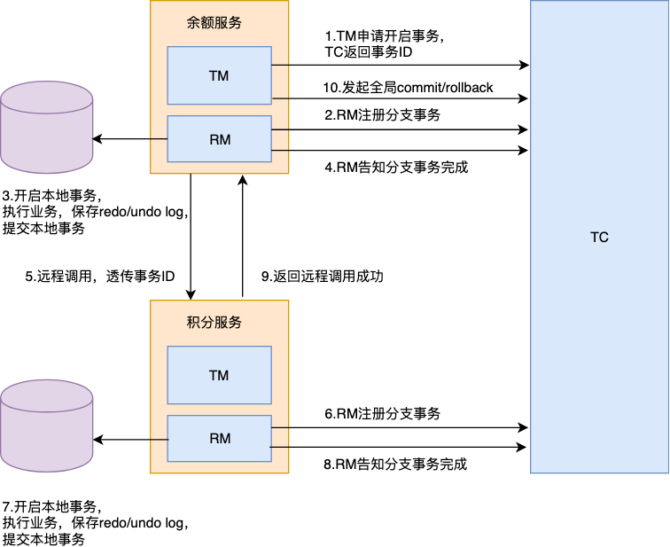

# Seata

## 架构

Seata 通过对

Seata 分三大模块 :

- TC ：事务协调者。负责我们的事务ID的生成，事务注册、提交、回滚等。
- TM：事务发起者。定义事务的边界，负责告知 TC，分布式事务的开始，提交，回滚。
- RM：资源管理者。管理每个分支事务的资源，每一个 RM 都会作为一个分支事务注册在 TC。

### 执行流程

Seata 对于所有的分布式事务敖壮

Seata 主要分为两个阶段，如下：

有个充值业务，现在有两个服务，一个负责管理用户的余额，另外一个负责管理用户的积分。

> 当用户充值的时候，首先增加用户账户上的余额，然后增加用户的积分。

Seata AT分为两阶段，主要逻辑全部在第一阶段，第二阶段主要做回滚或日志清理的工作。

#### 第一阶段流程：

第一阶段流程如

1）余额服务中的TM，向TC申请开启一个全局事务，TC会返回一个全局的事务ID。

2）余额服务在执行本地业务之前，RM会先向TC注册分支事务。

3）余额服务依次生成undo log、执行本地事务、生成redo log，最后直接提交本地事务。

4）余额服务的RM向TC汇报，事务状态是成功的。

5）余额服务发起远程调用，把事务ID传给积分服务。

6）积分服务在执行本地业务之前，也会先向TC注册分支事务。

7）积分服务次生成undo log、执行本地事务、生成redo log，最后直接提交本地事务。

8）积分服务的RM向TC汇报，事务状态是成功的。

9）积分服务返回远程调用成功给余额服务。

10）余额服务的TM向TC申请全局事务的提交/回滚。

> 积分服务中也有TM，但是由于没有用到，因此直接可以忽略。

我们如果使用 Spring框架的注解式事务，远程调用会在本地事务提交之前发生。但是，先发起远程调用还是先提交本地事务，这个其实没有任何影响。

#### 第二阶段流程如：

第二阶段的逻辑就比较简单了。

Client和TC之间是有长连接的，如果是正常全局提交，则TC通知多个RM异步清理掉本地的redo和undo log即可。如果是回滚，则TC通知每个RM回滚数据即可。

这里就会引出一个问题，由于本地事务都是自己直接提交了，后面如何回滚，由于我们在操作本地业务操作的前后，做记录了undo和redo log，因此可以通过undo log进行回滚。

由于undo和redo log和业务操作在同一个事务中，因此肯定会同时成功或同时失败。

但是还会存在一个问题，因为每个事务从本地提交到通知回滚这段时间里，可能这条数据已经被别的事务修改，如果直接用undo log回滚，会导致数据不一致的情况。

此时，RM会用redo log进行校验，对比数据是否一样，从而得知数据是否有别的事务修改过。注意：undo log是被修改前的数据，可以用于回滚；redo log是被修改后的数据，用于回滚校验。

如果数据未被其他事务修改过，则可以直接回滚；如果是脏数据，再根据不同策略处理。