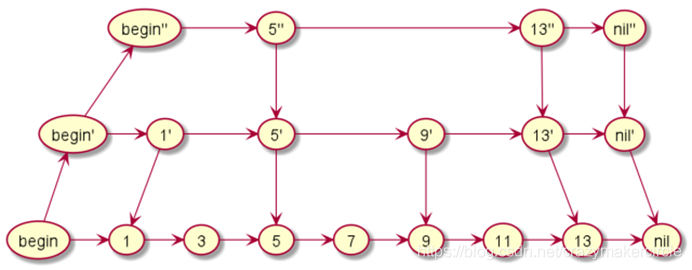
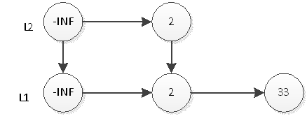
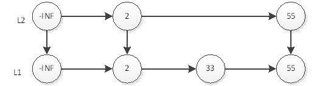

# 数据结构

## 二叉堆

### **什么是二叉堆？**

二叉堆本质上是一种完全二叉树，底层是基于数组实现的，在java中的实现为 ： 它分为两个类型：

**1.最大堆**

什么是最大堆呢？最大堆任何一个父节点的值，都**大于等于**它左右孩子节点的值。


**2.最小堆**

什么是最小堆呢？最小堆任何一个父节点的值，都**小于等于**它左右孩子节点的值。

​														 

二叉堆的根节点叫做**堆顶**。

最大堆和最小堆的特点，决定了在最大堆的堆顶是整个堆中的**最大元素**；最小堆的堆顶是整个堆中的**最小元素**。

 

### **堆的自我调整**

对于二叉堆，如下有几种操作：

- **插入节点**

- **删除节点**

- **构建二叉堆**

这几种操作都是基于堆的自我调整。下面让我们以最小堆为例，看一看二叉堆是如何进行自我调整的。

**1.插入节点**

二叉堆的节点插入，插入位置是完全二叉树的最后一个位置。比如我们插入一个新节点，值是 0。


这时候，我们让节点0的它的父节点5做比较，如果0小于5，则让新节点“上浮”，和父节点交换位置。


继续用节点0和父节点3做比较，如果0小于3，则让新节点继续“上浮”。


继续比较，最终让新节点0上浮到了堆顶位置。


 

**2.删除节点**

二叉堆的节点删除过程和插入过程正好相反，所删除的是处于堆顶的节点。比如我们删除最小堆的堆顶节点1。


这时候，为了维持完全二叉树的结构，我们把堆的最后一个节点10补到原本堆顶的位置。


接下来我们让移动到堆顶的节点10和它的左右孩子进行比较，如果左右孩子中最小的一个（显然是节点2）比节点10小，那么让节点10“下沉”


继续让节点10和它的左右孩子做比较，左右孩子中最小的是节点7，由于10大于7，让节点10继续“下沉”。


这样一来，二叉堆重新得到了调整。

 

**3.构建二叉堆**

构建二叉堆，也就是把一个无序的完全二叉树调整为二叉堆，本质上就是让**所有非叶子节点依次下沉**。

我们举一个无序完全二叉树的例子：


首先，我们从最后一个**非叶子**节点开始，也就是从节点10开始。如果节点10大于它左右孩子中最小的一个，则节点10下沉。


接下来轮到节点3，如果节点3大于它左右孩子中最小的一个，则节点3下沉。


 

接下来轮到节点1，如果节点1大于它左右孩子中最小的一个，则节点1下沉。事实上节点1小于它的左右孩子，所以不用改变。

接下来轮到节点7，如果节点7大于它左右孩子中最小的一个，则节点7下沉。


节点7继续比较，继续下沉。


这样一来，一颗无序的完全二叉树就构建成了一个最小堆。

 

**堆的代码实现**

在撸代码之前，我们还需要明确一点：

二叉堆虽然是一颗完全二叉树，但它的存储方式并不是链式存储，而是顺序存储。换句话说，二叉堆的所有节点都存储在数组当中。


 

数组中，在没有左右指针的情况下，如何定位到一个父节点的左孩子和右孩子呢？

像图中那样，我们可以依靠数组下标来计算。

假设父节点的下标是parent，那么它的左孩子下标就是 **2\*parent+1**；它的右孩子下标就是 **2\*parent+2** 。

比如上面例子中，节点6包含9和10两个孩子，节点6在数组中的下标是3，节点9在数组中的下标是7，节点10在数组中的下标是8。

```
7(9) = 3*2+1

8(10) = 3*2+2
```


## 跳表

博客地址：https://baijiahao.baidu.com/s?id=1675908267465133255&wfr=spider&for=pc&searchword=%E8%B7%B3%E8%A1%A8

### 1.1 跳表图解

跳表，是基于链表实现的一种类似“二分”的算法。它可以快速的实现增，删，改，查操作。

我们先来看一下单向链表如何实现查找：


链表，相信大家都不陌生，维护一个有序的链表是一件非常简单的事情，我们都知道，在一个有序的链表里面，查找某个数据的时候需要的时间复杂度为O(n).

怎么提高查询效率呢？如果我们给该单链表加一级索引，将会改善查询效率。


如图所示，当我们每隔一个节点就提取出来一个元素到上一层，把这一层称作索引，上层的索引节点都加上一个down指针指向原始节点。

当我们查找元素11的时候，单链表需要比较6次，而加过索引的两级链表只需要比较4次。当数据量增大到一定程度的时候，效率将会有显著的提升。

如果我们再加多几级索引的话，效率将会进一步提升。这种链表加多级索引的结构，就叫做跳表。



跳表的查询时间复杂度可以达到O(logn)

### 1.2  为什么Redis的有序集合SortedSet要使用跳表实现

跳表就是这样的一种数据结构，结点是跳过一部分的，从而加快了查询的速度。跳表跟红黑树又有什么差别呢？既然两者的算法复杂度差不多，为什么Redis的有序集合SortedSet要使用跳表实现，而不使用红黑树呢？

Redis 中的有序集合是通过跳表来实现的，严格点讲，其实还用到了散列表。

如果你去查看 Redis 的开发手册，就会发现，Redis 中的有序集合支持的核心操作主要有下面这几个：

- 插入一个数据；
- 删除一个数据；
- 查找一个数据；
- 按照区间查找数据（比如查找值在 [100, 356] 之间的数据）；
- 迭代输出有序序列。

其中，插入、删除、查找以及迭代输出有序序列这几个操作，红黑树也可以完成，时间复杂度跟跳表是一样的。但是，按照区间来查找数据这个操作，红黑树的效率没有跳表高。对于按照区间查找数据这个操作，跳表可以做到 O(logn) 的时间复杂度定位区间的起点，然后在原始链表中顺序往后遍历就可以了。这样做非常高效。

当然，Redis之所以用跳表来实现有序集合，还有其他原因，比如，跳表更容易代码实现。虽然跳表的实现也不简单，但比起红黑树来说还是好懂、好写多了，而简单就意味着可读性好，不容易出错。还有，跳表更加灵活，它可以通过改变索引构建策略，有效平衡执行效率和内存消耗


### 1.3 跳表的查询操作

假如我们要查询11，那么我们从最上层出发，发现下一个是5，再下一个是13，已经大于11，所以进入下一层，下一层的一个是9，查找下一个，下一个又是13，再次进入下一层。最终找到11。


是不是非常的简单？我们可以把查找的过程总结为一条二元表达式（下一个是否大于结果？下一个：下一层）。理解跳表的查询过程非常重要，试试看查询其他数字，只要你理解了查询，后面两种都非常简单。


### 1.4 跳表的插入

接下来看插入，我们先看理想的跳跃表结构，L2层的元素个数是L1层元素个数的1/2，L3层的元素个数是L2层的元素个数的1/2，以此类推。从这里，我们可以想到，只要在插入时尽量保证上一层的元素个数是下一层元素的1/2，我们的跳跃表就能成为理想的跳跃表。那么怎么样才能在插入时保证上一层元素个数是下一层元素个数的1/2呢？很简单，抛硬币就能解决了！

假设元素X要插入跳跃表，很显然，L1层肯定要插入X。那么L2层要不要插入X呢？我们希望上层元素个数是下层元素个数的1/2，所以我们有1/2的概率希望X插入L2层，那么抛一下硬币吧，正面就插入，反面就不插入。那么L3到底要不要插入X呢？相对于L2层，我们还是希望1/2的概率插入，那么继续抛硬币吧！以此类推，元素X插入第n层的概率是(1/2)的n次。这样，我们能在跳跃表中插入一个元素了。

跳跃表的初试状态如下图，表中没有一个元素：


如果我们要插入元素2，首先是在底部插入元素2，如下图：


然后我们抛硬币，结果是正面，那么我们要将2插入到L2层，如下图


继续抛硬币，结果是反面，那么元素2的插入操作就停止了，插入后的表结构就是上图所示。接下来，我们插入一个新元素33，跟元素2的插入一样，现在L1层插入33，如下图：



然后抛硬币，结果是反面，那么元素33的插入操作就结束了，插入后的表结构就是上图所示。接下来，我们插入一个新元素55，首先在L1插入55，插入后如下图：


然后抛硬币，结果是正面，那么L2层需要插入55，如下图：



继续抛硬币，结果又是正面，那么L3层需要插入55，如下图：


继续抛硬币，结果又是正面，那么要在L4插入55，结果如下图：


继续抛硬币，结果是反面，那么55的插入结束，表结构就如上图所示。

当然，不可能无限的进行层数增长。除了根据一种随机算法得到的层数之外，为了不让层数过大，还会有一个最大层数MAX_LEVEL限制，随机算法生成的层数不得大于该值。

以此类推，我们插入剩余的元素。当然因为规模小，结果很可能不是一个理想的跳跃表。但是如果元素个数n的规模很大，学过概率论的同学都知道，最终的表结构肯定非常接近于理想跳跃表。

当然，这样的分析在感性上是很直接的，但是时间复杂度的证明实在复杂，在此我就不深究了，感兴趣的可以去看关于跳跃表的paper。


### 1.5  跳表的删除

再讨论删除，删除操作没什么讲的，直接删除元素，然后调整一下删除元素后的指针即可。跟普通的链表删除操作完全一样。

插入和删除的时间复杂度就是查询元素插入位置的时间复杂度，这不难理解，所以是O(logn)。


## 时间轮

### 单层级时间轮 

时间轮可以理解为一种环形结构，时间轮算法的设计思想来源于钟表，像钟表一样被分为多个 slot 槽位。每个 slot 代表一个时间段，每个 slot 中可以存放多个任务，使用的是链表结构保存该时间段到期的所有任务。时间轮通过一个时针随着时间一个个 slot 转动，并执行 slot 中的所有到期任务


任务是如何添加到时间轮当中的呢？可以根据任务的到期时间进行取模，然后将任务分布到不同的 slot 中。如上图所示，时间轮被划分为 8 个 slot，每个 slot 代表 1s，当前时针指向 2。假如现在需要调度一个 3s 后执行的任务，应该加入 2+3=5 的 slot 中；如果需要调度一个 12s 以后的任务，需要等待时针完整走完一圈 round 零 4 个 slot，需要放入第 (2+12)%8=6 个 slot。

那么当时针走到第 6 个 slot 时，怎么区分每个任务是否需要立即执行，还是需要等待下一圈 round，甚至更久时间之后执行呢？所以我们需要把 round 信息保存在任务中。例如图中第 6 个 slot 的链表中包含 3 个任务，第一个任务 round=0，需要立即执行；第二个任务 round=1，需要等待 1*8=8s 后执行；第三个任务 round=2，需要等待 2*8=8s 后执行。所以当时针转动到对应 slot 时，只执行 round=0 的任务，slot 中其余任务的 round 应当减 1，等待下一个 round 之后执行。

上面介绍了时间轮算法的基本理论，可以看出时间轮有点类似 HashMap，如果多个任务如果对应同一个 slot，处理冲突的方法采用的是拉链法。在任务数量比较多的场景下，适当增加时间轮的 slot 数量，可以减少时针转动时遍历的任务个数。


### HashWheelTimer

博客地址：https://lianglianglee.com/%E4%B8%93%E6%A0%8F/Netty%20%E6%A0%B8%E5%BF%83%E5%8E%9F%E7%90%86%E5%89%96%E6%9E%90%E4%B8%8E%20RPC%20%E5%AE%9E%E8%B7%B5-%E5%AE%8C/21%20%20%E6%8A%80%E5%B7%A7%E7%AF%87%EF%BC%9A%E5%BB%B6%E8%BF%9F%E4%BB%BB%E5%8A%A1%E5%A4%84%E7%90%86%E7%A5%9E%E5%99%A8%E4%B9%8B%E6%97%B6%E9%97%B4%E8%BD%AE%20HashedWheelTimer.md

Netty 中通过HashWheelTimer实现了单层级实现轮，其核心是通过HashTimeWheel数组以及Worker线程实现，作用如下：

- HashedWheelBucket 用于表示单个时间窗口，当有相应任务时，会通过特定算法计算出任务对应的时间窗口，然后计算任务的轮次（这里整体的时间轮为一个轮次），最后通过HashTimeWheel将任务添加进去，举个例子：假如添加了一个任务过期时间为2100ms以后，而时间轮的整体轮次为500ms，每个窗口大小为100ms，共分为5个窗口，那么在添加时通过计算得出任务对应的窗口为 (**任务过期时间  2100ms /  100ms % 5 =  1**）第一个窗口，而轮次则为（**任务过期时间  2100ms /  100ms  / 5** ）为4个轮次
- Worker 负责时间窗口的转动以及任务执行，当每次滑动窗口都会维护相应的窗口值，根据窗口值找到相应HashTimeWheel，然后判断HashTimeWheel中是否有到期的任务然后执行，举个例子假设启动时设置 窗口ticket为0，表示从第0个窗口开始转动，每次转动窗口+1，那么可以可以通过**当前窗口 % 窗口个数** 就可以计算出当前位于哪个时间窗口中，然后通过数组下标获取对应的 HashTimeWheel对象


HashWheelTimer 内部有几个比较核心的点，如下：

- HashedWheelBucket 数组：用于表示每一个时间窗口，并且存储窗口时间内相应的任务
- timeouts Queue：用于存储添加的Timeout任务
- tickDuration：用于表示每个窗口的时间间隔

```java
public HashedWheelTimer(
        ThreadFactory threadFactory,
        long tickDuration, 
        TimeUnit unit, 
        int ticksPerWheel, 
        boolean leakDetection,
        long maxPendingTimeouts) {

    // 省略其他代码
    wheel = createWheel(ticksPerWheel); // 创建时间轮的环形数组结构
    mask = wheel.length - 1; // 用于快速取模的掩码
    long duration = unit.toNanos(tickDuration); //用于表示每个窗口的时间间隔, 转换成纳秒处理

    // 省略其他代码

    workerThread = threadFactory.newThread(worker); // 创建工作线程
    leak = leakDetection || !workerThread.isDaemon() ? leakDetector.track(this) : null; // 是否开启内存泄漏检测
    this.maxPendingTimeouts = maxPendingTimeouts; // 最大允许等待任务数，HashedWheelTimer 中任务超出该阈值时会抛出异常

    // 如果 HashedWheelTimer 的实例数超过 64，会打印错误日志
    if (INSTANCE_COUNTER.incrementAndGet() > INSTANCE_COUNT_LIMIT &&
        WARNED_TOO_MANY_INSTANCES.compareAndSet(false, true)) {
        reportTooManyInstances();
    }
```

- **threadFactory**，线程池，但是只创建了一个线程；
- **tickDuration**，时针每次 tick 的时间，相当于时针间隔多久走到下一个 slot；
- **unit**，表示 tickDuration 的时间单位；
- **ticksPerWheel**，时间轮上一共有多少个 slot，默认 512 个。分配的 slot 越多，占用的内存空间就越大；
- **leakDetection**，是否开启内存泄漏检测；
- **maxPendingTimeouts**，最大允许等待任务数。


#### HashWheelBucket

下面我们看下 HashedWheelTimer 是如何创建出来的，我们直接跟进 createWheel() 方法的源码：

```cpp
private static HashedWheelBucket[] createWheel(int ticksPerWheel) {

    // 省略其他代码
    ticksPerWheel = normalizeTicksPerWheel(ticksPerWheel);
    HashedWheelBucket[] wheel = new HashedWheelBucket[ticksPerWheel];
    for (int i = 0; i < wheel.length; i ++) {
        wheel[i] = new HashedWheelBucket();
    }
    return wheel;
}

private static int normalizeTicksPerWheel(int ticksPerWheel) {
    
    int normalizedTicksPerWheel = 1;
    while (normalizedTicksPerWheel < ticksPerWheel) {
        normalizedTicksPerWheel <<= 1;
    }
    return normalizedTicksPerWheel;

}

private static final class HashedWheelBucket {
    private HashedWheelTimeout head;
    private HashedWheelTimeout tail;
    // 省略其他代码

}
```

时间轮的创建就是为了创建 HashedWheelBucket 数组，每个 HashedWheelBucket 表示时间轮中一个 slot。从 HashedWheelBucket 的结构定义可以看出，HashedWheelBucket 内部是一个双向链表结构，双向链表的每个节点持有一个 HashedWheelTimeout 对象，HashedWheelTimeout 代表一个定时任务。每个 HashedWheelBucket 都包含双向链表 head 和 tail 两个 HashedWheelTimeout 节点，这样就可以实现不同方向进行链表遍历。

HashedWheelTimer 初始化的主要工作我们已经介绍完了，其内部结构与上文中介绍的时间轮算法类似，如下图所示。


#### 添加任务

HashedWheelTimer 初始化完成后，如何向 HashedWheelTimer 添加任务呢？我们自然想到 HashedWheelTimer 提供的 newTimeout() 方法。

```java
public Timeout newTimeout(TimerTask task, long delay, TimeUnit unit) {

    // 省略其他代码

    long pendingTimeoutsCount = pendingTimeouts.incrementAndGet();
    if (maxPendingTimeouts > 0 && pendingTimeoutsCount > maxPendingTimeouts) {
        pendingTimeouts.decrementAndGet();
        throw new RejectedExecutionException("Number of pending timeouts ("
            + pendingTimeoutsCount + ") is greater than or equal to maximum allowed pending "
            + "timeouts (" + maxPendingTimeouts + ")");

    }

    start(); // 1. 如果 worker 线程没有启动，需要启动
    
    // 计算任务的 deadline，既过期时间不过这里的过期时间是相对于startTime而言的，
    // 比如任务的开始时间为 1000ms，而 currentTime - delay = 1200ms，那么deadline为200ms
    long deadline = System.nanoTime() + unit.toNanos(delay) - startTime; 
    
    if (delay > 0 && deadline < 0) {
        deadline = Long.MAX_VALUE;
    }

    HashedWheelTimeout timeout = new HashedWheelTimeout(this, task, deadline); //  2. 创建定时任务
    timeouts.add(timeout); // 3. 添加任务到 Mpsc Queue
    return timeout;
}

private final Queue<HashedWheelTimeout> timeouts = PlatformDependent.newMpscQueue();
```


#### Worker#start

工作线程 Worker 的核心执行流程是代码中的 do-while 循环，只要 Worker 处于 STARTED 状态，就会执行 do-while 循环，我们把该过程拆分成为以下几个步骤，逐一分析。

- 1、通过 waitForNextTick() 方法计算出时针到下一次 tick 的时间间隔，然后 sleep 到下一次 tick。
- 2、通过位运算获取当前 tick 在 HashedWheelBucket 数组中对应的下标
- 3、移除被取消的任务。
- 4、从 Mpsc Queue 中取出任务加入对应的 HashedWheelBucket 中。
- 5、执行当前 HashedWheelBucket 中的到期任务，如果未到期那么相应的批次-1，表示已经经过一个轮次

```JAVA
public void run() {
        startTime = System.nanoTime();
        if (startTime == 0) {
            startTime = 1;
        }

        startTimeInitialized.countDown();

        do {
			
		   //1、计算下一个窗口的开始时间，假如窗口为200ms，经过5个轮次以后，现在下一个窗口的开始时间为1200ms。	
            //然后sleep 到下次 tick 既sleep到下个窗口
            final long deadline = waitForNextTick();
            if (deadline > 0) { // 可能因为溢出或者线程中断，造成 deadline <= 0
                int idx = (int) (tick & mask); // 2. 获取当前 tick 在 HashedWheelBucket 数组中对应的下标
                processCancelledTasks(); // 3. 移除被取消的任务
                HashedWheelBucket bucket = wheel[idx];

                transferTimeoutsToBuckets(); // 4. 从 Mpsc Queue 中取出任务加入对应的 slot 中
                
                // 5. 执行到期的任务，如果未到期那么相应的批次-1，表示已经经过一个轮次
                bucket.expireTimeouts(deadline); 
                
                //窗口 + 1，表示到下一个窗口
                tick++;

            }

        } while (WORKER_STATE_UPDATER.get(HashedWheelTimer.this) == WORKER_STATE_STARTED);
    }
```


#### waitForNextTick

根据 tickDuration 可以推算出下一次 tick 的 deadline，deadline 减去当前时间就可以得到需要 sleep 的等待时间。所以 tickDuration 的值越小，时间的精准度也就越高，同时 Worker 的繁忙程度越高。如果 tickDuration 设置过小，为了防止系统会频繁地 sleep 再唤醒，会保证 Worker 至少 sleep 的时间为 1ms 以上。

```
private long waitForNextTick() {
	
	//计算下一个窗口的开始时间
    long deadline = tickDuration * (tick + 1);

    for (;;) {
		
	   	
        final long currentTime = System.nanoTime() - startTime;
        
        //计算需要休眠的时间
        long sleepTimeMs = (deadline - currentTime + 999999) / 1000000;
        
        //如果 需要休眠的时间 < 0 ，表示不需要进行休眠了，因为时间已经经过当前窗口或者是正好到当前窗口
        // 举个例子：假如当前窗口为1 ，窗口间隔为100ms，startTime 为 1000ms，currentTime为1400ms 
        // 由于线程停顿获取其他原因再次执行时, 时间已经到第四个窗口了，那么就没有必要停顿了
        if (sleepTimeMs <= 0) {
            if (currentTime == Long.MIN_VALUE) {
                return -Long.MAX_VALUE;
            } else {
                return currentTime;
            }
        }

        if (PlatformDependent.isWindows()) {
            sleepTimeMs = sleepTimeMs / 10 * 10;
        }

        try {
            Thread.sleep(sleepTimeMs);
        } catch (InterruptedException ignored) {
            if (WORKER_STATE_UPDATER.get(HashedWheelTimer.this) == WORKER_STATE_SHUTDOWN) {
                return Long.MIN_VALUE;
            }
        }
    }
}
```


#### transferTimeoutsToBuckets

ransferTimeoutsToBuckets() 的主要工作就是从 Mpsc Queue 中取出任务，然后添加到时间轮对应的 HashedWheelBucket 中。每次时针 tick 最多只处理 100000 个任务，一方面避免取任务的操作耗时过长，另一方面为了防止执行太多任务造成 Worker 线程阻塞

根据用户设置的任务 deadline，可以计算出任务需要经过多少次 tick 才能开始执行以及需要在时间轮中转动圈数 remainingRounds，remainingRounds 会记录在 HashedWheelTimeout 中，在执行任务的时候 remainingRounds 会被使用到

```java
private void transferTimeoutsToBuckets() {
            // transfer only max. 100000 timeouts per tick to prevent a thread to stale the workerThread when it just
            // adds new timeouts in a loop.
            for (int i = 0; i < 100000; i++) {
                HashedWheelTimeout timeout = timeouts.poll();
                if (timeout == null) {
                    // all processed
                    break;
                }
                if (timeout.state() == HashedWheelTimeout.ST_CANCELLED) {
                    // Was cancelled in the meantime.
                    continue;
                }
				
			   //计算出来总共要转动的窗口数，比如过期时间为5000ms，窗口tickDuration为100ms，
			   //那么计算出来当前需要转动大概50个窗口才会到自己执行	
                long calculated = timeout.deadline / tickDuration;
                
                //计算出来整个时间轮转动的次数，假如时间轮为50个窗口，根据上述算出来的50个窗口，大约整体转动一次以后才可以
                //这里通过 calculated - tick 表示已经转动的窗口个数，可能现在已经转动过20个窗口了
                timeout.remainingRounds = (calculated - tick) / wheel.length;
				
			   //判断计算出来需要转动的窗口数与实际转动的窗口数哪个更大
                final long ticks = Math.max(calculated, tick); // Ensure we don't schedule for past.
                
                //通过 窗口数 % mask 可以计算出具体在哪一个窗口中
                int stopIndex = (int) (ticks & mask);
				
			   //获取窗口对应的HashedWheelBucket，将任务添加进去	
                HashedWheelBucket bucket = wheel[stopIndex];
                bucket.addTimeout(timeout);
            }
        }
```


#### expireTimeouts

执行任务的操作比较简单，就是从头开始遍历 HashedWheelBucket 中的双向链表。如果 remainingRounds <=0，则调用 expire() 方法执行任务，timeout.expire() 内部就是调用了 TimerTask 的 run() 方法。如果任务已经被取消，直接从链表中移除。否则表示任务的执行时间还没到，remainingRounds 减 1，等待下一圈即可

```java
 public void expireTimeouts(long deadline) {
            HashedWheelTimeout timeout = head;
		    
            // 通过head节点遍历所有的任务
            while (timeout != null) {
                HashedWheelTimeout next = timeout.next;
                //如果相应的轮次 <=0 表示就是当前轮次执行
                if (timeout.remainingRounds <= 0) {
                	//将任务从当前时间窗口中进行移除
                    next = remove(timeout);
                    //如果当前任务的过期时间 < 下一个批次的开始时间，则直接执行
                    if (timeout.deadline <= deadline) {
                    	//执行具体的任务
                        timeout.expire();
                    } else {
                        // The timeout was placed into a wrong slot. This should never happen.
                        throw new IllegalStateException(String.format(
                                "timeout.deadline (%d) > deadline (%d)", timeout.deadline, deadline));
                    }
                } else if (timeout.isCancelled()) {
                    next = remove(timeout);
                } else {
                
                	//将任务对应的时间轮次-1，在任务添加到时间窗口中时会计算对应的轮次
                	//比如为2，执行2个批次后任务相应的轮次为0，表示窗口已经经过两个轮次，当前任务可以执行了
                    timeout.remainingRounds --;
                }
                timeout = next;
            }
        }
```


## 滑动窗口

滑动是用于统计单位时间内的指标信息，比如TCP的滑动窗口、Sentinel的滑动窗口 以及Hystrix的滑动窗口，不同的是 Sentinel的滑动窗口是基于数组来实现的，Hystrix 是基于rxjava来实现的

### LeapArray

这里以Sentinel的滑动窗口为例，Sentine 的滑动窗口是基于RingBuffer来实现的，既基于数组实现的，其中比较核心的有三个点：

- getCurrentWindow： 根据时间获取当前的窗口
- isWindowDeprecated：判断窗口是否过期，因为在整个滑动窗口数组中可能存在过期的窗口，因为sentinel的窗口是在使用时才会进行创建或者更新，比如整个窗口周期为 200ms，当前时间为 1000ms，那么窗口有效期应该是 800 - 1000，而在滑动窗口数组中存在startTime为200ms，那么这个窗口就应该是过期的
- calculateTimeIdx：计算当前时间在窗口数组中的下标位置
- calculateWindowStart：计算当前时间对应的窗口的开始时间，比如当前时间为1024ms，并且每100ms为一个窗口，那么当前窗口的开始时间就是1000ms。

代码如下：

```java
public abstract class LeapArray<T> {
	
	//每个窗口的大小
    protected int windowLengthInMs;
    
    // 分割成几个窗口
    protected int sampleCount;
    
    //总的时间大小，既整个滑动窗口的间隔时间
    protected int intervalInMs;
    private double intervalInSecond;

	//使用数组来实现滑动窗口
    protected final AtomicReferenceArray<WindowWrap<T>> array;

    /**
     * The conditional (predicate) update lock is used only when current bucket is deprecated.
     */
    private final ReentrantLock updateLock = new ReentrantLock();

    /**
     * The total bucket count is: {@code sampleCount = intervalInMs / windowLengthInMs}.
     *
     * @param sampleCount  bucket count of the sliding window
     * @param intervalInMs the total time interval of this {@link LeapArray} in milliseconds
     */
    //sampleCount： 分割的窗口数量
    //intervalInMs：整个窗口的间隔时间
    public LeapArray(int sampleCount, int intervalInMs) {
        AssertUtil.isTrue(sampleCount > 0, "bucket count is invalid: " + sampleCount);
        AssertUtil.isTrue(intervalInMs > 0, "total time interval of the sliding window should be positive");
        AssertUtil.isTrue(intervalInMs % sampleCount == 0, "time span needs to be evenly divided");

        this.windowLengthInMs = intervalInMs / sampleCount;
        this.intervalInMs = intervalInMs;
        this.intervalInSecond = intervalInMs / 1000.0;
        this.sampleCount = sampleCount;
		
	    //创建滑动窗口数组	
        this.array = new AtomicReferenceArray<>(sampleCount);
    }

    /**
     * Get the bucket at current timestamp.
     *
     * @return the bucket at current timestamp
     */
    //根据当前的时间获取对应的窗口，既AtomicReferenceArray对应的数组下标位置
    public WindowWrap<T> currentWindow() {
        return currentWindow(TimeUtil.currentTimeMillis());
    }

    /**
     * Create a new statistic value for bucket.
     *
     * @param timeMillis current time in milliseconds
     * @return the new empty bucket
     */
    //用于创建每个窗口存放的统计指标信息，既Buckect
    public abstract T newEmptyBucket(long timeMillis);

    /**
     * Reset given bucket to provided start time and reset the value.
     *
     * @param startTime  the start time of the bucket in milliseconds
     * @param windowWrap current bucket
     * @return new clean bucket at given start time
     */
    //将单个窗口的开始时间，既startTime
    protected abstract WindowWrap<T> resetWindowTo(WindowWrap<T> windowWrap, long startTime);

    //根据timeMillis计算窗口的位置，比如 当前时间currentTime为 10000000，那么通过currentTime来计算窗口在数组中的下标位置
    private int calculateTimeIdx(/*@Valid*/ long timeMillis) {
        long timeId = timeMillis / windowLengthInMs;
        // Calculate current index so we can map the timestamp to the leap array.
        return (int)(timeId % array.length());
    }

	 //根据timeMillis计算窗口的开始时间，比如 当前时间currentTime为 10000002，那么通过currentTime来计算窗口的开始时间
    protected long calculateWindowStart(/*@Valid*/ long timeMillis) {
        return timeMillis - timeMillis % windowLengthInMs;
    }

    /**
     * Get bucket item at provided timestamp.
     *
     * @param timeMillis a valid timestamp in milliseconds
     * @return current bucket item at provided timestamp if the time is valid; null if time is invalid
     */
    //根据时间来获取窗口的位置
    public WindowWrap<T> currentWindow(long timeMillis) {
        if (timeMillis < 0) {
            return null;
        }
		
        //根据当前时间计算窗口具体的下标位置
        int idx = calculateTimeIdx(timeMillis);
        
        //根据当前时间计算窗口的开始时间
        // Calculate current bucket start time.
        long windowStart = calculateWindowStart(timeMillis);

        /*
         * Get bucket item at given time from the array.
         *
         * (1) Bucket is absent, then just create a new bucket and CAS update to circular array.
         * (2) Bucket is up-to-date, then just return the bucket.
         * (3) Bucket is deprecated, then reset current bucket and clean all deprecated buckets.
         */
        while (true) {
            WindowWrap<T> old = array.get(idx);
            //如果窗口未初始化，则进行初始化
            if (old == null) {
                /*
                 *     B0       B1      B2    NULL      B4
                 * ||_______|_______|_______|_______|_______||___
                 * 200     400     600     800     1000    1200  timestamp
                 *                             ^
                 *                          time=888
                 *            bucket is empty, so create new and update
                 *
                 * If the old bucket is absent, then we create a new bucket at {@code windowStart},
                 * then try to update circular array via a CAS operation. Only one thread can
                 * succeed to update, while other threads yield its time slice.
                 */
                WindowWrap<T> window = new WindowWrap<T>(windowLengthInMs, windowStart, newEmptyBucket(timeMillis));
                if (array.compareAndSet(idx, null, window)) {
                    // Successfully updated, return the created bucket.
                    return window;
                } else {
                    // Contention failed, the thread will yield its time slice to wait for bucket available.
                    Thread.yield();
                }
              //如果窗口初始化，并且未过期的话则直接返回当前窗口，比如窗口的开始时间为 100ms-200ms,在110ms，与 120ms时需要对窗口进行操作
              // 那么110ms 与 120ms 都是对应的100ms-200ms的窗口  
            } else if (windowStart == old.windowStart()) {
                /*
                 *     B0       B1      B2     B3      B4
                 * ||_______|_______|_______|_______|_______||___
                 * 200     400     600     800     1000    1200  timestamp
                 *                             ^
                 *                          time=888
                 *            startTime of Bucket 3: 800, so it's up-to-date
                 *
                 * If current {@code windowStart} is equal to the start timestamp of old bucket,
                 * that means the time is within the bucket, so directly return the bucket.
                 */
                return old;
                
              //如果计算的窗口开始时间 > 旧窗口的开始时间，那么可以认为旧窗口已经过期了，需要对旧窗口进行重置操作
            } else if (windowStart > old.windowStart()) {
                /*
                 *   (old)
                 *             B0       B1      B2    NULL      B4
                 * |_______||_______|_______|_______|_______|_______||___
                 * ...    1200     1400    1600    1800    2000    2200  timestamp
                 *                              ^
                 *                           time=1676
                 *          startTime of Bucket 2: 400, deprecated, should be reset
                 *
                 * If the start timestamp of old bucket is behind provided time, that means
                 * the bucket is deprecated. We have to reset the bucket to current {@code windowStart}.
                 * Note that the reset and clean-up operations are hard to be atomic,
                 * so we need a update lock to guarantee the correctness of bucket update.
                 *
                 * The update lock is conditional (tiny scope) and will take effect only when
                 * bucket is deprecated, so in most cases it won't lead to performance loss.
                 */
                if (updateLock.tryLock()) {
                    try {
                        // Successfully get the update lock, now we reset the bucket.
                        //将旧窗口的开始时间设置为新的开始时间，并且将其中的指标统计信息重置
                        return resetWindowTo(old, windowStart);
                    } finally {
                        updateLock.unlock();
                    }
                } else {
                    // Contention failed, the thread will yield its time slice to wait for bucket available.
                    Thread.yield();
                }
            } else if (windowStart < old.windowStart()) {
                // Should not go through here, as the provided time is already behind.
                return new WindowWrap<T>(windowLengthInMs, windowStart, newEmptyBucket(timeMillis));
            }
        }
    }

    /**
     * Get the previous bucket item before provided timestamp.
     *
     * @param timeMillis a valid timestamp in milliseconds
     * @return the previous bucket item before provided timestamp
     */
    //根据timeMillis来获取前一个窗口
    public WindowWrap<T> getPreviousWindow(long timeMillis) {
        if (timeMillis < 0) {
            return null;
        }
        int idx = calculateTimeIdx(timeMillis - windowLengthInMs);
        timeMillis = timeMillis - windowLengthInMs;
        WindowWrap<T> wrap = array.get(idx);

        if (wrap == null || isWindowDeprecated(wrap)) {
            return null;
        }

        if (wrap.windowStart() + windowLengthInMs < (timeMillis)) {
            return null;
        }

        return wrap;
    }

    /**
     * Get the previous bucket item for current timestamp.
     *
     * @return the previous bucket item for current timestamp
     */
    public WindowWrap<T> getPreviousWindow() {
        return getPreviousWindow(TimeUtil.currentTimeMillis());
    }

    /**
     * Get statistic value from bucket for provided timestamp.
     *
     * @param timeMillis a valid timestamp in milliseconds
     * @return the statistic value if bucket for provided timestamp is up-to-date; otherwise null
     */
    public T getWindowValue(long timeMillis) {
        if (timeMillis < 0) {
            return null;
        }
        int idx = calculateTimeIdx(timeMillis);

        WindowWrap<T> bucket = array.get(idx);

        if (bucket == null || !bucket.isTimeInWindow(timeMillis)) {
            return null;
        }

        return bucket.value();
    }

    /**
     * Check if a bucket is deprecated, which means that the bucket
     * has been behind for at least an entire window time span.
     *
     * @param windowWrap a non-null bucket
     * @return true if the bucket is deprecated; otherwise false
     */
    //判断窗口是否过期，因为滑动窗口是循环利用的，采用了ringbuffer的结构，在具体使用中就可能会存在旧数据
    // 比如当前时间为 1000s，整个窗口的周期为500s，array[1] 对应的单个窗口的开始时间为100ms，那么array[1] 就是过期的不可以再被用作统计
    public boolean isWindowDeprecated(/*@NonNull*/ WindowWrap<T> windowWrap) {
        return isWindowDeprecated(TimeUtil.currentTimeMillis(), windowWrap);
    }

    public boolean isWindowDeprecated(long time, WindowWrap<T> windowWrap) {
        //当前时间 - 具体窗口开始的时间  > 整个窗口的时间
        // 如果为true，表示当前窗口已经过期，否则则认为当前窗口是有效的
        return time - windowWrap.windowStart() > intervalInMs;
    }

    /**
     * Get valid bucket list for entire sliding window.
     * The list will only contain "valid" buckets.
     *
     * @return valid bucket list for entire sliding window.
     */
    //获取所有的有效窗口， 因为在滑动窗口数组中可能存在已经过期的窗口
    public List<WindowWrap<T>> list() {
        return list(TimeUtil.currentTimeMillis());
    }

    public List<WindowWrap<T>> list(long validTime) {
        int size = array.length();
        List<WindowWrap<T>> result = new ArrayList<WindowWrap<T>>(size);

        for (int i = 0; i < size; i++) {
            WindowWrap<T> windowWrap = array.get(i);
            if (windowWrap == null || isWindowDeprecated(validTime, windowWrap)) {
                continue;
            }
            result.add(windowWrap);
        }

        return result;
    }

    /**
     * Get all buckets for entire sliding window including deprecated buckets.
     *
     * @return all buckets for entire sliding window
     */
    //获取所有的窗口，不管窗口是否过期
    public List<WindowWrap<T>> listAll() {
        int size = array.length();
        List<WindowWrap<T>> result = new ArrayList<WindowWrap<T>>(size);

        for (int i = 0; i < size; i++) {
            WindowWrap<T> windowWrap = array.get(i);
            if (windowWrap == null) {
                continue;
            }
            result.add(windowWrap);
        }

        return result;
    }

    /**
     * Get aggregated value list for entire sliding window.
     * The list will only contain value from "valid" buckets.
     *
     * @return aggregated value list for entire sliding window
     */
    public List<T> values() {
        return values(TimeUtil.currentTimeMillis());
    }

	//获取所有未过期的窗口
    public List<T> values(long timeMillis) {
        if (timeMillis < 0) {
            return new ArrayList<T>();
        }
        int size = array.length();
        List<T> result = new ArrayList<T>(size);

        for (int i = 0; i < size; i++) {
            WindowWrap<T> windowWrap = array.get(i);
            if (windowWrap == null || isWindowDeprecated(timeMillis, windowWrap)) {
                continue;
            }
            result.add(windowWrap.value());
        }
        return result;
    }

    /**
     * Get the valid "head" bucket of the sliding window for provided timestamp.
     * Package-private for test.
     *
     * @param timeMillis a valid timestamp in milliseconds
     * @return the "head" bucket if it exists and is valid; otherwise null
     */
    WindowWrap<T> getValidHead(long timeMillis) {
        // Calculate index for expected head time.
        int idx = calculateTimeIdx(timeMillis + windowLengthInMs);

        WindowWrap<T> wrap = array.get(idx);
        if (wrap == null || isWindowDeprecated(wrap)) {
            return null;
        }

        return wrap;
    }

    /**
     * Get the valid "head" bucket of the sliding window at current timestamp.
     *
     * @return the "head" bucket if it exists and is valid; otherwise null
     */
    public WindowWrap<T> getValidHead() {
        return getValidHead(TimeUtil.currentTimeMillis());
    }

    /**
     * Get sample count (total amount of buckets).
     *
     * @return sample count
     */
    public int getSampleCount() {
        return sampleCount;
    }

    /**
     * Get total interval length of the sliding window in milliseconds.
     *
     * @return interval in second
     */
    public int getIntervalInMs() {
        return intervalInMs;
    }

    /**
     * Get total interval length of the sliding window.
     *
     * @return interval in second
     */
    public double getIntervalInSecond() {
        return intervalInSecond;
    }

    public void debug(long time) {
        StringBuilder sb = new StringBuilder();
        List<WindowWrap<T>> lists = list(time);
        sb.append("Thread_").append(Thread.currentThread().getId()).append("_");
        for (WindowWrap<T> window : lists) {
            sb.append(window.windowStart()).append(":").append(window.value().toString());
        }
        System.out.println(sb.toString());
    }

    public long currentWaiting() {
        // TODO: default method. Should remove this later.
        return 0;
    }

    public void addWaiting(long time, int acquireCount) {
        // Do nothing by default.
        throw new UnsupportedOperationException();
    }
```


## Ringbuffer

### RingBuffer 实现原理

在多线程环境下为了保证线程安全，往往需要加锁，例如读写锁可以保证读写互斥，读读不互斥。有没有一种数据结构能够实现无锁的线程安全呢？答案就是使用RingBuffer循环队列。在Disruptor项目中就运用到了RingBuffer。

RingBuffer的基本原理如下：


在RingBuffer中设置了两个指针，head和tail。head指向下一次读的位置，tail指向的是下一次写的位置。RingBuffer可用一个数组进行存储，数组内元素的内存地址是连续的，这是对CPU缓存友好的——也就是说，在硬件级别，数组中的元素是会被预加载的，因此在RingBuffer中，CPU无需时不时去主内存加载数组中的下一个元素。通过对head和tail指针的移动，可以实现数据在数组中的环形存取。当head==tail时，说明buffer为空，当head==(tail+1)%bufferSize则说明buffer满了。

在进行读操作的时候，我们只修改head的值，而在写操作的时候我们只修改tail的值。在写操作时，我们在写入内容到buffer之后才修改tail的值；而在进行读操作的时候，我们会读取tail的值并将其赋值给copyTail。赋值操作是原子操作。所以在读到copyTail之后，从head到copyTail之间一定是有数据可以读的，不会出现数据没有写入就进行读操作的情况。同样的，读操作完成之后，才会修改head的数值；而在写操作之前会读取head的值判断是否有空间可以用来写数据。所以，这时候tail到head - 1之间一定是有空间可以写数据的，而不会出现一个位置的数据还没有读出就被写操作覆盖的情况。这样就保证了RingBuffer的线程安全性。


### RingBuffer 实现代码

```java
public class CircularBuffer<E> {

    private static final int DEFAULT_CAPACITY = 8;

    private final int capacity;
    private final E[] data;
    private volatile int writeSequence, readSequence;

    @SuppressWarnings("unchecked")
    public CircularBuffer(int capacity) {
        this.capacity = (capacity < 1) ? DEFAULT_CAPACITY : capacity;
        this.data = (E[]) new Object[this.capacity];
        this.readSequence = 0;
        this.writeSequence = -1;
    }

    public boolean offer(E element) {

        if (isNotFull()) {

            int nextWriteSeq = writeSequence + 1;
            data[nextWriteSeq % capacity] = element;

            writeSequence++;
            return true;
        }

        return false;
    }

    public E poll() {

        if (isNotEmpty()) {

            E nextValue = data[readSequence % capacity];
            readSequence++;
            return nextValue;
        }

        return null;
    }

    public int capacity() {
        return capacity;
    }

    public int size() {

        return (writeSequence - readSequence) + 1;
    }

    public boolean isEmpty() {

        return writeSequence < readSequence;
    }

    public boolean isFull() {

        return size() >= capacity;
    }
    
    private boolean isNotEmpty() {

        return !isEmpty();
    }

    private boolean isNotFull() {

        return !isFull();
    }
}
```


## 分布式ID

在应用程序中，经常需要全局唯一的 ID 作为数据库主键。如何生成全局唯一 ID？

首先，需要确定全局唯一 ID 是整型还是字符串？如果是字符串，那么现有的 UUID 就完全满足需求，不需要额外的工作。缺点是字符串作为 ID 占用空间大，索引效率比整型低。

如果采用整型作为 ID，那么首先排除掉 32 位 int 类型，因为范围太小，必须使用 64 位 long 型。

```
采用整型作为ID时，如何生成自增、全局唯一且不重复的ID？
```


### 数据库自增

数据库自增 ID 是我们在数据量较小的系统中经常使用的，利用数据库的自增 ID，从 1 开始，基本可以做到连续递增。Oracle 可以用 `SEQUENCE`，MySQL 可以用主键的 `AUTO_INCREMENT`，虽然不能保证全局唯一，但每个表唯一，也基本满足需求。

数据库自增 ID 的缺点是数据在插入前，无法获得 ID。数据在插入后，获取的 ID 虽然是唯一的，但一定要等到事务提交后，ID 才算是有效的。有些双向引用的数据，不得不插入后再做一次更新，比较麻烦。

在我们开发过程中，遇到一种 主主数据库同步（简单可以理解为，同样的 sql 再另一台数据库再执行一次）的场景，如果使用数据库自增 ID，就会出现主键不一致、或主键冲突问题。


### 分布式 ID 生成器

#### 方案一：UUID

**分布式环境不推荐使用**

uuid 是我们比较先想到的方法，在 java.util;包中就有对应方法。这是一个具有 rfc 标准的 uuid：[https://www.ietf.org/rfc/rfc4122.txt](https://xie.infoq.cn/link?target=https%3A%2F%2Fwww.ietf.org%2Frfc%2Frfc4122.txt)

uuid 有很好的性能（本地调用），没有网络消耗。

但是，uuid 不易存储（生成了字符串、存储过长、很多场景不适用）；信息不安全（基于 MAC 地址生成、可能会造成泄露，这个漏洞曾被用于寻找梅丽莎病毒的制作者位置。

）；无法保证递增（或趋势递增）；其他博主反馈，截取前 20 位做唯一 ID ，在大数量（大概只有 220w）情况下会有重复问题。

```
UUID.randomUUID().toString()
```


#### 方案二：snowflake(雪花算法)

**这是目前使用较多分布式 ID 解决方案，推荐使用**

背景 Twitter 云云就不介绍了，就是前段时间封了懂王账号的 Twitter。


**算法介绍**

SnowFlake 算法生成 id 的结果是一个 64bit 大小的整数，它的结构如下图：


- **1 位，不用。二进制中最高位为 1 的都是负数，但是我们生成的 id 一般都使用整数，所以这个最高位固定是 0**

- **41 位，用来记录时间戳（毫秒）。**

  - 41 位可以表示 2^{41}-1 个数字，

  - 如果只用来表示正整数（计算机中正数包含 0），可以表示的数值范围是：0 至  2^{41}-1，减 1 是因为可表示的数值范围是从 0 开始算的，而不是 1。
  - 也就是说 41 位可以表示 2^{41}-1 个毫秒的值，转化成单位年则是 (2^{41}-1) / (1000  *60*  60 * 24 * 365) = 69 年

- **10 位，用来记录工作机器 id。**
  -  可以部署在 2^{10} = 1024 个节点，包括 5 位 datacenterId 和 5 位 workerId
  -  5 位（bit）可以表示的最大正整数是 2^{5}-1 = 31 ，即可以用 0、1、2、3、....31 这 32 个数字，来表示不同的 datecenterId 或 workerId

- **12 位，序列号，用来记录同毫秒内产生的不同 id。**
  - 12 位（bit）可以表示的最大正整数是 2^{12}-1 = 4095 ，即可以用 0、1、2、3、....4094 这 4095 个数字，来表示同一机器同一时间截（毫秒)内产生的 4095 个 ID 序号。

​	

由于在 Java 中 64bit 的整数是 long 类型，所以在 Java 中 SnowFlake 算法生成的 id 就是 long 来存储的。

**SnowFlake 可以保证**：

1. 同一台服务器所有生成的 id 按时间趋势递增
2. 整个分布式系统内不会产生重复 id（因为有 datacenterId 和 workerId 来做区分）


存在的问题：

1. 机器 ID（5 位）和数据中心 ID（5 位）配置没有解决，分布式部署的时候会使用相同的配置，任然有 ID 重复的风险。
2. 使用的时候需要实例化对象，没有形成开箱即用的工具类。
3. 强依赖机器时钟，如果机器上时钟回拨，会导致发号重复或者服务会处于不可用状态。（这点在正常情况下是不会发生的）

针对上面问题，这里提供一种解决思路，workId 使用服务器 hostName 生成，dataCenterId 使用 IP 生成，这样可以最大限度防止 10 位机器码重复，但是由于两个 ID 都不能超过 32，只能取余数，还是难免产生重复，但是实际使用中，hostName 和 IP 的配置一般连续或相近，只要不是刚好相隔 32 位，就不会有问题，况且，hostName 和 IP 同时相隔 32 的情况更加是几乎不可能的事，平时做的分布式部署，一般也不会超过 10 台容器。


**Sharding Sphere 解决时钟回拨问题**

```java
 	@Override
    public synchronized Comparable<?> generateKey() {
        long currentMilliseconds = timeService.getCurrentMillis();
        //判断是否存在时钟回拨
        if (waitTolerateTimeDifferenceIfNeed(currentMilliseconds)) {
            //如果存在则重新计算当前的时间
            currentMilliseconds = timeService.getCurrentMillis();
        }
        
        //判断最后获取id的毫秒是否与当前相等，如果相等判断是否已经产生了1ms内是否产生4096个id
        if (lastMilliseconds == currentMilliseconds) {
            if (0L == (sequence = (sequence + 1) & SEQUENCE_MASK)) {
                currentMilliseconds = waitUntilNextTime(currentMilliseconds);
            }
        } else {
            //如果时间不相等直接重置sequence
            vibrateSequenceOffset();
            sequence = sequenceOffset;
        }
        lastMilliseconds = currentMilliseconds;
        //计算获取相应的id
        return ((currentMilliseconds - EPOCH) << TIMESTAMP_LEFT_SHIFT_BITS) | (getWorkerId() << WORKER_ID_LEFT_SHIFT_BITS) | sequence;
    }
    
    
    @SneakyThrows
    private boolean waitTolerateTimeDifferenceIfNeed(final long currentMilliseconds) {
    	//如果最后生成时间 <= 当前时间 表示时钟正常
        if (lastMilliseconds <= currentMilliseconds) {
            return false;
        }
        //否则计算出回拨的时间
        long timeDifferenceMilliseconds = lastMilliseconds - currentMilliseconds;
        
        //通过sleep进行休眠
        Thread.sleep(timeDifferenceMilliseconds);
        return true;
    }
```

