# 注册中心

## 注册中心模型

注册中心的模型一般分为AP与CP两种，而每个模式都有不同协议的实现，比如AP 模型 Eureka 、Nacos的实现，而CP模型则是Raft、ZAB 协议实现

### 微服务注册中心模型

微服务的注册中心模型主要是针对微服务的，比如说要保证Server Peer 之间的数据同步以及Client端与Server端的数据同步。注册中心模型如下：

.png)


### NameSRV 注册中心

对于注册中心来说，除了Eureka的AP模式，以及Nocos的AP模式，还有类似于RocketMQ的NameSrv 也是采用的AP模式，与传统的注册中心不同的是NameSrv 不再负责Peer 与 Peer 之间的同步，而是由客户端分开注册，模式如下：

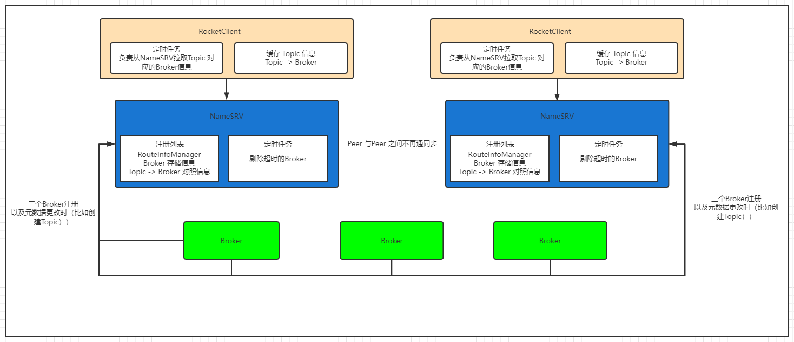

对比于传统的注册中心来看，NameSRV 不再负责 Peer 与 Peer 之间的数据同步，而是完全交给Broker端来上报对应的信息，Client也会定时从NameSRV拉取最近的Topic 对照信息，进行缓存，这样就避免了传统的注册中心Peer 与 Peer之间的同步


## Eureka

除了Eureka可以作为服务注册中心外，主流的还有Consul(https://spring.io/projects/spring-cloud-consul)、Zookeeper(https://zookeeper.apache.org/)、Etcd(https://etcd.io/)。这几种注册中心的区别我这里不做赘述，读者可以自行参阅官网的介绍，并根据自己公司的业务场景进行技术选型。

> 虽然Netflix官方表示对Eureka 2.x进行无限期搁置，但事实上1.x版本已经非常稳定，而且官方仍在不断维护，所以没有必要危言耸听。另外，很多大公司都是基于Eureka或Zookeeper二次开发，自研注册中心的。

### 一、Eureka基本架构

我们先从Eureka的基本架构开始。Eureka从整体上可以分为两个主体：**Eureka Server** 和 **Eureka Client**。

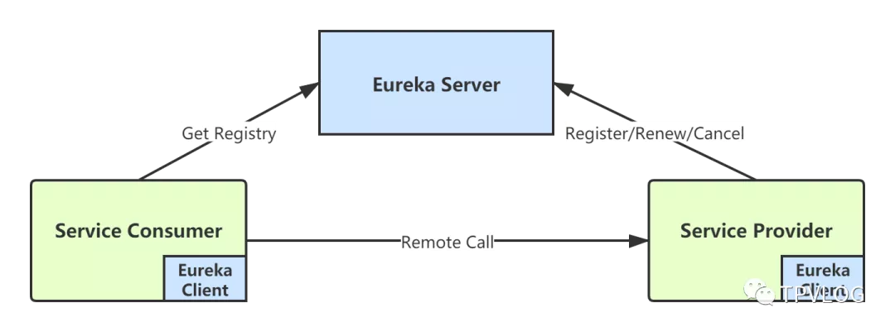

Eureka Client和Eureka Server之间的主要交互，可以参考下面这张官方的图：

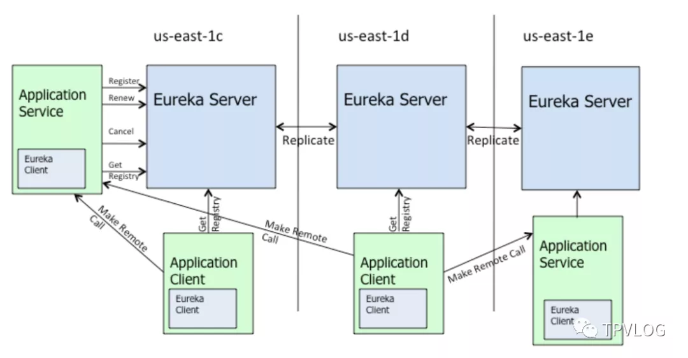

上图中：

- Eureka Server：表示注册中心集群
- us-east-1x：表示集群所在的区域，可以理解成数据中心
- Application Service：表示服务提供者
- Application Client：表示服务消费者
- Eureka Client：表示Eureka客户端

我们来一一看下各个组件和以及它们之间的交互情况。

#### 1.1 Eureka Server

Eureka Server（注册中心服务端）， 主要是维护服务注册表 ，主要对外提供三项功能：

**服务注册** 服务提供者启动时，会通过 Eureka Client 向 Eureka Server 注册信息，Eureka Server 会存储该服务的信息，Eureka Server 内部有**多级缓存机制**来维护服务注册表。

**服务发现** 服务消费者在调用服务时，如果 Eureka Client 没有缓存注册表的话，会从 Eureka Server 获取最新的注册表。

**状态同步** Eureka Client 通过注册、心跳机制和 Eureka Server 同步当前客户端的状态。

#### 1.2 Eureka Client

Eureka Client（注册中心客户端），向注册中心注册服务的应用都可以叫做Eureka Client（包括Eureka Server本身）。Eureka Client 可以从Eureka Server获取注册表，缓存在本地，从中查找服务提供者，从而进行远程调用。

服务注册表信息定期（每30秒钟）更新一次。每次返回注册列表信息可能与 Eureka Client 的缓存信息不同，Eureka Client 会自动处理。

> Eureka Client 和 Eureka Server 可以使用 JSON/XML 格式进行通讯。在默认情况下 Eureka Client 使用压缩 JSON 格式来获取注册列表的信息。

#### 1.3 Register（服务注册）

服务提供者，会将自身的服务信息注册到 Eureka Server ，服务提供者也是一个 Eureka Client。当 Eureka Client 向 Eureka Server 注册时，它提供自身的元数据，包括 IP 地址、端口，运行状况指示符 URL，主页等。

#### 1.4 Renew（服务续约）

Eureka Client 默认每隔 30 秒 向 Eureka Server发送一次心跳来续约，通过续约来告知 Eureka Server 该 Eureka Client 运行正常，没有出现问题。

> 可以通过以下参数配置心跳时间：
>
> 续约心跳间隔时间： `eureka.instance.lease-renewal-interval-in-seconds=30`

#### 1.5 Cancel（服务下线）

Eureka Client 在程序关闭时会向 Eureka Server 发送取消请求。Eureka Server 接收到请求后，会将该服务从注册表中删除。

#### 1.6 Eviction（服务剔除）

默认情况下，Eureka Server 每隔60s会检查一次注册表，如果有 Eureka Client 超过 90 秒还没续约，Server 端会将该服务从其注册表中剔除（Eviction）。

> 可以通过以下参数配置服务失效剔除时间：
>
> 服务失效剔除时间： `eureka.instance.lease-expiration-duration-in-seconds=90`

### 二、自我保护机制

Eureka自我保护机制是为了防止误杀服务而提供的一种机制。默认情况下，如果 Eureka Server 在 90s 内没有接收到某个微服务实例的心跳，就会注销该实例。但是在分布式系统中，服务之间的网络通信往往会面临着各种问题，比如网络分区故障，此时服务仍然可能是正常的，如果Eureka将其剔除，会造成误杀。

固定时间内大量实例被注销，可能会严重威胁整个分布式系统的可用性。为了解决这个问题，Eureka 开发了自我保护机制。Eureka Server 在运行期间会去统计心跳失败比例在 15 分钟之内是否高于 15%，如果高于 15%，Eureka Server 即会进入自我保护机制。

#### 2.1 工作流程

Eureka Server 进入自我保护机制后，会做以下事情：

1. 不再从注册表中移除因为长时间没收到心跳而本应该过期的服务；
2. 仍然接受新服务的注册和查询请求，但是不会被同步到其它节点上；
3. 网络恢复后，自动退出自我保护机制，并将注册信息同步到其它节点中。

注意，如果在保护期内刚好某个服务提供者下线了，此时服务消费者就会拿到一个无效的服务实例，会调用失败。对于这个问题，服务消费者要有一些容错机制，如重试、降级等。

> 通过在 Eureka Server 配置如下参数，开启或者关闭保护机制： `eureka.server.enable-self-preservation=true`

**注意：**自我保护机制这个功能存在较多问题，生产上不建议打开。

### 三、多级缓存

Eureka Server采用一种多级缓存机制来保存服务注册表，如下图：

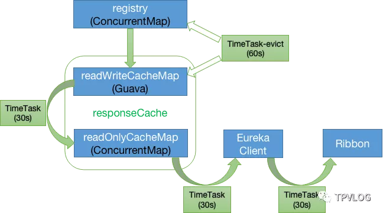

Eureka Server 的服务注册表保存在内存中，整个数据存储分为两层：**数据存储层**和**缓存层**。

- 数据存储层：registry，本质是一个**ConcurrentHashMap**，保存原始的服务信息；
- 缓存层：**readWriteCacheMap**和**readOnlyCacheMap**，其中readOnlyCacheMap是一级缓存，readWriteCacheMap是二级缓存，保存即将要对外传输的服务信息 。

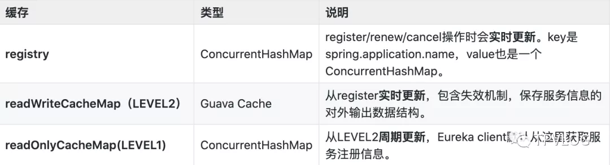

#### 3.1 registry 

当Eureka Client进行 `register`、 `renew`、 `cancel`操作时，registry会**实时更新**。registry中保存着原始的服务信息，本质是一个ConcurrentHashMap。

#### 3.2 readWriteCacheMap

readWriteCacheMap中保存的是加工后的服务注册表。

registry实时更新后，会将readWriteCacheMap清空，同时，Server端每隔60s会清理超过90s未续约的服务，此时也会将readWriteCacheMap清空。

另外，每隔30s，Eureka Server会将readWriteCacheMap中的信息同步至readOnlyCacheMap(Level1)；

#### 3.2 readOnlyCacheMap

当Eureka Client发送 `getRegistry`请求拉取服务注册信息时，实际是从readOnlyCacheMap这个一级缓存中获取的。如果获取不到，会触发二级缓存readWtireCacheMap的 `load`机制：从registry中获取原始服务信息后进行处理加工，再加载到二级缓存readWtireCacheMap中。

#### 3.3 优点

Eureka的这种多级缓存数据结构，最大的好处是提升了性能，同时能减少并发访问服务注册表时的冲突。因为如果只有一个服务注册表，同时读写必然涉及加锁，在服务很多的情况下，会导致性能低下。

#### 3.4 缺点

默认配置下，Eureka的数据时效性是比较差的，服务发现、服务注册的感知可能要几十秒甚至几分钟。数据时效差，主要是因为默认的几个定时任务同步都是30s：

我们可以对以下参数进行优化：

- 二级缓存同步时间间隔（默认30s）： `eureka.server.responseCacheUpdateIntervalMs=3000`
- Eureka Client获取注册表时间间隔（默认30s）： `eureka.client.registryFetchIntervalSeconds=3`
- 服务心跳感知时间间隔（默认30s）： `eureka.client.leaseRenewalIntervalInSeconds=30`
- 心跳超时后的服务剔除时间间隔（默认60s）： `eureka.server.evictionIntervalTimerInMs=6000`
- Eureka Server至上一次收到client心跳之后，等待下一次心跳的超时时间（在这个时间内若没收到下一次心跳，则将移除该client）： `eureka.instance.leaseExpirationDurationInSeconds=6`

经过上述参数优化后，数据的时效性一般可以达到秒级。

### 四、高可用

Eureka本身为了实现高可用，支持**集群部署**。我们假设有三台 Eureka Server 组成的集群，第一台 Eureka Server 在us-east-1c机房，另外两台 Eureka Server 分别部署在us-east-1d和us-east-1e机房。

这样三台 Eureka Server 就组建成了一个跨区域集群，三个地方的任意一个机房出现问题，都不会影响整个集群的可用性。


从上图可以看出， Eureka Server 集群之间通过 Replicate 来同步数据，所有节点都是对等的。在这种架构下，节点通过互相注册来提高可用性，每个节点需要添加一个或多个有效的 serviceUrl 指向其他节点。

如果某台 Eureka Server 宕机了，Eureka Client 的请求会自动切换到新的 Eureka Server 节点。当宕机服务器恢复后，Eureka 会再次将其纳入到服务器集群管理之中。

Eureka Server 的同步遵循着一个非常简单的原则：**只要有一条边将节点连接，就可以进行信息传播与同步。所以，如果存在多个节点，只需要将节点之间两两连接起来形成通路，那么其它注册中心都可以共享信息**。

每个 Eureka Server 同时也是 Eureka Client，多个 Eureka Server 之间通过 **P2P 方式**完成服务注册表的同步。当 Eureka Client 在向某个 Eureka 注册时，如果发现连接失败，则会自动切换至其它节点，只要有一台 Eureka Server 还在，就能保证整个集群的可用性，但是由于Eureka Server 集群之间的状态同步是异步方式的，所以不保证节点间的状态是强一致的，只能保证最终一致性。


#### 4.1 Eureka分区

Eureka 提供了 Region 和 Zone 两个概念来进行分区，这两个概念均来自于亚马逊的 AWS。

**Region**：可以理解为地理级的区域划分，比如亚洲地区，中国区或者深圳等等。没有具体大小的限制，可根据项目具体的情况，自行合理划分 region。

**Zone**：可以理解为 Region 内的具体机房，比如说 Region 划分为深圳，然后深圳有两个机房，就可以在此 Region 之下划分出 zone1、zone2。


## Nacos

Nacos 分为Nacos client 与 Naocs server 两块，模型如下：

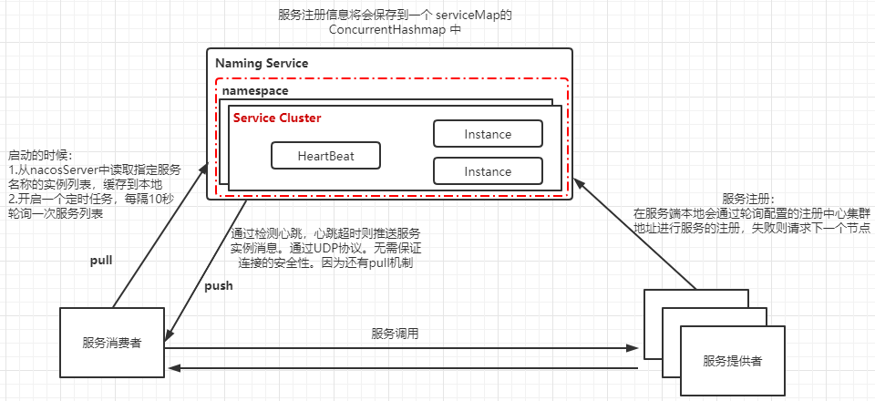

**服务注册**
Nacos Client会通过发送REST请求的方式向Nacos Server注册自己的服务，提供自身的元数据，比如ip地址、端口等信息。Nacos Server接收到注册请求后，就会把这些元数据信息存储在一个双层的内存Map中。

**服务心跳**
在服务注册后，Nacos Client会维护一个定时心跳来持续通知Nacos Server，说明服务一直处于可用状态，防止被剔除。默认5s发送一次心跳。

**服务健康检查**

- 阻止向不健康的主机或服务实例发送请求
- Nacos Server会开启一个定时任务用来检查注册服务实例的健康情况，对于超过15s没有收到客户端心跳的实例会将它的 healthy属性置为false(客户端服务发现时不会发现)，如果某个实例超过30秒没有收到心跳，直接剔除该实例(被剔除的实例如果恢复发送心跳则会重新注册)

**服务发现**
服务消费者（Nacos Client）在调用服务提供者的服务时，会发送一个REST请求给Nacos Server，获取上面注册的服务清 单，并且缓存在Nacos Client本地，同时会在Nacos Client本地开启一个定时任务定时拉取服务端最新的注册表信息更新到本地缓存 。

- 基于基于DNS和RPC的服务发现。
- 服务提供者：原生SDK，OpenAPI，独立的Agent TODO
- 服务消费者：DNS ，HTTP&API

**服务同步**
Nacos Server集群之间会互相同步服务实例，用来保证服务信息的一致性。


### Nacos Client

NacosClient主要核心的点有五个，分别为

- NacosNamingService：NacosNamingService 主要提供服务的注册以及服务的获取
- Subscriber：当服务更新变更时返回
- BeatTask：用于续期，发送心跳
- PushReceiver：用于接收注册中心服务信息变更，当注册中心服务变更时，会通过PushClient进行下发，然后通过PushReceiver进行接收，并且更新本地缓存信息
- UpdateTask：定时从服务端获取服务信息，由于长轮询采用UDP，Udp本身也是不可靠的传输协议，Nacos采用了Push + Pull的方式来更新本地缓存

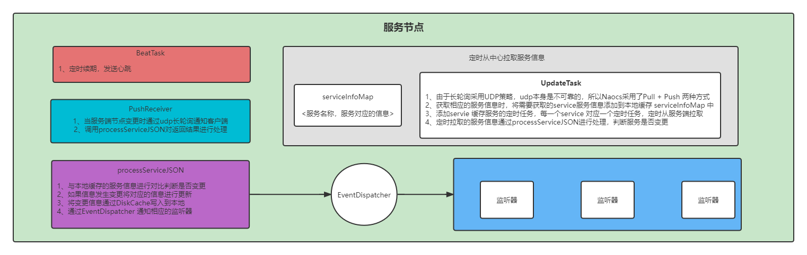


### Naocs Server

NacosServer 主要分为四块，分别是：

- ServiceManager：用于管理服务，包括服务注册、服务删除等等

  ```
  内置一个Map用于存储服务信息 <namespace, <groupName:serviceName , Service>>
  ```

- Distro：AP协议的实现，负责从其他注册中心同步服务信息、以及同步当前服务信息到其他注册中心

- ServerListManager：用于维护Server Peer列表，包括Server status 上报，就是将发送当前Server的心跳信息到其他Server Peer节点，主要是为了维护health server peer，保证在同步时只同步服务信息到 health server peers

- PushService：用于维护注册中心与客户端的udp长轮询连接，当服务注册时会将服务客户端对应的udp端口一起进行上报，注册中心根据instance ip 以及对应的 udp port 建立对应的udp client连接，当注册中心 服务信息更改时，通过维护的PushClient进行数据下发

  ```
  内置一个Map用于维护UdpClient <serviceName, <instance , PushClient>>
  ```

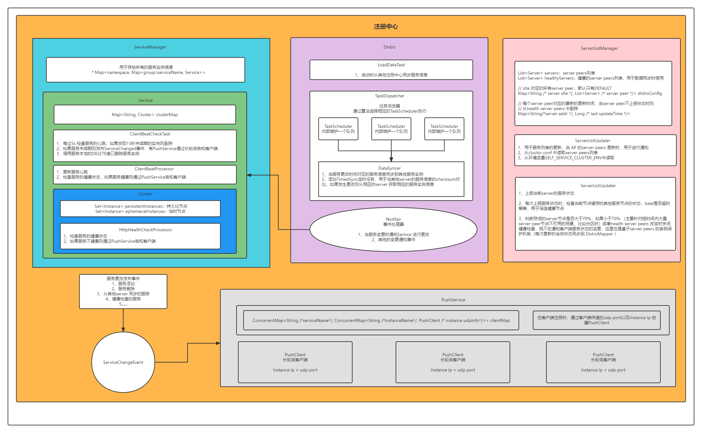


### 自我保护机制

**Nacos与Eureka自我保护机制对比**

相同点：保护阈值都是个比例，0-1 范围，表示健康的 instance 占全部instance 的比例。

不同点：

**1）保护方式不同**

Eureka保护方式：当在短时间内，统计续约失败的比例，如果达到一定阈值，则会触发自我保护的机制，在该机制下，Eureka Server不会剔除任何的微服务，等到正常后，再退出自我保护机制。自我保护开关(eureka.server.enable-self-preservation: false)

Nacos保护方式：

1、当域名健康实例 (Instance) 占总服务实例(Instance) 的比例小于阈值时，无论实例 (Instance) 是否健康，都会将这个实例 (Instance) 返回给客户端。这样做虽然损失了一部分流量，但是保证了集群的剩余健康实例 (Instance) 能正常工作。

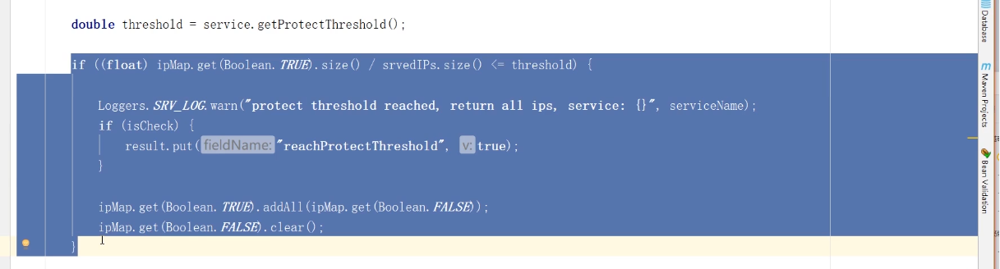


2、当大量server peers不可用时比如分区时，会进入自我保护，既不再剔除服务列表，也不会通知客户端服务状态变更，包括不在同步其他server peer 服务信息

```
		//判断autoDisabledHealthCheck是否为true，并且60s内是否稳定， 并且判断存活的server节点是否大于70%，如果大于70% （主要针对短时间内大量		    //server peer节点不可用的场景，比如分区时）
        // 则开启健康检查用于判断是服务节点是否可以剔除、以及是否需要健康检查等
        if (autoDisabledHealthCheck
            && curRatio > switchDomain.getDistroThreshold()
            && System.currentTimeMillis() - lastHealthServerMillis > STABLE_PERIOD) {
            Loggers.SRV_LOG.info("[NACOS-DISTRO] distro threshold restored and " +
                "stable now, enable health check. current ratio: {}", curRatio);

            switchDomain.setHealthCheckEnabled(true);

            // we must set this variable, otherwise it will conflict with user's action
            autoDisabledHealthCheck = false;
        }

        //判断 健康的server peer节点是否改变，如果改变则判断是否开启了健康检查，如果开启先将健康检查关闭，并且将autoDisabledHealthCheck设置为 true
        if (!CollectionUtils.isEqualCollection(healthyServers, newHealthyList)) {
            // for every change disable healthy check for some while
            Loggers.SRV_LOG.info("[NACOS-DISTRO] healthy server list changed, old: {}, new: {}",
                healthyServers, newHealthyList);
            if (switchDomain.isHealthCheckEnabled() && switchDomain.isAutoChangeHealthCheckEnabled()) {
                Loggers.SRV_LOG.info("[NACOS-DISTRO] disable health check for {} ms from now on.", STABLE_PERIOD);

                switchDomain.setHealthCheckEnabled(false);
                autoDisabledHealthCheck = true;

                lastHealthServerMillis = System.currentTimeMillis();
            }

            healthyServers = newHealthyList;
            notifyListeners();
        }
    }
```


**2）范围不同**

Nacos 的阈值是针对某个具体 Service 的，而不是针对所有服务的。但 Eureka的自我保护阈值是针对所有服务的。


## NameSRV


## 配置中心

### RefreshScope

RefreshScope的核心时，在扫描bean时，如果发现bean被 @RefreshScope修饰，就会生成代理对象，而在代理对象实际执行时都会通过RefreshScope中的scopeCache进行获取，如果scopeCache中没有存在相应的对象，就会重新生成行的对象，这样就可以保证对象的属性被重新绑定，流程分为spring 启动时与 实际运行时两块

#### Spring 启动时

spring 启动时会扫描相应的对象，如果发现对象时scope 对象，就会通过ScopeProxyUtils来生成相应的代理对象，并且将原对象与代理对象同时注册到BeanFactory中，代理对象的名称为：`scopedTarget.beanName`,代码如下：

**AnnotationConfigUtils#applyScopedProxyMode：**

```java
static BeanDefinitionHolder applyScopedProxyMode(
			ScopeMetadata metadata, BeanDefinitionHolder definition, BeanDefinitionRegistry registry) {
		
		ScopedProxyMode scopedProxyMode = metadata.getScopedProxyMode();
		//判断对象是否是scope对象，如果是则通过ScopedProxyCreator来生成代理对象
		if (scopedProxyMode.equals(ScopedProxyMode.NO)) {
			return definition;
		}
		boolean proxyTargetClass = scopedProxyMode.equals(ScopedProxyMode.TARGET_CLASS);
		return ScopedProxyCreator.createScopedProxy(definition, registry, proxyTargetClass);
}
```

<br/>

**ScopedProxyCreator#createScopedProxy：**

```java
public static BeanDefinitionHolder createScopedProxy(BeanDefinitionHolder definition,
			BeanDefinitionRegistry registry, boolean proxyTargetClass) {

    	//获取原对象的bean名称
		String originalBeanName = definition.getBeanName();
		BeanDefinition targetDefinition = definition.getBeanDefinition();
    	
    	//获取代理对象的bean名称
		String targetBeanName = getTargetBeanName(originalBeanName);

         //创建代理对象，并且将原对象的BeanDefinition 拷贝到代理对象的BeanDefinition中
		// Create a scoped proxy definition for the original bean name,
		// "hiding" the target bean in an internal target definition.
		RootBeanDefinition proxyDefinition = new RootBeanDefinition(ScopedProxyFactoryBean.class);
		proxyDefinition.setDecoratedDefinition(new BeanDefinitionHolder(targetDefinition, targetBeanName));
		proxyDefinition.setOriginatingBeanDefinition(targetDefinition);
		proxyDefinition.setSource(definition.getSource());
		proxyDefinition.setRole(targetDefinition.getRole());

		proxyDefinition.getPropertyValues().add("targetBeanName", targetBeanName);
		if (proxyTargetClass) {
			targetDefinition.setAttribute(AutoProxyUtils.PRESERVE_TARGET_CLASS_ATTRIBUTE, Boolean.TRUE);
			// ScopedProxyFactoryBean's "proxyTargetClass" default is TRUE, so we don't need to set it explicitly here.
		}
		else {
			proxyDefinition.getPropertyValues().add("proxyTargetClass", Boolean.FALSE);
		}

		// Copy autowire settings from original bean definition.
		proxyDefinition.setAutowireCandidate(targetDefinition.isAutowireCandidate());
		proxyDefinition.setPrimary(targetDefinition.isPrimary());
		if (targetDefinition instanceof AbstractBeanDefinition) {
			proxyDefinition.copyQualifiersFrom((AbstractBeanDefinition) targetDefinition);
		}

		// The target bean should be ignored in favor of the scoped proxy.
		targetDefinition.setAutowireCandidate(false);
		targetDefinition.setPrimary(false);

		// Register the target bean as separate bean in the factory.
		registry.registerBeanDefinition(targetBeanName, targetDefinition);

		// Return the scoped proxy definition as primary bean definition
		// (potentially an inner bean).
		return new BeanDefinitionHolder(proxyDefinition, originalBeanName, definition.getAliases());
	}
```

<br/>

**GenericScope#postProcessBeanDefinitionRegistry**

```java
	@Override
	public void postProcessBeanDefinitionRegistry(BeanDefinitionRegistry registry)
			throws BeansException {
		for (String name : registry.getBeanDefinitionNames()) {
			BeanDefinition definition = registry.getBeanDefinition(name);
			if (definition instanceof RootBeanDefinition) {
				RootBeanDefinition root = (RootBeanDefinition) definition;
                 //判断BeanClass 是否为上面注册的ScopeProxyBeanDefinition，如果是的话将beanClass改为LockedScopedProxyFactoryBean
				if (root.getDecoratedDefinition() != null && root.hasBeanClass()
						&& root.getBeanClass() == ScopedProxyFactoryBean.class) {
					if (getName().equals(root.getDecoratedDefinition().getBeanDefinition()
							.getScope())) {
						root.setBeanClass(LockedScopedProxyFactoryBean.class);
						root.getConstructorArgumentValues().addGenericArgumentValue(this);
						// surprising that a scoped proxy bean definition is not already
						// marked as synthetic?
						root.setSynthetic(true);
					}
				}
			}
		}
	}
```

<br/>

**ScopeProxyFactoryBean#setBeanFactory**

在初始化生成的Scope Proxy Bean时，会根据原对象生成相应的代理对象，这里使用的是TargetSource来实现的，既当需要获取被代理的bean时，会通过TargetSource#getTarget进行获取

```java
@Override
public void setBeanFactory(BeanFactory beanFactory) {
   if (!(beanFactory instanceof ConfigurableBeanFactory)) {
      throw new IllegalStateException("Not running in a ConfigurableBeanFactory: " + beanFactory);
   }
   ConfigurableBeanFactory cbf = (ConfigurableBeanFactory) beanFactory;

   this.scopedTargetSource.setBeanFactory(beanFactory);

   //创建代理对象
   ProxyFactory pf = new ProxyFactory();
   pf.copyFrom(this);
   //这里将被代理的对象设置为TargetSource，既被代理对象的来源
   pf.setTargetSource(this.scopedTargetSource);

   Assert.notNull(this.targetBeanName, "Property 'targetBeanName' is required");
   Class<?> beanType = beanFactory.getType(this.targetBeanName);
   if (beanType == null) {
      throw new IllegalStateException("Cannot create scoped proxy for bean '" + this.targetBeanName +
            "': Target type could not be determined at the time of proxy creation.");
   }
   if (!isProxyTargetClass() || beanType.isInterface() || Modifier.isPrivate(beanType.getModifiers())) {
      pf.setInterfaces(ClassUtils.getAllInterfacesForClass(beanType, cbf.getBeanClassLoader()));
   }

   // Add an introduction that implements only the methods on ScopedObject.
   ScopedObject scopedObject = new DefaultScopedObject(cbf, this.scopedTargetSource.getTargetBeanName());
   pf.addAdvice(new DelegatingIntroductionInterceptor(scopedObject));

   // Add the AopInfrastructureBean marker to indicate that the scoped proxy
   // itself is not subject to auto-proxying! Only its target bean is.
   pf.addInterface(AopInfrastructureBean.class);

   //生成代理对象 
   this.proxy = pf.getProxy(cbf.getBeanClassLoader());
}
```

我们可以从SimpleBeanTargetSource看到，获取具体被代理的对象时，则是通过BeanFactory#getBean 方法进行获取的

```java
public class SimpleBeanTargetSource extends AbstractBeanFactoryBasedTargetSource {

	@Override
	public Object getTarget() throws Exception {
		return getBeanFactory().getBean(getTargetBeanName());
	}

}
```

<br/>

#### Spring 运行时

**AbstractBeanFactory#doGetBean**

我们可以从下面看到，当我们需要获取相应的被代理的对象时，会通过下面的代码获取，首先判断是否是单例bean，如果不是则判断是否是Prototype 类型的bean，如果还不是则通过Bean相应的scope进行获取，从缓存的所有的scope中获取对应的Scope对象，然后调用Scope#get方法来进行获取

```java
   // Create bean instance.
   if (mbd.isSingleton()) {
      sharedInstance = getSingleton(beanName, () -> {
         try {
            return createBean(beanName, mbd, args);
         }
         catch (BeansException ex) {
            // Explicitly remove instance from singleton cache: It might have been put there
            // eagerly by the creation process, to allow for circular reference resolution.
            // Also remove any beans that received a temporary reference to the bean.
            destroySingleton(beanName);
            throw ex;
         }
      });
      bean = getObjectForBeanInstance(sharedInstance, name, beanName, mbd);
   }

   else if (mbd.isPrototype()) {
      // It's a prototype -> create a new instance.
      Object prototypeInstance = null;
      try {
         beforePrototypeCreation(beanName);
         prototypeInstance = createBean(beanName, mbd, args);
      }
      finally {
         afterPrototypeCreation(beanName);
      }
      bean = getObjectForBeanInstance(prototypeInstance, name, beanName, mbd);
   }

   else {
      //获取bean对象的scope 
      String scopeName = mbd.getScope();
      
      //从所有的scope中获取对象的scope对象
      final Scope scope = this.scopes.get(scopeName);
      if (scope == null) {
         throw new IllegalStateException("No Scope registered for scope name '" + scopeName + "'");
      }
      try {
         
         //通过scope获取相应的对象，在获取时会传入ObjectFactory对象，用于生成相应的bean
         Object scopedInstance = scope.get(beanName, () -> {
            beforePrototypeCreation(beanName);
            try {
               return createBean(beanName, mbd, args);
            }
            finally {
               afterPrototypeCreation(beanName);
            }
         });
         bean = getObjectForBeanInstance(scopedInstance, name, beanName, mbd);
      }
      catch (IllegalStateException ex) {
         throw new BeanCreationException(beanName,
               "Scope '" + scopeName + "' is not active for the current thread; consider " +
               "defining a scoped proxy for this bean if you intend to refer to it from a singleton",
               ex);
      }
   }
}
```

<br/>

**GenericScope#get**

在GnericScope对象内部，有两个属性比较重要，一个是wrapperCache，一个是locks，wrapperCache是用来保存生成的bean，而locks则是为每一个scope proxy对象创建一个读写锁，用于保证不会出现并发问题

```java
@Override
public Object get(String name, ObjectFactory<?> objectFactory) {
   //将 beanName 与 BeanLifecycleWrapper 放入到缓存中
   BeanLifecycleWrapper value = this.cache.put(name,
         new BeanLifecycleWrapper(name, objectFactory));
   //为其添加对应的读写锁，如果存在则不添加 
   locks.putIfAbsent(name, new ReentrantReadWriteLock());
   try {
      //通过包装器获取对应的bean对象 
      return value.getBean();
   }
   catch (RuntimeException e) {
      this.errors.put(name, e);
      throw e;
   }
}
```

```java
private static class BeanLifecycleWrapper {

		private Object bean;

		private Runnable callback;

		private final String name;

		private final ObjectFactory<?> objectFactory;

         //beanName: bean名称
         //objectFactory: 用于创建bean对象
		public BeanLifecycleWrapper(String name, ObjectFactory<?> objectFactory) {
			this.name = name;
			this.objectFactory = objectFactory;
		}

		public String getName() {
			return this.name;
		}

		public void setDestroyCallback(Runnable callback) {
			this.callback = callback;
		}
 
         //获取对应的bean对象，如果bean对象没有初始化，则通过objectFactory进行获取
		public Object getBean() {
			if (this.bean == null) {
				synchronized (this.name) {
					if (this.bean == null) {
						this.bean = this.objectFactory.getObject();
					}
				}
			}
			return this.bean;
		}

         //丢弃当前的bean对象，这样可以生成新的bean对象，保证bean对象内部的所有属性是最新的，用于执行destory方法回收资源
		public void destroy() {
			if (this.callback == null) {
				return;
			}
			synchronized (this.name) {
				Runnable callback = this.callback;
				if (callback != null) {
					callback.run();
				}
				this.callback = null;
				this.bean = null;
			}
		}
	}
```

从上面整个过程可以看出用scope修饰的对象会生成相应的代理对象，而每次在执行具体方法时，会通过TargetSource来获取被代理对象，这个时候会通过Scope进行获取，如果scope内部没有这个对象会通过ObjectFactory 生成被代理的bean对象，当有环境变量改变或者是PropertySource更新时，我们可以通过destory之前生成的bean对象，这样可以保证在生成新的bean对象时，bean内部挂在的所有属性都是最新的


### Nacos config

Spring 内部的环境变量都是由PropertySource组成，这些PropertySources 包括application.properties、System enviorment、自定义PropertySource以及远端的配置中心，当需要填充属性时，会通过这些PropertySource进行查找，这里也包括远端的配置中心，这样就实现了所谓的远端配置中心的数据填充到本地（具体参考PropertySource实现）配置中心流程如下：

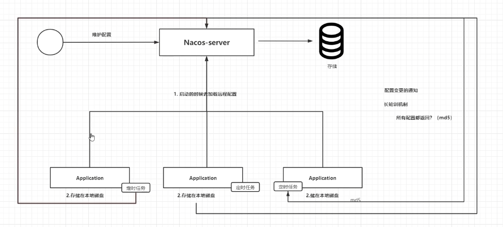


#### Nacos Config Client

在 ConfigClient启动时会添加对应的Listener 监听器用于监听服务端配置的变更，然后将需要监听的配置文件通过算法进行拆分到不同的不同的LongPollingRunable中，然后与服务端建立长轮询链接，当服务端配置发生变更时，会通过长训论返回，通过getServerConfig 再次从远端获取对应的配置文件，然后再出发相应的监听器

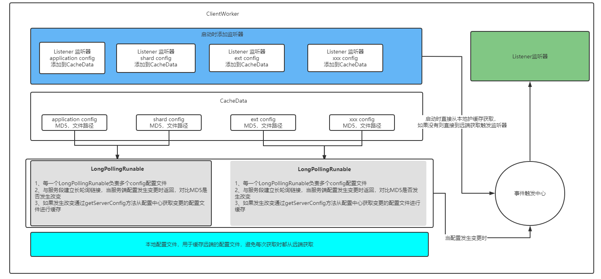


### Nacos Config Server

Nacos Config Server 核心的主要有两一块，如下：

- 当服务断配置发生变更时发布LocalDataChangeEvent事件，用于告诉客户端的长轮询配置发生变更
- 在集群环境下有ServerListService 来维护集群中不同的Server Peer 列表，比如健康检查等等，当配置发生变更时，通过维护的健康Server Peer列表进行通知，，表示配置发生变更，由各个Server Peer 从存储中进行加载，然后通知给不同的Config Client ，以出发配置变更事件

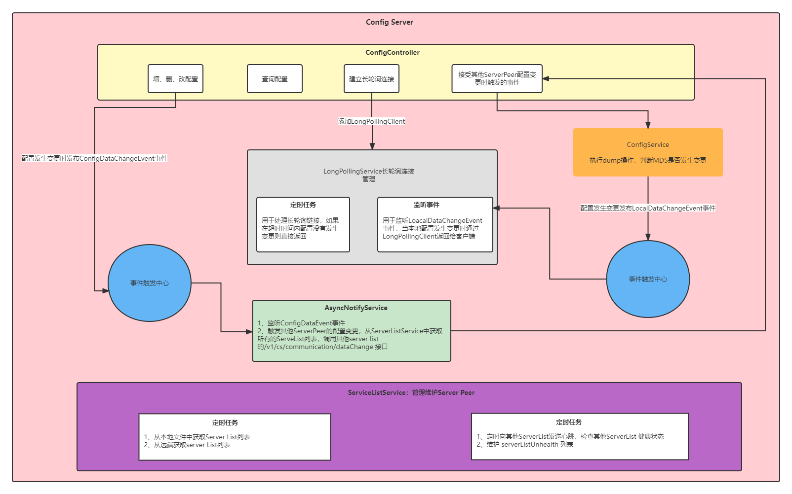


#### Nacos Config 属性机制

在NaocsConfig client启动时会添加一个Listener监听器，用于监听配置的变化，当配置发生变化时会发布RefreshEvent事件，然后监听该事件，调用ContextRefresher进行刷新

**NacosContextRefresher#registerNacosListener**

```java
private void registerNacosListener(final String group, final String dataId) {
		
    	//添加监听器，用于监听注册中心的变化
		Listener listener = listenerMap.computeIfAbsent(dataId, i -> new Listener() {
			@Override
			public void receiveConfigInfo(String configInfo) {
				refreshCountIncrement();
				String md5 = "";
				if (!StringUtils.isEmpty(configInfo)) {
					try {
						MessageDigest md = MessageDigest.getInstance("MD5");
						md5 = new BigInteger(1, md.digest(configInfo.getBytes("UTF-8")))
								.toString(16);
					}
					catch (NoSuchAlgorithmException | UnsupportedEncodingException e) {
						log.warn("[Nacos] unable to get md5 for dataId: " + dataId, e);
					}
				}
				refreshHistory.add(dataId, md5);
                 //当注册中心的配置发生变更时，发布RefreshEvent表示配置刷新了
				applicationContext.publishEvent(
						new RefreshEvent(this, null, "Refresh Nacos config"));
				if (log.isDebugEnabled()) {
					log.debug("Refresh Nacos config group " + group + ",dataId" + dataId);
				}
			}

			@Override
			public Executor getExecutor() {
				return null;
			}
		});

		try {
             //将Listener 注册到ConfigService中
			configService.addListener(dataId, group, listener);
		}
		catch (NacosException e) {
			e.printStackTrace();
		}
	}
```

<br/>

**RefreshEventListener#handle**

监听发布的RefreshEvent事件，再通过spring提供的ContextRefresher的刷新工具类进行刷新，保证配置最新

```
public class RefreshEventListener {
	private static Log log = LogFactory.getLog(RefreshEventListener.class);
	private ContextRefresher refresh;
	private AtomicBoolean ready = new AtomicBoolean(false);

	public RefreshEventListener(ContextRefresher refresh) {
		this.refresh = refresh;
	}

	@EventListener
	public void handle(ApplicationReadyEvent event) {
		this.ready.compareAndSet(false, true);
	}

	@EventListener
	public void handle(RefreshEvent event) {
		if (this.ready.get()) { // don't handle events before app is ready
			log.debug("Event received " + event.getEventDesc());
			Set<String> keys = this.refresh.refresh();
			log.info("Refresh keys changed: " + keys);
		}
	}
}
```


## NamedContextFactory

NamedContextFactory 是Spring 用来分离框架内部针对不同类别实现管理的ApplicationContext，举个例子，比如常用的@FeignClient注解，在其内部会有一个configuration 属性，用于表示当前Feign的所有的配置都来源于其特有的Config类，那么多个FeignClient就会有多个Config与之对应，NamedContextFactory就是为每一个FeignClient维护一个ApplicationContext，用来分离他们不同的底层实现，以避免出现冲突

NamedContextFactory 内部维护了map，用于保存不同类别的实现，比如FeignClientA 与 FeignClientAConfig

```java
public interface Specification {
    
    	//上下文名称
		String getName();
		
    	//上下文对应的配置类信息
		Class<?>[] getConfiguration();
	}
	
	//用于保存不同上下文以及对应的AppicationContext
	private Map<String, AnnotationConfigApplicationContext> contexts = new ConcurrentHashMap<>();

	//用于保存不同上下文以及对应的Config配置类
	private Map<String, C> configurations = new ConcurrentHashMap<>();
	
	//将当前的ApplicationContext作为Parent
	private ApplicationContext parent;
	
	//默认的Config配置类
	private Class<?> defaultConfigType;
	
	//proeprtySource 名称，用于加载相关的环境变量
	private final String propertySourceName;


	private final String propertyName;

	public NamedContextFactory(Class<?> defaultConfigType, String propertySourceName,
			String propertyName) {
		this.defaultConfigType = defaultConfigType;
		this.propertySourceName = propertySourceName;
		this.propertyName = propertyName;
	}

	
	//为不同的name 创建不同AnnotationConfigApplicationContext，用于分离底层实现
	protected AnnotationConfigApplicationContext createContext(String name) {
		AnnotationConfigApplicationContext context = new AnnotationConfigApplicationContext();
		if (this.configurations.containsKey(name)) {
			for (Class<?> configuration : this.configurations.get(name)
					.getConfiguration()) {
				context.register(configuration);
			}
		}
		for (Map.Entry<String, C> entry : this.configurations.entrySet()) {
			if (entry.getKey().startsWith("default.")) {
				for (Class<?> configuration : entry.getValue().getConfiguration()) {
					context.register(configuration);
				}
			}
		}
		context.register(PropertyPlaceholderAutoConfiguration.class,
				this.defaultConfigType);
		context.getEnvironment().getPropertySources().addFirst(new MapPropertySource(
				this.propertySourceName,
				Collections.<String, Object> singletonMap(this.propertyName, name)));
		if (this.parent != null) {
			// Uses Environment from parent as well as beans
			context.setParent(this.parent);
		}
		context.setDisplayName(generateDisplayName(name));
		context.refresh();
		return context;
	}

}
```


## Feign

Feign 的流程主要分为三部分，首先是Feign bean的注册、Feign的执行流程、Feign 的Client 与 Ribbion集成

### Feign的注册

Spring 通过扫描FeignClient 注解为每个FeignClient 生成一个相应的FeignClientFatoryBean，并且注册到BeanFactory中。FeignClientFatoryBean通过每一个FeignClient配置的Config来配置Feign，并生成相应Feign实例，代码如下：

**FeignFactoryBean**

```java
	@Override
	public Object getObject() throws Exception {
         //获取Feign相应的NamedContextFactory
		FeignContext context = applicationContext.getBean(FeignContext.class);
        	
         //配置Feign相关的设置，比如Decoder、Encoder等等
		Feign.Builder builder = feign(context);

         //如果url为null，表示这里是需要通过服务名称来进行RPC调用
		if (!StringUtils.hasText(this.url)) {
			String url;
			if (!this.name.startsWith("http")) {
				url = "http://" + this.name;
			}
			else {
				url = this.name;
			}
			url += cleanPath();
             //配置Feign 的client为默认的LoadBalancerFeignClient
			return loadBalance(builder, context, new HardCodedTarget<>(this.type,
					this.name, url));
		}
         //如果url不为空则配置url
		if (StringUtils.hasText(this.url) && !this.url.startsWith("http")) {
			this.url = "http://" + this.url;
		}
		String url = this.url + cleanPath();
        
         //获取相应的Client
		Client client = getOptional(context, Client.class);
		if (client != null) {
			if (client instanceof LoadBalancerFeignClient) {
				// not lod balancing because we have a url,
				// but ribbon is on the classpath, so unwrap
				client = ((LoadBalancerFeignClient)client).getDelegate();
			}
			builder.client(client);
		}
		Targeter targeter = get(context, Targeter.class);
        
         //通过Targeter来生成相应的Feign实例
		return targeter.target(this, builder, context, new HardCodedTarget<>(
				this.type, this.name, url));
	}
	
	
	//配置Feign 相关的设置
	protected Feign.Builder feign(FeignContext context) {
         
         //配置日志logger
		FeignLoggerFactory loggerFactory = get(context, FeignLoggerFactory.class);
		Logger logger = loggerFactory.create(this.type);
		
         //获取通用的FeignBuilder实现，如果需要自定义Feign.Builder的话可以通过定义Feign.Builder bean来实现
		// @formatter:off
		Feign.Builder builder = get(context, Feign.Builder.class)
				// required values
             	  //配置logger
				.logger(logger)
                  //配置encoder
				.encoder(get(context, Encoder.class))
            	  //配置decoder
				.decoder(get(context, Decoder.class))
            	  //配置constract，用于解析method，生成相应的metadata比如解析RequestMapping等等
				.contract(get(context, Contract.class));
		// @formatter:on
		
         //配置Feign其他实现
		configureFeign(context, builder);

		return builder;
	}
```

<br/>

通过FeignBuilder 自定义生成Feign实现

```
@Bean
public UserClient userClient() {
    return Feign.builder()
            .client(new Client.Default(null,null))
            .encoder(new SpringEncoder(null))
            .decoder(new SpringDecoder(null))
            .logger(new Slf4jLogger())
            .decode404()
            .errorDecoder(new ErrorDecoder.Default())
            .retryer(new Retryer.Default())
            .contract(new SpringMvcContract())
            .target(new Target.HardCodedTarget<>(UserClient.class,""));
}

	
	//自定义feign.Builder，在生成Feign时会用到 
	@Bean
	@Scope("prototype")
	@ConditionalOnMissingBean
	@ConditionalOnProperty(name = "feign.sentinel.enabled")
	public Feign.Builder feignSentinelBuilder() {
		return SentinelFeign.builder();
	}
```


### Feign的流程

Feign远程调用，核心就是通过一系列的封装和处理，将以JAVA注解的方式定义的远程调用API接口，最终转换成HTTP的请求形式，然后将HTTP的请求的响应结果，解码成JAVA Bean，放回给调用者。Feign远程调用的基本流程，大致如下图所示。

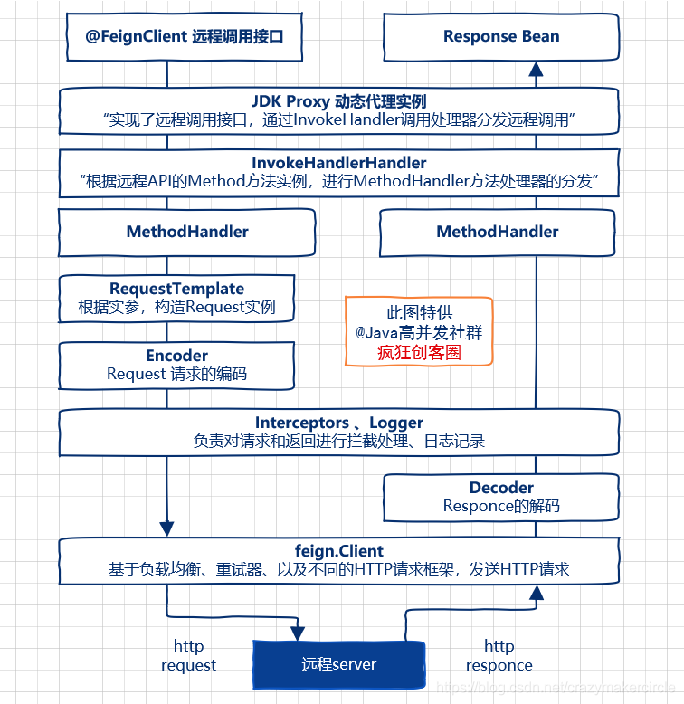

通过 JDK Proxy 生成动态代理类，核心步骤就是需要定制一个调用处理器，具体来说，就是实现JDK中位于java.lang.reflect 包中的 InvocationHandler 调用处理器接口，并且实现该接口的 invoke（…） 抽象方法。

为了创建Feign的远程接口的代理实现类，Feign提供了自己的一个默认的调用处理器，叫做 FeignInvocationHandler 类，该类处于 feign-core 核心jar包中。当然，调用处理器可以进行替换，如果Feign与Hystrix结合使用，则会替换成 HystrixInvocationHandler 调用处理器类，类处于 feign-hystrix 的jar包中。


#### FeignInvocationHandler

默认的调用处理器 FeignInvocationHandler 是一个相对简单的类，有一个非常重要Map类型成员 dispatch 映射，保存着远程接口方法到MethodHandler方法处理器的映射。

以前面示例中DemoClient 接口为例，其代理实现类的调用处理器 FeignInvocationHandler 的dispatch 成员的内存结构图如图3所示。

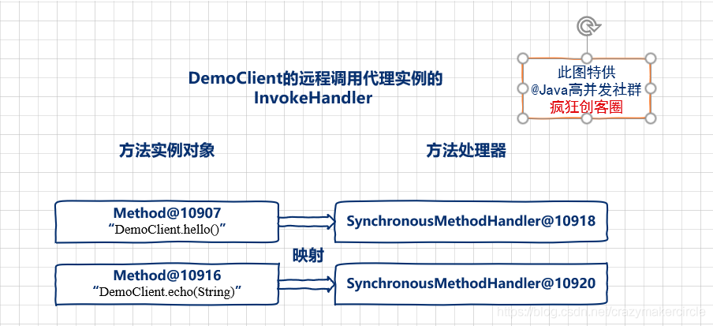

默认的调用处理器 FeignInvocationHandle，在处理远程方法调用的时候，会根据Java反射的方法实例，在dispatch 映射对象中，找到对应的MethodHandler 方法处理器，然后交给MethodHandler 完成实际的HTTP请求和结果的处理。前面示例中的 DemoClient 远程调用接口，有两个远程调用方法，所以，其代理实现类的调用处理器 FeignInvocationHandler 的dispatch 成员，有两个有两个Key-Value键值对。

```java
public class ReflectiveFeign extends Feign {

  //...

  //内部类：默认的Feign调用处理器 FeignInvocationHandler
  static class FeignInvocationHandler implements InvocationHandler {

    private final Target target;
    //方法实例对象和方法处理器的映射,这里的MethodHandler是SynchronousMethodHandler 实例
    private final Map<Method, MethodHandler> dispatch;

    //构造函数    
    FeignInvocationHandler(Target target, Map<Method, MethodHandler> dispatch) {
      this.target = checkNotNull(target, "target");
      this.dispatch = checkNotNull(dispatch, "dispatch for %s", target);
    }

    //默认Feign调用的处理
    @Override
    public Object invoke(Object proxy, Method method, Object[] args) throws Throwable {
      //...
	  //首先，根据方法实例，从方法实例对象和方法处理器的映射中，
	  //取得 方法处理器，然后，调用 方法处理器 的 invoke(...) 方法
         return dispatch.get(method).invoke(args);
    }
    //...
  }
```


#### MethodHandler

Feign的方法处理器 MethodHandler 是一个独立的接口，定义在 InvocationHandlerFactory 接口中，仅仅拥有一个invoke(…)方法，源码如下：

```java
//定义在InvocationHandlerFactory接口中
public interface InvocationHandlerFactory {
  //…

 //方法处理器接口，仅仅拥有一个invoke(…)方法
  interface MethodHandler {
    //完成远程URL请求
    Object invoke(Object[] argv) throws Throwable;
  }
//...
}
```

MethodHandler 的invoke(…)方法，主要职责是完成实际远程URL请求，然后返回解码后的远程URL的响应结果。Feign提供了默认的 SynchronousMethodHandler 实现类，提供了基本的远程URL的同步请求处理,代码如下：

```java
package feign;
//…..省略import
final class SynchronousMethodHandler implements MethodHandler {
  //…
  // 执行Handler 的处理
public Object invoke(Object[] argv) throws Throwable {
        RequestTemplate requestTemplate = this.buildTemplateFromArgs.create(argv);
        Retryer retryer = this.retryer.clone();

        while(true) {
            try {
                return this.executeAndDecode(requestTemplate);
            } catch (RetryableException var5) {
               //…省略不相干代码
            }
        }
}

//执行请求，然后解码结果
Object executeAndDecode(RequestTemplate template) throws Throwable {
        Request request = this.targetRequest(template);
        long start = System.nanoTime();
        Response response;
        try {
            response = this.client.execute(request, this.options);
            response.toBuilder().request(request).build();
        }
}
}
```

SynchronousMethodHandler的invoke(…)方法，调用了自己的executeAndDecode(…) 请求执行和结果解码方法。该方法的工作步骤：

（1）首先通 RequestTemplate 请求模板实例，生成远程URL请求实例 request；

（2）然后用自己的 feign 客户端client成员，excecute(…) 执行请求，并且获取 response 响应；

（3）对response 响应进行结果解码。


#### Feign.Client

客户端组件是Feign中一个非常重要的组件，负责端到端的执行URL请求。其核心的逻辑：发送request请求到服务器，并接收response响应后进行解码。

feign.Client 类，是代表客户端的顶层接口，只有一个抽象方法，源码如下：

```java
package feign;

/**客户端接口
 * Submits HTTP {@link Request requests}. 
Implementations are expected to be thread-safe.
 */
public interface Client {
  //提交HTTP请求，并且接收response响应后进行解码
  Response execute(Request request, Options options) throws IOException;

}
```

由于不同的feign.Client 实现类，内部完成HTTP请求的组件和技术不同，故，feign.Client 有多个不同的实现。这里举出几个例子：

（1）Client.Default类：默认的feign.Client 客户端实现类，内部使用HttpURLConnnection 完成URL请求处理；

（2）ApacheHttpClient 类：内部使用 Apache httpclient 开源组件完成URL请求处理的feign.Client 客户端实现类；

（3）OkHttpClient类：内部使用 OkHttp3 开源组件完成URL请求处理的feign.Client 客户端实现类。

（4）LoadBalancerFeignClient 类：内部使用 Ribben 负载均衡技术完成URL请求处理的feign.Client 客户端实现类。


### Feign.Client 与 Ribbion集成

在创建Feign.Client时，会通过LoadBalancerFeignClient对其进行包装，并且通过FeignLoadBalancer进行代理请求，通过Ribbion内置的负载均衡机制获取服务相应的Server列表，在通过负载均衡算法返回url，再进行实际调用，流程如下

**LoadBalancerFeignClient**

```java
	@Override
	public Response execute(Request request, Request.Options options) throws IOException {
		try {
			URI asUri = URI.create(request.url());
			String clientName = asUri.getHost();
			URI uriWithoutHost = cleanUrl(request.url(), clientName);
             //通过RibbonRequest对Request进行包装
			FeignLoadBalancer.RibbonRequest ribbonRequest = new FeignLoadBalancer.RibbonRequest(
					this.delegate, request, uriWithoutHost);
			
             //获取Ribbon相应的配置
			IClientConfig requestConfig = getClientConfig(options, clientName);
             
             //通过Ribbon的 LoadBalancerAwareClient 进行请求
			return lbClient(clientName).executeWithLoadBalancer(ribbonRequest,
					requestConfig).toResponse();
		}
		catch (ClientException e) {
			IOException io = findIOException(e);
			if (io != null) {
				throw io;
			}
			throw new RuntimeException(e);
		}
	}
```


**FeignLoadBalancer**

FeignLoadBalancer 继承自AbstractFeignLoadBalancer，内部实现不通的复杂均衡机制，会在请求时通过负载均衡算法对url进行置换，当置换完成后调用execute方法进行实际调用

```java
	@Override
	public RibbonResponse execute(RibbonRequest request, IClientConfig configOverride)
			throws IOException {
		Request.Options options;
		if (configOverride != null) {
			RibbonProperties override = RibbonProperties.from(configOverride);
			options = new Request.Options(
					override.connectTimeout(this.connectTimeout),
					override.readTimeout(this.readTimeout));
		}
		else {
			options = new Request.Options(this.connectTimeout, this.readTimeout);
		}
         //调用实际的Client进行请求
		Response response = request.client().execute(request.toRequest(), options);
		return new RibbonResponse(request.getUri(), response);
	}
```


## Ribbion

Ribbion 提供客户端负载均衡机制，通过提供的服务名称来从注册中心选择相应的实例ip来进行url替换，然后进行访问

### ServerList 服务列表

> 存储服务列表，也就是被负载均衡的对象

```
主要实现
```

- **ConfigurationBasedServerList**： 静态服务列表，也就是我们通常所说的写死，项目启动前配置好。
- **DiscoveryEnabledNIWSServerList**：动态服务列表，从`Eureka Client`中获取服务列表。


### ServerListFilter服务筛选

> 筛选特定条件的服务列表，对ServerList服务器列表进行二次过滤

`主要实现`：

- **AbstractServerListFilter**
  负责从负载均衡器中过滤出当前可用的服务器列表的类
- **ZoneAffinityServerListFilter**: 过滤掉所有的不和客户端在相同zone的服务(注意：如果和客户端相同的zone不存在，才不过滤不同zone有服务)
- **ZonePreferenceServerListFilter**：
- **ServerListSubsetFilter**


### ServerListUpdater 服务列表的更新

定义关于更新动作，根据策略执行更新操作，更新ServerList列表，一般用于动态ServerList

`主要实现`：

- **PollingServerListUpdater**
  默认的实现策略。此对象会启动一个定时线程池，定时执行更新策略
- **EurekaNotificationServerListUpdater**
  当收到缓存刷新的通知，会更新服务列表。


###  IPing 服务存活检查

检查一个服务是否存活

`主要实现`：

- **DummyPing** ： 总是认为存活
- **NoOpPing**：什么都不做
- **PingConstant**：通过配置参数设置指定服务器存活状态
- **NIWSDiscoveryPing**: 如果服务实例在本地的Eureka缓存中存在，则返回true（默认配置）。ribbon-eureka包中提供的类，结合eureka使用时，如果Discovery Client在线，则认为心跳检测通过
- **PingUrl**：用HttpClient调用服务的一个URL，如果调用成功，则认为本次心跳成功，表示此服务活着

IPing检查的是当个服务的存活性。

**`IPingStrategy`**：服务列表检查策略接口，
唯一实现：**`SerialPingStrategy`**：采用线性遍历的策略方式，使用IPing检查每个服务的存活性


###  IRule 根据算法选择一个服务

根据算法中从服务列表中选取一个要访问的服务

`主要实现`：

- **RandomRule**:随机算法
- **RoundRobinRule** ： 轮训策略（**`默认策略`**）
- **RetryRule**: 轮询 + 重试，在RoundRobinRule基础上，增加重试功能
- **WeightedResponseTimeRule**：  (`非常好`) 刚启动时，统计数据不足，先使用`RoundRobinRule`策略。有个`DynamicServerWeightTask`定时任务，默认每隔30秒会计算一次各个服务实例响应时间，等统计信息足够，切换到`WeightedResponseTimeRule`.
- **BestAvailableRule**: 先过滤到断路器处于打开的服务，然后选择并发请求最小的服务实例来使用。刚启动时，如果统计信息不足，则使用RoundRobinRule策略，等统计信息足够，会切换到BestAvailableRule。
- **PredicateBasedRule**:  过滤+轮训
- AvailabilityFilteringRule:  (1)由于多次访问故障而处于断路器跳闸状态;(2)并发的连接数量超过阈值. (3)对剩余的服务列表，进行轮询


### ILoadBalancer：统筹者

负载均衡器，负责负载均衡调度的管理，总管级别。`调度其他组件，完成从服务列表里获取一个服务的目标`

对外提供一个方法，选择出一个Server来。

```java
public Server chooseServer(Object key);
```

抽象类：AbstractLoadBalancer 主要`定义了服务的分组`

`主要实现`：

**1.BaseLoadBalancer**： 基本负载均衡器实现.维护
（1）维护一个所有服务列表+当前存活服务列表
（2）默认使用轮训选择一个服务
（3）定义一个定时器，根据SerialPingStrategy策略定时检活

**2.DynamicServerListLoadBalancer**动态升级版
（1）DomainExtractingServerList 动态从EurekaClient获取UP状态服务列表
（2）ZoneAffinityServerListFilter对列表进行过滤
（3）PollingServerListUpdater定时对服务进行更新

**3.ZoneAwareLoadBalancer**： 在DynamicServerListLoadBalancer基础上增加了zone策略。
（1）此类使用ZoneStats存储每个Zone的状态和平均请求情况。区域指标作为选择服务的影响因素


### IConfig Rabbion 配置

组件有了，到底采用哪种组合方式呢？Ribbon为使用者提供了可配置化。

> 通过不同的组件组合，配置不同的负载均衡效果。

配置的方式有哪些呢：

- IClientConfig 接口：默认实现`DefaultClientConfigImpl`。你不配置任何属性，则默认会使用这里面定义的组件。当然这里还有其他各种属性的配置

默认配置的组件有:

- 文件配置: 当我们更换默认的配置时，我们可以在配置文件里配置各种属性,  属性格式配置如下

```xml
<clientName>.<nameSpace>.<propertyName>=<value>
api-user.ribbon.listOfServers=localhost:8099
```


### Ribbon 的执行流程

Ribbon执行入口 在 AbstractLoadBalancerAwareClient#executeWithLoadBalancer，在执行时会调用ILoadBalancer 选择需要执行的Server，然后再execute回调中进行实际执行，流程如下：

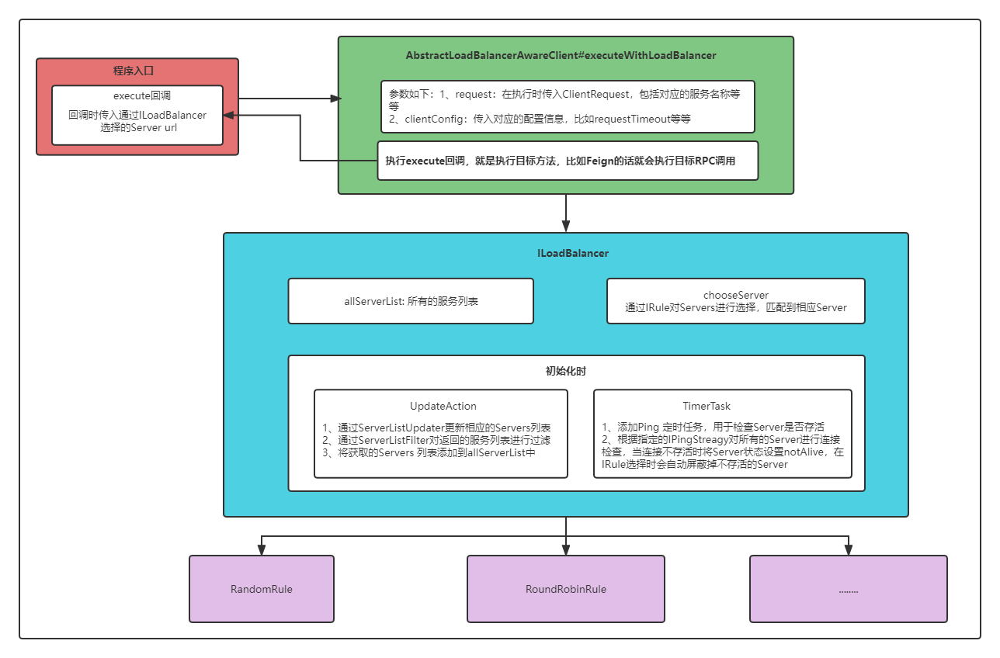


