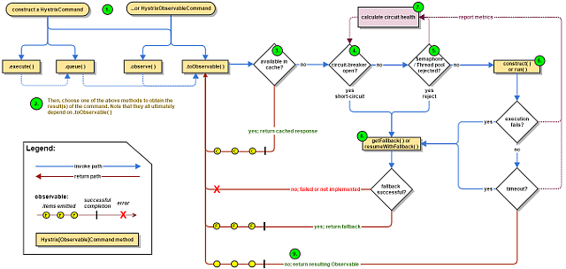

# 服务治理

## 限流算法

### 固定时间窗口

所谓时间窗口限流，是指在一定的时间内，维护一个访问总量的数值，当其超过阈值时，拒绝后续所有的请求，直到进入下一个时间窗口。


上图横轴的每个时间节点都是一个时间窗口，我们可以看到，当请求没有超过阈值以前，请求为蓝色，可以正常进行，超过阈值的请求会被抛弃。

但是，这种算法有一个很明显的临界问题：假设限流阀值为 5 个请求，单位时间窗口是 1s，如果我们在单位时间内的前 0.8-1s 和 1-1.2s，分别并发 5 个请求。虽然都没有超过阀值，但是如果算 0.8-1.2s，则并发数高达 10，已经超过单位时间 1s 不超过 5 阀值的定义了。


### 滑动时间窗口

滑动窗口限流可以解决固定窗口临界值的问题。它将单位时间周期分为n个小周期，分别记录每个小周期内接口的访问次数，并且根据时间滑动删除过期的小周期。


滑动窗口的格子周期划分的越多，那么滑动窗口的滚动就越平滑，限流的统计就会越精确，但是相对的，维护成本也就越高。


### 令牌桶算法

我们想象有一个虚拟的桶，桶里面放有一定数量的Token，请求访问资源之前，需要从桶里拿到令牌，拿不到令牌的请求会被拒绝掉，这就是令牌桶的思想。

令牌桶限流大致的规则如下： 

（1）进水口按照某个速度，向桶中放入令牌。 

（2）令牌的容量是固定的，但是放行的速度不是固定的，只要桶中还有剩余令牌，一旦请求 过来就能申请成功，然后放行。 

（3）如果令牌的发放速度，慢于请求到来速度，桶内就无牌可领，请求就会被拒绝


令牌桶算法的实现很轻量级，我们并不需要一个真正的桶，只需要维护以下几个数值，就能在请求到来时计算出是否有足够的Token分配给请求：

- 上一次发出令牌的时间
- 令牌的生产速度
- 上次剩下的令牌数
- 桶的容量

根据以上的数据，我们就可以计算出是否有足够的令牌分配给当前的请求，来完成限流操作。


令牌桶实现大致分为三种，分别是Guava的RateLimiter实现、redis + lua的实现以及 java本身实现

#### java 示例代码

```java
// 上一次令牌发放时间
    public long lastTime = System.currentTimeMillis();
    // 桶的容量
    public int capacity = 10;
    // 令牌生成速度 /s
    public int rate = 5;
    // 当前令牌数量
    public AtomicInteger tokens = new AtomicInteger(0);
    ;

    //返回值说明：
    // false 没有被限制到
    // true 被限流
    public synchronized boolean isLimited(long taskId, int applyCount) {
        long now = System.currentTimeMillis();
        //时间间隔,单位为 ms
        long gap = now - lastTime;

        //计算时间段内的令牌数
        int reverse_permits = (int) (gap * rate / 1000);

        int all_permits = tokens.get() + reverse_permits;
        // 当前令牌数
        tokens.set(Math.min(capacity, all_permits));
        log.info("tokens {} capacity {} gap {} generate_token {}", tokens, capacity, gap, reverse_permits);

        if (tokens.get() < applyCount) {
            // 若拿不到令牌,则拒绝
            // log.info("被限流了.." + taskId + ", applyCount: " + applyCount);
            return true;
        } else {
            // 还有令牌，领取令牌
            tokens.getAndAdd( - applyCount);
			
            //这里要进行计算，如果发现gap 未达到放令牌的时间，就不更新，因为在获取令牌时，如果直接更新时间就会导致上面计算时时间对应不上
            //比如：目前有6个令牌，每500ms应该产生一个令牌，现在有6个请求过来，每个请求相隔100ms，当每个请求拿到令牌时直接更新时间
            //在计算时会通过 gap * rate / 1000 来计算，就是说每100ms是不足以增加令牌的，那么过了500ms之后令牌桶中的令牌就会是0，
            //但是理论上过了500ms之后令牌桶会放入一个令牌，所以在每次获取令牌时就要计算nowTime - lastUpdateTime 是否也已经达到需要
            //更新的时间间隔了，如果没有就不应该再更新
            if (gap > (1000 / rate))
                lastTime = now;

            // log.info("剩余令牌.." + tokens);
            return false;
        }

    }
```


#### redis + lua 实现

```lua
--入参部分
local tokens_key = KEYS[1]
--令牌桶刷新的时间戳。
local timestamp_key = KEYS[2]
--redis.log(redis.LOG_WARNING, "tokens_key " .. tokens_key)

--令牌生产的速率
local rate = tonumber(ARGV[1])
--令牌桶的容量
local capacity = tonumber(ARGV[2])
--当前时间戳
local now = tonumber(ARGV[3])
--当前请求的令牌数，默认为1
local requested = tonumber(ARGV[4])

--填满空桶需要的时间
local fill_time = capacity/rate
--两倍的填满时间，作为key的失效时间。防止key太多，占用空间
local ttl = math.floor(fill_time*2)

--redis.log(redis.LOG_WARNING, "rate " .. ARGV[1])
--redis.log(redis.LOG_WARNING, "capacity " .. ARGV[2])
--redis.log(redis.LOG_WARNING, "now " .. ARGV[3])
--redis.log(redis.LOG_WARNING, "requested " .. ARGV[4])
--redis.log(redis.LOG_WARNING, "filltime " .. fill_time)
--redis.log(redis.LOG_WARNING, "ttl " .. ttl)

--当前桶中剩余令牌数。如果key不存在，初始化桶的容量数，即默认为满
local last_tokens = tonumber(redis.call("get", tokens_key))
if last_tokens == nil then
  last_tokens = capacity
end
--redis.log(redis.LOG_WARNING, "last_tokens " .. last_tokens)

--上次刷新时间。如果key不存在，初始化为0
local last_refreshed = tonumber(redis.call("get", timestamp_key))
if last_refreshed == nil then
  last_refreshed = 0
end
--redis.log(redis.LOG_WARNING, "last_refreshed " .. last_refreshed)

--距离上次限流的时间差
local delta = math.max(0, now - last_refreshed)
--时间差内能够恢复多少令牌
local filled_tokens = math.min(capacity, last_tokens + (delta * rate))
--申请的令牌足够
local allowed = filled_tokens >= requested
local new_tokens = filled_tokens

--申请结果标识，0表示失败，1表示成功
local allowed_num = 0
--如果申请令牌通过，重新计算剩余令牌数。
if allowed then
  new_tokens = filled_tokens - requested
  allowed_num = 1
end

--redis.log(redis.LOG_WARNING, "delta " .. delta)
--redis.log(redis.LOG_WARNING, "filled_tokens " .. filled_tokens)
--redis.log(redis.LOG_WARNING, "allowed_num " .. allowed_num)
--redis.log(redis.LOG_WARNING, "new_tokens " .. new_tokens)

--将本次申请后剩余令牌数，和key更新时间，写回redis，并设置过期时间
redis.call("setex", tokens_key, ttl, new_tokens)
--将key更新时间，写回redis，并设置过期时间
redis.call("setex", timestamp_key, ttl, now)

--返回令牌申请结果，和剩余令牌数
return { allowed_num, new_tokens }
```

限流的逻辑还是比较简单的，脚本中我已经添加了注释，下面再稍加解释。

脚本开头是传入的参数：

- tokens_key：限流的标识。可以是ip，或者在spring cloud中可以是serviceID
- timestamp_key：令牌桶刷新的时间戳。
- rate ：令牌生产的速率
- capacity ：令牌桶的容量
- now ：当前时间戳
- requested：当前请求的令牌数，默认为1

下面是限流核心思想：

对于每个到来的请求，都需要获取令牌，默认申请一个令牌。如果桶中令牌数足够，就认为本次申请成功。申请成功后，需要记录下剩余的令牌数，和本次申请时间(戳)，这些信息会写回到redis。

需要注意两点：

一是这里剩余的令牌数的计算，除了减去本次申请消耗外，还要加上上次请求距今的时间内恢复的令牌数。令牌恢复的速度是传入的rate值，所以在上次请求与本次请求之间的时间差(delta)内，就会产生delta*rate个令牌。

二是记录的信息需要设置过期时间，主要是为了防止大量key占用空间。key过期后，下次再有请求到来时，会进行初始化，将桶中令牌数重置为满，将上次请求时间戳重置为0。这里的**过期时间设置的是两倍的空桶装满令牌的需要耗费的时间**，也就是2*(capacity/rate)。


###  漏桶算法

漏桶算法的算法原理是，设置一个漏桶，每次请求都将请求放入到漏桶当中，若漏桶已满则拒绝请求，漏桶按照一定速率将已放入漏桶的请求流出，流出的请求将被正常处理。漏桶算法面对限流时，可以缓存一定的请求，不用直接粗暴拒绝（消息队列的限流本质上就是漏桶算法）。

大致的漏桶限流规则如下： 

（1）进水口（对应客户端请求）以任意速率流入进入漏桶。 

（2）漏桶的容量是固定的，出水（放行）速率也是固定的。 

（3）漏桶容量是不变的，如果处理速度太慢，桶内水量会超出了桶的容量，则后面流入的水 滴会溢出，表示请求拒绝


令牌桶与漏桶相比，本质的区别是没有一个队列来缓存请求，在更轻量级的同时也只能粗暴的直接舍弃请求。

实现代码如下：

```java

    // 计算的起始时间
    private static long lastOutTime = System.currentTimeMillis();
    // 流出速率 每秒 2 次
    private static int leakRate = 2;

    // 桶的容量
    private static int capacity = 10;

    //剩余的水量
    private static AtomicInteger water = new AtomicInteger(0);

    //返回值说明：
    // false 没有被限制到
    // true 被限流
    public static synchronized boolean isLimit(long taskId, int turn) {
        // 如果是空桶，就当前时间作为漏出的时间
        if (water.get() == 0) {
            lastOutTime = System.currentTimeMillis();
            water.addAndGet(1);
            return false;
        }

        System.out.println((System.currentTimeMillis() - lastOutTime) / 1000);

        // 执行漏水
        int waterLeaked = ((int) ((System.currentTimeMillis() - lastOutTime) / 1000)) * leakRate;
        // 计算剩余水量
        int waterLeft = water.get() - waterLeaked;
        water.set(Math.max(0, waterLeft));
        // 重新更新leakTimeStamp
        lastOutTime = System.currentTimeMillis();
        // 尝试加水,并且水还未满 ，放行
        if ((water.get()) < capacity) {
            water.addAndGet(1);
            return false;
        } else {
            // 水满，拒绝加水， 限流
            return true;
        }

    }


```


**Sentinel#RateLlimiter 实现**

```java
public class RateLimiterController implements TrafficShapingController {

    private final int maxQueueingTimeMs;
    private final double count;

    private final AtomicLong latestPassedTime = new AtomicLong(-1);

    public RateLimiterController(int timeOut, double count) {
        this.maxQueueingTimeMs = timeOut;
        this.count = count;
    }

    @Override
    public boolean canPass(Node node, int acquireCount) {
        return canPass(node, acquireCount, false);
    }

    @Override
    public boolean canPass(Node node, int acquireCount, boolean prioritized) {
        // Pass when acquire count is less or equal than 0.
        if (acquireCount <= 0) {
            return true;
        }
        // Reject when count is less or equal than 0.
        // Otherwise,the costTime will be max of long and waitTime will overflow in some cases.
        if (count <= 0) {
            return false;
        }

        long currentTime = TimeUtil.currentTimeMillis();
        // Calculate the interval between every two requests.
        long costTime = Math.round(1.0 * (acquireCount) / count * 1000);

        // Expected pass time of this request.
        long expectedTime = costTime + latestPassedTime.get();

        if (expectedTime <= currentTime) {
            // Contention may exist here, but it's okay.
            latestPassedTime.set(currentTime);
            return true;
        } else {
            // Calculate the time to wait.
            long waitTime = costTime + latestPassedTime.get() - TimeUtil.currentTimeMillis();
            if (waitTime > maxQueueingTimeMs) {
                return false;
            } else {
                long oldTime = latestPassedTime.addAndGet(costTime);
                try {
                    waitTime = oldTime - TimeUtil.currentTimeMillis();
                    if (waitTime > maxQueueingTimeMs) {
                        latestPassedTime.addAndGet(-costTime);
                        return false;
                    }
                    // in race condition waitTime may <= 0
                    if (waitTime > 0) {
                        Thread.sleep(waitTime);
                    }
                    return true;
                } catch (InterruptedException e) {
                }
            }
        }
        return false;
    }

}
```


## Hystrix

 在分布式系统中，每个服务都可能会调用很多其他服务，被调用的那些服务就是依赖服务，我们无法保证下层被依赖服务永远不出现故障。当下层某个服务出现故障，就有可能出现下图中的雪崩现象，导致整个服务不可用。 

  

Hystrix 可以让我们在分布式系统中对服务间的调用进行控制，加入一些调用延迟或者依赖故障的容错机制。

Hystrix 通过将依赖服务进行资源隔离，进而阻止某个依赖服务出现故障时在整个系统所有的依赖服务调用中进行蔓延；同时Hystrix 还提供故障时的 fallback 机制。


### Hystrix 工作流程

Hystrix 的设计目标：

- 资源隔离
- 熔断器
- 对来自依赖的延迟和故障进行防护和控制——这些依赖通常都是通过网络访问的
- 阻止故障的连锁反应
- 快速失败并迅速恢复
- 回退并优雅降级
- 提供近实时的监控与告警


Hystrix 遵循的设计原则：

- 防止任何单独的依赖耗尽资源（线程）
- 过载立即切断并快速失败，防止排队
- 尽可能提供回退以保护用户免受故障
- 使用隔离技术（例如隔板，泳道和断路器模式）来限制任何一个依赖的影响
- 通过近实时的指标，监控和告警，确保故障被及时发现
- 通过动态修改配置属性，确保故障及时恢复
- 防止整个依赖客户端执行失败，而不仅仅是网络通信


Hystrix如何实现这些设计目标？

- 使用命令模式将所有对外部服务（或依赖关系）的调用包装在HystrixCommand或HystrixObservableCommand对象中，并将该对象放在单独的线程中执行；
- 每个依赖都维护着一个线程池（或信号量），线程池被耗尽则拒绝请求（而不是让请求排队）。
- 记录请求成功，失败，超时和线程拒绝。
- 服务错误百分比超过了阈值，熔断器开关自动打开，一段时间内停止对该服务的所有请求。
- 请求失败，被拒绝，超时或熔断时执行降级逻辑。
- 近实时地监控指标和配置的修改。


### Hystrix 工作流程图

官方流程图如下：

  

1. 构造一个 HystrixCommand或HystrixObservableCommand对象，用于封装请求，并在构造方法配置请求被执行需要的参数；
2. 执行命令，Hystrix提供了4种执行命令的方法，后面详述；
3. 判断是否使用缓存响应请求，若启用了缓存，且缓存可用，直接使用缓存响应请求。Hystrix支持请求缓存，但需要用户自定义启动；
4. 判断熔断器是否打开，如果打开，跳到第8步；
5. 判断线程池/队列/信号量是否已满，已满则跳到第8步；
6. 执行HystrixObservableCommand.construct()或HystrixCommand.run()，如果执行失败或者超时，跳到第8步；否则，跳到第9步；
7. 统计熔断器监控指标；
8. 走Fallback备用逻辑
9. 返回请求响应


 下图简单罗列的一个请求（即我们包装的**Command**）在Hystrix内部被执行的关键过程：

  

1. 构建Hystrix的Command对象, 调用执行方法.
2. Hystrix检查当前服务的熔断器开关是否开启, 若开启, 则执行降级服务getFallback方法.
3. 若熔断器开关关闭, 则Hystrix检查当前服务的线程池是否能接收新的请求, 若超过线程池已满, 则执行降级服务getFallback方法.
4. 若线程池接受请求, 则Hystrix开始执行服务调用具体逻辑run方法.
5. 若服务执行失败, 则执行降级服务getFallback方法, 并将执行结果上报Metrics更新服务健康状况.
6. 若服务执行超时, 则执行降级服务getFallback方法, 并将执行结果上报Metrics更新服务健康状况.
7. 若服务执行成功, 返回正常结果.
8. 若服务降级方法getFallback执行成功, 则返回降级结果.
9. 若服务降级方法getFallback执行失败, 则抛出异常.


## 资源隔离

 货船为了进行防止漏水和火灾的扩散,会将货仓分隔为多个, 如下图所示: 

  

 这种资源隔离减少风险的方式被称为:Bulkheads(舱壁隔离模式)，Hystrix将同样的模式运用到了服务调用者上. 

在RPC调用过程中，使用舱壁模式可以保护有限的系统资源不被耗尽。在一个基于微服务的应用程序中，通常需要调用多个服务提供者的接口，才能完成一个特定任务。不使用舱壁模式，所有的RPC调用都从同一个线程池中获取线性，一个具体的实例如图5-4所示。在该实例中，服务提供者Provider A对依赖的Provider B、Provider C、Provider D的所有RPC调用，都从公共的线程池获取线程


在高服务器请求的情况下，对某个性能较低的服务提供者的RPC调用很容易“霸占”整个公共的RPC线程池，对其他性能正常的服务提供者的RPC调用，往往需要等待线程资源的释放。最后，整个WEB容器（Tomcat）会崩溃。现在假定Provider A的RPC线程个数为1000，而并发量非常大，其中有500个线程来执行Provider B的RPC调用，如果Provider B不小心宕机了，那么这500个线程都会超时，此时剩下的服务Provider C、Provider D总共可用的线程为500个，随着并发量的增大，剩余的500个线程估计也会被Provider B的RPC耗尽，然后Provider A进入瘫痪，最后导致整个系统的所有服务都不可用，这就是服务的雪崩效应

为了最大限度地减少的Provider之间的相互影响，一个很好的做法是：对于不同的服务提供者，可以设置不同的RPC调用线程池；让不同RPC通过专门的线程池请求到各自的Provider服务提供者，像舱壁一样对Provider进行隔离。对于不同的服务提供者设置不同的RPC调用线程池，这种模式叫做舱壁模式，具体如图所示


使用舱壁避，可以避免对单个Provider的RPC消耗掉所有资源，从而防止由于某一个服务性能底而引起的级联故障和雪崩效应。在Provider A中，假定对服务Provider B的RPC调用分配专门的线程池叫做Thread Pool B，其中有 10个线程，只要对Provider B的RPC并发量超过了10，后续的RPC就走降级服务，就算服务Provider B挂了，最多也就导致Thread Pool B不可用，而不会影响系统中的对其他服务的RPC


一般来说，RPC线程与WEB容器的IO线程，也是需要隔离的。在如图5-6所示中，当Provider A的用户请求涉及到Provider B和Provider C的RPC的时候，Provider A的IO线程会将任务交给对应的RPC线程池里面的RPC线程来执行，Provider A的IO线程就可以去干别的事情去了，当RPC线程执行完远程调用的任务之后，就会将调用的结果返回给IO线程。如果RPC线程池耗尽了，IO线程池也不会受到影响， 从而实现RPC线程与WEB容器的IO线程的相互隔离。


Hystrix为我们提供了两种RPC隔离方式：线程池隔离模式与信号量模式


### 线程池隔离

Hystrix 通过为每一组Command 配置公用的线程池，这样可以剥离开rpc线程与web io线程，不会因为 rpc 占用web io 线程导致系统吞吐量降低，并且会把我们的业务请求封装成一个命令交给特定的与之关联的线程池进行处理，这样为不同的command 使用不同的执行资源


**尽管线程池提供了线程隔离，我们的客户端底层代码也必须要有超时设置，不能无限制的阻塞以致线程池一直饱和**


#### 线程池隔离的优点：

1、应用程序会被完全保护起来，即使依赖的一个服务的线程池满了，也不会影响到应用程序的其他部分 

2、 我们给应用程序引入一个新的风险较低的客户端lib的时候，如果发生问题，也是在本lib中，并不会影响到其他内容，因此我们可以大胆的引入新lib库 

3、 当依赖的一个失败的服务恢复正常时，应用程序会立即恢复正常的性能 

4、 如果我们的应用程序一些参数配置错误了，线程池的运行状况将会很快显示出来，比如延迟、超时、拒绝等。同时可以通过动态属性实时执行来处理纠正错误的参数配置 

5、 如果服务的性能有变化，从而需要调整，比如增加或者减少超时时间，更改重试次数，就可以通过线程池指标动态属性修改，而且不会影响到其他调用请求 

6、 除了隔离优势外，hystrix拥有专门的线程池可提供内置的并发功能，使得可以在同步调用之上构建异步的外观模式，这样就可以很方便的做异步编程（Hystrix引入了Rxjava异步框架） 


#### 缺点：

1、 线程池的主要缺点就是它增加了计算的开销，每个业务请求（被包装成命令）在执行的时候，会涉及到请求排队，调度和上下文切换。不过Netflix公司内部认为线程隔离开销足够小，不会产生重大的成本或性能的影响 


### 信号量隔离

​     除了使用线程池进行资源隔离之外，Hystrix还可以使用信号量机制完成的资源隔离。信号量所起到的作用，就像一个开关，而信号量的值就是每个命令的并发执行数量，当并发数高于信号量的值时，就不再执行命令。比如，如果Provider A的RPC信号量大小为10，那么它同时只允许有10个RPC线程来访问服务Provider A，其他的请求都会被拒绝，从而达到资源隔离和限流保护的作用。 

​    Hystrix信号量机制不提供专用的线程池，也不提供额外的线程，在获取到信号量之后，执行HystrixCommand命令逻辑的线程，还是之前WEB容器的IO线程。

 信号量可以细分为run执行信号量和fallback回退信号量。 

IO线程在执行HystrixCommand命令之前，需要抢到run执行信号量，成功之后才允许执行HystrixCommand.run( )方法。如果争抢失败，就准备回退，但是在执行HystrixCommand.getFallback( )回退方法之前，还需要争抢fallback回退信号量，成功之后才允许执行HystrixCommand.getFallback( )回退方法。如果都获取失败，则操作直接终止。

 在如图5-9所示的例子中，假设有5个WEB容器的IO线程并发进行RPC远程调用，但是执行信号量的大小为3，也就是只有3个IO线程能够真正的抢到run执行信号量，这些线程才能发起RPC调用。剩下的2个IO线程准备回退，去抢fallback回退信号量，争抢成功后执行HystrixCommand.getFallback () 回退方法。


### 线程池与信号量对比


## Command

 Hystrix包装需降级的业务逻辑采用的是Command设计模式，我们知道，命令模式主要是将请求封装到对象内部，让我们使用对象一样来使用请求。这样对Hystrix大有好处，因为你需要降级的业务逻辑和数据已经封装成一个Command对象交给Hystrix了，Hystrix直接来接管业务逻辑的执行权，该何时调用，或者甚至不调用都可以，我们来看看Hystrix定义的命令接口（实际是抽象类，这里已简化）： 

```java
public abstract class HystrixCommand<R> {
 
	protected abstract R run() throws Exception;
 
	protected R getFallback() {
		throw new UnsupportedOperationException("No fallback available.");
	}
	
	public R execute() {
	    try {
	        return queue().get();
	    } catch (Exception e) {
	        throw Exceptions.sneakyThrow(decomposeException(e));
	    }
	}
	
	public Future<R> queue() {
	    ... 太长了，略 ...
	}
	
}
```

我们需要自行 实现run 方法，将我们需要执行的业务逻辑包裹在 run方法中中，

Hystrix 分为两个基本的Command，分别为HystrixCommand 与 HyrtixObservbleCommand ，前者可为异步或者阻塞，后者只支持异步模式, 如下：

HystrixCommand用在依赖服务返回单个操作结果的时候。又两种执行方式

- execute():同步执行。从依赖的服务返回一个单一的结果对象，或是在发生错误的时候抛出异常。
- queue();异步执行。直接返回一个Future对象，其中包含了服务执行结束时要返回的单一结果对象。

　　　　

HystrixObservableCommand 用在依赖服务返回多个操作结果的时候。它也实现了两种执行方式

- observe():返回Obervable对象，他代表了操作的多个结果，他是一个HotObservable
- toObservable():同样返回Observable对象，也代表了操作多个结果，但它返回的是一个Cold Observable。


### AbstractCommand

我们可以看到在Abstract 中 初始化了 group、自定义的降级逻辑、降级策略等等，大部门的执行逻辑都是交给AbstractCommand来执行的 

```java
protected AbstractCommand(HystrixCommandGroupKey group, HystrixCommandKey key, HystrixThreadPoolKey threadPoolKey,
                          HystrixCircuitBreaker circuitBreaker, HystrixThreadPool threadPool,
                          HystrixCommandProperties.Setter commandPropertiesDefaults, HystrixThreadPoolProperties.Setter threadPoolPropertiesDefaults,
                          HystrixCommandMetrics metrics, TryableSemaphore fallbackSemaphore, TryableSemaphore executionSemaphore,
                          HystrixPropertiesStrategy propertiesStrategy, HystrixCommandExecutionHook executionHook) {

    //初始化group，group主要是用来对不同的command key进行统一管理
    this.commandGroup = initGroupKey(group);

    //command key，用来标识降级逻辑
    this.commandKey = initCommandKey(key, getClass());

    // 初始化自定义的降级策略
    this.properties = initCommandProperties(this.commandKey, propertiesStrategy, commandPropertiesDefaults);

    // 初始化线程池key，相同的线程池key将公用线程池
    this.threadPoolKey = initThreadPoolKey(threadPoolKey, this.commandGroup, this.properties.executionIsolationThreadPoolKeyOverride().get());

    // 初始化监控器
    this.metrics = initMetrics(metrics, this.commandGroup, this.threadPoolKey, this.commandKey, this.properties);

    // 初始化断路器
    this.circuitBreaker = initCircuitBreaker(this.properties.circuitBreakerEnabled().get(), circuitBreaker, this.commandGroup, this.commandKey, this.properties, this.metrics);

    // 初始化线程池
    this.threadPool = initThreadPool(threadPool, this.threadPoolKey, threadPoolPropertiesDefaults);

    ......
}
```

Hystrix 的所有的核心逻辑都由AbstractCommand（即HystrixCommand的父类，HystrixCommand**只是对**AbstractCommand进行了简单包装）抽象类串起来，从功能上来说，AbstractCommand必须将如下功能联系起来：

  


### Command 调用方式

Command 调用方式支持四种，其中HystrixObservbleCommand 支支持异步的observble() 与 toObservble 方法


execute

HystrixCommand的execute( )方法以同步堵塞方式执行run( )。一旦开始执行该命令，当前线程会阻塞，直到该命令返回结果，然后才能继续执行下面的逻辑


queue( )方法 

HystrixCommand的queue( )方法以异步非阻塞方式执行run( )方法，该方法直接返回一个Future对象。可通过Future.get( )拿到run( )的返回结果，但Future.get( )是阻塞执行的


observe( )方法

HystrixCommand的observe( )方法会返回一个响应式编程Observable主题。可以为该主题对象注册上Subscriber观察者回调实例，或者注册上Action1不完全回调实例来响应式处理命令的执行结果。 不管下游是否由订阅者，都会执行命令内部逻辑，当有下游调用者调用时间，会返回调用结果


toObservable( )方法 

HystrixCommand的toObservable( )方法也会返回一个响应式编程Observable主题。同样可以为该主题对象注册上Subscriber观察者回调实例，或者注册上Action1 不完全回调实例，来响应式处理命令的执行结果。不过，和observe( )返回的主题不同，Observable主题返回的是冷主题，并且只能被订阅一次。 


> 什么是cold Observable（冷主题）？
>
> 就是在进行主题获取的时候，不会立即触发执行。只有在观察者订阅时，才会执行内部的HystrixCommand命令的run( )方法。 
>
> 对比起来，toObservable( )方法和observe( )方法之间的区别如下： 
>
> （1）observe( )和toObservable( )虽然都返回了Observable主题，但是observe( )返回的是热主题(hot Observable)，toObservable( )返回的是冷主题。 
>
> （2）observe( )返回的主题可以被多次订阅，而toObservable( )返回的主题只能被单次订阅。 
>
> 在使用 @HystrixCommand注解时，observe( )方法对应的执行模式为EAGER，toObservable( )方法对应的执行模式为LAZY，具体如下：
>
> ```
> //此注解，使用observe() 方法来获取主题 
> @HystrixCommand(observableExecutionMode = ObservableExecutionMode.EAGER) 
> //此注解，使用toObservable()方法来获取冷主题 
> @HystrixCommand(observableExecutionMode = ObservableExecutionMode.LAZY) 
> ```


Hystrix内部总是以Observable的形式作为响应式的调用，不同执行命令方法只是进行了相应Observable转换。Hystrix的核心类HystrixCommand尽管只返回单个结果，但也确实是基于RxJava的Observable主题类实现的

获取HystrixCommand命令的结果，可以使用execute( )、queue( )、observe( )和toObservable( )四个方法，实质上，四种方法之间的关系如图5-2所示


execute( )、queue( )、observe( )和toObservable( )四种方法的之间的调用关系具体如下： 

- toObservable( )返回一个冷主题，订阅者可以进行结果订阅。
- observe( )首先调用toObservable( )获得一个冷主题，再创建一个ReplaySubject重复主题去订阅该冷主题，然后将重复主题转化为热主题。所以，因此调用observe()会自动触发执行run()/construct( )方法
- queue( )调用了toObservable( ).toBlocking( ).toFuture( )。详细来说，queue( )首先是通过toObservable( )来获得一个冷主题，然后通过toBlocking( )将该冷主题转换成BlockingObservable阻塞主题，该主题可以把数据以阻塞的方式发出来，最后通过toFuture方法是把BlockingObservable阻塞主题转换成一个Future异步回调实例，并且返回该Future实例。但是，queue() 自身并不会阻塞，消费者可以自己决定如何处理Future的异步回调操作
- execute( )是调用了queue( ).get( )，阻塞消费者的线程，同步获取Future异步回调实例的结果


除了定义了HystrixCommand这个具备同步获取结果的命令处理器之外， Hystrix还定义了另一个只具备响应式编程能力的命令处理器 HystrixObservableCommand，该命令没有实现execute( )、queue( )两种方法，仅仅实现了observe( )和toObservable( )两种方法，具体如图5-3所示


### Command 注意点

因为Command对象是有状态的（比如每次请求参数可能不同），所以每次请求都需要新创建Command，这么多初始化工作，如果并发量过高，会不会带来过大的系统开销？其实构造函数中的很多初始化工作只会集中在创建第一个Command时来做，后续创建的Command对象主要是从静态Map中取对应的实例来赋值，比如监控器、断路器和线程池的初始化，因为相同的Command的command key和线程池key都是一致的，在HystrixCommandMetrics、HystrixCircuitBreaker.Factory、HystrixThreadPool中会分别有如下静态属性：

```java
private static final ConcurrentHashMap<String, HystrixCommandMetrics> metrics = new ConcurrentHashMap<String, HystrixCommandMetrics>();
 
private static ConcurrentHashMap<String, HystrixCircuitBreaker> circuitBreakersByCommand = new ConcurrentHashMap<String, HystrixCircuitBreaker>();
 
final static ConcurrentHashMap<String, HystrixThreadPool> threadPools = new ConcurrentHashMap<String, HystrixThreadPool>();
```

 可见所有Command对象都可以在这里找到自己对应的资源实例。 


### 请求缓存


### 请求合并


### Hystrix 配置

我们一般可以通过两种方式来为我们自定义的命令进行 配置，一种是直接在@HystrixCommand 注解中进行配置，另一种是在我们继承HystrixCommand 类之后，传入的 HystrixCommand.Setter 实例。

Hystrix 的命令配置由以下几个配置类组成：

- HystrixComandGroupKey：设置该命令的分组

- HystrixCommandKey：设置该命令的名称
- HystrxCommandProperties：与命令执行相关的一些属性集、包括降级设置、断路器的配置、隔离策略、以及一些监控指标配置项等
- HystrixThreadPoolProperties：与线程池相关的一些属性集，包括线程池大小、排队队列的大小等。

我们可以通过HystrixCommand.Setter配置实例，整体设置一些其他的属性集合。


其中每个命令必须要配置的包括以下三个基本配置项： 

- CommandKey：该命令的名称。 
- GroupKey：该命令属于哪一个组，以帮助我们更好的组织命令。 
- ThreadPoolKey：该命令所属线程池的名称，相同的线程池名称会共享同一线程池，若不做配置，会默认使用GroupKey作为线程池名称。（如果使用线程池隔离模式的话）
- executionIsolationStrategy：设置当前命令使用哪一种隔离模式（默认为线程池隔离模式）


#### 配置代码

Hystrix 的配置类代码 分为Commn 与 ThreadPoolProperties，如下所示：

**Common 通用配置代码：**

````java
        private Boolean circuitBreakerEnabled = null;
        private Integer circuitBreakerErrorThresholdPercentage = null;
        private Boolean circuitBreakerForceClosed = null;
        private Boolean circuitBreakerForceOpen = null;
        private Integer circuitBreakerRequestVolumeThreshold = null;
        private Integer circuitBreakerSleepWindowInMilliseconds = null;
        private Integer executionIsolationSemaphoreMaxConcurrentRequests = null;
        private ExecutionIsolationStrategy executionIsolationStrategy = null;
        private Boolean executionIsolationThreadInterruptOnTimeout = null;
        private Boolean executionIsolationThreadInterruptOnFutureCancel = null;
        private Integer executionTimeoutInMilliseconds = null;
        private Boolean executionTimeoutEnabled = null;
        private Integer fallbackIsolationSemaphoreMaxConcurrentRequests = null;
        private Boolean fallbackEnabled = null;
        private Integer metricsHealthSnapshotIntervalInMilliseconds = null;
        private Integer metricsRollingPercentileBucketSize = null;
        private Boolean metricsRollingPercentileEnabled = null;
        private Integer metricsRollingPercentileWindowInMilliseconds = null;
        private Integer metricsRollingPercentileWindowBuckets = null;
        /* null means it hasn't been overridden */
        private Integer metricsRollingStatisticalWindowInMilliseconds = null;
        private Integer metricsRollingStatisticalWindowBuckets = null;
        private Boolean requestCacheEnabled = null;
        private Boolean requestLogEnabled = null;
````


**ThreadPool 配置代码：**

```java
 	    private Integer coreSize = null;
        private Integer maximumSize = null;
        private Integer keepAliveTimeMinutes = null;
        private Integer maxQueueSize = null;
        private Integer queueSizeRejectionThreshold = null;
        private Boolean allowMaximumSizeToDivergeFromCoreSize = null;
        private Integer rollingStatisticalWindowInMilliseconds = null;
        private Integer rollingStatisticalWindowBuckets = null;
```


#### Hystrix 基本配置

- executionIsolationStrategy 

  设置当前的Command 的隔离策略，默认为线程池隔离策略

- executionTimeoutEnabled 

  是否开启超时设置

- executionTimeoutInMilliseconds 

  执行的超时时间，默认为 1000 ms

- executionIsolationThreadInterruptOnTimeout 

  发生超时后是否中断方法的执行，默认值为true 

- executionIsolationThreadInterruptOnFutureCancel 

  当调用Future.cannel() 时，是否中断方法的执行，默认为true

- fallbackEnabled 


#### Hystrix 信号量配置

- withExecutionIsolationSemaphoreMaxConcurrentRequests

  此方法设置当使用执行信号量的大小，也就是HystrixCommand.run( )方法允许的最大请求数。如果达到最大请求数时，后续的请求会被拒绝。

- withFallbackIsolationSemaphoreMaxConcurrentRequests

  此方法设置当使用回退信号量的大小，也就是HystrixCommand.getFallback() 方法允许的最大请求数。如果达到最大请求数时，后续的回退请求会被拒绝。

  

#### Hystrix 线程池配置

- coreSize 

  设置线程池核心线程数

- maximumSize

  设置线程池最大线程数

- keepAliveTimeMinutes

  设置线程可同线时间

- maxQueueSize

  设置队列的最大常速

- queueSizeRejectionThreshold;

  线程池拒绝的因为

- allowMaximumSizeToDivergeFromCoreSize;

  线程池maximumSize最大线程数是否生效

- rollingStatisticalWindowInMilliseconds;

- rollingStatisticalWindowBuckets;


#### Hystrix 统计配置

- withMetricsRollingStatisticalWindowBuckets

  可统计的滑动窗口内的buckets数量,用于熔断器和指标发布

- withMetricsRollingStatisticalWindowBuckets

  可统计的滑动窗口的时间长度，这段时间内的执行数据用于熔断器和指标发布

- hystrix.command.default.metrics.rollingPercentile.enabled

  该配置项用于设置百分比命令执行时间统计窗口是否生效，命令的执行时间是否被跟踪，并且计算各个百分比如 1%、10%、50%、90%、99.5% 等的平均时间。该配置项默认为true 

- hystrix.command.default.metrics.rollingPercentile.timeInMilliseconds

  设置百分比命令执行时间统计窗口的持续时间（以毫秒为单位），默认值为 60000 毫秒，当然，此滑动窗口也会被进一步细分为时间桶（bucket），以便提高统计的效率

- hystrix.command.default.metrics.rollingPercentile.numBuckets

  设置百分比命令执行时间统计窗口被划分的时间桶（bucket）的数量，默认值为 6。此滑动窗口的默认持续时间为默认的 60000 毫秒，默认情况下，一个 时间桶（bucket）的时间即 10 秒。如果要做定制化的配置，此窗口所设置的numBuckets （时间桶数量）值和timeInMilliseconds （滑动窗口时长）值有关联关系，必须符合timeInMilliseconds（滑动窗口时长）% numberBuckets == 0 的规则，否则将抛出异常。

- hystrix.command.default.metrics.rollingPercentile.bucketSize

  设置百分比命令执行时间统计窗口的时间桶（bucket）内最大的统计次数，如果bucketSize为 100，而桶的时长为1秒，若这1秒里有500次执行，则只有最后100次执行的信息会被统计到桶里去。增加此配置项的值，会导致内存开销及其他计算开销的上升，该配置项的默认值为 100。

- 

  

#### Hystrix 断路器配置

- hystrix.command.default.circuitBreaker.enabled

  该配置用来确定是否启用断路器，默认值为true

- hystrix.command.default.circuitBreaker.errorThresholdPercentage 

  该配置用于设置错误率阈值，当健康统计滑动窗口的错误率超过此值时，断路器进入open开启状态，所有请求都会触发失败回退（fallback），错误率阈值百分比的默认值为50

- circuitBreakerForceClosed

  是否强制关闭断路器

- hystrix.command.default.circuitBreaker.forceOpen 

  如果配置为true，断路器将被强制打开，所有请求将被触发失败回退（fallback）。此配置的默认值为false。 

- hystrix.command.default.circuitBreaker.requestVolumeThreshold 

  该配置用于设置断路器触发熔断的最少请求次数。如果设为20，那么当一个滑动窗口时间内（比如10秒）收到19个请求，即使19个请求都失败，断路器也不会打开变成open状态，默认值为20。 

- hystrix.command.default.circuitBreaker.sleepWindowInMilliseconds

  此配置项指定了熔断器打开后经过多长时间允许一次请求尝试执行。熔断器打开时，Hystrix会在经过一段时间后就放行一条请求，如果这条请求执行成功了，说明此时服务很可能已经恢复了正常，那么会将熔断器关闭，如果此请求执行失败，则认为目标服务依然不可用，熔断器继续保持打开状态。 该配置的用于配置断路器的睡眠窗口，具体指的是定断路器打开之后过多长时间才允许一次请求尝试执行，默认值为5000毫秒，表示当断路器开启（open）后，5000毫秒内会拒绝所有的请求，5000毫秒之后，断路器才会进行入half-open状态


示例配置：


### Hystrix 异常机制和处理

Hystrix 的异常处理中，有5种出错的情况下会被fallback 所截获，从而触发fallback，包括如下物种情况：

- Failure: 执行失败，抛出异常
- Timeout：执行超时
- short_circuited: 断路器打开
- thread_pool_rejected: 线程池拒绝
- semaphore_rejected: 信号量拒绝

有一种类型的异常是不出发fallback且不会被计数进入熔断的，它是BAD_REQUEST, 会抛出HystrixBadRequest 

```java
// 断路器的请求次数阈值：大于3次请求  ConfigurationManager  .getConfigInstance()  .setProperty(  "hystrix.command.default.circuitBreaker.requestVolumeThreshold", 3); 
```


### 再看Hystrix 命令执行流程

在获取HystrixCommand命令的执行结果时，无论是使用 

- execute（）、
- toObservable（）方法，
- observe（）方法，

最终都会通过执行HystrixCommand.toObservable（）订阅执行结果和返回。在Hystrix内部，调用toObservable（）方法返回一个观察的主题，当Subscriber订阅者订阅主题后，HystrixCommand会弹射一个事件，然后通过一系列的判断，顺序依次是缓存是否命中、断路器是否打开、线程池是否占满，然后它才会开始执行实际的HystrixCommand.run() 方法，该方法的实现主要为异步处理的业务逻辑，如果在这其中任何一个环节出现错误或者抛出异常，它都会回退到getFallback() 方法进行服务降级处理，当降级处理完成之后，它会将结果返回给实际的调用者

HystrixCommand的工作流程，总结起来大致如下： 

（1）判断是否使用缓存响应请求，若启用了缓存，且缓存可用，直接使用缓存响应请求。Hystrix支持请求缓存，但需要用户自定义启动。 

（2）判断熔断器是否开启，如果熔断器处于open状态，则跳到第5步。 

（3）如果使用线程池进行请求隔离，则判断线程池是否已占满，已满则跳到第5步；如果使用信号量进行请求隔离，则判断信号量是否耗尽，耗尽则跳到第5步。 

（4）执行HystrixCommand.run( )方法执行具体业务逻辑，如果执行失败或者超时，跳到第5步；否则，跳到第6步。 

（5）执行HystrixCommand.getFallback( )服务降级处理逻辑。

 （6）返回请求响应。 以上流程，具体如图5-12所示。 


什么场景下会触发fallback方法呢？请见表5-2。 表5-2 触发fallback方法的场景 


### 断路器模式

断路器的工作机制为：统计最近RPC调用发生错误的次数，然后根据统计值中的失败比例等信息，决定是否允许后面的RPC调用是否继续，或者快速的失败回退。断路器的三种状态如下：

- closed：断路器关闭状态，这也是断路器的初始状态，此状态下RPC调用正常放行
- open：失败比例到一定的阈值之后，断路器进入开启状态，此状态下RPC将会快速失败，执行失败回退逻辑； 
- half-open：在打开一定时间之后（睡眠窗口结束），断路器进入半开启状态，小流量尝试进行RPC调用放行。如果尝试成功则断路器变为closed状态，RPC调用正常；如果尝试失败则断路器变为open状态RPC调用快速失败。 

断路器状态之间相互转换的逻辑关系如图所示：


### 断路器的工作原理

上面已经介绍了关于断路器状态转换的工作流程，下面我们来看一下断路器的工作原理，我们再来回顾一下断路器的执行流程：

 


  

熔断器工作的详细过程如下：

**第一步**，调用allowRequest()判断是否允许将请求提交到线程池

1. 如果熔断器强制打开，circuitBreaker.forceOpen为true，不允许放行，返回。
2. 如果熔断器强制关闭，circuitBreaker.forceClosed为true，允许放行。此外不必关注熔断器实际状态，也就是说熔断器仍然会维护统计数据和开关状态，只是不生效而已。

**第二步**，调用isOpen()判断熔断器开关是否打开

1. 如果熔断器开关打开，进入第三步，否则继续；
2. 如果一个周期内总的请求数小于circuitBreaker.requestVolumeThreshold的值，允许请求放行，否则继续；
3. 如果一个周期内错误率小于circuitBreaker.errorThresholdPercentage的值，允许请求放行。否则，打开熔断器开关，进入第三步。

**第三步**，调用allowSingleTest()判断是否允许单个请求通行，检查依赖服务是否恢复

1. 如果熔断器打开，且距离熔断器打开的时间或上一次试探请求放行的时间超过circuitBreaker.sleepWindowInMilliseconds的值时，熔断器器进入半开状态，允许放行一个试探请求；否则，不允许放行。

此外，为了提供决策依据，每个熔断器默认维护了10个bucket，每秒一个bucket，当新的bucket被创建时，最旧的bucket会被抛弃。其中每个blucket维护了请求成功、失败、超时、拒绝的计数器，Hystrix负责收集并统计这些计数器。


从上面我们不难看出，断路器需要的时间窗口请求量和错误率这两个统计数据，都是指固定时间长度内的统计数据，断路器的目标，就是根据这些统计数据来预判并决定系统下一步的行为，Hystrix通过滑动窗口来对数据进行“平滑”统计，默认情况下，一个滑动窗口包含10个桶（Bucket），每个桶时间宽度是1秒，负责1秒的数据统计。滑动窗口包含的总时间以及其中的桶数量都是可以配置的，来张官方的截图认识下滑动窗口：
  

上图的每个小矩形代表一个桶，可以看到，每个桶都记录着**1**秒内的四个指标数据：**成功量**、**失败量**、**超时量和拒绝量**，这里的拒绝量指的就是上面流程图中【信号量/线程池资源检查】中被拒绝的流量。**10个桶合起来是一个完整的滑动窗口**，所以计算一个滑动窗口的总数据需要将**10个桶的数据加起来**。 


## 降级策略

Hystrix提供了三种降级策略：并发、耗时和错误率，而Hystrix的设计本身就能很好的支持动态的调整这些策略（简单的说就是调整并发、耗时和错误率的阈值），当然，如何去动态调整需要用户自己来实现，Hystrix只提供了入口，就是说，Hystrix并没有提供一个服务端界面来动态调整这些策略


### 降级回退方式

**Fail Fast 快速失败**

快速失败是最普通的命令执行方法，命令没有重写降级逻辑。 如果命令执行发生任何类型的故障，它将直接抛出异常。

**Fail Silent 无声失败**

指在降级方法中通过返回null，空Map，空List或其他类似的响应来完成。

```
@Overrideprotected Integer getFallback() {   return null;} @Overrideprotected List<Integer> getFallback() {   return Collections.emptyList();} @Overrideprotected Observable<Integer> resumeWithFallback() {   return Observable.empty();}
```

**Fallback: Static**

指在降级方法中返回静态默认值。 这不会导致服务以“无声失败”的方式被删除，而是导致默认行为发生。如：应用根据命令执行返回true / false执行相应逻辑，但命令执行失败，则默认为true

```
@Overrideprotected Boolean getFallback() {    return true;}@Overrideprotected Observable<Boolean> resumeWithFallback() {    return Observable.just( true );}
```

**Fallback: Stubbed**

当命令返回一个包含多个字段的复合对象时，适合以Stubbed 的方式回退。

```
@Overrideprotected MissionInfo getFallback() {   return new MissionInfo("missionName","error");}
```

**Fallback: Cache via Network**

有时，如果调用依赖服务失败，可以从缓存服务（如redis）中查询旧数据版本。由于又会发起远程调用，所以建议重新封装一个Command，使用不同的ThreadPoolKey，与主线程池进行隔离。

```
@Overrideprotected Integer getFallback() {   return new RedisServiceCommand(redisService).execute();}
```

**Primary + Secondary with Fallback**

有时系统具有两种行为- 主要和次要，或主要和故障转移。主要和次要逻辑涉及到不同的网络调用和业务逻辑，所以需要将主次逻辑封装在不同的Command中，使用线程池进行隔离。为了实现主从逻辑切换，可以将主次command封装在外观HystrixCommand的run方法中，并结合配置中心设置的开关切换主从逻辑。由于主次逻辑都是经过线程池隔离的HystrixCommand，因此外观HystrixCommand可以使用信号量隔离，而没有必要使用线程池隔离引入不必要的开销。原理图如下：

  


## Sentinel

### 介绍

**https://sentinelguard.io/zh-cn/docs/basic-api-resource-rule.html**

Sentinel 是以资源为单位，进行限流，分为StringResource 以及 MethodResource 两种，每一个Resource都对应一个CusterNode用于统计当前Resource的QPS、异常数等等

为了实现链路限流，sentinel为不同的链路提供了不同的Context，用于根据调用链路的限流，有DefaultNode 负责对链路进行监控统计

每一个Resource 都对应一个ProcessChainSlot实例，用于存储Resoure对应不同Context的DefaultNode实例，如下：


#### Resource

resource是sentinel中最重要的一个概念，sentinel通过资源来保护具体的业务代码或其他后方服务。sentinel把复杂的逻辑给屏蔽掉了，用户只需要为受保护的代码或服务定义一个资源，然后定义规则就可以了，剩下的通通交给sentinel来处理了。并且资源和规则是解耦的，规则甚至可以在运行时动态修改。定义完资源后，就可以通过在程序中埋点来保护你自己的服务了，埋点的方式有两种：

- try-catch 方式（`通过 SphU.entry(...)`），当 catch 到BlockException时执行异常处理(或fallback)
- if-else 方式（`通过 SphO.entry(...)`），当返回 false 时执行异常处理(或fallback)

以上这两种方式都是通过硬编码的形式定义资源然后进行资源埋点的，对业务代码的侵入太大，从0.1.1版本开始，sentinel加入了注解的支持，可以通过注解来定义资源，具体的注解为：SentinelResource 。通过注解除了可以定义资源外，还可以指定 blockHandler 和 fallback 方法。

在sentinel中具体表示资源的类是：ResourceWrapper ，他是一个抽象的包装类，包装了资源的 Name 和EntryType。他有两个实现类，分别是：StringResourceWrapper 和 MethodResourceWrapper。顾名思义，StringResourceWrapper 是通过对一串字符串进行包装，是一个通用的资源包装类，MethodResourceWrapper 是对方法调用的包装。


#### Context

Context是对资源操作时的上下文环境，每个资源操作(`针对Resource进行的entry/exit`)必须属于一个Context，如果程序中未指定Context，会创建name为"sentinel_default_context"的默认Context。一个Context生命周期内可能有多个资源操作，Context生命周期内的最后一个资源exit时会清理该Context，这也预示这整个Context生命周期的结束。Context主要属性如下：

```java
public class Context {
   // context名字，默认名字 "sentinel_default_context"
   private final String name;
   // context入口节点，每个context必须有一个entranceNode
   private DefaultNode entranceNode;
   // context当前entry，Context生命周期中可能有多个Entry，所有curEntry会有变化
   private Entry curEntry;
   // The origin of this context (usually indicate different invokers, e.g. service consumer name or origin IP).
   private String origin = "";
   private final boolean async;
}
```

注意：一个Context生命期内Context只能初始化一次，因为是存到ThreadLocal中，并且只有在非null时才会进行初始化。

如果想在调用 SphU.entry() 或 SphO.entry() 前，自定义一个context，则通过ContextUtil.enter()方法来创建。context是保存在ThreadLocal中的，每次执行的时候会优先到ThreadLocal中获取，为null时会调用 `MyContextUtil.myEnter(Constants.CONTEXT_DEFAULT_NAME, "", resourceWrapper.getType())`创建一个context。当Entry执行exit方法时，如果entry的parent节点为null，表示是当前Context中最外层的Entry了，此时将ThreadLocal中的context清空。


**Context的创建与销毁**

首先我们要清楚的一点就是，每次执行entry()方法，试图冲破一个资源时，都会生成一个上下文。这个上下文中会保存着调用链的根节点和当前的入口。

Context是通过ContextUtil创建的，具体的方法是trueEntry，代码如下：

```java
protected static Context trueEnter(String name, String origin) {
    // 先从ThreadLocal中获取
    Context context = contextHolder.get();
    if (context == null) {
        // 如果ThreadLocal中获取不到Context
        // 则根据name从map中获取根节点，只要是相同的资源名，就能直接从map中获取到node
        Map<String, DefaultNode> localCacheNameMap = contextNameNodeMap;
        DefaultNode node = localCacheNameMap.get(name);
        if (node == null) {
            // 省略部分代码
            try {
                LOCK.lock();
                node = contextNameNodeMap.get(name);
                if (node == null) {
                    // 省略部分代码
                    // 创建一个新的入口节点
                    node = new EntranceNode(new StringResourceWrapper(name, EntryType.IN), null);
                    Constants.ROOT.addChild(node);
                    // 省略部分代码
                }
            } finally {
                LOCK.unlock();
            }
        }
        // 创建一个新的Context，并设置Context的根节点，即设置EntranceNode
        context = new Context(node, name);
        context.setOrigin(origin);
        // 将该Context保存到ThreadLocal中去
        contextHolder.set(context);
    }
    return context;
}
```

上面的代码中我省略了部分代码，只保留了核心的部分。从源码中还是可以比较清晰的看出生成Context的过程：

- 1.先从ThreadLocal中获取，如果能获取到直接返回，如果获取不到则继续第2步
- 2.从一个static的map中根据上下文的名称获取，如果能获取到则直接返回，否则继续第3步
- 3.加锁后进行一次double check，如果还是没能从map中获取到，则创建一个EntranceNode，并把该EntranceNode添加到一个全局的ROOT节点中去，然后将该节点添加到map中去(这部分代码在上述代码中省略了)
- 4.根据EntranceNode创建一个上下文，并将该上下文保存到ThreadLocal中去，下一个请求可以直接获取

那保存在ThreadLocal中的上下文什么时候会清除呢？从代码中可以看到具体的清除工作在ContextUtil的exit方法中，当执行该方法时，会将保存在ThreadLocal中的context对象清除，具体的代码非常简单，这里就不贴代码了。

那ContextUtil.exit方法什么时候会被调用呢？有两种情况：一是主动调用ContextUtil.exit的时候，二是当一个入口Entry要退出，执行该Entry的trueExit方法的时候，此时会触发ContextUtil.exit的方法。但是有一个前提，就是当前Entry的父Entry为null时，此时说明该Entry已经是最顶层的根节点了，可以清除context。


#### Entry

刚才在Context身影中也看到了Entry的出现，现在就谈谈Entry。每次执行 SphU.entry() 或 SphO.entry() 都会返回一个Entry，Entry表示一次资源操作，内部会保存当前invocation信息。在一个Context生命周期中多次资源操作，也就是对应多个Entry，这些Entry形成parent/child结构保存在Entry实例中，entry类CtEntry结构如下：

```java
class CtEntry extends Entry {
   protected Entry parent = null;
   protected Entry child = null;

   protected ProcessorSlot<Object> chain;
   protected Context context;
}

public abstract class Entry implements AutoCloseable {
   private long createTime;
   private Node curNode;
   /**
    * {@link Node} of the specific origin, Usually the origin is the Service Consumer.
    */
   private Node originNode;
   private Throwable error; // 是否出现异常
   protected ResourceWrapper resourceWrapper; // 资源信息
}
```


<br/>

#### DefaultNode

Node（*关于StatisticNode的讨论放到下一小节*）默认实现类DefaultNode，该类还有一个子类EntranceNode；context有一个entranceNode属性，Entry中有一个curNode属性。

- **EntranceNode**：该类的创建是在初始化Context时完成的（ContextUtil.trueEnter方法），注意该类是针对Context维度的，也就是一个context有且仅有一个EntranceNode。
- **DefaultNode**：该类的创建是在NodeSelectorSlot.entry完成的，当不存在context.name对应的DefaultNode时会新建（new DefaultNode(resourceWrapper, null)，对应resouce）并保存到本地缓存（NodeSelectorSlot中private volatile Map<String, DefaultNode> map）；获取到context.name对应的DefaultNode后会将该DefaultNode设置到当前context的curEntry.curNode属性，也就是说，在NodeSelectorSlot中是一个context有且仅有一个DefaultNode。

这里的一个context有且仅有一个DefaultNode是在NodeSelectorSlot范围内，NodeSelectorSlot是ProcessorSlotChain中的一环，获取ProcessorSlotChain是根据Resource维度来的。总结为一句话就是：**针对同一个Resource，多个context对应多个DefaultNode；针对不同Resource，(不管是否是同一个context)对应多个不同DefaultNode**。

```java
public class DefaultNode extends StatisticNode {
    private ResourceWrapper id;
    /**
    * The list of all child nodes.
    * 子节点集合
    /
    private volatile Set childList = new HashSet<>();
    /*
    * Associated cluster node.
    */
    private ClusterNode clusterNode;
}


//一个Resouce只有一个clusterNode，多个defaultNode对应一个clusterNode，如果defaultNode.clusterNode为null，
//则在ClusterBuilderSlot.entry中会进行初始化。

//同一个Resource，对应同一个ProcessorSlotChain，这块处理逻辑在lookProcessChain方法中，如下：
ProcessorSlot lookProcessChain(ResourceWrapper resourceWrapper) {
    ProcessorSlotChain chain = chainMap.get(resourceWrapper);
    if (chain == null) {
    synchronized (LOCK) {
    chain = chainMap.get(resourceWrapper);
    if (chain == null) {
    // Entry size limit.
    if (chainMap.size() >= Constants.MAX_SLOT_CHAIN_SIZE) {
    return null;
}
```


#### StatisticNode

StatisticNode中保存了资源的实时统计数据（基于滑动时间窗口机制），通过这些统计数据，sentinel才能进行限流、降级等一系列操作。StatisticNode属性如下：

```java
public class StatisticNode implements Node {
   /**
    * 秒级的滑动时间窗口（时间窗口单位500ms）
    */
   private transient volatile Metric rollingCounterInSecond = newArrayMetric(SampleCountProperty.SAMPLE_COUNT,
       IntervalProperty.INTERVAL);
   /**
    * 分钟级的滑动时间窗口（时间窗口单位1s）
    */
   private transient Metric rollingCounterInMinute = new ArrayMetric(60, 60 * 1000,false);
   /**
    * The counter for thread count.

 线程个数用户触发线程数流控
*/
private LongAdder curThreadNum = new LongAdder();
}

public class ArrayMetric implements Metric {
      private final LeapArray<MetricBucket> data;
}

public class MetricBucket {
    // 保存统计值
    private final LongAdder[] counters;
    // 最小rt
    private volatile long minRt;
}

```

其中MetricBucket.counters数组大小为MetricEvent枚举值的个数，每个枚举对应一个统计项，比如PASS表示通过个数，限流可根据通过的个数和设置的限流规则配置count大小比较，得出是否触发限流操作，所有枚举值如下：

```java
public enum MetricEvent {
   PASS, // Normal pass.
   BLOCK, // Normal block.
   EXCEPTION,
   SUCCESS,
   RT,
   OCCUPIED_PASS
}
```


#### 对应关系

Sentinel 整个都是在围绕Resource展开的，关系对应如下：


**Resource 多线程**


**Resource 单线程**


### 插槽 slot

sentinel的工作流程就是围绕着一个个插槽所组成的插槽链来展开的。需要注意的是每个插槽都有自己的职责，他们各司其职完好的配合，通过一定的编排顺序，来达到最终的限流降级的目的。默认的各个插槽之间的顺序是固定的，因为有的插槽需要依赖其他的插槽计算出来的结果才能进行工作。

这里大概的介绍下每种Slot的功能职责：

- `NodeSelectorSlot` 负责收集资源的路径，并将这些资源的调用路径，以树状结构存储起来，用于根据调用路径来限流降级；
- `ClusterBuilderSlot` 则用于存储资源的统计信息以及调用者信息，例如该资源的 RT, QPS, thread count 等等，这些信息将用作为多维度限流，降级的依据；
- `StatisticsSlot` 则用于记录，统计不同维度的 runtime 信息；
- `SystemSlot` 则通过系统的状态，例如 load1 等，来控制总的入口流量；
- `AuthoritySlot` 则根据黑白名单，来做黑白名单控制；
- `FlowSlot` 则用于根据预设的限流规则，以及前面 slot 统计的状态，来进行限流；
- `DegradeSlot` 则通过统计信息，以及预设的规则，来做熔断降级；

每个Slot执行完业务逻辑处理后，会调用fireEntry()方法，该方法将会触发下一个节点的entry方法，下一个节点又会调用他的fireEntry，以此类推直到最后一个Slot，由此就形成了sentinel的责任链。


### NodeSelectorSlot

`NodeSelectorSlot` 是用来构造调用链的，具体的是将资源的调用路径，封装成一个一个的节点，再组成一个树状的结构来形成一个完整的调用链，`NodeSelectorSlot`是所有Slot中最关键也是最复杂的一个Slot，这里涉及到以下几个核心的概念：

- Resource

资源是 Sentinel 的关键概念。它可以是 Java 应用程序中的任何内容，例如，由应用程序提供的服务，或由应用程序调用的其它服务，甚至可以是一段代码。

只要通过 Sentinel API 定义的代码，就是资源，能够被 Sentinel 保护起来。大部分情况下，可以使用方法签名，URL，甚至服务名称作为资源名来标示资源。

简单来说，资源就是 Sentinel 用来保护系统的一个媒介。源码中用来包装资源的类是：`com.alibaba.csp.sentinel.slotchain.ResourceWrapper`，他有两个子类：`StringResourceWrapper` 和 `MethodResourceWrapper`，通过名字就知道可以将一段字符串或一个方法包装为一个资源。

打个比方，我有一个服务A，请求非常多，经常会被陡增的流量冲垮，为了防止这种情况，简单的做法，我们可以定义一个 Sentinel 的资源，通过该资源来对请求进行调整，使得允许通过的请求不会把服务A搞崩溃。


每个资源的状态也是不同的，这取决于资源后端的服务，有的资源可能比较稳定，有的资源可能不太稳定。那么在整个调用链中，Sentinel 需要对不稳定资源进行控制。当调用链路中某个资源出现不稳定，例如，表现为 timeout，或者异常比例升高的时候，则对这个资源的调用进行限制，并让请求快速失败，避免影响到其它的资源，最终导致雪崩的后果。

<br/>

- Context

上下文是一个用来保存调用链当前状态的元数据的类，每次进入一个资源时，就会创建一个上下文。**相同的资源名可能会创建多个上下文。**一个Context中包含了三个核心的对象：

1）当前调用链的根节点：EntranceNode

2）当前的入口：Entry

3）当前入口所关联的节点：Node

上下文中只会保存一个当前正在处理的入口Entry，另外还会保存调用链的根节点。**需要注意的是，每次进入一个新的资源时，都会创建一个新的上下文。**

​	<br/>

- Entry

每次调用 `SphU#entry()` 都会生成一个Entry入口，该入口中会保存了以下数据：入口的创建时间，当前入口所关联的节点，当前入口所关联的调用源对应的节点。Entry是一个抽象类，他只有一个实现类，在CtSph中的一个静态类：CtEntry

<br/>

- Node

节点是用来保存某个资源的各种实时统计信息的，他是一个接口，通过访问节点，就可以获取到对应资源的实时状态，以此为依据进行限流和降级操作。

可能看到这里，大家还是比较懵，这么多类到底有什么用，接下来就让我们更进一步，挖掘一下这些类的作用，在这之前，我先给大家展示一下他们之间的关系，如下图所示：


这里把几种Node的作用先大概介绍下：

| 节点          | 作用                                                         |
| :------------ | :----------------------------------------------------------- |
| StatisticNode | 执行具体的资源统计操作                                       |
| DefaultNode   | 该节点持有指定上下文中指定资源的统计信息，当在同一个上下文中多次调用entry方法时，该节点可能下会创建有一系列的子节点。 另外每个DefaultNode中会关联一个ClusterNode |
| ClusterNode   | 该节点中保存了资源的总体的运行时统计信息，包括rt，线程数，qps等等，相同的资源会全局共享同一个ClusterNode，不管他属于哪个上下文 |
| EntranceNode  | 该节点表示一棵调用链树的入口节点，通过他可以获取调用链树中所有的子节点 |


#### 调用链树

当在一个上下文中多次调用了 SphU#entry() 方法时，就会创建一棵调用链树。具体的代码在entry方法中创建CtEntry对象时：

```java
CtEntry(ResourceWrapper resourceWrapper, ProcessorSlot<Object> chain, Context context) {
    super(resourceWrapper);
    this.chain = chain;
    this.context = context;
    // 获取「上下文」中上一次的入口
    parent = context.getCurEntry();
    if (parent != null) {
        // 然后将当前入口设置为上一次入口的子节点
        ((CtEntry)parent).child = this;
    }
    // 设置「上下文」的当前入口为该类本身
    context.setCurEntry(this);
}
```

这里可能看代码没有那么直观，可以用一些图形来描述一下这个过程。


#### 构造树干

##### 创建context

context的创建在上面已经分析过了，初始化的时候，context中的curEntry属性是没有值的，如下图所示：


##### 创建Entry

每创建一个新的Entry对象时，都会重新设置context的curEntry，并将context原来的curEntry设置为该新Entry对象的父节点，如下图所示：


##### 退出Entry

某个Entry退出时，将会重新设置context的curEntry，当该Entry是最顶层的一个入口时，将会把ThreadLocal中保存的context也清除掉，如下图所示：


#### 构造叶子节点

上面的过程是构造了一棵调用链的树，但是这棵树只有树干，没有叶子，那叶子节点是在什么时候创建的呢？DefaultNode就是叶子节点，在叶子节点中保存着目标资源在当前状态下的统计信息。通过分析，我们知道了叶子节点是在NodeSelectorSlot的entry方法中创建的。具体的代码如下：

```java
@Override
public void entry(Context context, ResourceWrapper resourceWrapper, Object obj, int count, Object... args) throws Throwable {
    // 根据「上下文」的名称获取DefaultNode
    // 多线程环境下，每个线程都会创建一个context，
    // 只要资源名相同，则context的名称也相同，那么获取到的节点就相同
    DefaultNode node = map.get(context.getName());
    if (node == null) {
        synchronized (this) {
            node = map.get(context.getName());
            if (node == null) {
                // 如果当前「上下文」中没有该节点，则创建一个DefaultNode节点
                node = Env.nodeBuilder.buildTreeNode(resourceWrapper, null);
                // 省略部分代码
            }
            // 将当前node作为「上下文」的最后一个节点的子节点添加进去
            // 如果context的curEntry.parent.curNode为null，则添加到entranceNode中去
            // 否则添加到context的curEntry.parent.curNode中去
            ((DefaultNode)context.getLastNode()).addChild(node);
        }
    }
    // 将该节点设置为「上下文」中的当前节点
    // 实际是将当前节点赋值给context中curEntry的curNode
    // 在Context的getLastNode中会用到在此处设置的curNode
    context.setCurNode(node);
    fireEntry(context, resourceWrapper, node, count, args);
}
```

上面的代码可以分解成下面这些步骤：
1）获取当前上下文对应的DefaultNode，如果没有的话会为当前的调用新生成一个DefaultNode节点，它的作用是对资源进行各种统计度量以便进行流控；
2）将新创建的DefaultNode节点，添加到context中，作为「entranceNode」或者「curEntry.parent.curNode」的子节点；
3）将DefaultNode节点，添加到context中，作为「curEntry」的curNode。

上面的第2步，不是每次都会执行。我们先看第3步，把当前DefaultNode设置为context的curNode，实际上是把当前节点赋值给context中curEntry的curNode，用图形表示就是这样：


多次创建不同的Entry，并且执行NodeSelectorSlot的entry方法后，就会变成这样一棵调用链树：


**PS：这里图中的node0，node1，node2可能是相同的node，因为在同一个context中从map中获取的node是同一个，这里只是为了表述的更清楚所以用了不同的节点名。**


#### 保存子节点

上面已经分析了叶子节点的构造过程，叶子节点是保存在各个Entry的curNode属性中的。

我们知道context中只保存了入口节点和当前Entry，那子节点是什么时候保存的呢，其实子节点就是上面代码中的第2步中保存的。

下面我们来分析上面的第2步的情况：

第一次调用NodeSelectorSlot的entry方法时，map中肯定是没有DefaultNode的，那就会进入第2步中，创建一个node，创建完成后会把该节点加入到context的lastNode的子节点中去。我们先看一下context的getLastNode方法：

```java
public Node getLastNode() {
    // 如果curEntry不存在时，返回entranceNode
    // 否则返回curEntry的lastNode，
    // 需要注意的是curEntry的lastNode是获取的parent的curNode，
    // 如果每次进入的资源不同，就会每次都创建一个CtEntry，则parent为null，
    // 所以curEntry.getLastNode()也为null
    if (curEntry != null && curEntry.getLastNode() != null) {
        return curEntry.getLastNode();
    } else {
        return entranceNode;
    }
}
```

代码中我们可以知道，lastNode的值可能是context中的entranceNode也可能是curEntry.parent.curNode，但是他们都是「DefaultNode」类型的节点，DefaultNode的所有子节点是保存在一个HashSet中的。

第一次调用getLastNode方法时，context中curEntry是null，因为curEntry是在第3步中才赋值的。所以，lastNode最初的值就是context的entranceNode。那么将node添加到entranceNode的子节点中去之后就变成了下面这样：


紧接着再进入一次，资源名不同，会再次生成一个新的Entry，上面的图形就变成下图这样：


此时再次调用context的getLastNode方法，因为此时curEntry的parent不再是null了，所以获取到的lastNode是curEntry.parent.curNode，在上图中可以很方便的看出，这个节点就是**node0**。那么把当前节点node1添加到lastNode的子节点中去，上面的图形就变成下图这样：


然后将当前node设置给context的curNode，上面的图形就变成下图这样：


假如再创建一个Entry，然后再进入一次不同的资源名，上面的图就变成下面这样：


至此NodeSelectorSlot的基本功能已经大致分析清楚了。

**PS：以上的分析是基于每次执行SphU.entry(name)时，资源名都是不一样的前提下。如果资源名都一样的话，那么生成的node都相同，则只会再第一次把node加入到entranceNode的子节点中去，其他的时候，只会创建一个新的Entry，然后替换context中的curEntry的值。**


### ClusterBuilderSlot

NodeSelectorSlot的entry方法执行完之后，会调用fireEntry方法，此时会触发ClusterBuilderSlot的entry方法。

ClusterBuilderSlot的entry方法比较简单，具体代码如下：

```java
@Override
public void entry(Context context, ResourceWrapper resourceWrapper, DefaultNode node, int count, Object... args) throws Throwable {
    if (clusterNode == null) {
        synchronized (lock) {
            if (clusterNode == null) {
                // Create the cluster node.
                clusterNode = Env.nodeBuilder.buildClusterNode();
                // 将clusterNode保存到全局的map中去
                HashMap<ResourceWrapper, ClusterNode> newMap = new HashMap<ResourceWrapper, ClusterNode>(16);
                newMap.putAll(clusterNodeMap);
                newMap.put(node.getId(), clusterNode);
 
                clusterNodeMap = newMap;
            }
        }
    }
    // 将clusterNode塞到DefaultNode中去
    node.setClusterNode(clusterNode);
 
    // 省略部分代码
 
    fireEntry(context, resourceWrapper, node, count, args);
}
```

NodeSelectorSlot的职责比较简单，主要做了两件事：

一、为每个资源创建一个clusterNode，然后把clusterNode塞到DefaultNode中去

二、将clusterNode保持到全局的map中去，用资源作为map的key

**PS：一个资源只有一个ClusterNode，但是可以有多个DefaultNode**


### StatistcSlot

StatisticSlot负责来统计资源的实时状态，具体的代码如下：

```java
@Override
public void entry(Context context, ResourceWrapper resourceWrapper, DefaultNode node, int count, Object... args) throws Throwable {
    try {
        // 触发下一个Slot的entry方法
        fireEntry(context, resourceWrapper, node, count, args);
        // 如果能通过SlotChain中后面的Slot的entry方法，说明没有被限流或降级
        // 统计信息
        node.increaseThreadNum();
        node.addPassRequest();
        // 省略部分代码
    } catch (BlockException e) {
        context.getCurEntry().setError(e);
        // Add block count.
        node.increaseBlockedQps();
        // 省略部分代码
        throw e;
    } catch (Throwable e) {
        context.getCurEntry().setError(e);
        // Should not happen
        node.increaseExceptionQps();
        // 省略部分代码
        throw e;
    }
}

@Override
public void exit(Context context, ResourceWrapper resourceWrapper, int count, Object... args) {
    DefaultNode node = (DefaultNode)context.getCurNode();
    if (context.getCurEntry().getError() == null) {
        long rt = TimeUtil.currentTimeMillis() - context.getCurEntry().getCreateTime();
        if (rt > Constants.TIME_DROP_VALVE) {
            rt = Constants.TIME_DROP_VALVE;
        }
        node.rt(rt);
        // 省略部分代码
        node.decreaseThreadNum();
        // 省略部分代码
    } 
    fireExit(context, resourceWrapper, count);
}
```


### 限流策略

Sentinel的限流模式类似于信号量，主要分为两种模式，分别是针对QPS 以及 针对线程数两种的，是通过ClusterNodeBuilderSlot对某个资源进行监控的

Sentinel的限流策略包括 直接拒绝、Warm Up、匀速排队 三种，分别对应DefaultController、RateLimiterController、

`FlowSlot` 会根据预设的规则，结合前面 `NodeSelectorSlot`、`ClusterNodeBuilderSlot`、`StatistcSlot` 统计出来的实时信息进行流量控制。

限流的直接表现是在执行 `Entry nodeA = SphU.entry(资源名字)` 的时候抛出 `FlowException` 异常。`FlowException` 是 `BlockException` 的子类，您可以捕捉 `BlockException` 来自定义被限流之后的处理逻辑。

同一个资源可以对应多条限流规则。`FlowSlot` 会对该资源的所有限流规则依次遍历，直到有规则触发限流或者所有规则遍历完毕。

一条限流规则主要由下面几个因素组成，我们可以组合这些元素来实现不同的限流效果：

- `resource`：资源名，即限流规则的作用对象
- `count`: 限流阈值
- `grade`: 限流阈值类型，QPS 或线程数
- `strategy`: 根据调用关系选择策略


#### 基于QPS/并发数的流量控制

流量控制主要有两种统计类型，一种是统计线程数，另外一种则是统计 QPS。类型由 `FlowRule.grade` 字段来定义。其中，0 代表根据并发数量来限流，1 代表根据 QPS 来进行流量控制。其中线程数、QPS 值，都是由 `StatisticSlot` 实时统计获取的。

可以通过下面的命令查看实时统计信息：

```shell
curl http://localhost:8719/cnode?id=resourceName
```

输出内容格式如下：

```
idx id   thread  pass  blocked   success  total Rt   1m-pass   1m-block   1m-all   exeption
2   abc647 0     46     0           46     46   1       2763      0         2763     0
```

其中：

- thread： 代表当前处理该资源的线程数；
- pass： 代表一秒内到来到的请求；
- blocked： 代表一秒内被流量控制的请求数量；
- success： 代表一秒内成功处理完的请求；
- total： 代表到一秒内到来的请求以及被阻止的请求总和；
- RT： 代表一秒内该资源的平均响应时间；
- 1m-pass： 则是一分钟内到来的请求；
- 1m-block： 则是一分钟内被阻止的请求；
- 1m-all： 则是一分钟内到来的请求和被阻止的请求的总和；
- exception： 则是一秒内业务本身异常的总和。


**2.1 并发线程数流量控制**

线程数限流用于保护业务线程数不被耗尽。例如，当应用所依赖的下游应用由于某种原因导致服务不稳定、响应延迟增加，对于调用者来说，意味着吞吐量下降和更多的线程数占用，极端情况下甚至导致线程池耗尽。为应对高线程占用的情况，业内有使用隔离的方案，比如通过不同业务逻辑使用不同线程池来隔离业务自身之间的资源争抢（线程池隔离），或者使用信号量来控制同时请求的个数（信号量隔离）。这种隔离方案虽然能够控制线程数量，但无法控制请求排队时间。当请求过多时排队也是无益的，直接拒绝能够迅速降低系统压力。Sentinel线程数限流不负责创建和管理线程池，而是简单统计当前请求上下文的线程个数，如果超出阈值，新的请求会被立即拒绝。

例子参见：[ThreadDemo](https://github.com/alibaba/Sentinel/blob/master/sentinel-demo/sentinel-demo-basic/src/main/java/com/alibaba/csp/sentinel/demo/flow/FlowThreadDemo.java)


**2.2 QPS流量控制**

当 QPS 超过某个阈值的时候，则采取措施进行流量控制。流量控制的手段包括下面 3 种，对应 `FlowRule` 中的 `controlBehavior` 字段：

1. 直接拒绝（`RuleConstant.CONTROL_BEHAVIOR_DEFAULT`）方式。该方式是默认的流量控制方式，当QPS超过任意规则的阈值后，新的请求就会被立即拒绝，拒绝方式为抛出`FlowException`。这种方式适用于对系统处理能力确切已知的情况下，比如通过压测确定了系统的准确水位时。具体的例子参见 [FlowqpsDemo](https://github.com/alibaba/Sentinel/blob/master/sentinel-demo/sentinel-demo-basic/src/main/java/com/alibaba/csp/sentinel/demo/flow/FlowQpsDemo.java)。
2. 冷启动（`RuleConstant.CONTROL_BEHAVIOR_WARM_UP`）方式。该方式主要用于系统长期处于低水位的情况下，当流量突然增加时，直接把系统拉升到高水位可能瞬间把系统压垮。通过"冷启动"，让通过的流量缓慢增加，在一定时间内逐渐增加到阈值上限，给冷系统一个预热的时间，避免冷系统被压垮的情况。具体的例子参见 [WarmUpFlowDemo](https://github.com/alibaba/Sentinel/blob/master/sentinel-demo/sentinel-demo-basic/src/main/java/com/alibaba/csp/sentinel/demo/flow/WarmUpFlowDemo.java)。

通常冷启动的过程系统允许通过的 QPS 曲线如下图所示：


1. 匀速器（`RuleConstant.CONTROL_BEHAVIOR_RATE_LIMITER`）方式。这种方式严格控制了请求通过的间隔时间，也即是让请求以均匀的速度通过，对应的是漏桶算法。具体的例子参见 [PaceFlowDemo](https://github.com/alibaba/Sentinel/blob/master/sentinel-demo/sentinel-demo-basic/src/main/java/com/alibaba/csp/sentinel/demo/flow/PaceFlowDemo.java)。

该方式的作用如下图所示：


这种方式主要用于处理间隔性突发的流量，例如消息队列。想象一下这样的场景，在某一秒有大量的请求到来，而接下来的几秒则处于空闲状态，我们希望系统能够在接下来的空闲期间逐渐处理这些请求，而不是在第一秒直接拒绝多余的请求。


#### 基于调用关系的流量控制

调用关系包括调用方、被调用方；方法又可能会调用其它方法，形成一个调用链路的层次关系。Sentinel 通过 `NodeSelectorSlot` 建立不同资源间的调用的关系，并且通过 `ClusterNodeBuilderSlot` 记录每个资源的实时统计信息。

有了调用链路的统计信息，我们可以衍生出多种流量控制手段。

**3.1 根据调用方限流**

`ContextUtil.enter(resourceName, origin)` 方法中的 `origin` 参数标明了调用方身份。这些信息会在 `ClusterBuilderSlot` 中被统计。可通过以下命令来展示不同的调用方对同一个资源的调用数据：

```shell
curl http://localhost:8719/origin?id=nodeA
```

调用数据示例：

```
id: nodeA
idx origin  threadNum passedQps blockedQps totalQps aRt   1m-passed 1m-blocked 1m-total 
1   caller1 0         0         0          0        0     0         0          0
2   caller2 0         0         0          0        0     0         0          0
```

上面这个命令展示了资源名为 `nodeA` 的资源被两个不同的调用方调用的统计。

限流规则中的 `limitApp` 字段用于根据调用方进行流量控制。该字段的值有以下三种选项，分别对应不同的场景：

- `default`：表示不区分调用者，来自任何调用者的请求都将进行限流统计。如果这个资源名的调用总和超过了这条规则定义的阈值，则触发限流。
- `{some_origin_name}`：表示针对特定的调用者，只有来自这个调用者的请求才会进行流量控制。例如 `NodeA` 配置了一条针对调用者`caller1`的规则，那么当且仅当来自 `caller1` 对 `NodeA` 的请求才会触发流量控制。
- `other`：表示针对除 `{some_origin_name}` 以外的其余调用方的流量进行流量控制。例如，资源`NodeA`配置了一条针对调用者 `caller1` 的限流规则，同时又配置了一条调用者为 `other` 的规则，那么任意来自非 `caller1` 对 `NodeA` 的调用，都不能超过 `other` 这条规则定义的阈值。

同一个资源名可以配置多条规则，规则的生效顺序为：**{some_origin_name} > other > default**


**3.2 根据调用链路入口限流：链路限流**

`NodeSelectorSlot` 中记录了资源之间的调用链路，这些资源通过调用关系，相互之间构成一棵调用树。这棵树的根节点是一个名字为 `machine-root` 的虚拟节点，调用链的入口都是这个虚节点的子节点。

一棵典型的调用树如下图所示：

```
     	          machine-root
                    /       \
                   /         \
             Entrance1     Entrance2
                /             \
               /               \
      DefaultNode(nodeA)   DefaultNode(nodeA)
```

上图中来自入口 `Entrance1` 和 `Entrance2` 的请求都调用到了资源 `NodeA`，Sentinel 允许只根据某个入口的统计信息对资源限流。比如我们可以设置 `FlowRule.strategy` 为 `RuleConstant.CHAIN`，同时设置 `FlowRule.ref_identity` 为 `Entrance1` 来表示只有从入口 `Entrance1` 的调用才会记录到 `NodeA` 的限流统计当中，而对来自 `Entrance2` 的调用漠不关心。

调用链的入口是通过 API 方法 `ContextUtil.enter(name)` 定义的。


**3.3 具有关系的资源流量控制：关联流量控制**

当两个资源之间具有资源争抢或者依赖关系的时候，这两个资源便具有了关联。比如对数据库同一个字段的读操作和写操作存在争抢，读的速度过高会影响写得速度，写的速度过高会影响读的速度。如果放任读写操作争抢资源，则争抢本身带来的开销会降低整体的吞吐量。可使用关联限流来避免具有关联关系的资源之间过度的争抢，举例来说，`read_db` 和 `write_db` 这两个资源分别代表数据库读写，我们可以给 `read_db` 设置限流规则来达到写优先的目的：设置 `FlowRule.strategy` 为 `RuleConstant.RELATE` 同时设置 `FlowRule.ref_identity` 为 `write_db`。这样当写库操作过于频繁时，读数据的请求会被限流。


### 熔断、降级

#### 概述

除了流量控制以外，对调用链路中不稳定的资源进行熔断降级也是保障高可用的重要措施之一。一个服务常常会调用别的模块，可能是另外的一个远程服务、数据库，或者第三方 API 等。例如，支付的时候，可能需要远程调用银联提供的 API；查询某个商品的价格，可能需要进行数据库查询。然而，这个被依赖服务的稳定性是不能保证的。如果依赖的服务出现了不稳定的情况，请求的响应时间变长，那么调用服务的方法的响应时间也会变长，线程会产生堆积，最终可能耗尽业务自身的线程池，服务本身也变得不可用。


现代微服务架构都是分布式的，由非常多的服务组成。不同服务之间相互调用，组成复杂的调用链路。以上的问题在链路调用中会产生放大的效果。复杂链路上的某一环不稳定，就可能会层层级联，最终导致整个链路都不可用。因此我们需要对不稳定的**弱依赖服务调用**进行熔断降级，暂时切断不稳定调用，避免局部不稳定因素导致整体的雪崩。熔断降级作为保护自身的手段，通常在客户端（调用端）进行配置。

> **注意**：本文档针对 Sentinel 1.8.0 及以上版本。1.8.0 版本对熔断降级特性进行了全新的改进升级，请使用最新版本以更好地利用熔断降级的能力。


#### 熔断策略

Sentinel 提供以下几种熔断策略：

- 慢调用比例 (`SLOW_REQUEST_RATIO`)：选择以慢调用比例作为阈值，需要设置允许的慢调用 RT（即最大的响应时间），请求的响应时间大于该值则统计为慢调用。当单位统计时长（`statIntervalMs`）内请求数目大于设置的最小请求数目，并且慢调用的比例大于阈值，则接下来的熔断时长内请求会自动被熔断。经过熔断时长后熔断器会进入探测恢复状态（HALF-OPEN 状态），若接下来的一个请求响应时间小于设置的慢调用 RT 则结束熔断，若大于设置的慢调用 RT 则会再次被熔断。
- 异常比例 (`ERROR_RATIO`)：当单位统计时长（`statIntervalMs`）内请求数目大于设置的最小请求数目，并且异常的比例大于阈值，则接下来的熔断时长内请求会自动被熔断。经过熔断时长后熔断器会进入探测恢复状态（HALF-OPEN 状态），若接下来的一个请求成功完成（没有错误）则结束熔断，否则会再次被熔断。异常比率的阈值范围是 `[0.0, 1.0]`，代表 0% - 100%。
- 异常数 (`ERROR_COUNT`)：当单位统计时长内的异常数目超过阈值之后会自动进行熔断。经过熔断时长后熔断器会进入探测恢复状态（HALF-OPEN 状态），若接下来的一个请求成功完成（没有错误）则结束熔断，否则会再次被熔断。

注意异常降级**仅针对业务异常**，对 Sentinel 限流降级本身的异常（`BlockException`）不生效。为了统计异常比例或异常数，需要通过 `Tracer.trace(ex)` 记录业务异常。示例：

```java
Entry entry = null;
try {
  entry = SphU.entry(resource);

  // Write your biz code here.
  // <<BIZ CODE>>
} catch (Throwable t) {
  if (!BlockException.isBlockException(t)) {
    Tracer.trace(t);
  }
} finally {
  if (entry != null) {
    entry.exit();
  }
}
```

开源整合模块，如 Sentinel Dubbo Adapter, Sentinel Web Servlet Filter 或 `@SentinelResource` 注解会自动统计业务异常，无需手动调用。


#### 熔断降级规则说明

熔断降级规则（DegradeRule）包含下面几个重要的属性：

|       Field        | 说明                                                         | 默认值     |
| :----------------: | :----------------------------------------------------------- | :--------- |
|      resource      | 资源名，即规则的作用对象                                     |            |
|       grade        | 熔断策略，支持慢调用比例/异常比例/异常数策略                 | 慢调用比例 |
|       count        | 慢调用比例模式下为慢调用临界 RT（超出该值计为慢调用）；异常比例/异常数模式下为对应的阈值 |            |
|     timeWindow     | 熔断时长，单位为 s                                           |            |
|  minRequestAmount  | 熔断触发的最小请求数，请求数小于该值时即使异常比率超出阈值也不会熔断（1.7.0 引入） | 5          |
|   statIntervalMs   | 统计时长（单位为 ms），如 60*1000 代表分钟级（1.8.0 引入）   | 1000 ms    |
| slowRatioThreshold | 慢调用比例阈值，仅慢调用比例模式有效（1.8.0 引入）           |            |


#### 熔断器事件监听

Sentinel 支持注册自定义的事件监听器监听熔断器状态变换事件（state change event）。示例：

```java
EventObserverRegistry.getInstance().addStateChangeObserver("logging",
    (prevState, newState, rule, snapshotValue) -> {
        if (newState == State.OPEN) {
            // 变换至 OPEN state 时会携带触发时的值
            System.err.println(String.format("%s -> OPEN at %d, snapshotValue=%.2f", prevState.name(),
                TimeUtil.currentTimeMillis(), snapshotValue));
        } else {
            System.err.println(String.format("%s -> %s at %d", prevState.name(), newState.name(),
                TimeUtil.currentTimeMillis()));
        }
```


### 热点参数限流

何为热点？热点即经常访问的数据。很多时候我们希望统计某个热点数据中访问频次最高的 Top K 数据，并对其访问进行限制。比如：

- 商品 ID 为参数，统计一段时间内最常购买的商品 ID 并进行限制
- 用户 ID 为参数，针对一段时间内频繁访问的用户 ID 进行限制

热点参数限流会统计传入参数中的热点参数，并根据配置的限流阈值与模式，对包含热点参数的资源调用进行限流。热点参数限流可以看做是一种特殊的流量控制，仅对包含热点参数的资源调用生效。


Sentinel 利用 LRU 策略统计最近最常访问的热点参数，结合令牌桶算法来进行参数级别的流控


#### 热点参数规则

热点参数规则（`ParamFlowRule`）类似于流量控制规则（`FlowRule`）：

|       属性        | 说明                                                         | 默认值   |
| :---------------: | :----------------------------------------------------------- | :------- |
|     resource      | 资源名，必填                                                 |          |
|       count       | 限流阈值，必填                                               |          |
|       grade       | 限流模式                                                     | QPS 模式 |
|   durationInSec   | 统计窗口时间长度（单位为秒），1.6.0 版本开始支持             | 1s       |
|  controlBehavior  | 流控效果（支持快速失败和匀速排队模式），1.6.0 版本开始支持   | 快速失败 |
| maxQueueingTimeMs | 最大排队等待时长（仅在匀速排队模式生效），1.6.0 版本开始支持 | 0ms      |
|     paramIdx      | 热点参数的索引，必填，对应 `SphU.entry(xxx, args)` 中的参数索引位置 |          |
| paramFlowItemList | 参数例外项，可以针对指定的参数值单独设置限流阈值，不受前面 `count` 阈值的限制。**仅支持基本类型和字符串类型** |          |
|    clusterMode    | 是否是集群参数流控规则                                       | `false`  |
|   clusterConfig   | 集群流控相关配置                                             |          |

我们可以通过 `ParamFlowRuleManager` 的 `loadRules` 方法更新热点参数规则，下面是一个示例：

```java
ParamFlowRule rule = new ParamFlowRule(resourceName)
    .setParamIdx(0)
    .setCount(5);
// 针对 int 类型的参数 PARAM_B，单独设置限流 QPS 阈值为 10，而不是全局的阈值 5.
ParamFlowItem item = new ParamFlowItem().setObject(String.valueOf(PARAM_B))
    .setClassType(int.class.getName())
    .setCount(10);
rule.setParamFlowItemList(Collections.singletonList(item));

ParamFlowRuleManager.loadRules(Collections.singletonList(rule));
```


### 系统保护策略

#### 系统规则

系统保护规则是从应用级别的入口流量进行控制，从单台机器的总体 Load、RT、入口 QPS 和线程数四个维度监控应用数据，让系统尽可能跑在最大吞吐量的同时保证系统整体的稳定性。

系统保护规则是应用整体维度的，而不是资源维度的，并且**仅对入口流量生效**。入口流量指的是进入应用的流量（`EntryType.IN`），比如 Web 服务或 Dubbo 服务端接收的请求，都属于入口流量。

系统规则支持以下的阈值类型：

- **Load**（仅对 Linux/Unix-like 机器生效）：当系统 load1 超过阈值，且系统当前的并发线程数超过系统容量时才会触发系统保护。系统容量由系统的 `maxQps * minRt` 计算得出。设定参考值一般是 `CPU cores * 2.5`。
- **CPU usage**（1.5.0+ 版本）：当系统 CPU 使用率超过阈值即触发系统保护（取值范围 0.0-1.0）。
- **RT**：当单台机器上所有入口流量的平均 RT 达到阈值即触发系统保护，单位是毫秒。
- **线程数**：当单台机器上所有入口流量的并发线程数达到阈值即触发系统保护。
- **入口 QPS**：当单台机器上所有入口流量的 QPS 达到阈值即触发系统保护。


#### 原理

先用经典图来镇楼:


我们把系统处理请求的过程想象为一个水管，到来的请求是往这个水管灌水，当系统处理顺畅的时候，请求不需要排队，直接从水管中穿过，这个请求的RT是最短的；反之，当请求堆积的时候，那么处理请求的时间则会变为：排队时间 + 最短处理时间。

- 推论一: 如果我们能够保证水管里的水量，能够让水顺畅的流动，则不会增加排队的请求；也就是说，这个时候的系统负载不会进一步恶化。

我们用 T 来表示(水管内部的水量)，用RT来表示请求的处理时间，用P来表示进来的请求数，那么一个请求从进入水管道到从水管出来，这个水管会存在 `P * RT`　个请求。换一句话来说，当 `T ≈ QPS * Avg(RT)` 的时候，我们可以认为系统的处理能力和允许进入的请求个数达到了平衡，系统的负载不会进一步恶化。

接下来的问题是，水管的水位是可以达到了一个平衡点，但是这个平衡点只能保证水管的水位不再继续增高，但是还面临一个问题，就是在达到平衡点之前，这个水管里已经堆积了多少水。如果之前水管的水已经在一个量级了，那么这个时候系统允许通过的水量可能只能缓慢通过，RT会大，之前堆积在水管里的水会滞留；反之，如果之前的水管水位偏低，那么又会浪费了系统的处理能力。

- 推论二:　当保持入口的流量是水管出来的流量的最大的值的时候，可以最大利用水管的处理能力。

然而，和 TCP BBR 的不一样的地方在于，还需要用一个系统负载的值（load1）来激发这套机制启动。

> 注：这种系统自适应算法对于低 load 的请求，它的效果是一个“兜底”的角色。**对于不是应用本身造成的 load 高的情况（如其它进程导致的不稳定的情况），效果不明显。**


### 集群流程

https://sentinelguard.io/zh-cn/docs/cluster-flow-control.html
