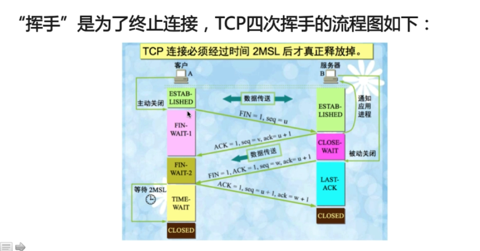
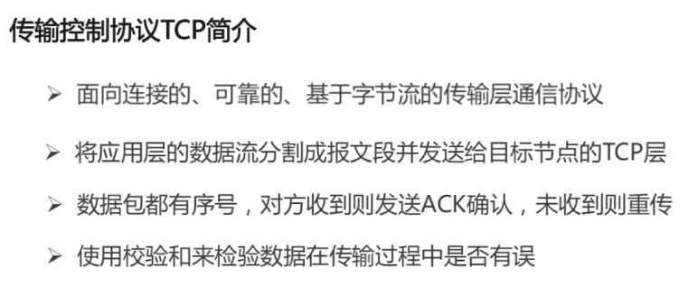
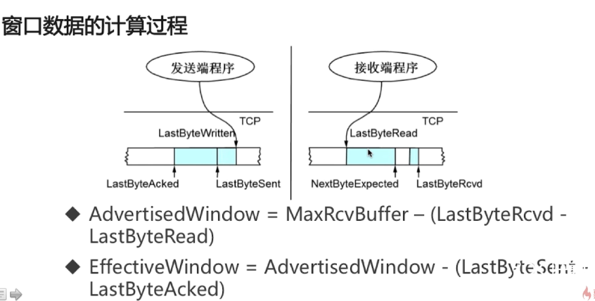
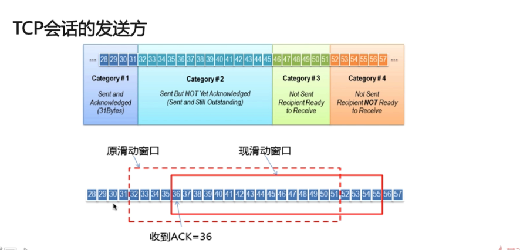
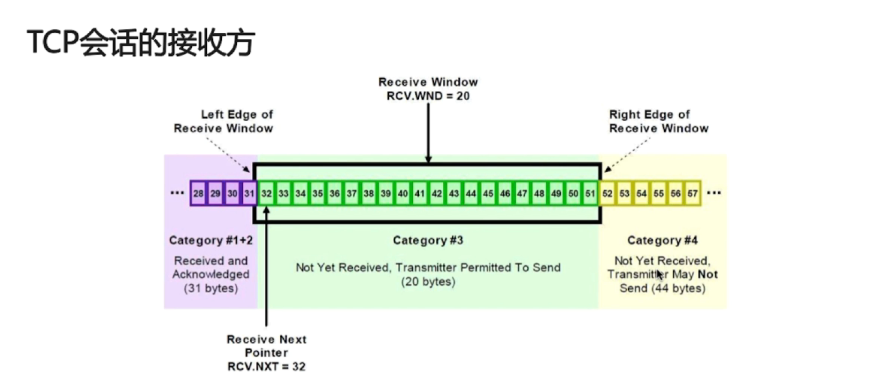
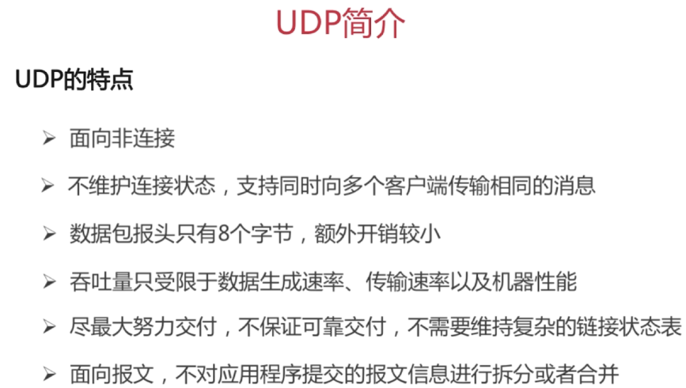
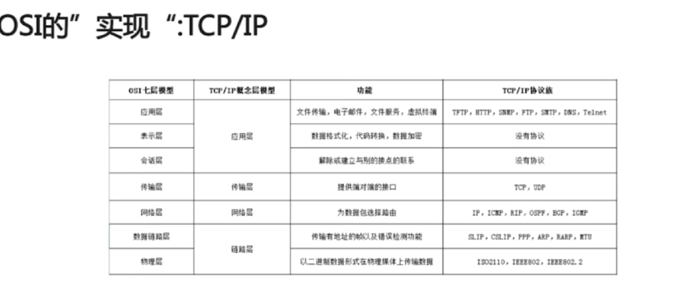
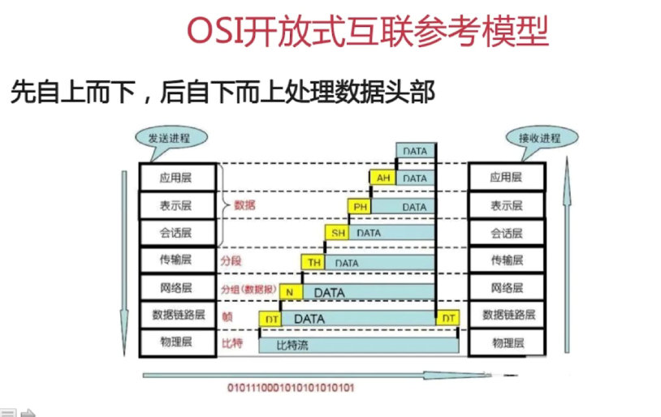
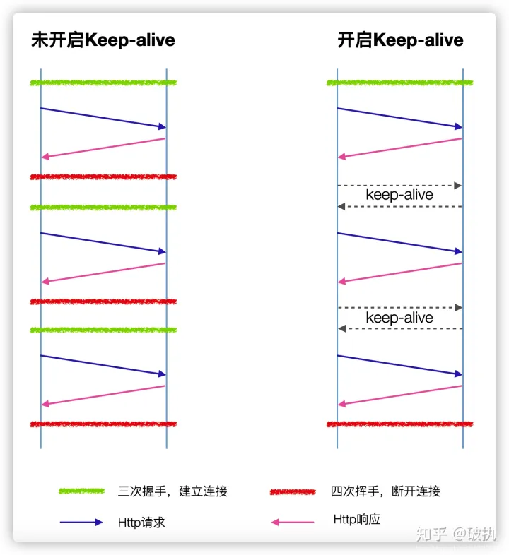

# 网络协议

## TCP协议

### TCP 三次握手

#### TCP 三次握手的流程

TCP协议是全双工的，既双方都可以发送消息 ， TCP中的 三次握手的基本原理和 SEQ 以及 ACK的序号如下：

```
[SYN] SEQ=0，ACK=0 ###client-> server

[SYN,ACK] SEQ=0，ACK=1 ###server-> client

[ACK] SEQ=1，ACK =1 ###client-> server

----上面是 三次握手过程 下面是实际发送数据

[PSH,ACK] SEQ=1,ACK=1 lenth=12	###client-> server

[ACK] SEQ=1, ACK=13 lenth=0	###server-> client

[ACK] SEQ=1, ACK=13	lenth=50	###server-> client

[ACK] SEQ=13, ACK=51	lenth=0	###client-> server

	由于TCP是 全双工通道，所以 client 端维护的 SEQ 是 自己发送的数据的序列号，而 server端 维护的也是自己发送的序列号，（由于tcp是传输层协议，默认会将 数据分割成多个报文段进行发送，不同于 http请求，既请求->回应一说），所以各个端点所维护的SEQ 是不一样的，client 端 维护的SEQ表示client端 所发出去的数据，而 server端 则表示server端发出去的数据，因为 一个http请求会被分割成多个报文段进行传输，所以需要 seq 来进行维持，假如说用户请求一个网站，那么用户这边请求数据会被分割成多个报文段发送至服务器端（假如这里是顺序发送的），服务器端需要把接收到的数据 全部整合起来以后才知道用户到底是在请求哪个url，request body中又携带了什么数据。
	
	以第一个数据举例
	[PSH,ACK] SEQ=1,ACK=1 lenth=12	###client-> server
	这表示 当前 client 往server端 发送了长度为12的字节数据
	[ACK] SEQ=1,ACK=13 lenth=0	###server-> client
	当服务端接收到这个消息之后，会发送一个ack=13的消息给server端，ack=13 表示serever端已经接收到了这12字节的数据。
	[PSH,ACK] SEQ=1,ACK=13	lenth=50	###server-> client
	然后server端又向client端发送了 50字节的数据
	[ACK] SEQ=13,ACK=51	lenth=0	###client-> server
	client 接收到数据以后发送一个ack请求给client端，表示这50字节的数据已经接受，seq = 13 就是代表了这是 client端点发送数据包的累加长度，
	
	======================================================
	用户 --＞　服务器
	
	client--> server  
	
	用户的请求会被分割为多个数据包，假如为  client1,client2,client3 三个数据包，client1数据包有10字节，client2 也有10字节，client3 有5个字节
	
	那么 client的seq最终就是为 25 ，这表示client端所发送的数据包的大小（三次握手初始化的seq先不放进去），server端 也是如此
	
	client 每发一条数据，server端就需要回应一条 ack请求（len=0）表示client端发送的数据已经收到了，
ack就等于上次发送数据的seq的值加上给server端发送数据的lenth长度。（假如上次发送的seq值为20，又发了30字节数据，那么ack就等于50）


三次握手
[SYN] SEQ=0，ACK=0 len=1 		###client-> server

[SYN,ACK] SEQ=0，ACK=1 len=1 	###server-> client

[ACK] SEQ=1，ACK =1     	###client-> server

这三次握手就可以看成是每一次发送了1个字节的数据
client端先发送了一个消息并且len=1
server端收到这个消息之后给client端返回一个ack请求并且将ack置为1，表示 server端已经收到了这1个字节的数据，然后发送给client端一个字节数据
然后client端给server端发送一个ack请求，表示client端也收到了这一个字节的数据，将 ack表示为1

简要的说 就是 client端维护的ack 就等于 server端下一次发送的seq ，server端的ack就等于 client端下一次发送的seq.

######
三次握手并不是实际的要发送一个1字节长度的值，而是协议规定握手期间每一次请求都会消耗1个 seq 数值，所以三次握手下来 双方的seq 都被置为了1，三次握手就是为了初始化双方seq的值，将其全部置为1
```


#### TCP 三次握手的原因

1、三次握手并不是实际的要发送一个1字节长度的值，而是协议规定握手期间每一次请求都会消耗1个 seq 数值，所以三次握手下来 双方的seq 都被置为了1，三次握手就是为了初始化双方seq的值，将其全部置为1

2、如果是两次握手的话 并不能保证服务端或者是客户端能收到对方发送的信息，比如说

- 客户端发送给服务端，如果在两次握手的情况下，不关注服务端是否能收到消息那就可能会导致消息丢失，

- 服务端发送给客户端，如果不关注客户端的返回结果那一样可能会导致信息丢失


### TCP 四次挥手

#### TCP 四次挥手流程



1、客户端发送FIN 包通知服务端要关闭连接,客户端进入 ESTAB-LISHED状态

2、服务端在收到客户端发送的FIN包之后回复ACK 表示服务端要关闭连接了，并且进入CLOSE_WAIT 状态

3、经过close_wait time时间后服务端发送FIN包给客户端表示服务端的数据包已经发送完成，服务端进LAST-ACK状态

4、客户端在收到服务端的FIN包后会回复ACK，并且进入TIME_WAIT状态，并且等待time_wait time之后进行关闭

```
client -> server [FIN] 主动发送 关闭请求 
server -> client [ACK] 确认收到 client端发送的数据包，但是有些数据包可能还没有发送完成
server -> client [FIN,ACK] 全部发送完成之后才能发送关闭请求
clieng -> server [ACK] 表示client也收到了server端的关闭请求，来进行关闭
```


#### CLOSE_WAIT 与 TIME_WAIT

**CLOSE_WAIT **

表示服务器端接收到 客户端的第一次挥手请求，将状态更改为半关闭状态，这个时候服务器还是可以发送ack包给客户端的，等到服务器将数据全部发送完毕之后，将会发送第三次挥手的[FIN,ACK] 请求表示服务端的数据已经发送完成了。


**TIME_WAIT**

表示已经接收到服务器端发送的[FIN,ACK]请求，代表服务器端的数据已经全部发送完毕了，客户端需要返回一条 ack请求 给服务器端，来告知服务器端 可以完全关闭了。

- TIME_WAIT状态表示 需要有足够的时间让 对方收到ack包，如过被动方没有收到ack包，就会重发FIN包，
- **如果不等待TIME_WAIT 时间而直接关闭，就会导致新的socket绑定该端口后接收到客户端发送过来的老数据**


### TCP/IP如何保证可靠性

说说TCP头的结构 ？




```
TCP的请求头包括，

src port，

dst port，

SEQ number（表示当前携带报文段的起始值+ 数据实际的大小），

ack number（期望收到对方下一个报文的第一个字节的序号，B收到A发送过来的报文，序号为301，字段值为200字节，就说明B收到了 301+200 到500的字节，那么B 期望收到A 下一个发送数据字节的序号为501）

Offset 

TCP Flags：

	URG:紧急指针标志

	ACK: 确认序号表示，为1 表示确认确认号有效，为0表示报文中不含确认信息

	PSH：提示接收端应用程序应该立即从tcp接受缓冲区中读走数据，为后续接收的数据让出空间 

	RST：表示要求对方重建连接。因为一些原因断开连接进行重新发送的数据 

	SYN：同步序号，表示建立一个连接

	FIN标志：表示告知对方本端要关闭连接了。 

WINDOW窗口：

表示 滑动窗口的大小，。               发送端和接收端的缓存大小，以此控制发送端发送数据的速率，达到流量控制


CheckSum：

 校验和

	由发送端填充，接收端对tcp报文段执行CRC算法以检验TCP报文段在传输过程中是否损坏。注意这个校验不仅包括tcp头部，也包括数据部分。这也是tcp可靠传输的一个重要保障


紧急指针：是一个正偏移量，与序号字段中的值相加表示紧急数据最后一个字节的序号。TCP的紧急方式是发送端向另一端发送紧急数据的一种方式  

```


TCP如何保证可靠性

1）应用数据被分割成TCP认为最合适发送的数据块。称为段（Segment）传递给IP层
2）当TCP发出一个段后，它会启动一个定时器，等待目的端确认收到这个报文段。若没有及时收到确认，将重新发送这个报文段
3）当TCP收到发自TCP连接另一端的数据，它将发送一个确认。这个确认不是立即发送的，通常将推迟几分之一秒。
4）TCP将保持它首部和数据的校验和，这是一个端到端的校验和，目的是检测数据在传输过程中的任何变化。如果收到段的校验和有差错，TCP将丢弃这个报文也不进行确认（对方就会重复发送了）。
5）TCP承载与IP数据报来传输，而IP数据报可能会失序，所以TCP的报文段到达时也可能会失序。但是TCP收到数据后会重新排序到正确的顺序（通过序号）。
6）IP数据报会发生重复，TCP的接收端必须丢弃重复是数据
7）TCP还能提供流量控制，TCP连接的每一方都有一定大小的缓冲空间


### Tcp的滑动窗口

```
TCP的滑动窗口是结合于 TCP头部中的 window的大小

RTT 和 RTO
	RTT : 发送一个数据包到收到对应ACK，所花费的时间
	RTO：重传时间间隔（根据RTT来计算出来的）
	
TCP使用滑动窗口做流量控制和乱序重排
	保证TCP的可靠性
	保证TCP的流控特性

TCP的 计算属性表达式：
	
	发送端程序
	--------------------
	
```




```
LastByteAcked 最后收到ack恢复的位置
LastByteWritten 已经发送但是还没收到ack恢复的
LastByteSent 发送还没收到ack恢复的位置

AdversitisedWindow：能够接受数据包的大小，接受方能够处理的数据量

EfferctiveWindow：能够发送的数据包的大小，发送方能够发送的数据量的大小

```



滑动窗口滑动时，必须保证数据连续性被确认，就是32,33,34,35,都被确认以后才会滑动，如过只有34被确认是不会滑动的




### TCP粘包和拆包产生的原因?

粘包：发送方开启Nangle算法后会进行延迟发送，这样就会导致发送的数据时粘在一起的，比如发送 ab、cb 最后发送出的数据时abcd

拆包：当发送数据时接收方的SO_RECV无法接收这么大的数据包，就会拆开接收，这个时候接收数据时就会分散，比如发送abcd，接收到每次接收两个字节，那么分别接收到 ab、cd


## UDP协议

UDP（UserDatagramProtocol）是一个简单的面向消息的传输层协议，尽管UDP提供标头和有效负载的完整性验证（通过校验和），但它不保证向上层协议提供消息传递，并且UDP层在发送后不会保留UDP 消息的状态。因此，UDP有时被称为不可靠的数据报协议。如果需要传输可靠性，则必须在用户应用程序中实现。

UDP使用具有最小协议机制的简单无连接通信模型。UDP提供数据完整性的校验和，以及用于在数据报的源和目标寻址不同函数的端口号。它没有握手对话，因此将用户的程序暴露在底层网络的任何不可靠的方面。如果在网络接口级别需要纠错功能，应用程序可以使用为此目的设计的传输控制协议（TCP）。

综上所述：

UDP是基于IP的简单协议，不可靠的协议。

UDP的优点：简单，轻量化。

UDP的缺点：没有流控制，没有应答确认机制，不能解决丢包、重发、错序问题。

这里需要注意一点，并不是所有使用UDP协议的应用层都是不可靠的，应用程序可以自己实现可靠的数据传输，通过增加确认和重传机制，所以使用UDP 协议最大的特点就是速度快




## 协议模型

### TCP的四层模型是什么？




### OSI的七层模型




## HTTP

### Http 1

#### TransferEncoding

TransferEncoding 是相对于Content-Length而言的，在一些场景中由于一些ResponseBody太大，或者是Response是动态生成的，我们无法数据的总长度，这个时候我们就需要通过TransferEncoding: chunked 来进行标识，

1、对于动态生成的应答内容来说，内容在未生成完成前总长度是不可知的。使用该响应头字段能解决响应请求前必须先计算响应体大小（Content-Length）的问题，填充Content-Length。

2、分块传输编码允许服务器在最后发送消息头字段。例如在头中添加散列签名。

3、对于压缩传输传输而言，可以一边压缩一边传输。

> 对于Http Response Header 中出现Transfer-Encdoing的请求，表示响应的消息提格式是由若干个块组成，每个数据块与数据块之间使用\r\n来进行分割，直到出现\r\0 表示数据传输结束


**注意：在使用Spring boot 开发时，如果我们返回的数据是对象而非String，那么返回的数据就是以TransferEncoding: chundked的形式来传输，并且如果我们ResponseHeader中没有设置Content-Length时，也会以Transfer-Encoding: chundked的形式传输**


### multipart-form

multipart-form 一般是针对文件表单文件上传的请求，一般在RequestBody中会划分不同的RequestPart用于区分文件以及请求体，请求示例如下：
```
POST http://iot-ai.alpha.turingapi.com/public/homework/upload
Content-Type: multipart/form-data; boundary=WebAppBoundary

--WebAppBoundary
Content-Disposition: form-data; name="encrypt_data"
# 对于Part = encrypt_data的部分，通过设置ContentType来标识当前的数据格式为json格式
Content-Type: application/json

{
   "apiKey": "bdc7d2c0b5354991871d12a8951ac337",
   "timestamp": null,
   "data": "qgrMEPAXVdHzFgryGhdpUXqRlUKoOnVRhtm75P7hGmRksHiFomROn7SR3+UnCfEfX/dJ7Rr9EdWQKDy2hPWzfA==",
   "sign": "",
   "unEncryptedData": null
}
--WebAppBoundary
Content-Disposition: form-data; name="homework_image"; filename="homework_1.jpg"

< D:\111.jpg
--WebAppBoundary--

```

上面的 `--WebAppBoundary` 用于分割不同的Request Part，其中每一部分的Part都有`name` 这个属性，用于为不同的Part进行命名, 并且在每一个Request Part 内部我们可以通过设置相应的 RequestHeaders来区分不同Part 的 不同内容数据


#### Range 与 ContentRanges


#### Refer


## Http 2


## KeepAlive

KeepAlive 表示在开启tcp连接以后，不会在使用完成以后就关闭，而是会一直保持当前连接，这样可以减少tcp的三次握手和四次挥手，已达到提高性能的目的

### TCP

TCP 开启长连接的参数为 SO_KEEPALIVE ，通过jdk提供的SocketChannel.setOptions来进行设置

**在双方长时间未通讯时，如何得知对方还活着？如何得知这个TCP连接是健康且具有通讯能力的？**

TCP的保活机制就是用来解决此类问题，这个机制我们也可以称作：keepalive。保活机制默认是关闭的，TCP连接的任何一方都可打开此功能。有三个主要配置参数用来控制保活功能。

如果在一段时间（**保活时间：tcp_keepalive_time**）内此连接都不活跃，开启保活功能的一端会向对端发送一个保活探测报文。

- 若对端正常存活，且连接有效，对端必然能收到探测报文并进行响应。此时，发送端收到响应报文则证明TCP连接正常，重置保活时间计数器即可。
- 若由于网络原因或其他原因导致，发送端无法正常收到保活探测报文的响应。那么在一定**探测时间间隔（tcp_keepalive_intvl）**后，将继续发送保活探测报文。直到收到对端的响应，或者达到配置的**探测循环次数上限（tcp_keepalive_probes）**都没有收到对端响应，这时对端会被认为不可达，TCP连接随存在但已失效，需要将连接做中断处理。


三个参数**保活时间：tcp_keepalive_time、探测时间间隔：tcp_keepalive_intvl、探测循环次数：tcp_keepalive_probes**。

这三个参数，在linux上可以在`/proc/sys/net/ipv4/`路径下找到，或者通过`sysctl -a | grep keepalive`命令查看当前内核运行参数。

```bash
[root@vm01 ~]# cd /proc/sys/net/ipv4
[root@vm01 ipv4]# pwd
/proc/sys/net/ipv4
[root@vm01 ipv4]# cat /proc/sys/net/ipv4/tcp_keepalive_time
7200
[root@vm01 ipv4]# cat /proc/sys/net/ipv4/tcp_keepalive_probes
9
[root@vm01 ipv4]# cat /proc/sys/net/ipv4/tcp_keepalive_intvl
75
[root@vm01 ipv4]# sysctl -a | grep keepalive
net.ipv4.tcp_keepalive_time = 7200
net.ipv4.tcp_keepalive_probes = 9
net.ipv4.tcp_keepalive_intvl = 75
```

- 保活时间（tcp_keepalive_time）默认：7200秒
- 保活时间间隔（tcp_keepalive_intvl）默认：75秒
- 探测循环次数（tcp_keepalive_probes）默认：9次

也就是默认情况下一条TCP连接在2小时（7200秒）都没有报文交换后，会开始进行保活探测，若再经过9*75秒=11分钟15秒的循环探测都未收到探测响应，即共计：2小时11分钟15秒后会自动断开TCP连接


### HTTP

在早期的http1.0中，默认就是上述介绍的这种“请求-应答”模式。这种方式频繁的创建连接和销毁连接无疑是有一定性能损耗的。

所以引入了**keep-alive**机制。http1.0默认是关闭的，通过http请求头设置“connection: keep-alive”进行开启；http1.1中默认开启，通过http请求头设置“connection: close”关闭。

**keep-alive**机制：若开启后，在一次http请求中，服务器进行响应后，不再直接断开TCP连接，而是将TCP连接维持一段时间。在这段时间内，如果同一客户端再次向服务端发起http请求，便可以复用此TCP连接，向服务端发起请求，并重置timeout时间计数器，在接下来一段时间内还可以继续复用。这样无疑省略了反复创建和销毁TCP连接的损耗。




### Http的KeepAlive 与 Tcp的KeepAlive有什么区别

1、TCP连接往往就是我们广义理解上的长连接，因为它具备双端连续收发报文的能力；开启了keep-alive的HTTP连接，也是一种长连接，但是它由于协议本身的限制，服务端无法主动发起应用报文。

2、TCP中的keepalive是用来保鲜、保活的；HTTP中的keep-alive机制主要为了让支撑它的TCP连接活的的更久，所以通常又叫做：HTTP persistent connection（持久连接） 和 HTTP connection reuse（连接重用）。


## Websocket


