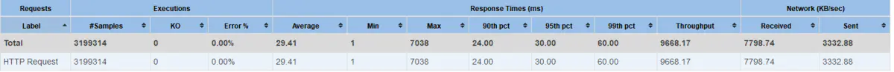

# 高并发

## 各组件的并发能力基线

1）Nginx：一个高性能的Web-Server和实施反向代理的软件

2）LVS：Linux Virtual Server，使用集群技术，实现在Linux操作系统层面的一个高性能、高可用、负 载均衡服务器

3）Keepalived：一款用来检测服务状态存活性的软件，常用来做高可用

4）F5：一个高性能、高可用、负载均衡的硬件设备

5）DNS轮询：通过在DNS-Server上对一个域名设置多个IP解析，来扩充Web-Server性能及实施负载均 衡的技术

### Tomcat 

tomcat 默认配置的最大请求数是150，也就是说同时支持150个并发。具体能承载多少并发，需要看硬 件的配置，CPU 越多性能越高，分配给JVM的内存越多性能也就越高，但也会加重GC的负担。当 某个应用拥有 250 个以上并发的时候，应考虑应用服务器的集群。

> 一般来说，虽然tomcat的io线程最多控制在400以内，如果每个请求要300ms，一个线程3qps， 那么一个tomcat到达1000qps，还是可以的。

所以，tomcat参考的并发能力为 1000qps


### Nginx的并发能力

看到这里，这个框架的弱点仍然是Nginx结点的并发问题和单点故障。 对于Nginx的抗并发能力，官方给出的是5w并发量，即轻轻松松处理5w的并发访问。 对比tomcat，之所以有这么大抗并发，主要原因有两个： 一是Nginx只做请求和响应的转发而没有业务逻辑处理，大部分的时间花在与其他计算的I/O上； 二是Nginx的I/O采用的是单线程或少线程、异步非阻塞的模式（Tomcat是一个连接一个线程，同步阻 塞的模式），避免了打开I/O通道等待数据传输的过程（仅仅是在数据传到了，再来接收即可），极大 的缩短了线程调度和I/O处理的时间


### MySQL

#### MySQL数据库查询能力

- 主键查询：千万级别数据 = 1~10 ms ， 4核心 8线程 为 1000qps* 8=8000qps
- 唯一索引查询：千万级别数据 = 10~100 ms ， 4核心 8线程 为 100qps* 8=800qps
- 非唯一索引查询：千万级别数据 = 100~1000 ms ， 4核心 8线程 为 10qps* 8=80qps
- 无索引：百万条数据 = 1000 ms+

综合来说，mysql的并发能力，大概在1500qps左右


#### MySQL数据库事务能力 

更新删除（与查询相同） 插入操作，依赖于配置优化，比查询的效率低


#### MySQL数据库事务能力

- 更新删除（与查询相同） 

- 插入操作，依赖于配置优化，比查询的效率低


#### MySQL的连接数限制

MySQL默认配置的最大连接数是151。可以将最大连接数设置的最大值为100000。一般情况在Linux系 统中建议设置为500-1000。


### Redis 单机性能测试

> Redis 单机为5w QPS左右。

由于生产环境下业务服务器总响应延迟需要控制在100ms内，为了尽量减少日志输出环节的耗时，考虑 将日志吐到redis中缓存，由其他程序异步的从redis中取数据。在生产环境改造日志数据系统之前，对 单机的redis读写性能做了测试。

测试单实例 redis的 读写list 数据结构性能


### Springcloud Gateway

> 单节点可以按照 预估

一次8核8G压测结果： 

```
并发数：300；

netty工作线程数（reactor.netty.ioWorkerCount）：8（默认） 

样本数据：返回1.5k大小 

服务端响应时间：10ms左右

测试时长：5分钟

JVM内存：2G
```




## 缓存


### 堆外缓存


### redis缓存


### 堆内缓存

